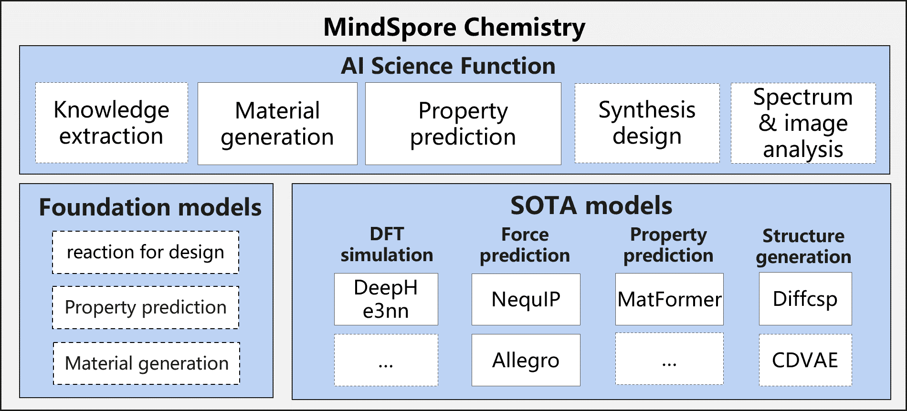

MindSpore Chemistry
=====================

Introduction
------------

Conventional chemistry studies have long been confronted with numerous
challenges. The process of experimental design, synthesis,
characterization, and analysis can be time-consuming, costly, and highly
dependent on experts’ experiences. The synergy between AI and chemistry
offers unprecedented opportunities to overcome the limitations of
conventional approaches and unlock new frontiers in scientific discovery
and innovation. AI techniques can efficiently process vast amount of
data, mining underneath patterns and generating predictive models. By
leveraging AI, chemistry and material science researchers can accelerate
the design and optimization of chemical processes and the design and
analysis of novel materials.

**MindSpore Chemistry**\ (MindChemistry) is a toolkit built on MindSpore
endeavoring to integrate AI with conventional chemistry research. It
supports multi-scale tasks including molecular generation, property
prediction and synthesis optimization on multiple chemistry systems such
as organic, inorganic and composites chemistry systems. MindChemistry
dedicates to enabling the joint research of AI and chemistry with high
efficiency, and seek to facilitate an innovative paradigm of joint
research between AI and chemistry, providing experts with novel
perspectives and efficient tools.

Latest News
-----------
- `2025.03.30` MindChemistry 0.2.0 has been released, featuring several powerful applications, including NequIP, Allegro, DeephE3nn, Matformer, and DiffCSP.
- `2024.07.30` MindChemistry 0.1.0 has been released.

Features
--------

Applications
~~~~~~~~~~~~

-  **Force Prediction**\ :

   -  **Scenario**\ : Organic chemistry
   -  **Dataset**: Revised Molecular Dynamics 17(rMD17). rMD17 dataset
      includes molecular dynamics simulations of multiple organic
      chemical moleculars. It provides chemical desciptive information
      such as the atomic numbers and positions as well as molecular
      property information such as energies and forces.
   -  **Task**\ : Molecular energy prediction. We integrate the NequIP
      model [1] and Allegro model [2], according to the position of each
      atom in the molecular system and structure description of the
      atomic number information construction diagram, and calculate the
      energy of the molecular system based on the equivariant
      calculation and graph neural network.

.. figure:: ./images/nequip.png
   :alt: MindSpore nequip Architecture

-  **DFT Prediction**\ :

   -  **Scenario**: Materials Chemistry
   -  **Dataset**: Bilayer graphene dataset. The dataset contains
      descriptive information such as atomic positions and atomic
      numbers, as well as property information such as Hamiltonian.
   -  **Task**: Density Functional Theory Hamiltonian Prediction. We
      integrate the DeephE3nn model [3], an equivariant neural network based
      on E3, to predict a Hamiltonian by using the structure of atoms.

-  **Property Prediction**:

   -  **Scenario**: Materials Chemistry
   -  **Dataset**: JARVIS-DFT 3D dataset. The dataset contains
      descriptive information such as atomic position and atomic number
      of crystal materials, as well as property information such as
      energy and force field.
   -  **Task**: Prediction of crystalline material properties. We
      integrate the Matformer model [4] based on graph neural networks and
      Transformer architectures, for predicting various properties of
      crystalline materials.

-  **Structure Generation**:

    - **Scenario**: Materials Chemistry
    - **Dataset**:

      - Perov-5: A perovskite dataset in which each unit cell contains five fixed atoms, and the structures are relatively similar.
      - Carbon-24: A carbon crystal dataset, where each crystal contains between 6 and 24 carbon atoms, with various different material structures.
      - MP-20: A dataset collected from the MP database, featuring experimental structures with up to 20 atoms per unit cell. The materials and structures are highly diverse.
      - MPTS-52: An advanced version of MP-20, expanding the number of atoms per unit cell to 52. The materials and structures are highly diverse.
    - **Task**: Crystal material structure prediction. We integrated the DiffCSP model [5], which is based on a graph neural network and diffusion model architecture, to predict the crystal material structures given their composition.

Installation
------------

Version Dependency
~~~~~~~~~~~~~~~~~~

Because MindChemistry is dependent on MindSpore, please click `MindSpore
Download Page <https://www.mindspore.cn/versions>`__ according to the
corresponding relationship indicated in the following table. Download
and install the corresponding whl package.

============= ====== ========= ======
MindChemistry Branch MindSpore Python
============= ====== ========= ======
master        master >=2.3     >=3.8
0.2.0         r0.7   >=2.5.0   >=3.11
0.1.0         r0.6   >=2.2.12  >=3.8
============= ====== ========= ======

Dependency
~~~~~~~~~~

.. code:: bash

   pip install -r requirements.txt

Hardware
~~~~~~~~

+--------------------------+-----------------+--------+
| Hardware                 | os              | Status |
+==========================+=================+========+
| AtlasA2 training series  | Ubuntu-x86      | ✔️     |
+--------------------------+-----------------+--------+
|                          | Ubuntu-aarch64  | ✔️     |
+--------------------------+-----------------+--------+
|                          | EulerOS-aarch64 | ✔️     |
+--------------------------+-----------------+--------+
|                          | CentOS-x86      | ✔️     |
+--------------------------+-----------------+--------+
|                          | CentOS-aarch64  | ✔️     |
+--------------------------+-----------------+--------+

source code install
~~~~~~~~~~~~~~~~~~~

-  **Download source code from Gitee**

   .. code:: bash

      git clone https://gitee.com/mindspore/mindscience.git
      cd {PATH}/mindscience/MindChemistry

-  **Compile in Ascend backend**

   .. code:: bash

      bash build.sh -e ascend -j8

-  **Install whl package**

   .. code:: bash

      cd {PATH}/mindscience/MindChemistry/output
      pip install mindchemistry_*.whl

Community
---------

Core Contributor
~~~~~~~~~~~~~~~~

Thanks goes to these wonderful people:

wujian, wangyuheng, Lin Peijia, gengchenhua, caowenbin, Siyu Yang

Contribution Guide
------------------

-  Please click here to see how to contribute your code: `Contribution
   Guide <https://gitee.com/mindspore/mindscience/blob/master/CONTRIBUTION.md>`__

License
-------

`Apache License 2.0 <http://www.apache.org/licenses/LICENSE-2.0>`__

References
----------

[1] Batzner S, Musaelian A, Sun L, et al. E(3)-equivariant graph neural networks for data-efficient and accurate interatomic potentials[J]. Nature communications, 2022, 13(1): 2453.

[2] Musaelian A, Batzner S, Johansson A, et al. Learning local equivariant representations for large-scale atomistic dynamics[J]. Nature communications, 2023, 14(1): 579.

[3] Xiaoxun Gong, He Li, Nianlong Zou, et al. General framework for E(3)-equivariant neural network representation of density functional theory Hamiltonian[J]. Nature communications, 2023, 14: 2848.

[4] Keqiang Yan, Yi Liu, Yuchao Lin, Shuiwang ji, et al. Periodic Graph Transformers for Crystal Material Property Prediction[J]. arXiv:2209.11807v1 [cs.LG] 23 sep 2022.

[5] Jiao Rui and Huang Wenbing and Lin Peijia, et al. Crystal structure prediction by joint equivariant diffusion[J]. Advances in Neural Information Processing Systems, 2024, 36.

.. toctree::
   :maxdepth: 1
   :caption: Quick Start
   :hidden:

   quick_start/quick_start

.. toctree::
   :glob:
   :maxdepth: 1
   :caption: User Guide
   :hidden:

   user/structure_generation
   user/molecular_prediction

.. toctree::
   :maxdepth: 1
   :caption: API References
   :hidden:

   mindchemistry.cell
   mindchemistry.e3
   mindchemistry.utils

.. toctree::
   :glob:
   :maxdepth: 1
   :caption: RELEASE NOTES
   :hidden:

   RELEASE