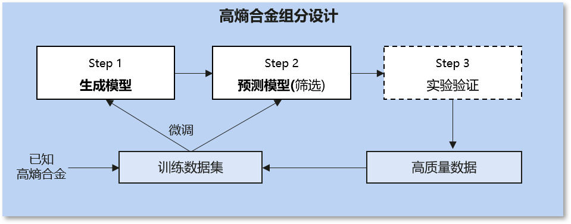

MindSpore Chemistry文档
=======================

介绍
----

传统化学研究长期以来面临着众多挑战，实验设计、合成、表征和分析的过程往往耗时、昂贵，并且高度依赖专家经验。AI与化学的协同可以克服传统方法的局限性、开拓全新的研究范式，结合AI模型与化学知识，可以高效处理大量数据、挖掘隐藏的关联信息，构建仿真模型，从而加快化学反应的设计和优化，实现材料的性质预测，并辅助设计新材料。

**MindSpore
Chemistry**\ （MindChemistry）是基于MindSpore构建的化学领域套件，支持多体系（有机/无机/复合材料化学）、多尺度任务（微观分子生成/预测、宏观反应优化）的AI+化学仿真，致力于高效使能AI与化学的融合研究，践行和牵引AI与化学联合多研究范式跃迁，为化学领域专家的研究提供全新视角与高效的工具。

.. figure:: ./images/mindchemistry_archi_cn.png
   :alt: MindSpore Chemistry Architecture

最新消息
--------

-  ``2024.07.30`` 2024年7月30日 MindChemistry 0.1.0版本发布。

特性
----

应用案例
~~~~~~~~

-  **分子生成**\ ：

   -  **体系**\ ：无机化学
   -  **数据**\ ：高熵合金数据集。高熵合金数据集中包含了已知高熵合金的组分以及热动力学性质等信息，提供金属组分类型及组分比例，以及居里温度、磁致伸缩等热动力学性质信息。
   -  **任务**\ ：高熵合金组分设计。我们集成了基于主动学习进行高熵合金设计的方法[1]，设计热膨胀系数极低的高熵合金组分。在主动学习流程中，首先基于AI模型生成候选的高熵合金组分，并基于预测模型和热动力学计算预测热膨胀系数对候选组分进行筛选，最终需要研究者基于实验验证确定最终的高熵合金组分。

-  **分子预测**\ ：

   -  **体系**\ ：有机化学
   -  **数据**\ ：Revised Molecular Dynamics
      17(rMD17)数据集。rMD17数据集包含了多种有机化合物的分子动力学性质，提供化合物的原子位置、原子数等描述信息以及能量、力场等性质信息。
   -  **任务**\ ：分子能量预测。我们集成了NequIP模型[2]、Allegro模型[3]，根据分子体系中各原子的位置与原子数信息构建图结构描述，基于等变计算与图神经网络，计算出分子体系能量。

.. figure:: ./images/nequip_cn.png
   :alt: MindSpore nequip Architecture

-  **电子结构预测**\ ：

   -  **体系**\ ：材料化学
   -  **数据**\ ：双层石墨烯数据集。该数据集包含了原子位置、原子数等描述信息以及哈密顿量等性质信息。
   -  **任务**\ ：密度泛函理论哈密顿量预测。我们集成了DeephE3nn模型[4]，基于E3的等变神经网络，利用原子的结构去预测其的哈密顿量。

-  **晶体材料性质预测**\ ：

   -  **体系**\ ：材料化学
   -  **数据**\ ：JARVIS-DFT
      3D数据集。该数据集包含了晶体材料的原子位置、原子数等描述信息以及能量、力场等性质信息。
   -  **任务**\ ：晶体材料性质预测。我们集成了Matformer模型[5]，基于图神经网络和Transformer架构的模型，用于预测晶体材料的各种性质。

功能模块
~~~~~~~~

-  **等变计算库**

   -  **简介**\ ：对称性是科学领域的重要性质。等变神经网络以具有物理意义表征刻画化合物体系输入，并使得输入与输出在空间平移、旋转和反演等变换中具有等变性。使用等变神经网络来对科学场景建模可以提高数据的表征效率和模型的训练效率。
   -  **核心模块**\ ：等变计算库中集成了不可约表示、球谐函数以及张量积等基础模块，实现底层逻辑与运算过程，并基于基础模块构建了等变激活层、等变线性层和等变卷积层等神经网络层，可以更方便地调用从而构建等变神经网络。

.. figure:: ./images/e3_cn.png
   :alt: MindSpore e3 Architecture

安装教程
--------

版本依赖关系
~~~~~~~~~~~~

由于MindChemistry与MindSpore有依赖关系，请根据下表中所指示的对应关系，在\ `MindSpore下载页面 <https://www.mindspore.cn/versions>`__\ 下载并安装对应的whl包。

============= ====== ========= ======
MindChemistry 分支   MindSpore Python
============= ====== ========= ======
master        master >=2.3     >=3.8
0.1.0         r0.6   >=2.2.12  >=3.8
============= ====== ========= ======

依赖安装
~~~~~~~~

.. code:: bash

   pip install -r requirements.txt

硬件支持情况
~~~~~~~~~~~~

+---------------------+-----------------+------+
| 硬件平台            | 操作系统        | 状态 |
+=====================+=================+======+
| Atlas A2训练系列产品| Ubuntu-x86      | ✔️   |
+---------------------+-----------------+------+
|                     | Ubuntu-aarch64  | ✔️   |
+---------------------+-----------------+------+
|                     | EulerOS-aarch64 | ✔️   |
+---------------------+-----------------+------+
|                     | CentOS-x86      | ✔️   |
+---------------------+-----------------+------+
|                     | CentOS-aarch64  | ✔️   |
+---------------------+-----------------+------+

源码安装
~~~~~~~~

-  **从Gitee下载源码**

   .. code:: bash

      git clone https://gitee.com/mindspore/mindscience.git
      cd {PATH}/mindscience/MindChemistry

-  **编译昇腾Ascend后端源码**

   .. code:: bash

      bash build.sh -e ascend

-  **安装编译所得whl包**

   .. code:: bash

      cd {PATH}/mindscience/MindChemistry/output
      pip install mindchemistry_*.whl

社区
----

核心贡献者
~~~~~~~~~~

感谢以下开发者做出的贡献：

yufan, wangzidong, liuhongsheng, gongyue, gengchenhua, linghejing,
yanchaojie, suyun, wujian, caowenbin

贡献指南
--------

-  如何贡献您的代码，请点击此处查看：\ `贡献指南 <https://gitee.com/mindspore/mindscience/blob/master/CONTRIBUTION.md>`__

许可证
------

`Apache License 2.0 <http://www.apache.org/licenses/LICENSE-2.0>`__

引用
----

[1] Rao Z, Tung P Y, Xie R, et al. Machine learning-enabled high-entropy
alloy discovery[J]. Science, 2022, 378(6615): 78-85.

[2] Batzner S, Musaelian A, Sun L, et al. E(3)-equivariant graph neural
networks for data-efficient and accurate interatomic potentials[J].
Nature communications, 2022, 13(1): 2453.

[3] Musaelian A, Batzner S, Johansson A, et al. Learning local
equivariant representations for large-scale atomistic dynamics[J].
Nature communications, 2023, 14(1): 579.

[4] Xiaoxun Gong, He Li, Nianlong Zou, et al. General framework for
E(3)-equivariant neural network representation of density functional
theory Hamiltonian[J].
Nature communications, 2023, 14: 2848.

[5] Keqiang Yan, Yi Liu, Yuchao Lin, Shuiwang ji, et al. Periodic
Graph Transformers for Crystal Material Property Prediction[J].
arXiv:2209.11807v1 [cs.LG] 23 sep 2022.

.. toctree::
   :maxdepth: 1
   :caption: 快速入门
   :hidden:

   quick_start/quick_start

.. toctree::
   :glob:
   :maxdepth: 1
   :caption: 使用者指南
   :hidden:

   user/molecular_generation
   user/molecular_prediction

.. toctree::
   :maxdepth: 1
   :caption: API参考
   :hidden:

   mindchemistry.cell
   mindchemistry.e3
   mindchemistry.utils

.. toctree::
   :glob:
   :maxdepth: 1
   :caption: RELEASE NOTES
   :hidden:

   RELEASE