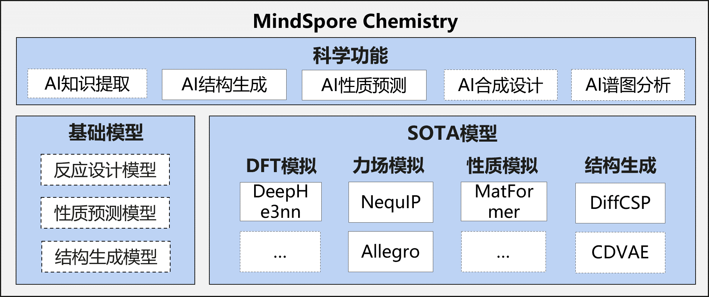
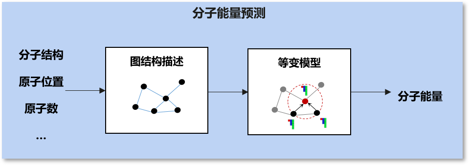

MindSpore Chemistry文档
=========================

介绍
----

传统化学研究长期以来面临着众多挑战，实验设计、合成、表征和分析的过程往往耗时、昂贵，并且高度依赖专家经验。AI与化学的协同可以克服传统方法的局限性、开拓全新的研究范式，结合AI模型与化学知识，可以高效处理大量数据、挖掘隐藏的关联信息，构建仿真模型，从而加快化学反应的设计和优化，实现材料的性质预测，并辅助设计新材料。

**MindSpore Chemistry**\ （MindChemistry）是基于MindSpore构建的化学领域套件，支持多体系（有机/无机/复合材料化学）、多尺度任务（微观分子生成/预测、宏观反应优化）的AI+化学仿真，致力于高效使能AI与化学的融合研究，践行和牵引AI与化学联合多研究范式跃迁，为化学领域专家的研究提供全新视角与高效的工具。

最新消息
--------
-  `2025.03.30` MindChemistry 0.2.0版本发布，包括多个应用案例，支持NequIP、Allegro、DeephE3nn、Matformer以及DiffCSP模型。
-  `2024.07.30` MindChemistry 0.1.0版本发布。

特性
-----

应用案例
~~~~~~~~

-  **力场模拟**\ ：

   -  **体系**\ ：有机化学
   -  **数据**\ ：Revised Molecular Dynamics
      17(rMD17)数据集。rMD17数据集包含了多种有机化合物的分子动力学性质，提供化合物的原子位置、原子数等描述信息以及能量、力场等性质信息。
   -  **任务**\ ：分子能量预测。我们集成了NequIP模型[2]、Allegro模型[3]，根据分子体系中各原子的位置与原子数信息构建图结构描述，基于等变计算与图神经网络，计算出分子体系能量。

-  **DFT模拟**\ ：

   -  **体系**\ ：材料化学
   -  **数据**\ ：双层石墨烯数据集。该数据集包含了原子位置、原子数等描述信息以及哈密顿量等性质信息。
   -  **任务**\ ：密度泛函理论哈密顿量预测。我们集成了DeephE3nn模型[4]，基于E3的等变神经网络，利用原子的结构去预测其的哈密顿量。

-  **性质预测**\ ：

   -  **体系**\ ：材料化学
   -  **数据**\ ：JARVIS-DFT
      3D数据集。该数据集包含了晶体材料的原子位置、原子数等描述信息以及能量、力场等性质信息。
   -  **任务**\ ：晶体材料性质预测。我们集成了Matformer模型[5]，基于图神经网络和Transformer架构的模型，用于预测晶体材料的各种性质。

-  **结构生成**\ ：

   - **体系**\：材料化学  
   - **数据**\：  
      - **Perov-5**\：钙钛矿数据集，每个晶胞中固定5个原子，结构接近。  
      - **Carbon-24**\：碳晶体数据集，包含6到24个碳原子的不同结构。  
      - **MP-20**\：MP数据集中的实验数据，胞内不超过20个原子。  
      - **MPTS-52**\：MP-20的进阶版，胞内最多52个原子。
   - **任务**：晶体材料结构预测。集成了 **DiffCSP** 模型[5]，基于图神经网络和扩散模型，预测晶体材料的结构。

安装教程
--------

版本依赖关系
~~~~~~~~~~~~

由于MindChemistry与MindSpore有依赖关系，请根据下表中所指示的对应关系，在\ `MindSpore下载页面 <https://www.mindspore.cn/versions>`__\ 下载并安装对应的whl包。

============= ====== ========= ======
MindChemistry 分支   MindSpore Python
============= ====== ========= ======
master        master >=2.3     >=3.8
0.2.0         r0.7   >=2.5.0   >=3.11
0.1.0         r0.6   >=2.2.12  >=3.8
============= ====== ========= ======

依赖安装
~~~~~~~~

.. code:: bash

   pip install -r requirements.txt

硬件支持情况
~~~~~~~~~~~~

+---------------------+-----------------+------+
| 硬件平台            | 操作系统        | 状态 |
+=====================+=================+======+
| Atlas A2训练系列产品| Ubuntu-x86      | ✔️   |
+---------------------+-----------------+------+
|                     | Ubuntu-aarch64  | ✔️   |
+---------------------+-----------------+------+
|                     | EulerOS-aarch64 | ✔️   |
+---------------------+-----------------+------+
|                     | CentOS-x86      | ✔️   |
+---------------------+-----------------+------+
|                     | CentOS-aarch64  | ✔️   |
+---------------------+-----------------+------+

源码安装
~~~~~~~~

-  **从Gitee下载源码**

   .. code:: bash

      git clone -b r0.7 https://gitee.com/mindspore/mindscience.git
      cd {PATH}/mindscience/MindChemistry

-  **编译昇腾Ascend后端源码**

   .. code:: bash

      bash build.sh -e ascend

-  **安装编译所得whl包**

   .. code:: bash

      cd {PATH}/mindscience/MindChemistry/output
      pip install mindchemistry_*.whl

社区
----

核心贡献者
~~~~~~~~~~

感谢以下开发者做出的贡献：

wujian, wangyuheng, Lin Peijia, gengchenhua, caowenbin, Siyu Yang

贡献指南
--------

-  如何贡献您的代码，请点击此处查看：\ `贡献指南 <https://gitee.com/mindspore/mindscience/blob/r0.7/CONTRIBUTION.md>`__

许可证
------

`Apache License 2.0 <http://www.apache.org/licenses/LICENSE-2.0>`__

引用
----

[1] Batzner S, Musaelian A, Sun L, et al. E(3)-equivariant graph neural networks for data-efficient and accurate interatomic potentials[J]. Nature communications, 2022, 13(1): 2453.

[2] Musaelian A, Batzner S, Johansson A, et al. Learning local equivariant representations for large-scale atomistic dynamics[J]. Nature communications, 2023, 14(1): 579.

[3] Xiaoxun Gong, He Li, Nianlong Zou, et al. General framework for E(3)-equivariant neural network representation of density functional theory Hamiltonian[J]. Nature communications, 2023, 14: 2848.

[4] Keqiang Yan, Yi Liu, Yuchao Lin, Shuiwang ji, et al. Periodic Graph Transformers for Crystal Material Property Prediction[J]. arXiv:2209.11807v1 [cs.LG] 23 sep 2022.

[5] Jiao Rui and Huang Wenbing and Lin Peijia, et al. Crystal structure prediction by joint equivariant diffusion[J]. Advances in Neural Information Processing Systems, 2024, 36.

.. toctree::
   :maxdepth: 1
   :caption: 快速入门
   :hidden:

   quick_start/quick_start

.. toctree::
   :glob:
   :maxdepth: 1
   :caption: 使用者指南
   :hidden:

   user/structure_generation
   user/molecular_prediction

.. toctree::
   :maxdepth: 1
   :caption: API参考
   :hidden:

   mindchemistry.cell
   mindchemistry.e3
   mindchemistry.utils

.. toctree::
   :glob:
   :maxdepth: 1
   :caption: RELEASE NOTES
   :hidden:

   RELEASE