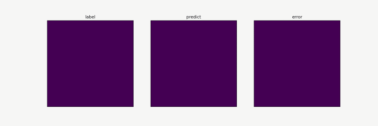
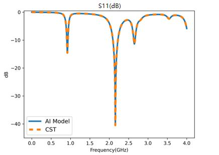

# AI Electromagnetic Simulation based on Point Cloud Method

<a href="https://gitee.com/mindspore/docs/blob/master/docs/mindscience/docs/source_en/mindelec/point_cloud.md" target="_blank"></a>&nbsp;&nbsp;

## Overview

This tutorial describes the deep learning electromagnetic simulation method based on point cloud data, helping you quickly use MindElec.

Conventional electromagnetic simulation usually uses finite element or finite-difference methods to compute electromagnetic fields. These methods require complex mesh division and iterative computation, which is time-consuming and affects product R&D efficiency. MindElec provides a new end-to-end electromagnetic field AI computation method. This method directly computes the electromagnetic field in the simulation area based on point cloud data without mesh division and iterative solution, greatly accelerating the overall simulation speed and facilitating efficient product R&D.

> This current sample is for Ascend 910 AI processor. You can find the complete executable code at
> <https://gitee.com/mindspore/mindscience/tree/master/MindElec/examples/data_driven/pointcloud>

## Overall Process

The overall process of electromagnetic simulation based on point cloud data is as follows:

1. Export the geometric/material information from a CST file.
2. Generate the point cloud data.
3. Compress the data.
4. Electromagnetic simulation.

## Exporting the Geometric/Material Information from a CST File

MindElec provides two types of automatic execution scripts for converting CST files into STP files that can be read by Python. The scripts can be used to convert data in batches to implement large-scale electromagnetic simulation.

- **The CST VBA API automatically calls and exports the JSON and STP files**: Open the VBA Macros Editor of the CST software, import the `export_stp.bas` file in the `generate_pointcloud` directory, change the paths of the JSON and STP files to the desired ones, and click `Run` to export the JSON and STP files. The JSON file contains the model port location and the material information corresponding to the STP file.
- **For CST 2019 or later, you can use Python to directly call CST**: Directly call the `export_stp.py` file in the `generate_pointcloud` directory.

### Example

``` shell
python export_stp.py --cst_path CST_PATH
                     --stp_path STP_PATH
                     --json_path JSON_PATH
```

In the preceding command, `cst_path` specifies the path of the CST file to be exported as the STP file, and `stp_path` and `json_path` specify the paths for storing the exported STP and JSON files, respectively.

## Generating the Point Cloud Data

The STP file cannot be directly used as the input of the neural network. It needs to be converted into regular tensor data. MindElec provides an API for efficiently converting the STP file into the point cloud tensor data. The `generate_cloud_point.py` file in the `generate_pointcloud` directory provides the API calling example.

When using this module, `stp_path` and `json_path` can be configured to specify the paths of the STP and JSON files used to generate the point cloud. `material_dir` specifies the path of the material information corresponding to the STP. The material information is directly exported from the CST software. `sample_nums` specifies the number of point cloud data records generated from the x, y, and z dimensions. `bbox_args` specifies the region where the point cloud data is generated, that is, (x_min, y_min, z_min, x_max, y_max, z_max).

The following is an example:

``` shell
python generate_cloud_point.py --stp_path STP_PATH
                               --json_path JSON_PATH
                               --material_dir MATERIAL_DIR
                               --sample_nums (500, 2000, 80)
                               --bbox_args (-40., -80., -5., 40., 80., 5.)
```

## Data compression

If the point cloud resolution is set to a high value, the memory and computing consumption for subsequent processing of a single piece of point cloud data may be too high. Therefore, MindElec provides the data compression function. You can call the script in the `data_compression` directory to compress the original point cloud data, reducing the memory and computing consumption of subsequent processes. The compression process is divided into the following two steps:

- If you use the model for the first time, call `train.py` to train a compressing model. If compressing model checkpoints exist, skip this step.
- After model training is complete, call `data_compress.py` to compress data.

### (Optional) Compressing Model Training

#### Preparing the Training Data

The training data used by the compressing model is the blocks of point cloud data. After the point cloud data is generated, the generate_data function in `data_compression/src/dataset.py` can be called to generate the data required for training and inference. The block size and data input and output paths are configured using the following parameters in the script:

``` python
PATCH_DIM = [25, 50, 25]
NUM_SAMPLE = 10000
INPUT_PATH = ""
DATA_CONFIG_PATH = "./data_config.npy"
SAVE_DATA_PATH = "./"
```

During the preparation and generation of training data, data is normalized. To ensure the validity of the model, the same normalization parameters need to be used during inference and compression. These parameters are saved in the `data_config.npy` file.

#### Building a compressing model

Build a compressing model by referring to `data_compression/src/model.py`. The model is trained in self-supervised learning mode. The model consists of an encoder and a decoder. During the training, the network needs to rebuild data (`decoding=True`). When the compressed data is inferred, the decompressor is omitted (`decoding=False`).

For different data block sizes, you need to modify some code of the encoder accordingly to ensure that the output space size of the encoder is `[1,1,1]`.

``` python
class EncoderDecoder(nn.Cell):
    def __init__(self, input_dim, target_shape, base_channels=8, decoding=False):
        super(EncoderDecoder, self).__init__()
        self.decoding = decoding
        self.encoder = Encoder(input_dim, base_channels)
        if self.decoding:
            self.decoder = Decoder(input_dim, target_shape, base_channels)

    def construct(self, x):
        encoding = self.encoder(x)
        if self.decoding:
            output = self.decoder(encoding)
        else:
            output = encoding
        return output

class Encoder(nn.Cell):
    ...

class Decoder(nn.Cell):
    ...
```

#### Model Training

During compressing model training, initialize `EncoderDecoder` based on parameters defined in `config.py`, such as the number of input features, data block size, and number of basic features.

``` python
model_net = EncoderDecoder(config["input_channels"], config["patch_shape"], config["base_channels"], ecoding=True)
```

Then, call the MindElec data API to read a dataset. This API can automatically shuffle data and batch data.

``` python
train_dataset = create_dataset(input_path=opt.train_input_path,
                               label_path=opt.train_input_path,
                               batch_size=config["batch_size"],
                               shuffle=True)
eval_dataset ...
```

In order to improve model precision, set the learning rate decay policy.

``` python
milestones, learning_rates = step_lr_generator(step_size,
                                               config["epochs"],
                                               config["lr"],
                                               config["lr_decay_milestones"])
```

Then, call the training API `Solver` of MindElec to set training parameters, including the optimizer, metrics, and loss function.

``` python
solver = Solver(model_net,
                train_input_map={'train': ['train_input_data']},
                test_input_map={'test': ['test_input_data']},
                optimizer=optimizer,
                metrics={'evl_mrc': evl_error_mrc,},
                amp_level="O2",
                loss_fn=loss_net)
```

Finally, use `Solver.model.train` and `Solver.model.eval` to train and test the compressing model and periodically store the checkpoints of the compressing model.

``` python
for epoch in range(config["epochs"] // config["eval_interval"]):
    solver.model.train(config["eval_interval"],
                        train_dataset,
                        callbacks=[LossMonitor(), TimeMonitor()],
                        dataset_sink_mode=True)
    res_test = solver.model.eval(eval_dataset, dataset_sink_mode=True)
    error_mean_l1_error = res_test['evl_mrc']['mean_l1_error']
    save_checkpoint(model_net, os.path.join(opt.checkpoint_dir, 'model_last.ckpt'))
```

### Compressing the data

During data compression, you need to set the original point cloud path and the model checkpoint file, define the compressing model based on parameters defined in `config.py`, and import the model checkpoint.

``` python
encoder = EncoderDecoder(config["input_channels"], config["patch_shape"], decoding=False)
load_checkpoint(opt.model_path, encoder)
```

The data compression script automatically divides the cloud data into data blocks that adapt to the compressing model and uses `data_config.npy` generated during training data preparation to normalize the data. After the division is complete, MindSpore inference is automatically called to compress the data. After the compression, the data block encoding result is rearranged based on the original block space position to obtain the final compression result.

## Electromagnetic Simulation

After the point cloud data is prepared, the electromagnetic simulation models in the `full_em` and `S_parameter` directory of MindElec can be called to implement full electromagnetic and S-parameters simulation. Each simulation process can be divided into two steps:

- Use `train.py` to train the simulation model.
- After the model training is completed, use `eval.py` to compute the full electromagnetic or S-parameters simulation.

### Full Electromagnetic Simulation

#### Building a Full Electromagnetic Simulation Model

First, build an electromagnetic simulation model by referring to `full_em/src/maxwell_model.py`, and train the model in supervised learning mode. The model is divided into two parts: feature extraction and electromagnetic field computation.

``` python
class Maxwell3D(nn.Cell):
    """maxwell3d"""
    def __init__(self, output_dim):
        super(Maxwell3D, self).__init__()

        self.output_dim = output_dim
        width = 64
        self.net0 = ModelHead(4, width)
        self.net1 = ModelHead(4, width)
        self.net2 = ModelHead(4, width)
        self.net3 = ModelHead(4, width)
        self.net4 = ModelHead(4, width)
        self.fc0 = nn.Dense(width+33, 128)
        self.net = ModelOut(128, output_dim, (2, 2, 1), (2, 2, 1))
        self.cat = P.Concat(axis=-1)

    def construct(self, x):
        """forward"""
        x_location = x[..., :4]
        x_media = x[..., 4:]
        out1 = self.net0(x_location)
        out2 = self.net1(2*x_location)
        out3 = self.net2(4*x_location)
        out4 = self.net3(8*x_location)
        out5 = self.net4(16.0*x_location)
        out = out1 + out2 + out3 + out4 + out5
        out = self.cat((out, x_media))
        out = self.fc0(out)
        out = self.net(out)
        return out


class ModelHead(nn.Cell):
    ...
```

#### Model Training

During the training process of the electromagnetic simulation model, the prediction model is initialized using `Maxwell3D`. The network output is six dimensions, as shown below:

``` python
model_net = Maxwell3D(6)
```

Then, call the `create_dataset` function in `src/dataset` to load dataset. This function is implemented using the dataset utilities of MindElec and can automatically shuffle data and batch data.

``` python
dataset, _ = create_dataset(opt.data_path, batch_size=config.batch_size, shuffle=True)
```

Set the learning rate decay policy.

``` python
lr = get_lr(config.lr, step_size, config.epochs)
```

Then, call the training API `Solver` of MindElec to set training parameters, including the optimizer, metrics, and loss function.

``` python
solver = Solver(model_net,
                optimizer=optimizer,
                loss_scale_manager=loss_scale,
                amp_level="O2",
                keep_batchnorm_fp32=False,
                loss_fn=loss_net)
```

Finally, use `Solver.model.train` and `Solver.model.eval` to train and test the model and periodically save the model checkpoint files.

``` python
ckpt_config = CheckpointConfig(save_checkpoint_steps=config["save_checkpoint_epochs"] * step_size,
                               keep_checkpoint_max=config["keep_checkpoint_max"])
ckpt_cb = ModelCheckpoint(prefix='Maxwell3d', directory=opt.checkpoint_dir, config=ckpt_config)
solver.model.train(config.epochs, dataset, callbacks=[LossMonitor(), TimeMonitor(), ckpt_cb],
                   dataset_sink_mode=False)
```

#### Model Inference

Set the path of the inference input data and model checkpoint file, define the model based on parameters defined in `config.py`, and import the model checkpoint.

``` python
model_net = Maxwell3D(6)
param_dict = load_checkpoint(opt.checkpoint_path)
```

The MindElec inference API can be called to implement automatic inference.

``` python
solver = Solver(model_net, optimizer=optimizer, loss_fn=loss_net, metrics={"evl_mrc": evl_error_mrc})
res = solver.model.eval(dataset, dataset_sink_mode=False)
l2_s11 = res['evl_mrc']['l2_error']
print('test_res:', f'l2_error: {l2_s11:.10f} ')
```

Take the electromagnetic simulation of a mobile phone as an example. The following figure shows the electromagnetic field distribution and changes computed through this process.



### S-parameters Simulation

#### Building a S-parameters Simulation Model

First, build S-parameters simulation model by referring to `S_parameter/src/model.py`, and the model is also trained through supervised learning, which is divided into two parts: feature extraction and S-parameter calculation.

``` Python
class S11Predictor(nn.Cell):
    """S11Predictor architecture for MindElec"""
    def __init__(self, input_dim):
        super(S11Predictor, self).__init__()
        self.conv1 = nn.Conv3d(input_dim, 512, kernel_size=(3, 3, 1))
        self.conv2 = nn.Conv3d(512, 512, kernel_size=(3, 3, 1))
        self.conv3 = nn.Conv3d(512, 512, kernel_size=(3, 3, 1))
        self.conv4 = nn.Conv3d(512, 512, kernel_size=(2, 1, 3), pad_mode='pad', padding=0)
        self.down1 = ops.MaxPool3D(kernel_size=(2, 3, 1), strides=(2, 3, 1))
        self.down2 = ops.MaxPool3D(kernel_size=(2, 3, 1), strides=(2, 3, 1))
        self.down3 = ops.MaxPool3D(kernel_size=(2, 3, 1), strides=(2, 3, 1))
        self.down_1_1 = ops.MaxPool3D(kernel_size=(1, 13, 1), strides=(1, 13, 1))
        self.down_1_2 = nn.MaxPool2d(kernel_size=(10, 3))
        self.down_2 = nn.MaxPool2d((5, 4*3))
        self.fc1 = nn.Dense(1536, 2048)
        self.fc2 = nn.Dense(2048, 2048)
        self.fc3 = nn.Dense(2048, 1001)
        self.concat = ops.Concat(axis=1)
        self.relu = nn.ReLU()


    def construct(self, x):
        """forward"""
        bs = x.shape[0]
        x = self.conv1(x)
        x = self.relu(x)
        x = self.down1(x)
        x_1 = self.down_1_1(x)
        x_1 = self.down_1_2(x_1.view(bs, x_1.shape[1], x_1.shape[2], -1)).view((bs, -1))
        x = self.conv2(x)
        x = self.relu(x)
        x = self.down2(x)
        x_2 = self.down_2(x.view(bs, x.shape[1], x.shape[2], -1)).view((bs, -1))
        x = self.conv3(x)
        x = self.relu(x)
        x = self.down3(x)
        x = self.conv4(x)
        x = self.relu(x).view((bs, -1))
        x = self.concat([x, x_1, x_2])
        x = self.relu(x).view(bs, -1)
        x = self.relu(self.fc1(x))
        x = self.relu(self.fc2(x))
        x = self.fc3(x)
        return x
```

#### Model Training

During the training process of the S-parameters simulation model, the prediction model is initialized using `S11Predictor`. The network input tensor channel dimension is configured in `Config.py`, as shown below:

``` python
model_net = S11Predictor(config["input_channels"])
```

Then, call the `create_dataset` function in `src/dataset` to load dataset.

``` python
dataset = create_dataset(input_path, label_path, config.batch_size, shuffle=True)
```

Set the learning rate decay policy.

``` python
milestones, learning_rates = step_lr_generator(step_size, epochs, lr, lr_decay_milestones)
```

Then, call the training API `Solver` of MindElec to set training parameters.

``` python
solver = Solver(model_net,
                train_input_map={'train': ['train_input_data']},
                test_input_map={'test': ['test_input_data']},
                optimizer=optimizer,
                amp_level="O2",
                loss_fn=loss_net)
```

Finally, use `Solver.model.train` to train the model, and save the model checkpoint files after the training is completed.

``` python
solver.model.train(config["epochs"],
                   train_dataset,
                   callbacks=[LossMonitor(), TimeMonitor()],
                   dataset_sink_mode=True)

save_checkpoint(model_net, os.path.join(opt.checkpoint_dir, 'model_best.ckpt'))
```

#### Model Inference

Define the model based on parameters defined in `config.py` and import the model checkpoint file.

``` python
model_net = S11Predictor(input_dim=config["input_channels"])
load_checkpoint(opt.model_path, model_net)
```

Use `solver.model.eval` function to perform inference.

``` python
solver = Solver(network=model_net,
                mode="Data",
                optimizer=nn.Adam(model_net.trainable_params(), 0.001),
                metrics={'eval_mrc': eval_error_mrc},
                loss_fn=nn.MSELoss())

res_eval = solver.model.eval(valid_dataset=eval_dataset, dataset_sink_mode=True)

loss_mse, l2_s11 = res_eval["eval_mrc"]["loss_error"], res_eval["eval_mrc"]["l2_error"]
print('Loss_mse: ', loss_mse, ' L2_S11: ', l2_s11)
```

Take the mobile phone S-parameters as an example, the following figure shows S-parameters calculated through this process.


