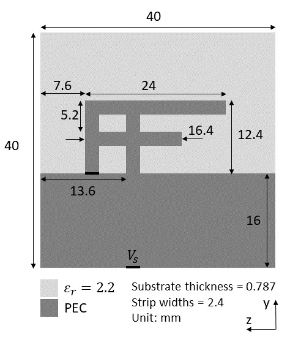
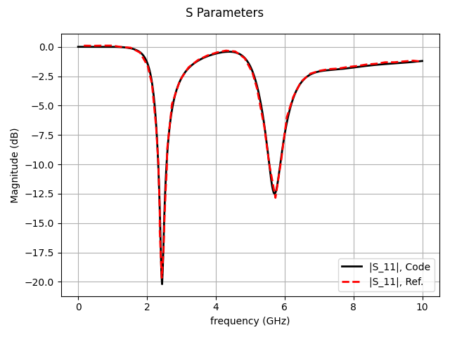
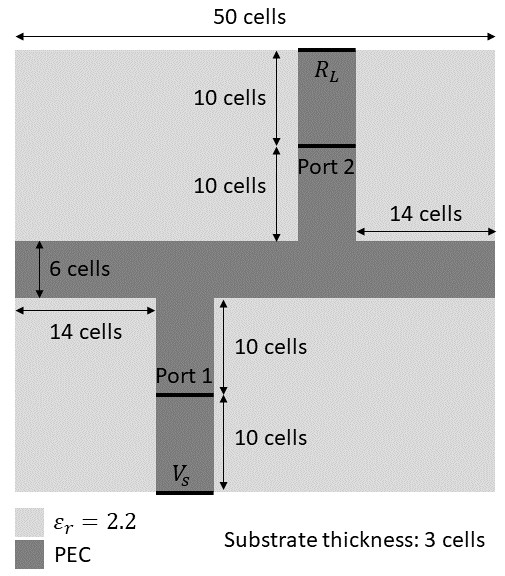
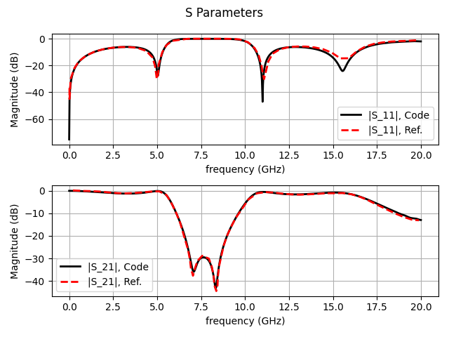

# 基于可微分FDTD的贴片天线S参数仿真

<a href="https://gitee.com/mindspore/docs/blob/r2.0.0-alpha/docs/mindelec/docs/source_zh_cn/AD_FDTD_forward.md" target="_blank"></a>&nbsp;&nbsp;

## 概述

本教程介绍MindElec提供的基于端到端可微分FDTD求解电磁正问题的方法。时域有限差分（FDTD）方法求解麦克斯韦方程组的过程等价于一个循环卷积网络（RCNN）。利用MindSpore的可微分算子重写更新流程，便可得到端到端可微分FDTD。相比于数据驱动的黑盒模型，可微分FDTD方法的求解流程严格满足麦克斯韦方程组的约束，精度与传统数值算法精度相当。

> 本例面向GPU处理器，你可以在这里下载完整的样例代码：
> <https://gitee.com/mindspore/mindscience/tree/r0.2.0-alpha/MindElec/examples/AD_FDTD/fdtd_forward>

## 麦克斯韦方程组

有源麦克斯韦方程是电磁仿真的经典控制方程，它是一组描述电场、磁场与电荷密度、电流密度之间关系的偏微分方程组，具体形式如下：

$$
\nabla\times E=-\mu \dfrac{\partial H}{\partial t},
$$

$$
\nabla\times H=\epsilon \dfrac{\partial E}{\partial t}+\sigma E+ J(x, t)
$$

其中$\epsilon,\mu,\sigma$分别是介质的绝对介电常数、绝对磁导率、电导率。$J(x, t)$是电磁仿真过程中的激励源，通常表现为端口脉冲的形式。本案例的端口为线端口，可以表示为：

$$
J(x, t)=H(x - x_0)H(x_1 - x)g(t)
$$

其中$x_0$和$x_1$分别为先端口的起始位置和终止位置，$H(x)$为阶跃函数，$g(t)$为脉冲信号的函数表达形式。

## 仿真流程

MindElec进行天线S参数仿真的具体流程如下：

1. 定义天线结构、激励端口位置与类型、采样端口。

2. 定义激励源时域波形。

3. 构建神经网络。

4. 求解并评估结果。

## 贴片倒F天线的S参数仿真

本案例对贴片倒F天线的S参数进行仿真。天线结构如下图所示。



### 导入依赖

导入本教程所依赖模块与接口:

```python
import os
import argparse
import numpy as np
from src import estimate_time_interval, compare_s
from src import CFSParameters, Gaussian
from src import Antenna, SParameterSolver
from src import GridHelper, UniformBrick, PECPlate, VoltageSource
from src import VoltageMonitor, CurrentMonitor
from src import full3d
```

### 定义激励源时域波形

本案例的激励源时域波形为高斯脉冲。FDTD采用蛙跳格式分别更新电场和磁场，而本案例的激励源为电压源，因此应计算半时间步上的激励源时域波形值。

```python
def get_waveform_t(nt, dt, fmax):
    """
    Compute waveforms at time t.

    Args:
        nt (int): Number of time steps.
        dt (float): Time interval.
        fmax (float): Maximum freuqency of Gaussian wave

    Returns:
        waveform_t (Tensor, shape=(nt,)): Waveforms.
    """
    t = (np.arange(0, nt) + 0.5) * dt
    waveform = Gaussian(fmax)
    waveform_t = waveform(t)
    return waveform_t, t
```

### 定义天线结构、激励端口、采样端口

用户可根据天线设计图，在网格上自定义天线结构、激励端口和采样端口。首先，根据剖分尺寸、天线总尺寸、PML层厚度、空气层厚度，程序自动生成FDTD网格`grid`；然后，用户可根据天线设计图，借助程序提供的各种组件在`grid`上定义天线结构、激励端口和采样端口，例如介质基板（均匀介质块`UniformBrick`）、金属贴片（`PECPlate`）、电压源（`VoltageSource`）、电压采样端口（`VoltageMonitor`）和电流采样端口（`CurrentMonitor`）。

```python
def get_invert_f_antenna(air_buffers, npml):
    """ Get grid for IFA. """
    cell_lengths = (0.262e-3, 0.4e-3, 0.4e-3)
    obj_lengths = (0.787e-3, 40e-3, 40e-3)
    cell_numbers = (
        2 * npml + 2 * air_buffers[0] + int(obj_lengths[0] / cell_lengths[0]),
        2 * npml + 2 * air_buffers[1] + int(obj_lengths[1] / cell_lengths[1]),
        2 * npml + 2 * air_buffers[2] + int(obj_lengths[2] / cell_lengths[2]),
    )

    grid = GridHelper(cell_numbers, cell_lengths, origin=(
        npml + air_buffers[0] + int(obj_lengths[0] / cell_lengths[0]),
        npml + air_buffers[1],
        npml + air_buffers[2],
    ))

    # Define antenna
    grid[-3:0, 0:100, 0:100] = UniformBrick(epsr=2.2)
    grid[0, 0:71, 60:66] = PECPlate('x')
    grid[0, 40:71, 75:81] = PECPlate('x')
    grid[0, 65:71, 21:81] = PECPlate('x')
    grid[0, 52:58, 40:81] = PECPlate('x')
    grid[-3:0, 40, 75:81] = PECPlate('y')
    grid[-3, 0:40, 0:100] = PECPlate('x')

    # Define sources
    grid[-3:0, 0, 60:66] =\
        VoltageSource(amplitude=1., r=50., polarization='xp')

    # Define monitors
    grid[-3:0, 0, 61:66] = VoltageMonitor('xp')
    grid[-1, 0, 60:66] = CurrentMonitor('xp')
    return grid
```

值得注意的是，在网格`grid`上定义天线结构、激励端口位置和采样端口位置时，用户既可以通过网格编号直接指定物体位置，也可以通过空间坐标指定物体位置。不过，用户需要注意通过空间坐标指定物体位置可能引入建模误差。例如，用户可以混用网格编号和空间坐标定义天线结构：

```python
    ...
    # Define antenna
    grid[-0.787e-3:0, 0:40e-3, 0:40e-3] = UniformBrick(epsr=2.2)
    grid[0, 0:28.4e-3, 24e-3:26.4e-3] = PECPlate('x')
    grid[0, 16e-3:28.4e-3, 30e-3:32.4e-3] = PECPlate('x')
    grid[0, 26e-3:28.4e-3, 8.4e-3:32.4e-3] = PECPlate('x')
    grid[0, 20.8e-3:23.2e-3, 16e-3:32.4e-3] = PECPlate('x')
    grid[-0.787e-3:0, 16e-3, 30e-3:32.4e-3] = PECPlate('y')
    grid[-0.787e-3, 0:16e-3, 0:40e-3] = PECPlate('x')
    ...
```

### 构建神经网络并求解

定义可微分FDTD网络，然后定义S参数求解器对象`solver`，调用`solve`接口进行求解。

```python
    # define fdtd network
    fdtd_net = full3d.ADFDTD(grid_helper.cell_numbers, grid_helper.cell_lengths,
                             nt, dt, ns, antenna, cpml)
    # define solver
    solver = SParameterSolver(fdtd_net)

    # solve
    _ = solver.solve(waveform_t)
```

### 求解结果

定义采样频率，调用`eval`端口得到采样频率上的S参数：

```python
    # sampling frequencies
    fs = np.linspace(0., fmax, 501, endpoint=True)

    # eval
    s_parameters = solver.eval(fs, t)
```

程序计算得到的S参数与参考文献结果的对比如下。



## 贴片微带滤波器的S参数仿真

本案例对贴片微带滤波器的S参数进行仿真。器件结构如下图所示。



### 导入依赖

导入本教程所依赖模块与接口:

```python
import os
import argparse
import numpy as np
from src import estimate_time_interval, compare_s
from src import CFSParameters, Gaussian
from src import Antenna, SParameterSolver
from src import GridHelper, UniformBrick, PECPlate, VoltageSource, Resistor
from src import VoltageMonitor, CurrentMonitor
from src import full3d
```

### 定义激励源时域波形

本案例的激励源时域波形为高斯脉冲。FDTD采用蛙跳格式分别更新电场和磁场，而且本案例的激励源为电压源，因此应计算半时间步上的激励源时域波形值。

```python
def get_waveform_t(nt, dt, fmax):
    """
    Compute waveforms at time t.

    Args:
        nt (int): Number of time steps.
        dt (float): Time interval.
        fmax (float): Maximum freuqency of Gaussian wave

    Returns:
        waveform_t (Tensor, shape=(nt,)): Waveforms.
    """
    t = (np.arange(0, nt) + 0.5) * dt
    waveform = Gaussian(fmax)
    waveform_t = waveform(t)
    return waveform_t, t
```

### 定义滤波器结构、激励端口、采样端口

用户可根据贴片滤波器设计图，在网格上自定义滤波器结构、激励端口和采样端口。首先，根据剖分尺寸、器件总尺寸、PML层厚度、空气层厚度，程序自动生成FDTD网格`grid`；然后，用户可根据器件设计图，借助程序提供的各种组件在`grid`上定义滤波器结构、激励端口和采样端口，例如介质基板（均匀介质块`UniformBrick`）、金属贴片（`PECPlate`）、电压源（`VoltageSource`）、电阻（`Resistor`）、电压采样端口（`VoltageMonitor`）和电流采样端口（`CurrentMonitor`）。

```python
def get_microstrip_filter(air_buffers, npml):
    """ microstrip filter """
    cell_lengths = (0.4064e-3, 0.4233e-3, 0.265e-3)
    obj_lengths = (50 * cell_lengths[0],
                   46 * cell_lengths[1],
                   3 * cell_lengths[2])
    cell_numbers = (
        2 * npml + 2 * air_buffers[0] + int(obj_lengths[0] / cell_lengths[0]),
        2 * npml + 2 * air_buffers[1] + int(obj_lengths[1] / cell_lengths[1]),
        2 * npml + 2 * air_buffers[2] + int(obj_lengths[2] / cell_lengths[2]),
    )

    grid = GridHelper(cell_numbers, cell_lengths, origin=(
        npml + air_buffers[0],
        npml + air_buffers[1],
        npml + air_buffers[2],
    ))

    # Define antenna
    grid[0:50, 0:46, 0:3] = UniformBrick(epsr=2.2)
    grid[14:20, 0:20, 3] = PECPlate('z')
    grid[30:36, 26:46, 3] = PECPlate('z')
    grid[0:50, 20:26, 3] = PECPlate('z')
    grid[0:50, 0:46, 0] = PECPlate('z')

    # Define sources
    grid[14:20, 0, 0:3] = VoltageSource(1., 50., 'zp')

    # Define load
    grid[30:36, 46, 0:3] = Resistor(50., 'z')

    # Define monitors
    grid[14:20, 10, 0:3] = VoltageMonitor('zp')
    grid[14:20, 10, 3] = CurrentMonitor('yp')
    grid[30:36, 36, 0:3] = VoltageMonitor('zp')
    grid[30:36, 36, 3] = CurrentMonitor('yn')

    return grid
```

值得注意的是，本案例的贴片滤波器为两端口器件，本案例仅仿真其中的S11和S21参数。为了计算多端口S参数，需要在每个端口分别定义电压采样端口和电流采样端口。

### 构建神经网络并求解

定义可微分FDTD网络，然后定义S参数求解器对象`solver`，调用`solve`接口进行求解。

```python
    # define fdtd network
    fdtd_net = full3d.ADFDTD(grid_helper.cell_numbers, grid_helper.cell_lengths,
                             nt, dt, ns, antenna, cpml)
    # define solver
    solver = SParameterSolver(fdtd_net)

    # solve
    _ = solver.solve(waveform_t)
```

### 求解结果

定义采样频率，调用`eval`端口得到采样频率上的S参数：

```python
    # sampling frequencies
    fs = np.linspace(0., fmax, 1001, endpoint=True)

    # eval
    s_parameters = solver.eval(fs, t)
```

程序计算得到的S参数与参考文献结果的对比如下。


