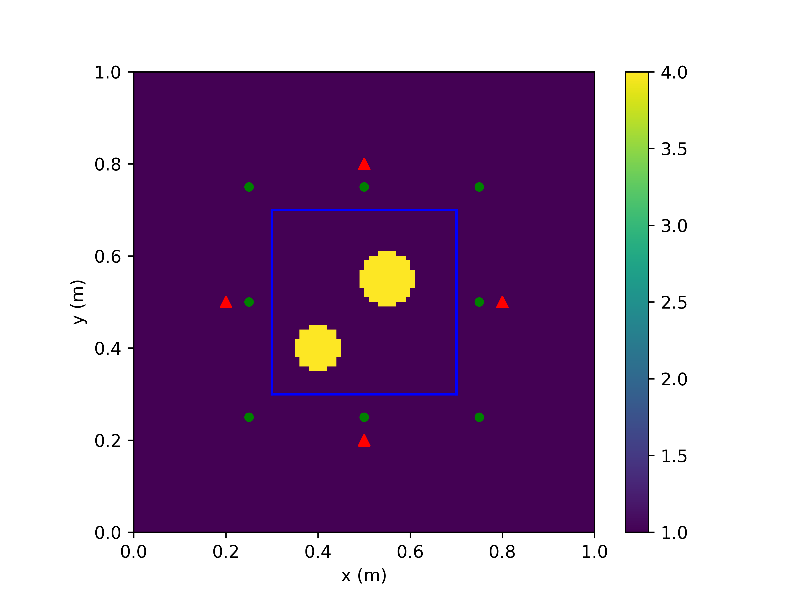
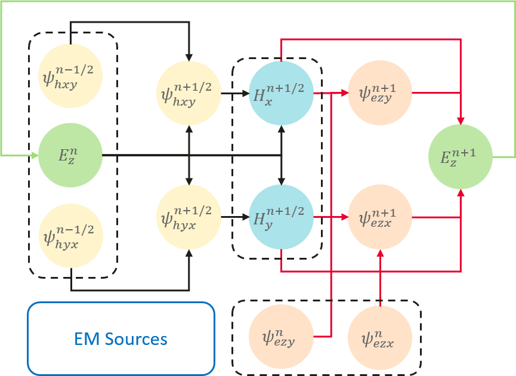
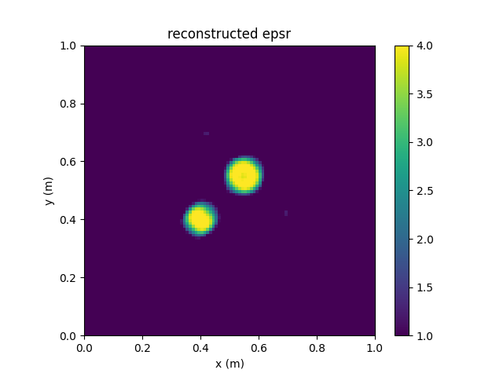

# 端到端可微分FDTD求解电磁逆散射问题

<a href="https://gitee.com/mindspore/docs/blob/r2.0.0-alpha/docs/mindelec/docs/source_zh_cn/AD_FDTD_inverse.md" target="_blank"></a>&nbsp;&nbsp;

## 概述

本教程介绍MindElec提供的基于端到端可微分FDTD求解电磁逆问题的方法。时域有限差分（FDTD）方法求解麦克斯韦方程组的过程等价于一个循环卷积网络（RCNN）。利用MindSpore的可微分算子重写更新流程，便可得到端到端可微分FDTD。相比于数据驱动的黑盒模型，可微分FDTD方法的求解流程严格满足麦克斯韦方程组的约束。利用MindSpore的基于梯度的优化器，可微分FDTD可求解各种电磁逆问题。

> 本例面向GPU处理器，你可以在这里下载完整的样例代码：
> <https://gitee.com/mindspore/mindscience/tree/r0.2.0-alpha/MindElec/examples/AD_FDTD/fdtd_inverse>

## 麦克斯韦方程组

有源麦克斯韦方程是电磁仿真的经典控制方程，它是一组描述电场、磁场与电荷密度、电流密度之间关系的偏微分方程组，具体形式如下：

$$
\nabla\times E=-\mu \dfrac{\partial H}{\partial t},
$$

$$
\nabla\times H=\epsilon \dfrac{\partial E}{\partial t} + J(x, t)
$$

其中$\epsilon,\mu$分别是介质的绝对介电常数、绝对磁导率。$J(x, t)$是电磁仿真过程中的激励源，通常表现为端口脉冲的形式。这在数学意义上近似为狄拉克函数形式所表示的点源，可以表示为：

$$
J(x, t)=\delta(x - x_0)g(t)
$$

其中$x_0$为激励源位置，$g(t)$为脉冲信号的函数表达形式。

## 问题描述

本案例求解二维TM模式的电磁逆散射问题。两个介质体位于矩形区域内。在求解区域外侧设置4个激励源（红色三角）和8个观察点（绿色圆点），具体情况如下图所示：



MindElec求解该问题的具体流程如下：

1. 用传统数值方法获得观察点处的时域电场值，创建训练数据集和评估数据。

2. 定义激励源位置、观察点位置以及求解区域。

3. 定义激励源的时域波形。

4. 构建可微分FDTD网络。

5. 网络训练并评估求解结果。

## 导入依赖

导入本教程所依赖模块与接口:

```python
import os
import argparse
import numpy as np
from mindspore import nn
import matplotlib.pyplot as plt
from src import transverse_magnetic, EMInverseSolver
from src import zeros, tensor, vstack, elu
from src import Gaussian, CFSParameters, estimate_time_interval
from src import BaseTopologyDesigner
```

## 加载数据集

加载用传统数值方法（如FDTD）计算得到的各个观察点处的时域电场值，以及相对介电常数真值。

```python
def load_labels(nt, dataset_dir):
    """
    Load labels of Ez fields and epsr.

    Args:
        nt (int): Number of time steps.
        dataset_dir (str): Dataset directory.

    Returns:
        field_labels (Tensor, shape=(nt, ns, nr)): Ez at receivers.
        epsr_labels (Tensor, shape=(nx, ny)): Ground truth for epsr.
    """

    field_label_path = os.path.join(dataset_dir, 'ez_labels.npy')
    field_labels = tensor(np.load(field_label_path))[:nt]

    epsr_label_path = os.path.join(dataset_dir, 'epsr_labels.npy')
    epsr_labels = tensor(np.load(epsr_label_path))

    return field_labels, epsr_labels
```

## 定义激励源位置、观察点位置以及求解区域

继承`BaseTopologyDesiger`类，用户可以快速定义电磁逆散射问题。用户可在成员函数`generate_object`、`update_sources`和`get_outputs_at_each_step`中分别设置求解区域、激励源位置和观察点位置。以该问题为例，我们定义的电磁逆散射问题如下。

```python
class InverseDomain(BaseTopologyDesigner):
    """
    InverseDomain with customized mapping and source locations for user-defined problems.
    """

    def generate_object(self, rho):
        """Generate material tensors.

        Args:
            rho (Parameter): Parameters to be optimized in the inversion domain.

        Returns:
            epsr (Tensor, shape=(self.cell_nunbers)): Relative permittivity in the whole domain.
            sige (Tensor, shape=(self.cell_nunbers)): Conductivity in the whole domain.
        """
        # generate background material tensors
        epsr = self.background_epsr * self.grid
        sige = self.background_sige * self.grid
        # ---------------------------------------------
        # Customized Differentiable Mapping
        # ---------------------------------------------
        epsr[30:70, 30:70] = self.background_epsr + elu(rho, alpha=1e-2)
        return epsr, sige

    def update_sources(self, *args):
        """
        Set locations of sources.

        Args:
            *args: arguments

        Returns:
            jz (Tensor, shape=(ns, 1, nx+1, ny+1)): Jz tensor.
        """
        sources, _, waveform, _ = args
        jz = sources[0]
        jz[0, :, 20, 50] = waveform
        jz[1, :, 50, 20] = waveform
        jz[2, :, 80, 50] = waveform
        jz[3, :, 50, 80] = waveform
        return jz

    def get_outputs_at_each_step(self, *args):
        """Compute output each step.

        Args:
            *args: arguments

        Returns:
            rx (Tensor, shape=(ns, nr)): Ez fields at receivers.
        """
        ez, _, _ = args[0]
        rx = [
            ez[:, 0, 25, 25],
            ez[:, 0, 25, 50],
            ez[:, 0, 25, 75],
            ez[:, 0, 50, 25],
            ez[:, 0, 50, 75],
            ez[:, 0, 75, 25],
            ez[:, 0, 75, 50],
            ez[:, 0, 75, 75],
        ]
        return vstack(rx)
```

值得注意的是，在`generate_object`中将待优化变量`rho`映射为相对介电常数`epsr`时，选取合适的映射关系可以大大加快求解器收敛速度。本案例采用的映射关系为`background_epsr + elu(rho, alpha=1e-2)`，保证求解过程中不会出现非物理的介电常数。

## 定义激励源时域波形

本案例的激励源时域波形为高斯脉冲。FDTD采用蛙跳格式分别更新电场和磁场，而本案例的激励源为电流源，因此应计算半时间步上的激励源时域波形值。

```python
def get_waveform_t(nt, dt, fmax):
    """
    Compute waveforms at time t.

    Args:
        nt (int): Number of time steps.
        dt (float): Time interval.
        fmax (float): Maximum freuqency of Gaussian wave

    Returns:
        waveform_t (Tensor, shape=(nt, ns, nr)): Waveforms.
    """
    t = (np.arange(0, nt) + 0.5) * dt
    waveform = Gaussian(fmax)
    waveform_t = waveform(t)
    return waveform_t
```

## 构建可微分FDTD网络

本案例求解二维TM模式的电磁逆散射问题。时域有限差分（FDTD）方法求解麦克斯韦方程组的过程等价于一个循环卷积网络（RCNN）。当采用CFS-PML对无限大区域进行截断时，TM模式的二维FDTD的第$n$个时间步的更新过程如下：



利用MindSpore的可微分算子重写FDTD的更新流程，便可得到端到端可微分FDTD。每个时间步内的计算过程如下：

```python
class FDTDLayer(nn.Cell):
    """
    One-step 2D TM-Mode FDTD.

    Args:
        cell_lengths (tuple): Lengths of Yee cells.
        cpmlx_e (Tensor): Updating coefficients for electric fields in the x-direction CPML.
        cpmlx_m (Tensor): Updating coefficients for magnetic fields in the x-direction CPML.
        cpmly_e (Tensor): Updating coefficients for electric fields in the y-direction CPML.
        cpmly_m (Tensor): Updating coefficients for magnetic fields in the y-direction CPML.
    """

    def __init__(self,
                 cell_lengths,
                 cpmlx_e, cpmlx_m,
                 cpmly_e, cpmly_m,
                 ):
        super(FDTDLayer, self).__init__()
        dx = cell_lengths[0]
        dy = cell_lengths[1]
        self.cpmlx_e = cpmlx_e
        self.cpmlx_m = cpmlx_m
        self.cpmly_e = cpmly_e
        self.cpmly_m = cpmly_m
        # operators
        self.dx_oper = ops.Conv2D(out_channel=1, kernel_size=(2, 1))
        self.dy_oper = ops.Conv2D(out_channel=1, kernel_size=(1, 2))
        self.dx_wghts = tensor([-1., 1.]).reshape((1, 1, 2, 1)) / dx
        self.dy_wghts = tensor([-1., 1.]).reshape((1, 1, 1, 2)) / dy
        self.pad_x = ops.Pad(paddings=((0, 0), (0, 0), (1, 1), (0, 0)))
        self.pad_y = ops.Pad(paddings=((0, 0), (0, 0), (0, 0), (1, 1)))

    def construct(self, jz_t, ez, hx, hy, pezx, pezy, phxy, phyx,
                  ceze, cezh, chxh, chxe, chyh, chye):
        """One-step forward propagation

        Args:
            jz_t (Tensor): Source at time t + 0.5 * dt.
            ez, hx, hy (Tensor): Ez, Hx, Hy fields.
            pezx, pezy, phxy, phyx (Tensor): CPML auxiliary fields.
            ceze, cezh (Tensor): Updating coefficients for Ez fields.
            chxh, chxe (Tensor): Updating coefficients for Hx fields.
            chyh, chye (Tensor): Updating coefficients for Hy fields.

        Returns:
            hidden_states (tuple)
        """
        # -------------------------------------------------
        # Step 1: Update H's at n+1/2 step
        # -------------------------------------------------
        # compute curl E
        dezdx = self.dx_oper(ez, self.dx_wghts) / self.cpmlx_m[2]
        dezdy = self.dy_oper(ez, self.dy_wghts) / self.cpmly_m[2]

        # update auxiliary fields
        phyx = self.cpmlx_m[0] * phyx + self.cpmlx_m[1] * dezdx
        phxy = self.cpmly_m[0] * phxy + self.cpmly_m[1] * dezdy

        # update H
        hx = chxh * hx - chxe * (dezdy + phxy)
        hy = chyh * hy + chye * (dezdx + phyx)

        # -------------------------------------------------
        # Step 2: Update E's at n+1 step
        # -------------------------------------------------
        # compute curl H
        dhydx = self.pad_x(self.dx_oper(hy, self.dx_wghts)) / self.cpmlx_e[2]
        dhxdy = self.pad_y(self.dy_oper(hx, self.dy_wghts)) / self.cpmly_e[2]

        # update auxiliary fields
        pezx = self.cpmlx_e[0] * pezx + self.cpmlx_e[1] * dhydx
        pezy = self.cpmly_e[0] * pezy + self.cpmly_e[1] * dhxdy

        # update E
        ez = ceze * ez + cezh * ((dhydx + pezx) - (dhxdy + pezy) - jz_t)

        hidden_states = (ez, hx, hy, pezx, pezy, phxy, phyx)
        return hidden_states
```

端到端可微FDTD网络如下：

```python
class ADFDTD(nn.Cell):
    """2D TM-Mode Differentiable FDTD Network.

    Args:
        cell_numbers (tuple): Number of Yee cells in (x, y) directions.
        cell_lengths (tuple): Lengths of Yee cells.
        nt (int): Number of time steps.
        dt (float): Time interval.
        ns (int): Number of sources.
        designer (BaseTopologyDesigner): Customized Topology designer.
        cfs_pml (CFSParameters): CFS parameter class.
        init_weights (Tensor): Initial weights.

    Returns:
        outputs (Tensor): Customized outputs.
    """

    def __init__(self,
                 cell_numbers,
                 cell_lengths,
                 nt, dt,
                 ns,
                 designer,
                 cfs_pml,
                 init_weights,
                 ):
        super(ADFDTD, self).__init__()

        self.nx = cell_numbers[0]
        self.ny = cell_numbers[1]
        self.dx = cell_lengths[0]
        self.dy = cell_lengths[1]
        self.nt = nt
        self.ns = ns
        self.dt = tensor(dt)

        self.designer = designer
        self.cfs_pml = cfs_pml
        self.rho = ms.Parameter(
            init_weights) if init_weights is not None else None

        self.mur = tensor(1.)
        self.sigm = tensor(0.)

        if self.cfs_pml is not None:
            # CFS-PML Coefficients
            cpmlx_e, cpmlx_m = self.cfs_pml.get_update_coefficients(
                self.nx, self.dx, self.dt, self.designer.background_epsr.asnumpy())
            cpmly_e, cpmly_m = self.cfs_pml.get_update_coefficients(
                self.ny, self.dy, self.dt, self.designer.background_epsr.asnumpy())

            cpmlx_e = tensor(cpmlx_e.reshape((3, 1, 1, -1, 1)))
            cpmlx_m = tensor(cpmlx_m.reshape((3, 1, 1, -1, 1)))
            cpmly_e = tensor(cpmly_e.reshape((3, 1, 1, 1, -1)))
            cpmly_m = tensor(cpmly_m.reshape((3, 1, 1, 1, -1)))

        else:
            # PEC boundary
            cpmlx_e = cpmlx_m = tensor([0., 0., 1.]).reshape((3, 1))
            cpmly_e = cpmly_m = tensor([0., 0., 1.]).reshape((3, 1))

        # FDTD layer
        self.fdtd_layer = FDTDLayer(
            cell_lengths, cpmlx_e, cpmlx_m, cpmly_e, cpmly_m)

        # auxiliary variables
        self.dte = tensor(dt / epsilon0)
        self.dtm = tensor(dt / mu0)

        # material parameters smoother
        self.smooth_kernel = 0.25 * ones((1, 1, 2, 2))
        self.smooth_oper = ops.Conv2D(
            out_channel=1, kernel_size=2, pad_mode='pad', pad=1)

    def construct(self, waveform_t):
        """
        ADFDTD-based forward propagation.

        Args:
            waveform_t (Tensor, shape=(nt,)): Time-domain waveforms.

        Returns:
            outputs (Tensor): Customized outputs.
        """
        # ----------------------------------------
        # Initialization
        # ----------------------------------------
        # constants
        ns, nt, nx, ny = self.ns, self.nt, self.nx, self.ny
        dt = self.dt

        # material grid
        epsr, sige = self.designer.generate_object(self.rho)

        # delectric smoothing
        epsrz = self.smooth_oper(epsr[None, None], self.smooth_kernel)
        sigez = self.smooth_oper(sige[None, None], self.smooth_kernel)

        # set materials on the interfaces
        (epsrz, sigez) = self.designer.modify_object(epsrz, sigez)

        # non-magnetic & magnetically lossless material
        murx = mury = self.mur
        sigmx = sigmy = self.sigm

        # updating coefficients
        ceze, cezh = fcmpt(self.dte, epsrz, sigez)
        chxh, chxe = fcmpt(self.dtm, murx, sigmx)
        chyh, chye = fcmpt(self.dtm, mury, sigmy)

        # hidden states
        ez = create_zero_tensor((ns, 1, nx + 1, ny + 1))
        hx = create_zero_tensor((ns, 1, nx + 1, ny))
        hy = create_zero_tensor((ns, 1, nx, ny + 1))

        # CFS-PML auxiliary fields
        pezx = zeros_like(ez)
        pezy = zeros_like(ez)
        phxy = zeros_like(hx)
        phyx = zeros_like(hy)

        # set source location
        jz_t = zeros_like(ez)

        # ----------------------------------------
        # Update
        # ----------------------------------------
        outputs = []

        t = 0

        while t < nt:

            jz_t = self.designer.update_sources(
                (jz_t,), (ez,), waveform_t[t], dt)

            # RNN-Style Update
            (ez, hx, hy, pezx, pezy, phxy, phyx) = self.fdtd_layer(
                jz_t, ez, hx, hy, pezx, pezy, phxy, phyx,
                ceze, cezh, chxh, chxe, chyh, chye)

            # Compute outputs
            outputs.append(
                self.designer.get_outputs_at_each_step((ez, hx, hy)))

            t = t + 1

        outputs = hstack(outputs)
        return outputs
```

## 模型训练

定义可微分FDTD网络、损失函数、优化器、迭代步数和学习率，然后定义电磁逆散射求解器对象`solver`，调用`solve`接口进行求解。

```python
# define fdtd network
fdtd_net = transverse_magnetic.ADFDTD(
    cell_numbers, cell_lengths, nt, dt, ns,
    inverse_domain, cpml, rho_init)

# define sovler for inverse problem
epochs = options.epochs
lr = options.lr
loss_fn = nn.MSELoss(reduction='sum')
optimizer = nn.Adam(fdtd_net.trainable_params(), learning_rate=lr)
solver = EMInverseSolver(fdtd_net, loss_fn, optimizer)

# solve
solver.solve(epochs, waveform_t, field_labels)
```

## 评估求解结果

求解结束后，调用`eval`接口评估反演结果的`PSNR`和`SSIM`。

```python
epsr, _ = solver.eval(epsr_labels)
```

基于上述方法反演得到的相对介电常数的`PSNR`和`SSIM`分别为：

```log
[epsr] PSNR: 27.835317 dB, SSIM: 0.963564
```

反演得到的相对介电常数分布如下图所示。


