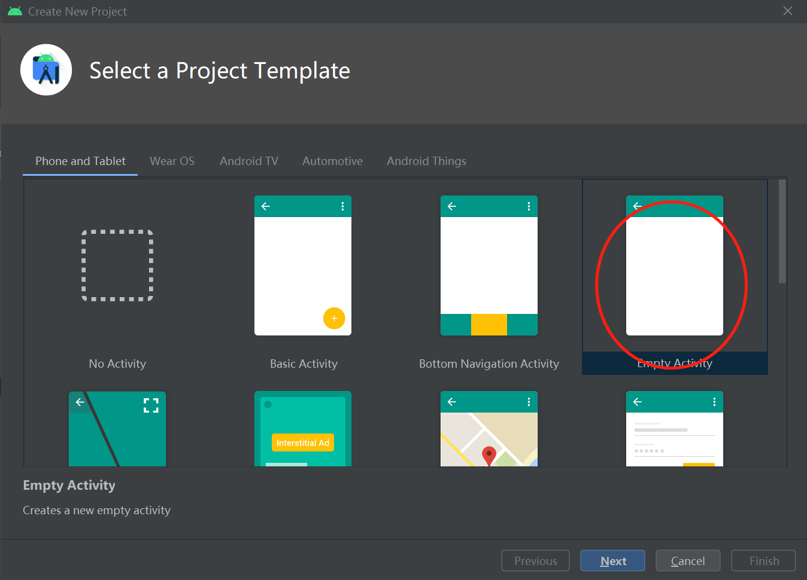

# 实现一个情感分类应用(Android)

## 概述

在隐私合规场景下，通过端云协同的联邦学习建模方式，可以充分发挥端侧数据的优势，避免用户敏感数据直接上报云侧。在联邦学习应用场景的探索中，输入法场景引起了我们的注意。由于用户在使用输入法时对自己的文字隐私十分看重，并且输入法上的智慧功能也是用户非常需要的。因此，联邦学习天然适用在输入法场景中。MindFL将联邦语言模型应用到了输入法的表情图片预测功能中。联邦语言模型会根据聊天文本数据推荐出适合当前语境的表情图片。在使用联邦学习建模时，每一张表情图片会被定义为一个情感标签类别，而每个聊天短语会对应一个表情图片。MindFL将表情图片预测任务定义为联邦情感分类任务。

## 准备环节

### 环境

参考：[服务端环境配置](./deploy_mind_fl_cluster.md)和[客户端环境配置](./deploy_fl_client.md)。

### 数据

[用于训练的数据](https://mindspore-website.obs.cn-north-4.myhuaweicloud.com/notebook/datasets/train.tar.gz)包含100个用户聊天文件，其目录结构如下：

```text
mobile/datasets/train/
├── 0.tsv  # 用户0的训练数据
├── 1.tsv  # 用户1的训练数据
│
│          ......
│
└── 99.tsv  # 用户99的训练数据
```

[用于验证的数据](https://mindspore-website.obs.cn-north-4.myhuaweicloud.com/notebook/datasets/eval.tar.gz)包含1个聊天文件，其目录结构如下：

```text
mobile/datasets/eval/
├── 0.tsv  # 验证数据
```

[标签对应的表情图片数据](https://mindspore-website.obs.cn-north-4.myhuaweicloud.com/notebook/datasets/memo.tar.gz)包含107个图片，其目录结构如下：

```text
mobile/datasets/memo/
├── 0.gif  # 第0个标签对应的表情图片
├── 1.gif  # 第1个标签对应的表情图片
│
│          ......
│
└── 106.gif  # 第106个标签对应的表情图片
```

### 模型相关文件

生成模型需要的起始的[checkpoint](https://mindspore-website.obs.cn-north-4.myhuaweicloud.com/notebook/models/albert_init.ckpt)和[词典](https://mindspore-website.obs.cn-north-4.myhuaweicloud.com/notebook/datasets/vocab.txt)的目录结构如下：

```text
mobile/models/
├── albert_init.ckpt  # 起始的checkpoint
└── vocab.txt  # 词典
```

## 定义网络

联邦学习中的语言模型使用ALBERT模型[1]。客户端上的ALBERT模型包括：embedding层、encoder层和classifier层。

具体网络定义请参考[源码](https://gitee.com/mindspore/mindspore/tree/r1.3/tests/st/fl/mobile/src/model.py)。

### 生成端侧模型文件

#### 将模型导出为MindIR格式文件

代码如下：

```python
import numpy as np
from mindspore import export, Tensor
from src.config import train_cfg, client_net_cfg
from src.cell_wrapper import NetworkTrainCell

# 构建模型
client_network_train_cell = NetworkTrainCell(client_net_cfg)

# 构建输入数据
input_ids = Tensor(np.zeros((train_cfg.batch_size, client_net_cfg.seq_length), dtype=np.int32))
attention_mask = Tensor(np.zeros((train_cfg.batch_size, client_net_cfg.seq_length), dtype=np.int32))
token_type_ids = Tensor(np.zeros((train_cfg.batch_size, client_net_cfg.seq_length), dtype=np.int32))
label_ids = Tensor(np.zeros((train_cfg.batch_size, client_net_cfg.num_labels), dtype=np.int32))

# 导出模型
export(client_network_train_cell, input_ids, attention_mask, token_type_ids, label_ids, file_name='albert_train.mindir', file_format='MINDIR')
```

#### 将MindIR文件转化为联邦学习端侧框架可用的ms文件

参考[实现一个图像分类应用](./image_classification_application.md)中生成端侧模型文件部分。

## 启动联邦学习流程

首先在服务端启动脚本：参考[云端部署方式](./deploy_mind_fl_cluster.md)

以ALBERT模型的训练与推理任务为基础，整体流程为：

1. Android新建工程

2. 编译MindSpore Lite AAR包

3. Android实例程序结构说明

4. 编写代码

5. Android工程配置依赖项

6. Android构建与运行

### Android新建工程

在Android Studio中新建项目工程，并安装相应的SDK（指定SDK版本后，由Android Studio自动安装）。



### 编译MindSpore Lite AAR包

- 请参考[联邦学习部署](./deploy_fl_client.md)

- 生成的Android AAR包名称：

  ```sh
  mindspore-lite-<version>.aar
  ```

- 把AAR包放置安卓工程的app/libs/目录下

### Android实例程序结构说明

```text
app
│   ├── libs # Android库项目的二进制归档文件
|   |   └── mindspore-lite-version.aar #  MindSpore Lite针对Android版本的归档文件
├── src/main
│   ├── assets # 资源目录
|   |   └── model # 模型目录
|   |       └── albert_ad_train.mindir.ms # 存放的预训练模型文件
│   |       └── albert_ad_infer.mindir.ms # 存放的推理模型文件
│   |   └── data # 数据目录
|   |       └── 140.txt # 模型数据文件
|   |       └── vocab.txt # 词典文件
|   |       └── vocab_map_ids.txt # 词典ID映射文件
|   |       └── eval.txt # 训练结果评估文件
|   |       └── eval_no_label.txt # 推理数据文件
│   |
│   ├── java # java层应用代码
│   │       └── ... 存放Android代码文件，相关目录可以自定义
│   │
│   ├── res # 存放Android相关的资源文件
│   └── AndroidManifest.xml # Android配置文件
│
│
├── build.gradle # Android工程构建配置文件
├── download.gradle # 工程依赖文件下载
└── ...
```

### 编写代码

1. AssetCopyer.java：该代码文件作用是把Android工程的app/src/main/assets目录下的资源文件存放到Android系统的磁盘中，以便在模型训练与推理时联邦学习框架的接口能够根据绝对路径读取到资源文件。

    ```java
    import android.content.Context;

    import java.io.File;
    import java.io.FileOutputStream;
    import java.io.InputStream;
    import java.util.logging.Logger;

    public class AssetCopyer {
        private static final Logger LOGGER = Logger.getLogger(AssetCopyer.class.toString());
        public static void copyAllAssets(Context context,String destination) {
            LOGGER.info("destination: " + destination);
            copyAssetsToDst(context,"",destination);
        }
        // copy assets目录下面的资源文件到Android系统的磁盘中，具体的路径可打印destination查看
        private static void copyAssetsToDst(Context context,String srcPath, String dstPath) {
            try {
                // 递归获取assets目录的所有的文件名
                String[] fileNames =context.getAssets().list(srcPath);
                if (fileNames.length > 0) {
                    // 构建目标file对象
                    File file = new File(dstPath);
                    //创建目标目录
                    file.mkdirs();
                    for (String fileName : fileNames) {
                        // copy文件到指定的磁盘
                        if(!srcPath.equals("")) {
                            copyAssetsToDst(context,srcPath + "/" + fileName,dstPath+"/"+fileName);
                        }else{
                            copyAssetsToDst(context, fileName,dstPath+"/"+fileName);
                        }
                    }
                } else {
                    // 构建源文件的输入流
                    InputStream is = context.getAssets().open(srcPath);
                    // 构建目标文件的输出流
                    FileOutputStream fos = new FileOutputStream(new File(dstPath));
                    // 定义1024大小的缓冲数组
                    byte[] buffer = new byte[1024];
                    int byteCount=0;
                    // 源文件写到目标文件
                    while((byteCount=is.read(buffer))!=-1) {
                        fos.write(buffer, 0, byteCount);
                    }
                    // 刷新输出流
                    fos.flush();
                    // 关闭输入流
                    is.close();
                    // 关闭输出流
                    fos.close();
                }
            } catch (Exception e) {
                e.printStackTrace();
            }
        }
    }
    ```

2. FlJob.java：该代码文件作用是定义训练与推理任务的内容，具体的联邦学习接口含义请参考[联邦学习接口介绍](./interface_description_fl_client.md)

    ```java
    import android.annotation.SuppressLint;
    import android.os.Build;

    import androidx.annotation.RequiresApi;

    import com.huawei.flAndroid.utils.AssetCopyer;
    import com.huawei.flclient.FLParameter;
    import com.huawei.flclient.SyncFLJob;

    import java.util.Arrays;
    import java.util.UUID;
    import java.util.logging.Logger;

    public class FlJob {
        private static final Logger LOGGER = Logger.getLogger(AssetCopyer.class.toString());
        private final String parentPath;
        public FlJob(String parentPath) {
            this.parentPath = parentPath;
        }
        // Android的联邦学习训练任务
        @SuppressLint("NewApi")
        @RequiresApi(api = Build.VERSION_CODES.M)
        public void syncJobTrain() {
            String trainDataset = parentPath + "/data/140.txt";
            String vocal_file = parentPath + "/data/vocab.txt";
            String idsFile = parentPath + "/data/vocab_map_ids.txt";
            String testDataset = parentPath + "/data/eval.txt";
            String trainModelPath = parentPath + "/model/albert_ad_train.mindir.ms";
            String inferModelPath = parentPath + "/model/albert_ad_infer.mindir.ms";
            String flName = "adbert";
            // server ip address，请保证Android能够访问到server，否则会出现connection failed
            String ip = "http://127.0.0.1:";
            int port = 6668;
            String clientID = UUID.randomUUID().toString();
            boolean useSSL = false;

            FLParameter flParameter = FLParameter.getInstance();
            flParameter.setTrainDataset(trainDataset);
            flParameter.setVocabFile(vocal_file);
            flParameter.setIdsFile(idsFile);
            flParameter.setTestDataset(testDataset);
            flParameter.setFlName(flName);
            flParameter.setTrainModelPath(trainModelPath);
            flParameter.setInferModelPath(inferModelPath);
            flParameter.setClientID(clientID);
            flParameter.setIp(ip);
            flParameter.setPort(port);
            flParameter.setUseSSL(useSSL);

            SyncFLJob syncFLJob = new SyncFLJob();
            syncFLJob.flJobRun();
        }
        // Android的联邦学习推理任务
        public void syncJobPredict() {
            String flName = "adbert";
            String dataPath = parentPath + "/data/eval_no_label.txt";
            String vocal_file = parentPath + "/data/vocab.txt";
            String idsFile = parentPath + "/data/vocab_map_ids.txt";
            String modelPath = parentPath + "/model/albert_ad_infer.mindir.ms";
            SyncFLJob syncFLJob = new SyncFLJob();
            int[] labels = syncFLJob.modelInference(flName, dataPath, vocal_file, idsFile, modelPath);
            LOGGER.info("labels = " + Arrays.toString(labels));
        }
    }

    ```

3. MainActivity.java：该代码文件作用是启动联邦学习训练与推理任务

    ```java
    import android.os.Build;
    import android.os.Bundle;

    import androidx.annotation.RequiresApi;
    import androidx.appcompat.app.AppCompatActivity;

    import com.huawei.flAndroid.job.FlJob;
    import com.huawei.flAndroid.utils.AssetCopyer;

    @RequiresApi(api = Build.VERSION_CODES.P)
    public class MainActivity extends AppCompatActivity {
        private String parentPath;
        @Override
        protected void onCreate(Bundle savedInstanceState) {
            super.onCreate(savedInstanceState);
            // 获取该应用程序在Android系统中的磁盘路径
            this.parentPath = this.getExternalFilesDir(null).getAbsolutePath();
            // copy assets目录下面的资源文件到Android系统的磁盘中
            AssetCopyer.copyAllAssets(this.getApplicationContext(), parentPath);
            // 新建一个线程，启动联邦学习训练与推理任务
            new Thread(() -> {
                FlJob flJob = new FlJob(parentPath);

                flJob.syncJobTrain();
                flJob.syncJobPredict();
            }).start();
        }
    }
    ```

### Android工程配置依赖项

1. AndroidManifest.xml

    ```xml
    <?xml version="1.0" encoding="utf-8"?>
    <manifest xmlns:android="http://schemas.android.com/apk/res/android"
        package="com.huawei.flAndroid">
        <!--允许网络访问权限-->
        <uses-permission android:name="android.permission.INTERNET" />
        <application
            android:allowBackup="true"
            android:supportsRtl="true"
            android:usesCleartextTraffic="true"
            android:theme="@style/Theme.Flclient">
            <!--MainActivity的文件位置，根据自定义填写-->
            <activity android:name="com.huawei.flAndroid.activity.MainActivity">
                <intent-filter>
                    <action android:name="android.intent.action.MAIN" />
                    <category android:name="android.intent.category.LAUNCHER" />
                </intent-filter>
            </activity>
        </application>
    </manifest>
    ```

2. app/build.gradle

    ```text
    plugins {
        id 'com.android.application'
    }
    android {
        // Android SDK的编译版本，建议大于27
        compileSdkVersion 30
        buildToolsVersion "30.0.3"
        defaultConfig {
            applicationId "com.huawei.flAndroid"
            minSdkVersion 27
            targetSdkVersion 30
            versionCode 1
            versionName "1.0"
            multiDexEnabled true
            testInstrumentationRunner "androidx.test.runner.AndroidJUnitRunner"
            ndk {
                // 不同的手机型号，对应ndk不相同，本人使用的mate20手机是'armeabi-v7a'
                abiFilters 'armeabi-v7a'
            }
        }
        //指定ndk版本
        ndkVersion '21.3.6528147'
        sourceSets{
            main {
                // 指定jni目录
                jniLibs.srcDirs = ['libs']
                jni.srcDirs = []
            }
        }
        compileOptions {
            sourceCompatibility JavaVersion.VERSION_1_8
            targetCompatibility JavaVersion.VERSION_1_8
        }
    }
    dependencies {
        //指定扫描libs目录下的AAR包
        implementation fileTree(dir:'libs',include:['*.aar'])
        implementation 'androidx.appcompat:appcompat:1.1.0'
        implementation 'com.google.android.material:material:1.1.0'
        implementation 'androidx.constraintlayout:constraintlayout:1.1.3'
        androidTestImplementation 'androidx.test.ext:junit:1.1.1'
        androidTestImplementation 'androidx.test.espresso:espresso-core:3.2.0'
        implementation 'com.android.support:multidex:1.0.3'
    }
    ```

### Android构建与运行

1. 连接Android设备，运行联邦学习训练与推理应用程序。通过USB连接Android设备调试，点击`Run 'app'`即可在你的设备上运行联邦学习任务。

    

2. Android Studio连接设备调试操作，可参考<https://developer.android.com/studio/run/device?hl=zh-cn>。手机需开启“USB调试模式”，Android Studio才能识别到手机。 华为手机一般在`设置->系统和更新->开发人员选项->USB调试`中打开“USB调试模式”。

3. 在Android设备上，点击“继续安装”，安装完即可在APP启动之后执行ALBERT模型的联邦学习的训练与推理任务。

4. 程序运行结果如下：

   ```text
   I/SyncFLJob: <FLClient> [model inference] inference finish
   I/SyncFLJob: labels = [2, 0, 0, 0, 0, 1, 1, 1, 1, 2, 2, 2, 2, 4, 4, 4, 4]
   ```

## 实验结果

联邦学习总迭代数为5，客户端本地训练epoch数为10，batchSize设置为16。

|        | Top1精度 | Top5精度 |
| ------ | -------- | -------- |
| ALBERT | 24%      | 70%      |

## 参考文献

[1] Lan Z ,  Chen M ,  Goodman S , et al. ALBERT: A Lite BERT for Self-supervised Learning of Language Representations[J].  2019.
