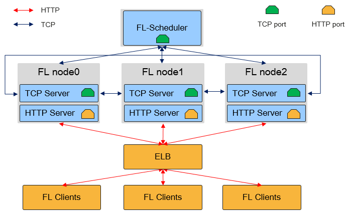

# 概述

`Linux` `Windows` `联邦学习` `分布式应用` `中级` `高级` `贡献者`

MindSpore FL是一款开源联邦学习框架，支持千万级无状态终端设备商用化部署，在用户数据留存在本地的情况下，使能全场景智能应用。

联邦学习是一种加密的分布式机器学习技术，它是指参与联邦学习的各用户在不共享本地数据的前提下共建AI模型。MindFL优先专注于大规模参与方的横向联邦的应用场景。

## MindFL 框架优势

- 隐私安全

  MindFL框架数据留存本地进行训练，不交换数据本身，而是用加密方式交换更新的模型参数。

  支持基于多方安全计算（MPC）的精度无损的安全聚合方案防止模型窃取。

  支持基于本地差分隐私的性能无损的加密方案防止模型泄漏隐私数据。

- 分布式联邦聚合

  云侧松耦合集群化处理方式，支持千万级大规模异构终端部署场景，实现高性能、高可用的分布式联邦聚合计算，可应对网络不稳定，负载突变等。

- 联邦效率提升

  支持同步和异步的联邦模式，支持多种模型压缩算法，提高联邦学习效率，节省带宽资源。

  支持多种联邦聚合策略，提高联邦收敛的平滑度，兼顾全局和局部的精度最优化。

- 灵活易用

  仅一行代码即可切换单机训练与联邦学习模式

  网络模型可编程，聚合算法可编程，安全算法可编程，安全等级可定制。

## MindFL 组网架构

MindFL采用松耦合组网模式，应对大规模、无状态、不可靠的异构设备的联邦学习任务。

FL-Scheduler：联邦学习调度器，与FL-Server保持TCP长链接，通过心跳完成FL-Server node的组网结构，并负责管理面任务的下发。

FL-Server：联邦学习服务器，FL-Server集群对外暴露唯一地址，内部根据负载均衡策略将FL-Client请求路由到各FL-Server node，实现联邦学习服务化，解决大规模不稳定FL-Client的接入。集群内部保证集群事务弱一致性，并完成联邦聚合算法的分布式计算。使得FL-Client在任何时刻访问任意FL-Server，都能获得训练所需的全量数据。

FL-Client：联邦学习客户端，负责本地数据训练以及作为https的客户端与FL-Server交互。

## MindFL 总体架构

MindSpore FL 分为客户端模块和服务器模块两个部分，其框架的总体架构如下所示：

- MindFL-Server模块：

    - **Federated Job Pipeline:** 联邦学习任务执行、弹性扩缩、容错容灾的主控流程。

    - **Worker Manager:** 设备管理相关逻辑。

    - **Aggregator、Optimizer:** 联邦学习在中心侧的聚合和优化逻辑单元，包括多server node间的分布式聚合处理。

    - **Metrics Manager:** 训练训练效果评估模块，用于判断训练效果和模型收敛。

    - **Armour:** 安全处理模块，包括多方安全计算等模型加解密策略。

    - **Protocol:** 联邦学习中的端云交互协议。

    - **Communication:** 用于联邦学习任务的通信组件。

    - **Compute Resources:** 用于联邦学习中心侧的硬件计算资源。

- MindFL-Client模块：

    - **Federated Job Pipeline:** 端侧联邦学习任务执行的主控逻辑，包括学习策略、同步/异步端云交互。

    - **Training & Inference:** 轻量化的端侧训练和推理的能力，包括runtime和高性能算子库。

    - **Armour:** 用于端侧的安全处理模块，包括多方安全计算、本地差分隐私等模型加解密策略。

    - **Communication:** 端侧用于联邦学习任务的通信组件。

    - **Compute Resources:** 用于联邦学习端侧的硬件计算资源。

## 使用MindFL的工作流程

- 场景识别、选择模型：识别出使用联邦学习的场景，进行模型原型的选择或开发。
- 客户端设置、模型分发：在端侧为联邦任务积累本地数据，并使用工具生成方便部署的端侧模型。
- 应用部署：将FL-Client部署到端侧应用中，并在云侧设置FL-Plan和部署脚本。

## 场景体验

- 图像分类

- 文本分类  
