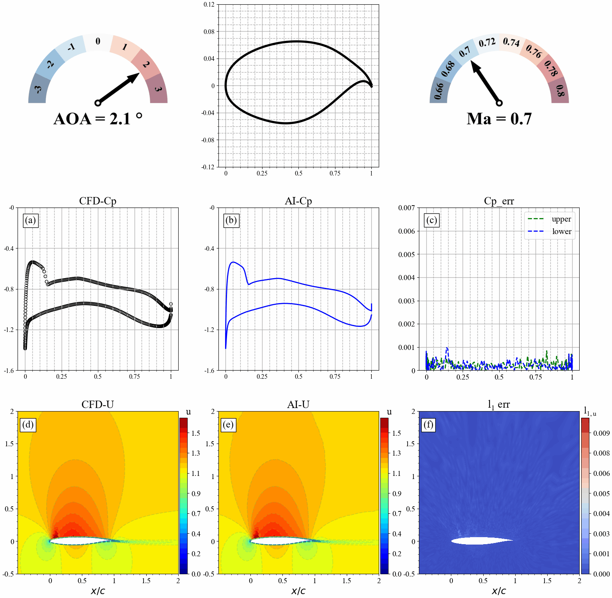

# AI Industrial Flow Simulation Model——DongFang·YuFeng

## Introduction

**DongFang·YuFeng** built based on Ascend AI, is an efficient and high-accuracy AI simulation model for forecasting flow fields over airfoils of the airliner. With the support of MindSpore, the ability to simulate complex flows has been effectively improved. The simulation time is shortened to 1/24 of that in traditional Computational Fluid Dynamics (CFD) and the number of wind tunnel tests is reduced.Additionally, "DongFang·YuFeng"  is capable of predicting the areas with sharp changes in the flow field accurately, and the averaged error of the whole flow field can be reduced to 1e-4 magnitude, reaching the industrial standard.


This tutorial will introduce the research background and technical path of "DongFang·YuFeng" and show how to use MindFlow to realize the training and fast inference of the model, as well as visualized analysis of the flow field, so as to quickly obtain the physical information of the flow field.

## Background

Civil aircraft aerodynamic design level directly determines the "four characteristics" of aircraft, namely safety, comfort, economy and environmental protection. Aerodynamic design of aircraft, as one of the most basic and core technologies in aircraft design, has different research needs and priorities in different stages of aircraft flight envelope (take-off, climb, cruise, descent, landing, etc.). For example, in the take-off phase, engineers will focus more on external noise and high lift-drag ratio, while in the cruise phase they will focus on fuel and energy efficiency. The flow simulation technology is widely used in aircraft aerodynamic design. Its main purpose is to obtain the flow field characteristics (velocity, pressure, etc.) of the simulation target through numerical methods, and then analyze the aerodynamic performance parameters of the aircraft, so as to achieve the optimization design of the aerodynamic performance of the aircraft.


Currently, the aerodynamic simulation of aircraft usually uses commercial simulation software to solve the governing equations and obtain the corresponding aerodynamic performance parameters (lift and drag, pressure, velocity, etc.). However, regardless of the CFD-based simulation software, the following steps are involved:

1. Physical modeling. The physical problems are abstracted and simplified to model the 2D/3D fluid and solid computational domain of the related geometry.
2. Mesh partition. The computing domain is divided into face/volume units of corresponding size to resolve turbulence in different areas and different scales.
3. Numerical discretization. The integral, differential and partial derivative terms in the governing equation are discretized into algebraic form through different order numerical formats to form corresponding algebraic equations.
4. Solution of governing equation. Use the numerical methods (such as `SIMPLE`, `PISO` etc.) to solve the discrete governing equations iteratively, and calculate the numerical solutions at discrete time/space points.
5. Post-processing. After the solution, use the flow field post-processing software to conduct qualitative and quantitative analysis and visualization of the simulation results and verify the accuracy of the results.


However, with the shortening of aircraft design and development cycle, the existing aerodynamic design methods have many limitations. Thus, in order to make the aerodynamic design level of airliner catch up with the two major aviation giants, Boeing and Airbus, it is necessary to develop advanced aerodynamic design means and combine advanced technologies such as artificial intelligence to establish fast aerodynamic design tools suitable for model design, thereby improving its simulation capability for complex flows and reducing the number of wind tunnel tests, as well as reducing design and research and development costs.


In the design of aircraft, the drag distribution of the wing is about 52% of the overall flight drag. Therefore, the wing shape design is very important for the whole flight performance of the aircraft. However, the high-fidelity CFD simulation of 3D wing requires millions of computational grids, which consumes a lot of computational resources and takes a long computational cycle. To improve the efficiency of simulation design, the design optimization of the two-dimensional section of the 3D wing is usually carried out first, and this process often requires repeated iterative CFD calculation for thousands of pairs of airfoils and their corresponding working conditions. Among these airfoils, the supercritical airfoil has an important application in high-speed cruise. Compared with the common airfoil, the supercritical airfoil has a fuller head, which reduces the peak negative pressure at the leading edge, and makes the airflow reach the sound velocity later, i.e. the critical Mach number is increased. At the same time, the middle of the upper surface of supercritical airfoil is relatively flat, which effectively controls the further acceleration of the upper airfoil airflow, reduces the intensity and influence range of the shock wave, and delays the shock-induced boundary layer separation on the upper surface. Therefore, supercritical airfoils with higher critical Mach numbers must be considered in wing shapes, since they  can significantly improve aerodynamic performance in the transonic range, reduce drag and improve attitude controllability.


However, the aerodynamic design of two-dimensional supercritical airfoils needs to be simulated for different shapes and inflow parameters, and there are still a lot of iterative computations, which result in a long design cycle. Therefore, it is particularly important to use  AI's natural parallel inference capabilities to shorten the research and development cycle. Based on this, COMAC and Huawei jointly released the industry's first AI industrial flow simulation model -- **"DongFang·YuFeng"**, which can detect changes in the geometry and flow parameters (angle of attack/Mach number) of the supercritical airfoil. The high-efficiency and high-precision inference of airfoil flow field of airliner is realized, and the flow field around airfoil and lift drag are predicted quickly and accurately.

## Technical difficulties

In order to realize high-efficiency and high-precision flow field prediction of supercritical airfoil by AI, the following technical difficulties need to be overcome:

* **Airfoil meshes are uneven and flow feature extraction is difficult.** O-type or C-type meshes are often used for fluid simulation of 2D airfoil computing domain. As shown in the figure, a typical O-shaped mesh is divided. In order to accurately calculate the flow boundary layer, the near-wall surface of the airfoil is meshed, while the far-field mesh is relatively sparse. This non-standard grid data structure increases the difficulty of extracting flow features.


* **Flow characteristics change significantly when different aerodynamic parameters or airfoil shapes change.** As shown in the figure, when the angle of attack of the airfoil changes, the flow field will change dramatically, especially when the angle of attack increases to a certain degree, shock wave phenomenon will occur: that is, there is obvious discontinuity in the flow field. The pressure, velocity and density of the fluid on the wavefront are obviously changed abruptly.


* **The flow field in the shock region changes dramatically, and it is difficult to predict.** Because the existence of shock wave has a significant impact on the flow field nearby, the flow field before and after shock wave changes dramatically, and the flow field changes are complex, making it difficult for AI to predict. The location of shock wave directly affects the aerodynamic performance design and load distribution of airfoil. Therefore, accurate capture of shock signals is very important but challenging.

## Technical Path

Aiming at the technical difficulties mentioned above, we designed an AI model-based technology roadmap to construct the end-to-end mapping of airfoil geometry and its corresponding flow fields under different flow states, which mainly includes the following core steps:

* First, we design an efficient AI data conversion tool to realize feature extraction of complex boundary and non-standard data of airfoil flow field.
* Secondly, the neural network model is used to map the airfoil configuration and the physical parameters of the flow field under different flow states. The input of the model is airfoil geometry information and aerodynamic parameters generated after coordinate transformation. The output of the model is the physical information of the flow field, such as velocity and pressure.
* Finally, the weights of the network are trained using the adaptive loss function. Perform further decomposition and learning on abrupt high-frequency signals in the flow field, so as to improve prediction accuracy of areas (such as shock waves) that change sharply in the flow field, as shown in a module corresponding to the loss function.

## Preparation

Before practice, ensure that MindSpore and MindFlow of the latest versions have been correctly installed. If not, you can run the following command:

* The MindSpore installation page is used to install the [MindSpore](https://www.mindspore.cn/install).
* `MindFlow`Install MindFlow on the installation page.

## "DongFang·YuFeng" MindFlow Implementation

The implementation of "DongFang·YuFeng"  `MindFlow` consists of the following six steps:

1. Dataset preparation and loading.
2. Configure network and training parameters.
3. Model building.
4. Model training.
5. Model inference.
6. Result visualization.

### Creating and Loading Datasets

The dataset of the CFD is first converted to tensor data, and then the tensor data is converted to MindRecord. Design an efficient AI data conversion tool to realize feature extraction of complex boundary and non-standard data of airfoil flow field.

Currently, AI fluid simulation supports training using local datasets. You can use the `MindDataset` interface to configure dataset options. You need to specify the location of the MindRecord dataset file.

### Configure network and training parameters

The configuration file contains four types of parameters: model parameters(model), data parameters(data), optimizer parameters(optimizer), and callback parameters(callback). The most important parameters of the ViT model are depth, embed_dim, and num_heads of the encoder and decoder, which control the number of layers in the model, the length of the latent vector, and the number of heads of the multi-head attention mechanism, respectively. The default values of the parameters are as follows:

``` python
model:
  name: "ViT"                   # Model name
  exp:
    input_dims: 3               # Input data channel
  output_dims: 3                # Output data channel
  height: 192                   # Height of the grid
  width: 384                    # Width of the grid
  encoder_depth: 6              # Depth of the encoder
  encoder_embed_dim: 768        # Embedding dimensions of the encoder
  encoder_num_heads: 12         # Numbers of attention-heads of the encoder
  decoder_depth: 6              # Depth of the decoder
  decoder_embed_dim: 512        # Numbers of attention-heads of the decoder
  decoder_num_heads: 16         # Numbers of attention-heads of the decoder

data:
  data_path: ""                 # Path to data
  grid_path: ""                 # Path to grid
  train_size: 0.2               # Ratio of train and test dataset
  train_num_list: [301]         # Airfoils index of train dataset [301~350]
  test_num_list: [451]          # Airfoils index of test dataset [451~500]
  batch_size: 32                # Batch size of train
  test_batch_size: 32           # Batch size of test
  post_dir: "./postprocessing/plot_results/"                            # Path to postprocessing
  max_value_list: [ 4.6, 1.0, 0.18418664581293126]                      # Max values of input data
  min_value_list: [-2.0, -0.18382872836312403, -0.1839052340212462]     # Min values of input data

optimizer:
  epochs: 1000                  # The number of train epoch
  lr: 0.0005                    # Initial learning rate
  gamma: 0.2                    # The gamma value of the optimizer

callback:
  summary_dir: "./summary_dir/summary_"    # Path to Summary
  save_checkpoint_epochs: 1000             # Frequency of checkpoint results
  keep_checkpoint_max: 1                   # Maximum number of checkpoint files can be save
  eval_interval: 10                        # TestSet Accuracy Test Frequency
```

### Model Building

The following uses the ViT model as an example. The model is built through the ViT interface defined by the MindFlow package. You need to specify the parameters of the ViT model. You can also build your own model.

``` python
model = ViT(input_dims=model_params[method]['input_dims'],
            output_dims=model_params['output_dims'],
            encoder_depth=model_params['encoder_depth'],
            encoder_embed_dim=model_params['encoder_embed_dim'],
            encoder_num_heads=model_params['encoder_num_heads'],
            decoder_depth=model_params['decoder_depth'],
            decoder_embed_dim=model_params['decoder_embed_dim'],
            decoder_num_heads=model_params['decoder_num_heads'],
            )
```

### Model Training

First, use the load_config_params function to load the configuration file to obtain model parameters, and then call the initial_data_and_model function to obtain train_dataset, eval_dataset, model, model_name . The learning rate can be obtained by using the warmup_cosine_annealing_lr function provided by MindFlow.

MindSpore provides the Model class for model training and inference. The input of the Model class is the network model, optimizer, loss scaling policy, and loss function.

``` python
class TrainModel:

    def __init__(self, model_name, loss_fn):
        self.model_name = model_name
        self.loss_fn = loss_fn

    def train_with_eval(self):
        """train"""
        data_params, model_params, optimizer_params, callback_params = load_config_params(opt.config_path)
        train_dataset, eval_dataset, model, model_name = initial_data_and_model(
            self.model_name + '_' + str(opt.alpha), data_params, model_params, opt.method)

        ckpt_dir, summary_dir = self._set_dirs(callback_params, model_name)
        steps_per_epoch = train_dataset.get_dataset_size()

        lr = warmup_cosine_annealing_lr(optimizer_params["lr"], steps_per_epoch, 1, optimizer_params["epochs"])
        optimizer = nn.Adam(model.trainable_params() + self.loss_fn.trainable_params(), learning_rate=Tensor(lr))
        loss_scale = DynamicLossScaleManager()

        solver = Model(model,
                       optimizer=optimizer,
                       loss_scale_manager=loss_scale,
                       loss_fn=self.loss_fn,
                       )

        pred_cb, summary_cb, time_cb = self._callback(eval_dataset, model, summary_dir, callback_params, data_params)
        ckpt_cb = self._checkpoint(callback_params, ckpt_dir, steps_per_epoch)
        solver.train(epoch=optimizer_params["epochs"],
                     train_dataset=train_dataset,
                     callbacks=[LossMonitor(), pred_cb, time_cb, ckpt_cb],
                     dataset_sink_mode=True)

    @staticmethod
    def _set_dirs(callback_params, model_name):
        summary_dir = os.path.join(callback_params["summary_dir"] + opt.method, model_name)
        ckpt_dir = os.path.join(summary_dir, "ckpt_dir")
        check_file_path(ckpt_dir)
        print(f'model_name: {model_name}')
        print(f'config_path: {opt.config_path}')
        print(f'summary_dir: {summary_dir}')
        print(f'ckpt_dir: {ckpt_dir}')
        return ckpt_dir, summary_dir

    @staticmethod
    def _callback(eval_dataset, model, summary_dir, callback_params, data_params):
        # callback
        pred_cb = PredictCallback(model=model, eval_dataset=eval_dataset,
                                  summary_dir=summary_dir, callback_params=callback_params, data_params=data_params)
        time_cb = TimeMonitor()
        summary_cb = SummaryCollector(summary_dir=summary_dir)
        return pred_cb, summary_cb, time_cb

    @staticmethod
    def _checkpoint(callback_params, ckpt_dir, steps_per_epoch):
        # checkpoint
        ckpt_config = CheckpointConfig(
            save_checkpoint_steps=callback_params["save_checkpoint_epochs"] * steps_per_epoch,
            keep_checkpoint_max=callback_params["keep_checkpoint_max"])
        ckpt_cb = ModelCheckpoint(prefix='airfoil2d', directory=ckpt_dir, config=ckpt_config)
        return ckpt_cb
```

During model training, the PredictCallback function is used to implement inference while training. Users can directly load the test data set and output the inference precision of the test set every time n epochs are trained. The value of n is specified by eval_interval in the configuration file. The command output is as follows:

```python
...
Train epoch time: 245704.565 ms, per step time: 357.649 ms
epoch: 991 step: 687, loss is 0.018909770995378494
Train epoch time: 134875.490 ms, per step time: 196.325 ms
epoch: 992 step: 687, loss is 0.018905797973275185
Train epoch time: 134833.401 ms, per step time: 196.264 ms
epoch: 993 step: 687, loss is 0.018955739215016365
Train epoch time: 134996.335 ms, per step time: 196.501 ms
epoch: 994 step: 687, loss is 0.01890547014772892
Train epoch time: 134857.379 ms, per step time: 196.299 ms
epoch: 995 step: 687, loss is 0.019043993204832077
Train epoch time: 134828.162 ms, per step time: 196.256 ms
epoch: 996 step: 687, loss is 0.018846523016691208
Train epoch time: 134789.263 ms, per step time: 196.200 ms
epoch: 997 step: 687, loss is 0.018784258514642715
Train epoch time: 135045.117 ms, per step time: 196.572 ms
epoch: 998 step: 687, loss is 0.019161228090524673
Train epoch time: 134754.484 ms, per step time: 196.149 ms
epoch: 999 step: 687, loss is 0.01893322728574276
Train epoch time: 134868.424 ms, per step time: 196.315 ms
epoch: 1000 step: 687, loss is 0.01907874085009098
================================Start Evaluation================================
mean l1_error : 0.00017127192940710016, max l1_error : 0.06129508092999458, average l1_error : 0.0043031450033425124, min l1_error : 0.0008682708139531314, median l1_error : 0.0034930877154693007
mean u_error : 0.00020820375084972326, max u_error : 0.10199415683746338, average u_error : 0.005660663934135864, min u_error : 0.0010001659393310547, median u_error : 0.004315197467803955
mean v_error : 7.668626435136433e-05, max v_error : 0.029990235343575478, average v_error : 0.003053658062797918, min v_error : 0.0005460083484649658, median v_error : 0.002688060514628887
mean p_error : 0.0002289257737010042, max p_error : 0.07013040781021118, average p_error : 0.004195113001903247, min p_error : 0.0009379386901855469, median p_error : 0.0032533109188079834
mean Cp_error : 0.00023822338209345892, max Cp_error : 0.03613078594207764, average Cp_error : 0.0012825747940972535, min Cp_error : 0.0005737543106079102, median Cp_error : 0.0008337497711181641
=================================End Evaluation=================================
```

### Model Inference

After model training is complete, the checkpoint can be read through the load_checkpoint interface. The load_param_into_net function can load parameters to the model and use the `inference.py` function to perform inference.

``` python
dataset, model, model_name = initial_data_and_model(config)
param_dict = load_checkpoint(config['load_path'] + '/' + opt.ckpt_dir)
load_param_into_net(model, param_dict)
print("Load pre-trained model successfully")
model.set_train(False)
get_uvp_plots(dataset, model, 'train', config)
```

### Result Visualization

Surface pressure distribution, flow field distribution and error statistics predicted by AI and CFD when airfoil geometry changes.


Surface pressure distribution, flow field distribution and error statistics predicted by AI and CFD when the angle of attack changes.


Surface pressure distribution, flow field distribution and error statistics predicted by AI and CFD when incoming flow Mach number changes.

