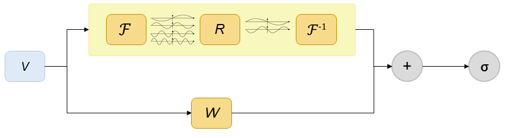

# Solve Navier-Stokes equation based on Fourier Neural Operator

<a href="https://gitee.com/mindspore/docs/blob/r2.0.0-alpha/docs/mindflow/docs/source_en/data_driven/fno2d.md" target="_blank"></a>

## Overview

Computational fluid dynamics is one of the most important techniques in the field of fluid mechanics in the 21st century. The flow analysis, prediction and control can be realized by solving the governing equations of fluid mechanics by numerical method. Traditional finite element method (FEM) and finite difference method (FDM) are inefficient because of the complex simulation process (physical modeling, meshing, numerical discretization, iterative solution, etc.) and high computing costs. Therefore, it is necessary to improve the efficiency of fluid simulation with AI.

Machine learning methods provide a new paradigm for scientific computing by providing a fast solver similar to traditional methods. Classical neural networks learn mappings between finite dimensional spaces and can only learn solutions related to specific discretizations. Different from traditional neural networks, Fourier Neural Operator (FNO) is a new deep learning architecture that can learn mappings between infinite-dimensional function spaces. It directly learns mappings from arbitrary function parameters to solutions to solve a class of partial differential equations.  Therefore, it has a stronger generalization capability. More information can be found in [paper] (https://arxiv.org/abs/2010.08895).

This tutorial describes how to solve the Navier-Stokes equation using Fourier neural operator.

## Navier-Stokes equation

Navier-Stokes equation is a classical equation in computational fluid dynamics. It is a set of partial differential equations describing the conservation of fluid momentum, called N-S equation for short. Its vorticity form in two-dimensional incompressible flows is as follows:

$$
\partial_t w(x, t)+u(x, t) \cdot \nabla w(x, t)=\nu \Delta w(x, t)+f(x), \quad x \in(0,1)^2, t \in(0, T]
$$

$$
\nabla \cdot u(x, t)=0, \quad x \in(0,1)^2, t \in[0, T]
$$

$$
w(x, 0)=w_0(x), \quad x \in(0,1)^2
$$

where $u$ is the velocity field, $w=\nabla \times u$ is the vorticity, $w_0(x)$ is the initial vorticity, $\nu$ is the viscosity coefficient, $f(x)$ is the forcing function.

## Description

We aim to solve two-dimensional incompressible N-S equation by learning the operator mapping from each time step to the next time step:

$$
w_t \mapsto w(\cdot, t+1)
$$

The process for MindFlow to solve the problem is as follows:

1. Configuring network and training parameters.
2. Creating datasets.
3. Building a neural network.
4. Defining the loss function.
5. Defining the model testing module.
6. Model Training.

## Fourier Neural Operator

The following figure shows the architecture of the Fourier Neural Operator model. In the figure, $w_0(x)$ represents the initial vorticity.  The input vector is lifted to higher dimension channel space by the lifting layer. Then the mapping result is used as the input of the Fourier layer to perform nonlinear transformation of the frequency domain information. Finally, the decoder layer maps the transformation result to the final prediction result $w_1(x)$.

The Fourier Neural Operator consists of the lifting Layer, Fourier Layers, and the decoder Layer.


Fourier layers: Start from input V. On top: apply the Fourier transform $\mathcal{F}$; a linear transform R on the lower Fourier modes and filters out the higher modes; then apply the inverse Fourier transform $\mathcal{F}^{-1}$. On the bottom: apply a local linear transform W.  Finally, the Fourier Layer output vector is obtained through the activation function.



### Import dependencies

Import the modules and interfaces on which this tutorial depends:

```python
import os
import argparse
import datetime
import numpy as np

import mindspore.nn as nn
from mindspore import set_seed
from mindspore import Tensor, context
from mindspore.train import LossMonitor, TimeMonitor, CheckpointConfig, ModelCheckpoint
from mindspore.train import DynamicLossScaleManager

from mindflow.cell.neural_operators import FNO2D
from mindflow.solver import Solver

from src.callback import PredictCallback
from src.lr_scheduler import warmup_cosine_annealing_lr
from src.dataset import create_dataset
from src.utils import load_config
from src.loss import RelativeRMSELoss
```

### Creating datasets

In this case, training data sets and test data sets are generated according to Zongyi Li's data set in Fourier Neural Operator for Parametric Partial Differential Equations(https://arxiv.org/pdf/2010.08895.pdf) . The settings are as follows:

The initial condition $w_0(x)$ is generated according to periodic boundary conditions:

$$
w_0 \sim \mu, \mu=\mathcal{N}\left(0,7^{3 / 2}(-\Delta+49 I)^{-2.5}\right)
$$

The forcing function is defined as:

$$
f(x)=0.1\left(\sin \left(2 \pi\left(x_1+x_2\right)\right)+\right.\cos(2 \pi(x_1+x_2)))
$$

We use a time-step of 1e-4 for the Crank–Nicolson scheme in the data-generated process where we record the solution every t = 1 time units.  All data are generated on a 256 × 256 grid and are downsampled to 64 × 64.  In this case, the viscosity coefficient $\nu=1e-5$, the number of samples in the training set is 19000, and the number of samples in the test set is 3800.

```python
# create dataset for train
config = load_config('path/to/config')
data_params = config["data"]
model_params = config["model"]
train_dataset = create_dataset(data_params,
                               input_resolution=model_params["input_resolution"],
                               shuffle=True)
test_input = np.load(os.path.join(data_params["path"], "test/inputs.npy"))
test_label = np.load(os.path.join(data_params["path"], "test/label.npy"))
```

`load_config` is referenced from `utils.py`, and `create_dataset` is referenced from `dataset.py`. Parameters in data_params and model_params are set in the configuration file.

### Build a neural network

The network consists of one lifting layer, multiple Fourier layers, and one decoder layer:

- The lifting layer corresponds to `FNO2D.fc0` in the sample code. It maps the output data $x$ to high-level dimensions.
- Multi-layer Fourier layers corresponds to `FNO2D.fno_seq` in the sample code. In this case, discrete Fourier transform is used to implement time-domain and frequency-domain conversion.
- The decoder layer corresponds to `FNO2D.fc1` and `FNO2D.fc2` in the code to obtain the final predicted value.

```python
class FNOBlock(nn.Cell):
    def __init__(self, in_channels, out_channels, modes1, resolution=211, gelu=True, compute_dtype=mstype.float16):
        super().__init__()
        self.conv = SpectralConv2dDft(in_channels, out_channels, modes1, resolution, compute_dtype=compute_dtype)
        self.w = nn.Conv2d(in_channels, out_channels, 1, weight_init='HeUniform').to_float(compute_dtype)

        if gelu:
            self.act = ops.GeLU()
        else:
            self.act = ops.Identity()

    def construct(self, x):
        return self.act(self.conv(x) + self.w(x))


class FNO2D(nn.Cell):
        def __init__(self,
                 input_dims,
                 output_dims,
                 resolution,
                 modes,
                 width=20,
                 depth=4,
                 mlp_ratio=4,
                 compute_dtype=mstype.float32):
        super().__init__()
        check_param_type(input_dims, "input_dims", data_type=int, exclude_type=bool)
        check_param_type(output_dims, "output_dims", data_type=int, exclude_type=bool)
        check_param_type(resolution, "resolution", data_type=int, exclude_type=bool)
        check_param_type(modes, "modes", data_type=int, exclude_type=bool)
        if modes < 1:
            raise ValueError("modes must at least 1, but got mode: {}".format(modes))

        self.modes1 = modes
        self.channels = width
        self.fc_channel = mlp_ratio * width
        self.fc0 = nn.Dense(input_dims + 2, self.channels, has_bias=False).to_float(compute_dtype)
        self.layers = depth

        self.fno_seq = nn.SequentialCell()
        for _ in range(self.layers - 1):
            self.fno_seq.append(FNOBlock(self.channels, self.channels, modes1=self.modes1, resolution=resolution,
                                         compute_dtype=compute_dtype))
        self.fno_seq.append(
            FNOBlock(self.channels, self.channels, self.modes1, resolution=resolution, gelu=False,
                     compute_dtype=compute_dtype))

        self.fc1 = nn.Dense(self.channels, self.fc_channel, has_bias=False).to_float(compute_dtype)
        self.fc2 = nn.Dense(self.fc_channel, output_dims, has_bias=False).to_float(compute_dtype)

        self.grid = Tensor(get_grid_2d(resolution), dtype=mstype.float32)
        self.concat = ops.Concat(axis=-1)
        self.act = ops.GeLU()

    def construct(self, x: Tensor):
        batch_size = x.shape[0]

        grid = self.grid.repeat(batch_size, axis=0)
        x = P.Concat(-1)((x, grid))
        x = self.fc0(x)
        x = P.Transpose()(x, (0, 3, 1, 2))

        x = self.fno_seq(x)

        x = P.Transpose()(x, (0, 2, 3, 1))
        x = self.fc1(x)
        x = self.act(x)
        output = self.fc2(x)

        return output
```

The model is initialized based on the foregoing network structure. The configuration in model_params can be modified in the configuration file.

```python
model = FNO2D(input_dims=model_params["input_dims"],
              output_dims=model_params["output_dims"],
              resolution=model_params["input_resolution"],
              modes=model_params["modes"],
              width=model_params["width"],
              depth=model_params["depth"]
             )
```

### Define the loss function

This case uses the relative rmse as the loss function:

```python
class RelativeRMSELoss(nn.LossBase):
    def __init__(self, reduction="sum"):
        super(RelativeRMSELoss, self).__init__(reduction=reduction)

    def construct(self, prediction, label):
        prediction = P.Cast()(prediction, mindspore.float32)
        batch_size = prediction.shape[0]
        diff_norms = F.square(prediction.reshape(batch_size, -1) - label.reshape(batch_size, -1)).sum(axis=1)
        label_norms = F.square(label.reshape(batch_size, -1)).sum(axis=1)
        rel_error = ops.div(F.sqrt(diff_norms), F.sqrt(label_norms))
        return self.get_loss(rel_error)
```

### Define the model testing module

The customised PredictCallback function is used to implement inference during training. You can directly load the test data set and output the inference precision of the test set every n epochs are trained. The value of n is specified by eval_interval in the configuration file.

```python
class PredictCallback(Callback):
    def __init__(self,
                 model,
                 inputs,
                 label,
                 config,
                 summary_dir):
        super(PredictCallback, self).__init__()
        self.model = model
        self.inputs = inputs
        self.label = label
        self.length = label.shape[0]
        self.summary_dir = summary_dir
        self.predict_interval = config.get("eval_interval", 3)
        self.batch_size = config.get("test_batch_size", 1)
        self.rel_rmse_error = 1.0
        self.T = 10
        print("check test dataset shape: {}, {}".format(self.inputs.shape, self.label.shape))

    def __enter__(self):
        self.summary_record = SummaryRecord(self.summary_dir)
        return self

    def __exit__(self, *exc_args):
        self.summary_record.close()

    def epoch_end(self, run_context):
        cb_params = run_context.original_args()
        if cb_params.cur_epoch_num % self.predict_interval == 0:
            print("================================Start Evaluation================================")
            time_beg = time.time()
            rel_rmse_error = 0.0
            max_error = 0.0
            for i in range(self.length):
                for j in range(self.T - 1, self.T + 9):
                    label = self.label[i:i + 1, j]
                    if j == self.T - 1:
                        test_batch = Tensor(self.inputs[i:i + 1, j], dtype=mstype.float32)
                    else:
                        test_batch = Tensor(prediction)
                    prediction = self.model(test_batch)
                    prediction = prediction.asnumpy()
                    rel_rmse_error_step = self._calculate_error(label, prediction)
                    rel_rmse_error += rel_rmse_error_step

                    if rel_rmse_error_step >= max_error:
                        max_error = rel_rmse_error_step

            self.rel_rmse_error = rel_rmse_error / (self.length * 10)
            print("mean rel_rmse_error:", self.rel_rmse_error)
            self.summary_record.add_value('scalar', 'rel_rmse_error', Tensor(self.rel_rmse_error))
            print("=================================End Evaluation=================================")
            print("predict total time: {} s".format(time.time() - time_beg))
            self.summary_record.record(cb_params.cur_step_num)

    def _calculate_error(self, label, prediction):
        """calculate l2-error to evaluate accuracy"""
        rel_error = np.sqrt(np.sum(np.square(label.reshape(self.batch_size, -1) -
                                             prediction.reshape(self.batch_size, -1)))) / \
                    np.sqrt(np.sum(np.square(prediction.reshape(self.batch_size, -1))))
        return rel_error

    def get_rel_rmse_error(self):
        return self.rel_rmse_error
```

Initialize the PredictCallback：

```python
pred_cb = PredictCallback(model=model,
                          inputs=test_input,
                          label=test_label,
                          config=callback_params,
                          summary_dir=summary_dir)
```

### Model Training and Evaluation

The Solver is an interface for model training and inference. The solver is defined by the optimizer, network model, loss function, loss scaling policy, and so on. In this case, MindSpore + Ascend mixed precision model is used to train the network to solve the 2D N-S equation. In the code, parameters of optimizer_params and model_params are modified in the configuration file.

```python
# optimizer
steps_per_epoch = train_dataset.get_dataset_size()
lr = warmup_cosine_annealing_lr(lr=optimizer_params["initial_lr"],
                                steps_per_epoch=steps_per_epoch,
                                warmup_epochs=optimizer_params["warmup_epochs"],
                                max_epoch=optimizer_params["train_epochs"])

optimizer = nn.Adam(model.trainable_params(), learning_rate=Tensor(lr))

# prepare loss function
loss_scale = DynamicLossScaleManager()
loss_fn = RelativeRMSELoss()

# define solver
solver = Solver(model,
                optimizer=optimizer,
                loss_scale_manager=loss_scale,
                loss_fn=loss_fn,
                )
solver.train(epoch=optimizer_params["train_epochs"],
             train_dataset=train_dataset,
             callbacks=[LossMonitor(), TimeMonitor(), pred_cb],
             dataset_sink_mode=True)
```

## Training Result

The model training result is as follows. After 50 training epochs, the value of loss function drops to 1.475, and the relative root mean square error on the test set is 0.110.

```python
......
epoch: 41 step: 1000, loss is 1.417490005493164
Train epoch time: 6512.500 ms, per step time: 6.513 ms
epoch: 42 step: 1000, loss is 1.6001394987106323
Train epoch time: 6516.459 ms, per step time: 6.516 ms
epoch: 43 step: 1000, loss is 1.64013671875
Train epoch time: 6520.781 ms, per step time: 6.521 ms
epoch: 44 step: 1000, loss is 1.7954413890838623
Train epoch time: 6520.548 ms, per step time: 6.521 ms
epoch: 45 step: 1000, loss is 1.639083743095398
Train epoch time: 6519.727 ms, per step time: 6.520 ms
epoch: 46 step: 1000, loss is 2.7023866176605225
Train epoch time: 6513.133 ms, per step time: 6.513 ms
epoch: 47 step: 1000, loss is 1.5318703651428223
Train epoch time: 6509.813 ms, per step time: 6.510 ms
epoch: 48 step: 1000, loss is 2.2350616455078125
Train epoch time: 6522.118 ms, per step time: 6.522 ms
epoch: 49 step: 1000, loss is 2.0657312870025635
Train epoch time: 6514.847 ms, per step time: 6.515 ms
epoch: 50 step: 1000, loss is 1.4754825830459595
Train epoch time: 6577.887 ms, per step time: 6.578 ms
================================Start Evaluation================================
mean rel_rmse_error: 0.11016936695948243
=================================End Evaluation=================================
......
```
