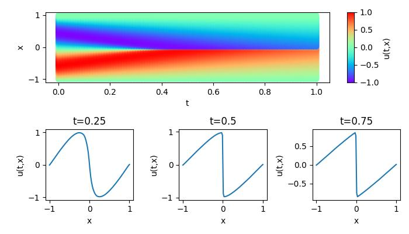

# Solve Burgers' Equation based on PINNs

<a href="https://gitee.com/mindspore/docs/blob/master/docs/mindflow/docs/source_en/physics_driven/burgers.md" target="_blank"></a>

## Overview

Computational fluid dynamics is one of the most important techniques in the field of fluid mechanics in the 21st century. The flow analysis, prediction and control can be realized by solving the governing equations of fluid mechanics by numerical method. Traditional finite element method (FEM) and finite difference method (FDM) are inefficient because of the complex simulation process (physical modeling, meshing, numerical discretization, iterative solution, etc.) and high computing costs. Therefore, it is necessary to improve the efficiency of fluid simulation with AI.

In recent years, while the development of classical theories and numerical methods with computer performance tends to be smooth, machine learning methods combine a large amount of data with neural networks realize the flow field's fast simulation. These methods can obtain the accuracy close to the traditional methods, which provides a new idea for flow field solution.

Burgers' equation is a nonlinear partial differential equation that simulates the propagation and reflection of shock waves. It is widely used in the fields of fluid mechanics, nonlinear acoustics, gas dynamics et al. It is named after Johannes Martins Hamburg (1895-1981). In this case, MindFlow fluid simulation suite is used to solve the Burgers' equation in one-dimensional viscous state based on the physical-driven PINNs (Physics Informed Neural Networks) method.

## Problem Description

The form of Burgers' equation is as follows:

$$
u_t + uu_x = \epsilon u_{xx}, \quad x \in[-1,1], t \in[0, T],
$$

where $\epsilon=0.01/\pi$ , the left of the equal sign is the convection term, and the right is the dissipation term. In this case, the Dirichlet boundary condition and the initial condition of the sine function are used. The format is as follows:

$$
u(t, -1) = u(t, 1) = 0,
$$

$$
u(0, x) = -sin(\pi x),
$$

In this case, the PINNs method is used to learn the mapping $(x, t) \mapsto u$ from position and time to corresponding physical quantities. So that the solution of Burgers' equation is realized.

## Technology Path

MindFlow solves the problem as follows:

1. Training Dataset Construction.
2. Neural Network Construction.
3. Problem Modeling.
4. Model Training.
5. Model Evaluation and Visualization.

## Training Dataset Construction

In this case, random sampling is performed according to the solution domain, initial condition and boundary value condition to generate training data sets and test data sets. The specific settings are as follows:

```python
from mindflow.data import Dataset
from mindflow.geometry import FixedPoint, Interval, TimeDomain, GeometryWithTime
from mindflow.geometry import create_config_from_edict
from .sampling_config import src_sampling_config, bc_sampling_config


def create_random_dataset(config):
    """create training dataset by online sampling"""
    coord_min = config["coord_min"]
    coord_max = config["coord_max"]

    time_interval = TimeDomain("time", 0.0, config["range_t"])
    spatial_region = Interval("flow_region", coord_min, coord_max)
    region = GeometryWithTime(spatial_region, time_interval)
    region.set_sampling_config(create_config_from_edict(src_sampling_config))

    point1 = FixedPoint("point1", coord_min)
    boundary_1 = GeometryWithTime(point1, time_interval)
    boundary_1.set_name("bc1")
    boundary_1.set_sampling_config(create_config_from_edict(bc_sampling_config))

    point2 = FixedPoint("point2", coord_max)
    boundary_2 = GeometryWithTime(point2, time_interval)
    boundary_2.set_name("bc2")
    boundary_2.set_sampling_config(create_config_from_edict(bc_sampling_config))

    geom_dict = {region: ["domain", "IC"],
                 boundary_1: ["BC"],
                 boundary_2: ["BC"]}

    dataset = Dataset(geom_dict)

    return dataset
```

## Neural Network Construction

This example uses a simple fully-connected network with a depth of 6 layers and the activation function is the `tanh` function.

```python
from mindflow.cell import FCSequential

model = FCSequential(in_channel=2, out_channel=1, layers=6, neurons=20, residual=False, act="tanh")
```

## Problem Modeling

`Problem` contains the governing equations, boundary conditions, initial conditions et al. to solve the problem.

```python
from math import pi as PI
from mindspore import ops
from mindspore import Tensor
from mindspore import dtype as mstype
from mindflow.solver import Problem
from mindflow.operators import Grad, SecondOrderGrad


class Burgers1D(Problem):
    """The 1D Burger's equations with constant boundary condition."""

    def __init__(self, model, config, domain_name=None, bc_name=None, bc_normal=None, ic_name=None):
        super(Burgers1D, self).__init__()
        self.domain_name = domain_name
        self.bc_name = bc_name
        self.ic_name = ic_name
        self.model = model
        self.grad = Grad(self.model)
        self.u_xx_cell = SecondOrderGrad(self.model, input_idx1=0, input_idx2=0, output_idx=0)
        self.reshape = ops.Reshape()
        self.split = ops.Split(1, 2)
        self.mu = Tensor(0.01 / PI, mstype.float32)
        self.pi = Tensor(PI, mstype.float32)

    def governing_equation(self, *output, **kwargs):
        """Burgers equation"""
        u = output[0]
        data = kwargs[self.domain_name]

        du_dxt = self.grad(data, None, 0, u)
        du_dx, du_dt = self.split(du_dxt)
        du_dxx = self.u_xx_cell(data)

        pde_r = du_dt + u * du_dx - self.mu * du_dxx

        return pde_r

    def boundary_condition(self, *output, **kwargs):
        """constant boundary condition"""
        u = output[0]
        return u

    def initial_condition(self, *output, **kwargs):
        """initial condition: u = - sin(x)"""
        u = output[0]
        data = kwargs[self.ic_name]
        x = self.reshape(data[:, 0], (-1, 1))
        return u + ops.sin(self.pi * x)
```

Solve the problem and define `constraint` as the loss function.

```python
train_prob = {}
for dataset in burgers_train_dataset.all_datasets:
    train_prob[dataset.name] = Burgers1D(model=model, config=config,
                                         domain_name="{}_points".format(dataset.name),
                                         ic_name="{}_points".format(dataset.name),
                                         bc_name="{}_points".format(dataset.name))
print("check problem: ", train_prob)
train_constraints = Constraints(burgers_train_dataset, train_prob)
```

## Model Training

Invoke the `Solver` interface for model training and inference.

```python
params = model.trainable_params()
optim = nn.Adam(params, 5e-3)

if config["load_ckpt"]:
    param_dict = load_checkpoint(config["load_ckpt_path"])
    load_param_into_net(model, param_dict)

solver = Solver(model,
                optimizer=optim,
                train_constraints=train_constraints,
                test_constraints=None,
                loss_scale_manager=DynamicLossScaleManager(),
                )

loss_time_callback = LossAndTimeMonitor(steps_per_epoch)
callbacks = [loss_time_callback]

if config["save_ckpt"]:
    config_ck = CheckpointConfig(save_checkpoint_steps=10, keep_checkpoint_max=2)
    ckpoint_cb = ModelCheckpoint(prefix='burgers_1d', directory=config["save_ckpt_path"], config=config_ck)
    callbacks += [ckpoint_cb]

solver.train(config["train_epoch"], train_dataset, callbacks=callbacks, dataset_sink_mode=True)
```

The model results are as follows:

```python
epoch time: 1.695 s, per step time: 211.935 ms
epoch: 4991 step: 8, loss is 0.006608422
epoch time: 1.660 s, per step time: 207.480 ms
epoch: 4992 step: 8, loss is 0.006609884
epoch time: 1.691 s, per step time: 211.332 ms
epoch: 4993 step: 8, loss is 0.0065038507
epoch time: 1.675 s, per step time: 209.326 ms
epoch: 4994 step: 8, loss is 0.0066139675
epoch time: 1.684 s, per step time: 210.445 ms
epoch: 4995 step: 8, loss is 0.00651852
epoch time: 1.657 s, per step time: 207.111 ms
epoch: 4996 step: 8, loss is 0.006519169
epoch time: 1.686 s, per step time: 210.733 ms
epoch: 4997 step: 8, loss is 0.006666567
epoch time: 1.666 s, per step time: 208.297 ms
epoch: 4998 step: 8, loss is 0.006616782
epoch time: 1.698 s, per step time: 212.293 ms
epoch: 4999 step: 8, loss is 0.0066004843
epoch time: 1.666 s, per step time: 208.225 ms
epoch: 5000 step: 8, loss is 0.006627152
epoch time: 1.690 s, per step time: 211.255 ms
==================================================================================================
predict total time: 0.03775811195373535 s
==================================================================================================
End-to-End total time: 3358.674560308456 s
```

## Model Evaluation and Visualization

After training, all data points in the flow field can be inferred. And related results can be visualized.

```python
from src import visual_result

visual_result(model, resolution=config["visual_resolution"])
```


