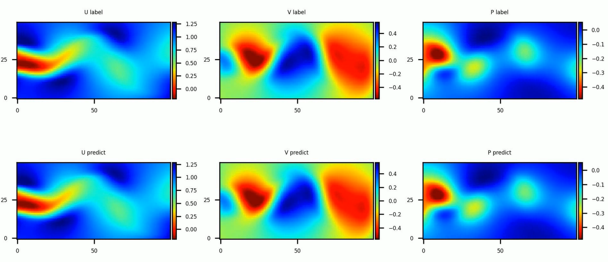

# PINNS-based solution for flow past a cylinder

<a href="https://gitee.com/mindspore/docs/blob/master/docs/mindflow/docs/source_en/physics_driven/cylinder_flow.md" target="_blank"></a>

## Overview

Flow past cylinder problem is a two-dimensional low velocity steady flow around a cylinder which is only related to the `Re` number. When `Re` is less than or equal to 1, the inertial force in the flow field is secondary to the viscous force, the streamlines in the upstream and downstream directions of the cylinder are symmetrical, and the drag coefficient is approximately inversely proportional to `Re` . The flow around this `Re` number range is called the Stokes zone; With the increase of `Re` , the streamlines in the upstream and downstream of the cylinder gradually lose symmetry. This special phenomenon reflects the peculiar nature of the interaction between the fluid and the surface of the body. Solving flow past a cylinder is a classical problem in hydromechanics.

Since it is difficult to obtain the generalized theoretical solution of the Navier-Stokes equation,the numerical method is used to solve the governing equation in the flow past cylinder scenario to predict the flow field, which is also a classical problem in computational fluid mechanics. Traditional solutions often require fine discretization of the fluid to capture the phenomena that need to be modeled. Therefore, traditional finite element method (FEM) and finite difference method (FDM) are often costly.

Physics-informed Neural Networks (PINNs) provides a new method for quickly solving complex fluid problems by using loss functions that approximate governing equations coupled with simple network configurations. In this case, the data-driven characteristic of neural network is used along with `PINNs` to solve the flow past cylinder problem.

## Navier-Stokes equation

The Navier-Stokes equation, referred to as `N-S` equation, is a classical partial differential equation in the field of fluid mechanics. In the case of viscous incompressibility, the dimensionless `N-S` equation has the following form:

$$
\frac{\partial u}{\partial x} + \frac{\partial v}{\partial y} = 0
$$

$$
\frac{\partial u} {\partial t} + u \frac{\partial u}{\partial x} + v \frac{\partial u}{\partial y} = - \frac{\partial p}{\partial x} + \frac{1} {Re} (\frac{\partial^2u}{\partial x^2} + \frac{\partial^2u}{\partial y^2})
$$

$$
\frac{\partial v} {\partial t} + u \frac{\partial v}{\partial x} + v \frac{\partial v}{\partial y} = - \frac{\partial p}{\partial y} + \frac{1} {Re} (\frac{\partial^2v}{\partial x^2} + \frac{\partial^2v}{\partial y^2})
$$

where `Re` stands for Reynolds number.

## Problem Description

In this case, the PINNs method is used to learn the mapping from the location and time to flow field quantities to solve the `N-S` equation.

$$
(x, y, t) \mapsto (u, v, p)
$$

MindFlow solves the problem as follows:

1. Random sampling is performed on the solution domain and initial-boundary value conditions to create a training data set.
2. Constructing `N-S` equations and boundary conditions.
3. Design the structure and parameters of the neural network.
4. Model training.
5. Result Analysis.

## Training Example

### Configuration file

The overall configuration file is shown below, which defines key parameters such as Reynolds number `Re`, problem domain boundary, neural network structure, learning rate, learning rate damping coefficient, training epoch, batch size, etc. File access path, case naming and other elements can also be configured here.

```python
{
    "Description": ["Solve Navier-Stokes Equations for Flow Past Cylinder"],    # Case Description
    "Case": "2D_Flow_Past_Cylinder_Reynolds_100",                               # Case Tag
    "Reynolds_number": 100,                                                     # Reynolds number
    "Minimum coordinates of the x and y axes of the coord_min": [1.0, -2.0],    # rectangle calculation domain
    "Maximum coordinates of the x and y axes of the coord_max": [8.0, 2.0],     # rectangle calculation domain
    "range_t": 7.0,                                                             # Simulation duration
    "input_size": 3,                                                            # Network input dimension
    "output_size": 3,                                                           # Network output dimension
    "residual": true,                                                           # Indicates whether the residual structure is contained.
    "layers": 10,                                                               # Number of full-mesh layers
    "neurons": 128,                                                             # Number of neurons
    "save_ckpt": true,                                                          # Indicates whether to store checkpoints.
    "load_ckpt": false,                                                         # Indicates whether to load checkpoints.
    "save_ckpt_path": "./ckpt",                                                 # checkpoint Storage Path
    "load_ckpt_path": "",                                                       # checkpoint loading path
    "train_with_eval": true,                                                    # Indicates whether to perform inference while training.
    "train_data_path": "./dataset",                                             # training data path
    "test_data_path": "./dataset",                                              # test data path
    "lr": 0.001,                                                                # Learning rate
    "milestones": [2000, 4000],                                                 # Learning rate attenuation milestone
    "lr_gamma": 0.1,                                                            # Attenuation coefficient of the learning rate
    "train_epoch": 5000,                                                        # Number of iterations of training set data
    "train_batch_size": 8192,                                                   # Size of the training batch data
    "test_batch_size": 32768,                                                   # Size of the inference batch data
    "predict_interval": 250,                                                    # Number of iteration steps for inference while training
    "vision_path": "./vision",                                                  # Path for storing the visual structure
}
```

### Import Dependency

Import the modules and interfaces on which this tutorial depends:

```python
"""train process"""
import os
import json
import time
import numpy as np

from mindspore import set_seed
from mindspore import context, Tensor, nn
from mindspore.train import DynamicLossScaleManager
from mindspore.train import ModelCheckpoint, CheckpointConfig
from mindspore.train.serialization import load_checkpoint, load_param_into_net
from mindspore import dtype as mstype

from mindflow.loss import Constraints
from mindflow.solver import Solver, LossAndTimeMonitor
from mindflow.common import L2
from mindflow.loss import MTLWeightedLossCell

from src import create_training_dataset, create_evaluation_dataset
from src import NavierStokes2D, FlowNetwork
from src import MultiStepLR,
```

### Create a dataset

In this case, the initial condition and boundary condition data of the existing flow around a cylinder with Reynolds number 100 are sampled. For the training dataset, the problem domain and time dimension of planar rectangle are constructed. Then the known initial conditions and boundary conditions are sampled. The validation set is constructed based on the existing points in the flow field.

```python
def create_evaluation_dataset(test_data_path):
    """load labeled data for evaluation"""
    print("get dataset path: {}".format(test_data_path))
    paths = [test_data_path + '/eval_points.npy', test_data_path + '/eval_label.npy']
    inputs = np.load(paths[0])
    label = np.load(paths[1])
    print("check eval dataset length: {}".format(inputs.shape))
    return inputs, label


def create_training_dataset(config):
    """create training dataset by online sampling"""
    coord_min = config["coord_min"]
    coord_max = config["coord_max"]
    rectangle = Rectangle("rect", coord_min, coord_max)

    time_interval = TimeDomain("time", 0.0, config["range_t"])
    domain_region = GeometryWithTime(rectangle, time_interval)
    domain_region.set_name("domain")
    domain_region.set_sampling_config(create_config_from_edict(domain_sampling_config))

    geom_dict = {domain_region: ["domain"]}

    data_path = config["train_data_path"]
    config_bc = ExistedDataConfig(name="bc",
                                  data_dir=[data_path + "/bc_points.npy", data_path + "/bc_label.npy"],
                                  columns_list=["points", "label"],
                                  constraint_type="BC",
                                  data_format="npy")
    config_ic = ExistedDataConfig(name="ic",
                                  data_dir=[data_path + "/ic_points.npy", data_path + "/ic_label.npy"],
                                  columns_list=["points", "label"],
                                  constraint_type="IC",
                                  data_format="npy")
    dataset = Dataset(geom_dict, existed_data_list=[config_bc, config_ic])
    return dataset
```

The sampling configuration information is as follows. Samples are uniformly distributed.

```python
domain_sampling_config = edict({
    'domain': edict({               # Internal point space sampling configuration
        'random_sampling': True,    # Indicates whether random sampling is performed.
        'size': 65536,              # Number of sampling samples
        'sampler': 'uniform'        # Random sampling mode
    }),
    'time': edict({                 # Time sampling configuration
        'random_sampling': True,    # Indicates whether random sampling is performed.
        'size': 65536,              # Number of sampling samples
        'sampler': 'uniform',       # Random sampling mode
    }),
})
```

### Modeling based on Navier-Stokes equation

`Problem` contains the governing equations, boundary conditions and initial conditions for solving the problem. The governing equation directly uses the incompressible `N-S` equation. The initial conditions and boundary conditions are obtained from the known data. Users can set different boundary conditions according to different data sets.

```python
# define problem
class NavierStokes2D(Problem):
    """
    2D NavierStokes equation
    """
    def __init__(self, model, domain_points, bc_points, ic_points, bc_label, ic_label, Re=100):
        super(NavierStokes2D, self).__init__()
        self.domain_points = domain_points
        self.bc_points = bc_points
        self.ic_points = ic_points
        self.bc_label = bc_label
        self.ic_label = ic_label

        self.grad = Grad(model)
        self.gradux_xx = Hessian(model, input_idx1=0, input_idx2=0, output_idx=0)
        self.gradux_yy = Hessian(model, input_idx1=1, input_idx2=1, output_idx=0)
        self.graduy_xx = Hessian(model, input_idx1=0, input_idx2=0, output_idx=1)
        self.graduy_yy = Hessian(model, input_idx1=1, input_idx2=1, output_idx=1)
        self.split = ops.Split(1, 3)
        # constant
        self.Re = Tensor(Re, mstype.float32)

    def governing_equation(self, *output, **kwargs):
        """governing equation"""
        flow_vars = output[0]
        u, v, _ = self.split(flow_vars)
        domain_data = kwargs[self.domain_points]

        # compute the first order derivative of u, v, p
        du_dx, du_dy, du_dt = self.split(self.grad(domain_data, None, 0, flow_vars))
        dv_dx, dv_dy, dv_dt = self.split(self.grad(domain_data, None, 1, flow_vars))
        dp_dx, dp_dy, _ = self.split(self.grad(domain_data, None, 2, flow_vars))
        # compute the second order derivative of u, v
        du_dxx = self.gradux_xx(domain_data)
        du_dyy = self.gradux_yy(domain_data)
        dv_dxx = self.graduy_xx(domain_data)
        dv_dyy = self.graduy_yy(domain_data)

        eq1 = du_dt + (u * du_dx + v * du_dy) + dp_dx - 1.0 / self.Re * (du_dxx + du_dyy)
        eq2 = dv_dt + (u * dv_dx + v * dv_dy) + dp_dy - 1.0 / self.Re * (dv_dxx + dv_dyy)
        eq3 = du_dx + dv_dy
        pde_residual = ops.Concat(1)((eq1, eq2, eq3))
        return pde_residual

    def boundary_condition(self, *output, **kwargs):
        """boundary condition"""
        flow_vars = output[0][:, :2]
        bc_label = kwargs[self.bc_label]
        bc_r = flow_vars - bc_label
        return bc_r

    def initial_condition(self, *output, **kwargs):
        """initial condition"""
        flow_vars = output[0]
        ic_label = kwargs[self.ic_label]
        ic_r = flow_vars - ic_label
        return ic_r
```

### Building a Neural Network

The depth of the neural network, the number of neurons, and whether residual structures are included in the `config` file. In this example, a fully-connected network with depth of 10, 128 neurons at each layer. Residual structures are also used. The residual structure can effectively keep gradients from disappearing at each layer, which makes deeper network structures possible.

```python
class FlowNetwork(nn.Cell):
    """
    Full-connect networks with residual layer available
    """

    def __init__(self, input_dim, output_dim, coord_min, coord_max,
                 num_layers=10, neurons=64, activation="tanh", residual=False):
        super(FlowNetwork, self).__init__()
        self.activation = get_activation(activation)
        self.lower_x = Tensor(np.array(coord_min).astype(np.float32))
        self.upper_x = Tensor(np.array(coord_max).astype(np.float32))
        self.residual = residual

        self.fc1 = LinearBlock(input_dim, neurons, weight_init=TruncatedNormal(sigma=np.sqrt(2.0 / (input_dim + neurons))))
        self.cell_list = nn.CellList()
        if num_layers < 2:
            raise ValueError("Total layers number should be at least 2, but got: {}".format(num_layers))
        self.num_hidden_layers = num_layers - 2
        for _ in range(self.num_hidden_layers):
            linear = LinearBlock(neurons, neurons, weight_init=TruncatedNormal(sigma=np.sqrt(1.0 / neurons)))
            self.cell_list.append(linear)
        self.fc2 = LinearBlock(neurons, output_dim, weight_init=TruncatedNormal(sigma=np.sqrt(2.0 / (neurons + output_dim))))


    def construct(self, *inputs):
        """fc network"""
        x = inputs[0]
        x = 2.0 * (x - self.lower_x) / (self.upper_x - self.lower_x) - 1.0
        out = self.fc1(x)
        out = self.activation(out)
        for i in range(self.num_hidden_layers):
            if self.residual:
                out = self.activation(out + self.cell_list[i](out))
            else:
                out = self.activation(self.cell_list[i](out))
        out = self.fc2(out)
        return out
```

### Learning Rate

The learning rate increases with epoch decreasing at different critical points.

```python
class MultiStepLR(_LRScheduler):
    """
    Multi-step learning rate scheduler

    Decays the learning rate by gamma once the number of epoch reaches one of the milestones.

    Args:
        lr (float): Initial learning rate which is the lower boundary in the cycle.
        milestones (list): List of epoch indices. Must be increasing.
        gamma (float): Multiplicative factor of learning rate decay.
        steps_per_epoch (int): The number of steps per epoch to train for.
        max_epoch (int): The number of epochs to train for.

    Outputs:
        numpy.ndarray, shape=(1, steps_per_epoch*max_epoch)

    Example:
        >>> # Assuming optimizer uses lr = 0.05 for all groups
        >>> # lr = 0.05     if epoch < 30
        >>> # lr = 0.005    if 30 <= epoch < 80
        >>> # lr = 0.0005   if epoch >= 80
        >>> scheduler = MultiStepLR(lr=0.1, milestones=[30,80], gamma=0.1, steps_per_epoch=5000, max_epoch=90)
        >>> lr = scheduler.get_lr()
    """

    def __init__(self, lr, milestones, gamma, steps_per_epoch, max_epoch):
        self.milestones = Counter(milestones)
        self.gamma = gamma
        super(MultiStepLR, self).__init__(lr, max_epoch, steps_per_epoch)

    def get_lr(self):
        lr_each_step = []
        current_lr = self.base_lr
        for i in range(self.total_steps):
            cur_ep = i // self.steps_per_epoch
            if i % self.steps_per_epoch == 0 and cur_ep in self.milestones:
                current_lr = current_lr * self.gamma
            lr = current_lr
            lr_each_step.append(lr)
        return np.array(lr_each_step).astype(np.float32)
```

### Define Losses

Define `Constraints` as loss.

```python
# define problem
train_prob = {}
for dataset in cylinder_dataset.all_datasets:
    train_prob[dataset.name] = NavierStokes2D(model=model,
                                              domain_points=dataset.name + "_points",
                                              ic_points=dataset.name + "_points",
                                              bc_points=dataset.name + "_points",
                                              ic_label=dataset.name + "_label",
                                              bc_label=dataset.name + "_label",
                                              Re=config["Reynolds_number"])
print("check problem: ", train_prob)
train_constraints = Constraints(cylinder_dataset, train_prob)
```

### Model Training

The `Solver` class is the model training interface. The PINNs solver object can be defined by input optimizer, network model, loss function, loss scaling strategy, etc.

```python
# define solver
solver = Solver(model,
                optimizer=optim,
                train_constraints=train_constraints,
                test_constraints=None,
                metrics={'l2': L2(), 'distance': nn.MAE()},
                loss_fn='smooth_l1_loss',
                loss_scale_manager=DynamicLossScaleManager(init_loss_scale=2 ** 10, scale_window=2000),
                mtl_weighted_cell=mtl,
                )

loss_time_callback = LossAndTimeMonitor(steps_per_epoch)
callbacks = [loss_time_callback]
if config.get("train_with_eval", False):
    inputs, label = create_evaluation_dataset(config["test_data_path"])
    predict_callback = PredictCallback(model, inputs, label, config=config, visual_fn=visualization)
    callbacks += [predict_callback]
if config["save_ckpt"]:
    config_ck = CheckpointConfig(save_checkpoint_steps=10,
                                 keep_checkpoint_max=2)
    ckpoint_cb = ModelCheckpoint(prefix='ckpt_flow_past_cylinder_Re100',
                                 directory=config["save_ckpt_path"], config=config_ck)
    callbacks += [ckpoint_cb]

solver.train(config["train_epoch"], train_dataset, callbacks=callbacks, dataset_sink_mode=True)
```

## Network training result

The command output is as follows:

```python
epoch: 4991 step: 8, loss is 0.006608422
epoch time: 1.929 s, per step time: 241.148 ms
epoch: 4992 step: 8, loss is 0.006609884
epoch time: 1.897 s, per step time: 237.084 ms
epoch: 4993 step: 8, loss is 0.0065038507
epoch time: 1.861 s, per step time: 232.597 ms
epoch: 4994 step: 8, loss is 0.0066139675
epoch time: 1.948 s, per step time: 243.444 ms
epoch: 4995 step: 8, loss is 0.00651852
epoch time: 1.919 s, per step time: 239.928 ms
epoch: 4996 step: 8, loss is 0.006519169
epoch time: 1.959 s, per step time: 244.854 ms
epoch: 4997 step: 8, loss is 0.006666567
epoch time: 1.910 s, per step time: 238.738 ms
epoch: 4998 step: 8, loss is 0.006616782
epoch time: 1.958 s, per step time: 244.713 ms
epoch: 4999 step: 8, loss is 0.0066004843
epoch time: 1.860 s, per step time: 232.534 ms
epoch: 5000 step: 8, loss is 0.006627152
epoch time: 1.966 s, per step time: 245.751 ms
==================================================================================================
predict total time: 0.07975101470947266 s
==================================================================================================
End-to-End total time: 10051.670986890793 s
```

### Analysis

The following figure shows the errors versus time training epoch 5000. As the epoch number increases, the errors decreases accordingly.
Loss corresponding to 5000 epochs:


During the calculation, the callback records the predicted values of U, V, and P at each step. The difference between the predicted values and the actual values is small.


