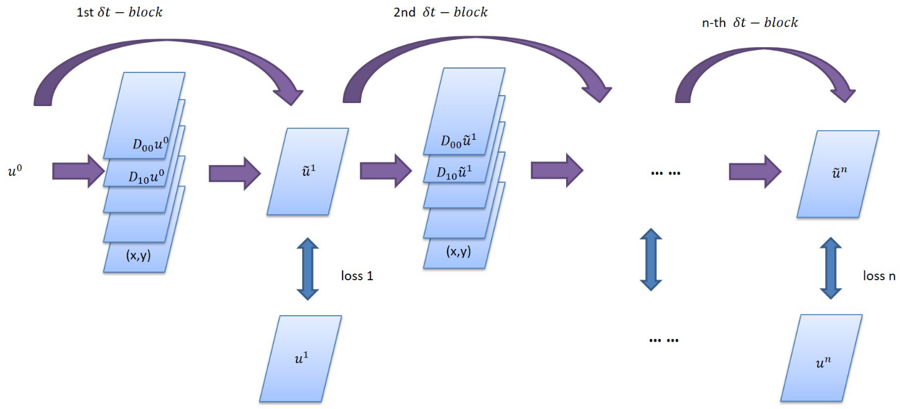
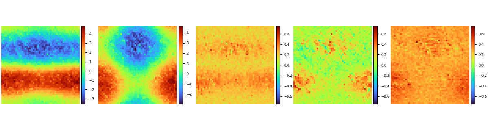
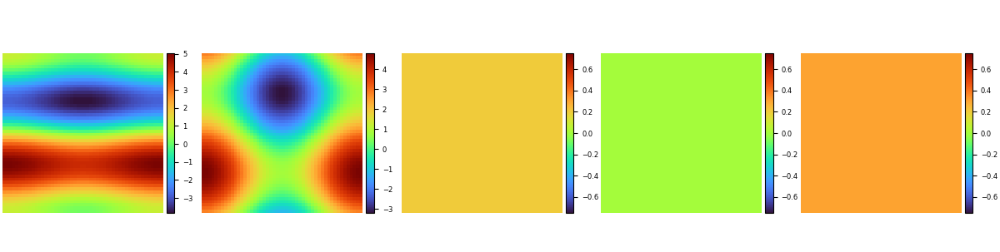

# Solve Inverse Problems of Differential Equations with PDE-Net and Realize Long-Term Prediction

## Overview

PDE-Net is a feedforward deep network proposed by Zichao Long et al. to learn partial differential equations from data, predict the dynamic characteristics of complex systems accurately and uncover potential PDE models. The basic idea of PDE-Net is to approximate differential operators by learning convolution kernels (filters). Neural networks or other machine learning methods are applied to fit unknown nonlinear responses. Numerical experiments show that the model can identify the observed dynamical equations and predict the dynamical behavior over a relatively long period of time, even in noisy environments. More information can be found in [the original paper](https://arxiv.org/abs/1710.09668).

## Problem Description

This case solves the inverse problem of convection-diffusion partial differential equations with variable parameters and realizes long-term prediction.

## Governing Equation

In this study, the convection-diffusion equation is of the form:

$$
u_t = a(x,y) u_x + b(x,y) u_y + c u_{xx} + d u_{yy}, \quad (x,y) \in[0,2 \pi] \times[0,2 \pi]
$$

$$
u|_{t=0} = u_0(x,y)
$$

The coefficients of each derivative are:

$$
a(x,y)=0.5(cos(y)+x(2\pi-x)sin(x))+0.6 \quad
b(x,y)=2(cos(y)+sin(x))+0.8
$$

$$
c=0.2 \quad
d=0.3
$$

### Model Structure of the PDE-Net

The PDE-Net consists of multiple $\delta T$ Blocks in series to implement prediction of long sequence information. Each $\delta T$ Block includes several moment matrixes of trainable parameters. The matrixes can be converted to convolution kernels according to a mapping relationship. Thereby the derivatives of the physical field can be obtained. After linearly combining the derivative and its corresponding physical quantity, the information of the next time step can be deduced by using the forward Euler method.




## Script Description

You can set training parameters and sampling parameters in `config.py`.

```python
train_config = ed({
    "name": "pde_net",                          # Case Description
    "log_path": "./logs/result/",               # log file location
    "summary_dir": "./summary_dir/summary",     # summary file location
    "eval_interval": 10,                        # Evaluation period
    "lr_scheduler_gamma": 0.5,                  # learning rate scheduler coefficient
    "lr": 0.001,                                # Initial learning rate
    "save_epoch_interval": 50,                  # ckpt save period
    "mesh_size": 50,                            # Mesh size
    "solver_mesh_scale": 5,                     # Sampling ratio of the solver data
    "enable_noise": True,                       # Whether to add noise to the sample
    "start_noise_level": 0.015,                 # Input noise/signal ratio
    "end_noise_level": 0.015,                   # Output noise/signal ratio
    "variant_coe_magnitude": 1.0,               # Differential Equation Coefficient Scaling Ratio
    "init_freq": 4,                             # Frequency in the initial condition
    "batch_size": 16,                           # batch size
    "mindrecord": "src/data.mindrecord",        # Mindrecord save location
    "epochs": 500,                              # number of epochs
    "multi_step": 20,                           # number of steps
    "learning_rate_reduce_times": 4,            # learning rate adjustment times
    "dt": 0.015,                                # time step predicted by a single step
    "kernel_size": 5,                           # size of the convolution kernel
    "max_order": 4,                             # maximum differential order corresponding to the convolution kernel
    "channels": 1,                              # number of data channels
    "perodic_padding": True,                    # whether to use periodic boundary conditions
    "if_frozen": False,                         # whether to freeze parameters in the moment
    "enable_moment": True,                      # whether to use the moment to control convolution
})
```

## Solution Process

The PDE-Net solution to the inverse problem of partial differential equations consists of the following five steps:

1. Data Generation and Loading.
2. Model Construction.
3. Model Training.
4. Model Evaluation and Visualization.
5. Long-Term Prediction.

### Data Generation and Loading

The distribution of the initial physical field of the PDE-Net is obtained according to the Fourier series of the random coefficients. The convection-diffusion equation is solved according to the spectral method, where step represents the number of series of $\delta T$ Blocks. In the main program, you can invoke the DataGenerator to generate the data of the corresponding step and save the data in the mindrecord format in the data directory.

```python
from src.data_generator import DataGenerator

data = DataGenerator(step=i, config=config, mode="train", data_size=2*config["batch_size"], file_name="data/train_step" + str(i) + ".mindrecord")
data.process()
```

`DataPrepare` is used to generate data sets required for model training. During training, `train_data_prepare` can be invoked to generate training sets and test sets. You can call `test_data_prepare` to generate test data sets in long-term prediction and result visualization.

```python
import mindspore.dataset as ds


class DataPrepare():
    """Obtain dataset for train or test from mindrecord."""

    def __init__(self, config, data_file):
        self.mesh_size = config["mesh_size"]
        self.batch_size = config["batch_size"]
        self.data_file = data_file

    def test_data_prepare(self, step):
        dataset = ds.MindDataset(dataset_files=self.data_file, shuffle=True, columns_list=["u0", "u_step{}".format(step)])
        dataset = dataset.batch(batch_size=1)
        return dataset

    def train_data_prepare(self):
        dataset = ds.MindDataset(dataset_files=self.data_file, shuffle=True, columns_list=["u0", "uT"])
        dataset = dataset.batch(batch_size=self.batch_size, drop_remainder=True)
        operations = [lambda x, y: (
            x.reshape(-1, 1, self.mesh_size, self.mesh_size), y.reshape(-1, 1, self.mesh_size, self.mesh_size))]
        dataset = dataset.map(operations, input_columns=["u0", "uT"])
        dataset_train, dataset_eval = dataset.split([0.5, 0.5])
        return dataset_train, dataset_eval
```

### Model Construction

MindFlow provides the `PDENet` interface to directly create a PDE-Net model. You need to specify the width, height, data depth, boundary condition, and highest order of fitting.

```python
from mindflow.cell.neural_operators import PDENet

def init_model(config, step):
    return PDENet(height=config["mesh_size"],
                  width=config["mesh_size"],
                  channels=config["channels"],
                  kernel_size=config["kernel_size"],
                  max_order=config["max_order"],
                  step=step,
                  dx=2 * np.pi / config["mesh_size"],
                  dy=2 * np.pi / config["mesh_size"],
                  dt=config["dt"],
                  periodic=config["perodic_padding"],
                  enable_moment=config["enable_moment"],
                  if_fronzen=config["if_frozen"],
                  )
```

### Model Training

The parameters of each $\delta T$ block are shared. Therefore, the model is trained one by one based on the number of connected $\delta T$ blocks. When step is 1, the model is in the warm-up phase. The moments of the PDE-Net are frozen. The parameters in the moments are not involved in training. Each time a $\delta T$ block is added, the program generates data and reads data sets. After the model is initialized, the program loads the checkpoint trained in the previous step, defines the optimizer, mode, and loss function. The the model is trained. During training process, the model reflects the model performance in real time based on the callback function.

```python
def train_single_step(step, logger, config, lr):
    dataset = DataPrepare(config=config, data_file="data/train_step{}.mindrecord".format(step))
    train_dataset, eval_dataset = dataset.train_data_prepare()
    print("dataset size: {}".format(train_dataset.get_dataset_size()))

    model = init_model(config, step)

    epoch = config["epochs"]
    warm_up_epoch_scale = 10
    if step == 1:
        model.if_fronzen = True
        epoch = warm_up_epoch_scale * epoch
    elif step == 2:
        param_dict = load_checkpoint(
            "./summary_dir/summary/ckpt/step_{}/pdenet-{}_1.ckpt".format(step - 1, epoch * 10))
        load_param_into_net(model, param_dict)
        print("Load pre-trained model successfully")
    else:
        param_dict = load_checkpoint(
            "./summary_dir/summary/ckpt/step_{}/pdenet-{}_1.ckpt".format(step - 1, epoch))
        load_param_into_net(model, param_dict)
        print("Load pre-trained model successfully")

    optimizer = nn.Adam(model.trainable_params(), learning_rate=Tensor(lr))
    loss_func = LpLoss(size_average=False)
    loss_scale = DynamicLossScaleManager()
    solver = Model(model,
                   optimizer=optimizer,
                   loss_scale_manager=loss_scale,
                   loss_fn=loss_func
                   )

    pred_cb, time_cb = _callback(model, eval_dataset, logger, step, config)
    ckpt_cb = _checkpoint("./summary_dir/summary/ckpt/step_{}".format(step), config["save_epoch_interval"])

    solver.train(epoch=epoch,
                 train_dataset=train_dataset,
                 callbacks=[LossMonitor(), pred_cb, time_cb, ckpt_cb],
                 dataset_sink_mode=True
                 )

def train(config, logger):
    lr = config["lr"]
    for i in range(1, config["multi_step"] + 1):
        data = DataGenerator(step=i, config=config, mode="train", data_size=2 * config["batch_size"],
                             file_name="data/train_step{}.mindrecord".format(i))
        data.process()
        lr = _scheduler(int(config["multi_step"] / config["learning_rate_reduce_times"]), step=i, lr=lr)
        train_single_step(step=i, config=config, logger=logger, lr=lr)
```

The model training process is as follows:

```python
...
Train epoch time: 202.947 ms, per step time: 202.947 ms
epoch: 487 step: 1, loss is Tensor(shape=[], dtype=Float32, value= 0.663754)
Train epoch time: 159.724 ms, per step time: 159.724 ms
epoch: 488 step: 1, loss is Tensor(shape=[], dtype=Float32, value= 0.651065)
Train epoch time: 168.118 ms, per step time: 168.118 ms
epoch: 489 step: 1, loss is Tensor(shape=[], dtype=Float32, value= 0.648911)
Train epoch time: 151.441 ms, per step time: 151.441 ms
epoch: 490 step: 1, loss is Tensor(shape=[], dtype=Float32, value= 0.648038)
================================Start Evaluation================================
LpLoss_error: 0.04020831733942032
=================================End Evaluation=================================
predict total time: 0.4999086856842041 s
Train epoch time: 658.657 ms, per step time: 658.657 ms
epoch: 491 step: 1, loss is Tensor(shape=[], dtype=Float32, value= 0.640651)
Train epoch time: 113.954 ms, per step time: 113.954 ms
epoch: 492 step: 1, loss is Tensor(shape=[], dtype=Float32, value= 0.630344)
Train epoch time: 166.617 ms, per step time: 166.617 ms
epoch: 493 step: 1, loss is Tensor(shape=[], dtype=Float32, value= 0.606285)
Train epoch time: 182.399 ms, per step time: 182.399 ms
epoch: 494 step: 1, loss is Tensor(shape=[], dtype=Float32, value= 0.639116)
Train epoch time: 133.293 ms, per step time: 133.293 ms
epoch: 495 step: 1, loss is Tensor(shape=[], dtype=Float32, value= 0.631353)
Train epoch time: 136.290 ms, per step time: 136.290 ms
epoch: 496 step: 1, loss is Tensor(shape=[], dtype=Float32, value= 0.638366)
Train epoch time: 219.318 ms, per step time: 219.318 ms
epoch: 497 step: 1, loss is Tensor(shape=[], dtype=Float32, value= 0.639544)
Train epoch time: 202.168 ms, per step time: 202.168 ms
epoch: 498 step: 1, loss is Tensor(shape=[], dtype=Float32, value= 0.631913)
Train epoch time: 151.460 ms, per step time: 151.460 ms
epoch: 499 step: 1, loss is Tensor(shape=[], dtype=Float32, value= 0.640468)
Train epoch time: 138.932 ms, per step time: 138.932 ms
epoch: 500 step: 1, loss is Tensor(shape=[], dtype=Float32, value= 0.640138)
================================Start Evaluation================================
LpLoss_error: 0.03963303565979004
=================================End Evaluation=================================
predict total time: 0.5544295310974121 s
```

### Model Evaluation and Visualization

After the model training is complete, run the visualization.py file to test and visualize the model training result. The following figure shows the comparison between the prediction result and label.


The coefficient regression results of the partial differential equation are as follows:



The data labels for the coefficients of the partial differential equation are as follows:



### Long-Term Prediction

Further, the trained PDE-Net can be used for longer predictions. Perform multiple sets of tests and plot 25% and 75% of the error as banded curves, as shown in the figure:


