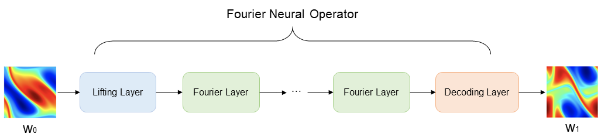
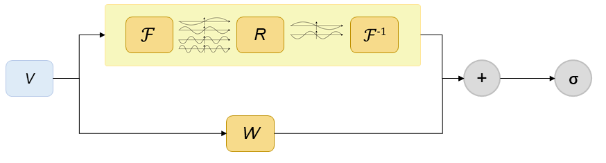

# 基于Fourier Neural Operator的Burgers' equation求解

<a href="https://gitee.com/mindspore/docs/blob/master/docs/mindflow/docs/source_zh_cn/data_driven/fno1d.md" target="_blank"></a>

## 概述

计算流体力学是21世纪流体力学领域的重要技术之一，其通过使用数值方法在计算机中对流体力学的控制方程进行求解，从而实现流动的分析、预测和控制。传统的有限元法（finite element method，FEM）和有限差分法（finite difference method，FDM）常用于复杂的仿真流程（物理建模，网格划分，数值离散，迭代求解等）和较高的计算成本，往往效率低下。因此，借助AI提升流体仿真效率是十分必要的。

近年来，随着神经网络的迅猛发展，为科学计算提供了新的范式。经典的神经网络是在有限维度的空间进行映射，只能学习与特定离散化相关的解。与经典神经网络不同，傅里叶神经算子（Fourier Neural Operator，FNO）是一种能够学习无限维函数空间映射的新型深度学习架构。该架构可直接学习从任意函数参数到解的映射，用于解决一类偏微分方程的求解问题，具有更强的泛化能力。更多信息可参考[原文](https://arxiv.org/abs/2010.08895)。

本案例教程介绍利用傅里叶神经算子的1-d Burgers'方程求解方法。

## 伯格斯方程（Burgers' equation）

一维伯格斯方程（1-d Burgers' equation）是一个非线性偏微分方程，具有广泛应用，包括一维粘性流体流动建模。它的形式如下：

$$
\partial_t u(x, t)+\partial_x (u^2(x, t)/2)=\nu \partial_{xx} u(x, t), \quad x \in(0,1), t \in(0, 1]
$$

$$
u(x, 0)=u_0(x), \quad x \in(0,1)
$$

其中$u$表示速度场，$u_0$表示初始条件，$\nu$表示粘度系数。

## 问题描述

本案例利用Fourier Neural Operator学习初始状态到下一时刻状态的映射，实现一维Burgers'方程的求解：

$$
u_0 \mapsto u(\cdot, 1)
$$

MindFlow求解该问题的具体流程如下：

1. 配置网络与训练参数。
2. 创建训练数据集。
3. 构建神经网络。
4. 定义损失函数。
5. 定义模型测试模块。
6. 模型训练。

## Fourier Neural Operator

Fourier Neural Operator模型构架如下图所示。图中$w_0(x)$表示初始涡度，通过Lifting Layer实现输入向量的高维映射，然后将映射结果作为Fourier Layer的输入，进行频域信息的非线性变换，最后由Decoder Layer将变换结果映射至最终的预测结果$w_1(x)$。

Lifting Layer、Fourier Layer以及Decoder Layer共同组成了Fourier Neural Operator。



Fourier Layer网络结构如下图所示。图中V表示输入向量，上框表示向量经过傅里叶变换后，经过线性变换R，过滤高频信息，然后进行傅里叶逆变换；另一分支经过线性变换W，最后通过激活函数，得到Fourier Layer输出向量。



### 配置文件

配置文件包括四类参数，分别为模型相关参数（model）、数据相关参数（data）、优化器相关参数（optimizer）、输出相关参数（callback）。其中FNO模型最重要的参数为modes、width与depth，分别控制模型中频率保留数量、通道数以及FNO模块叠加数量。具体参数配置含义默认值如下：

```python
model:
  name: FNO1D                       # 模型名称
  input_dims: 1                     # 输入向量空间维度
  output_dims: 1                    # 输出向量空间维度
  input_resolution: 1024            # 输入向量分辨率
  modes: 12                         # 低频分量的保留数目
  width: 32                         # 输入向量升维后隐藏层的空间维度
  depth: 8                          # 输入向量升维后隐藏层的空间维度
data:
  name: "burgers1d"                 # 数据名称
  path: "/path/to/data"             # 数据路径
  train_size: 1000                  # 训练集样本量
  test_size: 200                    # 测试集样本量
  batch_size: 8                     # 批数据大小
  sub: 8                            # 创建数据集时的采样间隔
optimizer:
  initial_lr: 0.001                 # 初始学习率
  weight_decay: 0.0                 # 权重衰减率
  gamma: 0.5                        # 权重衰减率
  train_epochs: 100                 # 迭代训练数据集的次数
  valid_epochs: 10                  # 迭代验证数据集的次数
callback:
  summary_dir: "/path/to/summary"   # 迭代训练数据集的次数
  save_checkpoint_steps: 50         # 保存checkpoint的迭代间隔数
  keep_checkpoint_max: 10           # 保存checkpoint的最大数目
```

### 导入依赖

导入本教程所依赖模块与接口:

```python
import mindspore.nn as nn
from mindspore import set_seed
from mindspore import Tensor
from mindspore import context
from mindspore.train import LossMonitor, TimeMonitor
from mindspore.train import DynamicLossScaleManager

from mindflow.solver import Solver
from mindflow.cell.neural_operators import FNO1D

from src.lr_scheduler import warmup_cosine_annealing_lr
from src.dataset import create_dataset
from src.utils import load_config
from src.loss import RelativeRMSELoss
```

### 创建数据集

本案例根据Zongyi Li在 [Fourier Neural Operator for Parametric Partial Differential Equations](https://arxiv.org/pdf/2010.08895.pdf) 一文中对数据集的设置生成训练数据集与测试数据集。具体设置如下：
基于周期性边界，生成满足如下分布的初始条件$w_0(x)$：

$$
w_0 \sim \mu, \mu=\mathcal{N}\left(0,7^{3 / 2}(-\Delta+49 I)^{-2.5}\right)
$$

外力项设置为：

$$
f(x)=0.1\left(\sin \left(2 \pi\left(x_1+x_2\right)\right)+\right.\cos(2 \pi(x_1+x_2)))
$$

采用`Crank-Nicolson`方法生成数据，时间步长设置为1e-4，最终数据以每 t = 1 个时间单位记录解。所有数据均在256×256的网格上生成，并被下采样至64×64网格。本案例选取粘度系数$\nu=1e−5$，训练集样本量为1000个，测试集样本量为200个。

```python
# create dataset for train
config = load_config('path/to/config')
data_params = config["data"]
model_params = config["model"]
train_dataset = create_dataset(data_params,
                               input_resolution=model_params["input_resolution"],
                               shuffle=True)
```

代码中`load_config`引用自`utils.py`，`create_dataset`引用自`dataset.py`，data_params与model_params中对应参数分别在配置文件中配置。

### 构建神经网络

网络由1层Lifting layer、1层Decoder layer以及多层Fourier Layer叠加组成：

- Lifting layer对应样例代码中`FNO1D.fc0`，将输出数据$x$映射至高维；

- 多层Fourier Layer的叠加对应样例代码中`FNO1D.fno_seq`，本案例采用离散傅里叶变换实现时域与频域的转换；

- Decoder layer对应代码中`FNO1D.fc1`与`FNO1D.fc2`，获得最终的预测值。

基于上述网络结构，进行模型初始化，其中model_params中的配置可在配置文件中修改。

```python
model = FNO1D(input_dims=model_params["input_dims"],
              output_dims=model_params["output_dims"],
              resolution=model_params["resolution"],
              modes=model_params["modes"],
              channels=model_params["channels"],
              depth=model_params["depth"],
              mlp_ratio=model_params["mlp_ratio"])
```

### 定义损失函数

使用相对均方根误差作为网络训练损失函数：

```python
import mindspore
import mindspore.nn as nn
from mindspore import ops

class RelativeRMSELoss(nn.LossBase):
    def __init__(self, reduction="sum"):
        super(RelativeRMSELoss, self).__init__(reduction=reduction)

    def construct(self, prediction, label):
        prediction = ops.Cast()(prediction, mindspore.float32)
        batch_size = ops.shape[0]
        diff_norms = ops.square(prediction.reshape(batch_size, -1) - label.reshape(batch_size, -1)).sum(axis=1)
        label_norms = ops.square(label.reshape(batch_size, -1)).sum(axis=1)
        rel_error = ops.div(ops.sqrt(diff_norms), ops.sqrt(label_norms))
        return self.get_loss(rel_error)
```

### 定义模型测试

通过自定义的PredictCallback函数，实现边训练边推理的功能。用户可以直接加载测试数据集，每训练n个epoch后输出一次测试集上的推理精度，n的大小通过配置文件中的eval_interval进行设置。

```python
import time
import numpy as np

from mindspore import Tensor
from mindspore.train import Callback
from mindspore.train.summary import SummaryRecord
from mindspore import dtype as mstype

class PredictCallback(Callback):
    """
    Monitor the prediction accuracy in training.

    Args:
        model (Cell): Prediction network cell.
        inputs (Array): Input data of prediction.
        label (Array): Label data of prediction.
        config (dict): config info of prediction.
        visual_fn (dict): Visualization function. Default: None.
    """

    def __init__(self, model, inputs, label, config, summary_dir):
        super(PredictCallback, self).__init__()
        self.model = model
        self.inputs = inputs
        self.label = label
        self.length = label.shape[0]
        self.summary_dir = summary_dir
        self.predict_interval = config.get("eval_interval", 10)
        self.batch_size = config.get("test_batch_size", 1)
        self.rms_error = 1.0
        print("check test dataset shape: {}, {}".format(self.inputs.shape, self.label.shape))

    def __enter__(self):
        self.summary_record = SummaryRecord(self.summary_dir)
        return self

    def __exit__(self, *exc_args):
        self.summary_record.close()

    def epoch_end(self, run_context):
        """
        Evaluate the model at the end of epoch.

        Args:
            run_context (RunContext): Context of the train running.
        """
        cb_params = run_context.original_args()
        if cb_params.cur_epoch_num % self.predict_interval == 0:
            print("================================Start Evaluation================================")
            time_beg = time.time()
            rms_error = 0.0
            max_error = 0.0
            for i in range(self.length):
                label = self.label[i:i + 1]
                test_batch = Tensor(self.inputs[i:i + 1], dtype=mstype.float32)
                prediction = self.model(test_batch)
                prediction = prediction.asnumpy()
                rms_error_step = self._calculate_error(label, prediction)
                rms_error += rms_error_step

                if rms_error_step >= max_error:
                    max_error = rms_error_step

            self.rms_error = rms_error / self.length
            print("mean rms_error:", self.rms_error)
            self.summary_record.add_value('scalar', 'rms_error', Tensor(self.rms_error))
            print("=================================End Evaluation=================================")
            print("predict total time: {} s".format(time.time() - time_beg))
            self.summary_record.record(cb_params.cur_step_num)

    def _calculate_error(self, label, prediction):
        """calculate l2-error to evaluate accuracy"""
        rel_error = np.sqrt(np.sum(np.square(label.reshape(self.batch_size, -1) -
                                             prediction.reshape(self.batch_size, -1)))) / \
                    np.sqrt(np.sum(np.square(prediction.reshape(self.batch_size, -1))))
        return rel_error

    def get_rms_error(self):
        return self.rms_error
```

PredictCallback初始化：

```python
pred_cb = PredictCallback(model=model,
                          inputs=test_input,
                          label=test_label,
                          config=config,
                          summary_dir=summary_dir)
```

### 模型训练与推理

Solver类是模型训练和推理的接口。输入优化器、网络模型、损失函数、损失缩放策略等，即可定义求解器对象solver。在该案例中利用MindSpore + Ascend混合精度模式训练网络，从而完成一维Burgers'方程求解。代码中optimizer_params、model_params对应各项参数均在配置文件中修改。

```python
# optimizer
steps_per_epoch = train_dataset.get_dataset_size()
lr = warmup_cosine_annealing_lr(lr=optimizer_params["initial_lr"],
                                steps_per_epoch=steps_per_epoch,
                                warmup_epochs=1,
                                max_epoch=optimizer_params["train_epochs"])
optimizer = nn.Adam(model.trainable_params(), learning_rate=Tensor(lr))

# prepare loss function
loss_scale = DynamicLossScaleManager()
loss_fn = RelativeRMSELoss()

# define solver
solver = Solver(model,
                optimizer=optimizer,
                loss_scale_manager=loss_scale,
                loss_fn=loss_fn,
                )
solver.train(epoch=optimizer_params["train_epochs"],
             train_dataset=train_dataset,
             callbacks=[LossMonitor(), TimeMonitor(), pred_cb],
             dataset_sink_mode=True)
```

## 网络训练结果

运行结果如下：

```python
......
epoch: 91 step: 125, loss is 0.023883705958724022
Train epoch time: 1661.097 ms, per step time: 13.289 ms
epoch: 92 step: 125, loss is 0.03884338587522507
Train epoch time: 1697.662 ms, per step time: 13.581 ms
epoch: 93 step: 125, loss is 0.022736992686986923
Train epoch time: 1582.604 ms, per step time: 12.661 ms
epoch: 94 step: 125, loss is 0.020916245877742767
Train epoch time: 1452.545 ms, per step time: 11.620 ms
epoch: 95 step: 125, loss is 0.02459101565182209
Train epoch time: 1440.897 ms, per step time: 11.527 ms
epoch: 96 step: 125, loss is 0.021852120757102966
Train epoch time: 1443.364 ms, per step time: 11.547 ms
epoch: 97 step: 125, loss is 0.02737339772284031
Train epoch time: 1413.037 ms, per step time: 11.304 ms
epoch: 98 step: 125, loss is 0.024358950555324554
Train epoch time: 1427.533 ms, per step time: 11.420 ms
epoch: 99 step: 125, loss is 0.026329636573791504
Train epoch time: 1427.751 ms, per step time: 11.422 ms
epoch: 100 step: 125, loss is 0.029131107032299042
Train epoch time: 1444.621 ms, per step time: 11.557 ms
================================Start Evaluation================================
mean rms_error: 0.003944212107453496
=================================End Evaluation=================================
......
```
