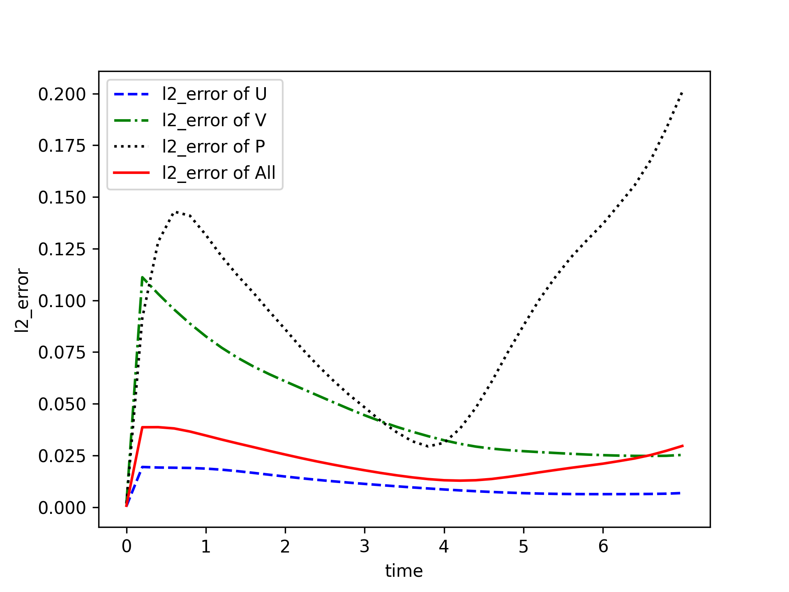
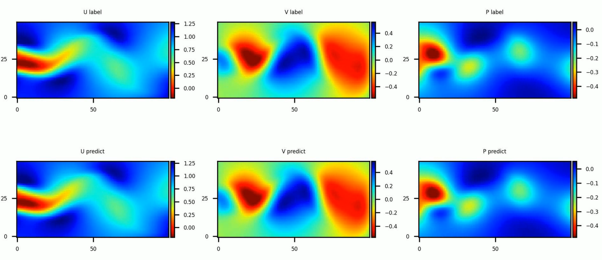

# 基于PINNs关于圆柱绕流的Navier-Stokes equation求解

## 概述

圆柱绕流，是指二维圆柱低速定常绕流的流型只与`Re`数有关。在`Re`≤1时，流场中的惯性力与粘性力相比居次要地位，圆柱上下游的流线前后对称，阻力系数近似与`Re`成反比，此`Re`数范围的绕流称为斯托克斯区；随着Re的增大，圆柱上下游的流线逐渐失去对称性。这种特殊的现象反映了流体与物体表面相互作用的奇特本质，求解圆柱绕流则是流体力学中的经典问题。

由于控制方程纳维-斯托克斯方程（Navier-Stokes equation）难以得到泛化的理论解，使用数值方法对圆柱绕流场景下控制方程进行求解，从而预测流场的流动，成为计算流体力学中的样板问题。传统求解方法通常需要对流体进行精细离散化，以捕获需要建模的现象。因此，传统有限元法（finite element method，FEM）和有限差分法（finite difference method，FDM）往往成本比较大。

物理启发的神经网络方法（Physics-informed Neural Networks），以下简称`PINNs`，通过使用逼近控制方程的损失函数以及简单的网络构型，为快速求解复杂流体问题提供了新的方法。本案例利用神经网络数据驱动特性，结合`PINNs`求解圆柱绕流问题。

## 纳维-斯托克斯方程（Navier-Stokes equation）

纳维-斯托克斯方程（Navier-Stokes equation），简称`N-S`方程，是流体力学领域的经典偏微分方程，在粘性不可压缩情况下，无量纲`N-S`方程的形式如下：

$$
\frac{\partial u}{\partial x} + \frac{\partial v}{\partial y} = 0
$$

$$
\frac{\partial u} {\partial t} + u \frac{\partial u}{\partial x} + v \frac{\partial u}{\partial y} = - \frac{\partial p}{\partial x} + \frac{1} {Re} (\frac{\partial^2u}{\partial x^2} + \frac{\partial^2u}{\partial y^2})
$$

$$
\frac{\partial v} {\partial t} + u \frac{\partial v}{\partial x} + v \frac{\partial v}{\partial y} = - \frac{\partial p}{\partial y} + \frac{1} {Re} (\frac{\partial^2v}{\partial x^2} + \frac{\partial^2v}{\partial y^2})
$$

其中，`Re`表示雷诺数。

## 问题描述

本案例利用PINNs方法学习位置和时间到相应流场物理量的映射，实现`N-S`方程的求解：

$$
(x, y, t) \mapsto (u, v, p)
$$

MindFlow求解该问题的具体流程如下：

1. 对求解域以及初边值条件进行随机采样，创建训练数据集。
2. 构建`N-S`方程与边界条件。
3. 设计神经网络结构与参数。
4. 模型训练。
5. 结果分析。

## 训练示例

### 配置文件

总体配置文件如下所示，定义雷诺数`Re`，问题域边界，神经网络结构，学习率，学习率衰减系数，训练epoch，batch size等关键参数。文件存取路径，案例命名等要素也可以在这里配置。

```python
{
    "Description" : [ "Solve Navier-Stokes Equations for Flow Past Cylinder" ],     # 案例描述
    "Case" : "2D_Flow_Past_Cylinder_Reynolds_100",                                  # 案例标记
    "Reynolds_number" : 100,                                                        # 雷诺数
    "coord_min" : [1.0, -2.0],                                                      # 矩形计算域x和y轴最小坐标
    "coord_max" : [8.0, 2.0],                                                       # 矩形计算域x和y轴最大坐标
    "range_t" : 7.0,                                                                # 模拟时长
    "input_size" : 3,                                                               # 网络输入维度
    "output_size" : 3,                                                              # 网络输出维度
    "residual" : true,                                                              # 是否含有残差结构
    "layers" : 10,                                                                  # 全连接层数
    "neurons" : 128,                                                                # 神经元个数
    "save_ckpt" : true,                                                             # 是否存储checkpoint
    "load_ckpt" : false,                                                            # 是否加载checkpoint
    "save_ckpt_path" : "./ckpt",                                                    # checkpoint存储路径
    "load_ckpt_path" : "",                                                          # checkpoint加载路径
    "train_with_eval": true,                                                        # 是否边训练边推理
    "train_data_path" : "./dataset",                                                # 训练数据路径
    "test_data_path" : "./dataset",                                                 # 测试数据路径
    "lr" : 0.001,                                                                   # 学习率
    "milestones" : [2000, 4000],                                                    # 学习率衰减里程碑
    "lr_gamma" : 0.1,                                                               # 学习率衰减系数
    "train_epoch" : 5000,                                                           # 迭代训练集数据的次数
    "train_batch_size" : 8192,                                                      # 训练批数据的大小
    "test_batch_size" : 32768,                                                      # 推理批数据的大小
    "predict_interval" : 250,                                                       # 边训练边推理的迭代间隔步数
    "vision_path" : "./vision",                                                     # 可视化结构保存路径
}

```

### 导入依赖

导入本教程所依赖模块与接口:

```python
"""train process"""
import os
import json
import time
import numpy as np

from mindspore import set_seed
from mindspore import context, Tensor, nn
from mindspore.train import DynamicLossScaleManager
from mindspore.train import ModelCheckpoint, CheckpointConfig
from mindspore.train.serialization import load_checkpoint, load_param_into_net
from mindspore import dtype as mstype

from mindflow.loss import Constraints
from mindflow.solver import Solver, LossAndTimeMonitor
from mindflow.common import L2
from mindflow.loss import MTLWeightedLossCell

from src import create_training_dataset, create_evaluation_dataset
from src import NavierStokes2D, FlowNetwork
from src import MultiStepLR, PredictCallback, visualization
```

### 创建数据集

本案例对已有的雷诺数为100的标准圆柱绕流进行初始条件和边界条件数据的采样。对于训练数据集，构建平面矩形的问题域以及时间维度，再对已知的初始条件，边界条件采样；基于已有的流场中的点构造验证集。

```python
def create_evaluation_dataset(test_data_path):
    """load labeled data for evaluation"""
    print("get dataset path: {}".format(test_data_path))
    paths = [test_data_path + '/eval_points.npy', test_data_path + '/eval_label.npy']
    inputs = np.load(paths[0])
    label = np.load(paths[1])
    print("check eval dataset length: {}".format(inputs.shape))
    return inputs, label


def create_training_dataset(config):
    """create training dataset by online sampling"""
    coord_min = config["coord_min"]
    coord_max = config["coord_max"]
    rectangle = Rectangle("rect", coord_min, coord_max)

    time_interval = TimeDomain("time", 0.0, config["range_t"])
    domain_region = GeometryWithTime(rectangle, time_interval)
    domain_region.set_name("domain")
    domain_region.set_sampling_config(create_config_from_edict(domain_sampling_config))

    geom_dict = {domain_region: ["domain"]}

    data_path = config["train_data_path"]
    config_bc = ExistedDataConfig(name="bc",
                                  data_dir=[data_path + "/bc_points.npy", data_path + "/bc_label.npy"],
                                  columns_list=["points", "label"],
                                  constraint_type="BC",
                                  data_format="npy")
    config_ic = ExistedDataConfig(name="ic",
                                  data_dir=[data_path + "/ic_points.npy", data_path + "/ic_label.npy"],
                                  columns_list=["points", "label"],
                                  constraint_type="IC",
                                  data_format="npy")
    dataset = Dataset(geom_dict, existed_data_list=[config_bc, config_ic])
    return dataset

```

采样配置信息如下，根据均匀分布采样。

```python
domain_sampling_config = edict({  
    'domain': edict({                   # 内部点空间采样配置
        'random_sampling': True,        # 是否随机采样
        'size': 65536,                  # 采样样本数目
        'sampler': 'uniform'            # 随机采样方式
    }),
    'time': edict({                     # 时间采样配置
        'random_sampling': True,        # 是否随机采样
        'size': 65536,                  # 采样样本数目
        'sampler': 'uniform',           # 随机采样方式
    }),
})
```

### 纳维-斯托克斯方程（Navier-Stokes equation）建模

`Problem`包含求解问题的控制方程、边界条件、初始条件等。其中控制方程直接使用不可压`N-S`方程，初始条件和边界条件从已知数据中获得，用户可以根据不同的数据集设置不同的边界条件。

```python
# define problem
class NavierStokes2D(Problem):
    """
    2D NavierStokes equation
    """
    def __init__(self, model, domain_points, bc_points, ic_points, bc_label, ic_label, Re=100):
        super(NavierStokes2D, self).__init__()
        self.domain_points = domain_points
        self.bc_points = bc_points
        self.ic_points = ic_points
        self.bc_label = bc_label
        self.ic_label = ic_label

        self.grad = Grad(model)
        self.gradux_xx = Hessian(model, input_idx1=0, input_idx2=0, output_idx=0)
        self.gradux_yy = Hessian(model, input_idx1=1, input_idx2=1, output_idx=0)
        self.graduy_xx = Hessian(model, input_idx1=0, input_idx2=0, output_idx=1)
        self.graduy_yy = Hessian(model, input_idx1=1, input_idx2=1, output_idx=1)
        self.split = ops.Split(1, 3)
        # constant
        self.Re = Tensor(Re, mstype.float32)

    def governing_equation(self, *output, **kwargs):
        """governing equation"""
        flow_vars = output[0]
        u, v, _ = self.split(flow_vars)
        domain_data = kwargs[self.domain_points]

        # compute the first order derivative of u, v, p
        du_dx, du_dy, du_dt = self.split(self.grad(domain_data, None, 0, flow_vars))
        dv_dx, dv_dy, dv_dt = self.split(self.grad(domain_data, None, 1, flow_vars))
        dp_dx, dp_dy, _ = self.split(self.grad(domain_data, None, 2, flow_vars))
        # compute the second order derivative of u, v
        du_dxx = self.gradux_xx(domain_data)
        du_dyy = self.gradux_yy(domain_data)
        dv_dxx = self.graduy_xx(domain_data)
        dv_dyy = self.graduy_yy(domain_data)

        eq1 = du_dt + (u * du_dx + v * du_dy) + dp_dx - 1.0 / self.Re * (du_dxx + du_dyy)
        eq2 = dv_dt + (u * dv_dx + v * dv_dy) + dp_dy - 1.0 / self.Re * (dv_dxx + dv_dyy)
        eq3 = du_dx + dv_dy
        pde_residual = ops.Concat(1)((eq1, eq2, eq3))
        return pde_residual

    def boundary_condition(self, *output, **kwargs):
        """boundary condition"""
        flow_vars = output[0][:, :2]
        bc_label = kwargs[self.bc_label]
        bc_r = flow_vars - bc_label
        return bc_r

    def initial_condition(self, *output, **kwargs):
        """initial condition"""
        flow_vars = output[0]
        ic_label = kwargs[self.ic_label]
        ic_r = flow_vars - ic_label
        return ic_r

```

### 构建神经网络

神经网络深度，神经元数量和是否包含残差结构均可在`config`文件中配置, 本案例使用深度为10，每层128个神经元以及包含残差结构的全连接网络。残差结构可以有效使得梯度在每层传递中不消失，使得更深的网络结构成为可能。

```python
class FlowNetwork(nn.Cell):
    """
    Full-connect networks with residual layer available
    """

    def __init__(self, input_dim, output_dim, coord_min, coord_max,
                 num_layers=10, neurons=64, activation="tanh", residual=False):
        super(FlowNetwork, self).__init__()
        self.activation = get_activation(activation)
        self.lower_x = Tensor(np.array(coord_min).astype(np.float32))
        self.upper_x = Tensor(np.array(coord_max).astype(np.float32))
        self.residual = residual

        self.fc1 = LinearBlock(input_dim, neurons, weight_init=TruncatedNormal(sigma=np.sqrt(2.0 / (input_dim + neurons))))
        self.cell_list = nn.CellList()
        if num_layers < 2:
            raise ValueError("Total layers number should be at least 2, but got: {}".format(num_layers))
        self.num_hidden_layers = num_layers - 2
        for _ in range(self.num_hidden_layers):
            linear = LinearBlock(neurons, neurons, weight_init=TruncatedNormal(sigma=np.sqrt(1.0 / neurons)))
            self.cell_list.append(linear)
        self.fc2 = LinearBlock(neurons, output_dim, weight_init=TruncatedNormal(sigma=np.sqrt(2.0 / (neurons + output_dim))))


    def construct(self, *inputs):
        """fc network"""
        x = inputs[0]
        x = 2.0 * (x - self.lower_x) / (self.upper_x - self.lower_x) - 1.0
        out = self.fc1(x)
        out = self.activation(out)
        for i in range(self.num_hidden_layers):
            if self.residual:
                out = self.activation(out + self.cell_list[i](out))
            else:
                out = self.activation(self.cell_list[i](out))
        out = self.fc2(out)
        return out
```

### 学习率

学习率随着epoch增长，在不同阶段下降，每个阶段下降一个量级。

```python
class MultiStepLR(_LRScheduler):
    """
    Multi-step learning rate scheduler

    Decays the learning rate by gamma once the number of epoch reaches one of the milestones.

    Args:
        lr (float): Initial learning rate which is the lower boundary in the cycle.
        milestones (list): List of epoch indices. Must be increasing.
        gamma (float): Multiplicative factor of learning rate decay.
        steps_per_epoch (int): The number of steps per epoch to train for.
        max_epoch (int): The number of epochs to train for.

    Outputs:
        numpy.ndarray, shape=(1, steps_per_epoch*max_epoch)

    Example:
        >>> # Assuming optimizer uses lr = 0.05 for all groups
        >>> # lr = 0.05     if epoch < 30
        >>> # lr = 0.005    if 30 <= epoch < 80
        >>> # lr = 0.0005   if epoch >= 80
        >>> scheduler = MultiStepLR(lr=0.1, milestones=[30,80], gamma=0.1, steps_per_epoch=5000, max_epoch=90)
        >>> lr = scheduler.get_lr()
    """

    def __init__(self, lr, milestones, gamma, steps_per_epoch, max_epoch):
        self.milestones = Counter(milestones)
        self.gamma = gamma
        super(MultiStepLR, self).__init__(lr, max_epoch, steps_per_epoch)

    def get_lr(self):
        lr_each_step = []
        current_lr = self.base_lr
        for i in range(self.total_steps):
            cur_ep = i // self.steps_per_epoch
            if i % self.steps_per_epoch == 0 and cur_ep in self.milestones:
                current_lr = current_lr * self.gamma
            lr = current_lr
            lr_each_step.append(lr)
        return np.array(lr_each_step).astype(np.float32)
```

### 定义损失

定义`Constraints`作为损失。

```python
# define problem
train_prob = {}
for dataset in cylinder_dataset.all_datasets:
    train_prob[dataset.name] = NavierStokes2D(model=model,
                                              domain_points=dataset.name + "_points",
                                              ic_points=dataset.name + "_points",
                                              bc_points=dataset.name + "_points",
                                              ic_label=dataset.name + "_label",
                                              bc_label=dataset.name + "_label",
                                              Re = config["Reynolds_number"])
print("check problem: ", train_prob)
train_constraints = Constraints(cylinder_dataset, train_prob)
```

### 模型训练

`Solver`类是模型训练的接口。输入优化器、网络模型、损失函数、损失缩放策略等，即可定义PINNs求解对象。

```python
# define solver
solver = Solver(model,
                optimizer=optim,
                train_constraints=train_constraints,
                test_constraints=None,
                metrics={'l2': L2(), 'distance': nn.MAE()},
                loss_fn='smooth_l1_loss',
                loss_scale_manager=DynamicLossScaleManager(init_loss_scale=2 ** 10, scale_window=2000),
                mtl_weighted_cell=mtl,
                )

loss_time_callback = LossAndTimeMonitor(steps_per_epoch)
callbacks = [loss_time_callback]
if config.get("train_with_eval", False):
    inputs, label = create_evaluation_dataset(config["test_data_path"])
    predict_callback = PredictCallback(model, inputs, label, config=config, visual_fn=visualization)
    callbacks += [predict_callback]
if config["save_ckpt"]:
    config_ck = CheckpointConfig(save_checkpoint_steps=10,
                                 keep_checkpoint_max=2)
    ckpoint_cb = ModelCheckpoint(prefix='ckpt_flow_past_cylinder_Re100',
                                 directory=config["save_ckpt_path"], config=config_ck)
    callbacks += [ckpoint_cb]

solver.train(config["train_epoch"], train_dataset, callbacks=callbacks, dataset_sink_mode=True)
```

## 网络训练结果

运行结果如下：

```python
epoch: 4991 step: 8, loss is 0.006608422
epoch time: 1.929 s, per step time: 241.148 ms
epoch: 4992 step: 8, loss is 0.006609884
epoch time: 1.897 s, per step time: 237.084 ms
epoch: 4993 step: 8, loss is 0.0065038507
epoch time: 1.861 s, per step time: 232.597 ms
epoch: 4994 step: 8, loss is 0.0066139675
epoch time: 1.948 s, per step time: 243.444 ms
epoch: 4995 step: 8, loss is 0.00651852
epoch time: 1.919 s, per step time: 239.928 ms
epoch: 4996 step: 8, loss is 0.006519169
epoch time: 1.959 s, per step time: 244.854 ms
epoch: 4997 step: 8, loss is 0.006666567
epoch time: 1.910 s, per step time: 238.738 ms
epoch: 4998 step: 8, loss is 0.006616782
epoch time: 1.958 s, per step time: 244.713 ms
epoch: 4999 step: 8, loss is 0.0066004843
epoch time: 1.860 s, per step time: 232.534 ms
epoch: 5000 step: 8, loss is 0.006627152
epoch time: 1.966 s, per step time: 245.751 ms
==================================================================================================
predict total time: 0.07975101470947266 s
==================================================================================================
End-to-End total time: 10051.670986890793 s
```

### 分析

训练过程中的error如图所示，随着epoch增长，error逐渐下降。

5000 epochs 对应的loss：



计算过程中callback记录了每个时刻U，V，P的预测情况，与真实值偏差比较小。


