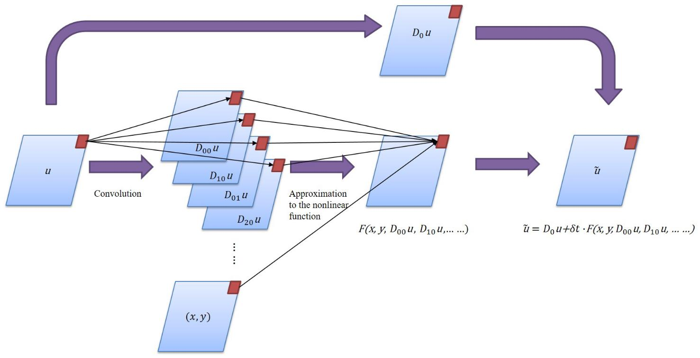

# PDE-Net求解微分方程反问题并实现长期预测

<a href="https://gitee.com/mindspore/docs/blob/r2.0.0-alpha/docs/mindflow/docs/source_zh_cn/physics_plus_data_driven/pdenet.md" target="_blank"></a>

## 概述

PDE-Net是Zichao Long等人提出的一种前馈深度网络用于从数据中学习偏微分方程，同时实现了准确预测复杂系统的动力学特性和揭示潜在的PDE模型。PDE-Net的基本思想是通过学习卷积核(滤波器)来逼近微分算子，并应用神经网络或其他机器学习方法来拟合未知的非线性响应。数值实验表明，即使在噪声环境中，该模型也可以识别被观测的动力学方程，并预测相对较长时间的动态行为。更多信息可参考[原文](https://arxiv.org/abs/1710.09668)。

## 问题描述

本案例求解可变参数的对流-扩散偏微分方程的反问题，并实现长期预测。

### 控制方程

在本研究中，对流扩散方程的形式为：

$$
u_t = a(x,y) u_x + b(x,y) u_y + c u_{xx} + d u_{yy}, \quad (x,y) \in[0,2 \pi] \times[0,2 \pi]
$$

$$
u|_{t=0} = u_0(x,y)
$$

各项导数的系数分别为：

$$
a(x,y)=0.5(cos(y)+x(2\pi-x)sin(x))+0.6 \quad
b(x,y)=2(cos(y)+sin(x))+0.8
$$

$$
c=0.2 \quad
d=0.3
$$

### PDE-Net的模型结构

PDE-Net由多个$\delta T$ Block串联构成，以实现长序列信息的预测，在每一个$\delta T$ Block中，包含可训练参数的moment矩阵，该矩阵可根据映射关系转化为对应导数的卷积核，从而获取物理场的导数。将导数及其对应物理量经线性组合后，采用前向欧拉法，即可推导下一个时间步的信息。




## 脚本说明

在`config.py`里面可以设置训练的参数和采样参数。

```python
train_config = ed({
    "name": "pde_net",                          # 案例描述
    "log_path": "./logs/result/",               # log文件位置
    "summary_dir": "./summary_dir/summary",     # summary文件位置
    "eval_interval": 10,                        # 验证周期
    "lr_scheduler_gamma": 0.5,                  # 学习率调整系数
    "lr": 0.001,                                # 初始学习率
    "save_epoch_interval": 50,                  # ckpt保存周期
    "mesh_size": 50,                            # 网格大小
    "solver_mesh_scale": 5,                     # 求解器数据采样比
    "enable_noise": True,                       # 在样本中是否增加噪声
    "start_noise_level": 0.015,                 # 输入端噪声/信号比
    "end_noise_level": 0.015,                   # 输出端噪声/信号比
    "variant_coe_magnitude": 1.0,               # 微分方程系数缩放比
    "init_freq": 4,                             # 初始条件中的频率
    "batch_size": 16,                           # 单次训练样本数目
    "mindrecord": "src/data.mindrecord",        # mindrecord保存位置
    "epochs": 500,                              # 单个step训练周期数
    "multi_step": 20,                           # step数目
    "learning_rate_reduce_times": 4,            # 学习率调整次数
    "dt": 0.015,                                # 单个step预测的时间步长
    "kernel_size": 5,                           # 卷积核大小
    "max_order": 4,                             # 卷积核对应的最大微分阶数
    "channels": 1,                              # 数据深度
    "perodic_padding": True,                    # 是否采用周期性边界条件
    "if_frozen": False,                         # 是否冻结moment中的参数
    "enable_moment": True,                      # 是否采用moment控制卷积
})
```

## 求解流程

PDE-Net求解偏微分方程反问题分为以下5个步骤：

1. 数据生成和加载。
2. 模型构建。
3. 模型训练。
4. 模型测试和可视化。
5. 长期预测。

### 数据集生成及加载

PDE-Net的初始物理场的分布是根据随机系数的傅里叶级数得到的，并根据谱方法求解对流-扩散方程，step表示$\delta T$ Block的串联个数，在主程序中可以调用DataGenerator生成对应step的数据，并以mindrecord格式保存在data目录里。

```python
from src.data_generator import DataGenerator

data = DataGenerator(step=i, config=config, mode="train", data_size=2*config["batch_size"], file_name="data/train_step" + str(i) + ".mindrecord")
data.process()
```

`DataPrepare`用于生成模型训练所需要的数据集，根据使用场景的不同，在训练中可调用`train_data_prepare`分别生成训练集和测试集，在长期预测和结果可视化中可以调用`test_data_prepare`生成测试数据集。

```python
import mindspore.dataset as ds


class DataPrepare():
    """Obtain dataset for train or test from mindrecord."""

    def __init__(self, config, data_file):
        self.mesh_size = config["mesh_size"]
        self.batch_size = config["batch_size"]
        self.data_file = data_file

    def test_data_prepare(self, step):
        dataset = ds.MindDataset(dataset_files=self.data_file, shuffle=True, columns_list=["u0", "u_step{}".format(step)])
        dataset = dataset.batch(batch_size=1)
        return dataset

    def train_data_prepare(self):
        dataset = ds.MindDataset(dataset_files=self.data_file, shuffle=True, columns_list=["u0", "uT"])
        dataset = dataset.batch(batch_size=self.batch_size, drop_remainder=True)
        operations = [lambda x, y: (
            x.reshape(-1, 1, self.mesh_size, self.mesh_size), y.reshape(-1, 1, self.mesh_size, self.mesh_size))]
        dataset = dataset.map(operations, input_columns=["u0", "uT"])
        dataset_train, dataset_eval = dataset.split([0.5, 0.5])
        return dataset_train, dataset_eval
```

### 模型构建

MindFlow提供了`PDENet`接口可以直接建立PDENet模型，需指定网格的宽度、高度、数据深度、边界条件、拟合的最高阶数等信息。

```python
from mindflow.cell.neural_operators import PDENet

def init_model(config, step):
    return PDENet(height=config["mesh_size"],
                  width=config["mesh_size"],
                  channels=config["channels"],
                  kernel_size=config["kernel_size"],
                  max_order=config["max_order"],
                  step=step,
                  dx=2 * np.pi / config["mesh_size"],
                  dy=2 * np.pi / config["mesh_size"],
                  dt=config["dt"],
                  periodic=config["perodic_padding"],
                  enable_moment=config["enable_moment"],
                  if_fronzen=config["if_frozen"],
                  )
```

### 模型训练

由于每个$\delta T$ Block的参数是共享的，因此模型根据$\delta T$ Block的串联个数依次增加，逐一进行训练。其中，在step为1时，模型处于warm-up阶段，PDE-Net的moment为“frozen”状态，此时moment中的参数不参与训练。每新增一个$\delta T$ Block，程序先进行数据生成和数据集的读取，初始化模型后，需载入前一个step训练的checkpoint，并定义优化器、模式、loss函数，并进行模型训练，在训练中模型会根据callback函数实时反映模型性能。

```python
def train_single_step(step, logger, config, lr):
    dataset = DataPrepare(config=config, data_file="data/train_step{}.mindrecord".format(step))
    train_dataset, eval_dataset = dataset.train_data_prepare()
    print("dataset size: {}".format(train_dataset.get_dataset_size()))

    model = init_model(config, step)

    epoch = config["epochs"]
    warm_up_epoch_scale = 10
    if step == 1:
        model.if_fronzen = True
        epoch = warm_up_epoch_scale * epoch
    elif step == 2:
        param_dict = load_checkpoint(
            "./summary_dir/summary/ckpt/step_{}/pdenet-{}_1.ckpt".format(step - 1, epoch * 10))
        load_param_into_net(model, param_dict)
        print("Load pre-trained model successfully")
    else:
        param_dict = load_checkpoint(
            "./summary_dir/summary/ckpt/step_{}/pdenet-{}_1.ckpt".format(step - 1, epoch))
        load_param_into_net(model, param_dict)
        print("Load pre-trained model successfully")

    optimizer = nn.Adam(model.trainable_params(), learning_rate=Tensor(lr))
    loss_func = LpLoss(size_average=False)
    loss_scale = DynamicLossScaleManager()
    solver = Model(model,
                   optimizer=optimizer,
                   loss_scale_manager=loss_scale,
                   loss_fn=loss_func
                   )

    pred_cb, time_cb = _callback(model, eval_dataset, logger, step, config)
    ckpt_cb = _checkpoint("./summary_dir/summary/ckpt/step_{}".format(step), config["save_epoch_interval"])

    solver.train(epoch=epoch,
                 train_dataset=train_dataset,
                 callbacks=[LossMonitor(), pred_cb, time_cb, ckpt_cb],
                 dataset_sink_mode=True
                 )

def train(config, logger):
    lr = config["lr"]
    for i in range(1, config["multi_step"] + 1):
        data = DataGenerator(step=i, config=config, mode="train", data_size=2 * config["batch_size"],
                             file_name="data/train_step{}.mindrecord".format(i))
        data.process()
        lr = _scheduler(int(config["multi_step"] / config["learning_rate_reduce_times"]), step=i, lr=lr)
        train_single_step(step=i, config=config, logger=logger, lr=lr)
```

模型训练过程如下：

```python
...
Train epoch time: 202.947 ms, per step time: 202.947 ms
epoch: 487 step: 1, loss is Tensor(shape=[], dtype=Float32, value= 0.663754)
Train epoch time: 159.724 ms, per step time: 159.724 ms
epoch: 488 step: 1, loss is Tensor(shape=[], dtype=Float32, value= 0.651065)
Train epoch time: 168.118 ms, per step time: 168.118 ms
epoch: 489 step: 1, loss is Tensor(shape=[], dtype=Float32, value= 0.648911)
Train epoch time: 151.441 ms, per step time: 151.441 ms
epoch: 490 step: 1, loss is Tensor(shape=[], dtype=Float32, value= 0.648038)
================================Start Evaluation================================
LpLoss_error: 0.04020831733942032
=================================End Evaluation=================================
predict total time: 0.4999086856842041 s
Train epoch time: 658.657 ms, per step time: 658.657 ms
epoch: 491 step: 1, loss is Tensor(shape=[], dtype=Float32, value= 0.640651)
Train epoch time: 113.954 ms, per step time: 113.954 ms
epoch: 492 step: 1, loss is Tensor(shape=[], dtype=Float32, value= 0.630344)
Train epoch time: 166.617 ms, per step time: 166.617 ms
epoch: 493 step: 1, loss is Tensor(shape=[], dtype=Float32, value= 0.606285)
Train epoch time: 182.399 ms, per step time: 182.399 ms
epoch: 494 step: 1, loss is Tensor(shape=[], dtype=Float32, value= 0.639116)
Train epoch time: 133.293 ms, per step time: 133.293 ms
epoch: 495 step: 1, loss is Tensor(shape=[], dtype=Float32, value= 0.631353)
Train epoch time: 136.290 ms, per step time: 136.290 ms
epoch: 496 step: 1, loss is Tensor(shape=[], dtype=Float32, value= 0.638366)
Train epoch time: 219.318 ms, per step time: 219.318 ms
epoch: 497 step: 1, loss is Tensor(shape=[], dtype=Float32, value= 0.639544)
Train epoch time: 202.168 ms, per step time: 202.168 ms
epoch: 498 step: 1, loss is Tensor(shape=[], dtype=Float32, value= 0.631913)
Train epoch time: 151.460 ms, per step time: 151.460 ms
epoch: 499 step: 1, loss is Tensor(shape=[], dtype=Float32, value= 0.640468)
Train epoch time: 138.932 ms, per step time: 138.932 ms
epoch: 500 step: 1, loss is Tensor(shape=[], dtype=Float32, value= 0.640138)
================================Start Evaluation================================
LpLoss_error: 0.03963303565979004
=================================End Evaluation=================================
predict total time: 0.5544295310974121 s
```

### 模型测试和可视化

模型训练结束后即可运行visualization.py文件对模型训练的结果进行测试和可视化，流场预测结果和label对比如下：


偏微分方程的系数回归结果如下：


偏微分方程系数的数据标签如下：


### 长时间预测

更进一步，可以将训练好的PDE-Net用于更长时间的预测，
进行多组测试，将误差的25%和75%绘制为带状曲线，如图所示：


