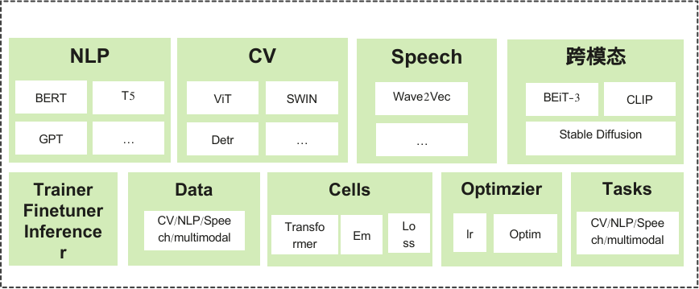

MindSpore Transformer 文档
==========================

MindSpore Transformer的目标是构建一个大模型训练、推理、部署的全流程套件：提供业内主流的Transformer类预训练模型，涵盖丰富的并行特性。期望帮助用户轻松地实现大模型训练。

MindSpore Transformer基于MindSpore内置的并行技术，具备如下特点：

- 提供典型SOTA网络的预训练、微调和部署能力。支持GPT、BERT等网络。
- 一行代码实现从单卡到大规模集群训练的无缝切换。
- 提供灵活易用的个性化并行配置。
- 能够自动进行拓扑感知，高效地融合数据并行和模型并行策略；实现单卡到大规模集群的无缝切换。

如果您对MindSpore Transformer有任何建议，请通过 `Gitee <https://gitee.com/mindspore/transformer>`_ 或MindSpore与我们联系，我们将及时处理。

使用MindSpore Transformer的典型场景
-----------------------------------

- 需要使用BERT、GPT等Transformer类网络进行微调和部署
- 需要进行Transformer类网络大规模训练

基本结构
--------

MindSpore Transformer是一个基于MindSpore的Python软件包。

提供的高级功能包括：

- 提供典型SOTA网络例如BERT的预训练、微调和部署能力。
- 支持混合并行训练大模型能力。

.. toctree::
   :glob:
   :maxdepth: 1
   :caption: 安装部署

   mindformer_install

.. toctree::
   :glob:
   :maxdepth: 1
   :caption: BERT微调

   mindformer_bert_finetune

.. toctree::
   :maxdepth: 1
   :caption: API参考

   AutoClass
   Trainer
   models

.. toctree::
   :glob:
   :maxdepth: 1
   :caption: RELEASE NOTES

   RELEASE