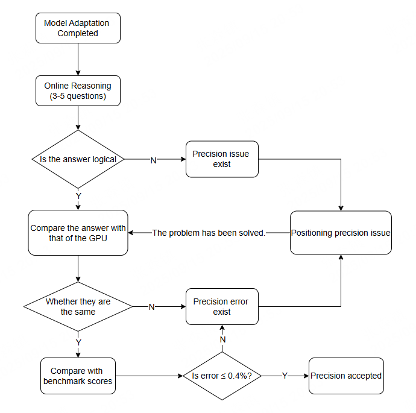

# Comparison of Reasoning Precision

[](https://gitee.com/mindspore/docs/blob/master/docs/mindformers/docs/source_en/advanced_development/inference_precision_comparison.md)

## Overview

For the model, after the adaptation and development are completed, if users want to use the newly adapted or newly developed model for reasoning, they need to ensure the correctness of the reasoning precision. The acceptance criteria for the precision of reasoning mainly lie in the evaluation scores of open-source datasets within the industry or closed-source datasets prepared by users themselves. This document mainly provides an overall process for comparing reasoning precision, as well as some positioning ideas and methods when there are precision issues.

## Precision Acceptance Process

### Overall Process

In the current development process of reasoning, the process of verifying precision first examines the precision of online reasoning. Only if the precision of online reasoning is normal will the evaluation score of the dataset be further verified. The following flowchart shows the entire process of precision verification.

<div style="text-align: center;">
  
</div>

### Online Reasoning Verification

The main objective of online reasoning verification is to verify whether the precision of the reasoning output from a single or multiple inputs is normal. If all the outputs are normal and can be basically aligned with the output of the benchmark in the GPU environment, the next step of verifying the dataset evaluation can be taken.
For information on how the model performs online reasoning tasks, please refer to the [Reasoning Guide](https://www.mindspore.cn/mindformers/docs/en/master/guide/inference.html).

### Dataset Evaluation

After verification through online reasoning, the output of the benchmark of the model can remain basically consistent while keeping the input the same. However, the data volume is relatively small and the problem involved is not comprehensive enough in terms of domain. Therefore, the precision of the model needs to be ultimately verified through dataset evaluation. Only when the evaluation score of the dataset and the benchmark data can meet an error of 0.4% can it be proved that the precision of the model meets the acceptance criteria.
For information on how to evaluate the model using datasets, please refer to the [Evaluation Guide](https://www.mindspore.cn/mindformers/docs/en/master/guide/evaluation.html).

## Positioning Precision Issue

- Scenario: The preset model weights are correct, meaning the model inference precision is normal in the GPU environment. The output of the GPU is used as the benchmark.
- Possible situations: There are two possible scenarios for the precision comparison process provided in this document. The first is that there is a problem with the precision, and the second is that there is an error in the precision.

### Precision Issue

Precision issues generally refer to the situation where the answers in the reasoning task are garbled or completely illogical. Common causes are usually problems with weight loading or issues with the code implementation of the network.

#### 1. Weight Loading Issue

The investigation process is as follows:

1. Search for the following keywords in the log of the executed reasoning task.

    ```text
    These parameters are not loaded in the network:
    These parameters are not loaded in the weights:
    ```

2. Based on the content of the log, analyze whether the loading of weights is correct. The KEY values following the colons in the two logs respectively represent the KEY values of the weights that the network needs to load but are not actually loaded in the ownership weights and the KEY values of the weights that are not loaded into the network in the ownership weights of the weight files.

Specific problems that may arise and their solutions:

- Question 1: There is a KEY value after the colon, and some weights have not been loaded into the network.
    - Reason: The KEY values of the network and the KEY values of the weights do not correspond one-to-one.
    - Location method: Analyze by combining the network structure and the unloaded weights to determine whether it is reasonable that the weights corresponding to each KEY value are not loaded.
    - Solution: Re-convert the unreasonable weight KEY values. For specific details, please refer to [New Model Weight Conversion Adaptation Tutorial](https://www.mindspore.cn/mindformers/docs/en/master/advanced_development/weight_transfer.html).

- Question 2: There is no KEY value after the colon, and all weights are loaded into the network. However, there is still a possibility that incorrect splitting during the weight fusion or splitting process may lead to incorrect data loading.
    - Reason: In most open-source weights, there are fused weights. Sometimes, they need to be split and then fused with other weights. During this process, various divisions may be involved, which can easily lead to problems.
    - Location method: First, focus on analyzing the error-prone areas, such as the qkv part in Attention. Combine the writing method in the network structure to analyze whether various operations during the weight loading process are correct. If the theoretical analysis fails, the weights of the suspected parts can be directly printed out and compared with the weights loaded at the corresponding positions of the benchmark.
    - Solution: Identify the module with incorrect weight loading through analysis or experimentation. For the solution, please refer to [New Model Weight Conversion and Adaptation Tutorial](https://www.mindspore.cn/mindformers/docs/en/master/advanced_development/weight_transfer.html).

#### 2. There are problems in the construction of the new model

The investigation process is as follows:

When adapting a new model with a similar structure, it is generally done by directly replacing the configuration file and then directly loading the weights to perform the inference task. This way, it is easy to overlook some differences in details. It is necessary to check these differences module by module.

Possible problems and solutions:

- Problem: The reasoning output remains unchanged even when the inputs differ..
    - Possible reasons: The MLP module, MoE module, and the linear module involved in the Attention module do not require bias, but they impose bias, and there are Nans in the input and output, etc.
    - Positioning method: You can directly print the input and output of each module and observe whether the printing result is normal.
    - Solution: After confirming that a certain module has a problem, compare it with the benchmark to determine whether bias is needed for that module. If bias is not needed, simply set the configuration item of bias to False.

### Precision Error

Precision error generally refers to the situation where the online reasoning response is logical but does not align with the benchmark response or the dataset evaluation score does not meet the acceptance criteria.

#### 1. The answers are logical but do not align with the benchmark answers

The fundamental reason for the occurrence of logical but inaccurate and inconsistent responses in reasoning tasks is that a certain module has caused an error. The magnitude of the error will determine the timing of the appearance of tokens that do not match the benchmark in the response.

Possible problems and solutions:

- Question: The first token is consistent, but after pushing about 10 tokens, the phenomenon of inconsistent precision occurs.
    - Positioning method: Generally, the differences in data are compared by printing and dumping data. If the printed data cannot be observed by the naked eye to determine whether it is within the acceptable range, then the dumped data can be used, and then the comparison tool can be used to determine whether the module meets the precision standard. The comparison tool can be compared using the methods provided by MindSpore Transformers. The usage method is as follows:

      ```py
      import numpy as np
      from tests.utils.precision_utils import PrecisionChecker

      checker = PrecisionChecker()
      gpu_data = np.load('path/to/gpu.npy')
      npu_data = np.load('path/to/npu.npy')
      checker.check_precision(gpu_data, npu_data)
      ```

      > For information on how to dump data, you can refer to the [Dump Tutorial Document](https://www.mindspore.cn/tutorials/en/master/debug/dump.html) provided on the MindSpore official website.
    - Possible reasons: Precision loss caused by inconsistent dtype types of a certain input, etc.
    - Solution: Align the dtype of the benchmark.

#### 2. The evaluation score of the dataset does not meet the acceptance criteria

According to the process of precision comparison, the prerequisite for dataset evaluation is that the responses from online reasoning are already logical. However, now there is a significant difference between the evaluation scores of the dataset and the benchmark data. The reason is that some responses do not align with those of the benchmark.

Location method: Identify the questions where the output does not align with the benchmark answers, extract the questions separately as the input for online reasoning, and then locate and solve the problems following the approach of [answering questions with logical precision but inconsistent with the benchmark](#1-the-answers-are-logical-but-do-not-align-with-the-benchmark-answers).
