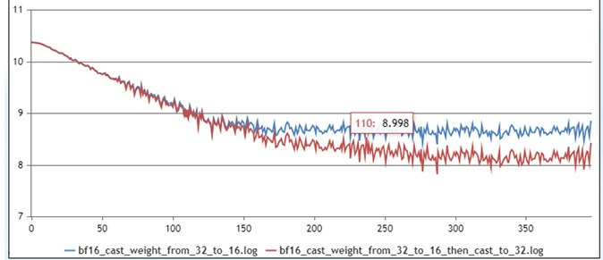
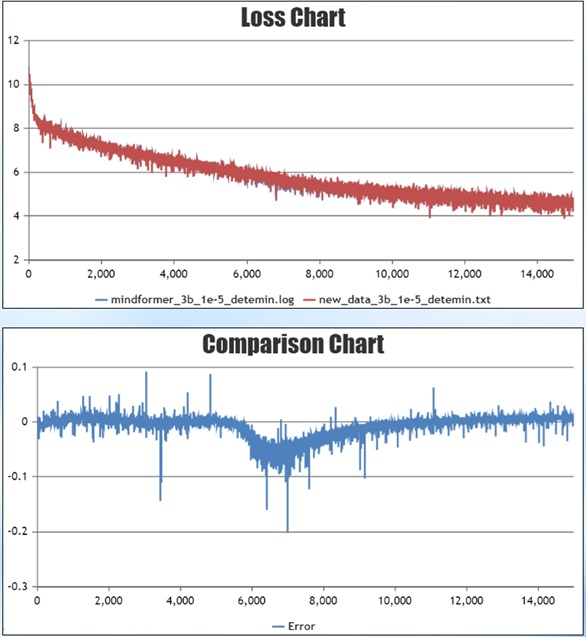

# Large Model Precision Optimization Guide

[](https://gitee.com/mindspore/docs/blob/master/docs/mindformers/docs/source_en/advanced_development/precision_optimization.md)

## Overview and Scenarios of Precision Issues

### Descriptions

As the Ascend AI processor (hereinafter referred to as NPU) is widely used in deep learning, the MindSpore framework, which is developed natively based on the Ascend NPU, shows better performance advantages. During large-scale cluster training, the performance improvement will greatly save users the cost of large model development. Therefore, more and more users are gradually migrating their original training models to MindSpore. However, due to the differences in hardware and framework usage, users may encounter precision problems after completing the model migration.

This paper summarizes the common precision problems in the training process of large models and general precision problem localization methods, and seeks to help users quickly troubleshoot precision problems and shorten the time for model precision problem localization. When starting the work on large model precision optimization, you should have the basic knowledge of large model. To avoid dispersion, this document will not explain the basic concepts related to large models and focus on the introduction of precision optimization.

### Categorized Summary of Common Problems

Various precision problems often occur in large model training, and the common problems include that the loss fails to converge, the loss converges poorly, the loss fails to converge at the late stage of training, the precision overflows, and the loss can not be fitted to the benchmark in the process of descending. There can be a variety of reasons for these precision problems, including the structure of the model, the dataset, the hyperparameters, the precision of the forward and reverse computation, the calculation of the optimizer, the floating-point computational precision, and randomness.

When precision problems occur, the problem can be analyzed from the reasons for these precision problems. A quick troubleshooting based on CheckList is performed first, followed by parameter and weight alignment, fixed randomness and turning on deterministic calculations. Then the base problem is troubleshooted, and finally the anomalous step is troubleshooted by long stable training. At the current stage, this paper mainly introduces the general method of precision localization for the scenarios with precision benchmarks, and the content of precision problem localization without precision benchmarks will be added successively.

## Precision Problems Location CheckList

Before locating the operator precision problem, we should first eliminate the interference of other non-operator factors. Combined with the previous precision positioning cases, the CheckList before precision positioning is summarized. In order to easier locate the problems, users can first carry out quick troubleshooting according to the CheckList.

### Network Structure CheckList

#### Generalized structure

| **Key parameters**          | **Descriptions**            | **CheckList**    |
| ----------------- | ------------------------- |---------------------------------|
| num_layers        | Number of transformer layers                                              | Correspond to the Megatron num-layers parameter and check for consistency.                                             |
| num_heads         | Number of attention heads in transformer                             | Correspond to the Megatron num-attention-heads parameter and check for consistency.                                    |
| hidden_size       | Transformer hidden layer size                                        | Correspond to the Megatron hidden-size parameter and check for consistency.                                            |
| intermediate_size | Feed-Forward Network hidden layer size                             | Correspond to the Megatron ffn-hidden-size parameter and check for consistency.                                        |
| n_kv_heads        | Number of kv groups                                                     | Correspond to the Megatron num-query-groups parameter and check for consistency.                                        |
| Regularization function        | Regularization functions, common structures are LayerNorm, RMSNorm                     | The specified regularization function is used in MindSpore Transformers and cannot be modified by configuration. The configuration can be customized in Megatron by normalization to check for consistency. |
| rms_norm_eps      | Regularized epsilon parameters                                          | Correspond to the Megatron layernorm_epsilon parameter and check for consistency.                                         |
| dropout           | dropout in the network                                              | Currently, when MindSpore enables dropout, recalculation cannot be enabled; if precision comparison is carried out, it is recommended that both sides be closed to reduce the random factor.|
| Fusion computation          | Common fusion operators include FA, ROPE, Norm, SwigLU; some users will fuse Wq, Wk, Wv for computation | 1. For precision comparison under the same hardware, if fusion algorithms are used, they should be consistent. <br>2. When comparing precision on different hardware, focus on checking whether there is any difference in the calculation of the fusion calculation part.    |

#### MOE Structure

| **Key parameters**&nbsp;&nbsp;&nbsp;&nbsp;&nbsp;&nbsp;&nbsp;&nbsp;&nbsp;&nbsp;&nbsp;&nbsp;&nbsp;&nbsp;&nbsp;&nbsp;&nbsp;&nbsp;&nbsp;&nbsp;&nbsp;&nbsp;&nbsp;&nbsp;&nbsp;&nbsp;&nbsp;&nbsp;&nbsp;&nbsp;&nbsp;&nbsp;&nbsp;&nbsp;         | **Descriptions**                                                         | **CheckList**                                                                                                                                |
| ----------------- | ------------------------------------------------------------ |------------------------------------------------------------------------------------------------------------------------------------|
| expert_num               | Number of experts                                          | Correspond to the Megatron num-experts parameter and check for consistency.                    |
| num_experts_chosen       | Number of experts selected per token                             | Correspond to the Megatron moe-router-topk parameter and check for consistency.                |
| capacity_factor          | Expert capacity factor                                      | Correspond to the Megatron moe_expert_capacity_factor parameter and check for consistency. |
| aux_loss_factor          | Load balancing loss contribution factor                              | When turned on, it is recommended to be less than 0.05. If precision alignment is performed, it is not recommended to be turned on, and is inconsistent with Megatron loss printing method. |
| enable_sdrop             | Whether to enable the sdrop (drop implementation) method                                 | It is recommended to set it to true; the corresponding Megatron needs to set the following parameters:<br>  `moe-token-drop-policy: position` <br>  `moe-pad-expert-input-to-capacity: True` |
| router_dense_type        | Decide the expert sense layer                                 | Configurable in MindSpore Transformers, FP32 calculations are recommended to prevent overflow; not configurable in Megatron. |
| use_fused_ops_topkrouter | Whether to use the fusion operator for dispatch as well as combine indexing calculations | Fusion operator in MindSpore Transformers takes effect when `enable_sdrop=True`, precision alignment is recommended to be set to True. |
| use_shared_expert_gating | Whether the gating factor is used in the shared expert network                  | Check if the network sharing expert has a gating factor, if so set it to True.       |

### Optimizer CheckList

| **Key parameters**          | **Descriptions**                                                         | **CheckList**                                                                                                                                |
| ----------------- | ------------------------------------------------------------ |------------------------------------------------------------------------------------------------------------------------------------|
| adam optimizer           | optimizer type             | If Megatron uses the adam optimizer, the mathematically equivalent implementation of MindSpore Transformers is AdamW. |
| eps               | adam optimizer minimal value parameter   | Check the parameters for consistency, recommended value is 1e-8.                            |
| beta1             | adam optimizer gradient momentum parameters | Check the parameters for consistency, recommended value is 0.9.                             |
| beta2             | adam optimizer gradient variance parameter | Check the parameters for consistency, recommended value is 0.95.                            |
| weight_decay      | weight decay               | By default bias and one-dimensional weights are not decayed and the user is checked for special operations.             |
| lr                | learning rate                 | After setting up warmup, learning rate decay, draw a graph to see if the learning rate change is consistent.             |
| lr_warmup_fraction      | Learning rate warmup step percentage     | After setting up warmup, learning rate decay, draw a graph to see if the learning rate change is consistent.                                        |
| clip_grad         | clipping gradient               | Check the parameters for consistency, recommended value is 1.0.                             |
| global_batch_size | Global batch size             | Consistency with the benchmark can be checked by printing a log during training.                    |

### Weight CheckList

| **Key parameters**          | **Descriptions**                                                         | **CheckList**                                                                                                                                |
| ----------------- | ------------------------------------------------------------ |------------------------------------------------------------------------------------------------------------------------------------|
| param_init_type | Weight initialization type       | MindSpore Transformers usually sets the param_init_dtype type to FP32. This is because the gradient communication type needs to be the same as the weight type, controlling the communication type to be FP32. Megatron gradient communication type defaults to FP32 and is not tied to the weight type. |
| init-method-std | Distribution of weights randomly initialized | If weighted random initialization is used, parameters such as mean/std in the random distribution need to be checked for consistency. |

### Mixed-precision CheckList

| **Key parameters**          | **Descriptions**     | **CheckList**                |
| ----------------- | ----------------------------------------- |---------------------------------------|
| compute_dtype          | Compute precision                   | Megatron set `-bf16: true` to BF16, otherwise FP16.  |
| layernorm_compute_type | LayerNorm/RMSNorm compute precision | Megatron is not configurable, need to check that implementations are consistent.                 |
| softmax_compute_type   | When MindSpore uses FA, the internal Softmax fix is calculated with FA. Type of calculation is configurable only for small arithmetic splicing implementations     | Megatron is not configurable, needs to check if the implementation is consistent.                 |
| rotary_dtype           | Calculation precision of rotary position encoding                                       | Megatron is not configurable, needs to check if the implementation is consistent. |
| Calculation of weights             | precision calculation for each weight such as, Embedding, lm_head | Since MindSpore Transformers weight initialization needs to be set to FP32, and the usual calculation precision is BF16/FP16, it is necessary to check whether the weight data type is converted to BF16/FP16 before weight calculation.|
| bias add               | bias in the linear layer                                                 | If bias is present, Linear layer checks consistency in the computational precision of add.                  |
| residual add           | sum of residuals                                                     | Check that the precision of the calculation of the residuals is consistent with the benchmarks                             |
| loss                   | Loss Calculation Module               | Check that the precision of the calculation in the entire loss module is consistent with the benchmarks                     |
| Operator High Precision Mode         | Ascend Calculator supports high precision mode                                       | Method:  `context.set_context(ascend_config=  {"ge_options":{  "global":{  "ge.opSelectImplmode":"high_precision"  }  }  })` |

### Parallel Strategy CheckList

| **Key parameters**&nbsp;&nbsp;&nbsp;&nbsp;&nbsp;&nbsp;&nbsp;&nbsp;&nbsp;&nbsp;&nbsp;&nbsp;&nbsp;&nbsp;&nbsp;&nbsp;&nbsp;&nbsp;&nbsp;&nbsp;&nbsp;&nbsp;          | **Descriptions**     | **CheckList**  |
| ----------------- | ------------------------------------------------------------ |------------------------------------------------------------------------------------------------------------------------------------|
| data_parallel              | data parallel                               | Parallel slicing affects the communication behavior, and the calculations that introduce communication after slicing may be slightly different from the single-card calculations.                    |
| model_parallel             | model parallel                               | Parallel slicing affects the communication behavior, and the calculations that introduce communication after slicing may be slightly different from the single-card calculations.      |
| pipeline_stage             | pipeline parallel                              | Parallel slicing affects the communication behavior, and the calculations that introduce communication after slicing may be slightly different from the single-card calculations.             |
| use_seq_parallel           | Corresponding to Megatron Short Sequence Parallelism | Parallel slicing affects the communication behavior, and the calculations that introduce communication after slicing may be slightly different from the single-card calculations.      |
| enable_parallel_optimizer  | optimizer parallel                             | For optimizer parallel, MindSpore and PyTorch have different implementation schemes and inconsistent communication behavior. It is recommended to turn it off when performing precision alignment. |
| micro_batch_interleave_num | multicopy parallel                             | For optimizer parallel, MindSpore and PyTorch have different implementation schemes and inconsistent communication behavior. It is recommended to turn it off. |

### Other CheckList

| **Key parameters**          |  **CheckList**               |
| ----------------- | ---------------------------|
| Data Check | Check if the data is abnormal, you can randomly select part of the data for decode, encode check to see if the position of input and label is correctly corresponding.                                  |
| Special Words Check | Check whether the special ids such as bos_token_id, eos_token_id, pad_token_id are consistent with the ids when the data is produced.                              |
| inputs_id check | Check whether inputs_id in Embedding is consistent with 0<=inputs_id<vocab_size; if there is out-of-bounds behavior, it will fetch dirty data and lead to precision anomaly.                       |
| Overflow Detection | Overflow Status Aligns PyTorch, suggest to use INFNAN_MODE, i.e., `export MS_ASCEND_CHECK_OVERFLOW_MODE=INFNAN_MODE`. |
| Graph Operator Fusion | Turn off graph operator fusion, i.e. `enable_graph_kernel: False`. |
| Training Inference Template Consistency | If training SFT, you need to make sure that the input template used for training inference is consistent.  |
| Version Check | Check whether the versions of MindSpore, MindSpore Transformers and CANN are compatible, it is recommended to use the latest compatible version.          |
| Differences with Open Source | MindSpore Transformers has supported the mainstream open source LLM models, and has been more fully tested. If you are developing based on the open source models in MindSpore Transformers, you can focus on checking the differences with the open source models in MindSpore Transformers. |

## Introduction to Precision Debugging Tools

In precision localization, MindSpore's Dump tool is mainly used. For details, please refer to [Dump Function Debugging](https://www.mindspore.cn/tutorials/en/master/debug/dump.html).

MindSpore's Dump tool is enabled by configuring a JSON file, which Dumps out all the operator data in the network, saving the tensor and statistics in the statistic.csv table. The following gives a JSON example of full operator Dump:

```json
{
    "common_dump_settings": {
        "op_debug_mode": 0,
        "dump_mode": 0,
        "path": "/absolute_path",
        "net_name": "ResNet50",
        "iteration": "0|5-8|100-120",
        "saved_data": "tensor",
        "input_output": 0,
        "kernels": ["Default/Conv-op12"],
        "support_device": [0,1,2,3,4,5,6,7]
    },
    "e2e_dump_settings": {
        "enable": true,
        "trans_flag": true
    }
}
```

Refer to [Dump Function Debug](https://www.mindspore.cn/tutorials/en/master/debug/dump.html) for the field meanings of the configuration parameters.

After configuring the JSON file, set the Dump environment variable to point to the configured JSON file, you need to set the absolute path:

```shell
export MINDSPORE_DUMP_CONFIG=${JSON_PATH}
```

After setting the environment variables, start the program training to get the corresponding Dump data.

### Other Introductions

In addition to the full amount of operator Dump introduced above, the tool also supports partial data Dump, overflow Dump, specified-condition Dump and so on. Limited to space, interested users can refer to [Dump function debugging](https://www.mindspore.cn/tutorials/en/master/debug/dump.html) for configuration and use. In addition, the msprobe precision debugging tool is provided. msprobe is a tool package under the precision debugging component of the MindStudio Training Tools suite. It mainly includes functions such as precision pre-check, overflow detection, and precision comparison. For more information, refer to [msprobe User Guide](https://gitee.com/ascend/mstt/tree/master/debug/accuracy_tools/msprobe).

## Generalized Processes for Precision Positioning

Quickly troubleshoot the problem by using the [Precision Problems Location CheckList](#precision-problems-location-checklist) section. If the precision problem still exists after completing the CheckList and there is no obvious direction, you can narrow down the scope of the problem by using the precision location generic process in this section for further troubleshooting. The current generalized process is mainly for benchmarked scenarios, and the following section will take the scenario of comparing the precision of GPU+PyTorch and Ascend+MindSpore as an example to introduce the precision localization process.

There are two main ideas for problem positioning:

* Simplified training scenarios based on single card/standalone, small-scale model replication problems.
* Fix the random factor and compare the loss difference with the benchmark during training to locate the cause of the precision difference.

The training process of the model can be decomposed into the following processes: data input, forward computation, loss, backward computation, gradient, optimizer weight update, and next step. The following will describe how to rank each stage of the training in conjunction with the flow of the following figure.


### Stage 1: Pre-training Preparation

Conducting precision comparison between GPU+PyTorch and Ascend+MindSpore requires simplifying the scenario and fixing the randomness before reproducing the problem. There are three main parts as follows:

* Aligning parameters, downsizing models, single-card/stand-alone reproduction problems;

* Load the same weights for training;

* Each step trains the same data.

#### Aligning Parameters

In the parameter alignment session, the following parameters need special instructions, to ensure that PyTorch and MindSpore parameters are consistent. Parameter setting instructions:

| Parameters                 | Suggestions | Descriptions                            |
|--------------------| -------- |-------------------------------|
| num_layers         | 2        | Reduced model size facilitates quick verification that a single card can run in data-only parallelism. |
| learning_rate_type | constant | Fixed learning rates to ensure alignment with benchmarked learning rates.             |
| warmup_steps       | 0        | Steps for warmup                     |
| adam_eps           | 1e-8     | If the user has no special requirements, follow the default settings.             |
| dropout            | 0        | Turn off the randomness parameter, and If there are other randomness parameters, they should be turned off.         |

Since features such as model parallelism, flow parallelism, sequence parallelism, optimizer parallelism increase the difficulty of precision alignment, it is recommended to turn them off first, and then gradually add parallel features after alignment.

#### Weight Conversion

During training, MindSpore is loaded with the same weights as PyTorch. In case of pre-training scenarios, you can use PyTorch to save an initialized weight and then convert it to MindSpore weights. Because MindSpore weight names differ from PyTorch, the essence of weight conversion is to change the names in the PyTorch weight dict to MindSpore weight names to support MindSpore loading. Refer to [weight conversion guide](https://www.mindspore.cn/mindformers/docs/en/dev/feature/ckpt.html#weight-format-conversion) for weight conversion.

Both MindSpore and PyTorch support `bin` format data, loading the same dataset for training ensures consistency from step to step.

#### Fixed Randomness and Start Deterministic Computation

The training process fixes randomness and turns on deterministic computation in the following way:

* NPU adds the following environment variables:

  ```shell
  export HCCL_DETERMINISTIC=true  # HCCL deterministic
  export ASCEND_LAUNCH_BLOCKING=1  # Hardware deterministic
  ```

* PyTorch code, in [pretrain_gpt.py](https://github.com/NVIDIA/Megatron-LM/blob/main/pretrain_gpt.py), the new seed_all method is added and called in the main method, adding the method as follows:

  ```python
  import numpy as np
  import random

  def seed_all(seed=42):
      random.seed(seed)
      os.environ['PYTHONHASHSEED'] = str(seed)
      np.random.seed(seed)
      torch.manual_seed(seed)
      torch.use_deterministic_algorithms(True)
      torch.cuda.manual_seed_all(seed)
      torch.cuda.manual_seed(seed)
      torch.backends.cudnn.deterministic = True
      torch.backends.cudnn.enable = False
      torch.backends.cudnn.benchmark = False

  if __name__ == "__main__":
      seed_all()

      # Original code
  ```

* MindSpore code, in [run_mindformer.py](https://gitee.com/mindspore/mindformers/blob/dev/run_mindformer.py), the new seed_all method is added and called in the main method, adding the method as follows:

  ```python
  import numpy as np
  import random

  import mindspore

  def seed_all(seed=42):
      random.seed(seed)
      os.environ['PYTHONHASHSEED'] = str(seed)
      np.random.seed(seed)
      mindspore.set_deterministic(True)

  def main(config):
      seed_all()

      # Original code
  ```

After completing the above preparations, single card training is initiated. If the problem is not reproduced, the scenario is expanded, such as adding relevant features, expanding the model size, etc., until the problem is reproduced, so as to locate the cause of the problem. If the problem is reproduced, or the time needed to reproduce is longer, then the problem localization in stage 2 can be opened.

### Stage 2: Basic Problem Identification

By comparing the loss and local norm of the first step (step1) and the second step (step2), the forward computation, backward computation, and optimizer computation are sequentially ranked.

#### Comparison of Step1 Losses

After fixing the weights, dataset, and randomness, the difference in the loss value of the first step of training is compared. The loss value of the first step is obtained from the forward computation of the network. If the difference with the benchmark loss is large, it can be determined that there is an precision difference in the forward computation, which may be due to the model structure is not aligned, and the precision of the operator is abnormal. The tensor values of each layer of MindSpore and PyTorch can be obtained by printing or Dump tool. Currently, the tool does not have automatic comparison function, users need to manually identify the correspondence for comparison. For the introduction of MindSpore Dump tool, please refer to [Introduction of Precision Debugging Tools](#introduction-to-precision-debugging-tools), and for the use of PyTorch Dump tool, please refer to [Function Explanation of Precision Tools](https://gitee.com/ascend/mstt/tree/master/debug/accuracy_tools/msprobe/docs/05.data_dump_PyTorch.md).

Find the correspondence of layers through PyTorch api_stack_dump.pkl file, and MindSpore statistic.csv file, and initially determine the degree of difference between input and output through max, min, and L2Norm. If you need further comparison, you can load the corresponding npy data for detailed comparison.

#### Comparison of local norm Values for step1

The local norm reflects the sum of squares of the gradients of a given weighted slice on that device, and comparing the local norm value with the benchmark allows for an initial assessment of the difference in the reverse computation. The calculation formula is as follows:

$$
localnorm = \sqrt{x_1^2 + x_2^2 + \cdots + x_n^2}
$$

Where $x_1 , x_2, \cdots, x_n$ is the gradient of a particular weight. MindSpore Transformers supports printing the local norm via yaml configuration as shown below:

```yaml
# wrapper cell config
runner_wrapper:
  type: MFTrainOneStepCell
  local_norm: True
  scale_sense: 1
  loss_scale_value: 65536
  use_clip_grad: True
```

There is no configuration in Megatron to print local parameters, and you need to embedded modify the file [megatron/core/optimizer/optimizer.py](https://github.com/NVIDIA/Megatron-LM/blob/main/megatron/core/optimizer/optimizer.py):

```python
from megatron.training import get_args, print_rank_0

def get_parameters(self):
    params = []
    grad_norm_list = []
    for param_group in self.optimizer.param_groups:
        for param in param_group['params']:
            grad_norm = torch.norm(param.grad, 2)
            grad_norm_list.append(grad_norm ** 2)
            params.append(param)
    # Embedded modifications
    print_rank_0(f"print torch local norm:")
    print_rank_0(grad_norm_list)
    return params
```

Below is an example of a local norm comparison, comparing the local norm values corresponding to the weights.


It can be found that in the scenario shown in this figure, the local norm value of model.tok_embeddings.embedding_weight has a large difference, which can be focused on troubleshooting the implementation of the Embedding and the calculation precision, etc.

The local norm value only serves as a preliminary judgment of whether the reverse computation is correct, if we want to compare the reverse computation in depth, we need to compare the MindSpore and PyTorch reverse computation values layer by layer by using the Dump tool.

#### Optimizer Computational Troubleshooting

In the case where the loss of step1 is aligned with the local norm, if the difference in the loss of step2 is large, further troubleshooting of the optimizer computation is required. The specific steps are as follows:

1. Firstly, check whether the parameters that affect the gradient update, such as checking learning rate, optimizer parameters, weight decay, are consistent with the benchmark.

2. Secondly, troubleshoot the optimizer computation with the following steps:
    1. Save the gradient from PyTorch step1.

    2. Load the gradient of PyTorch at MindSpore step1 for optimizer update.

    3. Compare the difference in weights after the update or the difference in loss values at step2.

If there is a significant difference, there is a problem with the optimizer update and further targeting of the optimizer is required.

PyTorch saves the weight gradients, and to use apex as an example, modify [megatron/core/optimizer/optimizer.py](https://github.com/NVIDIA/Megatron-LM/blob/main/megatron/core/optimizer/optimizer.py) file.

```python
import numpy as np

def get_parameters(self):
    params = []
    grad_id = 0
    for param_group in self.optimizer.param_groups:
        for param in param_group['params']:
            params.append(param)
            grad_id += 1
            # Embedded modification to save the gradient of torch as numpy
            np.save(f"xx/grad_{grad_id}.npy", param)
    return params
```

For MindSpore Transformers loading gradient, refer to [mindformers/wrapper/wrapper.py](https://gitee.com/mindspore/mindformers/blob/dev/mindformers/wrapper/wrapper.py) implementation. Note that users need to find the correspondence between MindSpore Transformers and PyTorch gradient. Refer to the following modified code:

```python
class MFTrainOneStepCell(nn.TrainOneStepWithLossScaleCell):
    ...
    def __init__(self):
        # Embedded modification to load the weight of torch
        grad_0 = Tensor(np.load(f"xxx/grad_1.npy"))
        grad_1 = Tensor(np.load(f"xxx/grad_x.npy"))
        ...
        self.grads = [grad_0, grad_1, ..., ]

    def construct(self, *inputs):
        ...
        # Embedded modification to force replacement of gradient with torch gradient
        grads = self.grads
        if self.use_clip_grad:
            grads, global_norm = self.clip_grad_norm(grads)
```

The above code, only for the realization of the reference, needs to modify the code according to the actual situation.

If you troubleshoot that there is no problem with the optimizer computation, and at the same time there is a large difference in the loss of step2, you need to re-compare the reverse computation of step1 in detail by means of Dump.

### Stage 3: Long and Stable Training Troubleshooting

After the above operations of aligning the loss and local norm of step1 and step2, troubleshooting the forward computation, backward computation, and optimizer update, long stable training is initiated to compare the loss of each step.

#### Weights Not Updated

Set learning rate = 0, i.e., weights are not updated, and train 1k step; compare the loss values and the differences in the global norm. At the current stage, due to the large amount of data, detailed comparison of the local norm of each weight for each step is labor intensive, so the backward computation error is determined by comparing the global norm. This is a simple and quick way to verify the forward and backward computation, if there is a large difference in the value of a particular step loss or norm, then use that data alone to analyze the forward and backward. Note that global norm prints in the Megatron with the field grad norm.

#### Benchmark Error Confirmation

Before the training of weight update, it is necessary to confirm the benchmark error, that is, turn off the deterministic computation, repeat running the benchmark training twice to see the error of the benchmark itself, to determine whether the error is reasonable. Due to the differences in hardware or the underlying calling operator, the computational process of training will inevitably have a certain degree of error. When a loss comparison is performed between MindSpore and benchmarking model, if the error is within the benchmark error range and the error fluctuates up and down along the 0-axis, the error can be considered reasonable.

#### Loss Diffusion

The learning rate is set > 0, the weights are updated, and the long stability test is performed. The training to a certain step appeared the phenomenon of large differences in the loss, after which the training loss began to diverge, as shown in Fig:


In this scenario, the training before and after the mutation can be targeted for troubleshooting, and the following troubleshooting can be tried:

* Check the data situation near the loss mutation to troubleshoot if there is any abnormal data. Decode the data to text via tokenizer to see if the data is abnormal; at the same time, you can try to skip this batch of data for training to verify whether it is caused by the data.

* Check if there is precision overflow in the vicinity of the mutation.

* You can check whether there is any abnormality in the local norm, check the training data of the Dump mutation step, troubleshoot the calculated mutation points, and analyze whether the operator outputs abnormally.

#### Loss Varies Greatly in the Later Stages

It is also possible to have a better fit in the early part of the training period and a large difference in the convergence loss in the later part of the training period in the long stability test, as shown in Fig:



In this scenario, troubleshooting can be done from the following perspectives:

* Examine whether the parameters are aligned: focus on examining the parameters related to the optimizer, such as the optimizer type, learning rate, weight decay. We can compare whether the change of learning rate during training is consistent by drawing diagrams, and we also need to confirm whether the weight of weight decay is consistent with the benchmark.

* Mixed precision checking: through the Dump tool, carefully check whether the mixed precision is consistent with the benchmark in the calculation process;

* If there is a difference in the loss at convergence, but the difference is small, such as less than 1%, the precision acceptance can be performed by evaluating the downstream tasks.

#### Scenario Expansion

After completing the single-card alignment, gradually expand from single-card to multi-card testing and cluster testing; model size and related features such as model parallelism, flow parallelism, optimizer parallelism are added as appropriate. Gradually expand from simple scenarios to actual training scenarios, so as to troubleshoot the impact of the added features on the precision.

### Large Model Migration Precision Standard

Precision standard for large model migration refers to the precision standard set for key indicators to ensure that the model precision before and after migration is basically the same after migrating the models trained by other third-party hardware or frameworks to MindSpore and Ascend Hardware. It is summarized based on the actual migration scenarios of MindSpore's large models for developers' reference. Since the precision of large models is strongly related to the application domain, model structure, number of parameters, and hyperparameters, and is not fully interpretable, there is no complete and unified mandatory standard. Therefore, this standard is only used as a reference standard to help users make a basic judgment on the precision of model migration.

#### Precision Standard Specifications

1. Relative discrepancy is uniformly described as a percentage (x.x%) and absolute discrepancy is uniformly described as a decimal (0.xx);
2. If the precision fluctuations of the third-party model training no longer meet this precision standard, the original model should be adequately tested and the standard should be relaxed in accordance with the fluctuations of the original model;

#### Default Configuration

| Classes               | Default Values | Descriptions                      |
|--------------------|------|-------------------------------|
| Dataset         | [pretrain] wikitext-103 </br>[sft] alpaca   | |
| Precision mode       | BF16   | Mixed-precision configurations are consistent, and distinguish between actual FP32/FP16/BF16 configurations for each API in the network.             |
| Parallel method       | Data parallel    | The parallelism can be adjusted according to the computational resources. |
| Cluster size       | Stand-alone 8 cards | Can be adjusted according to the computational resources.             |
| checkpoint     | [pretrain] Script initialization by default </br> [sft]Loading pre-training weights    | ckpt has a large impact on the precision metrics, prioritizing weights with small fluctuations in loss and a clear downward trend in overall loss.|
|determinism|Turn on|The precision indicator determination phase can turn off determinism. The comparison phase needs to turn on determinism in order to minimize random error interference.|

#### Precision Standard Indicator

* Test Standard

    1. Without user's special designation, the default continuous observation is 5000 steps or 12 hours, the number of steps can be reduced according to the resource situation, but it is not recommended to be less than 1000 steps.
    2. Load the same weights, keep all hyperparameters configured the same, and turn off all randomness.
    3. The fluctuation of indicators such as loss is greatly influenced by the model, weights, and hyperparameters, and the combination with smooth loss fluctuation is preferred as a benchmark to reduce the judgment of random fluctuation on the precision results.
    4. The randomness of the third-party model was adequately tested by repeating the experiment at least 2 times with determinism turned off and observing the range of fluctuations in the precision metrics.

* loss Precision Standard

    1. The absolute error of first loss is less than 0.005, or the relative error is less than 0.5%.
    2. The average absolute error is less than 0.01, or the average relative error is less than 1%.

* Monitoring Indicators

    The average relative error of the global norm does not exceed 10%.

### Case Details

This section will introduce the completion of precision ranking based on the above precision localization process with practical examples.

#### Problem Phenomenon

Training the model with a 128-card cluster and comparing training with Ascend+MindSpore training with GPU+PyTorch training reveals that the late training convergence loss is about 0.1 higher than GPU+PyTorch. As shown in the figure, the convergence is not as expected:


The red line is the Ascend+MindSpore training curve and the blue line is the GPU+PyTorch training curve.

#### Problem Location Process

Before locating the problem, check against the CheckList to confirm that there is no error and then start locating the problem.

First the loss alignment of step1 is confirmed to be OK. Comparing the local norm of step1 and calculating the difference between the local norm value of each weight and the benchmark, it is found that the local norm value of Embedding weight has a large difference with the benchmark.


The reason for this is that MindSpore Transformers uses FP32 for weight initialization, and FP32 precision is used for both forward and backward Embedding calculations, while PyTorch forward and backward calculations are BF16, which leads to differences in the calculated local norm values.

Once the computational precision is aligned, the exhaustive optimizer computation is also fine, and the long stable training alignment starts.

The long stable training exhaustion will be extended from single card experiments to multi-card experiments by first setting the LEARNING RATE=0, i.e., the weights are not updated. Forward computation of the loss difference of each step is around 0.001, and the forward computation error is as expected. The difference of global norm of each step is about 0.05, and the difference of reverse calculation is not significant. It is initially judged that the model migration code is correct, the model structure is consistent, and the difference of forward and reverse calculation is not significant.


Re-weight update, single card training, set learning rate=1e-5, train 1k steps. Convergence late loss has a steady 0.1 difference, reproducing the problem.


Perform problem troubleshooting. Identify the following problems:

* Identify inconsistencies in computational precision during training through Dump file exclusion, and harmonize inconsistencies.

* Weight decay implementation is inconsistent, weight decay is performed on all weights in user PyTorch network. bias weights and one-dimensional weights in MindSpore Transformers do not have weight decay by default.

After fixing the problem, experiment again, train 10,000 steps, the loss difference fluctuates around the 0 axis and is less than 0.03, the precision meets the expectation, and the single-card precision is aligned.

After completing the single card training, start the multi-card training test: set the learning rate=1e-5, train 1,000 steps. convergence is consistent in the late stage of training, but there is a stable 0.05 error in the middle stage of training.



To verify that this error is within reasonable limits, the deterministic computation was turned off and the GPU experiment was run twice repeatedly. The red line in the figure is the curve of MindSpore training, and the blue and green lines are the curves of the first and second GPU training, respectively. At the training instability around 7,000 steps, the curve of MindSpore training is right between the curves of the two GPU trainings, indicating that the error is within a reasonable range and the problem is finally solved.


