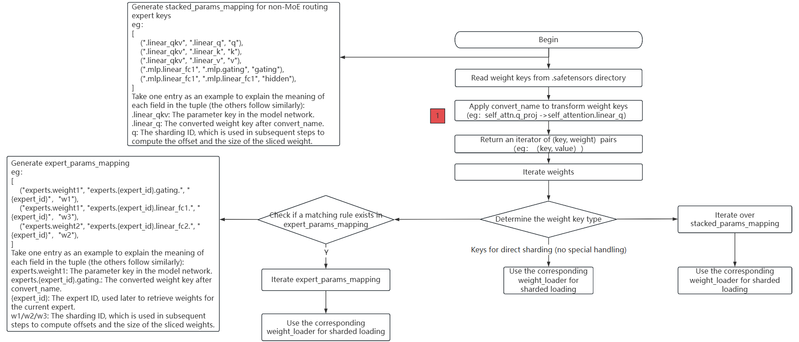

# Weight Conversion Development Adaptation

[](https://gitee.com/mindspore/docs/blob/master/docs/mindformers/docs/source_en/advanced_development/weight_transfer.md)

This document will guide developers on how to adapt the weight conversion functionality of new models to MindSpore Transformers during development, enabling users to convert Hugging Face weights into MindSpore Transformers weights through a unified automatic conversion process, thus initiating the inference workflow.

## Mcore Model Network Loading Hugging Face Weights Flowchart



The above flowchart describes the complete weight conversion and loading process of loading `.safetensors` weight files in `Hugging Face` format into the `Mcore` model.

The main steps are as follows:

1. Read all `.safetensors` files and obtain the `key` names of each weight;
2. Call the `convert_name` method to convert the weight keys. This step is also a necessary adaptation for weight conversion development, and it returns the weight `key` and the corresponding weight value;
3. Traverse the weight `key` and the corresponding weight value, and determine the type of the weight `key`:
   - For keys that do not belong to `MoE` or special structures, they can be directly loaded using `weight_loader`;
   - For keys related to routing experts in `MoE`, generate the corresponding processing rules `expert_params_mapping`, traverse `expert_params_mapping`, match the names, and finally call the corresponding `weight_loader` for processing;
   - For keys that do not belong to `MoE` routing experts but require special handling, generate the corresponding processing rules `stacked_params_mapping`, traverse `stacked_params_mapping`, match the names, and finally call the corresponding `weight_loader` for processing.

## Development Steps

As shown in the flowchart above, adapting the weight conversion only requires one modification: calling the `convert_name` method to complete the mapping from Hugging Face weight keys to intermediate state keys.

The steps are as follows:

1. Create a utils.py common utility file under the model implementation directory to encapsulate general functional methods for the model base class.
2. Create a class in utils.py:

   - Name the class using the format [ModelName]PreTrainedModel
   - Inherit from PreTrainedModel and ModelMixin base classes
3. Define class attributes config_class and base_model_prefix:

   - config_class: Specify as the Config class corresponding to the model
   - base_model_prefix: Set as the string identifier for the model name
4. Implement the key-value mapping table weight_mapping required by the convert_name() method:

   Example of weight_mapping:

   ```python
   weight_mapping = [
      ('model.embed_tokens.', 'embedding.word_embeddings.'),
      ('.self_attn.q_proj.', '.self_attention.linear_q.'),
      ('.self_attn.k_proj.', '.self_attention.linear_k.'),
      ('.self_attn.v_proj.', '.self_attention.linear_v.'),
      ('.self_attn.o_proj.', '.self_attention.linear_proj.'),
      ('.mlp.gate_proj.', '.mlp.gating.'),
      ('.mlp.down_proj.', '.mlp.linear_fc2.'),
      ('.mlp.up_proj.', '.mlp.hidden.'),
      ('.post_attention_layernorm.', '.pre_mlp_layernorm.'),
      ('model.norm.', 'decoder.final_layernorm.'),
      ('lm_head.', 'output_layer.'),
      ('model.layers.', 'decoder.layers.')
   ]
   ```

   In each tuple, the first element is the Hugging Face weight key, and the second element is the intermediate state weight key.

## Qwen3 Model Weight Conversion Adaptation Example

Create a new utils.py file under the models/qwen3 directory. Refer to [utils.py](https://gitee.com/mindspore/mindformers/blob/master/mindformers/models/qwen3/utils.py) for more details.

Partial code of Qwen3PreTrainedModel is as follows:

```python
class Qwen3PreTrainedModel(PreTrainedModel, ModelMixin):

 config_class = Qwen3Config
 base_model_prefix = "Qwen3"

 weight_mapping = [
     ('model.embed_tokens.', 'embedding.word_embeddings.'),
     ('.self_attn.q_proj.', '.self_attention.linear_q.'),
     ('.self_attn.k_proj.', '.self_attention.linear_k.'),
     ('.self_attn.v_proj.', '.self_attention.linear_v.'),
     ('.self_attn.o_proj.', '.self_attention.linear_proj.'),
     ('.self_attn.q_norm.', '.self_attention.q_layernorm.'),
     ('.self_attn.k_norm.', '.self_attention.k_layernorm.'),
     ('.mlp.gate_proj.', '.mlp.gating.'),
     ('.mlp.down_proj.', '.mlp.linear_fc2.'),
     ('.mlp.up_proj.', '.mlp.hidden.'),
     ('.post_attention_layernorm.', '.pre_mlp_layernorm.'),
     ('model.norm.', 'decoder.final_layernorm.'),
     ('lm_head.', 'output_layer.'),
     ('model.layers.', 'decoder.layers.')
 ]
```

## Verifying Successful Weight Loading

Refer to the [Inference Documentation](../guide/inference.md) to run the inference process. Check the logs. If the following content appears in the log, it indicates that the weights and network fully match, and the weights have been completely loaded into the network. Verify whether the model inference results meet expectations. If garbled output occurs, further investigation is needed, refer to the inference accuracy comparison documentation:

```text
These parameters are not loaded in the network: {}'
```
