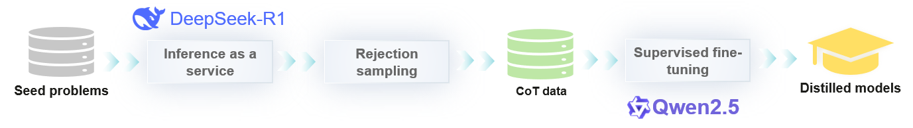

# Practice Case of Using DeepSeek-R1 for Model Distillation

[](https://gitee.com/mindspore/docs/blob/master/docs/mindformers/docs/source_zh_cn/example/distilled/distilled.md)

This case uses OpenR1-Qwen-7B as an example to describe how to use DeepSeek-R1 to perform knowledge distillation and fine-tuning on the Qwen2.5-Math-7B model based on the MindSpore framework and MindSpore Transformers LLM suite, to improve its performance in mathematical inference tasks. This case covers the entire process from environment configuration, data generation, and preprocessing to model fine-tuning and inference testing. You can perform the following steps to learn how to use DeepSeek-R1 to generate inference data, filter out incorrect data, process datasets, and fine-tune the model to solve complex mathematical problems.

Distillation process:



For more information, see [DeepSeek-R1-Distill-Qwen-7B](https://hf-mirror.com/deepseek-ai/DeepSeek-R1-Distill-Qwen-7B).

## 1. Prerequisites

### 1.1 Environment

For details, see [MindSpore Transformers Installation Guidelines](https://www.mindspore.cn/mindformers/docs/en/dev/installation.html).

Copy the [distilled](https://gitee.com/mindspore/docs/tree/master/docs/mindformers/docs/source_zh_cn/example/distilled/distilled) folder of this case to the root directory of the MindSpore Transformers source code.

The final directory structure is as follows:

```bash
mindformers
├── ...
└── distilled
    ├── data_process_handling.yaml  # Dataset handling configuration file.
    ├── data_process_packing.yaml   # Dataset packing configuration file.
    ├── finetune_qwen_2_5_7b.yaml   # Fine-tuning configuration file.
    ├── generate_reasoning.py       # Script for generating Chain-of-Thought (CoT) data.
    └── reject_sampling.py          # Rejection sampling script.
```

> Commands in this case are executed in the root directory of the MindSpore Transformers source code.

### 1.2 Model

The model used for fine-tuning is Qwen2.5-Math-7B-Instruct, which can be downloaded from [Modelers](https://modelers.cn/models/MindSpore-Lab/Qwen2.5-Math-7B-Instruct).

### 1.3 Dataset

This case provides three dataset preparation modes:

- **Generating datasets from scratch**: This mode is suitable for users who want to customize datasets or understand the data generation process, including generating CoT data from seed datasets and rejection sampling. For details, see [1.3.1 Generating Datasets from Scratch](#131-generating-datasets-from-scratch).
- **Using the OpenR1-Math-220K dataset**:

    - **Option 1: Using raw data for offline processing:** This option is suitable for users who need to customize data processing or learn the processing procedure, including preprocessing and packing. For details, see [Option 1: Using raw data for offline processing](#option-1-using-raw-data-for-offline-processing).
    - **Option 2: Using converted data:** This option is suitable for users who want to quickly start training. The case provides the preprocessed OpenR1-Math-220K dataset. For details, see [Option 2: Using converted data](#option-2-using-converted-data).

#### 1.3.1 Generating Datasets from Scratch

**Application scenario**: This method is suitable for users who want to customize datasets or learn the data generation process.

> The dataset generation process is only an example. If you want to generate a high-quality dataset, you are advised to refer to the dataset generation process in [OpenR1-Math-220k](https://huggingface.co/datasets/open-r1/OpenR1-Math-220k).

1. Dependency installation

    Run the following command to install dependencies:

    ```shell
    pip install datasets tqdm aiofiles aiohttp uvloop math_verify
    ```

2. Local deployment of DeepSeek-R1

    Deploy the DeepSeek-R1 inference service locally by referring to [MindSpore-Lab/DeepSeek-R1 | Modelers](https://modelers.cn/models/MindSpore-Lab/DeepSeek-R1) or use the public API service.

3. Data generation

    **Objective**: Use the DeepSeek-R1 model to generate CoT inference data for mathematical problems for subsequent data distillation.

    Modify API_KEY in the `generate_reasoning.py` script.

    ```python
    API_KEY = "your_api_key_here"
    ```

    Run the following commands to call the inference service API and generate CoT data using the questions in the seed dataset:

    ```shell
    python distilled/generate_reasoning.py \
        --model DeepSeek-R1 \
        --dataset-name AI-MO/NuminaMath-1.5 \
        --output-file /path/to/numinamath_r1_generations.jsonl \
        --prompt-column problem \
        --uuid-column problem \
        --api-addr api.host.name \
        --num-generations 2 \
        --max-tokens 16384 \
        --max-concurrent 100
    ```

    - **Function**: Call the DeepSeek-R1 inference service to generate an inference path based on the mathematical problems (in the `problem` column) in the [AI-MO/NuminaMath-1.5](https://huggingface.co/datasets/AI-MO/NuminaMath-1.5) dataset.
    - **Parameters**:

        - **`--model`**: model name of the inference service, which must be the same as the value of `modelName` in the service-oriented configuration file `config.json`.
        - **`--dataset-name`**: name of the seed dataset. Set this parameter to the name of the Hugging Face dataset or the local dataset path.
        - **`--output-file`**: name of the CoT data file.
        - **`--prompt-column`**: column name of the prompt in the seed dataset. The data in this column is used to generate CoT data.
        - **`--uuid-column`**: column name of the UUID in the seed dataset. The UUID is used to calculate the hash value to deduplicate data.
        - **`--api-addr`**: API address of the inference service. Set this parameter to `IP address:Port number`.
        - **`--num-generations`**: number of CoT data records generated for each question in the seed dataset.
        - **`--max-tokens`**: maximum number of tokens in the generated CoT data.
        - **`--max-concurrent`**: maximum number of concurrent requests.

4. Rejection sampling

    **Objective**: Filter out incorrect or inaccurate CoT data in the inference data to ensure data quality.

    ``` shell
    python distilled/reject_sampling.py \
        --src /path/to/numinamath_r1_generations.jsonl \
        --dst /path/to/numinamath_r1_generations_filtered.jsonl
    ```

    - **Function**: Use the `math_verify` library to verify the inference path in `numinamath_r1_generations.jsonl` and eliminate incorrect CoT data.
    - **Parameters**:

        - **`--src`**: path of the input CoT data file.
        - **`--dst`**: path of the output filtered CoT data file.

5. Dataset preprocessing

    Go to **Step 1** in [Option 1: Using raw data for offline processing](#option-1-using-raw-data-for-offline-processing) and convert the generated CoT data to a format supported by MindSpore Transformers.

    **In this case, the dataset is in JSONL format, which is different from the Parquet format of the original dataset. In addition, `data_files` contains only one `numinamath_r1_generations_filtered.jsonl` file. Modify the configuration file `data_process_handling.yaml` in the following format:**

    ```yaml
    train_dataset:
    ...
    data_loader:
        ...
        path: "json"
        data_files:
            ["/path/to/numinamath_r1_generations_filtered.jsonl"]
        ...
    ```

#### 1.3.2 Using the OpenR1-Math-220K Dataset

**Application scenario**: This method is applicable when users want to fine-tune models with high-quality pre-distilled datasets.

If you fine-tune models with the OpenR1-Math-220K dataset (distilled by DeepSeek-R1), [detailed processes](#option-1-using-raw-data-for-offline-processing) and [converted datasets](#option-2-using-converted-data).

##### Option 1: Using Raw Data for Offline Processing

Download the [OpenR1-Math-220K](https://huggingface.co/datasets/open-r1/OpenR1-Math-220K) dataset on Hugging Face.

Step 1: Preprocess the dataset.

**Objective**: Convert the original dataset (for example, OpenR1-Math-220K) into a format suitable for MindSpore Transformers fine-tuning.

You need to modify the dataset processing configuration file `data_process_handling.yaml`.

1. Copy the `research/qwen2_5/qwen2_5_tokenizer.py` file in the root directory of the MindSpore Transformers source code to the `distilled` directory.

    ```bash
    cp research/qwen2_5/qwen2_5_tokenizer.py distilled/
    ```

2. Modify the dataset file path: Replace the path in `data_files` with the path of the original dataset. List each Parquet file here.
    - Example: `["/path/to/data1.parquet", "/path/to/data2.parquet",...]`
3. Change the tokenizer path: Replace `vocab_file` and `merges_file` with the paths of the **vocabulary file** and **merges file** of the Qwen2.5-7B-Instruct model, respectively.

    ```yaml
    train_dataset:
    input_columns: &input_columns ["input_ids", "labels"]
    data_loader:
        ...
        data_files:
            ["/path/to/data1.parquet", "/path/to/data2.parquet", ...]   # Path of the dataset file.
        handler:
        - type: OpenR1Math220kDataHandler
            ...
          tokenizer:
            ...
            vocab_file: "/path/to/vocab.json"       # Path of the vocabulary file.
            merges_file: "/path/to/merges.txt"      # Path of the merges file.
            chat_template: ...
        ...
    ```

    Run the following data preprocessing script in the root directory of the MindSpore Transformers source code:

    ```shell
    python toolkit/data_preprocess/huggingface/datasets_preprocess.py \
        --config distilled/data_process_handling.yaml \
        --save_path /path/to/handled_data \
        --register_path distilled/
    ```

    - **Function**: Convert the original dataset to a format supported by MindSpore Transformers.
    - **Parameters**:

        - **`--config`**: path of the data preprocessing configuration file.
        - **`--save_path`**: path of the dataset after conversion.
        - **`--register_path`**: registration path, which is the `distilled/` folder in the current directory.

Step 2: Pack the dataset.

The dataset packing mechanism is supported in MindSpore Transformers, reducing the time required for fine-tuning.
The dataset packing configuration file is stored in the `/dataset/packing` directory. You need to change the value of `path` to the path of `handled_data`.

```yaml
# dataset
train_dataset:
  data_loader:
    ...
    path: /path/to/handled_data # Folder for storing the converted dataset.
```

Execute the following script in the root directory of the MindSpore Transformers source code:

```shell
python toolkit/data_preprocess/huggingface/datasets_preprocess.py \
    --config distilled/data_process_packing.yaml \
    --save_path /path/to/packed_data \
    --register_path distilled
```

- **Function**: Pack the processed dataset to reduce the data loading time during fine-tuning.
- **Parameters**:

    - **`--config`**: path of the dataset packing configuration file.
    - **`--save_path`**: save path of the dataset after packing.
    - **`--register_path`**: path for registering the dataset.

The processed dataset is stored in `packed_data` and is in the arrow format.

For more information, see [MindSpore Transformers official documentation > Dataset](https://www.mindspore.cn/mindformers/docs/en/dev/feature/dataset.html#custom-data-handler).

##### Option 2: Using converted data

Data that can be directly used for model training after being packed in the arrow format. For details, see [Modelers](https://modelers.cn/models/MindSpore-Lab/OpenR1-Qwen-7B/tree/main/dataset/packing). In this case, you need to change the value of `path` in [1.4 YAML Configuration](#14-yaml-configuration) to the path of the downloaded dataset.

```yaml
train_dataset:
  ...
  data_loader:
    ...
    path: "/path/to/OpenR1-Qwen-7B/dataset/packing/"
```

### 1.4 YAML Configuration

Modify the fine-tuning configuration file `finetune_qwen_2_5_7b.yaml` as required. The details are as follows:

```yaml
seed: 42
output_dir: './output'
load_checkpoint: "/path/to/Qwen2.5-Math-7B-Instruct" # Path of the weight folder. Change it to the actual path.
load_ckpt_format: 'safetensors'
auto_trans_ckpt: True
only_save_strategy: False
resume_training: False
run_mode: 'finetune'
...
train_dataset: &train_dataset
  input_columns: &input_columns ["input_ids", "labels", "loss_mask", "position_ids", "attention_mask"]
  divisor: 32
  remainder: 1
  num_parallel_workers: 8
  python_multiprocessing: False
  drop_remainder: True
  batch_size: 2
  repeat: 1
  numa_enable: False
  prefetch_size: 1
  dynamic_batch: True
  pad_token_id: 151643
  data_loader:
    type: CommonDataLoader
    shuffle: True
    split: "train"
    load_func: "load_from_disk"
    path: "/path/to/packed_data" # Path of the dataset folder after packing.
......
```

For details about other parameters, see [MindSpore Transformers official documentation > Supervised Fine-Tuning (SFT)](https://www.mindspore.cn/mindformers/docs/en/dev/guide/supervised_fine_tuning.html).

## 2. Starting Fine-Tuning

Set the following environment variables to prevent OOM:

```bash
export ACLNN_CACHE_LIMIT=10 # CANN cache limit.
export MS_DEV_RUNTIME_CONF="aclnn_cache_queue_length:128" # It is recommended that the MS cache queue length be set to 128. If the value is too large, OOM may occur. If the value is too small, the performance deteriorates.
```

Run the following command in the MindSpore Transformers directory to start fine-tuning:

```bash
bash scripts/msrun_launcher.sh "run_mindformer.py --config distilled/finetune_qwen_2_5_7b.yaml --run_mode finetune" 8
```

Logs are recorded in the `output/msrun_log` directory. For example, you can run the `tail -f output/msrun_log/worker_7.log` command to view the logs of worker 7.
After the fine-tuning is complete, the output `safetensors` weight file is stored in the `output/checkpoint` directory.

For more information about Safetensors weights, see [MindSpore Transformers official document > Safetensors Weights](https://www.mindspore.cn/mindformers/docs/en/dev/feature/safetensors.html).

## 3. Inference

If you want to use the fine-tuned weights for inference, refer to the inference part in [Qwen2.5-Math-7B-Instruct](https://modelers.cn/models/MindSpore-Lab/Qwen2.5-Math-7B-Instruct). However, you need to modify the system prompt in the [run_qwen2_5.py](https://gitee.com/mindspore/mindformers/blob/r1.5.0/research/qwen2_5/run_qwen2_5.py) script.

```python
    messages = [
        {"role": "system", "content": "Please reason step by step, and put your final answer within \\boxed{}."},
        {"role": "user", "content": input_prompt}
    ]
```

## 4. Evaluation Result

| Model                                   | MATH-500 |
|-----------------------------------------|:--------:|
| DeepSeek-Distill-Qwen-7B                | 91.6     |
| OpenR1-Qwen-7B (Hugging Face)            | 90.6     |
| OpenR1-Qwen-7B (MindSpore Transformers) | 90.0     |
| OpenThinker-7B                          | 89.6     |

> The third row in the preceding table shows the experiment result of this case, which is obtained from the local test.
