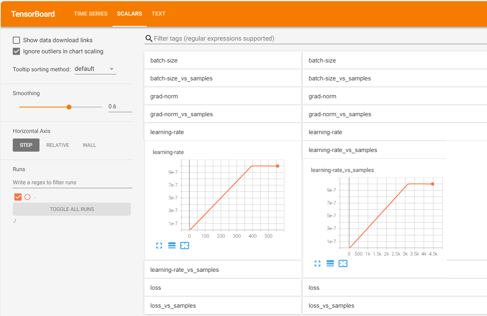
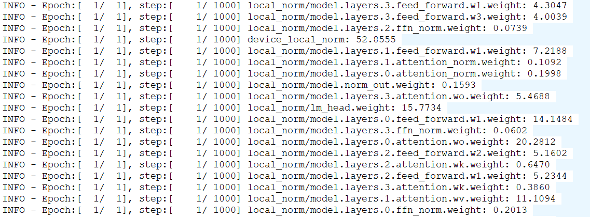
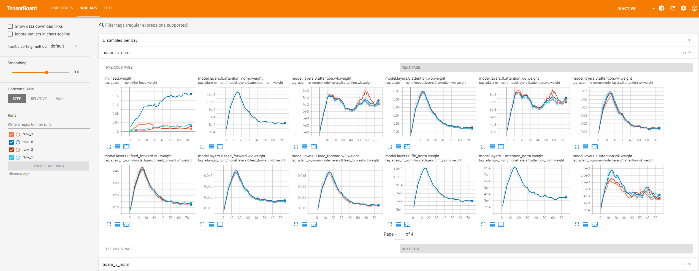
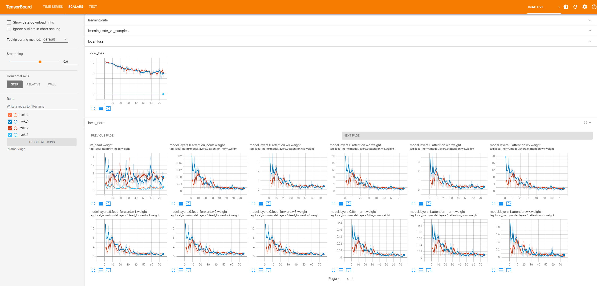

# Training Metrics Monitoring

[](https://gitee.com/mindspore/docs/blob/r2.6.0rc1/docs/mindformers/docs/source_en/function/monitor.md)

MindSpore Transformers supports TensorBoard as a visualization tool for monitoring and analyzing various metrics and information during training. TensorBoard is a standalone visualization library that requires the user to manually install it, and it provides an interactive way to view loss, precision, learning rate, gradient distribution, and a variety of other things in training. After the user configures TensorBoard in the training `yaml` file, the event file is generated and updated in real time during the training of the large model, and the training data can be viewed via commands.

## Configuration Descriptions

Configure the "monitor_config", "tensorboard" and "callbacks" keywords in the training `yaml` file, and the training will save the tensorboard event file under the configured save address.
A sample configuration is shown below:

### Configuration Sample of `yaml` File

```yaml
seed: 0
output_dir: './output'

monitor_config:
    monitor_on: True
    dump_path: './dump'
    target: ['layers.0', 'layers.1'] # Monitor only the first and second level parameters
    invert: False
    step_interval: 1
    local_loss_format: ['log', 'tensorboard']
    local_norm_format: ['log', 'tensorboard']
    device_local_norm_format: ['log', 'tensorboard']
    optimizer_state_format: null
    weight_state_format: null
    throughput_baseline: null
    print_struct: False

tensorboard:
    tensorboard_dir: 'worker/tensorboard'
    tensorboard_queue_size: 10
    log_loss_scale_to_tensorboard: True
    log_timers_to_tensorboard: True

callbacks:
    - type: MFLossMonitor
      per_print_times: 1
```

| monitor_config field parameter name                    | Descriptions                                                                                       | Types            |
|-----------------------------------------|------------------------------------------------------------------------------------------|---------------|
| monitor_config.monitor_on               | Sets whether monitoring is enabled. The default is `False`, when all the following parameters do not take effect                                                          | bool          |
| monitor_config.dump_path                | Sets the path where the `local_norm`, `device_local_norm`, and `local_loss` metrics files are saved during training. When not set or set to `null` take the default value '. /dump' | str           |
| monitor_config.target                   | Sets the name (fragment) of the target parameter monitored by the indicator `optimizer_state` and `local_norm`, which can be a regular expression. When not set or set to `null` take the default value ['. *'], i.e. specify all parameters        | list[str]     |
| monitor_config.invert                   | Sets the parameter specified by counterselecting `monitor_config.target`. Defaults to `False`.                                             | bool          |
| monitor_config.step_interval            | Sets the frequency of logging the indicator. Default is 1, i.e., record once per step                                                               | int           |
| monitor_config.local_loss_format        | Sets the logging form of the indicator `local_loss`                                                                    | str or list[str] |
| monitor_config.local_norm_format        | Sets the logging form of the indicator `local_norm`                                         | str or list[str] |
| monitor_config.device_local_norm_format | Sets the logging form of the indicator `device_local_norm`                            | str or list[str] |
| monitor_config.optimizer_state_format   | Sets the logging form of the indicator `optimizer_state`                                           | str or list[str] |
| monitor_config.weight_state_format      | Sets the logging form of the indicator `weight L2-norm`                                        | str or list[str] |
| monitor_config.throughput_baseline      | Sets the baseline value for the metric `throughput linearity`, which needs to be positive. It will be written to both Tensorboard and logs. Defaults to `null` when not set, indicating that the metric is not monitored                     | int or float     |
| monitor_config.print_struct             | Sets whether to print all trainable parameter names for the model. If `True`, it will print the names of all trainable parameters at the start of the first step and exit training at the end of the step. Default is `False`.            | bool          |

The optional values for the parameters of the form xxx_format above are the strings 'tensorboard' and 'log' (for writing to the Tensorboard and writing to the log, respectively), or a list of both, or `null`. All default to `null` when not set, indicating that the corresponding metrics are not monitored.

**Note**: when monitoring `optimizer_state` and `weight L2 norm` metrics is enabled, it will greatly increase the time consumption of the training process, so please choose carefully according to your needs. "rank_x" directory under the `monitor_config.dump_path` path will be cleared, so make sure that there is no file under the set path that needs to be kept.

| tensoraboardfield parameter name                    | Descriptions       | Types            |
|-----------------------------------------|---------------------|---------------|
| tensorboard.tensorboard_dir               | Sets the path where TensorBoard event files are saved                              | str  |
| tensorboard.tensorboard_queue_size        | Sets the maximum cache value of the capture queue. If it exceeds this value, it will be written to the event file, the default value is 10.                      | int  |
| tensorboard.log_loss_scale_to_tensorboard | Sets whether loss scale information is logged to the event file, default is `False`.                 | bool |
| tensorboard.log_timers_to_tensorboard     | Sets whether to log timer information to the event file. The timer information contains the duration of the current training step (or iteration) as well as the throughput, defaults to `False` | bool |

`tensorboard.tensorboard_dir` can be specified via the environment variable 'MA_SUMMARY_LOG_DIR', at which point a default `tensorboard` configuration will be automatically generated if `tensorboard` is not configured.
It should be noted that without the `tensorboard` configuration, the "tensorboard" set in xxx_format by `monitor_config` will be replaced with "log", i.e., instead of writing to the tensorboard event file, the corresponding information will be printed in the log.

## Viewing Training Data

After the above configuration, the event file for each card will be saved under the path `. /worker/tensorboard/rank_{id}`, where `{id}` is the rank number of each card. The event files are named `events.*`. The file contains `scalars` and `text` data, where `scalars` are the scalars of key metrics in the training process, such as learning rate, loss, etc.; `text` is the text data of all configurations for the training task, such as parallel configuration, dataset configuration, etc. In addition, according to the specific configuration, some metrics will be displayed in the log.

Use the following command to start the Tensorboard Web Visualization Service:

```bash
tensorboard --logdir=./worker/tensorboard/ --host=0.0.0.0 --port=6006
```

|Parameter names   | Descriptions                                                     |
|--------|--------------------------------------------------------|
| logdir | Path to the folder where TensorBoard saves event files                                |
| host   | The default is 127.0.0.1, which means that only local access is allowed; setting it to 0.0.0.0 allows external devices to access it, so please pay attention to information security. |
| port   | Set the port on which the service listens, the default is 6006.                                               |

The following is displayed when the command in the sample is entered:

```shell
TensorBoard 2.18.0 at http://0.0.0.0:6006/ (Press CTRL+C to quit)
```

`2.18.0` indicates the version number of the current TensorBoard installation (the recommended version is `2.18.0`), and `0.0.0.0` and `6006` correspond to the input `--host` and `--port` respectively, after which you can visit `server public ip:port` in the local PC's browser to view the visualization page. For example, if the public IP of the server is `192.168.1.1`, then access `192.168.1.1:6006`.

### Explanation of the Visualization of Indicators

The callback functions `MFLossMonitor` and `TrainingStateMonitor` will monitor different scalar metrics respectively. The `TrainingStateMonitor` does not need to be set by the user in the configuration file, it will be added automatically according to monitor_config.

#### MFLossMonitor Monitoring Metrics

The names and descriptions of the metrics monitored by `MFLossMonitor` are listed below:

| Scalar name          | Descriptions                                                  |
|---------------|-----------------------------------------------------|
| learning-rate | learning rate                                                 |
| batch-size    | batch size                                                |
| loss          | loss                                                  |
| loss-scale    | Loss scaling factor, logging requires setting `log_loss_scale_to_tensorboard` to `True` |
| grad-norm     | gradient exponent                                                |
| iteration-time | The time taken for training iterations, logging requires setting `log_timers_to_tensorboard` to `True`  |
| throughput    | Data throughput, logging requires setting `log_timers_to_tensorboard` to `True`      |
| model-flops-throughput-per-npu | Model operator throughput in TFLOPS/npu (trillion floating point operations per second per card)                                       |
| B-samples-per-day    | Cluster data throughput in B samples/day (one billion samples per day), logging requires setting `log_timers_to_tensorboard` to `True` |

In Tensorboard SCALARS page, the above metrics (assumed to be named `scalar_name`) have drop-down tabs for `scalar_name` and `scalar_name-vs-samples`, except for the last two. A line plot of this scalar versus the number of training iterations is shown under `scalar_name`, and a line plot of this scalar versus the number of samples is shown under `scalar_name-vs-samples`. An example of a plot of learning rate `learning-rate` is shown below:



#### TrainingStateMonitor Monitoring Metrics

The names and descriptions of the metrics monitored by `TrainingStateMonitor` are listed below:

| Scalar name          | Descriptions                                            |
|----------------------|-----------------------------------------------|
| local_norm           | Gradient paradigm for each parameter on a single card, records need to set `local_norm_format` to non-null    |
| device_local_norm    | the total number of gradient paradigms on a single card, records need to set `device_local_norm_format` to non-null    |
| local_loss           | localized losses on a single card, records need to set `local_loss_format` to non-null           |
| adam_m_norm          | The optimizer's first-order moments estimate the number of paradigms for each parameter, records need to set `optimizer_state_format` to non-null |
| adam_v_norm          | The optimizer's second-order moments estimate the number of paradigms for each parameter, records need to set `optimizer_state_format` to non-null |
| weight_norm          | weight L2 paradigm, records need to set `weight_state_format` to non-null            |
| throughput_linearity | data throughput linearity, records need to set `throughput_baseline` to non-null           |

Depending on the specific settings, the above metrics will be displayed in the Tensorboard or logs as follows:

**Example of logging effect**



**Example of tensorboard visualization**

adam_m_norm



local_loss and local_norm



### Description of Text Data Visualization

On the TEXT page, a tab exists for each training configuration where the values for that configuration are recorded. This is shown in the following figure:


All configuration names and descriptions are listed below:

| Configuration names                        | descriptions                                                           |
|----------------------------|--------------------------------------------------------------|
| seed                       | random seed                                                         |
| output_dir                 | Save paths to checkpoint and strategy                                     |
| run_mode                   | running mode                                                         |
| use_parallel               | whether to enable parallel                                                       |
| resume_training            | whether to enable resume training                                                   |
| ignore_data_skip           | Whether to ignore the mechanism for skipping data during breakpoints in resume training and read the dataset from the beginning. Recorded only if the `resume_training` value is `True` |
| data_skip_steps            | The number of data set skip steps. Only logged if `ignore_data_skip` is logged and the value is `False`.               |
| load_checkpoint            | Model name or weight path for loading weights                                                |
| load_ckpt_format           | File format for load weights. Only logged if the `load_checkpoint` value is not null                       |
| auto_trans_ckpt            | Whether to enable automatic online weight slicing or conversion. Only logged if the `load_checkpoint` value is not null                 |
| transform_process_num      | The number of processes to convert the checkpoint. Only logged if `auto_trans_ckpt` is logged and the value is `True`.        |
| src_strategy_path_or_dir   | Source weight distributed policy file path. Only logged if `auto_trans_ckpt` is logged and the value is `True`.            |
| load_ckpt_async            | Whether to log weights asynchronously. Only logged if the `load_checkpoint` value is not null                        |
| only_save_strategy         | Whether the task saves only distributed policy files                                               |
| profile                    | Whether to enable performance analysis tools                                                   |
| profile_communication      | Whether to collect communication performance data in multi-device training. Recorded only when `profile` value is `True`                   |
| profile_level              | Capture performance data levels. Recorded only when `profile` value is `True`                            |
| profile_memory             | Whether to collect Tensor memory data. Recorded only when `profile` value is `True`                      |
| profile_start_step         | Performance analysis starts with step. Recorded only when `profile` value is `True`                         |
| profile_stop_step          | Performance analysis ends with step. Recorded only when `profile` value is `True`                         |
| profile_rank_ids           | Specify the rank ids to turn on profiling. Recorded only when `profile` value is `True`               |
| profile_pipeline           | Whether to turn on profiling by for the cards of each stage in pipeline parallel. Recorded only when `profile` value is `True`    |
| init_start_profile         | Whether to enable data acquisition during Profiler initialization.Recorded only when `profile` value is `True`                                      |
| layer_decay                | Layer decay coefficient                                                        |
| layer_scale                | whether to enable layer scaling                                                       |
| lr_scale                   | Whether to enable learning rate scaling                                                    |
| lr_scale_factor            | Learning rate scaling factor. Recorded only when `lr_scale` value is `True`                            |
| micro_batch_interleave_num | Number of batch_size splits, multicopy parallelism switch                                      |
| remote_save_url            | Return folder paths for target buckets when using AICC training jobs                                      |
| callbacks                  | callback function configuration                                                       |
| context                    | Configuration of the environment                                                         |
| data_size                  | Dataset size                                                        |
| device_num                 | Number of devices (cards)                                                     |
| do_eval                    | Whether to turn on training-while-evaluating                                                   |
| eval_callbacks             | Evaluate the callback function configuration. Recorded only when `do_eval` value is `True`                            |
| eval_step_interval         | Evaluate step intervals. Recorded only when `do_eval` value is `True`                            |
| eval_epoch_interval        | Evaluate the epoch interval. Recorded only when `do_eval` value is `True`                           |
| eval_dataset               | Evaluate the dataset configuration. Recorded only when `do_eval` value is `True`                             |
| eval_dataset_task          | Evaluate task configurations. Recorded only when `do_eval` value is `True`                              |
| lr_schedule                | learning rate                                                          |
| metric                     | evaluation function                                                         |
| model                      | Model configuration                                                         |
| moe_config                 | Mixed expert configurations                                                       |
| optimizer                  | optimizer                                                          |
| parallel_config            | Parallel strategy configuration                                                       |
| parallel                   | Automatic parallel configuration                                                       |
| recompute_config           | recomputation configuration                                                        |
| remove_redundancy          | Whether redundancy is removed when checkpoint is saved                                          |
| runner_config              | running configuration                                                         |
| runner_wrapper             | wrapper configuration                                                    |
| monitor_config             | Training metrics monitoring configuration                 |
| tensorboard                | TensorBoard configuration                                                |
| train_dataset_task         | Training task configuration                                                       |
| train_dataset              | Training dataset configuration                                                      |
| trainer                    | Training process configuration                                                       |
| swap_config                | Fine-grained activations SWAP configuration |

> The above training configurations are derived from:
>
> 1. Configuration parameters passed in by the user in the training startup command `run_mindformer.py`;
> 2. Configuration parameters set by the user in the training configuration file `yaml`;
> 3. Default configuration parameters during training.
>
> Refer to [Configuration File Description](https://www.mindspore.cn/mindformers/docs/en/r1.5.0/appendix/conf_files.html) for all configurable parameters.