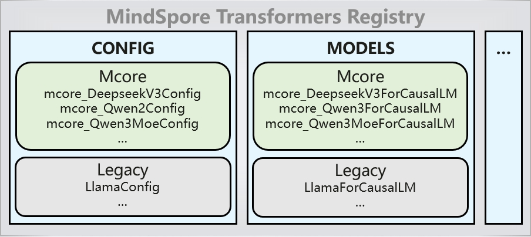

# Service Deployment

[](https://gitee.com/mindspore/docs/blob/master/docs/mindformers/docs/source_en/guide/deployment.md)

## vLLM Service Deployment

### Overview

The vLLM-MindSpore plugin is designed with the functional goal of integrating MindSpore large models into vLLM and enabling their servitized deployment: [Introduction to the vLLM-MindSpore Plugin](https://www.mindspore.cn/vllm_mindspore/docs/en/master/index.html#overview).

The MindSpore Transformers suite aims to build a full-cycle development toolkit for large-scale models, covering pre-training, fine-tuning, evaluation, inference, and deployment. It provides mainstream Transformer-based large language models (LLMs) and multimodal understanding models (MMs) in the industry.

### Environment Setup

The environment installation steps are divided into two methods:

- [Docker Installation](https://www.mindspore.cn/vllm_mindspore/docs/en/master/getting_started/installation/installation.html#docker-installation): Suitable for scenarios where users need quick deployment and use.
- [Source Code Installation](https://www.mindspore.cn/vllm_mindspore/docs/en/master/getting_started/installation/installation.html#source-code-installation): Suitable for users who require incremental development of the vLLM-MindSpore plugin.

### Quick Start

After completing the environment deployment and before running the model, users need to prepare the model files. They can follow the guidelines in the Model Download section to prepare the model. Once the environment variables are configured, they can proceed with either offline inference or online services.

**Environment Variables**

Before launching the model, users need to configure the following environment variables:

```bash
export vLLM_MODEL_BACKEND=MindFormers # use MindSpore Transformers
export MINDFORMERS_MODEL_CONFIG=/path/to/yaml # Required for non-Mcore models
```

Currently, vLLM MindSpore supports different model backends. The environment variables specified above designate MindSpore Transformers as the integrated model suite. For non-MCore models, it is necessary to configure the model's YAML configuration file.

For more environment variables, please refer to: [Environment Variables](https://www.mindspore.cn/vllm_mindspore/docs/en/master/user_guide/environment_variables/environment_variables.html).

After preparing the model and environment variables, you can proceed with inference.

#### Online Inference

vLLM online inference is designed for real-time service scenarios, leveraging dynamic batching and the OpenAI API to deliver high concurrency, high throughput, and low latency, making it suitable for enterprise-level applications.

- Please refer to the single-GPU inference process: [Single-Card Inference](https://www.mindspore.cn/vllm_mindspore/docs/en/master/getting_started/tutorials/qwen2.5_7b_singleNPU/qwen2.5_7b_singleNPU.html)
- Please refer to the single-node multi-GPU inference process: [Multi-Card Inference](https://www.mindspore.cn/vllm_mindspore/docs/en/master/getting_started/tutorials/qwen2.5_32b_multiNPU/qwen2.5_32b_multiNPU.html)
- Please refer to the multi-node parallel inference process: [Multi-machine Parallel Inference](https://www.mindspore.cn/vllm_mindspore/docs/en/master/getting_started/tutorials/deepseek_parallel/deepseek_r1_671b_w8a8_dp4_tp4_ep4.html)

#### Offline Inference

vLLM's offline inference is designed for efficiently processing large-scale batch requests, making it particularly suitable for non-real-time, data-intensive model inference scenarios.

For the offline inference process, please refer to: [Offline Inference](https://www.mindspore.cn/vllm_mindspore/docs/en/master/getting_started/quick_start/quick_start.html#offline-inference)

### Mcore Model Adaptation

vLLM MindSpore supports multiple model suite libraries. When the model suite is MindSpore Transformers, the Mcore models registered in the MindSpore Transformers registry can be directly deployed as services through vLLM by default. This implementation leverages the AutoModel interface of MindSpore Transformers.

The principle is as follows: In vLLM's model registry, all MindSpore Transformers models are uniformly registered under the `MindFormersForCausalLM` class, following MindSpore Transformers' model loading logic. On the MindSpore Transformers side, all Mcore model configurations and models are automatically registered in the registry when the `mindformers` component is loaded. During the model loading process, the model or model file is retrieved from the registry based on the `model_type` or `architectures` specified in the model's `config.json` configuration file, thereby completing model configuration instantiation and model loading.

In the vLLM MindSpore model registry, only the `MindFormersForCausalLM` class is registered:


In the MindSpore Transformers model registry, model configuration classes and model classes are registered:



If configuration modifications are required, please refer to the [Configuration](https://gitee.com/mindspore/vllm-mindspore/blob/master/vllm_mindspore/model_executor/models/mf_models/config.py) file. Based on existing mapping relationships, vLLM's CLI parameters can be converted and applied to take effect on the model side.

### Appendix

#### Compatible Versions

For supporting information on each component, please refer to: [Compatible Versions](https://www.mindspore.cn/vllm_mindspore/docs/en/master/getting_started/installation/installation.html)

#### Supported Models List

| Model | Mcore New Architecture | Status | Download Link |
|-|-|-|-|
|Qwen3-32B|YES|Supported|[Qwen3-32B](https://modelers.cn/models/MindSpore-Lab/Qwen3-32B)|
|Qwen3-235B-A22B|YES|Supported|[Qwen3-235B-A22B](https://huggingface.co/Qwen/Qwen3-235B-A22B)|
|Qwen3|YES|testing|[Qwen3-0.6B](https://huggingface.co/Qwen/Qwen3-0.6B), [Qwen3-1.7B](https://huggingface.co/Qwen/Qwen3-1.7B), [Qwen3-4B](https://huggingface.co/Qwen/Qwen3-4B), [Qwen3-8B](https://huggingface.co/Qwen/Qwen3-8B), [Qwen3-14B](https://modelers.cn/models/MindSpore-Lab/Qwen3-14B)|
|Qwen3-MOE|YES|testing|[Qwen3-30B-A3](https://modelers.cn/models/MindSpore-Lab/Qwen3-30B-A3B-Instruct-2507)|
|deepSeek-V3|YES|testing|[deepSeek-V3](https://modelers.cn/models/MindSpore-Lab/DeepSeek-V3)|
|Qwen2.5|NO|Supported|[Qwen2.5-0.5B-Instruct](https://huggingface.co/Qwen/Qwen2.5-0.5B-Instruct), [Qwen2.5-1.5B-Instruct](https://huggingface.co/Qwen/Qwen2.5-1.5B-Instruct), [Qwen2.5-3B-Instruct](https://huggingface.co/Qwen/Qwen2.5-3B-Instruct), [Qwen2.5-7B-Instruct](https://huggingface.co/Qwen/Qwen2.5-7B-Instruct), [Qwen2.5-14B-Instruct](https://huggingface.co/Qwen/Qwen2.5-14B-Instruct), [Qwen2.5-32B-Instruct](https://huggingface.co/Qwen/Qwen2.5-32B-Instruct), [Qwen2.5-72B-Instruct](https://huggingface.co/Qwen/Qwen2.5-72B-Instruct)|

## MindIE Service Deployment

### Introduction

MindIE, full name Mind Inference Engine, is a high-performance inference framework based on Ascend hardware. For more information, please refer to [Official Document](https://www.hiascend.com/software/mindie).

MindSpore Transformers are hosted in the model application layer MindIE LLM, and large models in MindSpore Transformers can be deployed through MindIE Service.

The model support for MindIE inference can be found in [model repository](https://www.mindspore.cn/mindformers/docs/en/master/introduction/models.html).

### Environment Setup

#### Software Installation

1. Install MindSpore Transformers

   Refer to [MindSpore Transformers Official Installation Guide](https://www.mindspore.cn/mindformers/docs/en/master/installation.html) for installation.

2. Install MindIE

   Refer to [MindIE Installation Dependencies Documentation](https://www.hiascend.com/document/detail/zh/mindie/100/envdeployment/instg/mindie_instg_0010.html) to complete the dependency installation. After that, go to [MindIE Resource Download Center](https://www.hiascend.com/developer/download/community/result?module=ie%2Bpt%2Bcann) to download the package and install it.

   MindIE and CANN versions must be matched, and version matching relationship is as follows.

   |                                           MindIE                                            |                                        CANN-toolkit                                         |                                        CANN-kernels                                         |
   |:-------------------------------------------------------------------------------------------:|:-------------------------------------------------------------------------------------------:|:-------------------------------------------------------------------------------------------:|
   | [1.0.0](https://www.hiascend.com/developer/download/community/result?module=ie%2Bpt%2Bcann) | [8.0.0](https://www.hiascend.com/developer/download/community/result?module=ie%2Bpt%2Bcann) | [8.0.0](https://www.hiascend.com/developer/download/community/result?module=ie%2Bpt%2Bcann) |

#### Environment Variables

If the installation path is the default path, you can run the following command to initialize the environment variables of each component.

```bash
# Ascend
source /usr/local/Ascend/ascend-toolkit/set_env.sh
# MindIE
source /usr/local/Ascend/mindie/latest/mindie-llm/set_env.sh
source /usr/local/Ascend/mindie/latest/mindie-service/set_env.sh
# MindSpore
export LCAL_IF_PORT=8129
# Networking Configuration
export MS_SCHED_HOST=127.0.0.1     # scheduler node IP address
export MS_SCHED_PORT=8090          # Scheduler node service port
```

> If there are other cards on the machine that have MindIE enabled, you need to be aware of any conflicts with the `MS_SCHED_PORT` parameter. If you get an error on this parameter in the log printout, try again with a different port number.

### Basic Process of Inference Service Deployment

#### Preparing Model Files

Create a folder for the specified model related files in the MindIE backend, such as model tokenizer files, yaml configuration files and config files.

```bash
mkdir -p mf_model/qwen1_5_72b
```

Taking Qwen1.5-72B as an example, the folder directory structure is as follows:

```reStructuredText
mf_model
 └── qwen1_5_72b
        ├── config.json                 # Model json configuration file, corresponding model download on Hugging Face
        ├── vocab.json                  # Model vocab file, corresponding model download on Hugging Face
        ├── merges.txt                  # Model merges file, corresponding model download on Hugging Face
        ├── predict_qwen1_5_72b.yaml    # Model yaml configuration file
        ├── qwen1_5_tokenizer.py        # Model tokenizer file, copy the corresponding model from the search directory in the mindformers repository
        └── qwen1_5_72b_ckpt_dir        # Model distributed weight folder
```

predict_qwen1_5_72b.yaml needs to be concerned with the following configuration:

```yaml
load_checkpoint: '/mf_model/qwen1_5_72b/qwen1_5_72b_ckpt_dir' # Path to the folder that holds the model distributed weight
use_parallel: True
auto_trans_ckpt: False    # Whether to enable automatic weight conversion, with offline splitting set to False
parallel_config:
  data_parallel: 1
  model_parallel: 4       # Multi-card inference configures the model splitting, which generally corresponds to the number of cards used
  pipeline_parallel: 1
processor:
  tokenizer:
    vocab_file: "/path/to/mf_model/qwen1_5_72b/vocab.json"  # vocab file absolute path
    merges_file: "/path/to/mf_model/qwen1_5_72b/merges.txt"  # merges file absolute path
```

For model weight downloading and conversions, refer to the [Weight Format Conversion Guide](https://www.mindspore.cn/mindformers/docs/en/master/feature/ckpt.html).

Required files and configurations may vary from model to model. Refer to the model-specific inference sections in [Model Repository](https://www.mindspore.cn/mindformers/docs/en/master/introduction/models.html) for details.

#### Starting MindIE

**1. One-click Start (Recommended)**

The mindformers repository provides a one-click pull-up MindIE script with preconfigured environment variable settings and servitization configurations, which allows you to quickly pull up the service by simply entering the directory of the model file.

Go to the `scripts` directory and execute the MindIE startup script:

```shell
cd ./scripts
bash run_mindie.sh --model-name xxx --model-path /path/to/model

# Parameter descriptions
--model-name: Mandatory, set MindIE backend name
--model-path: Mandatory, set model folder path, such as /path/to/mf_model/qwen1_5_72b
--help      : Instructions for using the script
```

View logs:

```bash
tail -f output.log
```

When `Daemon start success!` appears in the log, it means the service started successfully.

**Script Parameters**

| Parameters                 | Parameter Description                                                                                                                                                                                                                                                                                                                                                       | Value Description                         |
| :------------------------- |:----------------------------------------------------------------------------------------------------------------------------------------------------------------------------------------------------------------------------------------------------------------------------------------------------------------------------------------------------------------------------|-------------------------------------------|
| `--model-name`             | Given a model name to identify MindIE Service.                                                                                                                                                                                                                                                                                                                              | str, required                             |
| `--model-path`             | Given a model path which contain necessary files such as yaml/conf.json/tokenizer/vocab etc.                                                                                                                                                                                                                                                                                | str, required                             |
| `--ip`                     | The IP address bound to the MindIE Server business plane RESTful interface.                                                                                                                                                                                                                                                                                                 | str, optional. Default value: "127.0.0.1" |
| `--port`                   | The port bound to the MindIE Server business plane RESTful interface.                                                                                                                                                                                                                                                                                                       | int, optional. Default value: 1025        |
| `--management-ip`          | The IP address bound to the MindIE Server management plane RESTful interface.                                                                                                                                                                                                                                                                                               | str, optional. Default value: "127.0.0.2" |
| `--management-port`        | The port bound to the MindIE Server management plane RESTful interface.                                                                                                                                                                                                                                                                                                     | int, optional. Default value: 1026        |
| `--metrics-port`           | The port bound to the performance indicator monitoring interface.                                                                                                                                                                                                                                                                                                           | int, optional. Default value: 1027        |
| `--max-seq-len`            | Maximum sequence length.                                                                                                                                                                                                                                                                                                                                                    | int, optional. Default value: 2560        |
| `--max-iter-times`         | The global maximum output length of the model.                                                                                                                                                                                                                                                                                                                              | int, optional. Default value: 512         |
| `--max-input-token-len`    | The maximum length of the token id.                                                                                                                                                                                                                                                                                                                                         | int, optional. Default value: 2048        |
| `--max-prefill-tokens`     | Each time prefill occurs, the total number of input tokens in the current batch.                                                                                                                                                                                                                                                                                            | int, optional. Default value: 8192        |
| `--truncation`             | Whether to perform parameter rationalization check interception.                                                                                                                                                                                                                                                                                                            | bool, optional. Default value: false      |
| `--template-type`          | Reasoning type.<br />Standard：In the scenario where PDs are deployed together, prefill requests and decode requests are batched separately.<br />Mix：Parameters related to the SplitFuse feature. Prefill and Decode requests can be batched together.                                                                                                                      | str, optional. Default value: "Standard". |
| `--max-preempt-count`      | The upper limit of the maximum number of preemptible requests in each batch.                                                                                                                                                                                                                                                                                                | int, optional. Default value: 0           |
| `--support-select-batch`   | Batch selection strategy.<br />false：Indicates that requests in the Prefill phase are preferentially scheduled and executed in each round of scheduling.<br />true：In each round of scheduling, the sequence of scheduling and executing requests in the Prefill and Decode phases is adaptively adjusted based on the number of requests in the Prefill and Decode phases. | bool, optional. Default value: false      |
| `--npu-mem-size`           | This can be used to apply for the upper limit of the KV Cache size in the NPU.                                                                                                                                                                                                                                                                                              | int, optional. Default value: 50          |
| `--max-prefill-batch-size` | The maximum prefill batch size.                                                                                                                                                                                                                                                                                                                                             | int, optional. Default value: 50          |
| `--world-size`             | Enable several cards for inference. By default, this parameter is not set. The value of parallel_config in the YAML file prevails. After the parameter is set, the model_parallel parameter in the parallel configuration in the YAML file is overwritten.                                                                                                                  | str, optional.                            |
| `--ms-sched-host`          | MindSpore scheduler IP address.                                                                                                                                                                                                                                                                                                                                             | str, optional. Default value: "127.0.0.1" |
| `--ms-sched-port`          | MindSpore scheduler port.                                                                                                                                                                                                                                                                                                                                                   | int, optional. Default value: 8119        |
| `--help`                   | Show parameter description messages.                                                                                                                                                                                                                                                                                                                                        | str, optional.                            |

**2. Customized Startup**

The MindIE installation paths are all the default paths `/usr/local/Ascend/.` If you customize the installation path, synchronize the path in the following example.

Open config.json in the mindie-service directory and modify the server-related configuration.

```bash
vim /usr/local/Ascend/mindie/latest/mindie-service/conf/config.json
```

where `modelWeightPath` and `backendType` must be modified to configure:

```bash
"modelWeightPath": "/path/to/mf_model/qwen1_5_72b"
"backendType": "ms"
```

`modelWeightPath` is the model folder created in the previous step, where model and tokenizer and other related files are placed; `backendType` backend startup method is `ms`.

Other relevant parameters are as follows:

| Optional Configurations          | Value Type | Range of Values             | Configuration Descriptions                                                                                                                       |
| ------------------- | -------- | -------------------- |----------------------------------------------------------------------------------------------------------------------------|
| httpsEnabled        | Bool     | True/False           | Whether to enable HTTPS communication security authentication, the default is True. Easy to start, it is recommended to set to False.  |
| maxSeqLen           | int32    | Customized by user requirements, >0 | MaxSeqLen. Length of input + length of output <= maxSeqLen, user selects maxSeqLen according to inference scenario                                                                       |
| npuDeviceIds        | list     | Customization by model requirements     | This configuration item is temporarily disabled. The actual running card is controlled by the visible card environment variable and the worldSize configuration. Resource reference needs to be adjusted by visible card according to [CANN Environment Variables](https://www.hiascend.com/document/detail/zh/CANNCommunityEdition/80RC3alpha003/apiref/envref/envref_07_0029.html).                         |
| worldSize           | int32    | Customization by model requirements     | The number of cards used for the visible card. Example: ASCEND_RT_VISIBLE_DEVICES=4,0,1,2 and worldSize=2, then take the 4th, 0th card to run.    |
| npuMemSize          | int32    | Customization by Video Memory         | The upper limit of the size (GB) that can be used to request KVCache in the NPU can be calculated according to the actual size of the deployment model: npuMemSize=(total free - weight/mp number)*factor, where the factor is taken as 0.8. Recommended value: 8.                                    |
| cpuMemSize          | int32    |  Customization by Memory         | The upper limit of the size (GB) that can be used to request KVCache in CPU is related to the swap function, and the Cache will be released for recalculation when cpuMemSize is insufficient. Recommended value: 5.                                                   |
| maxPrefillBatchSize | int32    | [1, maxBatchSize]    | Maximum prefill batch size. maxPrefillBatchSize and maxPrefillTokens will complete the batch if they reach their respective values first. This parameter is mainly used in scenarios where there is a clear need to limit the batch size of the prefill phase, otherwise it can be set to 0 (at this point, the engine will take the maxBatchSize value by default) or the same as maxBatchSize. Required, default value: 50. |
| maxPrefillTokens    | int32    | [5120, 409600]       | At each prefill, the total number of all input tokens in the current batch must not exceed maxPrefillTokens. maxPrefillTokens and maxPrefillBatchSize will complete the current group batch if they reach their respective values first. Required, default value: 8192.                                                                                |
| maxBatchSize        | int32    | [1, 5000]            | Maximum decode batch size, estimated based on model size and NPU graphics memory.                                                                                       |
| maxIterTimes        | int32    | [1, maxSeqLen-1]     | The number of decodes that can be performed, i.e. the maximum length of a sentence that can be generated. There is a max_output_length parameter inside the request level, maxIterTimes is a global setting, and max_output_length is taken as the maximum length of the final output.         |

The full set of configuration parameters is available in [MindIE Service Developer's Guide - Quick Start - Configuration Parameter Descriptions](https://www.hiascend.com/document/detail/zh/mindie/10RC3/mindieservice/servicedev/mindie_service0285.html).

Run the startup script:

```bash
cd /path/to/mindie/latest/mindie-service
nohup ./bin/mindieservice_daemon > output.log 2>&1 &
tail -f output.log
```

When `Daemon start success!` appears in the log, it means the service started successfully.

The related logs of Python:

```bash
export MINDIE_LLM_PYTHON_LOG_TO_FILE=1
export MINDIE_LLM_PYTHON_LOG_PATH=/usr/local/Ascend/mindie/latest/mindie-service/logs/pythonlog.log
tail -f /usr/local/Ascend/mindie/latest/mindie-service/logs/pythonlog.log
```

### MindIE Service Deployment and Inference Example

The following example installs each component to the default path `/usr/local/Ascend/.` and the model uses `Qwen1.5-72B`.

#### Preparing Model Files

Take Qwen1.5-72B as an example to prepare the model file directory. For details of the directory structure and configuration, refer to [Preparing Model Files](#preparing-model-files):

```bash
mkdir -p mf_model/qwen1_5_72b
```

#### Starting MindIE

**1. One-click Start (Recommended)**

Go to the `scripts` directory and execute the mindie startup script:

```shell
cd ./scripts
bash run_mindie.sh --model-name qwen1_5_72b --model-path /path/to/mf_model/qwen1_5_72b
```

View log:

```bash
tail -f output.log
```

When `Daemon start success!` appears in the log, it means the service started successfully.

**2. Customized Startup**

Open config.json in the mindie-service directory and modify the server-related configuration.

```bash
vim /usr/local/Ascend/mindie/latest/mindie-service/conf/config.json
```

The final modified config.json is as follows:

```json
{
    "Version" : "1.0.0",
    "LogConfig" :
    {
        "logLevel" : "Info",
        "logFileSize" : 20,
        "logFileNum" : 20,
        "logPath" : "logs/mindservice.log"
    },

    "ServerConfig" :
    {
        "ipAddress" : "127.0.0.1",
        "managementIpAddress" : "127.0.0.2",
        "port" : 1025,
        "managementPort" : 1026,
        "metricsPort" : 1027,
        "allowAllZeroIpListening" : false,
        "maxLinkNum" : 1000,
        "httpsEnabled" : false,
        "fullTextEnabled" : false,
        "tlsCaPath" : "security/ca/",
        "tlsCaFile" : ["ca.pem"],
        "tlsCert" : "security/certs/server.pem",
        "tlsPk" : "security/keys/server.key.pem",
        "tlsPkPwd" : "security/pass/key_pwd.txt",
        "tlsCrl" : "security/certs/server_crl.pem",
        "managementTlsCaFile" : ["management_ca.pem"],
        "managementTlsCert" : "security/certs/management/server.pem",
        "managementTlsPk" : "security/keys/management/server.key.pem",
        "managementTlsPkPwd" : "security/pass/management/key_pwd.txt",
        "managementTlsCrl" : "security/certs/management/server_crl.pem",
        "kmcKsfMaster" : "tools/pmt/master/ksfa",
        "kmcKsfStandby" : "tools/pmt/standby/ksfb",
        "inferMode" : "standard",
        "interCommTLSEnabled" : false,
        "interCommPort" : 1121,
        "interCommTlsCaFile" : "security/grpc/ca/ca.pem",
        "interCommTlsCert" : "security/grpc/certs/server.pem",
        "interCommPk" : "security/grpc/keys/server.key.pem",
        "interCommPkPwd" : "security/grpc/pass/key_pwd.txt",
        "interCommTlsCrl" : "security/certs/server_crl.pem",
        "openAiSupport" : "vllm"
    },

    "BackendConfig" : {
        "backendName" : "mindieservice_llm_engine",
        "modelInstanceNumber" : 1,
        "npuDeviceIds" : [[0,1,2,3]],
        "tokenizerProcessNumber" : 8,
        "multiNodesInferEnabled" : false,
        "multiNodesInferPort" : 1120,
        "interNodeTLSEnabled" : true,
        "interNodeTlsCaFile" : "security/grpc/ca/ca.pem",
        "interNodeTlsCert" : "security/grpc/certs/server.pem",
        "interNodeTlsPk" : "security/grpc/keys/server.key.pem",
        "interNodeTlsPkPwd" : "security/grpc/pass/mindie_server_key_pwd.txt",
        "interNodeTlsCrl" : "security/grpc/certs/server_crl.pem",
        "interNodeKmcKsfMaster" : "tools/pmt/master/ksfa",
        "interNodeKmcKsfStandby" : "tools/pmt/standby/ksfb",
        "ModelDeployConfig" :
        {
            "maxSeqLen" : 8192,
            "maxInputTokenLen" : 8192,
            "truncation" : false,
            "ModelConfig" : [
                {
                    "modelInstanceType" : "Standard",
                    "modelName" : "Qwen1.5-72B-Chat",
                    "modelWeightPath" : "/mf_model/qwen1_5_72b",
                    "worldSize" : 4,
                    "cpuMemSize" : 15,
                    "npuMemSize" : 15,
                    "backendType" : "ms"
                }
            ]
        },

        "ScheduleConfig" :
        {
            "templateType" : "Standard",
            "templateName" : "Standard_LLM",
            "cacheBlockSize" : 128,

            "maxPrefillBatchSize" : 50,
            "maxPrefillTokens" : 8192,
            "prefillTimeMsPerReq" : 150,
            "prefillPolicyType" : 0,

            "decodeTimeMsPerReq" : 50,
            "decodePolicyType" : 0,

            "maxBatchSize" : 200,
            "maxIterTimes" : 4096,
            "maxPreemptCount" : 0,
            "supportSelectBatch" : false,
            "maxQueueDelayMicroseconds" : 5000
        }
    }
}
```

> For testing purposes, the `httpsEnabled` parameter is set to `false`, ignoring subsequent https communication related parameters.

Go to the mindie-service directory to start the service:

```bash
cd /usr/local/Ascend/mindie/1.0.RC3/mindie-service
nohup ./bin/mindieservice_daemon > output.log 2>&1 &
tail -f output.log
```

The following message is printed, indicating that the startup was successful.

```bash
Daemon start success!
```

#### Request Test

After the service has started successfully, you can use the curl command to send a request for verification, as shown in the following example:

```bash
curl -w "\ntime_total=%{time_total}\n" -H "Accept: application/json" -H "Content-type: application/json" -X POST -d '{"inputs": "I love Beijing, because","stream": false}' http://127.0.0.1:1025/generate
```

The validation is successful with the following returned inference result:

```json
{"generated_text":" it is a city with a long history and rich culture....."}
```

### Model List

Examples of MindIE inference for other models can be found in the introduction documentation for each model in [Model Library](https://www.mindspore.cn/mindformers/docs/en/master/introduction/models.html).