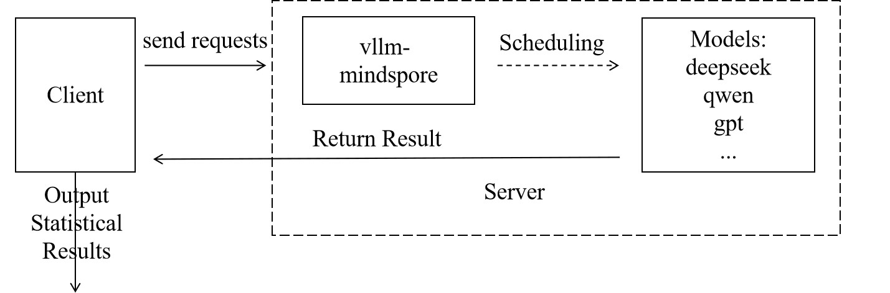

# Evaluation

[](https://gitee.com/mindspore/docs/blob/master/docs/mindformers/docs/source_en/guide/evaluation.md)

## Overview

The rapid development of Large Language Models (LLMs) has created a systematic need to evaluate their capabilities and limitations. Model evaluation has become essential infrastructure in the AI field. The mainstream model evaluation process is like an exam, where model capabilities are assessed through the accuracy rate of the model's answers to test papers (evaluation datasets). Common datasets such as CEVAL contain 52 different subject professional examination multiple-choice questions in Chinese, primarily evaluating the model's knowledge base. GSM8K consists of 8,501 high-quality elementary school math problems written by human problem setters, primarily evaluating the model's reasoning ability, and so on.

In previous versions, MindSpore Transformers adapted the Harness evaluation framework for certain legacy architecture models. The latest version now supports the AISBench evaluation framework, meaning that in theory, any model supporting service-oriented deployment can be evaluated using AISBench.

## AISBench Benchmarking

For service-oriented evaluation of MindSpore Transformers, the AISBench Benchmark suite is recommended. AISBench Benchmark is a model evaluation tool built on OpenCompass, compatible with OpenCompass's configuration system, dataset structure, and model backend implementation, while extending support for service-oriented models. It supports 30+ open-source datasets: [Evaluation datasets supported by AISBench](https://gitee.com/aisbench/benchmark/blob/master/doc/users_guide/datasets.md#%E5%BC%80%E6%BA%90%E6%95%B0%E6%8D%AE%E9%9B%86).

Currently, AISBench supports two major categories of inference task evaluation scenarios:

- **Accuracy Evaluation**: Supports accuracy verification and model capability assessment of service-oriented models and local models on various question-answering and reasoning benchmark datasets.
- **Performance Evaluation**: Supports latency and throughput evaluation of service-oriented models, and can perform extreme performance testing under pressure testing scenarios.

Both tasks follow the same evaluation paradigm. The user side sends requests and analyzes the results output by the service side to output the final evaluation results, as shown in the figure below:



### Preparations

The preparation phase mainly completes three tasks: installing the AISBench evaluation environment, downloading datasets, and starting the vLLM-MindSpore service.

#### Step 1 Install AISBench Evaluation Environment

Since AISBench has dependencies on both torch and transformers, but the official vLLM-MindSpore image contains a mocked torch implementation from the msadapter package which may cause conflicts, it is recommended to set up a separate container for installing the AISBench evaluation environment. If you insist on using the vLLM-MindSpore image to create a container for installing the evaluation environment, you need to perform the following steps to remove the existing torch and transformers packages inside the container after launching it:

```bash
rm -rf /usr/local/Python-3.11/lib/python3.11/site-packages/torch*
pip uninstall transformers
unset USE_TORCH
```

Then clone the repository and install from source:

```bash
git clone https://gitee.com/aisbench/benchmark.git
cd benchmark/
pip3 install -e ./ --use-pep517
```

#### Step 2 Dataset Download

The official documentation provides download links for each dataset. Taking CEVAL as an example, you can find the download link in the [CEVAL documentation,](https://gitee.com/aisbench/benchmark/blob/master/ais_bench/benchmark/configs/datasets/ceval/README.md), and execute the following commands to download and extract the dataset to the specified path:

```bash
cd ais_bench/datasets
mkdir ceval/
mkdir ceval/formal_ceval
cd ceval/formal_ceval
wget https://www.modelscope.cn/datasets/opencompass/ceval-exam/resolve/master/ceval-exam.zip
unzip ceval-exam.zip
rm ceval-exam.zip
```

For other dataset downloads, you can find download links in the corresponding dataset's official documentation.

#### Step 3 Start vLLM-MindSpore Service

For the specific startup process, see: [Service Deployment Tutorial](./deployment.md). Evaluation supports all service-deployable models.

### Accuracy Evaluation Process

Accuracy evaluation first requires determining the evaluation interface and dataset type, which is specifically selected based on model capabilities and datasets.

#### Step 1 Modify Interface Configuration

AISBench supports OpenAI's v1/chat/completions and v1/completions interfaces, which correspond to different configuration files in AISBench. Taking the v1/completions interface as an example, referred to as the general interface, you need to modify the following file `ais_bench/benchmark/configs/models/vllm_api/vllm_api_general.py`configuration:

```python
from ais_bench.benchmark.models import VLLMCustomAPIChat

models = [
    dict(
        attr="service",
        type=VLLMCustomAPIChat,
        abbr='vllm-api-general-chat',
        path="xxx/DeepSeek-R1-671B",    # Specify the absolute path of the model serialization vocabulary file, generally the model weight folder path
        model="DeepSeek-R1",            # Specify the service-loaded model name, configured according to the actual VLLM inference service loaded model name (configured as an empty string will automatically obtain)
        request_rate = 0,               # Request sending frequency, send 1 request to the server every 1/request_rate seconds, if less than 0.1, send all requests at once
        retry = 2,
        host_ip = "localhost",          # Specify the IP of the inference service
        host_port = 8080,               # Specify the port of the inference service
        max_out_len = 512,              # Maximum number of tokens output by the inference service
        batch_size=128,                 # Maximum concurrent number of request sending, can speed up evaluation
        generation_kwargs = dict(       # Post-processing parameters, refer to model default configuration
            temperature = 0.5,
            top_k = 10,
            top_p = 0.95,
            seed = None,
            repetition_penalty = 1.03,
        )
    )
]
```

For more specific parameter descriptions, refer to [Interface Configuration Parameter Description](#appendix-interface-configuration-parameter-description-table).

#### Step 2 Start Evaluation via Command Line

Determine the dataset task to be used. Taking CEVAL as an example, using the ceval_gen_5_shot_str dataset task, the command is as follows:

```bash
ais_bench --models vllm_api_general --datasets ceval_gen_5_shot_str --debug
```

Parameter Description:

- `--models`: Specifies the model task interface, i.e., vllm_api_general, corresponding to the file name changed in the previous step. There is also vllm_api_general_chat
- `--datasets`: Specifies the dataset task, i.e., the ceval_gen_4_shot_str dataset task, where 4_shot means the question will be input repeatedly four times, and str means non-chat output

For more parameter configuration descriptions, see [Configuration Description](https://gitee.com/aisbench/benchmark/blob/master/doc/users_guide/models.md#%E6%9C%8D%E5%8A%A1%E5%8C%96%E6%8E%A8%E7%90%86%E5%90%8E%E7%AB%AF).

After the evaluation is completed, statistical results will be displayed on the screen. The specific execution results and logs will be saved in the outputs folder under the current path. In case of execution exceptions, problems can be located based on the logs.

### Performance Evaluation Process

The performance evaluation process is similar to the accuracy evaluation process, but it pays more attention to the processing time of each stage of each request. By accurately recording the sending time of each request, the return time of each stage, and the response content, it systematically evaluates key performance indicators of the model service in actual deployment environments, such as response latency (such as TTFT, inter-token latency), throughput capacity (such as QPS, TPUT), and concurrent processing capabilities. The following uses the original GSM8K dataset for performance evaluation as an example.

#### Step 1 Modify Interface Configuration

By configuring service backend parameters, request content, request intervals, concurrent numbers, etc. can be flexibly controlled to adapt to different evaluation scenarios (such as low-concurrency latency-sensitive or high-concurrency throughput-prioritized). The configuration is similar to accuracy evaluation. Taking the vllm_api_stream_chat task as an example, modify the following configuration in `ais_bench/benchmark/configs/models/vllm_api/vllm_api_stream_chat.py`:

```python
from ais_bench.benchmark.models import VLLMCustomAPIChatStream

models = [
    dict(
        attr="service",
        type=VLLMCustomAPIChatStream,
        abbr='vllm-api-stream-chat',
        path="xxx/DeepSeek-R1-671B",    # Specify the absolute path of the model serialization vocabulary file, generally the model weight folder path
        model="DeepSeek-R1",            # Specify the service-loaded model name, configured according to the actual VLLM inference service loaded model name (configured as an empty string will automatically obtain)
        request_rate = 0,               # Request sending frequency, send 1 request to the server every 1/request_rate seconds, if less than 0.1, send all requests at once
        retry = 2,
        host_ip = "localhost",          # Specify the IP of the inference service
        host_port = 8080,               # Specify the port of the inference service
        max_out_len = 512,              # Maximum number of tokens output by the inference service
        batch_size = 128,               # Maximum concurrent number of request sending
        generation_kwargs = dict(
            temperature = 0.5,
            top_k = 10,
            top_p = 0.95,
            seed = None,
            repetition_penalty = 1.03,
            ignore_eos = True,          # Inference service output ignores eos (output length will definitely reach max_out_len)
        )
    )
]
```

For specific parameter descriptions, refer to [Interface Configuration Parameter Description](#appendix-interface-configuration-parameter-description-table)

#### Step 2 Evaluation Command

```bash
ais_bench --models vllm_api_stream_chat --datasets gsm8k_gen_0_shot_cot_str_perf --summarizer default_perf --mode perf
```

Parameter Description:

- `--models`: Specifies the model task interface, i.e., vllm_api_stream_chat corresponding to the file name of the configuration changed in the previous step.
- `--datasets`: Specifies the dataset task, i.e., the gsm8k_gen_0_shot_cot_str_perf dataset task, with a corresponding task file of the same name, where gsm8k refers to the dataset used, 0_shot means the question will not be repeated, str means non-chat output, and perf means performance testing
- `--summarizer`: Specifies task statistical data
- `--mode`: Specifies the task execution mode

For more parameter configuration descriptions, see [Configuration Description](https://gitee.com/aisbench/benchmark/blob/master/doc/users_guide/models.md#%E6%9C%8D%E5%8A%A1%E5%8C%96%E6%8E%A8%E7%90%86%E5%90%8E%E7%AB%AF).

#### Evaluation Results Description

After the evaluation is completed, performance evaluation results will be output, including single inference request performance output results and end-to-end performance output results. Parameter descriptions are as follows:

| Metric                | Full Name             | Description                                                                               |
|-----------------------|-----------------------|-------------------------------------------------------------------------------------------|
| E2EL                  | End-to-End Latency    | Total latency (ms) from request sending to receiving complete response                    |
| TTFT                  | Time To First Token   | Latency (ms) for the first token to return                                                |
| TPOT                  | Time Per Output Token | Average generation latency (ms) per token in the output phase (excluding the first token) |
| ITL                   | Inter-token Latency   | Average interval latency (ms) between adjacent tokens (excluding the first token)         |
| InputTokens           | /                     | Number of input tokens in the request                                                     |
| OutputTokens          | /                     | Number of output tokens generated by the request                                          |
| OutputTokenThroughput | /                     | Throughput of output tokens (Token/s)                                                     |
| Tokenizer             | /                     | Tokenizer encoding time (ms)                                                              |
| Detokenizer           | /                     | Detokenizer decoding time (ms)                                                            |

- For more evaluation tasks, such as synthetic random dataset evaluation and performance stress testing, see the following documentation: [AISBench Official Documentation](https://gitee.com/aisbench/benchmark/tree/master/doc/users_guide).
- For more tips on optimizing inference performance, see the following documentation: [Inference Performance Optimization](https://docs.qq.com/doc/DZGhMSWFCenpQZWJR).
- For more parameter descriptions, see the following documentation: [Performance Evaluation Results Description](https://gitee.com/aisbench/benchmark/blob/master/doc/users_guide/performance_metric.md).

### Appendix

#### FAQ

**Q: Evaluation results output does not conform to format, how to make the results output conform to expectations?**

In some datasets, we may want the model's output to conform to our expectations, so we can change the prompt.

Taking ceval's gen_0_shot_str as an example, if we want the first token of the output to be the selected answer, we can modify the template in the following file:

```python
# ais_bench/benchmark/configs/datasets/ceval/ceval_gen_0_shot_str.py Line 66 to 67
for _split in ['val']:
    for _name in ceval_all_sets:
        _ch_name = ceval_subject_mapping[_name][1]
        ceval_infer_cfg = dict(
            prompt_template=dict(
                type=PromptTemplate,
                template=f'以下是中国关于{_ch_name}考试的单项选择题，请选出其中的正确答案。\n{{question}}\nA. {{A}}\nB. {{B}}\nC. {{C}}\nD. {{D}}\n答案: {{answer}}',
            ),
            retriever=dict(type=ZeroRetriever),
            inferencer=dict(type=GenInferencer),
        )
```

For other datasets, similarly modify the template in the corresponding files to construct appropriate prompts.

**Q: How should interface types and inference lengths be configured for different datasets?**

This specifically depends on the comprehensive consideration of model type and dataset type. For reasoning class models, the chat interface is recommended as it can enable thinking, and the inference length should be set longer. For base models, the general interface is used.

- Taking the Qwen2.5 model evaluating the MMLU dataset as an example: From the dataset perspective, MMLU datasets mainly test knowledge, so the general interface is recommended. At the same time, when selecting dataset tasks, do not choose cot, i.e., do not enable the chain of thought.
- Taking the QWQ32B model evaluating difficult mathematical reasoning questions like AIME2025 as an example: Use the chat interface with ultra-long inference length and use datasets with cot tasks.

#### Common Errors

1. Client returns HTML data with garbled characters

   **Error phenomenon**: Return webpage HTML data  
   **Solution**: Check if the client has a proxy enabled, check proxy_https and proxy_http and turn off the proxy.

2. Server reports 400 Bad Request

   **Error phenomenon**:

   ```plaintext
   INFO: 127.0.0.1:53456 - "POST /v1/completions HTTP/1.1" 400 Bad Request
   INFO: 127.0.0.1:53470 - "POST /v1/completions HTTP/1.1" 400 Bad Request
   ```  

   **Solution**: Check if the request format is correct in the client interface configuration.

3. Server reports error 404 xxx does not exist

   **Error phenomenon**:

   ```plaintext
   [serving_chat.py:135] Error with model object='error' message='The model 'Qwen3-30B-A3B-Instruct-2507' does not exist.' param=None code=404
   "POST /v1/chat/completions HTTP/1.1" 404 Not Found
   [serving_chat.py:135] Error with model object='error' message='The model 'Qwen3-30B-A3B-Instruct-2507' does not exist.'
   ```

   **Solution**: Check if the model path in the interface configuration is accessible.

#### Interface Configuration Parameter Description Table

| Parameter                | Description                                                                 |
|---------------------|----------------------------------------------------------------------|
| type                | Task interface type                                                         |
| path                | Absolute path of the model serialization vocabulary file, generally the model weight folder path           |
| model               | Service-loaded model name, configured according to the actual VLLM inference service loaded model name (configured as an empty string will automatically obtain) |
| request_rate        | Request sending frequency, send 1 request to the server every 1/request_rate seconds, if less than 0.1, send all requests at once |
| retry               | Number of retries when request fails                                                 |
| host_ip             | IP of the inference service                                                         |
| host_port           | Port of the inference service                                                       |
| max_out_len         | Maximum number of tokens output by the inference service                                           |
| batch_size          | Maximum concurrent number of request sending                                                 |
| temperature         | Post-processing parameter, temperature coefficient                                                 |
| top_k               | Post-processing parameter                                                           |
| top_p               | Post-processing parameter                                                           |
| seed                | Random seed                                                             |
| repetition_penalty  | Post-processing parameter, repetition penalty                                               |
| ignore_eos          | Inference service output ignores eos (output length will definitely reach max_out_len)                 |

#### References

The above only introduces the basic usage of AISBench. For more tutorials and usage methods, please refer to the official materials:

- [AISBench Official Tutorial](https://gitee.com/aisbench/benchmark)
- [AISBench Main Documentation](https://gitee.com/aisbench/benchmark/tree/master/doc/users_guide)

## Harness Evaluation

[LM Evaluation Harness](https://github.com/EleutherAI/lm-evaluation-harness) is an open-source language model evaluation framework that provides evaluation of more than 60 standard academic datasets, supports multiple evaluation modes such as HuggingFace model evaluation, PEFT adapter evaluation, and vLLM inference evaluation, and supports customized prompts and evaluation metrics, including the evaluation tasks of the loglikelihood, generate_until, and loglikelihood_rolling types. After MindSpore Transformers is adapted based on the Harness evaluation framework, the MindSpore Transformers model can be loaded for evaluation.

The currently verified models and supported evaluation tasks are shown in the table below (the remaining models and evaluation tasks are actively being verified and adapted, please pay attention to version updates):

| Verified models | Supported evaluation tasks                     |
|-----------------|------------------------------------------------|
| Llama3          | gsm8k, ceval-valid, mmlu, cmmlu, race, lambada |
| Llama3.1        | gsm8k, ceval-valid, mmlu, cmmlu, race, lambada |
| Qwen2           | gsm8k, ceval-valid, mmlu, cmmlu, race, lambada |

### Installation

Harness supports two installation methods: pip installation and source code compilation installation. Pip installation is simpler and faster, source code compilation and installation are easier to debug and analyze, and users can choose the appropriate installation method according to their needs.

#### pip Installation

Users can execute the following command to install Harness (It is recommended to use version 0.4.4):

```shell
pip install lm_eval==0.4.4
```

#### Source Code Compilation Installation

Users can execute the following command to compile and install Harness:

```bash
git clone --depth 1 -b v0.4.4 https://github.com/EleutherAI/lm-evaluation-harness
cd lm-evaluation-harness
pip install -e .
```

### Usage

#### Preparations Before Evaluation

1. Create a new directory with e.g. the name `model_dir` for storing the model yaml files.
2. Place the model inference yaml configuration file (predict_xxx_.yaml) in the directory created in the previous step. The directory location of the reasoning yaml configuration file for different models refers to [model library](../introduction/models.md).
3. Configure the yaml file. If the model class, model Config class, and model Tokenizer class in yaml use cheat code, that is, the code files are in [research](https://gitee.com/mindspore/mindformers/tree/master/research) directory or other external directories, it is necessary to modify the yaml file: under the corresponding class `type` field, add the `auto_register` field in the format of `module.class`. (`module` is the file name of the script where the class is located, and `class` is the class name. If it already exists, there is no need to modify it.).

    Using [predict_llama3_1_8b. yaml](https://gitee.com/mindspore/mindformers/blob/master/research/llama3_1/llama3_1_8b/predict_llama3_1_8b.yaml) configuration as an example, modify some of the configuration items as follows:

    ```yaml
    run_mode: 'predict'    # Set inference mode
    load_checkpoint: 'model.ckpt'    # path of ckpt
    processor:
      tokenizer:
        vocab_file: "tokenizer.model"    # path of tokenizer
        type: Llama3Tokenizer
        auto_register: llama3_tokenizer.Llama3Tokenizer
    ```

    For detailed instructions on each configuration item, please refer to the [configuration description](../feature/configuration.md).
4. If you use the `ceval-valid`, `mmlu`, `cmmlu`, `race`, and `lambada` datasets for evaluation, you need to set `use_flash_attention` to `False`. Using `predict_llama3_1_8b.yaml` as an example, modify the yaml as follows:

    ```yaml
    model:
      model_config:
        # ...
        use_flash_attention: False  # Set to False
        # ...
     ```

#### Evaluation Example

Execute the script of [run_harness.sh](https://gitee.com/mindspore/mindformers/blob/master/toolkit/benchmarks/run_harness.sh) to evaluate.

The following table lists the parameters of the script of `run_harness.sh`:

| Parameter         | Type | Description                                                                                                                                                                                        | Required                       |
|-------------------|------|----------------------------------------------------------------------------------------------------------------------------------------------------------------------------------------------------|--------------------------------|
| `--register_path` | str  | The absolute path of the directory where the cheat code is located. For example, the model directory under the [research](https://gitee.com/mindspore/mindformers/tree/master/research) directory. | No(The cheat code is required) |
| `--model`         | str  | The value must be `mf`, indicating the MindSpore Transformers evaluation policy.                                                                                                                   | Yes                            |
| `--model_args`    | str  | Model and evaluation parameters. For details, see MindSpore Transformers model parameters.                                                                                                         | Yes                            |
| `--tasks`         | str  | Dataset name. Multiple datasets can be specified and separated by commas (,).                                                                                                                      | Yes                            |
| `--batch_size`    | int  | Number of batch processing samples.                                                                                                                                                                | No                             |

The following table lists the parameters of `model_args`:

| Parameter      | Type | Description                                                              | Required |
|----------------|------|--------------------------------------------------------------------------|----------|
| `pretrained`   | str  | Model directory.                                                         | Yes      |
| `max_length`   | int  | Maximum length of model generation.                                      | No       |
| `use_parallel` | bool | Enable parallel strategy (It must be enabled for multi card evaluation). | No       |
| `tp`           | int  | The number of parallel tensors.                                          | No       |
| `dp`           | int  | The number of parallel data.                                             | No       |

Harness evaluation supports single-device single-card, single-device multiple-card, and multiple-device multiple-card scenarios, with sample evaluations for each scenario listed below:

1. Single Card Evaluation Example

   ```shell
   source toolkit/benchmarks/run_harness.sh \
   --register_path mindformers/research/llama3_1 \
   --model mf \
   --model_args pretrained=model_dir \
   --tasks gsm8k
   ```

2. Multi Card Evaluation Example

   ```shell
   source toolkit/benchmarks/run_harness.sh \
   --register_path mindformers/research/llama3_1 \
   --model mf \
   --model_args pretrained=model_dir,use_parallel=True,tp=4,dp=1 \
   --tasks ceval-valid \
   --batch_size BATCH_SIZE WORKER_NUM
   ```

    - `BATCH_SIZE` is the sample size for batch processing of models;
    - `WORKER_NUM` is the number of compute devices.

3. Multi-Device and Multi-Card Example

   Node 0 (Master) Command:

      ```shell
      source toolkit/benchmarks/run_harness.sh \
      --register_path mindformers/research/llama3_1 \
      --model mf \
      --model_args pretrained=model_dir,use_parallel=True,tp=8,dp=1 \
      --tasks lambada \
      --batch_size 2 8 4 192.168.0.0 8118 0 output/msrun_log False 300
      ```

   Node 1 (Secondary Node) Command:

      ```shell
      source toolkit/benchmarks/run_harness.sh \
      --register_path mindformers/research/llama3_1 \
      --model mf \
      --model_args pretrained=model_dir,use_parallel=True,tp=8,dp=1 \
      --tasks lambada \
      --batch_size 2 8 4 192.168.0.0 8118 1 output/msrun_log False 300
      ```

   Node n (Nth Node) Command:

      ```shell
      source toolkit/benchmarks/run_harness.sh \
      --register_path mindformers/research/llama3_1 \
      --model mf \
      --model_args pretrained=model_dir,use_parallel=True,tp=8,dp=1 \
      --tasks lambada \
      --batch_size BATCH_SIZE WORKER_NUM LOCAL_WORKER MASTER_ADDR MASTER_PORT NODE_RANK output/msrun_log False CLUSTER_TIME_OUT
      ```

   - `BATCH_SIZE` is the sample size for batch processing of models;
   - `WORKER_NUM` is the total number of compute devices used on all nodes;
   - `LOCAL_WORKER` is the number of compute devices used on the current node;
   - `MASTER_ADDR` is the IP address of the primary node to be started in distributed mode;
   - `MASTER_PORT` is the Port number bound for distributed startup;
   - `NODE_RANK` is the Rank ID of the current node;
   - `CLUSTER_TIME_OUT` is the waiting time for distributed startup, in seconds.

   To execute the multi-node multi-device script for evaluating, you need to run the script on different nodes and set MASTER_ADDR to the IP address of the primary node. The IP address should be the same across all nodes, and only the NODE_RANK parameter varies across nodes.

### Viewing the Evaluation Results

After executing the evaluation command, the evaluation results will be printed out on the terminal. Taking gsm8k as an example, the evaluation results are as follows, where Filter corresponds to the way the matching model outputs results, n-shot corresponds to content format of dataset, Metric corresponds to the evaluation metric, Value corresponds to the evaluation score, and Stderr corresponds to the score error.

| Tasks | Version | Filter           | n-shot | Metric      |   | Value  |   | Stderr |
|-------|--------:|------------------|-------:|-------------|---|--------|---|--------|
| gsm8k |       3 | flexible-extract |      5 | exact_match | ↑ | 0.5034 | ± | 0.0138 |
|       |         | strict-match     |      5 | exact_match | ↑ | 0.5011 | ± | 0.0138 |

### FAQ

1. Use Harness for evaluation, when loading the HuggingFace datasets, report `SSLError`:

   Refer to [SSL Error reporting solution](https://stackoverflow.com/questions/71692354/facing-ssl-error-with-huggingface-pretrained-models).

   Note: Turning off SSL verification is risky and may be exposed to MITM. It is only recommended to use it in the test environment or in the connection you fully trust.

## Evaluation after training

After training, the model generally uses the trained model weights to run evaluation tasks to verify the training effect. This chapter introduces the necessary steps from training to evaluation, including:

1. Processing of distributed weights after training (this step can be ignored for single-card training);
2. Writing inference configuration files for evaluation based on the training configuration;
3. Running a simple inference task to verify the correctness of the above steps;
4. Performing the evaluation task.

### Distributed Weight Merging

If the weights generated after training are distributed, the existing distributed weights need to be merged into complete weights first, and then the weights can be loaded through online slicing to complete the inference task.

MindSpore Transformers provides a [safetensors weight merging script](https://gitee.com/mindspore/mindformers/blob/master/toolkit/safetensors/unified_safetensors.py) that can be used to merge multiple safetensors weights obtained from distributed training to obtain the complete weights.

The merging instruction is as follows (the Adam optimizer parameters are merged for the training weights in step 1000, and the redundancy removal function is enabled when saving the training weights):

```shell
python toolkit/safetensors/unified_safetensors.py \
  --src_strategy_dirs output/strategy \
  --mindspore_ckpt_dir output/checkpoint \
  --output_dir /path/to/unified_train_ckpt \
  --file_suffix "1000_1" \
  --filter_out_param_prefix "adam_" \
  --has_redundancy False
```

Script parameter description:

- **src_strategy_dirs**: The path to the distributed strategy file corresponding to the source weights, usually saved by default in the `output/strategy/` directory after starting the training task. Distributed weights need to be filled in according to the following:

    - **Source weights turn on pipeline parallelism**: The weight conversion is based on the merged strategy files, fills in the path to the distributed strategies folder. The script will automatically merge all `ckpt_strategy_rank_x.ckpt` files in the folder and generate `merged_ckpt_strategy.ckpt` in the folder. If `merged_ckpt_strategy.ckpt` already exists, you can just fill in the path to that file.
    - **Source weights turn off pipeline parallelism**: The weight conversion can be based on any of the strategy files, just fill in the path to any of the `ckpt_strategy_rank_x.ckpt` files.

    **Note**: If `merged_ckpt_strategy.ckpt` already exists in the strategy folder and the folder path is still passed in, the script will first delete the old `merged_ckpt_strategy.ckpt` and merge it to create a new `merged_ckpt_strategy.ckpt` for weight conversion. Therefore, make sure that the folder has sufficient write permissions, otherwise the operation will report an error.
- **mindspore_ckpt_dir**: Distributed weights path, please fill in the path of the folder where the source weights are located, the source weights should be stored in `model_dir/rank_x/xxx.safetensors` format, and fill in the folder path as `model_dir`.
- **output_dir**: The path where the target weights will be saved. The default value is `"/path/output_dir"`. If this parameter is not configured, the target weights will be placed in the `/path/output_dir` directory by default.
- **file_suffix**: The naming suffix of the target weights file. The default value is `"1_1"`, i.e. the target weights will be merged by searching for matching weight files in the `*1_1.safetensors` format.
- **filter_out_param_prefix**: You can customize the parameters to be filtered out when merging weights, and the filtering rules are based on prefix name matching. For example, optimizer parameter `"adam_"`.
- **has_redundancy**: Whether the merged source weights are redundant weights. The default value is `True`, which means that the original weights used for merging are redundant. If the original weights are saved as de-redundant weights, it needs to be set to `False`.

### Inference Configuration Development

After completing the merging of weight files, you need to develop the corresponding inference configuration file based on the training configuration file.

Taking Qwen3 as an example, modify the [Qwen3 training configuration](https://gitee.com/mindspore/mindformers/blob/master/configs/qwen3/finetune_qwen3.yaml) based on the [Qwen3 inference configuration](https://gitee.com/mindspore/mindformers/blob/master/configs/qwen3/predict_qwen3.yaml):

Main modification points of Qwen3 training configuration include:

- Modify the value of `run_mode` to `"predict"`.
- Add the `pretrained_model_dir` parameter, set to the Hugging Face or ModelScope model directory path, to place model configuration, Tokenizer, and other files. If the trained weights are placed in this directory, `load_checkpoint` can be omitted in the YAML file.
- In `parallel_config`, only keep `data_parallel` and `model_parallel`.
- In `model_config`, only keep `compute_dtype`, `layernorm_compute_dtype`, `softmax_compute_dtype`, `rotary_dtype`, `params_dtype`, and keep the precision consistent with the inference configuration.
- In the `parallel` module, only keep `parallel_mode` and `enable_alltoall`, and modify the value of `parallel_mode` to `"MANUAL_PARALLEL"`.

> If the model's parameters were customized during training, or differ from the open-source configuration, you must modify the model configuration file config.json in the `pretrained_model_dir` directory when performing inference. You can also configure the modified parameters in `model_config`. When passing the modified parameters to the `model_config` file, the values ​​in the corresponding configuration file in config.json will be overwritten when the model is passed to the inference function.
> </br>To verify that the passed configuration is correct, look for `The converted TransformerConfig is: ...` or `The converted MLATransformerConfig is: ...` in the logs.

### Inference Function Verification

After the weights and configuration files are ready, use a single data input for inference to check whether the output content meets the expected logic. Refer to the [inference document](../guide/inference.md) to start the inference task.

For example, taking Qwen3 single-card inference as an example, the command to start the inference task is:

```shell
python run_mindformer.py \
--config configs/qwen3/predict_qwen3.yaml \
--run_mode predict \
--use_parallel False \
--predict_data '帮助我制定一份去上海的旅游攻略'
```

If the output content appears garbled or does not meet expectations, you need to locate the precision problem.

1. Check the correctness of the model configuration

    Confirm that the model structure is consistent with the training configuration. Refer to the training configuration template usage tutorial to ensure that the configuration file complies with specifications and avoid inference exceptions caused by parameter errors.

2. Verify the completeness of weight loading

    Check whether the model weight files are loaded completely, and ensure that the weight names strictly match the model structure. Refer to the new model weight conversion adaptation tutorial to view the weight log, that is, whether the weight slicing method is correct, to avoid inference errors caused by mismatched weights.

3. Locate inference precision issues

    If the model configuration and weight loading are both correct, but the inference results still do not meet expectations, precision comparison analysis is required. Refer to the inference precision comparison document to compare the output differences between training and inference layer by layer, and troubleshoot potential data preprocessing, computational precision, or operator issues.

### Evaluation using AISBench

Refer to the [AISBench evaluation section](#aisbench-benchmarking) and use the AISBench tool for evaluation to verify model precision.