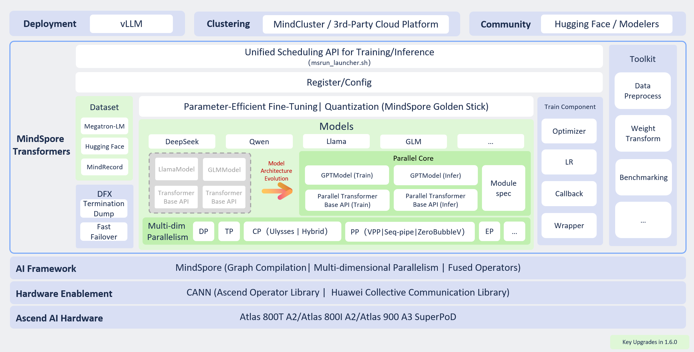

# Overall Structure

## Overview

The overall architecture of MindSpore Transformers is as follows:

MindSpore Transformers supports both Ascend's proprietary technology stack and actively embraces the open-source community. Users may integrate it into their own training and inference platforms or open-source components, as detailed below:

1. Training platforms: [MindCluster](http://hiascend.com/software/mindcluster), third-party platforms
2. Service components: [vLLM](https://www.mindspore.cn/mindformers/docs/en/master/guide/deployment.html)
3. Communities: [Modelers](https://modelers.cn/), [Hugging Face](https://huggingface.co/)

MindSpore Transformers Southbound is based on MindSpore+Ascend's large-scale model technology stack, leveraging the MindSpore framework combined with CANN to optimize Ascend hardware for compatibility, providing a high-performance model training and inference experience.

MindSpore Transformers is primarily divided into the following modules:

1. Unified Training and Inference Scheduling: Provides the launch script `msrun_launcher.sh` to centrally execute and schedule the distributed training and inference processes for all models within the suite.
2. Registration/Configuration Layer: Implements factory-like functionality by interface type, enabling higher-level interface layers to initialise corresponding task interfaces and model interfaces based on configuration.
3. Large Model Library: Offers a high-performance large model repository alongside foundational Transformer interfaces. This supports both user-configured model construction and custom development, catering to diverse development scenarios.
4. Dataset: Encapsulates data loading interfaces for large model training and fine-tuning tasks, supporting Hugging Face datasets, Megatron datasets, and MindSpore's MindRecord datasets.
5. Training Components: Provides foundational interfaces for training workflows, including learning rate strategies, optimisers, training callbacks, and training wrapper interfaces.
6. Utility Layer: Offers data preprocessing tools, Hugging Face weight conversion utilities, and evaluation scripting tools.
7. DFX (Design for X): Implements high-availability features such as fault diagnosis and monitoring, reducing the cost of recovery from training failures.

## Model Architecture

MindSpore Transformers adopted a completely new model architecture after version 1.6.0. The original architecture (labelled Legacy) required separate model code implementations for each model, making maintenance and optimisation challenging. The new architecture (designated as Mcore) employs layered abstraction and modular implementation for large models based on the general Transformer architecture. This encompasses foundational layers such as Linear, Embedding, and Norm, alongside higher-level components including MoELayer, TransformerBlock, and the unified model interface GPTModel (General PreTrained Model). All modular interfaces leverage MindSpore's parallel capabilities for deep parallel optimisation, providing high-performance, ready-to-use interfaces externally. This supports flexible model construction through the ModuleSpec mechanism.

## Training Capabilities

MindSpore Transformer delivers efficient, stable, and user-friendly large-model training capabilities, covering both pre-training and fine-tuning scenarios while balancing performance and ecosystem compatibility. Core capabilities include:

**Multi-dimensional hybrid parallel training**

Supports flexible combinations of multiple parallelization strategies, including data parallelism, model parallelism, optimiser parallelism, pipeline parallelism, sequence parallelism, context parallelism, and MoE expert parallelism, enabling efficient distributed training for large-scale models.

**Support for Mainstream Open-Source Ecosystems**

Pre-training phase: Direct loading of Megatron-LM multi-source hybrid datasets is supported, reducing data migration costs across platforms and frameworks.

Fine-tuning phase: Deep integration with the Hugging Face ecosystem, supporting:

- Utilisation of Hugging Face SFT datasets;
- Data preprocessing via Hugging Face Tokenizer;
- Model instantiation by reading Hugging Face model configurations;
- Loading native Hugging Face Safetensors weights;

Enables efficient, streamlined fine-tuning through zero-code, configuration-driven low-parameter fine-tuning capabilities.

**Model Weight Usability**  

Supports automatic weight partitioning and loading in distributed environments, eliminating the need for manual weight conversion. This significantly reduces debugging complexity during distributed strategy switching and cluster scaling operations, thereby enhancing training agility.

**High Availability Training Assurance**  

Provides training status monitoring, rapid fault recovery, anomaly skipping, and resume-from-breakpoint capabilities. Enhances testability, maintainability, and reliability of training tasks, ensuring stable operation during extended training cycles.

**Low-Threshold Model Migration**

- Encapsulates high-performance foundational interfaces aligned with Megatron-LM design;
- Provides model migration guides and accuracy comparison tutorials;
- Supports Ascend toolchain's Cell-level dump debugging capabilities;
- Enables low-threshold, high-efficiency model migration and construction.

## Inference Capabilities

MindSpore Transformers establishes an inference framework centred on ‘northbound ecosystem integration and southbound deep optimisation’. By leveraging open-source components, it delivers efficient and user-friendly deployment, quantisation, and evaluation capabilities, thereby accelerating the development and application of large-model inference:

**Northbound Ecosystem Integration**

- **Hugging Face Ecosystem Reuse**

  Supports direct loading of Hugging Face open-source model configuration files, weights, and tokenisers, enabling configuration-ready, one-click inference initiation to lower migration and deployment barriers.

- **Integration with vLLM Service Framework**

  Supports integration with the vLLM service framework for service-oriented inference deployment. Supports core features including Continuous Batch, Prefix Cache, and Chunked Prefill, significantly enhancing throughput and resource utilisation.

- **Support for Quantisation Inference**

  Leveraging quantisation algorithms provided by the MindSpore Golden-Stick quantisation suite, Legacy models already support A16W8, A8W8, and A8W4 quantisation inference; Mcore models are expected to support A8W8 and A8W4 quantisation inference in the next release.

- **Support for Open-Source Benchmark Evaluation**

  Utilising the AISbench evaluation suite, models deployed via vLLM can be assessed across over 20 mainstream benchmarks including CEval, GSM8K, and AIME.

**Southbound Deep Optimization**

- **Multi-level Pipeline Operator Dispatch**

  Leveraging MindSpore framework runtime capabilities, operator scheduling is decomposed into three pipeline tasks—InferShape, Resize, and Launch—on the host side. This fully utilises host multi-threading parallelism to enhance operator dispatch efficiency and reduce inference latency.

- Dynamic-static hybrid execution mode

  Default PyNative programming mode combined with JIT compilation compiles models into static computation graphs for accelerated inference. Supports one-click switching to PyNative dynamic graph mode for development and debugging.

- Ascend high-performance operator acceleration

  Supports deployment of inference acceleration and fusion operators provided by ACLNN, ATB, and MindSpore, achieving more efficient inference performance on Ascend platforms.