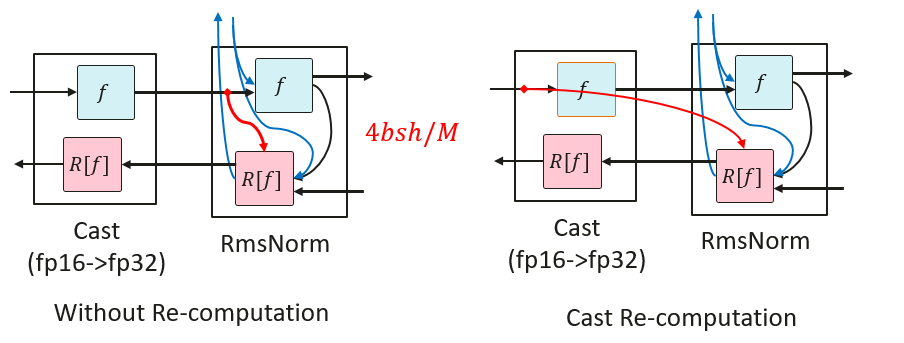
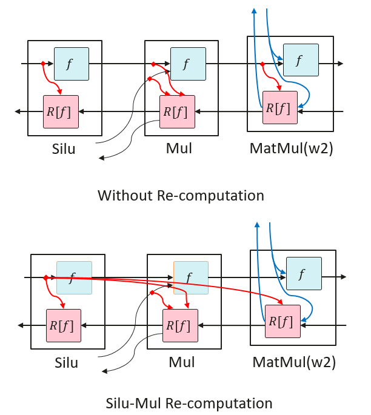
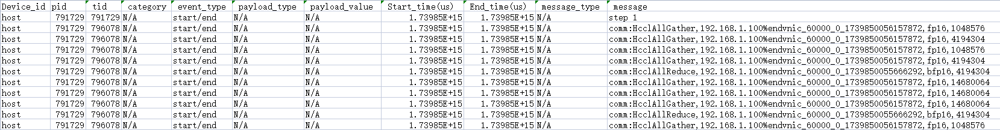
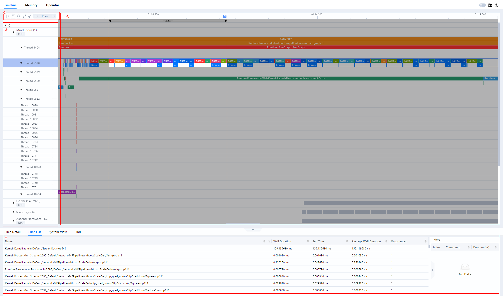
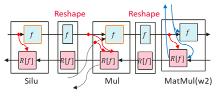

# Large Model Performance Optimization Guide

[](https://gitee.com/mindspore/docs/blob/r2.6.0/docs/mindformers/docs/source_en/perf_optimize/perf_optimize.md)

## Overview

This document introduces the performance tuning of large language models, detailing the basic theoretical knowledge related to performance tuning, guidance on the use of related tools and the overall idea of performance tuning, as well as case sharing. When you start to work on performance tuning of large models, you should have the basic knowledge of large models. In order to avoid dispersion, this document will not explain the basic concepts related to large models, and focus on performance tuning introduction.

Performance generally includes in terms of model training performance, with the time required to complete a single end-to-end training session, given a specified model and input data. End-to-end refers to the process of completing a single-step training of an AI model, and the time is mainly composed of the following components:

* Data loading time: it refers to the time for the model to load the training data and weights, including reading the data from the hardware storage device into the CPU, preprocessing the data in the CPU, and carrying the CPU data to the NPU. For some models that need to be sliced onto several NPUs, the data loading time also includes the time to broadcast from one NPU to other NPUs.

* Model Forward Computation and Backward Computation Time: contains the forward data computation and the reverse data differential derivation.

* Optimizer time: it refers to the model parameter update time.

* Model post-processing time: it refers to after the optimizer is updated, including post-processing of data or necessary synchronization operations, usually depending on model-specific operations.

* Communication time: a broad concept, including the inter-card communication elapsed time for single nodes and the inter-node communication elapsed time for multiple nodes. With the parallelization technique in MindSpore, communication and computation can usually be executed in parallel, at which time part of the communication time is masked, so we generally consider the communication time that is not masked by computation.

* Scheduling time: it refers to the time it takes for the model to go from a CPU instruction to invoking the NPU kernel.

Performance tuning that is, through the optimization of model algorithms, parameters, parallelism strategy and other means to reduce the time of the above parts, generally focusing on the optimization of the model forward-backward time, communication time.

## Introduction

### Performance Indicators

Performance is usually evaluated by throughput. For the large language model, the throughput mainly looks at the number of tokens processed per card per second. The formula is as follows:

$$
Throughput = SeqLength * (sample/s/p)
$$

The result of the calculation of (sample/s/p) can be obtained directly from the log, or the corresponding fields can be obtained separately from the log and then calculated.

The meaning of each field is as follows:

* SeqLength: refers to the length of the sequence, for text processing, we need to convert the input text into a sequence of numbers, and then use these number sequences as input to the model. SeqLength is the length of these number sequences, which is the length of the text. During model training and inference, we need to specify a fixed SeqLength for batch processing and computation. A longer SeqLength improves the accuracy of the model, but increases computation and memory consumption, while a shorter SeqLength reduces computation and memory consumption, but may decrease the accuracy of the model.

* sample: its value is equal to global_batch_size. in distributed training, the data is divided into multiple parts, and each part is sent to a different NPU for computation. The batch size on these NPUs adds up to the global batch size. The choice of global batch size is an important decision because it directly affects the training performance of the model. If the global batch size is too small, the batch size on each NPU may be too small, resulting in slower convergence of the model. If the global batch size is too large, the batch size on each NPU may be too large, resulting in either a lack of NPU memory or a decrease in the accuracy of the model. A good rule to find the optimal Batch Size is to reach the NPU's memory limit for a given data type, i.e., the Batch Size fills up the NPU memory.

* s: i.e., per_step_time in seconds, refers to the time spent on each step in the training process.

* p: i.e., parallel_num, data parallel dimension size.

### Introduction to Parallel Feature

In large model training, due to the increase of data volume and model complexity, the computational capacity of a single computing node is difficult to meet the training demand. In order to improve the training efficiency and accelerate the training process, a parallel strategy is usually used to distribute the computational tasks to multiple computational nodes.

Parallelism strategies are usually classified into various parallel modes:

* Data Parallelism (DP for short)

* Model Parallelism (generally referred to as Tensor Parallelism, TP for short)

* Pipeline Parallelism (PP for short)

* Optimizer Parallelism (OP for short)

* Sequence Parallelism (SP for short)

* Multi-Copy Parallelism

In practice, multiple parallel strategies and multiple optimizations, such as using optimizer parallelism and recomputation, are usually employed to reduce the model's use of memory and improve training efficiency. Parallel strategy design is closely related to the efficiency of the model, and it is crucial to identify one or more sets of better parallel strategies before model tuning.

For details, refer to [Parallel Strategy Guide](https://www.mindspore.cn/mindformers/docs/en/r1.5.0/function/distributed_parallel.html).

For models with different parameter count specifications, the following parallel strategy can be selected:

* When the model size is small (~7B), pure data parallelism + optimizer parallelism can be used, and gradient accumulation can be further turned on if memory is sufficient;
* When the model size is moderate (~13B), pipeline parallelism can be further used and recomputation can be adjusted so that a single card video memory can support the training of the sliced model and reduce the amount of communication introduced;
* When the model size is large, model parallelism should be turned on to reduce the memory consumption of the weights, while short sequence parallelism and multi-copy parallelism are also recommended to be turned on to improve performance;
* When training long sequences (>=32k), long sequence parallelism and correlation features can be used to reduce the memory usage of long sequence activation values.

### Recomputation

MindSpore uses automatic differentiation in backward mode to automatically derive the backward diagram based on the forward diagram computation flow, and the forward and backward diagrams together form a complete computation diagram. When computing some backward operators, the results of some forward operators need to be used, resulting in the need for the results to reside in memory. Until the backward operators that depend on them have been computed, the memory occupied by the results of these forward operators will not be reused. This phenomenon pushes up the memory spikes for training, and is particularly significant in large-scale network models.

To solve this problem, MindSpore provides the ability to recompute the forward operator without saving the results of the forward operator, so that this memory can be reused, and then recompute the forward operator when computing the backward operator, if the forward result is needed.

Re-computation is categorized in the following two ways:

* Full-recomputation

  For extreme environments where memory resources are extremely limited. In this mode, all activation values are recalculated when needed, except for saving the input data, minimizing the dependence on memory. However, the corresponding amount of computation increases significantly.

* Partial-recomputation

  This strategy preserves activation values that take up less memory space but are more expensive to recompute, such as Cast, SiLU-Mul. At the same time, activation recomputation is performed for activation values that occupy a large amount of memory but have relatively low recomputation costs. This method achieves efficient management of memory usage while ensuring model performance.

#### Cast Recomputation

RMSNorm generally uses high-precision (FP32) computation, and the input needs to be converted from low-precision (FP16 or BF16) to high-precision (FP32) via Cast before computation. RMSNorm needs to save the input for reverse computation. Therefore, recomputing Cast here only saves the low-precision input of Cast instead of the high-precision input of RMSNorm, a move that reduces the memory usage of that input by half, resulting in memory savings.



Performing recomputation from high precision to low precision Cast operator will result in the later operators originally only need to store the low precision memory after Cast, and after the Cast operator recomputation, they need to store the high precision memory, which will result in larger memory usage instead.

#### SiLU-Mul Recomputation

In FeedForward, the middle part of the memory tends to be large. SiLU and Mul recomputation is less costly, so recomputing the SiLU and Mul operators saves memory for the first inputs of MatMul and Mul of w2.



### Tools Introduction

#### profiler Tool

MindSpore Transformers itself integrates profiling data collection with the following steps:

1. Modify the configuration files

   Turn on the profiling switch in the model configuration file with the following parameters to be changed:

   ```yaml
   profile: True                  # Whether to enable performance analysis tools
   profile_start_step: 5          # Step that starts performance analysis
   profile_stop_step: 6           # Step that ends performance analysis
   init_start_profile: False      # Enabled when Profiler is initialized, profile_start_step will not take effect after it is enabled.
   profile_communication: False   # Whether to collect communication performance data in multi-NPU training
   profile_memory: True           # Collect Tensor memory data
   mstx: True                     # Whether to enable mstx timestamp recording.
   ```

   `profile_start_step` and `profile_stop_step` determine the collection interval, because the collection takes a long time. It is not recommended to set the interval too large, and it should be set to 2 to 4 steps. Since the first step involves compilation, it is recommended to start collecting from step 3.

   The parameters of profiling configuration are shown as below:

   | Parameters            | Descriptions                                                                                                                                                                                                                            | Types |
   |-----------------------|-----------------------------------------------------------------------------------------------------------------------------------------------------------------------------------------------------------------------------------------|-------|
   | profile               | Whether to enable the performance capture tool. Default: `False`.                                                                                                                                                                       | bool  |
   | profile_start_step    | Set the number of steps to start collecting performance data. Default: `1`.                                                                                                                                                             | int   |
   | profile_stop_step     | Set the number of steps to stop collecting performance data. Default: `10`.                                                                                                                                                             | int   |
   | profile_communication | Set whether communication performance data is collected in multi-device training, this parameter is invalid when using single card training. Default: `False`.                                                                          | bool  |
   | profile_memory        | Set whether to collect Tensor memory data. Default: `True`.                                                                                                                                                                             | bool  |
   | profile_rank_ids      | Specify rank ids to enable collecting performance data. Defaults to `None`, which means all rank ids are enabled.                                                                                                                       | list  |
   | profile_pipeline      | Set whether to enable collecting performance data on one card of each parallel stage. Default: `False`.                                                                                                                                 | bool  |
   | profile_output        | Set the directory of saving performance data.                                                                                                                                                                                           | str   |
   | profile_level         | Set the collection level. Should be one of (0, 1, 2). Default: `1`.                                                                                                                                                                     | int   |
   | with_stack            | Set whether to collect Python-side stack trace data. Default: `False`.                                                                                                                                                                  | bool  |
   | data_simplification   | Set whether to enable data simplification, which will delete the FRAMEWORK directory and other extraneous data after exporting performance data. Default: `False`.                                                                      | int   |
   | init_start_profile    | Set whether to turn on collecting performance data when the Profiler is initialized; this parameter does not take effect when `profile_start_step` is set. This parameter needs to be set to `True` when `profile_memory` is turned on. | bool  |
   | mstx                  | Set whether to enable mstx timestamp recording, including training step, HCCL-operators and etc. Default: `False`.                                                                                                                      | bool  |

2. View Data

   By default, the collection tool creates a `profile` folder under the `./output` path, which can be set via the `profile_output` or `output_dir` field of the model's yaml configuration file, and the former has higher priority.

   The generated file and its introduction refer to [Introduction to profile file](https://www.mindspore.cn/tutorials/en/r2.6.0/debug/profiler.html), which mainly collects information such as running time of operators and tasks, CPU utilization and memory consumption for performance tuning analysis.

   In addition, it can also analyze the performance between different ranks in the cluster by counting the computation time, communication time, and unmasked communication time of each rank in the cluster, so as to determine whether there exists an unbalanced computation load, which affects the overall efficiency of the cluster, and carry out targeted optimization.

3. View mstx timestamp

   The collection tool does not generate files of mstx information directly, so it need to be extract from `profile` folder manually via command line. Taking the first device for example, the corresponding directory structure is shown below:

   ```sh
   output
   └── profile
       └── rank_0
           └── {hostname}_{pid}_{timestamp}_ascend_ms
               └── PROF_{number}_{timestamp}_{string}
   ```

   Execute the command below:

   ```shell
   msprof --export=on --output={path}/output/profile/rank_0/{hostname}_{pid}_{timestamp}_ascend_ms/PROF_{number}_{timestamp}_{string} # replace with the real path
   ```

   A `mindstudio_profiler_output` folder will be generated under PROF_{number}_{timestamp}_{string} directory after command is over, and the file named `msprof_tx_{timestamp}.csv` records mstx information, containing timestamp and description of training steps, HCCL-operators, etc., as shown in the figure below:

   

#### DryRun Memory Evaluation Tools

Current memory evaluation tools mainly use MindSpore dryrun. The simulated compilation is described in MindSpore [Environment Variables Documentation](https://www.mindspore.cn/docs/en/r2.6.0/api_python/env_var_list.html) and [msrun Documentation](https://www.mindspore.cn/tutorials/en/r2.6.0/parallel/msrun_launcher.html). The training process for simulation compilation can be pulled up by enabling the environment variable `export MS_SIMULATION_LEVEL=1` before the training process starts or by configuring the `-sim_level` function in the msrun startup item.

DryRun can be used to analyze whether the required memory exceeds the maximum available memory. If it exceeds, the configuration needs to be readjusted. The maximum available memory can be configured using the following fields, the recommended value is `58GB`. If it is set too large, it may cause other components to run out of memory. Typically the larger the cluster training size used, the larger the memory usage of the other components, and the lower the maximum memory available to the MindSpore process. For example on a thousand card cluster, this maximum available memory value is typically set to `54GB`.

```yaml
context:
  max_device_memory: "58GB"
```

Create a new script `dry_run.sh` with the following contents:

```shell
#!/bin/bash

YAML_FILE=$1
RANK_SIZE=$2
PIPELINE_STAGES=$3
RANK_GAP=$((RANK_SIZE/PIPELINE_STAGES))
ROOT_PATH=`pwd`

export MS_SIMULATION_LEVEL=1
export RANK_SIZE=$RANK_SIZE

rm -rf output_dryrun
mkdir output_dryrun
for((i=0; i<$PIPELINE_STAGES; i++))
do
    export DEVICE_ID=$i
    export RANK_ID=$((i*RANK_GAP))
    echo "start training for rank $RANK_ID, device $DEVICE_ID"
    # The run_mindformer.py path needs to be specified correctly
    python ./run_mindformer.py --config $ROOT_PATH/$1 &> ./output_dryrun/rank_$RANK_ID.log &
done
```

Execute the script:

```shell
bash dry_run.sh $train.yaml $rank_size $stage
```

The meanings of the three parameters are as follows:

* $train.yaml: configuration file to be debugged
* $rank_size: number of simulation cards
* $stage: number of stages, equal to the number of pipeline parallels

After execution is complete, log messages for each stage are generated in the output directory `output_dryrun`, and the following message is printed at the end of each log:

```text
Device MOC memory size: 62432M
MindSpore Used memory size: 59392M
MindSpore memory base address: 0
Used peak memory usage (without fragments): 48874M
Actual peak memory usage (with fragments): 48874M
```

Used peak memory usage (without fragments): Indicates peak NPU memory usage without fragmentation, focus on this value and recommend not exceeding the maximum available memory.

Actual peak memory usage (with fragments): Indicates peak NPU memory usage with fragmentation.

Notes:

1. When using `dryrun` to simulate compilation, if the dataset is too large, it will lead to a long run time, so you need to control the dataset size, just run through a few steps;
2. In the pipeline parallel scenario, each PP stage requires different memory during the training process, so at least one rank is needed for each stage for dryrun. In other words, the memory situation of all the ranks within the same PP stage is exactly the same, and the overall memory situation can be analyzed by running the simulation compilation of only one rank;
3. The `dryrun` task also generates distributed policy files. Starting the `dryrun` task generates the policy files for each PP stage. Since the distributed policy files for the same stage are exactly the same, you only need to get one policy file per PP stage;
4. The size of memory consumed by the current task will be printed in the log at the end of the run. Memory usage can be evaluated based on this information for memory tuning.

#### MindStudio Insight

MindStudio Insight provides multiple presentations of performance data, including visual presentations of Timeline views, communication analysis, computational elapsed time, so that users can analyze potential performance bottlenecks and provide guidance on how to take steps to eliminate or reduce them. MindStudio Insight supports viewing data exported by Profiling in Timeline View for cluster scenarios and displaying it in a single-card dimension, and can support cluster performance file analysis of more than 20GB.

Click [MindStudio Insight download link](https://www.hiascend.com/developer/download/community/result?module=pt+sto+cann) and select the appropriate version to install.

Open MindStudio Insight, click the "+" in the toolbar at the top left of the interface, select the file or directory to be parsed and exported in the pop-up window, and then click “Confirm” to import.

MindStudio Insight tool presents the full process of online inference, training process in the form of a Timeline, and in accordance with the scheduling process to present the overall operating conditions, and the tool supports cluster Timeline display. By analyzing the timeline, users can analyze the online inference/training process at a fine-grained level, such as whether the iteration gap is too long, operator execution time, and provide easy-to-use features to assist users to quickly locate performance bottlenecks.

The Timeline interface consists of four parts: the toolbar (Area I), the timeline tree (Area II), the graphical pane (Area III), and the data pane (Area IV), as shown in the figure.



* Area I

  The toolbar, which contains frequently used buttons, from left to right, is Marker List, Filter (supports filtering the display by card or by special layer), Search, Link Events, Recovery, Timeline Zoom Out and Timeline Zoom In.

* Area II

  Timeline tree diagram showing the hierarchical information of each “Card” in the cluster scenario, with “Card” at the first level, process or specialization hierarchies at the second level, and threads at the third level. This includes upper application data (containing elapsed time information of upper application arithmetic), CANN layer data (containing elapsed time data of AscendCL, GE, and Runtime components), underlying NPU data (containing elapsed time data and iteration trajectory data of each Stream task flow under Ascend Hardware, HCCL and Overlap Analysis communication data, and other Rise AI processor system data), hitpoint data, and the AI Core Freq hierarchy.

* Area III

  The graphical pane, which displays data within an iteration, corresponds to a timeline tree diagram, which provides a row-by-row graphical presentation of the timeline, including the execution sequence and execution duration of the upper-level application operators, components and interfaces.

* Area IV

  Data pane, statistical information or operator detail information display area, Slice Detail for detailed information on selected individual operators, Slice List for a list of operators in the selected area of a lane, and System View for a summary of operators in a category.

Click anywhere on the timeline page tree or graphical pane can be performed using the W (zoom in), A (move left), S (zoom out), and D (move right) keys in the keyboard, which support zooming in with a maximum precision of 1ns. This tool can provide overview, memory, arithmetic, communication and other dimensions of analysis to assist in performance tuning. Refer to [MindStudio Insight User Guide](https://www.hiascend.com/document/detail/zh/mindstudio/70RC3/msinsightug/msascendinsightug/Insight_userguide_0002.html) for detailed usage.

#### IR Graph

In the [MindSpore Transformers configuration file](https://www.mindspore.cn/mindformers/docs/en/r1.5.0/appendix/conf_files.html), just turn on save_graphs, and the runtime will output some intermediate files ending with the .ir suffix generated during the graph compilation process, which we call IR files. By default, a directory of graphs will be generated in the current task execution directory, and all IR graphs will be saved in this. It is a relatively intuitive and easy to understand document describing the structure of the model in text format, which can be viewed directly with text editing software. Refer to [Config Configuration Description](https://www.mindspore.cn/mindformers/docs/en/r1.5.0/appendix/conf_files.html) for the meaning of the configuration items, and the configuration method is as follows:

```yaml
context:
  save_graphs: True
  save_graphs_path: "./graph"
```

An excerpt of some of the IR graph:

```text
  %13(equiv_180_CNode_16165) = Load(%para6_model.layers.0.attention.wq.weight, UMonad[U]) cnode_attrs: {checkpoint: Bool(1)} cnode_primal_attrs: {unique_id: "782039"}
      : (<Ref[Tensor[Float16]], (512, 4096), ref_key=model.layers.0.attention.wq.weight>, <UMonad, NoShape>) -> (<Tensor[Float16], (512, 4096)>)
      # Fullname with scope: (Default/network-MFPipelineWithLossScaleCell/network-_VirtualDatasetCell/_backbone-GradAccumulationCell/network-LlamaForCausalLM/model-LlamaModel/layers-CellList/0-LLamaDecodeLayer/attention-LLamaAttention/Load-op0)
  %14(equiv_16877_x) = PrimFunc_MatMul(%12, %13, Bool(0), Bool(1)) {instance name: matmul} primitive_attrs: {in_strategy: ((1, 1), (8, 1))} cnode_attrs: {checkpoint: Bool(1)} cnode_primal_attrs: {unique_id: "782146", origin_output_shape: (4096, 4096), micro: I64(0), origin_input_shapes: ((4096, 4096), (4096, 4096))} {in_strategy: ((1, 1), (8, 1))}
      : (<Tensor[Float16], (4096, 4096)>, <Tensor[Float16], (512, 4096)>, <Bool, NoShape>, <Bool, NoShape>) -> (<Tensor[Float16], (4096, 512)>)
      # Fullname with scope: (Default/network-MFPipelineWithLossScaleCell/network-_VirtualDatasetCell/_backbone-GradAccumulationCell/network-LlamaForCausalLM/model-LlamaModel/layers-CellList/0-LLamaDecodeLayer/attention-LLamaAttention/wq-Linear/MatMul-op0)
  %15(equiv_16876_CNode_30913) = PrimFunc_Reshape(%14, (I64(1), I64(4096), I64(4), I64(128))) {instance name: reshape} cnode_attrs: {checkpoint: Bool(1)} cnode_primal_attrs: {unique_id: "817859", forward_comm_node_unique_id: "729440", micro: I64(0)}
      : (<Tensor[Float16], (4096, 512)>, <Tuple[Int64*4], TupleShape(NoShape, NoShape, NoShape, NoShape), elements_use_flags={[const vector]{1, 1, 1, 1}}>) -> (<Tensor[Float16], (1, 4096, 4, 128)>)
      # Fullname with scope: (Default/network-MFPipelineWithLossScaleCell/network-_VirtualDatasetCell/_backbone-GradAccumulationCell/network-LlamaForCausalLM/model-LlamaModel/layers-CellList/0-LLamaDecodeLayer/attention-LLamaAttention/Reshape-op0)
  %16(equiv_16875_query) = PrimFunc_Transpose(%15, (I64(0), I64(2), I64(1), I64(3))) {instance name: transpose} primitive_attrs: {in_strategy: ((1, 1, 8, 1))} cnode_attrs: {checkpoint: Bool(1)} cnode_primal_attrs: {unique_id: "782042", micro: I64(0)} {in_strategy: ((1, 1, 8, 1))}
      : (<Tensor[Float16], (1, 4096, 4, 128)>, <Tuple[Int64*4], TupleShape(NoShape, NoShape, NoShape, NoShape), elements_use_flags={[const vector]{1, 1, 1, 1}}>) -> (<Tensor[Float16], (1, 4, 4096, 128)>)
      # Fullname with scope: (Default/network-MFPipelineWithLossScaleCell/network-_VirtualDatasetCell/_backbone-GradAccumulationCell/network-LlamaForCausalLM/model-LlamaModel/layers-CellList/0-LLamaDecodeLayer/attention-LLamaAttention/Transpose-op0)
```

`%XX` indicates the step, followed by the name of the operator, and the parentheses contain the inputs and outputs, while Fullname with scope contains the completed class, method name, and so on.

* `%13`

  This step loads wq.weight directly and gets <Tensor[Float16], (512, 4096)>.

* `%14`

  MatMul with the previous %12 output and the %13 output above to get <Tensor[Float16], (4096, 512)>.

* `%15`

  Reshape with the 14% output above to get <Tensor[Float16], (1, 4096, 4, 128)>.

* `%16`

  Transpose with the 15% output above to get <Tensor[Float16], (1, 4, 4096, 128)>.

It is recommended to change the number of layers of the model to a smaller size when saving IR graph, to reduce the time of compiling and saving graph, and to facilitate fast debugging. For details, please refer to [Introduction to IR file](https://www.mindspore.cn/tutorials/en/r2.6.0/debug/error_analysis/mindir.html#ir-introduction) and [Analysis samples](https://www.mindspore.cn/tutorials/en/r2.6.0/debug/error_analysis/mindir.html#how-to-derive-the-cause-of-the-failure-based-on-the-analyze-fail-ir-file-analysis-graph).

#### SAPP Automatic Load Balancing Tool

Large model training performance tuning requires simultaneous consideration of multi-dimensional hybrid parallel strategy configurations and memory constraints, and engineers need to try different combinations of schemes on the cluster to find a parallel strategy that achieves the required performance, and the process often takes weeks and consumes a lot of arithmetic costs.

MindSpore provides SAPP (Symbolic Automatic Parallel Planner) automatic load balancing tool. Inputting the model memory and time information, as well as some of the pipeline parallel performance-related hyper-references (e.g., the impact of recomputation on performance), the tool will construct the linear programming problem by itself, through the global solution, automatically generate stage-layer ratios in the pipeline parallel for the large model, adjust the recalculation strategy of each layer, automatically optimize the cluster arithmetic power and memory utilization, reduce the idle waiting time, realize the Pipeline parallel minute-level strategy optimization, greatly reduce the performance tuning cost, and significantly improve the end-to-end training performance.

For detailed usage, please refer to [SAPP Pipelined Load Balancing](https://gitee.com/mindspore/mindformers/tree/r1.5.0/toolkit/pipeline_balance) tool introduction.

## Overall Concept

The performance optimization method for large models mainly relies on profiling data analysis as well as memory analysis to analyze the current performance bottlenecks and make targeted optimization actions, then verify the performance gains and analyze further optimization directions. The overall tuning process is as follows:

1. Analyze the profiling data to see if there are operators with significantly abnormally high time consumption, if so, try to replace the equivalent operator and submit the time consumption information of the abnormal operator to issue for feedback;
2. Analyze the communication time consumption to see if there exists a more optimal distributed strategy, look at the IR graph to analyze if there exists an unreasonable rearranging problem, and solve these problems affecting the communication efficiency in order to improve the training efficiency of the whole cluster;
3. Analyze memory usage to see if there is an abnormally large memory Tensor, whether there is a fusible operator to reduce the activation value memory. In the case of sufficient memory, the configuration strategy of recomputation can be adjusted to select, the use of spare memory in exchange for training performance, or reduce the number of copies of the model slices to reduce the communication overhead brought by the model slices to improve performance.

Performance optimization is a cyclic process, after the performance of the operator is not obviously abnormal, we can test and analyze the distributed strategy to optimize the abnormal communication time and rearranging overhead; then we can optimize and analyze the memory to eliminate the abnormal large memory Tensor; after completing the memory optimization, we need to further check whether the free memory supports to re-adjust the parallel strategy settings to get the strategy with smaller communication overhead and make full use of the memory in exchange for better performance. This cycle of optimization leads to a step-by-step achievement of the set performance goals.

After completing a round of performance optimization, it is also necessary to ensure that the model accuracy is aligned, and apply this optimization strategy if it is aligned.

## Bottleneck Analysis and Optimization

After clarifying the overall tuning idea, we can analyze the performance bottlenecks of the training model through performance analysis tools and memory evaluation tools, and apply optimization measures to the bottlenecks, verify the benefits, and analyze new bottlenecks for further optimization, so as to approach the optimal solution of the model training performance step by step. The following is a list of common performance bottlenecks and the corresponding optimization measures available.

### Memory Bottleneck

Memory bottleneck is the first problem that needs to be solved in large model training scenarios; with the expansion of model size, the memory resources required for training large models also rise, and the memory capacity provided by a single card is limited, so it is necessary to solve the problem of insufficient memory by combining recomputation, optimizer parallelism, and other means through the distributed parallelism strategy, and slicing the resources required for model training on a multi-card cluster.

Optimizations for memory bottleneck scenarios are listed below:

* **Model Parallel(MP)/Tensor Parallel(TP)**:
    * Applicable scenarios: large number of model parameters, need to reduce the weight of a large number of memory-consuming scenarios;
    * Benefits: the most reduction in memory usage is achieved by using multiple cards to slice the model weights;
    * Overhead: use more hardware resources and introduce a lot of communication overhead;
    * Usage recommendation: it is recommended to use it on models with more than 20B parameters and limited to 8 to avoid generating cross-machine communication overhead.
* **pipeline Parallel(PP)**:
    * Applicable scenarios: Scenarios where static memory can't fit in model weights, optimizer state, etc;
    * Benefits: The communication overhead is much smaller than MP using the multi-card slice modeling phase;
    * Overhead: Introduces computational bubble (bubble), and a smaller inter-stage communication overhead;
    * Usage recommendation: Any scenario where the weights need to be sliced can be attempted to use it and reduce bubble performance loss through hyperparameter tuning.
* **Long Sequence Parallel(CP)**:
    * Applicable scenarios: Training long sequence tasks (>=32k) with high activation value scenarios;
    * Benefits: Long sequence training scenarios apportion activation value overheads, making it possible to expand long sequence capabilities by expanding machine resources;
    * Overhead: Introduce communication overhead.

All the above three parallel strategies use more computing devices to share memory consumption to solve the memory bottleneck problem. The cost is that it requires more hardware resources and introduces additional communication, and the training throughput is not as good as data-parallel training on a cluster of the same size.

* **Optimizer Parallel**:
    * Applicable scenarios: In scenarios with data-parallel DP, the model weights and optimizer states are sliced to each card in the DP domain, dramatically reducing video memory consumption;
    * Benefits: Model weights and optimizer states are sliced within the DP domain, saving significant memory usage;
    * Overhead: The calculation introduces a certain amount of communication to accomplish weight aggregation;
    * Usage recommendation: Turning it on is recommended in most cases, and the saved video memory can be used to adjust the parallel slicing strategy to improve performance overall.
* **[Full Recomputation & Selective Recomputation](#recomputation)**:
    * Applicable scenarios: After the slicing strategy is determined, the memory usage is still partially exceeded, the full recomputation & selective recomputation strategies can be adjusted to further optimize the memory usage;
    * Benefits: Save memory usage;
    * Overhead: The computation time grows further;
    * Usage recommendation: Prioritize the use of selective recomputation and control the computational overhead from recomputation as much as possible when not exceeding memory usage.
* **Short Sequence Parallel**:
    * Applicable scenarios: Under MP slicing, short sequence parallelism is enabled, and the sequence dimension is sliced by MP at LayerNorm, with the communication volume remaining unchanged, reducing the activation value memory and the Norm part of the computation;
    * Benefits: Save memory usage and computation time without increasing communication and requiring additional card count resources;
    * Usage recommendation: It is recommended to turn it on in all MP scenarios.

### Computing Length Bottleneck

Under normal cases, the computation time should be mainly focused on computation-intensive operators such as matmul, flash attention, etc. If the computation operators with abnormal time consuming are found to cause performance bottlenecks in profiling analysis, we can try to replace the equivalent operators, and synchronize the submission of operator performance issue to MindSpore Transformers or MindSpore.

At the model tuning level, the following methods can be tried to solve the problem of alleviating the computational length bottleneck:

* **Fusion Operator Replacement**:
    * The use of fusion operators equivalently replaces partial combinations of operators, and fusion operators typically result in performance and memory gains.
* **Recomputation & Selective Recomputation**:
    * Involving a balanced trade-off between time and space, reducing the number of recomputation layers can effectively utilize free memory to improve computational performance when free memory is available.

### Unmasked Communication Bottleneck

The communication time share of the training process can be obtained through the profiling tool, which includes masked and unmasked communication. Masked communication and computation are executed at the same time, which does not affect the training efficiency, while unmasked communication causes computation to wait for the communication, which is too time-consuming and will affect the training performance, and needs to be optimized.

* **IR Graphs Analyze Redundant Communication Operators**:
  Analyze the distribution of communication operators during the model forward process by configuring the environment variable `export MS_DEV_SAVE_GRAPHS=1`, saving the training IR graph, and seeing if it meets expectations;
  If there is a sequence of communication operators at unreasonable locations, it is likely that the operator slicing strategy configured in the model is incorrect, resulting in triggering tensor rearrangement, and the framework automatically inserts a larger number of communication operators to ensure computational equivalence;
  This part of the redundant communication introduced due to communication rearrangement is likely to lead to the emergence of a large number of unmasked communications, resulting in a performance bottleneck, the solution is to modify the shard policy of the corresponding location operator to configure correctly, to solve the problem of communication rearrangement.
* **Multi-copy & Fine-grained Multi-copy Parallel**:
  After analyzing and solving the communication rearrangement problem, if there are still a high number of unmasked communications, try using a multicopy or fine-grained multicopy parallel strategy;
  In model parallel scenarios, enabling multicopy or fine-grained multicopy parallel, communication time and computation time can be partially masked from each other, thus reducing communication bottlenecks.

### IO Bottleneck

IO efficiency can be a performance bottleneck for model training only under certain circumstances, i.e., the time it takes for IO to read the training data required for a step is greater than the time it takes to reverse all computational communication before completing a step. Since the data reading process is asynchronous with the training process, as long as the IO speed is greater than the training speed, each time the next step of training can ensure that the training data is ready, the IO will not block the training process; on the contrary, when the IO speed is greater than the training speed, each time the next step of training, we need to wait for the training data to be ready. This part of the blocking time is counted in the overall time of training, which becomes a performance bottleneck.

This kind of IO bottleneck usually occurs in the scenario of shared storage of large clusters, where multiple training processes of large clusters jointly access the same shared storage, resulting in the rise of IO pressure and the reduction of efficiency. The IO bottleneck is manifested in Profiling as on the timeline, there is a large data read gap between each step, during which the computation is idle.

The idea of solving IO bottlenecks is to optimize the amount of IO and IO behavior.

**full_batch=false**:

full_batch is a control item for the data aggregation behavior of MindSpore. When configured to true, each card takes the global batch size amount of data, and then completes the slicing of the data within the graph, taking only the required data in the corresponding DP domain for training. This approach leads to steep pressure on IO in large-scale clusters, where there is DP-fold redundancy in the amount of IO read by each card, which occurs on each card and aggregates to overstress the shared storage, affecting IO performance. It is recommended to change the behavior mode to full_batch=false when encountering IO bottlenecks, which has been verified to be able to optimize the IO efficiency in a more obvious way, and the configuration mode can be referred to MindSpore[set_auto_parallel_context interface](https://www.mindspore.cn/docs/en/r2.6.0/api_python/mindspore/mindspore.set_auto_parallel_context.html#mindspore.set_auto_parallel_context). yaml example is listed below:

```yaml
#yaml file configuration
parallel:             # In parallel module
  ...
  full_batch: False   # Set full batch to False
  dataset_strategy: [[dp, 1], [dp, 1]] # dp replaced with actual dp configuration number
  ...
```

Among them, two [dp, 1] in `dataset_strategy` array correspond to [bs, seq_len] dimensions of two inputs, and need to be configured according to the number of inputs of the dataset and the actual situation of the shape, the dp cut corresponds to the bs dimension.

You can also optimize the amount of IO by starting with the dataset, which should minimize the space complexity, e.g., input items like `attention_mask`, which has a space complexity of O(N^2), are less suitable to be dropped directly into storage. This can be done by reading other relevant information with less spatial complexity and utilizing the cpu to generate it during the process of reading data by the training process in order to reduce the amount of IO accesses and speed up the data reading overall.

### Too Many Bubbles in the pp Scenario

The main overhead in the pipeline scenario is the introduction of computational idleness (bubble), which is roughly estimated as $bubble\ ratio=\frac{p-1}{m+p-1}$, where $p$ is the number of pipeline stages and $m$ is the set micro batch num.

In order to reduce the bubble idle, we can start from the formula, in the case of a fixed number of stage, we can increase the micro batch num, so that the overall percentage of bubble is reduced, which can effectively improve the training efficiency.

However, in some training scenarios, global batch size is a more critical training hyperparameter, which may not be able to be adjusted arbitrarily. In this case, we can try to optimize the bubble ratio by using the pp interleave feature.

**Pipeline Interleaving**:

pipeline_interleave(virtual pipeline) official website configuration description:[set_auto_parallel_context](https://www.mindspore.cn/docs/en/r2.6.0/api_python/mindspore/mindspore.set_auto_parallel_context.html?highlight=pipeline_interleave).

In MindSpore Transformers, turning on multi-stream interleaving needs to be configured in parallel, e.g. using 1f1b scheduling:

```yaml
parallel:
  ...
  pipeline_config:
    pipeline_interleave: True
    pipeline_scheduler: '1f1b'
  ...
```

After that, configure pp_interleave_num in model_config, e.g. configure it to 2 as per the following yaml:

```yaml
model:
  model_config:
    ...
    pp_interleave_num: 2
    ...
```

Benefits: The formula for the bubble share in the pp interleave scenario is $bubble\ ratio=\frac{p-1}{vm+p-1}$, where $v$ is the configured pp_interleave_num, and it can be found from the formula that increasing $v$ also achieves the effect of reducing the bubble share.

Overhead: The pp interleave algorithm theoretically uses more memory, a space-for-time strategy, and its use requires readjustment of the memory usage strategy according to memory changes.

### Load Balance Policy Tuning

In distributed training, the pipeline parallel strategy involves the phenomenon of load unevenness among different cards.

Under pipeline parallelism, because the model is sliced into stages by layer, the first and last stages design modules outside the layer to realize, such as embedding, head, loss calculation and other modules, so that the computation time of the first and last stages is higher than that of the middle stage, which is the load imbalance in time. And due to the pipeline flow execution before the reverse characteristics that the earliest execution stage, the latest all the memory release, the memory consumption of different stages is different. The more front stage consumes more memory, which is spatial imbalance.

In this case you can manually adjust the number of load layers between individual stages by configuring the model layer offset offset.

For example, in the scenario where PP stage is 4 and the first stage consumes too much memory, you can set `offset:[-2, 1, 1, 0]` to put the two layers of load from stage 0 on stage 1 and stage 2 respectively, which reduces the space consumption of the first stage, and at the same time, the computational load is shifted from the limitation of first and last stages to the extra layer on the middle stage, which also does not reduce the computational efficiency too much.

Try not to allocate too many layers on a stage, otherwise it will form a short-board stage of computational efficiency and slow down the whole training process. A more fine-grained load balance adjustment can be made in conjunction with the utilization of memory space by recomputation.

It is recommended to try using the [Automatic Load Tool](#sapp-automatic-load-balancing-tool) to get an optimal load balancing policy configuration.

## Typical Case

### Silu-Mul Recomputation Not in Effect

Performing recomputation on Silu and Mul saves memory when fine-grained multicopy is on, but doing recomputation on Silu and Mul does not save memory when fine-grained multicopy is off. The localization process is as follows:

1. Confirmation that recomputation is configured

   Check if the Cast, Silu and Mul operators have the label "recompute: Bool(1)" in the IR graph. If they do, it means that the operators are equipped with recompute.

2. Checking for recomputation operators

   Check if the Cast, Silu and Mul operators have the label duplicated in IR graphs. The absence of labeled operators indicates that the actual computational graph does not recompute this part of the operator. Only Cast operator is with duplicated label in the following example.

   ```text
   %1834(CNode_108839) = PrimFunc_Cast(%1833, I64(43)) {instance name: cast} primitive_attrs: {output_names: [output], input_names: [x, dst_type], recompute: Bool(1)} cnode_attrs: {recompute_sub_graph: U64(64), recompute_id: I64(65), duplicated: Bool(1), need_cse_after_recompute: Bool(1)} cnode_primal_attrs: {micro: I64(0)}
       : (<Tensor[Float16], (1, 4096, 4096)>, <Int64, NoShape>) -> (<Tensor[Float32], (1, 4096, 4096)>)
   ```

3. Checking the reverse calculation input

   The inputs to the reverse operators of Silu and Mul are checked in the IR diagram to see if they are as expected, and there are Reshape operators between Silu and Mul, and between Mul and MatMul when fine-grained multicopy is off, and Silu, Mul, and MatMul are connected when fine-grained multicopy is on. The process is as follows:



It can be seen that the cause is that the input shape of Linear in the fine-grained multicopy scenario is two-dimensional, while the input shape of Linear in the non-fine-grained multicopy scenario is three-dimensional, so a Reshape operator between Linear and Mul, and the lack of Reshape recalculation results in recalculation of Silu being optimized. The additional recalculation of the Reshape results in a normal memory reduction. The reference configuration is as follows:

```yaml
recompute_config:
  recompute: False
  select_recompute: ['feed_forward\.mul', 'feed_forward\.w1\.activation', 'feed_forward\.w1\.reshape', 'feed_forward\.w2\.reshape']
```

### Llama2-13B Extreme Performance Optimization

13B defaults to a single DP: 8, MP: 1, PP: 1 with full recalculation on, with performance around 1860tokens/s/p and 40% MFU, which is significantly lower compared to the 7B (53% MFU) & 70B (47% MFU).

After analyzing, 13B performance bottleneck mainly lies in memory, whether single or multi-computer, if you don't slice MP, you need to turn on full recalculation, and doing selective recalculation for Silu and Mul memory is still not enough; full recalculation will be an additional 20% to 25% more computation, resulting in low performance; MP slices can be turned off the recalculation, but the performance is a little lower than the pure DP.

Adjusting the sharding strategy to DP: 8, MP: 1, PP: 2, micro: 128 with dual machines and full recomputation on improves performance to 2136tokens/s/p. Changing the full recomputation to selective recomputation and fine selecting the operators to minimize the amount of memory at each layer improves performance to 2189tokens/s/p.

```yaml
select_recompute: ['feed_forward\.mul', 'feed_forward\.w1\.activation', 'feed_forward\.w1\.reshape', 'feed_forward\.w1\.matmul', 'feed_forward\.w3\.matmul', 'feed_forward\.W3\.reshape', 'feed_forward\.w2\.matmul', 'feed_forward\.w2\.reshape', 'ffn_norm\.norm', 'ffn_norm\.rcast', 'attention_norm\.norm', 'attention_norm\.rcast', 'attention\.wq\.reshape', 'attention\.wk\.reshape', 'attention\.wv\.reshape', 'attention\.wo\.matmul', 'attention\.wo\.reshape', 'attention\.merger_head_transpose', 'add', 'attention\.flash attention']
```

Adjusting the number of recomputation layers for different stages results in less recomputation for stage1 and performance improvement to 2210tokens/s/p.

```yaml
select_recompute:
  'feed_forward\.mul': [20, 8]
  'feed_forward\.w1\.activation': [20, 8]
  'feed_forward\.w1\.matmul': [20, 0]
  'feed_forward\.w1\.reshape': [20, 8]
  'feed_forward\.w3\.matmul': [20, 0]
  'feed_forward\.w3\.reshape': [20, 0]
  'feed_forward\.w2\.matmul': [20, 0]
  'feed_forward\.w2\.reshape': [20, 0]
  'ffn_norm\.norm': [20, 0]
  'ffn_norm\.rcast': [20, 0]
  'attention_norm\.norm': [20, 0]
  'attention_normi.rcast': [20, 0]
  'attention\.wq\.reshape': [20, 0]e
  'attention\.wk\.reshape': [20, 0]e
  'attention\.w\.reshape': [20, 0]e
  'attention\.wol.matmul': [20, 0]
  'attention\.wo\.reshape': [20, 0]e
  'attention\.merger head transpose': [20, 0]
  'add': [20, 0]
  'attention\.flash_attention': [20, 0]
```

Using graph compilation level of O0/O1 graph kernel fusion, there are further optimizations in memory, changing the selective recomputation of most of the operators to full recomputation of some layers, and configuring selective recomputation of Silu and Mul for the rest of the layers. The number of fully-recomputed layers in stage0 and stage1 is 13 and 5 respectively, and the performance improves to 2,353tokens/s/p. Gradually the number of fully-recomputed layers in stage0 and stage1 are 4 and 0 respectively, and the performance is improved to 2562tokens/s/p (max_device_memory: 57.2GB). The reference configuration is as follows:

```yaml
recompute_config:
  recompute: [4, 0]
  select_recompute: ['feed_forward\.mul', 'feed_forward\.w1\.activation', 'feed_forward\.w1\.reshape', 'feed_forward\.w2\.reshape']
```

After the final tuning, the Llama2-13B performance was optimized to 2562tokens/s/p, for a total improvement of 37%.

### Llama Multi-Card Cluster Training Tuning

Based on the Llama2-70B model configuration, adjust the model hyperparameter, expand the number of parameters to xxxB, use 1024 card cluster + shared storage for training, and set the GBS (global batch size) to 128. The following performance bottleneck analysis for this case is given as a reference for optimization.

**Case Bottleneck Analysis**:

Firstly, the approximate memory required for model training is tested by DryRun to determine the overall slicing strategy, on the basis of which adjustments are made, and the initial slicing strategy obtained: `DP=8 MP=8 PP=16 micro_batch_num=16`.

The initial slicing strategy was tested to collect performance and memory data to analyze the performance bottlenecks in this scenario as follows:

* **IO Bottleneck**: Thousands of cards accessing shared storage to read data at the same time. The storage pressure is too high to catch up with the training speed, resulting in performance fluctuations;
* **Large Vocabulary List Memory Bottleneck**: The vocab_size of the custom hyperparameter is on the large side, causing the embedding and lm_head structures to take up too much memory;
* **Unmasked Communication Bottleneck**: With the mp parallel count set to 8, the communication volume is relatively high and more unmasked communication occurs;
* **To Much bubbles**: The PP stage slices reach 16, while micro_batch_num is limited to 16 by the gbs, so that there are too many bubbles in the pipeline flow;
* **Load Imbalance Between Stages**: stage 0 and stage 1 memory consumption is too high and the load balancing policy needs to be adjusted.

**Optimization methods**:

For the bottleneck points analyzed above, we can apply the following optimization methods:

1. Read data using full_batch=false: optimizes IO reads, reduces IO pressure, and solves performance fluctuations caused by IO bottlenecks;

   Refer to [IO bottlenecks chapter](#io-bottleneck) for full_batch related usage description. Here the sample configuration of dp8 is:

   ```yaml
   parallel:             # In the parallel module
     ...
     full_batch: False   # Set full batch to False
     dataset_strategy: [[8, 1],] # dp is 8, one input only
     ...
   ```

2. Embedding parameter configuration optimizer parallelism: large vocabulary occupies too much memory, and the optimizer parallelism of vocabulary weights needs additional configuration, which effectively alleviates the problem of insufficient memory in the first stage;

   An introduction to the use of optimizer parallelism can be found in [MindSpore Optimizer Parallelism Documentation](https://www.mindspore.cn/tutorials/en/r2.6.0/parallel/optimizer_parallel.html). In addition, the Llama model has additional configurations for optimizers in the embedding layer, the `parallel_optimizer` in the [LlamaConfig API documentation](https://www.mindspore.cn/mindformers/docs/en/dev/models/mindformers.models.LlamaConfig.html#mindformers.models.LlamaConfig) controls the parallelism of the embedding optimizer;
   A sample configuration is shown below:

   ```yaml
   parallel:
     ...
     enable_parallel_optimizer: True  # Enable global optimizer parallel
     ...

   model:
     model_config:
       ...
       parallel_optimizer: True       # Configure optimizer parallelism for embedding layer
       ...
   ```

3. Enable Llama's `fine-grained multi-copy` policy masks most of the communication behavior under the model-parallel policy;

   An introduction to multi-copy parallel can be found in the [MindSpore Multicopy Parallelism Documentation](https://www.mindspore.cn/tutorials/en/r2.6.0/parallel/multiple_copy.html), and the behavior of fine-grained multicopy parallelism can be configured in MindSpore Transformers through the ` fine_grain_interleave` item. The reference configuration is as follows:

   ```yaml
   model:
     model_config:
       ...
       fine_grain_interleave: 2       # Configure the number of fine-grained multicopy copies, with a default value of 1 to disable it and 2 to enable computational communication masking
       ...
   ```

4. Enable the `pp_interleave` parallel policy and configure `pp_interleave_num` to 3 to effectively reduce the percentage of bubbles;

   An introduction to the multi-streaming interleaving feature can be found in the [MindSpore pipeline parallelism documentation](https://www.mindspore.cn/tutorials/en/r2.6.0/parallel/pipeline_parallel.html). In MindSpore Transformers the reference configuration is as follows:

   ```yaml
   parallel:
     ...
     pipeline_config:
       pipeline_interleave: true    # Enable multi-stream interweaving
       pipeline_scheduler: '1f1b'   # Scheduling method as 1f1b
     ...

   model:
     model_config:
       ...
       pp_interleave_num: 3    # The number of multi-stream interweaving copies is configured as 3
       ...
   ```

5. Adjust the load between stages, configure `offset` to spread the layers from the first two stages to the subsequent layers with free video memory;

   An introduction to load balancing can be found in [previous load balancing section](#load-balance-policy-tuning), where offset is configured as follows after combining the `pp_interleave_num: 3` configuration:

   ```yaml
   model:
     model_config:
       ...
       offset: [[-1, 0, 0, 0, 0, 0, 0, 0, 0, 0, 0, 0, 0, 0, 0, 0], [-1, 0, 0, 0, 0, 0, 0, 0, 0, 0, 0, 0, 0, 0, 0, 0], [0, 0, 0, 0, 0, 0, 0, 0, 0, 0, 0, 0, 0, 0, 1, 1]]
       ...
   ```

   With a `pp_interleave_num` of 3, offset should be configured as three sublists corresponding to the number of flow slices. The length of each sublist is the number of pipeline stages, representing the number of layers that need to be added or subtracted from that position. For the above configuration, stage 0 reduces the load by two layers, allocated to the penultimate two stages.

6. Fine-tune the recomputation strategy for each stage so that each stage uses as much video memory as possible to get the best performance.

   This part can be completed with [SAPP automatic load balancing tool](#sapp-automatic-load-balancing-tool). The recomputation policy configuration obtained after optimization is as follows:

   ```yaml
   select_recompute:
     'feed_forward\.mul': [[1, 2, 2, 2, 2, 2, 2, 2, 2, 2, 2, 2, 2, 2, 2, 2], [2, 2, 2, 2, 2, 2, 2, 2, 2, 2, 2, 2, 2, 2, 2, 2], [2, 2, 2, 2, 2, 2, 2, 2, 2, 2, 2, 2, 2, 2, 3, 1]]
     'feed_forward\.w1\.activation\.silu': [[1, 2, 2, 2, 2, 2, 2, 2, 2, 2, 2, 2, 2, 2, 2, 2], [2, 2, 2, 2, 2, 2, 2, 2, 2, 2, 2, 2, 2, 2, 2, 2], [2, 2, 2, 2, 2, 2, 2, 2, 2, 2, 2, 2, 2, 2, 3, 1]]
     'feed_forward\.w1\.reshape': [[1, 2, 2, 2, 2, 2, 2, 2, 2, 2, 2, 2, 2, 2, 2, 2], [2, 2, 2, 2, 2, 2, 2, 2, 2, 2, 2, 2, 2, 2, 2, 2], [2, 2, 2, 2, 2, 2, 2, 2, 2, 2, 2, 2, 2, 2, 3, 1]]
     'feed_forward\.w2\.reshape': [[1, 2, 2, 2, 2, 2, 2, 2, 2, 2, 2, 2, 2, 2, 2, 2], [2, 2, 2, 2, 2, 2, 2, 2, 2, 2, 2, 2, 2, 2, 2, 2], [2, 2, 2, 2, 2, 2, 2, 2, 2, 2, 2, 2, 2, 2, 3, 1]]
     'add': [[1, 2, 2, 2, 2, 2, 2, 2, 2, 2, 2, 2, 2, 2, 2, 2], [2, 2, 2, 2, 2, 2, 2, 2, 2, 2, 2, 2, 2, 2, 2, 2], [2, 2, 2, 2, 2, 2, 2, 2, 2, 2, 2, 2, 2, 2, 3, 1]]
     'cast_up': [[1, 2, 2, 2, 2, 2, 2, 2, 2, 2, 2, 2, 2, 2, 2, 2], [2, 2, 2, 2, 2, 2, 2, 2, 2, 2, 2, 2, 2, 2, 2, 2], [2, 2, 2, 2, 2, 2, 2, 2, 2, 2, 2, 2, 2, 2, 3, 1]]
   select_comm_recompute:
     '.*\.norm': [[1, 2, 2, 2, 2, 2, 2, 2, 2, 2, 2, 1, 1, 2, 2, 2], [2, 2, 2, 2, 2, 2, 2, 2, 2, 2, 2, 2, 2, 2, 2, 2], [2, 2, 2, 2, 2, 2, 2, 2, 2, 2, 2, 2, 2, 1, 2, 1]]
     'attention\.wq\.reshape': [[1, 2, 2, 2, 2, 2, 2, 2, 2, 2, 2, 1, 1, 2, 2, 2], [2, 2, 2, 2, 2, 2, 2, 2, 2, 2, 2, 2, 2, 2, 2, 2], [2, 2, 2, 2, 2, 2, 2, 2, 2, 2, 2, 2, 2, 1, 2, 1]]
     'attention\.wk\.reshape': [[1, 2, 2, 2, 2, 2, 2, 2, 2, 2, 2, 1, 1, 2, 2, 2], [2, 2, 2, 2, 2, 2, 2, 2, 2, 2, 2, 2, 2, 2, 2, 2], [2, 2, 2, 2, 2, 2, 2, 2, 2, 2, 2, 2, 2, 1, 2, 1]]
     'attention\.wv\.reshape': [[1, 2, 2, 2, 2, 2, 2, 2, 2, 2, 2, 1, 1, 2, 2, 2], [2, 2, 2, 2, 2, 2, 2, 2, 2, 2, 2, 2, 2, 2, 2, 2], [2, 2, 2, 2, 2, 2, 2, 2, 2, 2, 2, 2, 2, 1, 2, 1]]
     'feed_forward\.w1\.reshape': [[1, 2, 2, 2, 2, 2, 2, 2, 2, 2, 2, 1, 1, 2, 2, 2], [2, 2, 2, 2, 2, 2, 2, 2, 2, 2, 2, 2, 2, 2, 2, 2], [2, 2, 2, 2, 2, 2, 2, 2, 2, 2, 2, 2, 2, 1, 2, 1]]
     'feed_forward\.w3\.reshape': [[1, 2, 2, 2, 2, 2, 2, 2, 2, 2, 2, 1, 1, 2, 2, 2], [2, 2, 2, 2, 2, 2, 2, 2, 2, 2, 2, 2, 2, 2, 2, 2], [2, 2, 2, 2, 2, 2, 2, 2, 2, 2, 2, 2, 2, 1, 2, 1]]
   ```

**Optimization Result**:

After the above bottleneck analysis and targeted optimization adjustments, the training performance has been significantly improved to 1.7 times of the pre-optimization (measured data in the then environment, for reference only).

The above tuning case reflects how we analyze the performance bottlenecks, find available optimization means, and gradually approach the optimal performance configuration of the tuning idea. We hope that this paper can help readers grasp the overall tuning idea, and various different tuning scenarios can be analyzed to clarify the direction of performance optimization, and obtain good training performance.