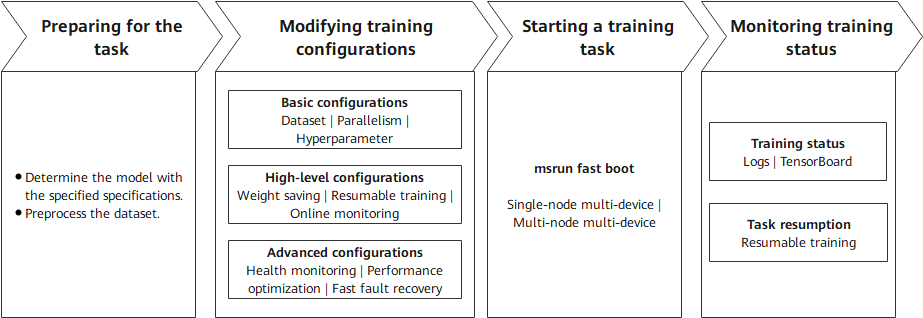

<!-- __SG_DEPRECATED_BANNER__ -->

```{admonition} Deprecated
:class: warning

This page belongs to the **Static Graph (GRAPH_MODE) Implementation** section and has been marked as deprecated. New features are primarily being developed in the "r2.0.0 Dynamic Graph Implementation" section. Please refer to the dynamic graph documentation first.
```

# Training Guide

[](https://atomgit.com/mindspore/docs/blob/master/docs/mindformers/docs/source_en/static_graph/guide/llm_training.md)

## Overview

Pretraining is the core phase of building high-performance LLMs. The essence of pretraining is to enable models to learn general language rules and knowledge from massive amounts of unlabeled data. Many pretrained models (such as Llama, Qwen, and DeepSeek series models) with excellent metrics have been open-sourced in the industry. By learning the probability distributions of languages from massive text data, these models possess general capabilities such as vocabulary, grammar, and semantics, providing a solid foundation for downstream tasks (such as Q&A and writing).

LLM fine-tuning is a process of further adjusting model parameters based on a pretrained model by using a small amount of labeled domain/task data. The core objective is to adapt the model to specific application scenarios (such as medical Q&A and legal document generation) and improve the performance on specific tasks. Generally, the following methods are used for fine-tuning:

a. Full-parameter fine-tuning: Adjusts all parameters of the model (high computational cost, suitable for small-scale models).

b. Low-parameter fine-tuning: Modifies only some parameters to save resources. Low-rank adaptation (LoRA) is a prominent example of this method.

Fine-tuning relies on the general language capabilities of pretrained models and optimizes the models' "understanding" and "output" for specific tasks through targeted data (such as labeled dialog records and professional documents).

As mentioned above, the differences between pretraining and fine-tuning mainly come from data and parameters, and their training processes are similar. In essence, both pretraining and fine-tuning optimize model parameters through the backpropagation algorithm to minimize the loss function, thereby improving the models' ability to predict or generate content based on the input data. MindSpore Transformers provides a unified pretraining and fine-tuning training process, and provides easy-to-use solutions based on the differences and ecosystem. In the unified training process, the key steps for starting a training task are as follows.



1. **Preparing for the task**: Determine the configurations of the model to be trained and prepare the training dataset. These two points are critical.
2. **Modifying training configurations**: Set configuration items based on the existing hardware resources, models, and data. The configuration items include basic, high-level, and advanced configurations. Different levels of configuration items allow training tasks to achieve different objectives.
3. **Starting a training task**: Start a training task across different cluster scales based on the existing hardware resources and training configurations.
4. **Monitoring training status**: After the task is executed, monitor the training status using various methods provided by MindSpore Transformers for subsequent debugging and optimization.

The following describes the key processes of MindSpore Transformers in LLM pretraining and fine-tuning tasks.

## Training Process

### 1. Preparing for the Task

#### Specifying the Model Specifications

MindSpore Transformers supports different series of pretraining models, such as some typical specifications of Llama, DeepSeek, and Qwen3 series. In addition, the open-source community also has a series of models with different specifications. MindSpore Transformers provides different levels of specifications to distinguish the support for different model specifications. The following describes these levels and explains how to use models at different levels.

<table>
  <tr>
    <th>Level</th>
    <th>Description</th>
    <th>Usage Notes</th>
  </tr>
  <tr>
    <td><strong>Released</strong></td>
    <td>The model is accepted by the test team. The fitting degree between loss and grad norm precision and established benchmarks meet the standards under deterministic conditions.</td>
    <td>The corresponding YAML configuration file is provided in the configs/xxx directory of the MindSpore Transformers repository. <strong>Generally, it includes the typical specification configurations of open-source models.</strong> You can read the configs/xxx/README.md file to learn how to use the configuration file.</td>
  </tr>
  <tr>
    <td><strong>Validated</strong></td>
    <td>The model is validated by the development team. The fitting degree between loss and grad norm precision and established benchmarks meet the standards under deterministic conditions.</td>
    <td rowspan="3">The MindSpore Transformers repository does not provide a configuration file that can be directly run. You can customize a training configuration file by referring to the YAML configuration file and training configuration template usage tutorial of the release-level model specifications. The training configuration template usage tutorial also provides the corresponding pretraining configuration template.</td>
  </tr>
  <tr>
    <td><strong>Preliminary</strong></td>
    <td>The model has been preliminarily verified by developers. Its functions are complete and can be used for trial. The training converges properly, but precision is not strictly verified.</td>
  </tr>
  <tr>
    <td><strong>Untested</strong></td>
    <td>Functions are available but not tested, and precision and convergence are not verified. User-defined development is supported.</td>
  </tr>
  <tr>
    <td><strong>Community</strong></td>
    <td>It is a MindSpore-native model contributed by the community, and is developed and maintained by the community.</td>
    <td>You need to use the model based on the community description.</td>
  </tr>
</table>

In the preceding table, MindSpore Transformers provides out-of-the-box model configurations for released-level models. For other levels of models, MindSpore Transformers provides not only basic framework capabilities to support model development, but also a set of training configuration templates for developers. With these configuration templates, developers can quickly define and adjust model parameters (such as the number of layers, number of heads, and hidden layer dimension), implementing quick migration from released-level models to unsupported models and quick startup of pretraining tasks for custom models. For details, see [Training Configuration Template Instructions](https://www.mindspore.cn/mindformers/docs/en/master/advanced_development/training_template_instruction.html).

#### Preprocessing the Dataset

In natural language processing (NLP) tasks, data preprocessing is a key prerequisite for model training. It not only solves problems like noises and inconsistent formats (which contain special characters and garbled characters) in the raw data, but also converts the original text into a numerical form that can be understood by the model through structured conversion (such as tokenization and vectorization). Although general data preprocessing may include full-process operations such as collection, cleaning, and tokenization, the input data in this phase is assumed to have basic quality (that is, "clean" data). Therefore, the focus is on the core objective of **token conversion**.

**Processing Pretraining Data**

In the Megatron-LM training framework, a multi-source mixed dataset solution is provided for pretraining tasks. This solution converts raw data into tokens and uses the lightweight bin file format for persistent storage. This solution supports the following features:

- **Flexible configuration**: Multiple bin data files can be loaded at the same time, and the sampling ratio parameter can be used to control the mixed weight of different data sources.
- **Efficient training**: The binary storage format greatly improves I/O efficiency, which is especially suitable for large-scale pretraining scenarios.

MindSpore Transformers can directly load the multi-source mixed dataset format for Megatron in pretraining tasks. Users of Megatron-LM do not need to repeat the data preprocessing step. They only need to specify the bin file path to quickly start training. If the bin file already exists, users can configure the file in the YAML training configuration file by referring to the subsequent sections. If no bin file exists, users need to convert the raw training data into a bin file. MindSpore Transformers provides a script tool for processing the raw dataset in JSON format into a bin file. The Wiki 103 dataset is used as an example to provide the entire preprocessing process. For details, see [Dataset > Megatron Dataset](https://www.mindspore.cn/mindformers/docs/en/master/feature/dataset.html#megatron-dataset).

**Processing Fine-Tuning Data**

In fine-tuning tasks of NLP models, the [Hugging Face community](https://huggingface.co/) hosts a wide range of open-source fine-tuning datasets. These datasets cover many fields and task types such as text classification, named entity recognition, and Q&A system, meeting fine-tuning requirements in different scenarios. These open-source datasets are usually implemented using the [datasets](https://huggingface.co/docs/datasets/en/index) library, which provides convenient data loading, preprocessing, and management features, greatly simplifying data processing. MindSpore Transformers fully considers the usage habits and requirements of the community and supports online or offline loading of datasets from the [Hugging Face community](https://huggingface.co/), ensuring good compatibility.

- **Online loading**: You can configure the YAML file to conveniently obtain the required dataset from the Hugging Face dataset repository, without the need to manually download or manage data files.
- **Offline loading**: You can download the required dataset to the local PC in advance or process your own dataset, and then load the local data during fine-tuning. This way, fine-tuning tasks can proceed as usual even in the presence of adverse factors like unstable networks.

For details, see [Dataset > Hugging Face Dataset](https://www.mindspore.cn/mindformers/docs/en/master/feature/dataset.html#hugging-face-dataset).

### 2. Preparing Configuration Files

Each pretraining task involves a high number of LLM parameters (usually ranging from billions to trillions). Distributed computing resources are required for efficient training and hyperparameter modification to ensure the normal execution of the task and the final performance metrics of the model. The following lists the types of configurations that can be modified during a pretraining task:

- **Model configuration**: Modify the parameters related to the model architecture in the configuration file based on the predefined model specifications, such as the number of layers, number of heads, and hidden layer dimension.
- **Data configuration**: Specify the dataset obtained after preprocessing, and configure the dataset path, data loading mode, and other necessary information.
- **Hyperparameter training**: Specify the optimizer type, loss function, learning rate, data batch size, and number of training epochs based on the model training strategy.
- **Parallelism strategy**: Configure data parallelism, model parallelism, and pipeline parallelism based on the cluster scale and model parameters to support ultra-large model training or performance optimization.
- **Status monitoring**: Set the loss printing interval, configure TensorBoard to record key status values for visualization, and configure the printing/visualization of key values in precision debugging tasks to locate precision problems such as local norm, local loss, and optimizer status.
- **High availability**: Set the number of steps for saving weights, resumable training weights, fault detection, dying gasp, and other HA features to ensure stable training.

After completing the pretraining preparations, you can set MindSpore Transformers parameters at multiple levels, categorized by configuration type and pretraining scenario. The following describes the application scenarios of different configurations and the overall objectives that can be achieved.

<table>
  <tr>
    <th>Configuration Type</th>
    <th>Description</th>
    <th>Configuration Item</th>
    <th>Configuration Guide</th>
  </tr>
  <tr>
    <td rowspan="3">Basic configurations</td>
    <td rowspan="3">You can specify the corresponding configuration items to start a simple training task based on the current model structure.</td>
    <td>Dataset</td>
    <td><a href=https://www.mindspore.cn/mindformers/docs/en/master/feature/dataset.html target="_blank">Dataset usage</a></td>
  </tr>
  <tr>
    <td>Parallelism configurations</td>
    <td>
    <a href=https://www.mindspore.cn/mindformers/docs/en/master/feature/configuration.html#parallel-configuration target="_blank">Parallelism configuration items</a><br>
    <a href=https://www.mindspore.cn/mindformers/docs/en/master/feature/parallel_training.html target="_blank">Parallelism configuration guide</a>
    </td>
  </tr>
  <tr>
    <td>Hyperparameter training</td>
    <td>
    <a href=https://www.mindspore.cn/mindformers/docs/en/master/feature/configuration.html#model-training-configuration target="_blank">Model training configuration</a>
    </td>
  </tr>
  <tr>
    <td rowspan="3">High-level configurations</td>
    <td rowspan="3">After the configurations are complete, the training status of executed training tasks can be detected to ensure continuity across multiple training tasks.</td>
    <td>Weight saving</td>
    <td>
      <a href=https://www.mindspore.cn/mindformers/docs/en/master/feature/configuration.html#callbacks-configuration target="_blank">CheckPointMonitor under Callbacks configuration</a><br>
      <a href=https://www.mindspore.cn/mindformers/docs/en/master/feature/safetensors.html target="_blank">Safetensors weight usage</a>
    </td>
  </tr>
  <tr>
    <td>Resumable training</td>
    <td>
      <a href=https://www.mindspore.cn/mindformers/docs/en/master/feature/resume_training.html target="_blank">Examples for resumable training after breakpoint</a><br>
      <a href=https://www.mindspore.cn/mindformers/docs/en/master/feature/safetensors.html target="_blank">Safetensors weight usage</a>
    </td>
  </tr>
  <tr>
    <td>Online monitoring</td>
    <td>
      <a href=https://www.mindspore.cn/mindformers/docs/en/master/feature/monitor.html target="_blank">Training metrics monitoring</a>
    </td>
  </tr>
  <tr>
    <td rowspan="4">Advanced configurations</td>
    <td rowspan="4">By specifying these configuration items, you can monitor the health status of the training process, perform fast fault recovery, and optimize performance to ensure stable and high-performance training across different cluster scales.</td>
    <td>Health monitoring</td>
    <td>
      <a href=https://www.mindspore.cn/mindformers/docs/en/master/feature/skip_data_and_ckpt_health_monitor.html target="_blank">Data skip and checkpoint health monitoring</a>
    </td>
  </tr>
  <tr>
    <td>Performance optimization</td>
    <td>
      <a href=https://www.mindspore.cn/mindformers/docs/en/master/feature/memory_optimization.html target="_blank">Memory optimization</a><br>
      <a href=https://www.mindspore.cn/mindformers/docs/en/master/advanced_development/performance_optimization.html target="_blank">Performance optimization guide</a>
    </td>
  </tr>
  <tr>
    <td>Fast fault recovery</td>
    <td>
      <a href=https://www.mindspore.cn/mindformers/docs/en/master/feature/high_availability.html target="_blank">High availability feature</a><br>
    </td>
  </tr>
</table>

Except the preceding configuration items, all configuration items of training tasks are controlled by the [configuration file](https://www.mindspore.cn/mindformers/docs/en/master/feature/configuration.html). You can adjust them based on the configuration item description.

### 3. Starting a Training Task

MindSpore Transformers supports single-node multi-device and multi-node multi-device distributed training. The cluster scale supports ultra-large-scale distributed training from single-node 8-device to single-node 10,000-device. For details about how to start a training task, see [Start Tasks](https://www.mindspore.cn/mindformers/docs/en/master/feature/start_tasks.html).

### 4. Monitoring Training Status

The pretraining phase may last for several weeks or months. You need to monitor key metrics in real time and dynamically adjust them to ensure that the trained model can achieve the expected effect. During training, the following status items may deserve attention:

- **Performance**: number of training tokens/samples per second (throughput), NPU usage (computing power usage), and time consumed per step
- **Precision**: loss function value and gradient norm (explosion/collapse prevention)
- **Checkpoint**: saves the intermediate model status periodically (for example, every *N* steps) to prevent data loss caused by training interruption.

MindSpore Transformers prints detailed logs for different monitoring values during training to check the intermediate status, and provides TensorBoard tools for online visualization. For details, see [Logs](https://www.mindspore.cn/mindformers/docs/en/master/feature/logging.html) and [Visualization tools](https://www.mindspore.cn/mindformers/docs/en/master/feature/monitor.html). After weights are saved at checkpoints or after the training is complete, the model weights will be saved to the specified directory. Currently, weights can be saved in [ckpt format](https://www.mindspore.cn/mindformers/docs/en/master/feature/ckpt.html) or [Safetensors format](https://www.mindspore.cn/mindformers/docs/en/master/feature/safetensors.html). The saved weights can be used for resumable retraining or fine-tuning.

## Training Practices

MindSpore Transformers provides detailed pretraining and fine-tuning processes and practices. For details, see [Pretraining](https://www.mindspore.cn/mindformers/docs/en/master/guide/pre_training.html) and [Fine-Tuning](https://www.mindspore.cn/mindformers/docs/en/master/guide/supervised_fine_tuning.html).
