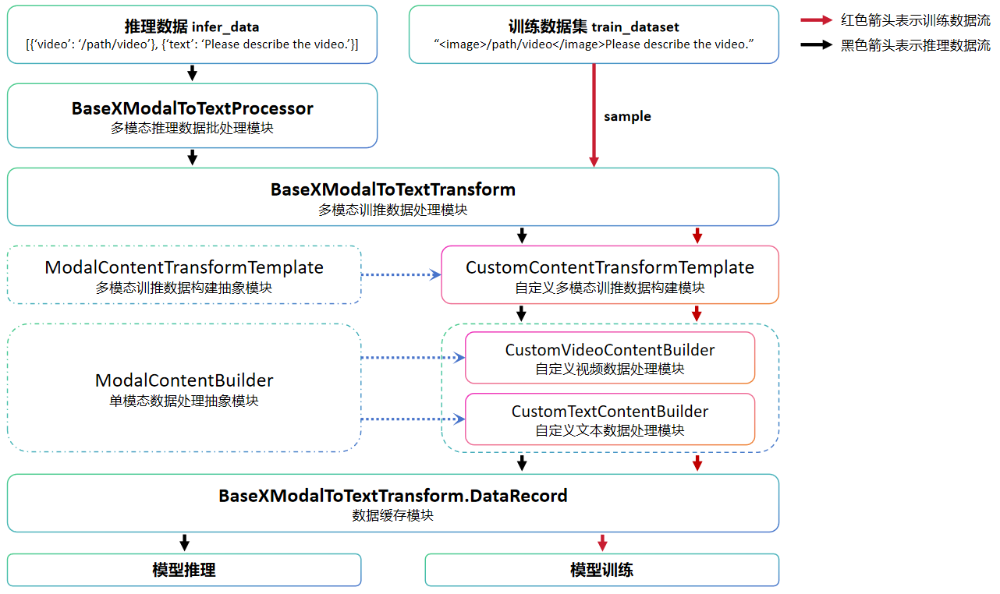

# Multimodal Model Development

[](https://gitee.com/mindspore/docs/blob/r2.6.0rc1/docs/mindformers/docs/source_en/usage/multi_modal.md)

Multimodal models refer to artificial intelligence models capable of processing and combining information from different modalities (such as text, images, audio, video, etc.) for learning and inference. Traditional single-modality models typically focus on a single type of data, such as text classification models handling only text data or image recognition models handling only image data. In contrast, multimodal models integrate data from different sources to accomplish more complex tasks, enabling them to understand and generate richer and more comprehensive content.

This document aims to introduce the multimodal models in MindSpore Transformers, providing detailed steps and examples to guide users in building custom multimodal models and data processing modules using MindSpore Transformers. Additionally, users can follow the document to complete tasks such as model training and inference.

The unified architecture of multimodal models in **MindSpore Transformers** primarily includes the following components:

- [Dataset Construction](#dataset-construction)
- [Data Processing Modules](#data-processing-modules)
- [Model Construction](#model-construction)
    - [Model Configuration Class](#model-configuration-class)
    - [Non-text Modality Processing Module](#non-text-modality-processing-module)
    - [Cross-Modal Interaction Module](#cross-modal-interaction-module)
    - [Text Generation Module](#text-generation-module)
- [Multimodal Model Practice](#multimodal-model-practice)

## Dataset Construction

Before training a multimodal model, it is often necessary to first construct a multimodal dataset. MindSpore Transformers currently provides `dataset` and `dataloader` classes for multimodal data, which users can directly utilize:

- [BaseMultiModalDataLoader](https://gitee.com/mindspore/mindformers/blob/r1.5.0/mindformers/dataset/dataloader/multi_modal_dataloader.py) is the multimodal dataset loading class. It handles the functionality of reading data from a `json` file.
- [ModalToTextSFTDataset](https://gitee.com/mindspore/mindformers/blob/r1.5.0/mindformers/dataset/modal_to_text_sft_dataset.py) is the multimodal dataset processing class. It handles multimodal data processing, as well as operations like batch processing and data repetition. For more details on multimodal data processing, refer to the [Data Processing Modules](#data-processing-modules).

Below is an example of part of the training dataset `json` file for the `CogVLM2-Video` model:

```json
[{
    "id": "v_p1QGn0IzfW0.mp4",
    "conversations": [
      {
        "from": "user",
        "value": "<|reserved_special_token_3|>/path/VideoChatGPT/convert/v_p1QGn0IzfW0.mp4<|reserved_special_token_4|>What equipment is visible in the gym where the boy is doing his routine?"
      },
      {
        "from": "assistant",
        "value": "There is other equipment visible in the gym like a high bar and still rings."
      }
    ]
}]
```

In the dataset, `<|reserved_special_token_3|>` and `<|reserved_special_token_3|>` are placeholders used to represent video paths in the `CogVLM2-Video` model.

Users can construct custom `json` files as needed. The file format should be a list containing multiple dictionaries, where each dictionary represents a data sample. In each sample, the `id` field denotes the data identifier, and the `conversations` field represents the multi-turn conversation content.

After constructing the `json` file, you can run the following example code to view the data samples from the dataset:

```python
from mindformers.dataset.dataloader.multi_modal_dataloader import BaseMultiModalDataLoader

# build data loader
dataset_loader = BaseMultiModalDataLoader(
  annotation_file = '/path/dataset.json', shuffle=False
)
print(dataset_loader[0])

# ([['user', '<|reserved_special_token_3|>/path/VideoChatGPT/convert/v_p1QGn0IzfW0.mp4<|reserved_special_token_4|>What equipment is visible in the gym where the boy is doing his routine?'], ['assistant', 'There is other equipment visible in the gym like a high bar and still rings.']],)
```

## Data Processing Modules

During the training and inference of multimodal models, the data processing modules are required to perform preprocessing on multimodal data. This module is invoked during training in the ModalToTextSFTDataset, and during inference in the [MultiModalToTextPipeline](https://www.mindspore.cn/mindformers/docs/en/r1.5.0/pipeline/mindformers.pipeline.MultiModalToTextPipeline.html#mindformers.pipeline.MultiModalToTextPipeline).

Below is a flowchart of the multimodal data processing. The custom modules in the diagram need to be implemented by the user according to their specific requirements, while other modules can be directly invoked.



Then, using the [CogVLM2-Video model data preprocessing module](https://gitee.com/mindspore/mindformers/blob/r1.5.0/mindformers/models/cogvlm2/cogvlm2_processor.py) as an example, we will introduce the functionality of the components of the multimodal data processing module.

1. BaseXModalToTextProcessor is mainly used to receive raw multimodal data for inference and perform preprocessing operations. It also implements post-processing operations for inference results, and users can directly use this class.
2. BaseXModalToTextTransform is mainly used to process the data returned by `BaseXModalToTextProcessor` or the multimodal dataset into data suitable for inference or training. This class can also be directly used by users.
3. [ModalContentTransformTemplate](https://www.mindspore.cn/mindformers/docs/en/r1.5.0/models/mindformers.models.multi_modal.ModalContentTransformTemplate.html#mindformers.models.multi_modal.ModalContentTransformTemplate) is the abstract class for all modality-specific data construction modules. Since data operations are model-dependent, users need to implement corresponding custom data construction classes based on their needs. In the `CogVLM2-Video` model, the `CogVLM2ContentTransformTemplate` class is implemented to handle both video and text data.
4. ModalContentBuilder is the abstract class for single-modality data processing. If the model needs to handle data from multiple modalities, corresponding single-modality data processing classes need to be created during the initialization of the custom data construction class. In the `CogVLM2-Video` model, the `CogVLM2VideoContentBuilder` class is implemented to handle video data, while the general text data processing class `BaseTextContentBuilder` is used to process text data.

Below is an example of the data preprocessing code for training and inference in the `CogVLM2-Video` model.

### Model Training Data Processing

In multimodal model training tasks, data preprocessing configurations are typically written in the `train_dataset` section. The following is an example of the dataset-related configuration in the `CogVLM2-Video` model training configuration file:

[finetune_cogvlm2_video_llama3_chat_13b_lora.yaml](https://gitee.com/mindspore/mindformers/blob/r1.5.0/configs/cogvlm2/finetune_cogvlm2_video_llama3_chat_13b_lora.yaml)

```yaml
train_dataset: &train_dataset
  data_loader:
    type: BaseMultiModalDataLoader
    annotation_file: "/path/train_data.json"
    shuffle: True
  modal_to_text_transform:
    type: BaseXModalToTextTransform
    max_length: 2048
    model_transform_template:
      type: CogVLM2ContentTransformTemplate
      output_columns: [ "input_ids", "images", "video_context_pos", "position_ids", "labels" ]
      signal_type: "chat"
      mode: 'train'
      pos_pad_length: 2048
  tokenizer:
    add_bos_token: False
    add_eos_token: False
    max_length: 2048
    pad_token: "<|reserved_special_token_0|>"
    vocab_file: "/path/tokenizer.model"
    type: CogVLM2Tokenizer
```

The `annotation_file` is the path to the training data's `json` file. Both `modal_to_text_transform` and `tokenizer` should be similar to those in the `processor` section of the inference configuration.

```python
from mindformers.tools.register.config import MindFormerConfig
from mindformers.dataset.modal_to_text_sft_dataset import ModalToTextSFTDataset

# load configs
configs = MindFormerConfig("configs/cogvlm2/finetune_cogvlm2_video_llama3_chat_13b_lora.yaml")
# build dataset
multi_modal_dataset = ModalToTextSFTDataset(**configs.train_dataset)
# iterate dataset
for item in multi_modal_dataset:
    print(len(item))
    break
# 5, output 5 columns
```

### Model Inference Data Processing

The data processing module configuration in the `CogVLM2-Video` model inference configuration file is as follows:

[predict_cogvlm2_video_llama3_chat_13b.yaml](https://gitee.com/mindspore/mindformers/blob/r1.5.0/configs/cogvlm2/predict_cogvlm2_video_llama3_chat_13b.yaml)

```yaml
processor:
  type: BaseXModalToTextProcessor
  model_transform_template:
    type: CogVLM2ContentTransformTemplate
    output_columns: [ "input_ids", "position_ids", "images", "video_context_pos" ]
    vstack_columns: [ "images", "video_context_pos" ]
    signal_type: "chat"
    pos_pad_length: 2048
  tokenizer:
    add_bos_token: False
    add_eos_token: False
    max_length: 2048
    pad_token: "<|reserved_special_token_0|>"
    vocab_file: "/path/tokenizer.model"
    type: CogVLM2Tokenizer
```

The `vocab_file` is the path to the vocabulary file used, while other parameters are related to the model configuration and can be customized as needed by the user.

Below is an example code for processing multimodal training data. Unlike the training data, the data processing yields a dictionary containing processed data such as `input_ids`, rather than a list.

```python
from mindformers.tools.register.config import MindFormerConfig
from mindformers.models.multi_modal.base_multi_modal_processor import BaseXModalToTextProcessor
from mindformers.models.cogvlm2.cogvlm2_tokenizer import CogVLM2Tokenizer

# build processor
configs = MindFormerConfig("configs/cogvlm2/predict_cogvlm2_video_llama3_chat_13b.yaml")
configs.processor.tokenizer = tokenizer = CogVLM2Tokenizer(**configs.processor.tokenizer)
processor = BaseXModalToTextProcessor(**configs.processor)

# process data
multi_modal_data = [
  {'video': "/path/video.mp4"},
  {'text': "Please describe this video."}
]

print(processor(multi_modal_data).keys())
# dict_keys(['input_ids', 'position_ids', 'images', 'video_context_pos'])
```

After implementing the multimodal dataset construction and data processing modules, the data that can be handled by the multimodal model can be obtained. Below, we will introduce how to construct a multimodal large model.

## Model Construction

A multimodal large model typically consists of three parts: a non-text modality processing module, a cross-modal interaction module, and a text generation module. The non-text modality processing module is usually a vision model pre-trained on large-scale data, the text generation module is typically a large text generation model, and the cross-modal interaction module usually consists of multiple linear layers.

### Model Configuration Class

In MindSpore Transformers, the parameters related to multimodal models are mainly controlled through the model configuration class. Below, we use the `CogVLM2Config` class as an example to explain how to build the model configuration class.  
For the specific implementation, refer to [CogVLM2Config](https://gitee.com/mindspore/mindformers/blob/r1.5.0/mindformers/models/cogvlm2/cogvlm2_config.py).

```python
@MindFormerRegister.register(MindFormerModuleType.CONFIG)
class CogVLM2Config(PretrainedConfig):
    def __init__(self,
                 vision_model: PretrainedConfig,
                 llm_model: PretrainedConfig,
                 **kwargs):
        super().__init__(**kwargs)
        self.vision_model = vision_model
        self.llm_model = llm_model
```

Parameter Explanation:

1. `@MindFormerRegister.register(MindFormerModuleType.CONFIG)` is mainly used to register a custom model configuration class. Once registered, the model configuration class can be called by its name in the `yaml` file.
2. `vision_model` and `llm_model` represent the configuration classes for the vision model and text generation model, respectively. They are passed as parameters to the multimodal model configuration class and processed during the class initialization.
3. `PretrainedConfig` is the base class for all model configurations. For more details, refer to [PretrainedConfig](https://www.mindspore.cn/mindformers/docs/en/r1.5.0/models/mindformers.models.PretrainedConfig.html#mindformers.models.PretrainedConfig).

In the configuration file, the model should be configured as follows.  
For the specific implementation, refer to [predict_cogvlm2_video_llama3_chat_13b.yaml](https://gitee.com/mindspore/mindformers/blob/r1.5.0/configs/cogvlm2/predict_cogvlm2_video_llama3_chat_13b.yaml).

```yaml
model:
  model_config:
    type: MultiModalConfig
    vision_model:
      arch:
        type: EVAModel
      model_config:
        type: EVA02Config
        image_size: 224
        patch_size: 14
        hidden_size: 1792
        num_hidden_layers: 63
        ...
    llm_model:
      arch:
        type: CogVLM2VideoLM
      model_config:
        type: LlamaConfig
        seq_length: 2048
        hidden_size: 4096
        num_layers: 32
        ...
  arch:
    type: CogVLM2ForCausalLM
```

In this configuration file, `EVAModel` and `EVA02Config` are used as the `vision_model` and its configuration class, while `CogVLM2VideoLM` and `LlamaConfig` are used as the `llm_model` and its configuration class.  
Together, they form the multimodal model `CogVLM2ForCausalLM`. These classes are all pre-implemented modules in MindSpore Transformers. Below, we will explain how to implement custom modules.

### Non-Text Modality Processing Module

MindSpore Transformers provides models like `ViT` and `EVA02` as visual information processing modules. Below, we use the `EVA02` model as an example to explain how to construct a non-text modality processing module.  
For more details, refer to [EVAModel](https://gitee.com/mindspore/mindformers/blob/r1.5.0/mindformers/models/eva02/eva.py) and [EVA02Config](https://gitee.com/mindspore/mindformers/blob/r1.5.0/mindformers/models/eva02/eva_config.py).

```python
from mindformers.tools.register import MindFormerRegister, MindFormerModuleType
from mindformers.models.modeling_utils import PreTrainedModel
from mindformers.models.eva02.eva_config import EVA02Config

class EVA02PreTrainedModel(PreTrainedModel):
    config_class = EVA02Config
    base_model_prefix = "eva02"

@MindFormerRegister.register(MindFormerModuleType.MODELS)
class EVAModel(EVA02PreTrainedModel):
    def __init__(self, config=None):
        config = config if config else EVA02Config()
        super().__init__(config)
```

Parameter Explanation:

1. `@MindFormerRegister.register(MindFormerModuleType.MODELS)` is mainly used to register a custom model class. Once registered, the model class can be called by its name in the `yaml` file.
2. `EVA02PreTrainedModel` inherits from the `PreTrainedModel` class and is mainly used to specify the model configuration class and the prefix for model parameter names. `EVAModel` is the specific implementation of the model, inheriting from the `EVA02PreTrainedModel` class. For more details, refer to the [PreTrainedModel](https://www.mindspore.cn/mindformers/docs/en/r1.5.0/models/mindformers.models.PreTrainedModel.html#mindformers.models.PreTrainedModel) API.
3. `EVAModel` mainly processes visual information in the data and feeds the processed visual features into the **cross-modal interaction module**.

### Cross-Modal Interaction Module

The text generation module is usually a pre-trained large language model, while the non-text modality processing module is a model pre-trained on large-scale non-text data. The output features from these models differ significantly from those in the text features and cannot be directly input into the text generation module for inference. Therefore, a cross-modal interaction module, matching the text generation module, is needed to process visual features into vectors that can be handled by the text generation module.

Below, we use the `VisionMLPAdapter` in the `CogVLM2-Video` model as an example to explain the structure and function of the cross-modal interaction module.

```python
class VisionMLPAdapter(nn.Cell):
    def __init__(self, vision_grid_size, vision_hidden_size, text_hidden_size, text_intermediate_size,
                 compute_dtype=ms.float16, param_init_type=ms.float16):
        super().__init__()
        self.grid_size = vision_grid_size
        self.linear_proj = GLU(in_features=vision_hidden_size,
                               hidden_size=text_hidden_size,
                               intermediate_size=text_intermediate_size,
                               compute_dtype=compute_dtype, param_init_type=param_init_type)
        self.conv = nn.Conv2d(in_channels=vision_hidden_size, out_channels=vision_hidden_size,
                              kernel_size=2, stride=2, dtype=param_init_type, has_bias=True).to_float(compute_dtype)
```

In the `VisionMLPAdapter`, the output of the `EVAModel` is processed through operations such as Linear and Conv2D to match the same dimensionality as the text features. Here, `vision_hidden_size` and `text_hidden_size` represent the dimensionalities of the visual and text features, respectively.

### Text Generation Module

MindSpore Transformers provides large language models such as `Llama2` and `Llama3` as text generation modules, which, together with the non-text modality processing module and cross-modal interaction module, form the multimodal model.

```python
@MindFormerRegister.register(MindFormerModuleType.MODELS)
class MultiModalForCausalLM(BaseXModalToTextModel):
    def __init__(self, config: MultiModalConfig, **kwargs):
        super().__init__(config, **kwargs)
        self.config = config
        self.vision_model = build_network(config.vision_model)
        self.llm_model = build_network(config.llm_model)
        self.mlp_adapter = VisionMLPAdapter(**kwargs)

    def prepare_inputs_for_generation(self, input_ids, **kwargs):
      """Prepare inputs for generation in inference."""

    def prepare_inputs_for_predict_layout(self, input_ids, **kwargs):
      """Prepare inputs for generation in inference."""

    def set_dynamic_inputs(self, **kwargs):
      """Set dynamic inputs for model."""

    def construct(self, input_ids, **kwargs):
      """Model forward."""
```

Parameter Explanation:

1. `MultiModalForCausalLM`, as the multimodal model class, inherits from the base class `BaseXModalToTextModel`. During the construction of this class, the `build_network` function and the corresponding module configurations are used to initialize the non-text modality processing module `vision_model`, the text generation module `llm_model`, and the cross-modal interaction module `VisionMLPAdapter`.
2. The `prepare_inputs_for_generation` method preprocesses the input data, ensuring that the processed data can be used for model inference through the `construct` method.
3. The `prepare_inputs_for_predict_layout` method constructs data that the model can handle. Its return value corresponds to the input parameters of the `construct` method, and the constructed data allows for model compilation.
4. The `set_dynamic_inputs` method configures dynamic shapes for some input data in the model.
5. The `construct` method is the common interface for all models and serves as the forward execution function for the multimodal model.

## Multimodal Model Practice

After implementing the multimodal dataset, data processing modules, and multimodal model construction, you can start model pre-training, fine-tuning, inference, and other tasks by using the model configuration file. This requires creating the corresponding model configuration file.

For specific model configuration files, refer to [predict_cogvlm2_video_llama3_chat_13b.yaml](https://gitee.com/mindspore/mindformers/blob/r1.5.0/configs/cogvlm2/predict_cogvlm2_video_llama3_chat_13b.yaml) and [finetune_cogvlm2_video_llama3_chat_13b_lora.yaml](https://gitee.com/mindspore/mindformers/blob/r1.5.0/configs/cogvlm2/finetune_cogvlm2_video_llama3_chat_13b_lora.yaml), which correspond to model inference and fine-tuning, respectively. For the meaning of specific parameters, refer to the [configuration file documentation](https://www.mindspore.cn/mindformers/docs/en/r1.5.0/appendix/conf_files.html).

In the user-defined configuration file, sections such as `model`, `processor`, and `train_dataset` need to correspond to the user's custom **dataset**, **data processing module**, and **multimodal model**.

After editing the custom configuration file, refer to the [CogVLM2-Video model documentation](https://gitee.com/mindspore/mindformers/blob/r1.5.0/docs/model_cards/cogvlm2_video.md) to start model [inference](https://gitee.com/mindspore/mindformers/blob/r1.5.0/docs/model_cards/cogvlm2_video.md#推理) and [fine-tuning](https://gitee.com/mindspore/mindformers/blob/r1.5.0/docs/model_cards/cogvlm2_video.md#微调) tasks.
