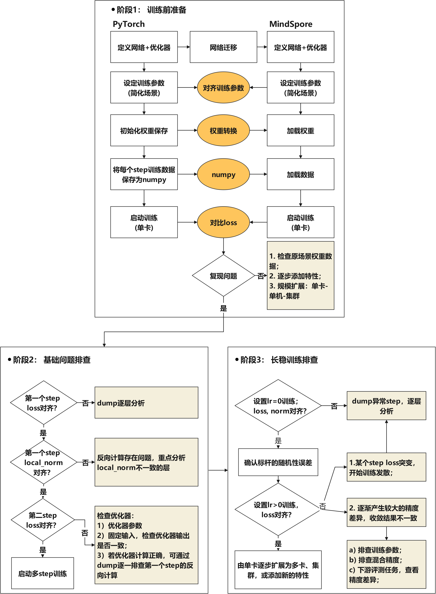
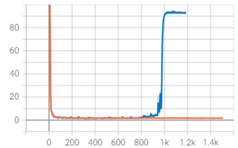
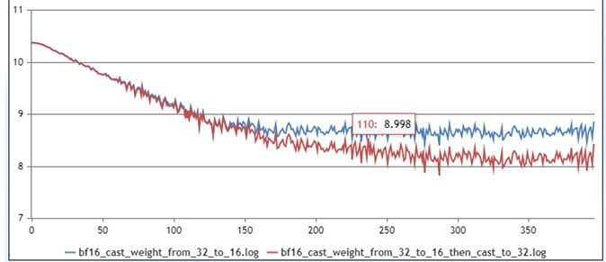
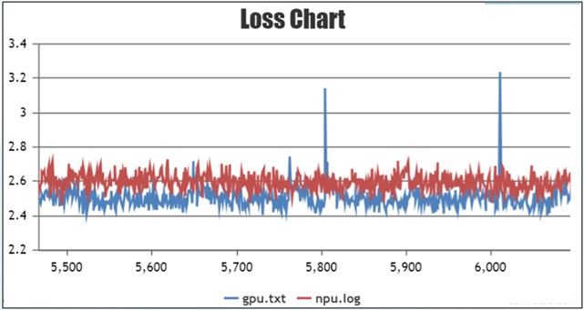
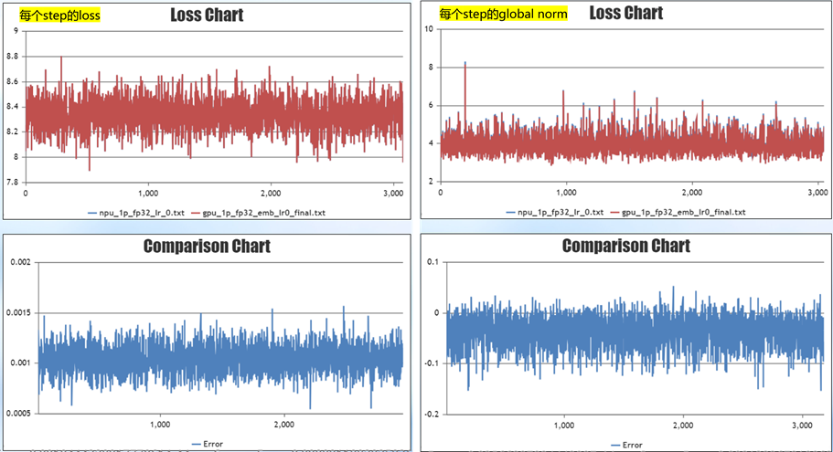
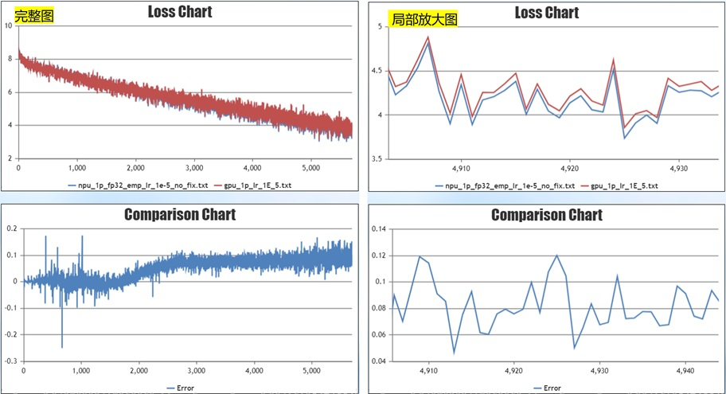
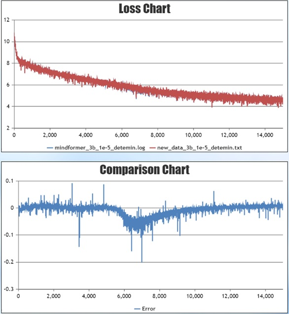
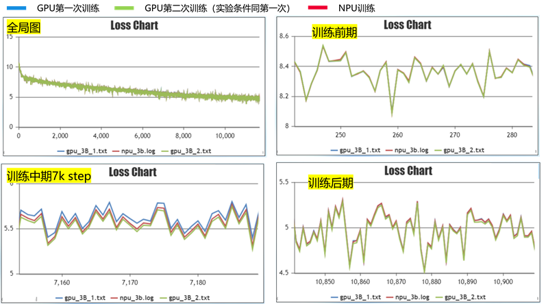

# 大模型精度调优指南

[](https://gitee.com/mindspore/docs/blob/r2.6.0rc1/docs/mindformers/docs/source_zh_cn/acc_optimize/acc_optimize.md)

## 精度问题概述和场景

### 描述

随着昇腾AI处理器（以下简称为NPU）在深度学习中的广泛应用，基于昇腾NPU原生开发的MindSpore框架展现出了更好的性能优势。在大规模集群训练过程中，性能的提升将极大节省用户进行大模型开发的成本。因此，越来越多的用户逐渐将原本训练模型迁移至MindSpore中。然而，由于硬件以及框架使用上的差异，用户在完成模型迁移后可能会遇到精度问题。

本文总结了大模型训练过程中常见精度问题及通用的精度问题定位方法，力求帮助用户快速排查精度问题，缩短模型精度问题定位的时间。开始大模型精度调优工作时，应具备大模型的基础知识。为避免发散，本文档将不会解释大模型相关基础概念，聚焦精度调优介绍。

### 常见问题归类总结

大模型训练中经常出现各种精度问题，常见的问题包括loss无法收敛、loss收敛效果不佳、训练后期loss不收敛、精度溢出、loss下降过程中与标杆无法拟合等；造成这些精度问题可能有多种原因，包括模型结构、数据集、超参数、前反向计算精度、优化器计算、浮点计算精度、随机性等。

当出现精度问题时，可以从造成这些精度误差的原因进行问题分析。先根据CheckList快速排查，然后对齐参数和权重、固定随机性和开启确定性计算，接着排查基础问题，最后通过长稳训练排查异常Step的问题。在当前阶段，本文主要针对有精度标杆的场景，介绍精度定位的通用方法，后续将陆续添加无精度标杆下的精度问题定位内容。

## 精度问题定位CheckList

在定位算子精度问题之前，首先要排除其他非算子因素的干扰。结合以往精度定位案例，总结了精度定位前的CheckList。为了在定位过程中少走弯路，用户可先根据CheckList进行快速的排查。

### 网络结构CheckList

#### 通用结构

| **关键参数**&nbsp;&nbsp;&nbsp;&nbsp;&nbsp;&nbsp;&nbsp;&nbsp;&nbsp;&nbsp;&nbsp;&nbsp;&nbsp;&nbsp;&nbsp;&nbsp;&nbsp;&nbsp;          | **说明**                                                     | **检查项**                                                                  |
| ----------------- | ------------------------------------------------------------ |--------------------------------------------------------------------------|
| num_layers        | transformer层数                                              | 对应Megatron num-layers参数，检查是否一致。                                          |
| num_heads         | transformer中attention heads数量                             | 对应Megatron num-attention-heads参数，检查是否一致。                                 |
| hidden_size       | transformer隐藏层大小                                        | 对应Megatron hidden-size参数，检查是否一致。                                         |
| intermediate_size | Feed-Forward Network的隐藏层大小                             | 对应Megatron中ffn-hidden-size参数，检查是否一致。                                     |
| n_kv_heads        | kv分组数                                                     | 对应Megatron中的num-query-groups，检查是否一致。                                     |
| 正则化函数        | 正则化函数，常见结构有LayerNorm、RMSNorm                     | MindSpore Transformers中使用指定的正则化函数，无法通过配置修改。Megatron中可通过normalization自定义配置，检查是否一致。   |
| rms_norm_eps      | 正则化的epsilon参数                                          | 对应Megatron的layernorm_epsilon，检查是否一致。                                     |
| dropout           | 网络中的dropout                                              | 当前MindSpore开启dropout时，不能开重计算；若进行精度比对，建议两边都关闭，减少随机因素。                     |
| 融合计算          | 常见的融合算子包括FA、ROPE、Norm、SwigLU；部分用户会将Wq、Wk、Wv进行融合计算 | 1. 同硬件下进行精度比对时，若有使用融合算子，需要保持一致。 <br>2. 不同硬件下进行精度比对时，重点检查融合计算部分是否有计算差异。 |

#### MOE结构

| **关键参数**&nbsp;&nbsp;&nbsp;&nbsp;&nbsp;&nbsp;&nbsp;&nbsp;&nbsp;&nbsp;&nbsp;&nbsp;&nbsp;&nbsp;&nbsp;&nbsp;&nbsp;&nbsp;&nbsp;&nbsp;&nbsp;&nbsp;&nbsp;&nbsp;&nbsp;&nbsp;&nbsp;&nbsp;&nbsp;&nbsp;&nbsp;&nbsp;&nbsp;&nbsp;           | **说明**                           | **检查项**                                                                                                             |
| ------------------------ |----------------------------------|---------------------------------------------------------------------------------------------------------------------|
| expert_num               | 专家数量                             | 对应Megatron的num-experts，检查是否一致。                                                                                      |
| num_experts_chosen       | 每个token选择的专家数目                   | 对应Megatron的moe-router-topk，检查是否一致。                                                                                  |
| capacity_factor          | 专家容量系数                           | 对应Megatron的moe_expert_capacity_factor参数，检查是否一致。                                                                     |
| aux_loss_factor          | 负载均衡loss贡献因子                     | 开启时，建议小于0.05。若进行精度对齐，不建议开启，否则会与Megatron的loss打印方式不一致。                                                                |
| enable_sdrop             | 是否开启sdrop（drop实现）方式              | 建议设置成true，对应Megatron需要设置如下参数：<br>  `moe-token-drop-policy: position` <br>  `moe-pad-expert-input-to-capacity: True` |
| router_dense_type        | 决定专家的dense层                      | MindSpore Transformers中可配置，建议使用FP32计算，防止溢出；Megatron中不可配置。                                                                      |
| use_fused_ops_topkrouter | 是否使用融合算子进行dispatch以及combine的索引计算 | MindSpore Transformers中融合算子只有在设置`enable_sdrop=True`时才生效，精度对齐建议设置成True。                                                         |
| use_shared_expert_gating | 共享专家网络中是否使用gating系数              | 检查网络的共享专家是否使用gating系数，如果有，设置成True。                                                                                   |

### 优化器CheckList

| **关键参数**       | **说明**               | **检查项**                                                   |
| ------------------ | ---------------------- | ------------------------------------------------------------ |
| adam优化器         | 优化器类型             | 若Megatron使用adam优化器，MindSpore Transformers的数学等价实现为AdamW。 |
| eps                | adam优化器极小值参数   | 检查参数是否一致，推荐值1e-8。                               |
| beta1              | adam优化器梯度动量参数 | 检查参数是否一致，推荐值0.9。                                |
| beta2              | adam优化器梯度方差参数 | 检查参数是否一致，推荐值0.95。                               |
| weight_decay       | 权重衰减               | 默认情况下bias及一维权重不进行衰减，检查用户是否有特殊操作。 |
| lr                 | 学习率                 | 在设置了warmup、学习率衰减后，画图查看学习率变化是否一致。   |
| lr_warmup_fraction | 学习率预热步数占比     | 在设置了warmup、学习率衰减后，画图查看学习率变化是否一致。   |
| clip_grad          | 修剪梯度               | 检查参数是否一致，推荐值1.0。                                |
| global_batch_size  | 全局批大小             | 检查参数是否一致，可以通过训练过程中的打印日志检查。         |

### 权重CheckList

| **关键参数**    | **说明**             | **检查项**                                                   |
| --------------- | -------------------- | ------------------------------------------------------------ |
| param_init_type | 权重初始化类型       | MindSpore Transformers通常会设置param_init_dtype类型为FP32，这是因为梯度通信类型是跟权重类型一致，控制通信类型为FP32。而Megatron的梯度通信类型默认为FP32，不与权重类型绑定。 |
| init-method-std | 权重随机初始化的分布 | 若使用权重随机初始化，需要检查随机分布中的mean/std等参数是否一致。 |

### 混合精度CheckList

| **关键参数**&nbsp;&nbsp;&nbsp;&nbsp;&nbsp;&nbsp;&nbsp;&nbsp;&nbsp;&nbsp;&nbsp;&nbsp;&nbsp;&nbsp;&nbsp;&nbsp;&nbsp;&nbsp;&nbsp;&nbsp;&nbsp;&nbsp;&nbsp;&nbsp;&nbsp;&nbsp;&nbsp;&nbsp;            | **说明**                                             | **检查项**                                                                                                             |
| ---------------------- |----------------------------------------------------|---------------------------------------------------------------------------------------------------------------------|
| compute_dtype          | 计算精度                                               | Megatron 设置 `--bf16: true` 则为BF16，否则为FP16。                                                                          |
| layernorm_compute_type | LayerNorm/RMSNorm的计算精度                             | Megatron不可配置，需要检查实现是否保持一致。                                                                                          |
| softmax_compute_type   | MindSpore使用FA时，内部Softmax固定用FA计算，仅在小算子拼接实现时可配置计算类型。 | Megatron不可配置，需要检查实现是否保持一致。                                                                                          |
| rotary_dtype           | 旋转位置编码的计算精度                                        | Megatron不可配置，需要检查实现是否保持一致。                                                                                          |
| 各权重计算             | Embedding、lm_head等各权重精度计算                          | 由于MindSpore Transformers权重初始化需要设置为FP32，而通常计算精度为BF16/FP16，需要确认权重计算前，是否将权重数据类型转为BF16/FP16。                                       |
| bias add               | 线性层的bias                                           | 线性层若有bias，检查add的计算精度是否一致。                                                                                           |
| residual add           | 残差相加                                               | 检查残差的计算精度是否与标杆一致。                                                                                                   |
| loss                   | loss计算模块                                           | 检查整个loss模块的计算精度是否与标杆一致。                                                                                             |
| 算子高精度模式         | 昇腾算子支持高精度模式                                        | 开启方式： `context.set_context(ascend_config= {"ge_options":{ "global":{ "ge.opSelectImplmode":"high_precision" } } })` |

### 并行策略CheckList

| **关键参数**               | **说明**               | **检查项**                                                   |
| -------------------------- | ---------------------- | ------------------------------------------------------------ |
| data_parallel              | 数据并行               | 并行切分会影响通信行为，切分后引入通信的计算跟单卡计算可能会有细微差异。 |
| model_parallel             | 模型并行               | 并行切分会影响通信行为，切分后引入通信的计算跟单卡计算可能会有细微差异。 |
| pipeline_stage             | 流水并行               | 并行切分会影响通信行为，切分后引入通信的计算跟单卡计算可能会有细微差异。 |
| use_seq_parallel           | 对应Megatron短序列并行 | 并行切分会影响通信行为，切分后引入通信的计算跟单卡计算可能会有细微差异。 |
| enable_parallel_optimizer  | 优化器并行             | 优化器并行MindSpore与PyTorch两个框架的实现方案不同，通信行为不一致。进行精度对齐时，建议关闭。 |
| micro_batch_interleave_num | 多副本并行             | 优化器并行MindSpore与PyTorch两个框架的实现方案不同，进行精度对齐时，建议关闭。 |

### 其他CheckList

| **关键点**        | **检查项**                                                                                      |
| ------------- |----------------------------------------------------------------------------------------------|
| 数据检查      | 查看数据是否异常，可随机抽取部分数据进行decode、encode检查，查看input与label的位置是否正确对应。                                  |
| 特殊词检查    | 检查bos_token_id、eos_token_id、pad_token_id等特殊ids是否与数据制作时的ids保持一致。                              |
| inputs_id校验 | 检查Embedding中的inputs_id是否符合0<=inputs_id<vocab_size；若有越界行为，会取脏数据，导致精度异常。                       |
| 溢出检测      | 溢出状态对齐PyTorch方式，建议使用INFNAN_MODE，即`export MS_ASCEND_CHECK_OVERFLOW_MODE=INFNAN_MODE`。         |
| 图算融合      | 关闭图算融合，即`enable_graph_kernel: False`。                                                          |
| 训推模板一致  | 若进行SFT训练，需要确认训练推理时使用的输入模板一致。                                                                 |
| 版本检查      | 检查MindSpore、MindSpore Transformers、CANN版本是否配套，建议使用最新的配套版本。                                              |
| 与开源差异    | MindSpore Transformers中已支持主流的开源LLM模型，也经过了较为充分的测试。如果用户基于MindSpore Transformers中开源模型进行开发，可以重点排查与MindSpore Transformers开源模型的差异。 |

## 精度调试工具介绍

精度定位中，主要使用MindSpore的Dump工具，详细介绍参考[Dump功能调试](https://www.mindspore.cn/tutorials/zh-CN/r2.6.0rc1/debug/dump.html)。

MindSpore的Dump工具通过配置JSON文件进行使能，该方式Dump出网络中的所有算子数据，保存tensor及统计信息的statistic.csv表格。以下给出全量算子Dump的JSON示例：

```json
{
    "common_dump_settings": {
        "op_debug_mode": 0,
        "dump_mode": 0,
        "path": "/absolute_path",
        "net_name": "ResNet50",
        "iteration": "0|5-8|100-120",
        "saved_data": "tensor",
        "input_output": 0,
        "kernels": ["Default/Conv-op12"],
        "support_device": [0,1,2,3,4,5,6,7]
    },
    "e2e_dump_settings": {
        "enable": true,
        "trans_flag": true
    }
}
```

配置参数的字段含义参考[Dump功能调试](https://www.mindspore.cn/tutorials/zh-CN/r2.6.0rc1/debug/dump.html)。

配置好JSON文件后，设置Dump环境变量指向配置的JSON文件，需要设置绝对路径：

```shell
export MINDSPORE_DUMP_CONFIG=${JSON_PATH}
```

设置环境变量后，启动程序训练，即可获取相应的Dump数据。

### 其他介绍

除了上述介绍的全量算子Dump，工具还支持部分数据Dump、溢出Dump、指定条件Dump等。限于篇幅，感兴趣的用户可以参考[Dump功能调试](https://www.mindspore.cn/tutorials/zh-CN/r2.6.0rc1/debug/dump.html)进行配置使用。此外，还提供了TroubleShooter的网络开发调试，可在权重转换、权重比对等场景使用，详细信息参考[TroubleShooter工具介绍](https://gitee.com/mindspore/toolkits/tree/master/troubleshooter)。

## 模型迁移精度定位通用流程

通过章节[精度问题定位CheckList](#精度问题定位checklist)进行快速的排查。若完成CheckList的检查后，精度问题依然存在且无明显指向时，可通过本章节的精度定位通用流程缩小问题范围，进行下一步排查。当前通用流程主要针对有标杆的场景，下文将以 GPU+PyTorch 与 Ascend+MindSpore 精度对比的场景为例，对精度定位流程进行介绍。

问题定位的主要思路有两点：

* 简化训练的场景，基于单卡/单机、小规模模型复现问题。
* 固定随机因素，对比训练过程中与标杆的loss差异，定位出产生精度差异的原因。

模型的训练过程可以分解为如下过程：数据输入、前向计算、loss、反向计算、梯度、优化器权重更新、下一个step。下面将结合如下图的流程，介绍如何对训练各阶段进行排查。



### 阶段1：训练前准备

对比 GPU+PyTorch 与 Ascend+MindSpore 精度，需要简化场景及固定随机性，再进行问题的复现。主要有如下三个部分：

* 对齐参数，缩小模型规模，单卡/单机复现问题；

* 加载相同的权重训练；

* 每个step训练相同的数据。

#### 参数对齐

在参数对齐环节，以下参数需注意检查，保证PyTorch与MindSpore参数一致。参数设置说明：

| 参数                 | 参数建议 | 说明                            |
|--------------------|------|-------------------------------|
| num_layers         | 2    | 缩小模型规模，方便快速验证在仅有数据并行情况下单卡可运行。 |
| learning_rate_type | 常量   | 固定学习率，保证与标杆学习率一致。             |
| warmup_steps       | 0    | warmup的步数。                    |
| adam_eps           | 1e-8 | 用户若无特殊要求，按照默认值设置。             |
| dropout            | 0    | 关闭随机性参数，如有其他随机性参数均关闭。         |

由于模型并行、流水并行、序列并行、优化器并行等特性会增加精度对齐难度，建议先关闭，对齐后再逐步增加并行特性。

#### 权重转换

训练过程中，MindSpore与PyTorch加载同一份权重。若是预训练场景，可以使用PyTorch保存一个初始化权重后，转换为MindSpore权重。因为MindSpore的权重名称与PyTorch有差异，权重转换的本质是将PyTorch权重dict中的名字改为MindSpore权重名字，以支持MindSpore加载。权重转换参考[权重转换指导](https://www.mindspore.cn/mindformers/docs/zh-CN/r1.5.0/function/weight_conversion.html)。

MindSpore与PyTorch均支持`bin`格式数据，加载相同的数据集进行训练，保证每个step一致。

#### 固定随机性，开启确定性计算

训练过程中固定随机性，开启确定性计算，方式如下：

* NPU添加如下环境变量：

  ```shell
  export HCCL_DETERMINISTIC=true  # HCCL确定性
  export ASCEND_LAUNCH_BLOCKING=1  # 硬件确定性
  ```

* PyTorch代码，在[pretrain_gpt.py](https://github.com/NVIDIA/Megatron-LM/blob/main/pretrain_gpt.py)中，新增seed_all方法，并在main方法中调用，添加方法如下：

  ```python
  import numpy as np
  import random

  def seed_all(seed=42):
      random.seed(seed)
      os.environ['PYTHONHASHSEED'] = str(seed)
      np.random.seed(seed)
      torch.manual_seed(seed)
      torch.use_deterministic_algorithms(True)
      torch.cuda.manual_seed_all(seed)
      torch.cuda.manual_seed(seed)
      torch.backends.cudnn.deterministic = True
      torch.backends.cudnn.enable = False
      torch.backends.cudnn.benchmark = False

  if __name__ == "__main__":
      seed_all()

      # 原始代码
  ```

* MindSpore代码，在[run_mindformer.py](https://gitee.com/mindspore/mindformers/blob/r1.5.0/run_mindformer.py)中，新增seed_all方法，并在main方法中调用，添加方法如下：

  ```python
  import numpy as np
  import random

  import mindspore

  def seed_all(seed=42):
      random.seed(seed)
      os.environ['PYTHONHASHSEED'] = str(seed)
      np.random.seed(seed)
      mindspore.set_deterministic(True)

  def main(config):
      seed_all()

      # 原始代码
  ```

完成上面的准备工作后，启动单卡训练。若问题未复现，则拓展场景，如添加相关特性、扩大模型规模等，直至问题复现，从而定位到问题原因。若问题复现，或者需要复现的时间比较久，则可以开启阶段2的问题定位。

### 阶段2：基础问题排查

通过对比第一个step（step1）和第二个step（step2）的loss及local norm，依次排查前向计算、反向计算、优化器计算。

#### step1的loss对比

在固定权重、数据集、随机性后，对比训练第一个step的loss值差异。第一个step的loss值由网络的前向计算获得，若与标杆loss的差异较大，则可判定前向计算存在精度差异，这可能是模型结构未对齐、算子精度异常导致。可通过打印或者Dump工具获取MindSpore及PyTorch每层的tensor值。当前工具暂不具备自动比对功能，需要用户人工识别对应关系进行比对。MindSpore Dump工具介绍参考[精度调试工具介绍](#精度调试工具介绍)，PyTorch Dump工具使用可参考[精度工具功能说明](https://gitee.com/ascend/mstt/blob/master/debug/accuracy_tools/msprobe/docs/05.data_dump_PyTorch.md)。

通过PyTorch的api_stack_dump.pkl文件，及MindSpore的statistic.csv文件找到层的对应关系，初步通过max、min、L2Norm判断输入输出的差异程度。若需要进一步的对比，可以加载相应的npy数据进行详细比对。

#### step1的local norm值对比

local norm反映的某个权重切片在该设备上的梯度平方和，与标杆对比local norm值，可以初步评估反向计算的差异。计算公式如下：

$$
localnorm = \sqrt{x_1^2 + x_2^2 + \cdots + x_n^2}
$$

其中 $x_1 ， x_2， \cdots， x_n$ 为某一个权重的梯度。MindSpore Transformers中支持通过yaml配置打印local norm，配置方式如下所示：

```yaml
# wrapper cell config
runner_wrapper:
  type: MFTrainOneStepCell
  local_norm: True
  scale_sense: 1
  loss_scale_value: 65536
  use_clip_grad: True
```

Megatron中无配置打印local的入参，需要嵌入式修改文件[megatron/core/optimizer/optimizer.py](https://github.com/NVIDIA/Megatron-LM/blob/main/megatron/core/optimizer/optimizer.py)：

```python
from megatron.training import get_args, print_rank_0

def get_parameters(self):
    params = []
    grad_norm_list = []
    for param_group in self.optimizer.param_groups:
        for param in param_group['params']:
            grad_norm = torch.norm(param.grad, 2)
            grad_norm_list.append(grad_norm ** 2)
            params.append(param)
    # 嵌入式修改
    print_rank_0(f"print torch local norm:")
    print_rank_0(grad_norm_list)
    return params
```

下图是local norm对比的示例，对比权重对应的local norm值。


可发现在该图示的场景下，model.tok_embeddings.embedding_weight的local norm值差异较大，可重点排查Embedding的实现及计算精度等。

Local norm值仅作为反向计算是否正确的初步判断，若要深入对比反向计算，需要通过Dump工具逐层对比MindSpore及PyTorch反向计算值。

#### 优化器计算排查

在step1的loss和local norm对齐的情况下，若step2的loss差异较大，则需要进一步排查优化器计算。具体步骤如下：

1. 首先排查影响梯度更新的参数，如检查learning rate、优化器参数、weight decay等是否与标杆一致。

2. 其次排查优化器计算，步骤如下：
    1. 保存PyTorch step1的梯度。

    2. 在MindSpore step1加载PyTorch的梯度进行优化器更新。

    3. 对比更新后的权重差异或step2的loss值差异。

若有显著差异，则说明优化器更新存在问题，需要进一步针对优化器进行定位。

PyTorch保存权重梯度，以使用apex为例，修改[megatron/core/optimizer/optimizer.py](https://github.com/NVIDIA/Megatron-LM/blob/main/megatron/core/optimizer/optimizer.py)文件：

```python
import numpy as np

def get_parameters(self):
    params = []
    grad_id = 0
    for param_group in self.optimizer.param_groups:
        for param in param_group['params']:
            params.append(param)
            grad_id += 1
            # 嵌入式修改，将torch的梯度保存为numpy
            np.save(f"xx/grad_{grad_id}.npy", param)
    return params
```

MindSpore Transformers加载梯度参考[mindformers/wrapper/wrapper.py](https://gitee.com/mindspore/mindformers/blob/r1.5.0/mindformers/wrapper/wrapper.py)实现。注意，需要用户自行找到MindSpore Transformers与PyTorch梯度的对应关系，参考如下修改代码：

```python
class MFTrainOneStepCell(nn.TrainOneStepWithLossScaleCell):
    ...
    def __init__(self):
        # 嵌入式修改，加载torch的权重
        grad_0 = Tensor(np.load(f"xxx/grad_1.npy"))
        grad_1 = Tensor(np.load(f"xxx/grad_x.npy"))
        ...
        self.grads = [grad_0, grad_1, ..., ]

    def construct(self, *inputs):
        ...
        # 嵌入式修改，将梯度强制替换为torch梯度
        grads = self.grads
        if self.use_clip_grad:
            grads, global_norm = self.clip_grad_norm(grads)
```

以上代码，仅为实现参考，需要根据实际情况进行代码修改。

若排查出优化器计算不存在问题，同时step2的loss差异较大，则需要通过Dump方式重新详细对比step1的反向计算。

### 阶段3：长稳训练排查

经过上述操作对齐step1和step2的loss及local norm，排查前向计算、反向计算、优化器更新后，启动长稳训练，对比每个step的loss。

#### 权重不更新实验

设置learning rate = 0，即权重不更新，训练1千step，对比loss值及global norm的差异。在当前阶段，由于数据较多，详细对比每个step每个权重的local norm工作量大，因此通过对比global norm来判断反向计算误差，是一种简单的快速验证反向计算的方式。若有某个step loss或norm的值差异较大，则单独使用该数据分析前向及反向。注意，global norm在Megatron打印的字段为grad norm。

#### 标杆误差确认

在进行权重更新的训练前，需要先确认标杆误差，即关闭确定性计算，重复跑两次标杆训练，查看标杆自身的误差，以此判断误差是否合理。由于硬件或底层调用算子的差异，训练的计算过程会不可避免地存在一定的误差。MindSpore与标杆模型进行loss对比时，若误差在标杆误差范围内，且误差围绕0轴上下波动，则可以认为误差合理。

#### loss发散

设置learning rate > 0，权重更新，进行长稳测试。训练至某个step出现loss差异较大的现象，之后训练loss开始发散，如图所示：



在该场景下，可针对突变前后的训练进行排查，可尝试如下排查方式：

* 检查loss突变附近的数据情况，排查是否有异常数据。通过tokenizer将数据decode为文字，查看数据是否异常；同时可尝试跳过这批数据进行训练，验证是否由数据导致。

* 检查在突变附近是否有精度溢出情况。

* 可以查看local norm是否有异常，检查Dump突变step的训练数据，排查计算的突变点，分析是否有算子异常输出。

#### loss后期差异较大

长稳测试中，还可能出现训练前期拟合较好，后期收敛loss出现较大差异，如图所示：



在该场景下，可从如下角度进行排查：

* 排查参数是否对齐：重点排查与优化器相关的参数，如优化器类型、learning rate、weight decay等。可通过画图对比训练过程中的learning rate变化是否一致，另外需要确认进行weight decay的权重是否与标杆一致。

* 混合精度排查：通过Dump工具，细致排查计算过程中混合精度是否与标杆一致。

* 若收敛时loss存在差异，但差异很小，如小于1%，可通过评测下游任务进行精度验收。

#### 场景扩展

在完成单卡对齐的情况下，逐步由单卡扩展为多卡测试、集群测试，模型规模、相关特性如模型并行以及流水并行、优化器并行等，视情况添加。由简单场景逐步扩展至实际训练的场景，从而排查新增的特性对精度的影响。

### 大模型迁移精度标准

大模型迁移精度标准是指，将其他第三方硬件或框架训练完成的模型，迁移至 MindSpore 和昇腾硬件后，为保证迁移前后模型精度基本持平，对关键指标设置的精度标准，该标准根据 MindSpore 大模型实际迁移场景总结形成，供开发者参考。由于大模型的精度与应用领域、模型结构、参数量、超参等强相关，且不具备完全的可解释性，目前没有形成完整统一的强制标准。因此，该标准仅作为参考标准，帮助用户对模型迁移精度做出基本的判断。

#### 精度标准规范

1. 相对误差统一按照百分比（x.x%）形式描述，绝对误差统一按照小数（0.xx）形式描述；
2. 如果第三方模型训练的精度波动情况已不符合该精度标准，应对原模型进行充分测试，并按照原模型波动情况放宽标准；

#### 默认配置

| 类别               | 默认值 | 说明                      |
|--------------------|------|-------------------------------|
| 数据集         | [pretrain] wikitext-103 </br>[sft] alpaca   | |
| 精度模式       | BF16   | 混合精度配置保持一致，并注意区分网络中各API实际的 FP32/FP16/BF16 配置情况。             |
| 并行方式       | 数据并行    | 可根据计算资源调整并行方式。 |
| 集群规模       | 单机8卡 | 可根据计算资源调整。             |
| checkpoint     | [pretrain] 脚本默认初始化 </br> [sft]加载预训练权重    | ckpt对精度指标影响较大，优先选择loss波动小，整体loss下降趋势明显的权重。|
|确定性|打开|确定精度指标阶段可以关闭确定性。比对阶段需打开确定性，以便减少随机误差干扰。|

#### 精度标准指标

* 测试标准

    1. 无用户特殊指定下，默认连续观测5000个step或12个小时，可根据资源情况缩减step数，但不建议小于1000个step。
    2. 加载相同的权重，保持所有超参配置一致，关闭所有随机性。
    3. loss等指标的波动受模型、权重、超参的影响较大，优先选择loss波动平稳的组合作为标杆，减少随机波动对精度结果的判断。
    4. 对第三方模型的随机性进行充分的测试，在关闭确定性的情况下，重复实验至少2次，观察精度指标的波动范围。

* loss 精度标准

    1. 首个loss绝对误差小于 0.005，或相对误差小于 0.5%。
    2. 平均绝对误差小于 0.01，或平均相对误差小于 1%。

* 监控指标

    global norm 平均相对误差不超过 10% 。

### 案例详解

本节将结合实际案例，介绍基于上述的精度定位流程完成精度排查。

#### 问题现象

在128卡集群下训练模型，使用 Ascend+MindSpore 训练与 GPU+PyTorch 训练进行对比，发现训练后期收敛的loss比 GPU+PyTorch 高0.1左右。如图所示，收敛不符合预期：



红色线为 Ascend+MindSpore 训练曲线，蓝色线为 GPU+PyTorch 训练曲线。

#### 问题定位过程

在定位前，先对照CheckList进行检查，确认无误后启动问题的定位。

首先step1的loss对齐确认没问题。对比step1的local norm，计算每个权重的local norm值与标杆的差异，发现Embedding权重的local norm值与标杆的差异大。


排查原因为MindSpore Transformers使用FP32进行权重初始化，前向计算及反向计算Embedding时均使用FP32精度计算；而PyTorch的前向及反向计算均为BF16，由此导致了计算出来的local norm值存在差异。

计算精度对齐后，排查优化器计算也没有问题，开始进行长稳训练对齐。

长稳训练排查将由单卡实验扩展到多卡实验，先设置learning rate=0，即权重不更新。前向计算每个step的loss差异在0.001左右，前向计算误差符合预期。反向计算每个step的global norm差异在0.05左右，反向计算差异不大；初步判断模型迁移代码正确，模型结构一致，前反向计算差异不大。



再权重更新，单卡训练，设置learning rate=1e-5，训练1千step。收敛后期loss有稳定的0.1的差异，复现问题。



进行问题排查。识别如下问题：

* 通过Dump的文件排查，识别训练过程中存在计算精度不一致的地方，并将不一致的地方统一。

* Weight decay实现不一致，用户PyTorch网络所有权重均进行weight decay。MindSpore Transformers中bias权重及一维权重默认不进行weight decay。

修复问题后，再次进行实验，训练1万step，loss差异在0轴附近波动，且小于0.03， 精度符合预期，单卡精度对齐。

完成单卡训练后，启动多卡训练测试：设置learning rate=1e-5，训练1千step。训练后期收敛一致，但训练中期存在稳定的0.05误差。



为验证该误差在合理范围内，关闭确定性计算，重复跑两次GPU实验。图中红线为MindSpore训练的曲线，蓝色、绿色线分别是第一次、第二次GPU训练的曲线。在7千step左右训练不稳定处，MindSpore训练的曲线正处于两次GPU训练的曲线之间，说明误差处于合理范围内，问题最终解决。

  
