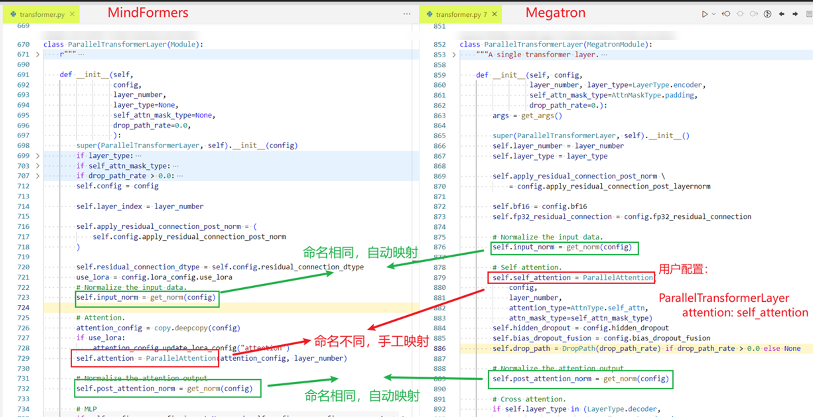
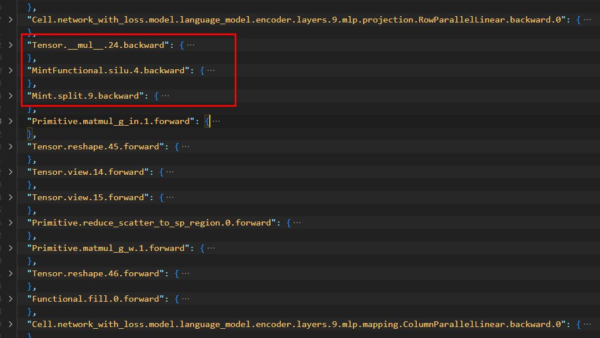
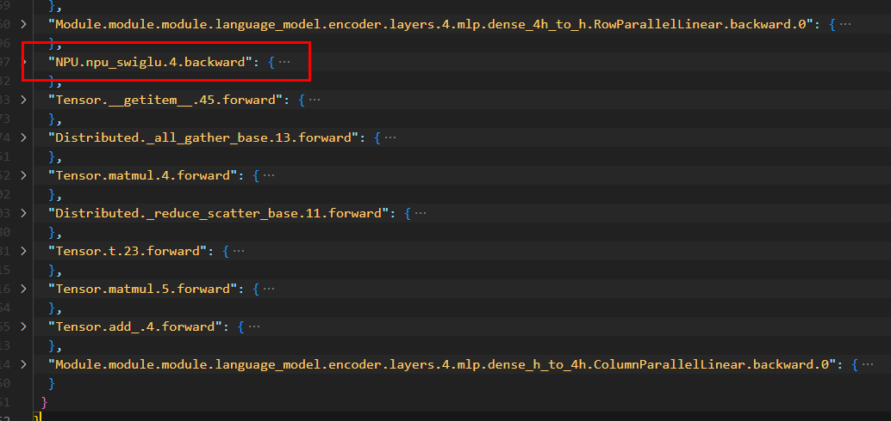
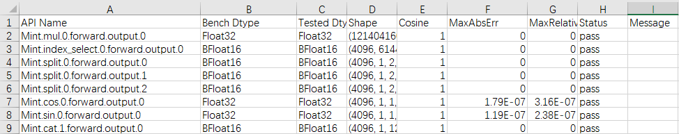

# 动态图场景精度调优工具及案例

[](https://gitee.com/mindspore/docs/blob/master/docs/mindformers/docs/source_zh_cn/acc_optimize/pynative_acc_optimize.md)  

## 精度问题概述和场景

详细介绍请参考[精度问题概述及场景](https://www.mindspore.cn/mindformers/docs/zh-CN/dev/acc_optimize/acc_optimize.html#%E7%B2%BE%E5%BA%A6%E9%97%AE%E9%A2%98%E6%A6%82%E8%BF%B0%E5%92%8C%E5%9C%BA%E6%99%AF)章节。

## 精度问题定位CheckList

在定位算子精度问题之前，首先要排除其他非算子因素的干扰。结合以往精度定位案例，总结了精度定位前的CheckList。为了在定位过程中少走弯路，用户可先根据CheckList进行快速的排查。详细CheckList请参考[精度问题定位CheckList](https://www.mindspore.cn/mindformers/docs/zh-CN/dev/acc_optimize/acc_optimize.html#精度问题定位checklist)章节。  

## 精度定位通用流程

精度定位通用流程请参考[精度定位通用流程](https://www.mindspore.cn/mindformers/docs/zh-CN/dev/acc_optimize/acc_optimize.html#%E6%A8%A1%E5%9E%8B%E8%BF%81%E7%A7%BB%E7%B2%BE%E5%BA%A6%E5%AE%9A%E4%BD%8D%E9%80%9A%E7%94%A8%E6%B5%81%E7%A8%8B)章节。

## 大模型迁移精度标准

大模型迁移精度标准请参考[大模型迁移精度标准](https://www.mindspore.cn/mindformers/docs/zh-CN/dev/acc_optimize/acc_optimize.html#大模型迁移精度标准)章节，该标准仅作为参考。

## msprobe工具介绍

**msprobe** 是 MindStudio Training Tools 工具链下精度调试部分的工具包，主要适用于MindSpore动态图场景的精度问题定位。安装过程请参考[工具安装文档](https://gitee.com/ascend/mstt/blob/master/debug/accuracy_tools/msprobe/docs/01.installation.md)， 主要包括以下几个功能：
| 功能             | 简要说明                                                     | 详细说明                                                     |
| ---------------- | ------------------------------------------------------------ | ------------------------------------------------------------ |
| 数据采集         | msprobe 工具通过在训练脚本内添加 dump 接口、启动训练的方式采集网络中API或模块的输入输出数据。 | [数据采集使用说明](https://gitee.com/ascend/mstt/blob/master/debug/accuracy_tools/msprobe/docs/06.data_dump_MindSpore.md) |
| 精度比对         | msprobe 工具可以对采集下来的数据，进行精度比对。               | [精度比对使用说明](https://gitee.com/ascend/mstt/blob/master/debug/accuracy_tools/msprobe/docs/11.accuracy_compare_MindSpore.md) |
| 精度预检     | MindSpore 动态图精度预检通过扫描昇腾 NPU 上用户训练 MindSpore 模型中的所有 mint API以及部分 Tensor API，输出精度情况的诊断和分析。工具以模型中所有 mint API 前反向的 dump 结果为输入，构造相应的 API 单元测试，将 NPU 输出与标杆（CPU 高精度）比对，计算对应的精度指标，从而找出 NPU 中存在精度问题的 mint API。 | [精度预检使用说明](https://gitee.com/ascend/mstt/blob/master/debug/accuracy_tools/msprobe/docs/09.accuracy_checker_MindSpore.md) |
| 溢出检测    | msprobe 工具提供溢出检测功能，针对网络中的每一个API进行输出数据的溢出检测。 | [溢出检测使用说明](https://gitee.com/ascend/mstt/blob/master/debug/accuracy_tools/msprobe/docs/13.overflow_check_MindSpore.md) |
| 梯度状态监测 | 采集梯度数据并进行梯度相似度比对，可以精准定位出现问题的 step。 | [梯度状态检测使用说明](https://gitee.com/ascend/mstt/blob/master/debug/accuracy_tools/msprobe/docs/17.grad_probe.md) |  

以下将以两个常用的功能 **精度比对** 和 **精度预检** 为例，介绍 msprobe 工具使用的基本流程。

### 精度比对定位案例

#### 总体定位流程

1. 首先针对MindSpore实现的模型和PyTorch实现的模型进行数据dump，由于两侧代码在API粒度上可能无法完全对齐，因此可以先使用模块级数据dump，进行模块粒度的比对分析。
2. 根据模块级数据的比对结果，找到第一个精度无法对齐的模块，对模块进行更细粒度的API级别数据dump。
3. 对展开后的模块内部数据进行比对分析，确认问题点。

#### 详细步骤

1. **工具配置**  

    配置config.json文件："level"为"L0", 代表为模块级别数据dump， "task"为"tensor"代表采集真实数据。"step" 指定为第1个step（从0开始计数），配置文件字段详见[配置文件介绍](https://gitee.com/ascend/mstt/blob/master/debug/accuracy_tools/msprobe/docs/02.config_introduction.md)。  

    tensor模式（保存统计信息和真实数据，需较大磁盘空间）如下：

    ```json
    {
        "task": "tensor",
        "dump_path": "/path/to/dump/data",
        "rank": [],
        "step": [0],
        "level": "L0",
        "tensor":{
            "scope": [],
            "list": [],
            "data_mode": ["all"]
        }
    }
    ```

    统计信息md5模式（保存统计信息以及md5值，需要比较二进制一致场景推荐使用）如下：

    ```json
    {
        "task": "statistics",
        "dump_path": "/path/to/dump/data",
        "rank": [],
        "step": [0],
        "level": "L0",
        "statistics":{
            "scope": [],
            "list": [],
            "data_mode": ["all"],
            "summary_mode": "md5"
        }
    }
    ```  

2. **训练代码配置**  

    找到网络模型的训练代码（需要找到训练迭代循环的train方法），在训练循环中插入工具的dump接口使能数据dump。

    ```python
    # 首先导入msprobe工具的PrecisionDebugger类
    from msprobe.mindspore import PrecisionDebugger

    # 实例化PrecisionDebugger类，并传入config.json文件路径
    debugger = PrecisionDebugger(config_path="/path/to/config.json")
    ...
    ...
    ...
    net = Net()

    # 在训练循环中，插入工具的dump代码
    def train(net):
        ...

        for data in dataset:
            # 开启数据dump， start中传入实例化的网络模型
            debugger.start(net)
            output = net(data)
            ...
            # 结束数据dump
            debugger.stop()
            # 更新迭代step数
            debugger.step()

    ```

3. **启动训练**  

    训练结束后查看dump数据，dump数据保存在config.json中的dump\_path字段路径中，dump结果中包括以下文件：  
    **dump.json**: 其中包括所有数据的基本信息以及统计信息。示例如下：

    ```json
    {
    "task": "tensor",
    "level": "L0",
    "dump_data_dir": "/home/dump_file/tensor_ms_L0/step0/rank0/dump_tensor_data",
    "data": {
    "Cell.model.language_model.embedding.word_embeddings.reduce_scatter_to_sp_region.ReduceScatterToSequenceParallelRegion.forward.0": {
    "input_args": [
        {
        "type": "mindspore.Tensor",
        "dtype": "BFloat16",
        "shape": [
        4096,
        1,
        8192
        ],
        "Max": 2.46875,
        "Min": -2.765625,
        "Mean": -0.0001125335693359375,
        "Norm": 2704.0,
        "data_name": "Cell.model.language_model.embedding.word_embeddings.reduce_scatter_to_sp_region.ReduceScatterToSequenceParallelRegion.forward.0.input.0.npy"
        }
    ],
    "input_kwargs": {},
    "output": [
        {
        "type": "mindspore.Tensor",
        "dtype": "BFloat16",
        "shape": [
        1024,
        1,
        8192
        ],
        "Max": 2.46875,
        "Min": -2.515625,
        "Mean": -0.00020885467529296875,
        "Norm": 1448.0,
        "data_name": "Cell.model.language_model.embedding.word_embeddings.reduce_scatter_to_sp_region.ReduceScatterToSequenceParallelRegion.forward.0.output.0.npy"
        }
       ]
      }
     }
    }
    ```  

    **stack.json**: 包括所有前向数据的调用栈信息，可以将数据关联到对应代码行。示例如下：

    ```json
    {
    "Cell.model.language_model.embedding.word_embeddings.reduce_scatter_to_sp_region.ReduceScatterToSequenceParallelRegion.forward.0": [
    "File /home/python3.9/site-packages/mindspore/nn/cell.py, line 507, in _run_construct, \n output = self._run_forward_hook(inputs, output)",
    "File /home/python3.9/site-packages/mindspore/nn/cell.py, line 759, in _complex_call, \n output = self._run_construct(*args, **kwargs)",
    "File /home/python3.9/site-packages/mindspore/nn/cell.py, line 747, in __call__, \n return self._complex_call(*args, **kwargs)",
    "File /home/mindformers/experimental/distri_cores/tensor_parallel/layers.py, line 770, in construct, \n output = self.reduce_scatter_to_sp_region(output_parallel)",
    "File /home/python3.9/site-packages/mindspore/nn/cell.py, line 2462, in _backward_hook_construct, \n outputs = self.construct(outputs, **kwargs)",
    "File /home/python3.9/site-packages/mindspore/nn/cell.py, line 498, in _run_construct, \n output = self._backward_hook_construct(*inputs, **kwargs)",
    "File /home/python3.9/site-packages/mindspore/nn/cell.py, line 745, in __call__, \n return self._run_construct(*args, **kwargs)",
    "File /home/mindformers/experimental/distri_cores/transformer/language_model.py, line 151, in construct, \n embeddings = self.word_embeddings(input_ids)",
    "File /home/python3.9/site-packages/mindspore/nn/cell.py, line 2460, in _backward_hook_construct, \n outputs = self.construct(*outputs, **kwargs)",
    "File /home/python3.9/site-packages/mindspore/nn/cell.py, line 498, in _run_construct, \n output = self._backward_hook_construct(*inputs, **kwargs)",
    "File /home/python3.9/site-packages/mindspore/nn/cell.py, line 745, in __call__, \n return self._run_construct(*args, **kwargs)",
    "File /home/mindformers/experimental/distri_cores/transformer/language_model.py, line 391, in construct, \n text_embedding_out = self.embedding(enc_input_ids, enc_position_ids,",
    "File /home/python3.9/site-packages/mindspore/nn/cell.py, line 2460, in _backward_hook_construct, \n outputs = self.construct(*outputs, **kwargs)",
    "File /home/python3.9/site-packages/mindspore/nn/cell.py, line 498, in _run_construct, \n output = self._backward_hook_construct(*inputs, **kwargs)",
    "File /home/python3.9/site-packages/mindspore/nn/cell.py, line 745, in __call__, \n return self._run_construct(*args, **kwargs)",
    "File /home/model/gpt_model.py, line 104, in construct, \n lm_output = self.language_model(tokens,",
    "File /home/python3.9/site-packages/mindspore/nn/cell.py, line 2460, in _backward_hook_construct, \n outputs = self.construct(*outputs, **kwargs)",
    "File /home/python3.9/site-packages/mindspore/nn/cell.py, line 498, in _run_construct, \n output = self._backward_hook_construct(*inputs, **kwargs)",
    "File /home/python3.9/site-packages/mindspore/nn/cell.py, line 745, in __call__, \n return self._run_construct(*args, **kwargs)",
    "File /home/mindformers/experimental/distri_cores/pipeline_parallel/pipeline_cell.py, line 429, in construct, \n return self.model(*inputs)",
    "File /home/python3.9/site-packages/mindspore/nn/cell.py, line 757, in _complex_call, \n output = self.construct(*args, **kwargs)",
    "File /home/python3.9/site-packages/mindspore/nn/cell.py, line 747, in __call__, \n return self._complex_call(*args, **kwargs)",
    "File /home/mindformers/experimental/distri_cores/pipeline_parallel/schedules.py, line 121, in run_forward, \n output_tensor = model(*input_data, recv_data=None)",
    "File /home//mindformers/experimental/distri_cores/pipeline_parallel/schedules.py, line 735, in forward_backward_pipelining_without_interleaving, \n micro_input_data = run_forward(*micro_input_data,",
    "File /home/mindformers/experimental/distri_cores/training.py, line 409, in forward_backward_with_pipelining, \n loss, logits, grads = forward_backward_pipelining_without_interleaving(",
    "File /home/mindformers/experimental/distri_cores/training.py, line 533, in construct, \n (loss, _), grads = self.forward_backward_func(*inputs_tuple, loss_scale=current_step_loss_scale, **inputs_dict)",
    "File /home/python3.9/site-packages/mindspore/nn/cell.py, line 757, in _complex_call, \n output = self.construct(*args, **kwargs)",
    "File /home/python3.9/site-packages/mindspore/nn/cell.py, line 747, in __call__, \n return self._complex_call(*args, **kwargs)",
    "File /home/mindformers/experimental/distri_cores/training.py, line 655, in train, \n loss, is_finite, loss_scale, learning_rate = train_one_step_cell(**data)",
    "File /home/model/pretrain_gpt.py, line 303, in main, \n train(",
    "File /home/model/pretrain_gpt.py, line 316, in <module>, \n main()"
    ]
    }
    ```

    **construct.json**: 包括模型的结构信息，记录每个模块或API的父模块 ("level"为"L1"时，该文件内容为空)。 示例如下：

    ```json
    {
    "Cell.model.language_model.embedding.word_embeddings.reduce_scatter_to_sp_region.ReduceScatterToSequenceParallelRegion.forward.0": "Cell.model.language_model.embedding.word_embeddings.VocabParallelEmbedding.forward.0",
    "Cell.model.GPTModel.forward.0": null,
    "Cell.model.language_model.TransformerLanguageModel.forward.0": "Cell.model.GPTModel.forward.0",
    "Cell.model.language_model.embedding.Embedding.forward.0": "Cell.model.language_model.TransformerLanguageModel.forward.0",
    "Cell.model.language_model.embedding.word_embeddings.VocabParallelEmbedding.forward.0": "Cell.model.language_model.embedding.Embedding.forward.0",
    "Cell.model.language_model.rotary_pos_emb.RotaryEmbedding.forward.0": "Cell.model.language_model.TransformerLanguageModel.forward.0",
    "Cell.model.language_model.encoder.layers.0.input_norm.FusedRMSNorm.forward.0": "Cell.model.language_model.encoder.layers.0.ParallelTransformerLayer.forward.0",
    "Cell.model.language_model.encoder.ParallelTransformer.forward.0": "Cell.model.language_model.TransformerLanguageModel.forward.0",
    "Cell.model.language_model.encoder.layers.0.ParallelTransformerLayer.forward.0": "Cell.model.language_model.encoder.ParallelTransformer.forward.0",
    "Cell.model.language_model.encoder.layers.0.attention.qkv_proj.forward_impl_.LinearWithGradAccumulationAndAsyncCommunication.forward.0": "Cell.model.language_model.encoder.layers.0.attention.qkv_proj.ColumnParallelLinear.forward.0",
    "Cell.model.language_model.encoder.layers.0.attention.ParallelAttention.forward.0": "Cell.model.language_model.encoder.layers.0.ParallelTransformerLayer.forward.0",
    "Cell.model.language_model.encoder.layers.0.attention.qkv_proj.ColumnParallelLinear.forward.0": "Cell.model.language_model.encoder.layers.0.attention.ParallelAttention.forward.0",
    "Cell.model.language_model.encoder.layers.0.attention.out_proj.forward_impl_.LinearWithGradAccumulationAndAsyncCommunication.forward.0": "Cell.model.language_model.encoder.layers.0.attention.out_proj.RowParallelLinear.forward.0",
    "Cell.model.language_model.encoder.layers.0.attention.out_proj.RowParallelLinear.forward.0": "Cell.model.language_model.encoder.layers.0.attention.ParallelAttention.forward.0",
    "Cell.model.language_model.encoder.layers.0.attention.out_proj.reduce_scatter_to_sp_region.ReduceScatterToSequenceParallelRegion.forward.0": "Cell.model.language_model.encoder.layers.0.attention.out_proj.RowParallelLinear.forward.0",
    "Cell.model.language_model.encoder.layers.0.attn_post_norm.FusedRMSNorm.forward.0": "Cell.model.language_model.encoder.layers.0.ParallelTransformerLayer.forward.0",
    "Cell.model.language_model.encoder.layers.0.hidden_states_dropout.DropoutExt.forward.0": "Cell.model.language_model.encoder.layers.0.ParallelTransformerLayer.forward.0",
    "Cell.model.language_model.encoder.layers.0.post_attention_norm.FusedRMSNorm.forward.0": "Cell.model.language_model.encoder.layers.0.ParallelTransformerLayer.forward.0",
    "Cell.model.language_model.encoder.layers.0.mlp.mapping.forward_impl_.LinearWithGradAccumulationAndAsyncCommunication.forward.0": "Cell.model.language_model.encoder.layers.0.mlp.mapping.ColumnParallelLinear.forward.0",
    "Cell.model.language_model.encoder.layers.0.mlp.ParallelMLP.forward.0": "Cell.model.language_model.encoder.layers.0.ParallelTransformerLayer.forward.0",
    "Cell.model.language_model.encoder.layers.0.mlp.mapping.ColumnParallelLinear.forward.0": "Cell.model.language_model.encoder.layers.0.mlp.ParallelMLP.forward.0",
    "Cell.model.language_model.encoder.layers.0.mlp.projection.forward_impl_.LinearWithGradAccumulationAndAsyncCommunication.forward.0": "Cell.model.language_model.encoder.layers.0.mlp.projection.RowParallelLinear.forward.0",
    "Cell.model.language_model.encoder.layers.0.mlp.projection.RowParallelLinear.forward.0": "Cell.model.language_model.encoder.layers.0.mlp.ParallelMLP.forward.0",
    "Cell.model.language_model.encoder.layers.0.mlp.projection.reduce_scatter_to_sp_region.ReduceScatterToSequenceParallelRegion.forward.0": "Cell.model.language_model.encoder.layers.0.mlp.projection.RowParallelLinear.forward.0",
    "Cell.model.language_model.encoder.layers.0.ffn_post_norm.FusedRMSNorm.forward.0": "Cell.model.language_model.encoder.layers.0.ParallelTransformerLayer.forward.0",
    "Cell.model.language_model.encoder.layers.0.hidden_states_dropout.DropoutExt.forward.1": "Cell.model.language_model.encoder.layers.0.ParallelTransformerLayer.forward.0",
    "Cell.model.language_model.encoder.layers.1.input_norm.FusedRMSNorm.forward.0": "Cell.model.language_model.encoder.layers.1.ParallelTransformerLayer.forward.0",
    "Cell.model.language_model.encoder.layers.1.ParallelTransformerLayer.forward.0": "Cell.model.language_model.encoder.ParallelTransformer.forward.0",
    }
    ```

    **dump\_tensor\_data**: 包括所有数据的npy文件（只在task为“tensor”时存在），完整目录结构如下：

    ```
    ├── dump_path
    │   ├── step0
    │   |   ├── rank0
    │   |   │   ├── dump_tensor_data
    |   |   |   |    ├── Cell.model.language_model.embedding.word_embeddings.reduce_scatter_to_sp_region.ReduceScatterToSequenceParallelRegion.forward.0.output.0.npy
    |   |   |   |    ...
    |   |   |   |    └── Cell.model.language_model.embedding.word_embeddings.reduce_scatter_to_sp_region.ReduceScatterToSequenceParallelRegion.forward.0.input.0.npy  
    │   |   |   ├── dump.json
    │   |   |   ├── stack.json
    │   |   |   └── construct.json
    │   |   ├── rank1
    |   |   |   ├── dump_tensor_data
    |   |   |   |   └── ...
    │   |   |   ├── dump.json
    │   |   |   ├── stack.json
    |   |   |   └── construct.json
    │   |   ├── ...
    │   |   |
    |   |   └── rank7
    │   ├── step1
    │   |   ├── ...
    │   ├── step2
    ```

4. **精度比对**  

    将dump得到的MindSpore侧数据与PyTorch侧数据进行精度比对。首先配置compare.json文件，示例如下：

    ```json
    {
        "npu_path": "/home/dump_file/tensor_l0_ms/step0/rank0/dump.json",
        "bench_path": "/home/dump_file/tensor_l0_pt/step0/rank0/dump.json",
        "stack_path": "/home/dump_file/tensor_l0_ms/step0/rank0/stack.json",
        "is_print_compare_log": true
    }
    ```  

    **npu\_path**为MindSpore侧的dump.json文件路径, **bench\_path**为PyTorch侧的dump.json文件路径, **stack\_path**为MindSpore侧的stack.json文件路径。

    **运行比对命令**  
        详细比对相关命令介绍可参考[精度比对使用说明](https://gitee.com/ascend/mstt/blob/master/debug/accuracy_tools/msprobe/docs/11.accuracy_compare_MindSpore.md)。
        当前场景使用跨框架Cell级别比对，需要在比对时使用层映射功能，传入层映射文件, 执行以下命令

    ```shell
    msprobe -f mindspore compare -i ./compare.json -o ./output -lm ./layer_mapping.yaml
    ```

    **参数说明**

    | 参数名               | 说明                                                         | 是否必选 |
    | -------------------- | ------------------------------------------------------------ | -------- |
    | -i或--input_path           | compare.json文件路径。 | 是       |
    | -o或--output_path          | 配置比对结果文件存盘目录，默认会在当前目录创建output目录。| 否       |
    | -lm或--layer_mapping       | 跨框架比对。配置该参数时表示开启跨框架Layer层的比对功能，指定模型代码中的Layer层后，可以识别对应dump数据中的模块或API。需要指定自定义映射文件*.yaml。自定义映射文件可从MindSpore动态图并行库中获取，也可以参考下方示例自行配置，仅跨框架的Layer层比对场景需要配置。         | 否      |

    **layer\_mapping.yaml** 映射文件内容可参考如下示例：

    ```yaml
    TopLayer:                           # Layer层名称
      network_with_loss: module         # 冒号左侧为MindSpore框架模型代码中嵌套的Layer层名称，冒号右侧为PyTorch框架模型代码中嵌套的Layer层名称

    Embedding:
      dropout: embedding_dropout

    ParallelTransformerLayer:
      attention: self_attention

    ParallelAttention:
      qkv_proj: query_key_value
      out_proj: dense

    ParallelMLP:
      mapping: dense_h_to_4h
      projection: dense_4h_to_h
    ```

    Layer层名称需要从模型代码中获取。
    映射文件中只需配置MindSpore与PyTorch模型代码中功能一致但名称不同的Layer层，名称相同的Layer层会被自动识别并映射。

    

    **分析比对结果**  
        在输出目录查看比对结果的csv文件：
        
        查看表格后发现第一个产生误差的位置为**Cell.network\_with\_loss.model.language\_model.encoder.layers.9.mlp.mapping.ColumnParallelLinear.backward.0.input.0**，从命名中可以看出这个模块的反向的输入存在精度问题，而上一个模块的反向输出没有精度问题，因此怀疑在这两个模块之间的某些计算存在精度问题。

5. **细粒度数据采集与分析**
  通过上一步的表格分析，我们将精度问题出现的区间锁定在了**Cell.network\_with\_loss.model.language\_model.encoder.layers.9.mlp.projection.RowParallelLinear.backward.0.output.0** 和 **Cell.network\_with\_loss.model.language\_model.encoder.layers.9.mlp.mapping.ColumnParallelLinear.backward.0.input.0** 之间。因此我们继续dump这两个模块之间的所有API级别数据，来继续定位。此时将config.json文件中的“level”字段配置为“mix”（代表同时dump模块级以及API级数据），并在“scope”中配置上述两个模块的名字用于锁定区间。

    ```json
    {
        "task":"tensor",
        "dump_path": "./tensor_mix_ms",
        "rank": [],
        "step": [0],
        "level": "mix",
        "tensor": {
            "scope": ["Cell.network_with_loss.model.language_model.encoder.layers.9.mlp.projection.RowParallelLinear.backward.0"，
            "Cell.network_with_loss.model.language_model.encoder.layers.9.mlp.mapping.ColumnParallelLinear.backward.0"],
            "list":[],
            "data_mode": ["all"]
        }
    }
    ```  

    由于我们已经锁定了区间，因此dump数据个数并不多，先分别查看MindSpore侧的dump.json文件和PyTorch侧的dump.json文件进行分析。

    **MindSpore**:

    

    **PyTorch**:

    

    通过查看json文件我们发现在这两个模块间的反向计算中，MindSpore侧对于swiglu的实现是通过手动实现的3个API拼接而成，而PyTorch侧的swiglu则直接使用了融合API，直接调用了npu\_swiglu进行计算，因此怀疑两边可能会存在精度误差。随后将PyTorch侧的融合api改写成相同api拼接计算，发现精度问题消失。

### msprobe工具精度预检案例

#### 数据采集

首先需要使用数据采集功能将网络中所有的API采集出来，若将"task"配置为"tensor"采集，在预检进行单元测试时就会使用真实数据输入。若将"task"配置为"statistics"采集，则单元测试时会随机生成数据输入，"level"需设置为"L1"代表进行API级别dump。

```json
{
    "task":"tensor",
    "dump_path": "./tensor_l1_ms",
    "rank": [],
    "step": [0],
    "level": "L1",
    "tensor": {
        "scope": [],
        "list":[],
        "data_mode": ["all"]
    }
}  
```

#### 精度预检 (只支持mint API和部分Tensor API)

使用msprobe工具进行精度预检，命令如下：

```shell
msprobe -f mindspore run_ut -api_info ./tensor_l1_ms/step0/rank0/dump.json -o ./output  
```

#### 精度预检结果分析  

预检执行结果包括 `accuracy_checking_result_{timestamp}.csv` 和 `accuracy_checking_details_{timestamp}.csv` 两个文件。`accuracy_checking_result_{timestamp}.csv` 属于 API 级，标明每个 API 是否通过测试。建议用户先查看 `accuracy_checking_result_{timestamp}.csv` 文件，对于其中没有通过测试的或者特定感兴趣的 API，根据其 API Name 字段在 `accuracy_checking_details_{timestamp}.csv` 中查询其各个输出的达标情况以及比较指标。通过分析具体指标来定位到底哪些 API 存在精度问题，详细介绍请参见[预检结果说明](https://gitee.com/ascend/mstt/blob/master/debug/accuracy_tools/msprobe/docs/09.accuracy_checker_MindSpore.md#4-%E9%A2%84%E6%A3%80%E7%BB%93%E6%9E%9C)。

预检结果示例：  
  

上图中的Status字段表示API是否通过测试，通过测试的API的Status字段为"pass"，不通过测试的API的Status字段为"error"。当余弦相似度大于0.99，并且最大绝对误差小于0.0001时，API的Status字段为"pass"，否则为"error"。通过精度预检可以发现相同的API在MindSpore和PyTorch的精度表现是否存在差异，以及差异的大小，从而定位到哪些API可能存在精度问题，并进一步分析产生精度差异的原因。