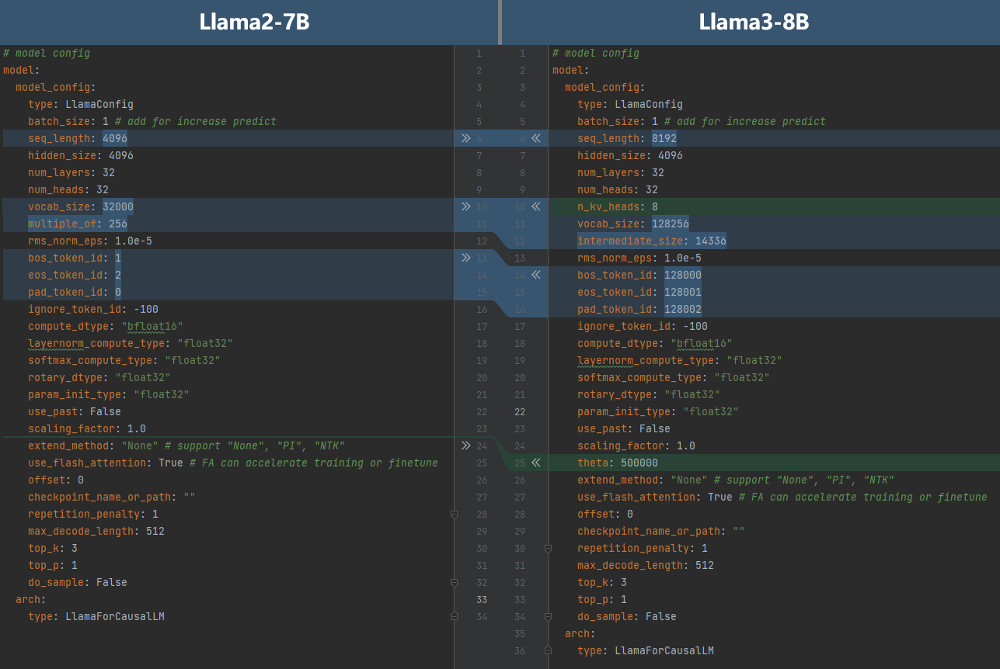

# 开发迁移

[](https://gitee.com/mindspore/docs/blob/master/docs/mindformers/docs/source_zh_cn/advanced_development/dev_migration.md)

本文档将指导用户如何基于MindSpore Transformers开发构建一个大模型，并完成最基本的适配，以拉起训练和推理流程。

## 基于MindSpore Transformers构建大模型

MindSpore Transformers中大模型的基本组成包含配置、模型、分词器（适用于大语言模型）。此外，为了使用run_mindformer.py统一脚本拉起训练或推理流程，还需要准备用于训练或推理的`YAML`配置文件。

### 编写配置

模型配置是一个实例，包含模型的所有信息。MindSpore Transformers中所有模型的`__init__`方法都接收一个模型配置的实例作为入参，模型的所有子模块都通过这个配置实例中所包含的信息来初始化。

MindSpore Transformers提供了[PretrainedConfig](https://www.mindspore.cn/mindformers/docs/zh-CN/dev/models/mindformers.models.PretrainedConfig.html)类，负责提供一些配置的通用方法。所有模型的配置类都应该继承于PretrainedConfig类，开发者只需关心定义所有帮助构建大模型的配置参数：Transformer类大模型通常都拥有`seq_length`、`hidden_size`、`num_layers`、`num_heads`等配置参数，文本类的大模型通常还有`vocab_size`等。

可以参考MindSpore Transformers中Llama模型的配置类[LlamaConfig](https://www.mindspore.cn/mindformers/docs/zh-CN/dev/models/mindformers.models.LlamaConfig.html)。

> 如果您的模型与库内的模型非常相似，可以复用与该模型相同的配置。

### 编写模型

MindSpore Transformers的大模型基于MindSpore框架进行开发，其中开发者只需要关心模型网络本身的实现。

MindSpore Transformers提供了[PretrainedModel](https://www.mindspore.cn/mindformers/docs/zh-CN/dev/models/mindformers.models.PreTrainedModel.html)类，负责存储模型配置并处理加载、保存模型的方法。所有模型的类都应该继承于PretrainedModel类，并且模型的输入应该是统一的，即模型的`construct`方法的入参应该一致，具体入参和含义可以参考MindSpore Transformers中的Llama模型类[LlamaForCausalLM](https://www.mindspore.cn/mindformers/docs/zh-CN/dev/models/mindformers.models.LlamaForCausalLM.html)。同时，模型类必须实现基类的一些抽象方法，包括：

- `prepare_inputs_for_generation`：为模型推理构建输入的方法。
- `prepare_inputs_for_predict_layout`：为分布式加载模型权重构建虚拟输入的方法。

关于它们的具体含义，可以参考[LlamaForCausalLM](https://www.mindspore.cn/mindformers/docs/zh-CN/dev/models/mindformers.models.LlamaForCausalLM.html)中的描述。

> 如果您的模型结构与库内的模型非常相似，可以复用该模型的实现。

### 编写分词器（适用于大语言模型）

分词器（Tokenizer）的作用是处理大语言模型的输入与输出。它在大语言模型的工作流程中是必需的。

MindSpore Transformers提供了[PretrainedTokenizer](https://www.mindspore.cn/mindformers/docs/zh-CN/dev/models/mindformers.models.PreTrainedTokenizer.html)类和[PretrainedTokenizerFast](https://www.mindspore.cn/mindformers/docs/zh-CN/dev/models/mindformers.models.PreTrainedTokenizerFast.html)类，分别是纯Python的实现和使用Rust库的实现。后者实现的区别是：

- 在进行批量处理时速度显著提高；
- 额外包含一些在文本字符串和词元空间映射的方法（例如，获取包含给定字符的词元的索引或与给定词元相对应的字符跨度）

所有分词器的类应该继承于PretrainedTokenizer类或PretrainedTokenizerFast类，具体实现可以参考[LlamaTokenizer](https://www.mindspore.cn/mindformers/docs/zh-CN/dev/models/mindformers.models.LlamaTokenizer.html)和[LlamaTokenizerFast](https://www.mindspore.cn/mindformers/docs/zh-CN/dev/models/mindformers.models.LlamaTokenizerFast.html)。

> 如果您的分词器与库内的分词器非常相似，可以复用该分词器的实现。

### 准备权重和数据集

如已有基于PyTorch的模型权重，可以参考[权重转换文档](https://www.mindspore.cn/mindformers/docs/zh-CN/dev/feature/weight_conversion.html)将权重转换为MindSpore格式的权重。

数据集的准备可以参考[数据集文档](https://www.mindspore.cn/mindformers/docs/zh-CN/dev/feature/dataset.html)，或参考模型文档，如[Llama2说明文档——数据集准备](https://gitee.com/mindspore/mindformers/blob/dev/docs/model_cards/llama2.md#%E6%95%B0%E6%8D%AE%E5%8F%8A%E6%9D%83%E9%87%8D%E5%87%86%E5%A4%87)。

### 准备`YAML`配置文件

MindSpore Transformers使用`YAML`配置文件配置一个任务所需的所有参数，包括模型的配置参数、训练所需的配置参数（优化器、学习率、数据集等）、推理所需的配置参数（分词器等）、分布式并行的配置参数、上下文环境的配置参数等。

由于自定义模型的代码不在MindSpore Transformers库内，代码中的自定义模块没有注册在MindSpore Transformers中，因而不能被自动实例化。这些代码也称为外挂代码（如`research`目录下代码）。因此需要在编写的`YAML`配置文件中的对应模块配置下添加自动注册任意模块的配置项`auto_register`，设置为要注册的API接口的相对导入路径。后续在执行run_mindformer.py脚本拉起任务时添加注册路径的入参`--register_path`，设置为外挂代码所在目录的相对路径。

例如，`research`目录下的Llama3.1-8B模型的推理`YAML`配置文件[`research/llama3_1/predict_llama3_1_8b.yaml`](https://gitee.com/mindspore/mindformers/blob/dev/research/llama3_1/llama3_1_8b/predict_llama3_1_8b.yaml)中，添加了自动注册的配置项`auto_register`，以注册[`research/llama3_1/llama3_1_tokenizer.py`](https://gitee.com/mindspore/mindformers/blob/dev/research/llama3_1/llama3_1_tokenizer.py)中自定义的`Llama3Tokenizer`：

```yaml
...
processor:
  return_tensors: ms
  tokenizer:
    model_max_length: 8192
    vocab_file: "/path/tokenizer.model"
    pad_token: "<|reserved_special_token_0|>"
    type: Llama3Tokenizer
    auto_register: llama3_1_tokenizer.Llama3Tokenizer
  type: LlamaProcessor
...
```

其中在`tokenizer`下配置了`Llama3Tokenizer`的相对导入路径`auto_register: llama3_1_tokenizer.Llama3Tokenizer`。

另外，需要在`tokenizer`下设置`vocab_file`为模型分词器`tokenizer.model`的真实路径。

可以运行如下命令拉起推理任务：

```bash
python run_mindformer.py --config research/llama3_1/predict_llama3_1_8b.yaml --load_checkpoint path/to/llama3_1_8b.ckpt --register_path research/llama3_1 --predict_data "hello"
```

**参数说明**

|       参数        | 说明            |
|:---------------:|:--------------|
|     config      | `YAML`配置文件的路径 |
| load_checkpoint | 加载的权重路径       |
|  register_path  | 外挂代码所在目录的路径   |
|  predict_data   | 推理的输入数据       |

其中设置了`register_path`为外挂代码所在目录的路径`research/llama3_1`，模型权重的准备参考[Llama3.1说明文档——模型权重下载](https://gitee.com/mindspore/mindformers/blob/dev/research/llama3_1/README.md#%E6%A8%A1%E5%9E%8B%E6%9D%83%E9%87%8D%E4%B8%8B%E8%BD%BD)。

配置文件的详细内容及可配置项可以参考[配置文件说明](https://www.mindspore.cn/mindformers/docs/zh-CN/dev/feature/configuration.html)。在实际编写配置文件时，也可以参考库内已有的配置文件，例如[Llama2-7B微调的配置文件](https://gitee.com/mindspore/mindformers/blob/dev/configs/llama2/finetune_llama2_7b.yaml)。

在准备完上述所有基本要素之后，可以参考MindSpore Transformers使用教程中的其余文档进行模型训练、微调、推理等流程的实践。后续模型调试调优可以参考[大模型精度调优指南](https://www.mindspore.cn/mindformers/docs/zh-CN/dev/advanced_development/precision_optimization.html)和[大模型性能调优指南](https://www.mindspore.cn/mindformers/docs/zh-CN/dev/advanced_development/performance_optimization.html)。

### 将模型贡献给MindSpore Transformers开源仓库

可以参考[MindSpore Transformers贡献指南](https://www.mindspore.cn/mindformers/docs/zh-CN/dev/contribution/mindformers_contribution.html)，将模型贡献到MindSpore Transformers的开源仓库，供广大开发者研究和使用。

## MindSpore Transformers大模型迁移实践

### 基于Llama2-7B迁移Llama3-8B

Llama3-8B与Llama2-7B拥有相同的模型结构，只有部分模型参数、分词器和权重不同。

#### 模型配置

以下对比了Llama2-7B和Llama3-8B的模型配置：



其中的区别有：

- Llama3-8B的序列长度为8192，将`seq_length`修改为`8192`。
- Llama3-8B使用GQA，每个key-value组的head数量为8，设置`n_kv_head`为`8`。
- Llama3-8B的词表大小为128256，将`vocab_size`修改为`128256`。
- Llama3-8B扩充了Feed-Forward Network的隐藏层大小至14336，设置`intermediate_size`为`14336`。
- Llama3-8B修改了特殊词元索引，修改`bos_token_id`为`128000`、`eos_token_id`为`128001`、`pad_token_id`为`128002`。
- Llama3-8B修改了旋转位置编码中的theta值为500000，修改`theta`为`500000`。

修改Llama2-7B的`YAML`配置文件中的对应内容即可得到[Llama3-8B的配置文件](https://gitee.com/mindspore/mindformers/blob/dev/research/llama3/llama3_8b/finetune_llama3_8b.yaml)。

#### 分词器

Llama3-8B重新实现了分词器。对照官方的实现，继承MindSpore Transformers中的PretrainedTokenizer实现Llama3Tokenizer，编写在[llama3_tokenizer.py](https://gitee.com/mindspore/mindformers/blob/dev/research/llama3/llama3_tokenizer.py)中。

#### 权重转换

Llama3-8B的参数命名和Llama2-7B一致，因此可以复用Llama2-7B的权重转换流程，参考[Llama3文档的权重转换章节](https://gitee.com/mindspore/mindformers/blob/dev/research/llama3/README.md#%E6%A8%A1%E5%9E%8B%E6%9D%83%E9%87%8D%E8%BD%AC%E6%8D%A2)。

#### 数据集处理

由于Llama3-8B的分词器与Llama2-7B不同，因此Llama3-8B需要在Llama2-7B的数据集处理脚本的基础上，替换Llama3-8B的分词器对数据进行预处理，参考[conversation.py](https://gitee.com/mindspore/mindformers/blob/dev/research/llama3/llama3_conversation.py)和[llama_preprocess.py](https://gitee.com/mindspore/mindformers/blob/dev/research/llama3/llama3_preprocess.py)。

关于MindSpore Transformers中Llama3的具体实现，可以参考MindSpore Transformers仓库中[Llama3的文件夹](https://gitee.com/mindspore/mindformers/tree/dev/research/llama3)。关于MindSpore Transformers中Llama3的使用，可以参考[LLama3的说明文档](https://gitee.com/mindspore/mindformers/blob/dev/research/llama3/README.md)。
