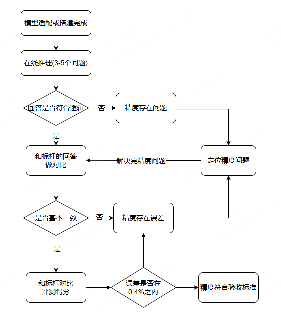

# 推理精度比对

[](https://gitee.com/mindspore/docs/blob/r2.7.1/docs/mindformers/docs/source_zh_cn/advanced_development/inference_precision_comparison.md)

## 概述

对于模型来说，在适配和开发完成之后，用户如果要使用新适配或者新开发的模型来进行推理，需要确保推理精度的正确性。推理的精度验收标准主要是在于业内开源的数据集评测得分，或者用户自己准备的闭源数据集。该文档主要提供一个推理精度比对的整体流程，以及精度存在问题后的一些定位思路和手段。

## 精度验收流程

### 整体流程

目前推理的开发流程中，验证精度的过程会先看在线推理的精度，如果在线推理的精度正常，才会进一步验证数据集的评测得分。下面流程图是整个精度验证的过程。

<div style="text-align: center;">
  
</div>

### 在线推理验证

在线推理验证的主要目标是验证单条或者多条输入的推理输出的精度是否正常。如果所有输出都正常，并且和GPU环境下标杆的输出能够基本对齐，可以进入下一步验证数据集评测。
关于模型如何执行在线推理任务可以参考[推理指南](https://www.mindspore.cn/mindformers/docs/zh-CN/r1.7.0/guide/inference.html)。

### 数据集评测

通过在线推理验证之后，模型在保持输入相同的情况下，标杆的输出可以基本保持一致。但是数据量比较小，并且问题涉及领域不够全面，需要通过数据集评测来最终验证模型的精度。只有数据集的评测得分和标杆数据能够满足0.4%的误差，才能证明模型的精度符合验收标准。
关于模型如何用数据集评测可以参考[评测指南](https://www.mindspore.cn/mindformers/docs/zh-CN/r1.7.0/guide/evaluation.html)。

## 定位精度问题

- 场景：预设模型权重没问题，即GPU环境下模型推理精度正常，将GPU的输出作为标杆。
- 可能出现的情况：针对该文档提供的精度比对流程可能会出现的两种情况。第一种是精度存在问题，第二种是精度存在误差。

### 精度存在问题

精度存在问题一般是指推理任务出现回答乱码或者完全没有逻辑的情况，常见的原因一般是权重加载存在问题，或者网络的代码实现存在问题。

#### 1. 权重加载问题

排查流程如下：

1. 在执行的推理任务的日志中搜索以下关键字。

   ```text
   These parameters are not loaded in the network:
   These parameters are not loaded in the weights:
   ```

2. 根据日志的内容分析权重的加载是否正确。两条日志冒号后面的KEY值分别代表网络需要加载的所有权重中实际没有加载的权重的KEY值，以及权重文件里的所有权重中没有加载进网络的权重的KEY值。

可能出现的具体问题和解决方法：

- 问题 1：冒号后存在KEY值，部分权重没有加载进网络。
    - 原因：网络的KEY值和权重的KEY值没有一一对应上。
    - 定位方法：结合网络结构和没有加载的权重分析，每个KEY值对应的权重没有加载是否合理。
    - 解决方法：对不合理权重KEY值的转换重新转换，具体参考[新模型权重转换适配教程](https://www.mindspore.cn/mindformers/docs/zh-CN/r1.7.0/advanced_development/weight_transfer.html)。
- 问题 2：冒号后不存在任何KEY值，所有权重都加载进网络，但依旧可能存在权重融合或者拆分过程中切分不对导致加载错数据。
    - 原因：大多是开源的权重中存在融合的权重，有时候需要拆分之后再和其他权重融合，过程中有可能会涉及各种切分，容易出现问题。
    - 定位方法：先重点分析容易出错的地方，如Attention中qkv的部分，结合网络结构中的写法，分析权重加载过程中的各种操作是否正确。如果理论分析不出来，可以直接将对怀疑的部分的权重打印出来和标杆的对应位置加载的权重对比。
    - 解决方法：通过分析或者实验找到权重加载错误的模块，解决方法参考[新模型权重转换适配教程](https://www.mindspore.cn/mindformers/docs/zh-CN/r1.7.0/advanced_development/weight_transfer.html)。

#### 2. 新模型的搭建存在问题

排查流程如下：

在适配模型结构相似的新模型时，一般会直接通过替换配置文件，然后直接加载权重执行推理任务。这样容易忽略一些细节上的差别，需要逐模块排查这些差异点。

可能出现的问题和解决方法：

- 问题：不同的问题推理输出依旧不变。
    - 可能的原因：MLP模块、MoE模块以及Attention模块涉及的linear模块不需要bias，但是强加了bias，输入输出存在nan等。
    - 定位方法：可以直接打印各个模块的输入输出，观察打印结果是否正常。
    - 解决方法：确定某个模块有问题之后，对比标杆确定该模块是否需要bias。如果不需要bias，将bias的配置项设置成False即可。

### 精度存在误差

精度存在误差一般是指在线推理的回答符合逻辑但是不能对齐标杆的回答，或者数据集评测得分不满足验收标准的情况。

#### 1. 在线推理的回答符合逻辑但是不能对齐标杆的回答

推理任务出现回答符合逻辑但精度和标杆不一致的根本原因是某个模块引起了误差，误差的大小会决定回答和标杆对不齐的token出现的早晚。

可能出现的问题和解决方法：

- 问题：首Token一致，但是在推了10个token左右就出现精度不一致的现象。
    - 定位方法：一般采用打印和dump数据的方式去对比数据的差异。如果打印的数据无法通过肉眼观察出是否在可接受范围之内，那么可以采用dump数据，然后通过对比工具判定该模块是否符合精度标准。对比工具可以使用MindSpore Transformers提供的方法进行对比，使用方法如下：

      ```py
      import numpy as np
      from tests.utils.precision_utils import PrecisionChecker

      checker = PrecisionChecker()
      gpu_data = np.load('path/to/gpu.npy')
      npu_data = np.load('path/to/npu.npy')
      checker.check_precision(gpu_data, npu_data)
      ```

      > 关于如何dump数据可以参考MindSpore官网提供的[Dump教程文档](https://www.mindspore.cn/tutorials/zh-CN/r2.7.1/debug/dump.html)。
    - 可能的原因：某个输入的dtype类型不一致等导致的精度损失。
    - 解决方法：对齐标杆的dtype。

#### 2. 数据集评测得分不满足验收标准

按照精度比对的流程，数据集评测的前提是在线推理的回答已经符合逻辑，但是现在出现数据集评测得分和标杆数据存在较大差异，其原因是部分回答和标杆的回答无法对齐。

定位方法：找出输出和标杆回答无法对齐的问题，将问题单独截取出来作为在线推理的输入，然后按照[在线推理的回答符合逻辑但是不能对齐标杆的回答](#1-在线推理的回答符合逻辑但是不能对齐标杆的回答)的定位思路去解决问题。
