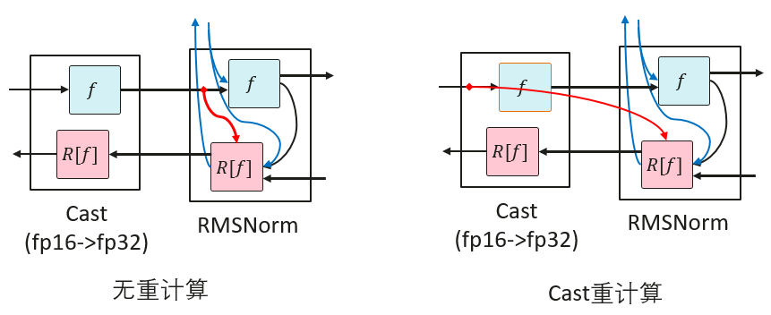
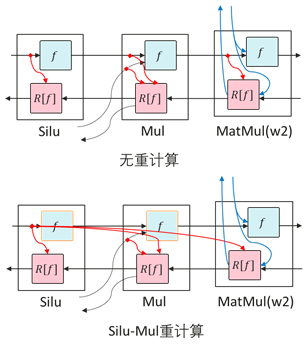
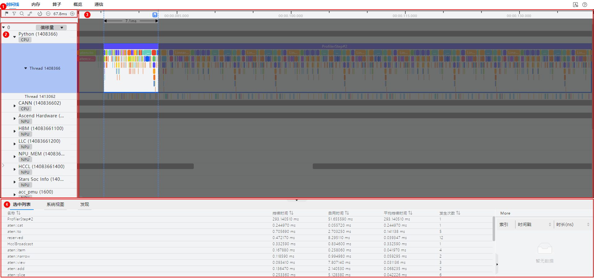
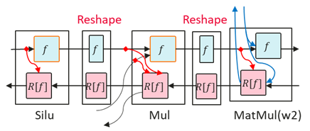

# 大模型性能调优指南

[](https://gitee.com/mindspore/docs/blob/master/docs/mindformers/docs/source_zh_cn/advanced_development/performance_optimization.md)

## 概述

本文档主要介绍大语言模型的性能调优，详细介绍了性能调优相关的基础理论知识、相关工具使用指导和性能调优整体思路，以及案例分享。开始大模型性能调优工作时，应具备大模型的基础知识。为避免发散，本文档将不会解释大模型相关基础概念，聚焦性能调优介绍。

性能一般讨论的是模型训练性能，即在指定模型和输入数据的情况下，完成一次端到端训练所需要时间。端到端是指完成一个人工智能模型单步训练的过程，时间主要由以下部分构成：

* 数据加载时间：指的是模型加载训练数据和权重的时间，包括将数据从硬件存储设备读取到CPU、在CPU中进行数据的预处理、以及CPU数据传输到NPU的过程。对于需要切分到若干张NPU上的模型，数据加载时间还包括从一张NPU广播到其他NPU上的时间。

* 模型正向计算（Forward）反向计算（Backward）时间，包含前向的数据计算和反向的数据微分求导。

* 优化器时间：指的是模型参数更新时间。

* 模型后处理时间：指的是优化器更新后，包括数据的后处理或者必要的同步操作，通常取决于模型特定的操作。

* 通信时间：概念比较宽泛，涵盖单节点的卡间通信耗时和多节点的节点间通信耗时。通过MindSpore的并行技术，通信和计算通常可以并行执行，此时部分通信时间会被掩盖，因此一般考虑未被计算掩盖的通信时间。

* 调度时间：指模型从CPU指令到调用NPU内核所需要的时间。

性能调优旨在通过优化模型算法、参数和并行策略等手段，降低上述各部分时间，一般重点关注模型前向反向时间以及通信时间进行优化。

## 基础简介

### 性能指标

性能通常通过吞吐量指标进行评估，对于大语言模型，吞吐量主要是指每秒钟每张卡处理的token数量。计算公式如下：

$$
Throughput = SeqLength * (sample/s/p)
$$

(sample/s/p)的计算结果可以直接从日志中获取，也可以从日志中分别获取对应字段再进行计算。

各字段含义如下：

* SeqLength：指序列的长度，在文本处理过程中，输入的文本需要转换成数字序列，这些数字序列作为模型的输入。SeqLength就是指这些数字序列的长度，即文本的长度。在模型训练和推理的过程中，需要设置一个固定的SeqLength，以便进行批处理和计算。较长的SeqLength可以提高模型的准确性，但会增加计算量和内存消耗；而较短的SeqLength则会减少计算量和内存消耗，但可能会降低模型的准确性。

* sample：其值等于全局批量大小，即global_batch_size的值。在分布式训练中，数据被分成多个部分，每个部分被送到不同的NPU上进行计算。这些NPU上的Batch Size之和就是全局批量大小。全局批量大小的选择是一个重要的决策，因为它会直接影响模型的训练性能。如果全局批量过小，每个NPU上的Batch Size可能会太小，导致模型的收敛速度变慢；如果全局批量过大，每个NPU上的Batch Size可能会太大，导致NPU内存不足或者模型的精度下降。一个找到最佳Batch Size的经验法则是使其达到NPU对给定数据类型的内存限制，即Batch Size占满NPU内存。

* s：即per_step_time，以秒为单位，指在训练过程中，每一步所花费的时间。

* p：即parallel_num，指数据并行维度大小。

### 并行特性简介

在大模型训练中，由于数据量和模型复杂度的增加，单个计算节点的计算能力往往难以满足训练的需求。为了提高训练效率和加速训练过程，通常采用并行策略将计算任务分配给多个计算节点。

并行策略通常分为以下几种:

* 数据并行（Data Parallelism，简称DP）

* 模型并行（一般指张量并行Tensor Parallelism，简称TP）

* 流水并行（Pipeline Parallelism，简称PP）

* 优化器并行（Optimizer Parallelism，简称OP）

* 序列并行（Sequence Parallelism，简称SP）

* 多副本并行

在实际应用中，通常会采用多种并行策略和优化手段，例如使用优化器并行和重计算等方式，以减少模型对内存的使用并提高训练效率。并行策略设计与模型的效率密切相关，因此在模型调优之前先确定一组或多组较优的并行策略，是至关重要的。

详细介绍参考文档[并行策略指南](https://www.mindspore.cn/mindformers/docs/zh-CN/dev/feature/parallel_training.html)。

对于不同的参数量规格的模型，可参考以下并行策略选择方向：

* 模型规模较小时(~7B)，可使用纯数据并行+优化器并行，如果内存富裕可以进一步开启梯度累积；
* 模型规模适中时(~13B)，可进一步使用流水线并行，并调整重计算，让单卡显存能够支持切分后的模型训练，并减少引入的通信量；
* 模型规模较大时，需开启模型并行以降低权重的显存占用，同时短序列并行与多副本并行也建议开启以提升性能；
* 在训练长序列时(>=32k)，可使用长序列并行及相关特性以减小长序列激活值的显存使用。

### 重计算

MindSpore采用反向模式的自动微分，根据正向图计算流程自动推导出反向图，正向图和反向图共同构成了完整的计算图。在计算某些反向算子时，需要使用一些正向算子的计算结果，导致这些计算结果需要保存在内存中，直到依赖它们的反向算子计算完成，占用的内存才会被复用。这一现象提高了训练的内存峰值，在大规模网络模型中尤为显著。

为了解决这个问题，MindSpore提供了重计算的功能，可以不保存正向算子的计算结果，从而释放内存以供复用。在计算反向算子时，如果需要正向的结果，再重新计算正向算子。

重计算分为以下两种方式：

* 完全重计算

  适用于内存资源极为受限的极端环境。在这种模式下，除了保存输入数据外，所有激活值均在需要时重新计算，最大限度地减少了对内存的依赖，然而计算量也会显著增加。

* 选择性重计算

  该策略保留了那些占用较小内存空间但重计算成本较高的激活值，如Cast、SiLU-Mul。同时，对占用较大内存但重计算成本相对较低的激活值执行重计算。此方法在保证模型性能的同时，实现了内存使用的高效管理。

#### Cast重计算

RMSNorm一般使用高精度（FP32）计算，计算之前需要将输入从低精度（FP16或BF16）通过Cast转成高精度（FP32）。RMSNorm需要保存输入以用于反向计算。因此对Cast进行重计算可以只保存Cast的低精度输入，而非高精度输入，从而可以减少一半的内存占用，达到节省内存的效果。



然而从高精度到低精度的Cast算子进行重计算，会导致后面的算子原本只需要保存Cast之后的低精度内存，但是由于Cast算子重计算，需要保存高精度内存，反而会导致内存占用增加。

#### SiLU-Mul重计算

在FeedForward中，中间部分内存占用通常较大。由于SiLU和Mul重计算代价较小，对SiLU和Mul算子重计算，可以省下w2的MatMul和Mul的第一个输入的内存。



### 工具介绍

#### profiler工具

MindSpore Transformers本身集成了profiling数据采集的功能，使用步骤如下：

1. 修改配置文件

   在模型的配置文件中开启profiling开关，需修改的参数如下：

   ```yaml
   profile: True                  # 是否开启性能分析工具
   profile_start_step: 5          # 性能分析开始的step
   profile_stop_step: 6           # 性能分析结束的step
   init_start_profile: False      # Profiler初始化的时候开启，开启后profile_start_step将不生效。
   profile_communication: False   # 是否在多NPU训练中收集通信性能数据
   profile_memory: True           # 收集Tensor内存数据
   mstx: True                     # 是否收集mstx时间戳记录，包括训练step、通信算子等
   ```

   profile_start_step和profile_stop_step用于确定采集区间，因为采集耗时较长，不推荐将区间设置过大，建议设置为2到4步。且由于第一个step涉及编译，推荐从第3步开始采集。

   profiling全部可配置参数如下：

   | 参数                    | 说明                                                                                         | 类型   |
   |-----------------------|--------------------------------------------------------------------------------------------|------|
   | profile               | 是否开启性能采集工具，默认值为`False`。                                                                    | bool |
   | profile_start_step    | 设置开始采集性能数据的step数，默认值为`1`。                                                                  | int  |
   | profile_stop_step     | 设置停止采集性能数据的step数，默认值为`10`。                                                                 | int  |
   | profile_communication | 设置是否在多设备训练中收集通信性能数据，使用单卡训练时，该参数无效，默认值为`False`。                                             | bool |
   | profile_memory        | 设置是否收集Tensor内存数据，默认值为`True`。                                                               | bool |
   | profile_rank_ids      | 设置开启性能采集的rank ids，默认值为`None`，表示所有rank id均开启性能采集。                                           | list |
   | profile_pipeline      | 设置是否按流水线并行每个stage的其中一张卡开启性能采集，默认值为`False`。                                                 | bool |
   | profile_output        | 设置保存性能采集生成文件的文件夹路径。                                                                        | str  |
   | profile_level         | 设置采集数据的级别，可选值为(0, 1, 2)，默认值为`1`。                                                           | int  |
   | with_stack            | 设置是否收集Python侧的调用栈数据，默认值为`False`。                                                           | bool |
   | data_simplification   | 设置是否开启数据精简，开启后将在导出性能采集数据后删除FRAMEWORK目录以及其他多余数据，默认为`False`。                                 | int  |
   | init_start_profile    | 设置是否在Profiler初始化时开启采集性能数据，设置`profile_start_step`时该参数不生效。开启`profile_memory`时需要将该参数设为`True`。 | bool |
   | mstx                  | 设置是否收集mstx时间戳记录，包括训练step、HCCL通信算子等，默认值为`False`。                                            | bool |

2. 查看数据

   采集工具默认会在`./output`路径下创建一个`profile`文件夹，该路径可通过模型yaml配置文件的`profile_output`或`output_dir`字段进行设置，前者更优先。

   生成的文件及介绍参考[profile文件介绍](https://www.mindspore.cn/tutorials/zh-CN/master/debug/profiler.html)，主要收集算子、任务等运行耗时、CPU利用率及内存消耗等信息，用于性能调优分析。

   此外还可以通过统计集群中每个rank的计算时间、通信时间、未掩盖通信时间，分析集群中不同rank间的性能情况，以此判断是否存在计算负载不均衡的情况，影响了集群的整体效率，并对此进行针对性优化。

3. 查看mstx信息

   mstx记录信息不会由采集工具直接生成，需要手动通过命令行从`profile`文件夹中提取。以第一张卡为例，如下为相应的目录结构:

   ```sh
   output
   └── profile
       └── rank_0
           └── {hostname}_{pid}_{时间戳}_ascend_ms
               └── PROF_{数字}_{时间戳}_{字符串}
   ```

   执行以下命令：

   ```shell
   msprof --export=on --output={path}/output/profile/rank_0/{hostname}_{pid}_{时间戳}_ascend_ms/PROF_{数字}_{时间戳}_{字符串} # 替换为实际路径
   ```

   执行完毕后会在PROF_{数字}_{时间戳}_{字符串}目录下生成`mindstudio_profiler_output`文件夹，其中命名为`msprof_tx_{时间戳}.csv`的文件即为mstx记录信息，包含训练step、HCCL通信算子等数据的时间戳和相应的描述内容，如下图所示：

   

#### DryRun内存评估工具

当前内存评估工具主要使用MindSpore的模拟编译(dryrun)。模拟编译使用方式在MindSpore的[环境变量文档](https://www.mindspore.cn/docs/zh-CN/master/api_python/env_var_list.html)和[msrun文档](https://www.mindspore.cn/tutorials/zh-CN/master/parallel/msrun_launcher.html)中呈现。可以通过在训练进程开始前使能环境变量`export MS_SIMULATION_LEVEL=1`或者在msrun启动项配置`--sim_level`功能，即可拉起模拟编译的训练进程。

可以使用DryRun分析所需内存是否超过最大可用内存。如果超过，需要重新调整配置。最大可用内存可通过如下字段配置，推荐值为`58GB`，如果设置过大，可能导致其他组件内存不足。通常使用的集群训练规模越大，其他组件内存占用越大，MindSpore进程可用的最大内存也会随之降低，例如在千卡集群上，该最大可用内存值一般设置为`54GB`。

```yaml
context:
  max_device_memory: "58GB"
```

新建脚本`dry_run.sh`，脚本内容如下：

```shell
#!/bin/bash

YAML_FILE=$1
RANK_SIZE=$2
PIPELINE_STAGES=$3
RANK_GAP=$((RANK_SIZE/PIPELINE_STAGES))
ROOT_PATH=`pwd`

export MS_SIMULATION_LEVEL=1
export RANK_SIZE=$RANK_SIZE

rm -rf output_dryrun
mkdir output_dryrun
for((i=0; i<$PIPELINE_STAGES; i++))
do
    export DEVICE_ID=$i
    export RANK_ID=$((i*RANK_GAP))
    echo "start training for rank $RANK_ID, device $DEVICE_ID"
    # 需要正确指定 run_mindformer.py 路径
    python ./run_mindformer.py --config $ROOT_PATH/$1 &> ./output_dryrun/rank_$RANK_ID.log &
done
```

执行脚本：

```shell
bash dry_run.sh $train.yaml $rank_size $stage
```

三个参数含义如下：

* $train.yaml：需要调试的配置文件
* $rank_size：模拟卡数
* $stage：阶段数，等于流水线并行数量

执行完成后，输出目录`output_dryrun`下会生成每个stage的日志信息，每个日志末尾会打印如下信息：

```text
Device MOC memory size: 62432M
MindSpore Used memory size: 59392M
MindSpore memory base address: 0
Used peak memory usage (without fragments): 48874M
Actual peak memory usage (with fragments): 48874M
```

Used peak memory usage (without fragments)：表示不包含碎片的NPU内存使用峰值，重点关注该值，建议不超过最大可用内存。

Actual peak memory usage (with fragments)：表示包含碎片的NPU内存使用峰值。

注意事项：

1. 使用`dryrun`模拟编译时，若数据集过大，会导致运行时间过长，因此需要控制数据集大小，只需跑完几个step即可；
2. 在pipeline并行场景下，每个PP stage在训练过程中所需的内存不同，因此至少每个stage都需要一个rank进行dryrun；换言之，同一个PP stage内所有rank的内存情况都完全一致，仅需跑一个rank的模拟编译即可分析整体内存情况；
3. `dryrun`任务也会生成分布式策略文件，启动`dryrun`任务即可生成各PP stage的策略文件，由于相同stage的分布式策略文件完全相同，因此只需要每个PP stage获得一个策略文件即可；
4. 运行结束后将会在日志中打印当前任务所消耗的内存大小，可根据该信息评估内存使用，进行内存调优。

#### MindStudio Insight

MindStudio Insight提供了性能数据的多种呈现形式，包括Timeline视图、通信分析和计算耗时等可视化呈现，以便用户分析潜在的性能瓶颈，并指导如何采取措施消除或减少这些瓶颈。MindStudio Insight支持在Timeline视图中查看集群场景下Profiling导出的数据，并以单卡为维度进行展示，可以支持20GB以上的集群性能文件分析。

点击[MindStudio Insight下载链接](https://www.hiascend.com/developer/download/community/result?module=pt+sto+cann)，选择合适的版本安装。

打开MindStudio Insight工具，单击界面左上方工具栏中的“+”，在弹窗中选择要解析并导出的文件或目录，然后单击“确认”导入。

MindStudio Insight工具以时间线（Timeline）的形式呈现全流程在线推理、训练过程中的运行情况，并按照调度流程来呈现整体的运行状况，并且该工具支持集群Timeline展示。通过分析时间线，用户可以对在线推理/训练过程进行细粒度的分析，如迭代间隙是否过长、算子执行时间等，并提供易用性功能辅助用户快速定位性能瓶颈。

时间线（Timeline）界面包含工具栏（区域一）、时间线树状图（区域二）、图形化窗格（区域三）和数据窗格（区域四）四个部分，如图所示。



* 区域一

  工具栏，包含常用快捷按钮，从左至右依次为标记列表、过滤（支持按卡或按专项层过滤展示）、搜索、连线事件、复原、时间轴缩小和时间轴放大。

* 区域二

  时间线树状图，显示集群场景下各“Card”的分层信息，一层级为“Card”，二层级为进程或专项分层，三层级为线程等。包括上层应用数据（包含上层应用算子的耗时信息）、CANN层数据（包含AscendCL、GE和Runtime组件的耗时数据）、底层NPU数据（包含Ascend Hardware下各个Stream任务流的耗时数据和迭代轨迹数据、HCCL和Overlap Analysis通信数据以及其他昇腾AI处理器系统数据）、打点数据和AI Core Freq层级。

* 区域三

  图形化窗格，展示的数据是迭代内的数据，图形化窗格对应时间线树状图，逐行对时间线进行图形化展现，包括上层应用算子、各组件及接口的执行序列和执行时长。

* 区域四

  数据窗格，统计信息或算子详情信息展示区，选中详情（Slice Detail）为选中单个算子的详细信息，选中列表（Slice List）为某一泳道选中区域的算子列表信息，系统视图（System View）为某类算子的汇总信息。

单击时间线页面树状图或者图形化窗格任意位置，可以使用键盘中的W（放大）、A（左移）、S（缩小）、D（右移）键进行操作，支持放大的最大精度为1ns。本工具可以提供概览、内存、算子、通信等多个维度的分析，辅助进行性能调优。详细使用方法参考[MindStudio Insight用户指南](https://www.hiascend.com/document/detail/zh/mindstudio/70RC3/msinsightug/msascendinsightug/Insight_userguide_0002.html)。

#### IR 图

在[MindSpore Transformers配置文件](https://www.mindspore.cn/mindformers/docs/zh-CN/dev/feature/configuration.html)中，只需要开启save_graphs，运行时会输出一些图编译过程中生成的.ir后缀的中间文件，这些被称为IR文件。默认情况下，这些文件会保存在当前执行目录下的graph目录中。IR文件是一种比较直观易懂的文本格式文件，用于描述模型结构的文件，可以直接用文本编辑软件查看。配置项含义参考[Config配置说明](https://www.mindspore.cn/mindformers/docs/zh-CN/dev/feature/configuration.html)，配置方法如下：

```yaml
context:
  save_graphs: True
  save_graphs_path: "./graph"
```

以下是部分IR图的节选：

```text
  %13(equiv_180_CNode_16165) = Load(%para6_model.layers.0.attention.wq.weight, UMonad[U]) cnode_attrs: {checkpoint: Bool(1)} cnode_primal_attrs: {unique_id: "782039"}
      : (<Ref[Tensor[Float16]], (512, 4096), ref_key=model.layers.0.attention.wq.weight>, <UMonad, NoShape>) -> (<Tensor[Float16], (512, 4096)>)
      # Fullname with scope: (Default/network-MFPipelineWithLossScaleCell/network-_VirtualDatasetCell/_backbone-GradAccumulationCell/network-LlamaForCausalLM/model-LlamaModel/layers-CellList/0-LLamaDecodeLayer/attention-LLamaAttention/Load-op0)
  %14(equiv_16877_x) = PrimFunc_MatMul(%12, %13, Bool(0), Bool(1)) {instance name: matmul} primitive_attrs: {in_strategy: ((1, 1), (8, 1))} cnode_attrs: {checkpoint: Bool(1)} cnode_primal_attrs: {unique_id: "782146", origin_output_shape: (4096, 4096), micro: I64(0), origin_input_shapes: ((4096, 4096), (4096, 4096))} {in_strategy: ((1, 1), (8, 1))}
      : (<Tensor[Float16], (4096, 4096)>, <Tensor[Float16], (512, 4096)>, <Bool, NoShape>, <Bool, NoShape>) -> (<Tensor[Float16], (4096, 512)>)
      # Fullname with scope: (Default/network-MFPipelineWithLossScaleCell/network-_VirtualDatasetCell/_backbone-GradAccumulationCell/network-LlamaForCausalLM/model-LlamaModel/layers-CellList/0-LLamaDecodeLayer/attention-LLamaAttention/wq-Linear/MatMul-op0)
  %15(equiv_16876_CNode_30913) = PrimFunc_Reshape(%14, (I64(1), I64(4096), I64(4), I64(128))) {instance name: reshape} cnode_attrs: {checkpoint: Bool(1)} cnode_primal_attrs: {unique_id: "817859", forward_comm_node_unique_id: "729440", micro: I64(0)}
      : (<Tensor[Float16], (4096, 512)>, <Tuple[Int64*4], TupleShape(NoShape, NoShape, NoShape, NoShape), elements_use_flags={[const vector]{1, 1, 1, 1}}>) -> (<Tensor[Float16], (1, 4096, 4, 128)>)
      # Fullname with scope: (Default/network-MFPipelineWithLossScaleCell/network-_VirtualDatasetCell/_backbone-GradAccumulationCell/network-LlamaForCausalLM/model-LlamaModel/layers-CellList/0-LLamaDecodeLayer/attention-LLamaAttention/Reshape-op0)
  %16(equiv_16875_query) = PrimFunc_Transpose(%15, (I64(0), I64(2), I64(1), I64(3))) {instance name: transpose} primitive_attrs: {in_strategy: ((1, 1, 8, 1))} cnode_attrs: {checkpoint: Bool(1)} cnode_primal_attrs: {unique_id: "782042", micro: I64(0)} {in_strategy: ((1, 1, 8, 1))}
      : (<Tensor[Float16], (1, 4096, 4, 128)>, <Tuple[Int64*4], TupleShape(NoShape, NoShape, NoShape, NoShape), elements_use_flags={[const vector]{1, 1, 1, 1}}>) -> (<Tensor[Float16], (1, 4, 4096, 128)>)
      # Fullname with scope: (Default/network-MFPipelineWithLossScaleCell/network-_VirtualDatasetCell/_backbone-GradAccumulationCell/network-LlamaForCausalLM/model-LlamaModel/layers-CellList/0-LLamaDecodeLayer/attention-LLamaAttention/Transpose-op0)
```

`%XX` 表示步骤，后面对应算子名称，括号内包含入参及输出。Fullname with scope包含了完成的class、方法名等信息。

* `%13`

  此步直接加载wq.weight，得到<Tensor[Float16], (512, 4096)>。

* `%14`

  将前面的%12输出与%13输出进行MatMul操作，得到<Tensor[Float16], (4096, 512)>。

* `%15`

  将上述14%的输出进行Reshape操作得到<Tensor[Float16], (1, 4096, 4, 128)>。

* `%16`

  将上述15%的输出进行Transpose操作得到<Tensor[Float16], (1, 4, 4096, 128)>。

在保存IR图时建议将模型的层数减小，以缩短编译存图的时间，方便快速调试。详细内容参考[IR文件介绍](https://www.mindspore.cn/tutorials/zh-CN/master/debug/error_analysis/mindir.html#ir文件介绍)和[分析示例](https://www.mindspore.cn/tutorials/zh-CN/master/debug/error_analysis/mindir.html#如何根据analyze-failir文件分析图推导失败的原因)。

#### SAPP自动负载均衡工具

大模型训练性能调优需要同时考虑多维混合并行策略配置与内存限制，工程师需要在集群上尝试不同的组合方案，才能找到性能达标的并行策略，这一过程常常耗费数周时间，且消耗大量算力成本。

MindSpore提供了SAPP（Symbolic Automatic Parallel Planner）自动负载均衡工具。只需输入模型的内存和时间信息，以及部分流水线并行性能相关的超参（如重计算对性能的影响），工具将自行构建线性规划问题，通过全局求解的方式，为大模型自动生成流水线并行中的stage-layer配比，调整各layer重计算策略，自动优化集群算力和内存利用率，降低空等时间，实现Pipeline并行分钟级策略寻优，大幅度降低性能调优成本，显著提升端到端训练性能。

详细使用方法，请参考[SAPP流水线负载均衡](https://gitee.com/mindspore/toolkits/tree/master/autoparallel/pipeline_balance)工具介绍。

## 整体思路

大模型的性能优化方法主要依赖于profiling数据分析以及内存分析，分析当前性能的瓶颈，并做出针对性优化动作，然后验证性能收益，分析进一步的优化方向。整体调优流程如下：

1. 分析profiling数据，查看是否存在耗时明显异常高的算子，如存在，可尝试替换等价算子，并将异常算子的耗时信息提交issue进行反馈；
2. 分析通信耗时，查看是否存在更优的分布式策略，查看IR图分析是否存在不合理的重排布问题，解决这些影响通信效率的问题，以提升整个集群的训练效率；
3. 分析内存使用情况，查看是否存在异常大内存Tensor，是否存在可融合的算子降低激活值内存，在有内存富裕的情况可以调整选择重计算的配置策略，利用空余内存以换取训练性能，或是降低模型切分的份数，减少模型切分带来的通信开销从而提高性能。

性能优化是一个循环往复的过程，算子性能无明显异常后，就可对分布式策略进行试验分析，优化异常的通信耗时与重排布开销；然后进行内存的优化分析，消除异常的大内存Tensor；完成内存优化后需要进一步查看，空余显存是否支持重新调整并行策略设置，以获取通信开销更小的策略设定，充分利用内存以获得更优性能；这样循环往复地优化，进而一步步达到设定的性能目标。

完成一轮性能优化后，还需要确保模型精度对齐，若对齐则应用该优化策略。

## 瓶颈分析与优化

在明确整体的调优思路后，就可以通过性能分析工具和内存评估工具分析训练模型的性能瓶颈，并针对瓶颈点应用优化手段，验证收益，分析新的瓶颈点进一步优化，这样一步步地接近模型训练性能的最优解。下面列出常见的性能瓶颈，并给出对应可用的优化措施。

### 内存瓶颈

内存瓶颈是大模型训练场景下需要解决的第一道问题；随着模型规模的扩大，训练大模型所需要的内存资源也随之上涨，而单卡所提供的内存容量是有限的，因此需要通过分布式并行策略，结合重计算，优化器并行等手段，在多卡集群上摊分模型训练所需的资源以解决内存不足问题。

下面列出针对内存瓶颈场景下的优化手段：

* **模型并行(MP)/张量并行(TP)**：
    * 适用场景：模型参数量大，需大量降低权重占用内存的场景；
    * 收益：使用多卡切分模型权重，内存使用量降低最多；
    * 开销：使用更多的硬件资源，引入大量通信开销；
    * 使用建议：建议在参数量超过20B的模型上使用，且限制在8以内，避免产生跨机通信开销。
* **流水线并行(PP)**：
    * 适用场景：模型权重，优化器状态等静态内存放不下的场景；
    * 收益：使用多卡切分模型阶段，通信开销较MP小很多；
    * 开销：引入计算时空闲(bubble)，以及较小的stage间通信开销；
    * 使用建议：权重需要切分的场景都可尝试使用，并通过超参调整降低bubble性能损耗。
* **长序列并行(CP)**：
    * 适用场景：训练长序列任务(>=32k)，激活值过高的场景；
    * 收益：长序列训练场景分摊激活值开销，使得通过扩充机器资源以拓展长序列能力成为可能；
    * 开销：引入通信开销。

以上三种并行策略都是使用更多的计算设备来分摊内存消耗，以解决内存瓶颈问题；花费的代价就是需要更多的硬件资源，并引入了额外的通信量，在同等规模的集群上训练吞吐率不如数据并行训练。

* **优化器并行**：
    * 适用场景：在有数据并行DP的场景下，将模型权重与优化器状态在DP域内切分到每张卡上，大幅降低显存消耗；
    * 收益：模型权重与优化器状态在DP域内切分，节省大量内存使用；
    * 开销：计算时引入一定量的通信来完成权重聚合；
    * 使用建议：大部分情况下都建议开启，节省的显存可用于调整并行切分策略以整体提升性能。
* **[完全重计算&选择重计算](#重计算)**：
    * 适用场景：切分策略确定后，内存使用仍有部分超出，可调整完全重计算&选择重计算策略，进一步优化内存使用；
    * 收益：节省内存使用；
    * 开销：计算时间进一步增长；
    * 使用建议：优先使用选择重计算，不超过内存使用时尽可能控制重计算带来的计算开销。
* **短序列并行**：
    * 适用场景：在MP切分下，使能短序列并行，在LayerNorm处对序列维按MP进行切分，通信量不变，减少激活值内存与Norm部分计算量；
    * 收益：节省内存使用与计算时间，同时不增加通信量，不需要额外卡数资源；
    * 使用建议：建议在MP场景下都开启。

### 计算时长瓶颈

正常情况下，计算时长应主要集中于matmul、flash attention等计算密集的算子上，如果在profiling分析中发现耗时异常的计算算子导致性能瓶颈的，可尝试替换等价算子，并同步提交算子性能issue至MindSpore Transformers或MindSpore。

在模型调优层面，可以尝试以下方法解决缓解计算时长瓶颈：

* **融合算子替换**：
    * 使用融合算子等价替换部分算子组合，融合算子通常会带来性能和内存上的收益。
* **重计算&选择重计算**：
    * 涉及到时间和空间的平衡取舍，在有空余内存时，减少重计算的层数能够有效利用空余内存来提升计算性能。

### 未掩盖通信瓶颈

通过profiling工具可以获取训练进程的通信时长占比，其中包括已掩盖通信和未掩盖通信；已掩盖通信和计算同时执行，不影响训练效率，而未掩盖的通信则会导致计算等待通信，这部分通信耗时过长将影响训练性能，需要优化。

* **IR图分析冗余通信算子**：
  通过配置环境变量`export MS_DEV_SAVE_GRAPHS=1`，保存训练IR图，分析模型前向过程中的通信算子分布，看是否符合预期；
  如在不合理的位置出现一连串的通信算子，则很可能是模型中配置的算子切分策略有误，导致触发了tensor重排布，框架自动插入了较多通信算子以保证计算等价；
  这部分由于通信重排引入的冗余通信很可能导致出现大量的未掩盖通信，造成性能瓶颈，解决办法就是将对应位置算子的shard策略修改配置正确，解决通信重排问题。
* **多副本&细粒度多副本并行**：
  分析并解决通信重排问题后，如仍存在较多未掩盖通信，可尝试使用多副本或细粒度多副本并行策略；
  在模型并行场景下，使能多副本或细粒度多副本并行，通信时间和计算时间可以部分相互掩盖，从而减少通信瓶颈。

### IO瓶颈

IO效率仅在特定情况下会成为模型训练的性能瓶颈，即IO读取一个step所需的训练数据的时间大于完成一个step前反向所有计算通信的时间。由于数据读取进程与训练进程异步，因此只要IO速度大于训练速度，每次训练下一个step时都能保证训练数据已经就绪，IO就不会阻塞训练进程；反之，IO速度大于训练速度时，每次训练下一个step，都需等待训练数据读取就绪，这部分阻塞时间就计入了训练整体时间，成为性能瓶颈。

这种IO瓶颈通常出现于大集群共享存储的场景下，大集群的多个训练进程共同访问同一共享存储，导致IO压力上涨，效率降低。IO瓶颈在Profiling中表现为，timeline上，每个step间存在较大的数据读取空隙，期间计算闲置。

IO瓶颈的解决思路就是优化IO量与IO行为。

**full_batch=false**：

full_batch是MindSpore的数据聚合行为的控制项，在配置为true时，每张卡都取global batch size的数据量，然后在图内完成数据的切分，只取对应DP域内所需数据进行训练；这种做法会导致大规模集群下对IO的压力陡增，每张卡读取IO量都存在DP倍的冗余，这种冗余发生在每张卡上，汇总起来对共享存储的压力过大，影响IO性能；建议在遇到IO瓶颈时，改用full_batch=false的行为模式，已验证能够较为明显地优化IO效率，配置方式可参考MindSpore[set_auto_parallel_context接口](https://www.mindspore.cn/docs/zh-CN/master/api_python/mindspore/mindspore.set_auto_parallel_context.html#mindspore.set_auto_parallel_context)，yaml样例如下：

```yaml
#yaml文件配置
parallel:             # 在parallel模块下
  ...
  full_batch: False   # 配置full batch为False
  dataset_strategy: [[dp, 1], [dp, 1]] # dp替换为实际的dp配置数
  ...
```

其中，`dataset_strategy`数组中的两个[dp, 1]分别对应数据集两项输入的[bs, seq_len]维度，需根据数据集输入的个数和shape实际情况进行配置，dp切分对应bs维度即可。

也可从数据集入手优化IO量，数据集应尽量减小空间复杂度，如`attention_mask`这样空间复杂度为O(N^2)的输入项，就不太适合直接落盘至存储中；可以通过读取其他空间复杂度更小的相关信息，在训练进程读取数据的流程中，利用cpu即时生成，以减小IO访问量，整体加快数据读取速度。

### pp场景bubble过多

pipeline场景下主要开销是引入了计算闲置（bubble），其大概估算公式为：$bubble\ ratio=\frac{p-1}{m+p-1}$，其中，$p$为pipeline的stage数量，$m$为设定的micro batch num。

为减小bubble空闲，可以从公式入手，在stage数量固定的情况下，可以增大micro batch num，使得整体的bubble占比降低，能够有效提高训练效率；

然而在部分训练场景下，global batch size是一个较为关键的训练超参数，可能无法随意调整；这时可以尝试使用多流水交织（pp interleave）特性来优化bubble占比。

**多流水交织 pipeline interleave**：

pipeline_interleave(virtual pipeline)官网配置介绍：[set_auto_parallel_context](https://www.mindspore.cn/docs/zh-CN/master/api_python/mindspore/mindspore.set_auto_parallel_context.html?highlight=pipeline_interleave)。

MindSpore Transformers中，开启多流水交织需要在parallel中配置，例如使用1f1b排布方式：

```yaml
parallel:
  ...
  pipeline_config:
    pipeline_interleave: True
    pipeline_scheduler: '1f1b'
  ...
```

之后在model_config中配置pp_interleave_num，例如按如下yaml配置为2：

```yaml
model:
  model_config:
    ...
    pp_interleave_num: 2
    ...
```

收益：pp interleave场景下的bubble占比公式为$bubble\ ratio=\frac{p-1}{vm+p-1}$，其中$v$为配置的pp_interleave_num，从公式中可以发现，提高$v$也可以达到减小bubble占比的作用。

开销：pp interleave算法理论上会使用更多的内存，是一种空间换时间的策略，使用时需要根据内存变化情况重新调整内存使用策略。

### 负载均衡策略调整

在分布式训练中，pipeline并行策略涉及到不同卡间的负载不均现象。

在pipeline并行下，由于模型按层切分stage，使得首尾两个stage设计layer外的模块实现，如embedding、head、loss计算等模块，使得首尾两个stage的计算时长会高于中间stage，这是时间上的负载不均衡；而由于pipeline流水执行前反向的特性，最早执行的stage最晚释放所有内存，使得不同stage的内存消耗不同，越靠前的stage消耗内存越多，这是空间上的不均衡。

这种情况下可以通过配置模型层数偏移offset，来手动调整各个stage间的负载层数；

例如，在PP stage为4，首个stage消耗内存过高的场景，可以这样设置`offset：[-2, 1, 1, 0]`，将stage 0的两层负载分别放到stage 1和stage 2上，这样可以降低首个stage的空间消耗，同时计算负载从首尾两个stage的限制转移到中间stage的额外层上，也没有过多降低计算效率。

尽量不要出现一个stage上分配过多层数的情况，否则会形成计算效率的短板stage，拖慢整个训练进程；可以结合重计算对内存空间的利用，进行更为精细化的负载均衡调整。

建议尝试使用[自动负载工具](#sapp自动负载均衡工具)以获取一个最优的负载均衡策略配置。

## 典型案例

### SiLU-Mul重计算未生效

在开启细粒度多副本时，对SiLU和Mul做重计算可以节省内存，但关闭细粒度多副本时，对SiLU和Mul做重计算不能节省内存。定位过程如下：

1. 确认配置了重计算

   在IR图中检查Cast、SiLU和Mul算子是否有“recompute: Bool(1)”的标签，如果有标签说明算子配置了重计算。

2. 检查重计算生效算子

   在IR图中检查Cast、SiLU和Mul等算子是否有duplicated标签，没有带标签的算子说明实际计算图没有重计算这部分算子。如下示例只有Cast算子带了duplicated标签。

   ```text
   %1834(CNode_108839) = PrimFunc_Cast(%1833, I64(43)) {instance name: cast} primitive_attrs: {output_names: [output], input_names: [x, dst_type], recompute: Bool(1)} cnode_attrs: {recompute_sub_graph: U64(64), recompute_id: I64(65), duplicated: Bool(1), need_cse_after_recompute: Bool(1)} cnode_primal_attrs: {micro: I64(0)}
       : (<Tensor[Float16], (1, 4096, 4096)>, <Int64, NoShape>) -> (<Tensor[Float32], (1, 4096, 4096)>)
   ```

3. 检查反向计算输入

   在IR图中检查SiLU和Mul的反向算子的输入是否符合预期，在关闭细粒度多副本时，SiLU和Mul之间、Mul和MatMul之间均有Reshape算子，而开启细粒度多副本时，SiLU、Mul和MatMul是相连的。绘制相关流程如下：



由此可知根因在于，细粒度多副本场景中Linear的输入shape是二维的，而非细粒度多副本中Linear的输入shape是三维的，所以Linear和Mul之间有Reshape算子，没对这个Reshape算子重计算导致对SiLU的重计算没有生效。额外对Reshape重计算后内存可以正常减小。参考配置如下：

```yaml
recompute_config:
  recompute: False
  select_recompute: ['feed_forward\.mul', 'feed_forward\.w1\.activation', 'feed_forward\.w1\.reshape', 'feed_forward\.w2\.reshape']
```

### Llama2-13B极致性能优化

13B默认用单机DP: 8、MP: 1、PP: 1，开完全重计算，性能在1860tokens/s/p左右，相较于7B（2465tokens/s/p）与70B（1974tokens/s/p），性能明显偏低。

经分析，13B性能瓶颈主要在于内存，无论是单机还是多机，如果不开MP，对SiLU和Mul做选择重计算内存依然不够，则需要开完全重计算。完全重计算会额外多20%到25%的计算量，导致性能偏低。

经过实测，开MP关闭重计算，性能比纯DP还要低。双机并行策略调整为DP: 8、MP: 1、PP: 2、micro: 128，开完全重计算，性能提升至2136tokens/s/p。将完全重计算改为选择重计算，并精细选择算子，使每层的内存尽可能减少，性能提升至2189tokens/s/p。

```yaml
select_recompute: ['feed_forward\.mul', 'feed_forward\.w1\.activation', 'feed_forward\.w1\.reshape', 'feed_forward\.w1\.matmul', 'feed_forward\.w3\.matmul', 'feed_forward\.W3\.reshape', 'feed_forward\.w2\.matmul', 'feed_forward\.w2\.reshape', 'ffn_norm\.norm', 'ffn_norm\.rcast', 'attention_norm\.norm', 'attention_norm\.rcast', 'attention\.wq\.reshape', 'attention\.wk\.reshape', 'attention\.wv\.reshape', 'attention\.wo\.matmul', 'attention\.wo\.reshape', 'attention\.merger_head_transpose', 'add', 'attention\.flash attention']
```

调整不同stage的重计算层数，使stage1的重计算量减少，性能提升至2210tokens/s/p。

```yaml
select_recompute:
  'feed_forward\.mul': [20, 8]
  'feed_forward\.w1\.activation': [20, 8]
  'feed_forward\.w1\.matmul': [20, 0]
  'feed_forward\.w1\.reshape': [20, 8]
  'feed_forward\.w3\.matmul': [20, 0]
  'feed_forward\.w3\.reshape': [20, 0]
  'feed_forward\.w2\.matmul': [20, 0]
  'feed_forward\.w2\.reshape': [20, 0]
  'ffn_norm\.norm': [20, 0]
  'ffn_norm\.rcast': [20, 0]
  'attention_norm\.norm': [20, 0]
  'attention_normi.rcast': [20, 0]
  'attention\.wq\.reshape': [20, 0]e
  'attention\.wk\.reshape': [20, 0]e
  'attention\.w\.reshape': [20, 0]e
  'attention\.wol.matmul': [20, 0]
  'attention\.wo\.reshape': [20, 0]e
  'attention\.merger head transpose': [20, 0]
  'add': [20, 0]
  'attention\.flash_attention': [20, 0]
```

使用图编译等级为O0/O1图算融合，内存有进一步优化，将大部分算子的选择重计算改为部分层的完全重计算，其余层配置SiLU和Mul的选择重计算，stage0、stage1分别完全重计算13层、5层，性能提升至2353tokens/s/p。逐步减少stage0、stage1完全重计算至4层、0层，性能提升至2562tokens/s/p(max_device_memory: 57.2GB)。参考配置如下：

```yaml
recompute_config:
  recompute: [4, 0]
  select_recompute: ['feed_forward\.mul', 'feed_forward\.w1\.activation', 'feed_forward\.w1\.reshape', 'feed_forward\.w2\.reshape']
```

最终经过调优后，Llama2-13B性能优化至2562tokens/s/p，总计提升37%。

### Llama千卡集群训练调优

基于Llama2-70B模型配置，调整模型超参，扩充参数量至xxxB，使用1024卡集群+共享存储进行训练，设定GBS (global batch size)为128；下面针对对该案例进行性能瓶颈分析，给出优化方式参考。

**案例瓶颈分析**：

首先通过DryRun测试模型训练所需的大致内存，确定整体的切分策略，在此基础上进行调整，初步得到的切分策略：`DP=8 MP=8 PP=16 micro_batch_num=16`。

对初步的切分策略进行测试，收集性能和内存数据，分析该场景下的性能瓶颈如下：

* **IO瓶颈**：千卡同时访问共享存储读取数据，存储压力过大赶不上训练速度，导致性能波动；
* **大词表内存瓶颈**：自定义超参的vocab_size偏大，导致embedding和lm_head结构占用内存过多；
* **未掩盖通信瓶颈**：mp并行数设置为8后，通信量相对较高，出现较多未掩盖通信；
* **bubble过多**：PP stage切分达到了16，而micro_batch_num受限于gbs，只能开到16，这样pipeline流程中出现了过多的bubble；
* **stage间负载不均衡**：stage 0和stage 1内存消耗过高，需要调整负载均衡策略。

**优化方法**：

针对上述分析的瓶颈点，我们可以应用以下优化方法：

1. 使用full_batch=false读取数据：优化IO读取量，减轻IO压力，解决IO瓶颈导致的性能波动问题；

   full_batch相关使用介绍参考[IO瓶颈章节](#io瓶颈)。这里dp8的配置样例为：

   ```yaml
   parallel:             # 在parallel模块下
     ...
     full_batch: False   # 配置full batch为False
     dataset_strategy: [[8, 1],] # dp为8，仅一项输入
     ...
   ```

2. embedding参数配置优化器并行：大词表占用内存过多，且词表权重的优化器并行需额外配置，配置后有效缓解首个stage显存不足问题；

   优化器并行使用介绍可参考[MindSpore优化器并行文档](https://www.mindspore.cn/docs/zh-CN/master/features/parallel/optimizer_parallel.html)；此外，Llama模型还对embedding层的优化器有额外配置，[LlamaConfig API文档](https://www.mindspore.cn/mindformers/docs/zh-CN/dev/models/mindformers.models.LlamaConfig.html#mindformers.models.LlamaConfig)中的`parallel_optimizer`项即为控制embedding优化器并行的控制项；
   配置样例如下：

   ```yaml
   parallel:
     ...
     enable_parallel_optimizer: True  # 启用全局优化器并行
     ...

   model:
     model_config:
       ...
       parallel_optimizer: True       # 给embedding层配置优化器并行
       ...
   ```

3. 使能Llama的`细粒度多副本`策略，掩盖模型并行策略下的大部分通信行为；

   多副本并行的介绍可以参考[MindSpore多副本并行文档](https://www.mindspore.cn/tutorials/zh-CN/master/parallel/multiple_copy.html)，在MindSpore Transformers中通过`fine_grain_interleave`项来配置细粒度多副本的行为，参考配置如下：

   ```yaml
   model:
     model_config:
       ...
       fine_grain_interleave: 2       # 配置细粒度多副本份数，默认值为1表示不启用，为2时则启用计算通信掩盖
       ...
   ```

4. 使能`pp_interleave`并行策略，将`pp_interleave_num`配置为3，有效减小bubble占比；

   多流水交织特性介绍可以参考[MindSpore流水线并行文档](https://www.mindspore.cn/docs/zh-CN/master/features/parallel/pipeline_parallel.html)，在MindSpore Transformers中的参考配置如下：

   ```yaml
   parallel:
     ...
     pipeline_config:
       pipeline_interleave: true    # 启用多流水交织
       pipeline_scheduler: '1f1b'   # 调度方式使用1f1b
     ...

   model:
     model_config:
       ...
       pp_interleave_num: 3    # 流水交织份数配置为3
       ...
   ```

5. 调整stage间的负载，配置`offset`，将前两个stage的层数分摊至后续显存空余的层中；

   负载均衡介绍可参照[前文负载均衡章节](#负载均衡策略调整)，这里结合`pp_interleave_num: 3`的配置后，offset配置如下：

   ```yaml
   model:
     model_config:
       ...
       offset: [[-1, 0, 0, 0, 0, 0, 0, 0, 0, 0, 0, 0, 0, 0, 0, 0], [-1, 0, 0, 0, 0, 0, 0, 0, 0, 0, 0, 0, 0, 0, 0, 0], [0, 0, 0, 0, 0, 0, 0, 0, 0, 0, 0, 0, 0, 0, 1, 1]]
       ...
   ```

   `pp_interleave_num`为3时，offset应配置为3个子列表，与流水切分数目对应；每个子列表长度为pipeline stage的数目，代表该位置需要增加或减少的层数；对上述配置来说，stage 0减少了两层负载，分配到了倒数两个stage上。

6. 精细调整每个stage的重计算策略，使每个stage尽可能地用满显存以获取最佳性能。

   这部分可以借助[SAPP自动负载均衡工具](#sapp自动负载均衡工具)来完成；优化后得到的重计算策略配置如下：

   ```yaml
   select_recompute:
     'feed_forward\.mul': [[1, 2, 2, 2, 2, 2, 2, 2, 2, 2, 2, 2, 2, 2, 2, 2], [2, 2, 2, 2, 2, 2, 2, 2, 2, 2, 2, 2, 2, 2, 2, 2], [2, 2, 2, 2, 2, 2, 2, 2, 2, 2, 2, 2, 2, 2, 3, 1]]
     'feed_forward\.w1\.activation\.silu': [[1, 2, 2, 2, 2, 2, 2, 2, 2, 2, 2, 2, 2, 2, 2, 2], [2, 2, 2, 2, 2, 2, 2, 2, 2, 2, 2, 2, 2, 2, 2, 2], [2, 2, 2, 2, 2, 2, 2, 2, 2, 2, 2, 2, 2, 2, 3, 1]]
     'feed_forward\.w1\.reshape': [[1, 2, 2, 2, 2, 2, 2, 2, 2, 2, 2, 2, 2, 2, 2, 2], [2, 2, 2, 2, 2, 2, 2, 2, 2, 2, 2, 2, 2, 2, 2, 2], [2, 2, 2, 2, 2, 2, 2, 2, 2, 2, 2, 2, 2, 2, 3, 1]]
     'feed_forward\.w2\.reshape': [[1, 2, 2, 2, 2, 2, 2, 2, 2, 2, 2, 2, 2, 2, 2, 2], [2, 2, 2, 2, 2, 2, 2, 2, 2, 2, 2, 2, 2, 2, 2, 2], [2, 2, 2, 2, 2, 2, 2, 2, 2, 2, 2, 2, 2, 2, 3, 1]]
     'add': [[1, 2, 2, 2, 2, 2, 2, 2, 2, 2, 2, 2, 2, 2, 2, 2], [2, 2, 2, 2, 2, 2, 2, 2, 2, 2, 2, 2, 2, 2, 2, 2], [2, 2, 2, 2, 2, 2, 2, 2, 2, 2, 2, 2, 2, 2, 3, 1]]
     'cast_up': [[1, 2, 2, 2, 2, 2, 2, 2, 2, 2, 2, 2, 2, 2, 2, 2], [2, 2, 2, 2, 2, 2, 2, 2, 2, 2, 2, 2, 2, 2, 2, 2], [2, 2, 2, 2, 2, 2, 2, 2, 2, 2, 2, 2, 2, 2, 3, 1]]
   select_comm_recompute:
     '.*\.norm': [[1, 2, 2, 2, 2, 2, 2, 2, 2, 2, 2, 1, 1, 2, 2, 2], [2, 2, 2, 2, 2, 2, 2, 2, 2, 2, 2, 2, 2, 2, 2, 2], [2, 2, 2, 2, 2, 2, 2, 2, 2, 2, 2, 2, 2, 1, 2, 1]]
     'attention\.wq\.reshape': [[1, 2, 2, 2, 2, 2, 2, 2, 2, 2, 2, 1, 1, 2, 2, 2], [2, 2, 2, 2, 2, 2, 2, 2, 2, 2, 2, 2, 2, 2, 2, 2], [2, 2, 2, 2, 2, 2, 2, 2, 2, 2, 2, 2, 2, 1, 2, 1]]
     'attention\.wk\.reshape': [[1, 2, 2, 2, 2, 2, 2, 2, 2, 2, 2, 1, 1, 2, 2, 2], [2, 2, 2, 2, 2, 2, 2, 2, 2, 2, 2, 2, 2, 2, 2, 2], [2, 2, 2, 2, 2, 2, 2, 2, 2, 2, 2, 2, 2, 1, 2, 1]]
     'attention\.wv\.reshape': [[1, 2, 2, 2, 2, 2, 2, 2, 2, 2, 2, 1, 1, 2, 2, 2], [2, 2, 2, 2, 2, 2, 2, 2, 2, 2, 2, 2, 2, 2, 2, 2], [2, 2, 2, 2, 2, 2, 2, 2, 2, 2, 2, 2, 2, 1, 2, 1]]
     'feed_forward\.w1\.reshape': [[1, 2, 2, 2, 2, 2, 2, 2, 2, 2, 2, 1, 1, 2, 2, 2], [2, 2, 2, 2, 2, 2, 2, 2, 2, 2, 2, 2, 2, 2, 2, 2], [2, 2, 2, 2, 2, 2, 2, 2, 2, 2, 2, 2, 2, 1, 2, 1]]
     'feed_forward\.w3\.reshape': [[1, 2, 2, 2, 2, 2, 2, 2, 2, 2, 2, 1, 1, 2, 2, 2], [2, 2, 2, 2, 2, 2, 2, 2, 2, 2, 2, 2, 2, 2, 2, 2], [2, 2, 2, 2, 2, 2, 2, 2, 2, 2, 2, 2, 2, 1, 2, 1]]
   ```

**优化结果**：

经过上述的瓶颈分析与针对性的优化调整，训练性能有了明显的提升，达到优化前的1.7倍（在当时环境下的实测数据，仅供参考）。

上述调优案例体现了我们如何通过分析性能瓶颈点，找到可用的优化手段，逐步逼近性能最优配置的调优思路；希望本文能够帮助读者掌握整体调优思路，在各个不同调优场景下都能够通过分析明确性能优化的方向，获取良好的训练性能。
