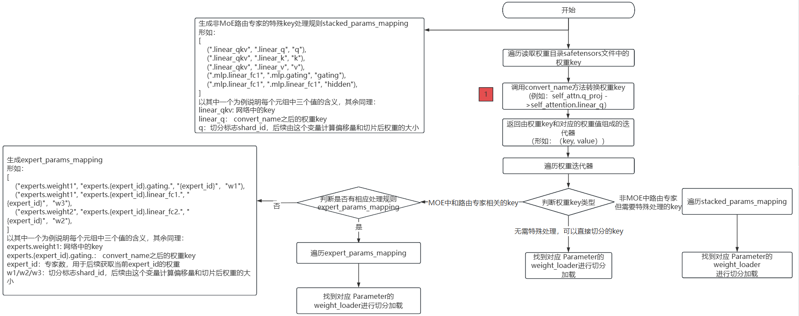

# 权重转换开发适配

[](https://gitee.com/mindspore/docs/blob/master/docs/mindformers/docs/source_zh_cn/advanced_development/weight_transfer.md)

本文档将指导开发者在开发适配模型时，如何将新模型适配MindSpore Transformers的权重转换功能，让使用者能够通过MindSpore Transformers统一的自动转换流程，将新模型的Hugging Face权重转换成MindSpore Transformers的权重，以拉起推理流程。

## Mcore模型网络加载Hugging Face权重流程图



上述流程图描述了将`Hugging Face`格式的`.safetensors`权重文件加载到`Mcore`模型中的完整权重转换与加载流程。

主要分为以下几个步骤：

1. 读取所有`.safetensors`文件，获取每个权重的`key`名称；
2. 调用`convert_name`方法转换权重 key，这步也是权重转换开发必须适配的一步，同时返回权重`key`和对应的权重值；
3. 遍历权重`key`和对应的权重值，判断权重`key`类型：
   - 不属于`MoE`或特殊结构的`key`，可直接用`weight_loader`加载；
   - `MOE`中和路由专家相关的`key`，生成相应处理规则`expert_params_mapping`，遍历`expert_params_mapping`，匹配名称，最终调用相应的`weight_loader`处理；
   - 非`MoE`路由专家但需特殊处理的`key`，需要生成相应处理规则`stacked_params_mapping`，遍历`stacked_params_mapping`，匹配名称，最终调用相应的`weight_loader`处理。

## 开发步骤

根据上述流程图可以看出，权重转换适配只需要完成一项修改： 调用convert_name方法，完成Hugging Face权重key至中间态key的转换。

操作步骤如下：

1. 在模型实现目录下创建utils.py公共工具文件，用于封装模型基类的通用功能方法。
2. 在utils.py中创建类：

   - 类命名采用[ModelName]PreTrainedModel格式
   - 继承PreTrainedModel和ModelMixin基类
3. 定义类属性config_class和base_model_prefix：

   - config_class：指定为对应模型的Config类
   - base_model_prefix：设置为模型名称字符串标识
4. 实现调用convert_name()方法需实现的key值映射表weight_mapping：

    weight_mapping示例如下：

    ```python
    weight_mapping = [
        ('model.embed_tokens.', 'embedding.word_embeddings.'),
        ('.self_attn.q_proj.', '.self_attention.linear_q.'),
        ('.self_attn.k_proj.', '.self_attention.linear_k.'),
        ('.self_attn.v_proj.', '.self_attention.linear_v.'),
        ('.self_attn.o_proj.', '.self_attention.linear_proj.'),
        ('.mlp.gate_proj.', '.mlp.gating.'),
        ('.mlp.down_proj.', '.mlp.linear_fc2.'),
        ('.mlp.up_proj.', '.mlp.hidden.'),
        ('.post_attention_layernorm.', '.pre_mlp_layernorm.'),
        ('model.norm.', 'decoder.final_layernorm.'),
        ('lm_head.', 'output_layer.'),
        ('model.layers.', 'decoder.layers.')
    ]
    ```

   其中元组的第一个元素为Hugging Face权重key，第二个元素为中间态权重key。

## Qwen3模型权重转换适配样例

在models/qwen3目录下新建utils.py文件，具体可参考[utils.py](https://gitee.com/mindspore/mindformers/blob/master/mindformers/models/qwen3/utils.py)。

Qwen3PreTrainedModel部分代码如下：

```python
class Qwen3PreTrainedModel(PreTrainedModel, ModelMixin):

 config_class = Qwen3Config
 base_model_prefix = "Qwen3"

 weight_mapping = [
     ('model.embed_tokens.', 'embedding.word_embeddings.'),
     ('.self_attn.q_proj.', '.self_attention.linear_q.'),
     ('.self_attn.k_proj.', '.self_attention.linear_k.'),
     ('.self_attn.v_proj.', '.self_attention.linear_v.'),
     ('.self_attn.o_proj.', '.self_attention.linear_proj.'),
     ('.self_attn.q_norm.', '.self_attention.q_layernorm.'),
     ('.self_attn.k_norm.', '.self_attention.k_layernorm.'),
     ('.mlp.gate_proj.', '.mlp.gating.'),
     ('.mlp.down_proj.', '.mlp.linear_fc2.'),
     ('.mlp.up_proj.', '.mlp.hidden.'),
     ('.post_attention_layernorm.', '.pre_mlp_layernorm.'),
     ('model.norm.', 'decoder.final_layernorm.'),
     ('lm_head.', 'output_layer.'),
     ('model.layers.', 'decoder.layers.')
 ]
```

## 验证权重加载是否成功

参考[推理文档](../guide/inference.md)执行推理流程，然后查看日志，如果日志中出现以下内容，表明权重和网络完全匹配，权重已经完全加入到网络中，检验模型推理结果是否符合预期，若出现乱码情况，需要进一步定位，参考推理精度比对文档：

```text
These parameters are not loaded in the network: {}'
```
