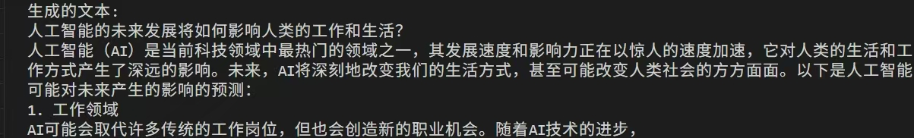

# 使用GLM4-9B进行多卡模型微调的实践案例

本文由Killjoy, chen-xialei, fuyao-15989607593, laozhuang, oacjiewen贡献。

本案例基于MindSpore框架和MindSpore Transformers大模型套件，指导用户对GLM4-9B模型进行微调，以提升其在自定义任务上的性能。涵盖了从环境配置、数据准备、权重转换、模型训练、权重合并、反转和推理测试的完整流程。通过以下步骤，您可以了解如何利用MindSpore Transformers对模型进行训练。

## 1. 环境搭建

参考[MindSpore Transformers 环境安装](https://www.mindspore.cn/mindformers/docs/zh-CN/master/installation.html)搭建环境。

## 2. 数据集准备

MindSpore Transformers接收输入的数据集格式之一为`MindRecord`格式，下面演示如何将原始数据集进行格式转换。原始数据集的类型不限，可以选择使用可以选择开源数据集（如Alpaca）或自定义数据集。首先将数据集转换为json格式，且数据集里的每一行数据应当处理为对话形式，即用户与模型的一问一答。然后通过MindSpore Transformers提供的脚本将其处理成MindRecord格式。下面以`Alpaca`数据集为例展示处理流程。Alpaca数据集包含52k条指令数据，适合对预训练的大语言模型进行指令微调。

1. 首先下载[Alpaca数据集](https://www.modelscope.cn/datasets/AI-ModelScope/alpaca-gpt4-data-en/files)。
2. 打开`train.csv`，可以看到alpaca数据集包含四个属性：`instruction`、`input`、`output`、`text`。`text`是对该条数据集的解释，可以忽略。
3. 将该数据集转换为用户与模型的对话格式，方法是：将`instruction`与`input`拼接，作为用户的输入，将`output`作为模型的输出，设置对话格式为`chatml`，设置对话输入方为`human`，输出方为`gpt`。

例如，`Alpaca`数据集的第一条为：

``` text
"instruction": "Give three tips for staying healthy."
"input": ""
"output": "1. Eat a balanced and nutritious diet..."
"text": "Below is an instruction that describes a task. Write a response..."
```

则处理后的数据集应为以下格式：

``` json
[
    {
        "type": "chatml",
        "conversations": [
            {
            "from": "human",
            "value": "Give three tips for staying healthy."
            },
            {
            "from": "gpt",
            "value": "1. Eat a balanced and nutritious diet..."
            }
        ]
    },
    {
      #  "第二条数据..."
    },
    ...
]
```

在处理完数据集后，使用MindSpore Transformers提供的数据处理脚本，生成MindRecord格式数据集。

```bash
python mindformers/tools/dataset_preprocess/glm4/glm4_preprocess.py \
  --input_glob /path/to/dataset \
  --vocab_file /path/tokenizer.model \
  --seq_length 8192 \
  --output_file /path/output_dataset.mindrecord
```

注意`--seq_length`参数应当按照数据集的实际情况进行调整，保证该参数大于数据集中所有对话的长度。

## 3. 多卡训练

### 3.1 权重转换

MindSpore Transformer在多卡训练时，需要预先将权重进行转换，转换为MindSpore的权重表示格式。首先下载[GLM4-9B模型](https://huggingface.co/zai-org/glm-4-9b-chat-hf)。下载后的文件目录如下所示：

``` text
- config.json
- configuration.json
- generation_config.json
- model-00001-of-00004.safetensors
- model-00002-of-00004.safetensors
- model-00003-of-00004.safetensors
- model-00004-of-00004.safetensors
- model.safetensors.index.json
- tokenizer.json
- tokenizer_config.json
```

然后进行权重转换：

``` bash
python convert_weight.py --model glm4 --input_path HF_CKPT_PATH --output_path MS_NOT_CONCAT_CKPT_PATH --dtype bf16 --config YAML_PATH
```

其中`convert_weight.py`文件位于[MindSpore Transformers仓库](https://gitee.com/mindspore/mindformers)根目录下。

参数含义：

- `--model` 要转换的模型名。此处填写`glm4`即可。
- `--input_path` 待转换的模型权重路径。此处填写下载的GLM4的Hugging Face权重路径。
- `--output_path` 转换后的权重保存路径。此处根据用户需求自行填写。
- `--dtype` 权重的数值类型。可查看下载的模型的`config`文件，类型与Hugging Face权重格式一致即可。
- `--config` 权重转换的参数配置文件路径。参数配置文件可参考`mindformers/configs/glm4/finetune_glm4_9b.yaml`进行调整，注意其中的`seq_length`属性应当和MindRecord转换时使用的长度相同，然后将此处路径改为调整好的路径即可。

在权重转换之后，输出为整个模型权重的ckpt文件。如果提示`trust_remote_code`相关错误，按照提示设置`trust_remote_code=True`即可。

### 3.2 并行策略配置与训练启动

启动首次微调任务：

```bash
bash scripts/msrun_launcher.sh "run_mindformer.py \
 --config configs/glm4/finetune_glm4_9b.yaml \
 --load_checkpoint /path/to/ckpt \
 --auto_trans_ckpt True \
 --train_dataset /path/to/dataset \
 --run_mode finetune" 8
```

其中参数`--auto_trans_ckpt`配置为True会根据`finetune_glm4_9b.yaml`中的`parallel config`自动对权重进行切分/合并，并生成权重文件夹`transformed_checkpoint`和分布式策略文件夹`strategy`。最后的`8`代表8卡训练，如果是采用其他卡的数量，需要对应修改。

> 开启了权重自动转换（auto_trans_ckpt=True），会将原有的`strategy`和`transformed_checkpoint`文件夹清空，然后保存最新任务的转换结果。如有需要，请将其保存到自定义文件夹。

在使用断点恢复训练时，可在上一条命令的命令中加上/修改以下参数：

``` text
--load_checkpoint /path/to/last_checkpoint \
--resume_training True \
--auto_trans_ckpt False
```

当分布式训练开始时，训练的log日志会出现在`/mindformers/output/msrun_log/`文件夹下，打开`worker_0.log`可关注训练过程是否正常进行。

### 3.3 权重合并

由于多卡训练时进行了权重分割，在完成训练后需要如下执行脚本进行权重合并：

```bash
python mindformers/tools/transform_ckpt.py --src_ckpt_strategy SRC_CKPT_STRATEGY --dst_ckpt_strategy None --src_ckpt_dir SRC_CKPT_DIR --dst_ckpt_dir DST_CKPT_DIR
```

部分重要参数解释：

- `--src_ckpt_strategy`：待转换权重的分布式策略文件路径（该文件为训练时生成）。
- `--src_ckpt_dir`: 待转换权重路径（该文件为训练时生成）。
- `--dst_ckpt_strategy`：目标权重的分布式策略文件路径，此处因为合并后的权重为完整权重，没有分布式策略，所以填`None`。
- `--dst_ckpt_dir`：自定义目标权重保存路径。

详细参数解释可见[Ckpt权重 | MindSpore Transformers 文档 | 昇思MindSpore社区](https://www.mindspore.cn/mindformers/docs/zh-CN/master/feature/ckpt.html)。

### 3.4 权重反向转换

由于训练过程中采用的是MindSpore版本的权重格式，如果需要用vLLM等推理框架进行部署的话，需要转换为Hugging Face权重格式。转换权重本质上是要让权重的字典与Hugging Face模型的字典一一对应。因此，我们在官方脚本 [convert_reverse.py](https://gitee.com/mindspore/mindformers/blob/master/mindformers/models/glm2/convert_reversed.py)的基础上进行改写，该脚本已经实现了权重格式的转换以及字典名的对应，仅需要修改的地方为保存的部分。首先分析代码，修改的函数为`convert_ms_to_pt`：

``` python
print('saving pt ckpt....')
torch.save(pt_param, output_path)
print(f"Convert finished, the output is saved to {output_path}")
```

该部分为原文件模型保存的过程，现在将其改写为保存为safetensors格式的功能。

首先，删除以上三行，并在头文件里引入保存safetensors格式的库：

``` python
from safetensors.torch import save_file
```

由于一个safentensors文件不能太大，所以需要事先设定一个值，将模型分为`split_num`份保存，该参数可以通过参数`--safetensor_split_num`传入。脚本里面存全部权重的变量为字典 `pt_param` ，首先把这个字典分成`split_num`份：

``` python
def split_dict(d, n):
    """
    将字典d均匀分成n份。
    返回一个列表，其中每个元素是一个字典。
    """
    items = list(d.items())
    k, m = divmod(len(items), n)
    return [dict(items[i * k + min(i, m):(i + 1) * k + min(i + 1, m)]) for i in range(n)]

split_dicts = split_dict(pt_param, split_num) # 将整个模型的权重分割成多个safentensors进行保存
```

转换为safetensors格式时，需要一个 `model.safetensors.index.json` 文件来记录模型的每一层权重保存在了哪里，所以需要在保存权重的时候记录这些信息：

``` python
converted_st_map = defaultdict()
converted_st_map["weight_map"] = defaultdict()
converted_st_map["metadata"] = defaultdict()

for split_id in range(len(split_dicts)):
    saving_file_name = f"model-{split_id + 1:05d}-of-{split_num:05d}.safetensors"
    logger.info(f"saving weights in split-{split_id  + 1} to file {saving_file_name}")
    for k, v in tqdm(split_dicts[split_id].items(), total=len(ckpt_dict), desc="处理检查点"):
        converted_st_map["weight_map"][k] = saving_file_name
        total_size += get_torch_storage_size(split_dicts[split_id].get(k))
    save_file(split_dicts[split_id], os.path.join(output_path, saving_file_name))

converted_st_map["metadata"]["total_size"] = total_size
converted_model_index_file = os.path.join(output_path, f"model.safetensors.index.json")
with open(converted_model_index_file, "w") as f:
    json_string = json.dumps(converted_st_map, default=lambda x: x.__dict__, sort_keys=False, indent=2)
    f.write(json_string)
```

运行反向转换脚本。此时文件目录下已经保存好了转换后的safetensors格式权重文件,和一个 `model.safetensors.index.json` ，文件目录如下（假设权重分为40份存储，即`--safetensor_split_num`传入的值为40）：

```text
- model-00001-of-00040.safetensors
- model-00002-of-00040.safetensors
- model-00003-of-00040.safetensors
...
- model-00039-of-00040.safetensors
- model-00040-of-00040.safetensors
- model.safetensors.index.json
```

此时，需要找到模型原来的仓库，把tokenizer等剩余文件复制过来，复制好的目录文件为：

```text
- model-00001-of-00040.safetensors
- model-00002-of-00040.safetensors
- model-00003-of-00040.safetensors
...
- model-00039-of-00040.safetensors
- model-00040-of-00040.safetensors
- model.safetensors.index.json
- config.json
- configuration_chatglm.py
- generation_config.json
- modeling_chatglm.py
- tokenization_chatglm.py
- tokenizer_config.json
- tokenizer.model
```

## 推理测试

您可以在NPU或GPU机器上使用PyTorch框架测试反转后的权重。以下给出一个NPU+PyTorch的简单示例程序，参考[文档](https://www.hiascend.com/document/detail/zh/Pytorch/710/index/index.html)安装相关依赖后，运行程序测试能否正常加载反转后的模型权重并进行推理。

``` python
from transformers import AutoModelForCausalLM, AutoTokenizer
import torch
import torch_npu  # 导入PyTorch NPU适配库

# 加载模型和分词器
model_name = "/path/to/model"
device = torch.device("npu:0")
tokenizer = AutoTokenizer.from_pretrained(model_name, trust_remote_code=True)
model = AutoModelForCausalLM.from_pretrained(model_name, trust_remote_code=True).half().to(device)
# 将模型设置为评估模式
model.eval()
# 输入文本
input_text = "人工智能的未来发展"
# 编码输入
input_ids = tokenizer.encode(input_text, return_tensors="pt").to(model.device)
with torch.no_grad():
    output = model.generate(
        input_ids,
        max_length=100,  # 最大生成长度
        num_return_sequences=1,  # 返回的序列数
        no_repeat_ngram_size=2,  # 避免重复的n-gram
        # early_stopping=True  # 提前停止
    )

# 解码输出
generated_text = tokenizer.decode(output[0], skip_special_tokens=True)
print("生成的文本:")
print(generated_text)
```

运行结果示例：

