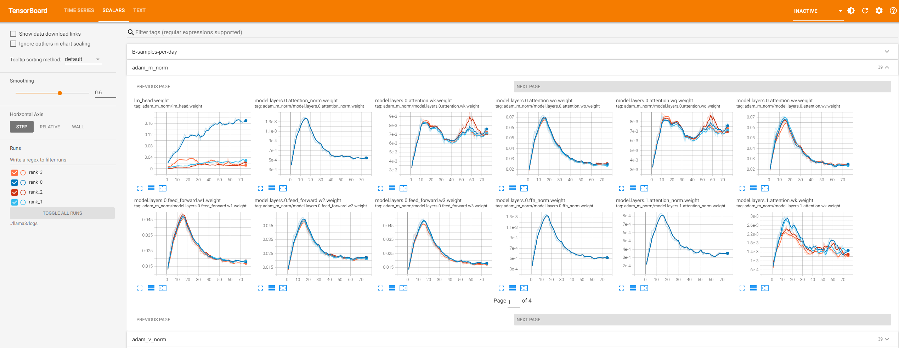
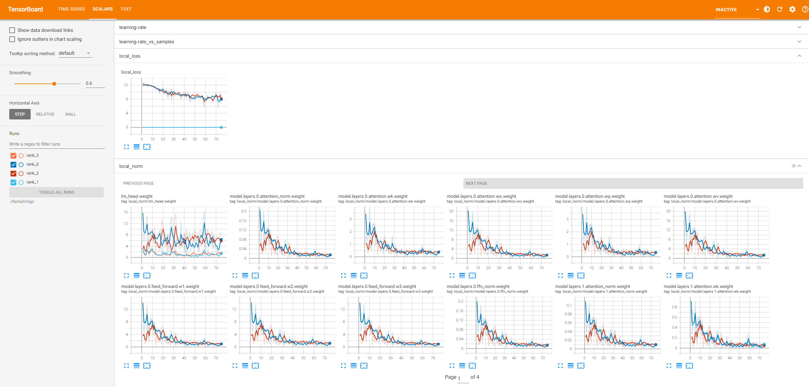

# 训练指标监控

[](https://gitee.com/mindspore/docs/blob/master/docs/mindformers/docs/source_zh_cn/feature/monitor.md)

MindSpore Transformers 支持 TensorBoard 作为可视化工具，用于监控和分析训练过程中的各种指标和信息。TensorBoard 是一个独立的可视化库，需要用户手动安装，它提供了一种交互式的方式来查看训练中的损失、精度、学习率、梯度分布等多种内容。用户在训练`yaml`文件中配置 TensorBoard 后，在大模型训练过程中会实时生成并更新事件文件，可以通过命令查看训练数据。

## 配置说明

在训练`yaml`文件中配置"monitor_config"、"tensorboard"和"callbacks"关键字，训练中会在配置的保存地址下保存tensorboard事件文件。
配置示例如下：

### `yaml`文件配置样例

```yaml
seed: 0
output_dir: './output'

monitor_config:
    monitor_on: True
    dump_path: './dump'
    target: ['layers.0', 'layers.1'] # 只监控第一、二层的参数
    invert: False
    step_interval: 1
    local_loss_format: ['log', 'tensorboard']
    device_local_loss_format: ['log', 'tensorboard']
    local_norm_format: ['log', 'tensorboard']
    device_local_norm_format: ['log', 'tensorboard']
    optimizer_state_format: null
    weight_state_format: null
    throughput_baseline: null
    print_struct: False

tensorboard:
    tensorboard_dir: 'worker/tensorboard'
    tensorboard_queue_size: 10
    log_loss_scale_to_tensorboard: True
    log_timers_to_tensorboard: True

callbacks:
    - type: MFLossMonitor
      per_print_times: 1
```

| monitor_config字段参数名称                    | 说明                                                                                       | 类型            |
|-----------------------------------------|------------------------------------------------------------------------------------------|---------------|
| monitor_config.monitor_on               | 设置是否开启监控。默认为`False`，此时以下所有参数不生效                                                          | bool          |
| monitor_config.dump_path                | 设置训练过程中`local_norm`、`device_local_norm`、`local_loss`、`device_local_loss`指标文件的保存路径。未设置或设置为`null`时取默认值'./dump' | str           |
| monitor_config.target                   | 设置指标`优化器状态`和`local_norm`所监控的的目标参数的名称（片段），可为正则表达式。未设置或设置为`null`时取默认值['.*']，即指定所有参数        | list[str]     |
| monitor_config.invert                   | 设置反选`monitor_config.target`所指定的参数。默认为`False`                                             | bool          |
| monitor_config.step_interval            | 设置记录指标的频率。默认为1，即每个step记录一次                                                               | int           |
| monitor_config.local_loss_format        | 设置指标`local_loss`的记录形式                                                                    | str或list[str] |
| monitor_config.device_local_loss_format | 设置指标`device_local_loss`的记录形式                                                             | str或list[str] |
| monitor_config.local_norm_format        | 设置指标`local_norm`的记录形式                                                                    | str或list[str] |
| monitor_config.device_local_norm_format | 设置指标`device_local_norm`的记录形式                                                             | str或list[str] |
| monitor_config.optimizer_state_format   | 设置指标`优化器状态`的记录形式                                                                         | str或list[str] |
| monitor_config.weight_state_format      | 设置指标`权重L2-norm`的记录形式                                                                     | str或list[str] |
| monitor_config.throughput_baseline      | 设置指标`吞吐量线性度`的基线值，需要为正数。会同时写入到 Tensorboard 和日志。未设置时默认为`null`，表示不监控该指标                     | int或float     |
| monitor_config.print_struct             | 设置是否打印模型的全部可训练参数名。若为`True`，则会在第一个step开始时打印所有可训练参数的名称，并在step结束后退出训练。默认为`False`            | bool          |

上述 xxx_format 形式的参数的可选值为字符串'tensorboard'和'log'（分别表示写入 Tensorboard 和写入日志），或由两者组成的列表，或`null`。未设置时均默认为`null`，表示不监控对应指标。

**注意**：当前开启对`优化器状态`和`权重L2 norm`指标的监控时会极大增加训练进程的耗时，请根据需要谨慎选择；`monitor_config.dump_path`路径下对应的"rank_x"目录将被清空，请确保所设置路径下没有需要保留的文件。

| tensoraboard字段参数名称                         | 说明                                                      | 类型   |
|--------------------------------------------|---------------------------------------------------------|------|
| tensorboard.tensorboard_dir                | 设置 TensorBoard 事件文件的保存路径                                | str  |
| tensorboard.tensorboard_queue_size         | 设置采集队列的最大缓存值，超过该值便会写入事件文件，默认值为10                        | int  |
| tensorboard.log_loss_scale_to_tensorboard  | 设置是否将 loss scale 信息记录到事件文件，默认为`False`                   | bool |
| tensorboard.log_timers_to_tensorboard      | 设置是否将计时器信息记录到事件文件，计时器信息包含当前训练步骤（或迭代）的时长以及吞吐量，默认为`False` | bool |
| tensorboard.log_expert_load_to_tensorboard | 设置是否将专家负载记录到事件文件（见[专家负载监控](#专家负载监控)小节），默认为`False`       | bool |

需要注意的是，在没有`tensorboard`配置时，`monitor_config`在xxx_format中设置的"tensorboard"将被替换为"log"，即从写入tensorboard事件文件改为在日志中进行相应信息的打印。

### 专家负载监控

专家负载均衡和监控功能通过回调函数TopkBiasBalanceCallback实现，目前仅支持mcore接口Deepseek-V3模型。用户需要手动在训练`yaml`文件中对"model.model_config"、"tensorboard"和"callbacks"关键字进行补充配置：

```yaml
model:
    model_config:
        moe_router_enable_expert_bias: True
        moe_router_bias_update_rate: 0.001              # 0.001为Deepseek-V3官方开源配置

tensorboard:
    log_expert_load_to_tensorboard: True

callbacks:
    - type: TopkBiasBalanceCallback
```

**注意**：若此前没有指定`tensorboard.tensorboard_dir`，则仍然需要对其进行设置。

## 查看训练数据

进行上述配置后，训练期间将会在路径 `./worker/tensorboard/rank_{id}` 下保存每张卡的事件文件，其中 `{id}` 为每张卡对应的的rank号。事件文件以 `events.*` 命名。文件中包含 `scalars` 和 `text` 数据，其中 `scalars` 为训练过程中关键指标的标量，如学习率、损失等； `text` 为训练任务所有配置的文本数据，如并行配置、数据集配置等。此外，根据具体配置，部分指标将在日志中进行展示。

使用以下命令可以启动 Tensorboard Web 可视化服务：

```bash
tensorboard --logdir=./worker/tensorboard/ --host=0.0.0.0 --port=6006
```

|参数名称   | 说明                                                     |
|--------|--------------------------------------------------------|
| logdir | TensorBoard保存事件文件的文件夹路径                                |
| host   | 默认是 127.0.0.1，表示只允许本机访问；设置为 0.0.0.0 可以允许外部设备访问，请注意信息安全 |
| port   | 设置服务监听的端口，默认是 6006                                               |

输入样例中的命令后会显示：

```shell
TensorBoard 2.18.0 at http://0.0.0.0:6006/ (Press CTRL+C to quit)
```

其中 `2.18.0` 表示 TensorBoard 当前安装的版本号（推荐版本为 `2.18.0` ）， `0.0.0.0` 和 `6006` 分别对应输入的 `--host` 和 `--port` ，之后可以在本地PC的浏览器中访问 `服务器公共ip:端口号` 查看可视化页面，例如服务器的公共IP为 `192.168.1.1` ，则访问 `192.168.1.1:6006` 。

### 指标可视化说明

回调函数`MFLossMonitor`、`TrainingStateMonitor`和`TopkBiasBalanceCallback`将分别对不同的标量指标进行监控。其中`TrainingStateMonitor`不需要用户在配置文件中设置，会根据monitor_config自动进行添加。

#### MFLossMonitor监控指标

`MFLossMonitor`监控的指标名称和说明如下：

| 标量名         | 说明                                                  |
|---------------|-----------------------------------------------------|
| learning-rate | 学习率                                                 |
| batch-size    | 批次大小                                                |
| loss          | 损失                                                  |
| loss-scale    | 损失缩放因子，记录需要设置`log_loss_scale_to_tensorboard`为`True` |
| grad-norm     | 梯度范数                                                |
| iteration-time | 训练迭代所需的时间，记录需要设置`log_timers_to_tensorboard`为`True`  |
| throughput    | 数据吞吐量，记录需要设置`log_timers_to_tensorboard`为`True`      |
| model-flops-throughput-per-npu | 模型算力吞吐量，单位为TFLOPS/npu（万亿次浮点数运算每秒每卡）                                       |
| B-samples-per-day    | 集群数据吞吐量，单位为B samples/day（十亿样本每天），记录需要设置`log_timers_to_tensorboard`为`True` |

在 Tensorboard 的 SCALARS 页面中，上述指标（假设名为 `scalar_name`）除了最后两个，其他都存在 `scalar_name` 和 `scalar_name-vs-samples` 两个下拉标签页。其中 `scalar_name` 下展示了该标量随训练迭代步数进行变化的折线图； `scalar_name-vs-samples` 下展示了该标量随样本数进行变化的折线图。如下图所示为学习率`learning-rate`的曲线图示例：


#### TrainingStateMonitor监控指标

`TrainingStateMonitor`监控的指标名称和说明如下：

| 标量名                  | 说明                                            |
|----------------------|-----------------------------------------------|
| local_norm           | 单卡上各参数的梯度范数，记录需要设置`local_norm_format`非null    |
| device_local_norm    | 单卡上的总梯度范数，记录需要设置`device_local_norm_format`非null    |
| local_loss           | 单卡上的局部损失，记录需要设置`local_loss_format`非null            |
| device_accum_local_loss| 单卡上的总局部损失，记录需要设置`device_local_loss_format`非null    |
| adam_m_norm          | 优化器一阶矩估计各参数的范数，记录需要设置`optimizer_state_format`非null |
| adam_v_norm          | 优化器二阶矩估计各参数的范数，记录需要设置`optimizer_state_format`非null |
| weight_norm          | 权重L2范数，记录需要设置`weight_state_format`非null            |
| throughput_linearity | 数据吞吐线性度，记录需要设置`throughput_baseline`非null           |

#### TopkBiasBalanceCallback监控指标

`TopkBiasBalanceCallback`将对MoE模型的专家负载情况进行监控和动态均衡（相关配置见[专家负载监控](#专家负载监控)小节）。动态均衡功能本文不涉及，监控的指标名称和说明如下：

| 标量名         | 说明                                                           |
|-------------|--------------------------------------------------------------|
| expert_load | 所有MoE层各专家的训练负载占比，记录需要设置`log_expert_load_to_tensorboard`为True |

#### 指标可视化样例

根据具体的设置，上述指标将在 Tensorboard 或日志中进行展示，如下：

**日志效果示例**


**tensorboard可视化效果示例**

adam_m_norm：



local_loss与local_norm：



expert_load（图中为3个MoE层的各自16个专家的负载变化曲线）：


### 文本数据可视化说明

在 TEXT 页面中，每个训练配置存在一个标签页，其中记录了该配置的值。如下图所示：


所有配置名和说明如下：

| 配置名                        | 说明                                                           |
|----------------------------|--------------------------------------------------------------|
| seed                       | 随机种子                                                         |
| output_dir                 | 保存checkpoint、strategy的路径                                     |
| run_mode                   | 运行模式                                                         |
| use_parallel               | 是否开启并行                                                       |
| resume_training            | 是否开启断点续训功能                                                   |
| ignore_data_skip           | 是否忽略断点续训时跳过数据的机制，而从头开始读取数据集。只在 `resume_training` 值为`True`时记录 |
| data_skip_steps            | 数据集跳过步数。只在 `ignore_data_skip` 被记录且值为`False`时记录               |
| load_checkpoint            | 加载权重的模型名或权重路径                                                |
| load_ckpt_format           | 加载权重的文件格式。只在 `load_checkpoint` 值不为空时记录                       |
| auto_trans_ckpt            | 是否开启自动在线权重切分或转换。只在 `load_checkpoint` 值不为空时记录                 |
| transform_process_num      | 转换checkpoint的进程数。只在 `auto_trans_ckpt` 被记录且值为`True`时记录        |
| src_strategy_path_or_dir   | 源权重分布式策略文件路径。只在 `auto_trans_ckpt` 被记录且值为`True`时记录            |
| load_ckpt_async            | 是否异步加载权重。只在 `load_checkpoint` 值不为空时记录                        |
| only_save_strategy         | 任务是否仅保存分布式策略文件                                               |
| profile                    | 是否开启性能分析工具                                                   |
| profile_communication      | 是否在多设备训练中收集通信性能数据。只在 `profile` 值为`True`时记录                   |
| profile_level              | 采集性能数据级别。只在 `profile` 值为`True`时记录                            |
| profile_memory             | 是否收集Tensor内存数据。只在 `profile` 值为`True`时记录                      |
| profile_start_step         | 性能分析开始的step。只在 `profile` 值为`True`时记录                         |
| profile_stop_step          | 性能分析结束的step。只在 `profile` 值为`True`时记录                         |
| profile_rank_ids           | 指定rank ids开启profiling。只在 `profile` 值为`True`时记录               |
| profile_pipeline           | 是否按流水线并行每个stage的其中一张卡开启profiling。只在 `profile` 值为`True`时记录    |
| init_start_profile         | 是否在Profiler初始化的时候开启数据采集。只在 `profile` 值为`True`时记录             |
| layer_decay                | 层衰减系数                                                        |
| layer_scale                | 是否启用层缩放                                                      |
| lr_scale                   | 是否开启学习率缩放                                                    |
| lr_scale_factor            | 学习率缩放系数。只在 `lr_scale` 值为`True`时记录                            |
| micro_batch_interleave_num | batch_size的拆分份数，多副本并行开关                                      |
| remote_save_url            | 使用AICC训练作业时，目标桶的回传文件夹路径                                      |
| callbacks                  | 回调函数配置                                                       |
| context                    | 环境配置                                                         |
| data_size                  | 数据集长度                                                        |
| device_num                 | 设备数量（卡数）                                                     |
| do_eval                    | 是否开启边训练边评估                                                   |
| eval_callbacks             | 评估回调函数配置。只在 `do_eval` 值为`True`时记录                            |
| eval_step_interval         | 评估step间隔。只在 `do_eval` 值为`True`时记录                            |
| eval_epoch_interval        | 评估epoch间隔。只在 `do_eval` 值为`True`时记录                           |
| eval_dataset               | 评估数据集配置。只在 `do_eval` 值为`True`时记录                             |
| eval_dataset_task          | 评估任务配置。只在 `do_eval` 值为`True`时记录                              |
| lr_schedule                | 学习率                                                          |
| metric                     | 评估函数                                                         |
| model                      | 模型配置                                                         |
| moe_config                 | 混合专家配置                                                       |
| optimizer                  | 优化器                                                          |
| parallel_config            | 并行策略配置                                                       |
| parallel                   | 自动并行配置                                                       |
| recompute_config           | 重计算配置                                                        |
| remove_redundancy          | checkpoint保存时是否去除冗余                                          |
| runner_config              | 运行配置                                                         |
| runner_wrapper             | wrapper配置                                                    |
| monitor_config             | 训练指标监控配置                                                     |
| tensorboard                | TensorBoard配置                                                |
| train_dataset_task         | 训练任务配置                                                       |
| train_dataset              | 训练数据集配置                                                      |
| trainer                    | 训练流程配置                                                       |
| swap_config                | 细粒度激活值SWAP配置                                                 |

> 上述训练配置来源于：
>
> 1. 用户在训练启动命令 `run_mindformer.py` 中传入的配置参数；
> 2. 用户在训练配置文件 `yaml` 中设置的配置参数；
> 3. 训练默认的配置参数。
>
> 可配置的所有参数请参考[配置文件说明](https://www.mindspore.cn/mindformers/docs/zh-CN/dev/feature/configuration.html)。