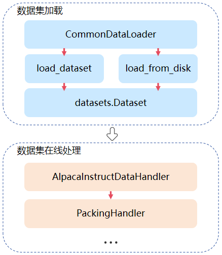

# 数据集

[](https://gitee.com/mindspore/docs/blob/master/docs/mindformers/docs/source_zh_cn/function/dataset.md)

MindSpore Transformers目前支持多种类型的数据集加载方式，涵盖常用开源与自定义场景。具体包括：

- **Megatron数据集**：支持加载符合Megatron-LM格式的数据集，适用于大规模语言模型的预训练任务。
- **HuggingFace数据集**：兼容HuggingFace datasets库，方便直接调用社区中丰富的公开数据资源。
- **MindRecord数据集**：MindRecord是MindSpore提供的高效数据存储/读取模块，此模块提供了一些方法帮助用户将不同公开数据集转换为MindRecord格式，也提供了一些方法对MindRecord数据文件进行读取、写入、检索等。

## Megatron数据集

Megatron数据集是为大规模分布式语言模型预训练场景设计的一种高效数据格式，广泛应用于Megatron-LM框架。该数据集通常经过预处理，序列化为二进制格式（例如`.bin`或`.idx`文件），并配套特定索引机制，便于在分布式集群环境下高效并行加载与数据切分。

下面将分别介绍如何生成`.bin`或`.idx`文件以及在训练任务中使用Megatron数据集。

### 数据预处理

MindSpore Transformers提供了数据预处理脚本[preprocess_indexed_dataset.py](https://gitee.com/mindspore/mindformers/blob/dev/mindformers/tools/dataset_preprocess/preprocess_indexed_dataset.py)用于将`json`格式的原始文本预料转换成`.bin`或`.idx`文件。如果用户的原始文本不是`json`格式，需要自行将数据处理成对应格式的文件。

下面是`json`格式文件的示例：

```json
{"src": "www.nvidia.com", "text": "The quick brown fox", "type": "Eng", "id": "0", "title": "First Part"}
{"src": "The Internet", "text": "jumps over the lazy dog", "type": "Eng", "id": "42", "title": "Second Part"}
...
```

各数据字段的说明如下：

| 字段名   | 说明          | 是否必须存在 |
|-------|-------------|:------:|
| text  | 原始文本数据      |   是    |
| id    | 数据的编号，按顺序排列 |   否    |
| src   | 数据来源        |   否    |
| type  | 数据的语言类型     |   否    |
| title | 数据标题        |   否    |

下面以`wikitext-103`数据集为例，介绍如何将数据集转换为Megatron数据集：

1. 下载`wikitext-103`数据集：[链接](https://dagshub.com/DagsHub/WIkiText-103/src/main/dataset/tokens)

2. 生成`json`格式数据文件

   `wikitext-103`数据集原始文本如下：

   ```text
   = Valkyria Chronicles III =

   Valkyria Chronicles III is a tactical role-playing game developed by Sega for the PlayStation Portable.

   The game was released in Japan on January 27, 2011.

   = Gameplay =

   The game is similar to its predecessors in terms of gameplay...
   ```

   需要将原始文本处理成如下格式，并保存成`json`文件：

   ```json
   {"id": 0, "text": "Valkyria Chronicles III is a tactical role-playing game..."}
   {"id": 1, "text": "The game is similar to its predecessors in terms of gameplay..."}
   ...
   ```

3. 下载模型的词表文件

   由于不同模型对应不用的词表文件，因此需要下载对应训练模型的词表文件，这里以`Llama3`模型为例，下载[tokenizer.model](https://huggingface.co/meta-llama/Meta-Llama-3-8B/blob/main/original/tokenizer.model)以用于数据预处理。

4. 生成`.bin`或`.idx`数据文件

   执行数据预处理脚本[preprocess_indexed_dataset.py](https://gitee.com/mindspore/mindformers/blob/dev/mindformers/tools/dataset_preprocess/preprocess_indexed_dataset.py)可以将原始文本数据通过模型的tokenizer转换为对应的token id。

    该脚本参数如下：

   | 参数名            | 说明                                             |
   |----------------|------------------------------------------------|
   | input          | `json`格式文件路径                                   |
   | output-prefix  | `.bin`或`.idx`数据文件格式的前缀                         |
   | tokenizer-type | 模型使用的tokenizer类型                               |
   | vocab-file     | 模型使用的tokenizer文件（tokenizer.model/vocab.json）路径 |
   | merges-file    | 模型使用的tokenizer文件（merge.txt）路径                  |
   | add_bos_token  | 是否在词表中加入`bos_token`                            |
   | add_eos_token  | 是否在词表中加入`eos_token`                            |
   | seq-length     | 设置数据集样本的序列长度                                   |
   | pad_or_stitch  | 选择填充或拼接样本，可选参数为`pad`和`stitch`                  |

   执行如下命令处理数据集：

   ```shell
   python mindformers/tools/dataset_preprocess/preprocess_indexed_dataset.py \
     --input /path/data.json \
     --output-prefix /path/megatron_data \
     --tokenizer-type Llama3Tokenizer \
     --vocab-file /path/tokenizer.model \
     --add_bos_token True \
     --add_eos_token True \
     --pad_or_stitch stitch \
     --seq-length 8192
   ```

### 模型预训练

MindSpore Transformers推荐用户使用Megatron数据集进行模型预训练，根据[数据预处理](#数据预处理)可以生成预训练数据集，下面介绍如何在配置文件中使用Megatron数据集。

1. 准备`parallel_speed_up.json`文件

   Megatron数据集依赖数据广播功能`dataset_broadcast_opt_level`，具体可参考[文档](https://www.mindspore.cn/docs/zh-CN/master/api_python/parallel/mindspore.parallel.auto_parallel.AutoParallel.html)，因此需要创建`parallel_speed_up.json`文件，文件内容如下：

   ```json
   {
       "dataset_broadcast_opt_level": 3
   }
   ```

   同时在模型配置文件中添加如下字段：

   ```yaml
   context:
     ascend_config:
       parallel_speed_up_json_path: "/path/to/parallel_speed_up.json"
   ```

2. 修改模型配置文件

   在模型预训练任务中使用Megatron数据集，主要修改配置文件中`train_dataset`部分内容。

   ```yaml
   train_dataset: &train_dataset
     data_loader:
       type: BlendedMegatronDatasetDataLoader
       datasets_type: "GPTDataset"
       sizes:
         - 1000 # 训练集数据样本数
         - 0    # 测试集数据样本数，当前不支持配置
         - 0    # 评测集数据样本数，当前不支持配置
       config:  # GPTDataset配置项
         seed: 1234                         # 数据采样随机种子
         split: "1, 0, 0"                   # 训练、测试、评测集使用比例，当前不支持配置
         seq_length: 8192                   # 数据集返回数据的序列长度
         eod_mask_loss: True                # 是否在eod处计算loss
         reset_position_ids: True           # 是否在eod处重置position_ids
         create_attention_mask: True        # 是否返回attention_mask
         reset_attention_mask: True         # 是否在eod处重置attention_mask，返回阶梯状attention_mask
         create_compressed_eod_mask: False  # 是否返回压缩后的attention_mask
         eod_pad_length: 128                # 设置压缩后attention_mask的长度
         eod: 0                             # 数据集中eod的token id
         pad: 1                             # 数据集中pad的token id

         data_path:  # Megatron数据集采样比例以及路径
           - '0.3'
           - "/path/megatron_data"
           - '0.7'
           - "/path/megatron_data"

     input_columns: ["input_ids", "labels", "loss_mask", "position_ids", "attention_mask"]
     construct_args_key: ["input_ids", "labels", "loss_mask", "position_ids", "attention_mask"]

   parallel:
     full_batch: False
     dataset_strategy: [[*dp, 1], [*dp, 1], [*dp, 1], [*dp, 1], [*dp, 1, 1, 1]]  # *dp表示与data_parallel的值相同

   model_config:
     input_sliced_sig: True
   ```

   下面是对数据集中`GPTDataset`各配置项的说明：

   | 参数名                        | 说明                                                                                        |
   |----------------------------|-------------------------------------------------------------------------------------------|
   | seed                       | 数据集采样的随机种子，Megatron数据集会根据该值对样本进行随机采样和拼接，默认值为`1234`                                        |
   | seq_length                 | 数据集返回数据的序列长度，应该与训练模型的序列长度一致                                                               |
   | eod_mask_loss              | 是否在eod处计算loss，默认值为`False`                                                                 |
   | create_attention_mask      | 是否返回attention_mask，默认值为`True`                                                             |
   | reset_attention_mask       | 是否在eod处重置attention_mask，返回阶梯状attention_mask，仅在`create_attention_mask=True`时生效，默认值为`False` |
   | create_compressed_eod_mask | 是否返回压缩后的attention_mask，优先级高于`create_attention_mask`，默认值为`False`                           |
   | eod_pad_length             | 设置压缩后attention_mask的长度，仅在`create_compressed_eod_mask=True`时生效，默认值为`128`                   |
   | eod                        | 数据集中eod的token id                                                                          |
   | pad                        | 数据集中pad的token id                                                                          |

   此外，Megatron数据集还依赖`input_columns`、`construct_args_key`、`full_batch`等配置，具体可参考[配置文件说明](https://www.mindspore.cn/mindformers/docs/zh-CN/dev/appendix/conf_files.html)，这里仅说明在不同场景如何配置：

    - 当`create_compressed_eod_mask=True`时：

    ```yaml
    train_dataset: &train_dataset
      input_columns: ["input_ids", "labels", "loss_mask", "position_ids", "actual_seq_len"]
      construct_args_key: ["input_ids", "labels", "loss_mask", "position_ids", "actual_seq_len"]
    parallel:
      full_batch: False
      dataset_strategy: [[*dp, 1], [*dp, 1], [*dp, 1], [*dp, 1], [*dp, 1]]  # *dp表示与data_parallel的值相同
    ```

    - 当`create_compressed_eod_mask=False`且`create_attention_mask=True`时：

    ```yaml
    train_dataset: &train_dataset
      input_columns: ["input_ids", "labels", "loss_mask", "position_ids", "attention_mask"]
      construct_args_key: ["input_ids", "labels", "loss_mask", "position_ids", "attention_mask"]
    parallel:
      full_batch: False
      dataset_strategy: [[*dp, 1], [*dp, 1], [*dp, 1], [*dp, 1], [*dp, 1, 1, 1]]  # *dp表示与data_parallel的值相同
    ```

    - 当`create_compressed_eod_mask=False`且`create_attention_mask=False`时：

    ```yaml
    train_dataset: &train_dataset
      input_columns: ["input_ids", "labels", "loss_mask", "position_ids"]
      construct_args_key: ["input_ids", "labels", "loss_mask", "position_ids"]
    parallel:
      full_batch: False
      dataset_strategy: [[*dp, 1], [*dp, 1], [*dp, 1], [*dp, 1]]  # *dp表示与data_parallel的值相同
    ```

3. 启动模型预训练

   修改模型配置文件中数据集以及并行相关配置项之后，即可参考模型文档拉起模型预训练任务，这里以[Llama3模型文档](https://gitee.com/mindspore/mindformers/blob/dev/research/llama3/README.md)为例。

## HuggingFace数据集

目前数据集加载功能已接入 [魔乐开源社区](https://modelers.cn/datasets)、[HuggingFace社区](https://huggingface.co/datasets)，并支持数据集在线加载与预处理，同时还可对数据集进行[packing](#数据集packing)，提升模型训练效率。

### 使用说明

HuggingFace数据集可实现HuggingFace社区以及魔乐开源社区中的数据集在线、离线加载，下面主要针对环境准备、数据集加载流程、以及在如何在配置文件中配置使用HuggingFace数据集功能进行介绍。

#### 对接开源社区

- 对接HuggingFace社区

   如果需要使用HuggingFace社区中的数据集需要执行如下步骤：

  1. 环境准备

     环境变量 `HF_ENDPOINT` 可以控制开源社区huggingFace实际使用的远程仓库，未配置时默认为 `https://huggingFace.co` ，
     针对国内环境，需要配置成镜像地址 ```export HF_ENDPOINT=https://hf-mirror.com``` 。

  2. 安装依赖

     ```shell
     pip install datasets
     ```

- 对接魔乐开源社区

   如果需要使用魔乐开源社区中的数据集需要执行如下步骤：

  1. 环境准备

     环境变量 `OPENMIND_HUB_ENDPOINT` 可以控制魔乐开源社区实际使用的远程仓库，
     未配置时默认为 ```export OPENMIND_HUB_ENDPOINT=https://telecom.openmind.cn``` 。

  2. 安装依赖

     ```shell
     git clone https://gitee.com/openmind-ai/openmind-hub.git
     cd openmind-hub
     pip install -e .
     cd ..
     git clone https://gitee.com/foundation-models/openmind-datasets.git
     cd openmind-datasets
     pip install -e .
     cd ..
     ```

> 当环境安装了 openmind-datasets 三方件时，默认对接的是魔乐开源社区，如果这是想对接 HuggingFace，环境变量 `USE_OM` 可以控制具体对接哪个社区，默认值为 `ON` 为魔乐社区，修改为 `OFF` 对接 HuggingFace 社区

#### 数据集加载流程



在线数据集加载与处理功能主要通过`CommonDataLoader`实现，其中数据加载部分可通过配置文件进行自定义配置，具体配置内容可参考[dataloader参数说明](#dataloader参数说明)，在线加载模块需要用户针对不同数据集进行自定义实现，如通过`AlpacaInstructDataHandler`类可实现对`alpaca`数据集进行预处理，具体实现过程可参考[自定义数据handler](#自定义数据handler)。

以下过程中示例中涉及的`seq_length`、`tokenizer`等参数均来自`qwen2.5`模型，由于`qwen2.5`模型在`research`目录下，启动任务时需要结合`--register_path`参数使用，用户可根据实际情况自行调整。

#### dataloader参数说明

在线数据集加载功能通过在配置文件中对`data_loader`进行配置来使能，下面是在线数据集加载相关配置的示例：

```yaml
train_dataset: &train_dataset
  input_columns: &input_columns ["input_ids", "labels", "loss_mask", "position_ids", "attention_mask"]
  construct_args_key: *input_columns
  data_loader:
    type: CommonDataLoader
    load_func: 'load_dataset'
    shuffle: False
    split: "train"
    path: "llm-wizard/alpaca-gpt4-data"
    packing: pack
    handler:
      - type: AlpacaInstructDataHandler
        tokenizer:
          model_max_length: 131072
          bos_token: null
          eos_token: "<|im_end|>"
          unk_token: null
          pad_token: "<|endoftext|>"
          vocab_file: "/path/vocab.json"   # qwen2.5
          merges_file: "/path/merges.txt"  # qwen2.5
          auto_register: qwen2_5_tokenizer.Qwen2Tokenizer
          type: Qwen2Tokenizer
        seq_length: 8192
        prompt_key: "conversations"
        output_columns: ["input_ids", "labels"]
        is_dynamic: False
      - type: PackingHandler
        seq_length: 8192
        output_columns: ["input_ids", "labels", "actual_seq_len"]
    adaptor_config:
      compress_mask: False
    column_names: *input_columns
```

其中`data_loader`中相关参数说明如下：

| 参数名            | 概述                                                                                                                                                   |  类型  |
|----------------|------------------------------------------------------------------------------------------------------------------------------------------------------|:----:|
| type           | 固定为`CommonDataLoader`，该模块支持HuggingFace以及魔乐开源社区的数据集加载功能                                                                                               | str  |
| packing        | 使用`handler`处理数据集时packing配置项，可选值为`pack`或`truncate`                                                                                                    | str  |
| load_func      | 加载数据集调用接口名，可选值为`load_dataset`或`load_from_disk`，读取通过`save_to_disk`接口保存的数据使用`load_from_disk`，其他场景使用`load_dataset`，默认值为`load_dataset`                   | str  |
| path           | 在`load_func=load_dataset`时，该参数含义与[datasets.load_dataset](https://huggingface.co/docs/datasets/loading)中接口相同，在`load_func=load_from_disk`时，该参数为加载数据集路径 | str  |
| data_files     | 在`load_func=load_dataset`时，该参数含义与[datasets.load_dataset](https://huggingface.co/docs/datasets/loading)中接口相同，在`load_func=load_from_disk`时不生效          | str  |
| handler        | 可配置多个`handler`，按配置顺序对加载后的数据集进行预处理，`handler`配置说明参考[自定义数据handler](#自定义数据handler)中的handler参数说明                                                          | list |
| adaptor_config | 在模型训练过程中数据集的相关配置，当前支持设置`compress_mask`，在设置`packing`时生效，开启后返回压缩后的数据掩码，默认为`False`                                                                      | dict |
| shuffle        | 是否在读取数据集时开启随机采样                                                                                                                                      | bool |
| column_names   | 设置数据集返回的列名，不指定时返回所有列                                                                                                                                 | list |
| is_dynamic     | 设置数据集返回动态长度的数据，默认为`False`                                                                                                                            | bool |

> 除了以上配置外，[datasets.load_dataset](https://huggingface.co/docs/datasets/loading)接口中的所有配置均已支持，且参数含义与功能相同。

数据集在配置packing之后返回`actual_seq_len`数据列，其含义可参考[文档](https://www.hiascend.com/document/detail/zh/Pytorch/600/ptmoddevg/trainingmigrguide/performance_tuning_0027.html)中`actual_seq_qlen`以及`actual_seq_kvlen`参数介绍。

### 功能介绍

#### 动态序列长度微调

`CommonDataLoader`支持加载HuggingFace数据集进行动态shape微调，HuggingFace数据集加载分为在线加载和离线加载，下面以`alpaca`数据集为例介绍如何配置动态shape微调。

- 在线加载

  在线数据名称为`llm-wizard/alpaca-gpt4-data`，可在[HuggingFace官网](https://huggingface.co/datasets)搜索名称进行下载或使用在线名称进行加载；

  在线加载配置文件示例：

  ```yaml
  train_dataset: &train_dataset
    input_columns: &input_columns ["input_ids", "labels"]
    dynamic_batch: True                    # 开启动态shape
    divisor: 32                            # 配置divisor和remainder后，动态shape中seq_length会成为divisor的倍数以及remainder的和
    remainder: 1
    data_loader:
      type: CommonDataLoader
      shuffle: True
      split: "train"                       # 在线数据集子集名称
      path: "llm-wizard/alpaca-gpt4-data"  # 在线数据集名称
      handler:
        - type: AlpacaInstructDataHandler
          tokenizer:
            model_max_length: 131072
            bos_token: null
            eos_token: "<|im_end|>"
            unk_token: null
            pad_token: "<|endoftext|>"
            vocab_file: "/path/vocab.json"   # qwen2.5
            merges_file: "/path/merges.txt"  # qwen2.5
            auto_register: qwen2_5_tokenizer.Qwen2Tokenizer
            type: Qwen2Tokenizer
          seq_length: 8192
          prompt_key: "conversations"
          output_columns: *input_columns
          is_dynamic: True
    seed: 0
    num_parallel_workers: 8
    python_multiprocessing: False
    drop_remainder: True
    numa_enable: False
    prefetch_size: 1
  ```

   1. `train_dataset`中参数说明可参考[文档](https://www.mindspore.cn/mindformers/docs/zh-CN/dev/appendix/conf_files.html)；

   2. `AlpacaInstructDataHandler`是针对`alpaca`数据集开发的在线处理脚本，如果使用其他数据集，用户需要参考[自定义数据handler](#自定义数据handler)完成自定义数据处理的功能实现。

- 离线加载

  离线加载需要准备好`alpaca`数据集中的json文件，离线配置与在线配置仅如下配置项不同。

  ```yaml
   train_dataset:
     data_loader:
       path: "json"                               # load_dataset接口加载文件格式
       data_files: '/path/alpaca_gpt4_data.json'  # alpaca数据集文件路径
   ```

配置完数据集加载方式之后，还需要在模型配置中修改`is_dynamic=True`来开启模型动态shape训练。

```yaml
model_config:
  is_dynamic: True
```

由于动态shape会存在算子编译缓存，当运行环境内存有限时，推荐配置如下环境变量来限制编译缓存的数量，避免出现内存不足的问题：

```shell
export ACLNN_CACHE_LIMIT=10
export MS_DEV_RUNTIME_CONF="aclnn_cache_queue_length:64"
```

- `ACLNN_CACHE_LIMIT`参数说明参考[文档](https://www.hiascend.com/document/detail/zh/canncommercial/800/apiref/envvar/envref_07_0031.html)。
- `MS_DEV_RUNTIME_CONF`是MindSpore中设置算子缓存序列长度的参数，其中64代表该序列的长度，默认为1024，可根据实际环境进行调整，数值设置过小可能会影响模型训练性能。

完成以上所有配置后，即可参考具体使用的模型文档进行动态shape微调。

#### 自定义数据handler

用户可以使用自定义数据 handler 逻辑，对加载到的数据集进行各种数据预处理定制逻辑。

- handler参数说明

  | 参数名            | 概述                                                                      |    类型    |
  |----------------|-------------------------------------------------------------------------|:--------:|
  | type           | 自定义数据 handler 名称，自定义handler必须继承`BaseInstructDataHandler`                |   str    |
  | tokenizer_name | 使用的 tokenizer 分词器名称                                                     |   str    |
  | tokenizer      | tokenizer 相关配置参数, 可以是字典或者字符串，也可以直接配置`tokenizer`对象，优先级低于`tokenizer_name` | dict/str |
  | seq_length     | 处理序列的最大长度，通常与模型的序列长度相同                                                  |   int    |
  | output_columns | 数据预处理后返回的数据列名                                                           |   list   |
  | prompt_key     | 增加 prompt 处理后数据的列名                                                      |   str    |

- 开发样例一

  自定义数据 handler 一般放在 `mindformers/dataset/handler` 目录下，自定义的需要继承抽象基类 ``BaseInstructDataHandler`` ，
  需要实现 ``format_func`` 、 ``tokenize_func`` 两个方法，该方法是对加载到的每条数据进行预处理，可以参考 `alpaca_handler.py` 。

  ```python
  @MindFormerRegister.register(MindFormerModuleType.DATA_HANDLER)
  class XXXInstructDataHandler(BaseInstructDataHandler):

      def format_func(self, example):
          # 自定义数据格式转换

      def tokenize_func(self, example):
          # 自定义tokenizer分词处理
  ```

  ``BaseInstructDataHandler`` 默认提供的实现了入口 ``handler`` 方法，用于遍历每条数据进行数据的预处理，
  ``format_func`` 用于实现如何从原始数据中转换成所需要的数据格式，而 ``tokenize_func`` 方法用于把处理后的数据进行按自定义分词，
  实例里的入参 ``example`` 为获取到的每一条样本数据。

- 开发样例二

  若用户想直接对于整个 dataset 进行数据处理，而不是每条数据分批处理的话，可以在自定义 handler 实现入口 ``handle`` 方法，得到的就是完整的 dataset，参考如下：

  ```python
      def handle(self, dataset):
          """data handler"""
          return dataset.rename_columns({"content":"prompt","summary":"answer"})
  ```

- alpaca 数据集示例

  修改任务配置文件 [finetune_qwen2_5_0_5b_8k.yaml](https://gitee.com/mindspore/mindformers/blob/dev/research/qwen2_5/finetune_qwen2_5_0_5b_8k.yaml)。

  修改如下参数：

  ```yaml
  train_dataset: &train_dataset
    input_columns: &input_columns ["input_ids", "labels"]
    data_loader:
      type: CommonDataLoader
      shuffle: True
      split: "train"
      path: "llm-wizard/alpaca-gpt4-data"
      handler:
        - type: AlpacaInstructDataHandler
          tokenizer:
            model_max_length: 131072
            bos_token: null
            eos_token: "<|im_end|>"
            unk_token: null
            pad_token: "<|endoftext|>"
            vocab_file: "/path/vocab.json"   # qwen2.5
            merges_file: "/path/merges.txt"  # qwen2.5
            auto_register: qwen2_5_tokenizer.Qwen2Tokenizer
            type: Qwen2Tokenizer
          seq_length: 8192
          prompt_key: "conversations"
          output_columns: *input_columns
    seed: 0
    num_parallel_workers: 8
    python_multiprocessing: False
    drop_remainder: True
    numa_enable: False
    prefetch_size: 1
  ```

  其余参数介绍可以参考 [配置文件说明](https://www.mindspore.cn/mindformers/docs/zh-CN/dev/appendix/conf_files.html) 的 “模型训练配置” 和 “模型评估配置”。

  自定义数据 handler：

  ```python
  @MindFormerRegister.register(MindFormerModuleType.DATA_HANDLER)
  class AlpacaInstructDataHandler(BaseInstructDataHandler):

      def format_func(self, example):
          """format func"""
          source = PROMPT_INPUT.format_map(example) \
              if example.get(self.input_key, "") != "" \
              else PROMPT_NO_INPUT.format_map(example)
          target = example.get(self.output_key)
          formatted_example = [
              {
                  "from": self.user_role,
                  "value": source,
              },
              {
                  "from": self.assistant_role,
                  "value": target,
              },
          ]

          return formatted_example

      def tokenize_func(self, messages):
          """tokenize func"""
          conversation = self.gen_prompt(messages)
          sep = self.template.sep + self.assistant_role + ": "
          # Tokenize conversations
          rounds = conversation.split(self.template.sep2)
          ids = [self.tokenizer.bos_token_id]
          mask = [1]
          for _, rou in enumerate(rounds):
              if rou == "":
                  break
              conv_out = self.tokenizer(rou)
              ids.extend(conv_out['input_ids'][1:])
              mask.extend(conv_out['attention_mask'][1:])
          d = {'input_ids': ids, 'attention_mask': mask}
          # pylint: disable=W0212
          if not self.dynamic:
              d = self.tokenizer._pad(d, max_length=self.seq_length + 1, padding_strategy='max_length')
          input_id = d['input_ids'][:self.seq_length + 1]
          target = np.array(d['input_ids'])
          total_len = int(np.not_equal(target, self.tokenizer.pad_token_id).sum())
          cur_len = 1
          target[:cur_len] = self.ignore_token_id
          for _, rou in enumerate(rounds):
              if rou == "":
                  break
              parts = rou.split(sep)
              if len(parts) != 2:
                  break
              parts[0] += sep
              round_len = len(self.tokenizer(rou)['input_ids']) - 1
              instruction_len = len(self.tokenizer(parts[0])['input_ids']) - 3

              target[cur_len: cur_len + instruction_len] = self.ignore_token_id

              cur_len += round_len
          if self.dynamic:
              return {
                  "input_ids": input_id,
                  "labels": target[:len(input_id)].tolist()
              }
          target[cur_len:] = self.ignore_token_id
          if cur_len < self.seq_length + 1:
              if cur_len != total_len:
                  target[:] = self.ignore_token_id
          else:
              target = target[:self.seq_length + 1]
          label = target.tolist()
          return {
              "input_ids": input_id,
              "labels": label,
          }
  ```

- ADGEN 数据集示例

  修改任务配置文件 [run_glm3_6b_finetune_2k_800T_A2_64G.yaml](https://gitee.com/mindspore/mindformers/blob/dev/configs/glm3/run_glm3_6b_finetune_2k_800T_A2_64G.yaml)。

  修改如下参数：

  ```yaml
  train_dataset: &train_dataset
    data_loader:
      type: CommonDataLoader
      path: "HasturOfficial/adgen"
      split: "train"
      shuffle: True
      handler:
        - type: AdgenInstructDataHandler
      phase: "train"
      version: 3
      column_names: ["prompt", "answer"]
    tokenizer:
      type: ChatGLM3Tokenizer
      vocab_file: "/path/to/tokenizer.model"
    input_columns: ["input_ids", "labels"]
    max_source_length: 1024
    max_target_length: 1023
    ignore_pad_token_for_loss: True
    num_parallel_workers: 8
    python_multiprocessing: False
    drop_remainder: True
    batch_size: 8
    numa_enable: False
    prefetch_size: 1
    seed: 0
  ```

  其余参数介绍可以参考 [配置文件说明](https://www.mindspore.cn/mindformers/docs/zh-CN/dev/appendix/conf_files.html) 的 “模型训练配置” 和 “模型评估配置”。

  自定义 adgen_handler：

  ```python
  @MindFormerRegister.register(MindFormerModuleType.DATA_HANDLER)
  class AdgenInstructDataHandler(BaseInstructDataHandler):
      """agden data handler"""
      def handle(self, dataset):
          """data handler"""
          return dataset.rename_columns({"content": "prompt", "summary": "answer"})
  ```

#### 数据集packing

在`CommonDataLoader`中配置`PackingHandler`可以实现对数据进行packing处理，目前需要在前置处理中将原始数据处理为可输入模型的`input_ids`以及`labels`。

- 参数说明

  | 参数名            | 概述                                                                                                                         |  类型  |
  |----------------|----------------------------------------------------------------------------------------------------------------------------|:----:|
  | type           | 固定为`PackingHandler`，该模块支持对数据进行packing，在[dataloader](#dataloader参数说明)中配置`packing=pack`和`packing=truncate`时，分别对数据进行非截断和截断的拼接 | str  |
  | seq_length     | packing处理后数据的最大序列长度                                                                                                        | int  |
  | pad_token      | 当packing后样本未达到最大长度时，对`input_ids`填充使用的token id，默认值为0                                                                        | int  |
  | ignore_token   | 当packing后样本未达到最大长度时，对`labels`填充使用的token id，默认值为-100                                                                        | int  |

- packing示例

  按照如下配置，对`alpaca`数据集进行预处理，即可实现在线packing。

  ```yaml
  train_dataset: &train_dataset
    input_columns: &input_columns ["input_ids", "labels", "loss_mask", "position_ids", "attention_mask"]
    construct_args_key: *input_columns
    data_loader:
      type: CommonDataLoader
      shuffle: False
      split: "train"
      path: "llm-wizard/alpaca-gpt4-data"
      packing: pack
      handler:
        - type: AlpacaInstructDataHandler
          tokenizer:
            model_max_length: 131072
            bos_token: null
            eos_token: "<|im_end|>"
            unk_token: null
            pad_token: "<|endoftext|>"
            vocab_file: "/path/vocab.json"   # qwen2.5
            merges_file: "/path/merges.txt"  # qwen2.5
            auto_register: qwen2_5_tokenizer.Qwen2Tokenizer
            type: Qwen2Tokenizer
          seq_length: 8192
          prompt_key: "conversations"
          output_columns: ["input_ids", "labels"]
        - type: PackingHandler
          seq_length: 8192
          output_columns: ["input_ids", "labels", "actual_seq_len"]
      adaptor_config:
        compress_mask: False
    seed: 0
    num_parallel_workers: 8
    python_multiprocessing: False
    drop_remainder: True
    numa_enable: False
    prefetch_size: 1
  ```

使用上述配置文件处理`alpaca`数据集，会执行如下流程：

1. 使用`AlpacaInstructDataHandler`以及`qwen2.5`的`tokenizer`将原始文本数据处理为`input_ids`和`labels`；
2. 使用`PackingHandler`对处理后的`input_ids`和`labels`进行packing处理，得到拼接到`seq_length`长度的`input_ids`和`labels`, `actual_seq_len`拼接后样本中每个子样本的序列长度，在训练中会根据这个参数生成对应的数据掩码；
3. 如果在`adaptor_config`中设置`compress_mask=False`表示训练时返回完整的数据掩码，否则返回`actual_seq_len`；

#### 数据集离线处理

`CommonDataLoader`除了支持数据集在线加载与处理，还支持离线处理数据集并进行保存。

使用[datasets_preprocess.py](https://gitee.com/mindspore/mindformers/blob/dev/toolkit/data_preprocess/huggingface/datasets_preprocess.py)脚本可以离线处理 HuggingFace 数据集并进行保存。

- 参数说明

  | 参数名           | 概述                                                        | 类型  |
  |---------------|-----------------------------------------------------------|:---:|
  | config        | 离线处理数据的配置文件，与在线处理使用方法相同，具体参考[dataloader](#dataloader参数说明) | str |
  | save_path     | 数据集经过预处理后的保存路径                                            | str |
  | register_path | 模型API的注册路径，其中包含模型相关Python文件，通常是research目录下模型文件夹的路径        | int |

- 使用示例

  使用[数据集packing](#数据集packing)中提供的packing示例的配置文件即可，执行如下命令。

  ```shell
  python toolkit/data_preprocess/huggingface/datasets_preprocess.py \
    --config data_process.yaml \
    --save_path /path/processed_data \
    --register_path research/qwen2_5
  ```

  如果需要加载保存后的数据集，需要对yaml进行如下修改：

  ```yaml
  train_dataset: &train_dataset
    input_columns: &input_columns ["input_ids", "labels", "loss_mask", "position_ids", "attention_mask"]
    construct_args_key: *input_columns
    data_loader:
      type: CommonDataLoader
      shuffle: False
      load_func: "load_from_disk"
      path: "/path/processed_data"
      adaptor_config:
        compress_mask: False
  ```

## MindRecord数据集

MindRecord是MindSpore提供的高效数据存储/读取模块，可以减少磁盘IO、网络IO开销，从而获得更好的数据加载体验，更多具体功能介绍可参考[文档](https://www.mindspore.cn/docs/zh-CN/master/api_python/mindspore.mindrecord.html)，这里仅对如何在MindSpore Transformers模型训练任务中使用MindRecord进行介绍。

下面以`qwen2-0.5b`进行微调为示例进行相关功能说明。

### 数据预处理

1. 下载`alpaca`数据集：[链接](https://github.com/tatsu-lab/stanford_alpaca/blob/main/alpaca_data.json)

2. 执行数据处理脚本将`alpaca`数据集转换为对话形式：

   ```shell
   python research/qwen2/alpaca_converter.py \
     --data_path /path/alpaca_data.json \
     --output_path /path/alpaca-data-messages.json
   ```

   其中，`data_path`表示下载后`alpaca`数据集的路径，`output_path`表示生成对话形式数据文件的保存路径。

3. 执行脚本将对话形式的数据文件转换为MindRecord格式：

   ```shell
   python research/qwen2/qwen2_preprocess.py \
     --dataset_type 'qa' \
     --input_glob /path/alpaca-data-messages.json \
     --vocab_file /path/vocab.json \
     --merges_file /path/merges.txt \
     --seq_length 32768 \
     --output_file /path/alpaca-messages.mindrecord
   ```

   该脚本各参数说明如下：

    - dataset_type：预处理数据类型，对于alpaca数据集应填`qa`
    - input_glob：生成对话形式数据文件路径
    - vocab_file：qwen2的vocab.json文件路径
    - merges_file：qwen2的merges.txt文件路径
    - seq_length：生成MindRecord数据的序列长度
    - output_file：生成MindRecord数据的保存路径

   > `vocab_file`和`merges_file`可以从HuggingFace社区上qwen2模型仓库获取

### 模型微调

参考上述数据预处理流程可生成用于`qwen2-0.5b`模型微调的MindRecord数据集，下面介绍如何使用生成的数据文件启动模型微调任务。

1. 修改模型配置文件

   `qwen2-0.5b`模型微调使用[finetune_qwen2_0.5b_32k.yaml](https://gitee.com/mindspore/mindformers/blob/dev/research/qwen2/qwen2_0_5b/finetune_qwen2_0.5b_32k.yaml)配置文件，修改其中数据集部分配置：

   ```yaml
   train_dataset: &train_dataset
     data_loader:
       type: MindDataset
       dataset_dir: "/path/alpaca-messages.mindrecord"
       shuffle: True
   ```

   在模型训练任务中使用MindRecord数据集需要修改`data_loader`中的配置项：

   - type：data_loader类型，使用MindRecord数据集设置为`MindDataset`
   - dataset_dir：MindRecord数据文件路径
   - shuffle：是否在训练时对数据样本进行随机采样

2. 启动模型微调

   修改模型配置文件中数据集以及并行相关配置项之后，即可参考模型文档拉起模型微调任务，这里以[Qwen2模型文档](https://gitee.com/mindspore/mindformers/blob/dev/research/qwen2/README.md)为例。

### 多源数据集

MindSpore框架原生数据集加载模块[MindDataset](https://www.mindspore.cn/docs/zh-CN/master/api_python/dataset/mindspore.dataset.MindDataset.html)，在对多个MindRecord数据集进行加载和采样时存在性能等瓶颈，因此MindSpore Transformers通过`MultiSourceDataLoader`实现多个数据集高效加载与采样功能。

多源数据集功能主要通过修改配置文件中`data_loader`中配置开启，下面提供示例：

```yaml
train_dataset: &train_dataset
  data_loader:
    type: MultiSourceDataLoader
    data_source_type: random_access
    shuffle: True
    dataset_ratios: [0.2, 0.8]
    samples_count: 1000
    nums_per_dataset: [2000]
    sub_data_loader_args:
      stage: 'train'
      column_names: ["input_ids", "target_ids", "attention_mask"]
    sub_data_loader:
      - type: MindDataset
        dataset_files: "/path/alpaca-messages.mindrecord"
      - type: MindDataset
        dataset_files: "/path/alpaca-messages.mindrecord"
    load_indices_npz_path: '/path/index.npz'
    save_indices_npz_path: '/path/index.npz'
```

其中`shuffle`配置会影响`shuffle_dataset`和`shuffle_file`两个参数：

- `shuffle_dataset`表示子数据集层面的随机采样
- `shuffle_file`表示样本层面的随机采样

在`shuffle`配置不同值时，会有如下结果：

| shuffle | shuffle_dataset  |  shuffle_file  |
|---------|:----------------:|:--------------:|
| True    |       True       |      True      |
| False   |      False       |     False      |
| infile  |      False       |      True      |
| files   |       True       |     False      |
| global  |       True       |      True      |

其他配置项说明如下：

| 参数名                   | 说明                                           |  类型  |
|-----------------------|----------------------------------------------|:----:|
| dataset_ratios        | 每个子数据集的采样比例，各子数据集采样比例和为1                     | list |
| samples_count         | 每个子数据集参与采样的样本数量，仅在配置`dataset_ratios`时生效      | int  |
| nums_per_dataset      | 每个子数据集的样本采样数量，在不配置`dataset_ratios`时生效        | list |
| sub_data_loader_args  | 每个子数据集的通用配置，在所有子数据集构建时生效                     | dict |
| sub_data_loader       | 每个子数据集的配置，与单个MindRecord数据集中`data_loader`配置相同 | list |
| load_indices_npz_path | 加载数据索引文件路径                                   | str  |
| save_indices_npz_path | 数据索引文件保存路径                                   | str  |
