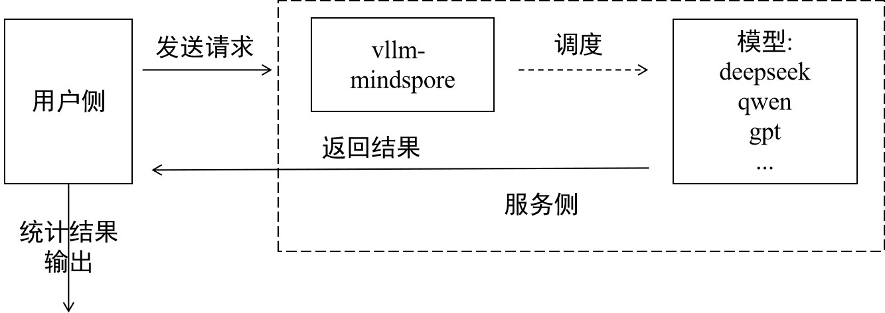

# 评测指南

[](https://gitee.com/mindspore/docs/blob/r2.7.1/docs/mindformers/docs/source_zh_cn/guide/evaluation.md)

## 概览

大语言模型（LLM）的迅猛发展催生了对其能力边界与局限性的系统化评估需求。模型评测已成为AI领域不可或缺的基础设施。

主流的模型评测流程就像考试，通过模型对试卷（评测数据集）的答题正确率来评估模型能力。常见数据集如ceval包含中文的52个不同学科职业考试选择题，主要评估模型的知识量；GSM8K由人类出题者编写的8500道高质量小学数学题组成，主要评估模型的推理能力等。

MindSpore Transformers在之前版本，对于部分Legacy架构的模型，适配了Harness评测框架。当前最新适配了AISBench评测框架，理论上支持服务化部署的模型，都能使用AISBench进行评测。

## AISBench评测

MindSpore Transformers的服务化评测推荐AISBench Benchmark套件。AISBench Benchmark是基于OpenCompass构建的模型评测工具，兼容OpenCompass的配置体系、数据集结构与模型后端实现，并在此基础上扩展了对服务化模型的支持能力。同时支持30+开源数据集：[AISBench支持的评测数据集](https://gitee.com/aisbench/benchmark/blob/master/doc/users_guide/datasets.md#%E5%BC%80%E6%BA%90%E6%95%B0%E6%8D%AE%E9%9B%86)。

当前，AISBench支持两大类推理任务的评测场景：

- **精度评测**：支持对服务化模型和本地模型在各类问答、推理基准数据集上的精度验证以及模型能力评估。
- **性能评测**：支持对服务化模型的延迟与吞吐率评估，并可进行压测场景下的极限性能测试。

两项任务都遵循同一套评测范式：用户侧发送请求，对服务侧输出的结果做分析，输出最终评测结果，如下图：



### 前期准备

前期准备主要完成三件事：安装AISBench评测环境，下载数据集，启动vLLM-MindSpore服务。

#### Step1 安装AISBench评测环境

因为AISBench对torch、transformers都有依赖，但是vLLM-MindSpore的官方镜像中有msadapter包mock的torch，会引起冲突，所以建议为AISBench另起容器安装评测环境。如果坚持以vLLM-MindSpore镜像起容器安装评测环境，需要在启动容器后执行以下几步删除容器内原有torch和transformers：

```bash
rm -rf /usr/local/Python-3.11/lib/python3.11/site-packages/torch*
pip uninstall transformers
unset USE_TORCH
```

然后克隆仓库并通过源码安装：

```bash
git clone https://gitee.com/aisbench/benchmark.git
cd benchmark/
pip3 install -e ./ --use-pep517
```

#### Step2 数据集下载

官方文档提供各个数据集下载链接，以ceval为例可在[ceval文档](https://gitee.com/aisbench/benchmark/blob/master/ais_bench/benchmark/configs/datasets/ceval/README.md)中找到下载链接，执行以下命令下载解压数据集到指定路径：

```bash
cd ais_bench/datasets
mkdir ceval/
mkdir ceval/formal_ceval
cd ceval/formal_ceval
wget https://www.modelscope.cn/datasets/opencompass/ceval-exam/resolve/master/ceval-exam.zip
unzip ceval-exam.zip
rm ceval-exam.zip
```

其他数据集下载，可到对应的数据集官方文档中找到下载链接。

#### Step3 启动vLLM-MindSpore服务

具体启动过程见：[服务化部署教程](./deployment.md)，评测支持所有可服务化部署模型。

### 精度评测流程

精度评测首先要确定评测的接口和评测的数据集类型，具体根据模型能力和数据集选定。

#### Step1 更改接口配置

AISBench支持OpenAI的v1/chat/completions和v1/completions接口，在AISBench中分别对应不同的配置文件。以v1/completions接口为例，以下称general接口，需更改以下文件`ais_bench/benchmark/configs/models/vllm_api/vllm_api_general.py`配置：

```python
from ais_bench.benchmark.models import VLLMCustomAPIChat

models = [
    dict(
        attr="service",
        type=VLLMCustomAPIChat,
        abbr='vllm-api-general-chat',
        path="xxx/DeepSeek-R1-671B",    # 指定模型序列化词表文件绝对路径，一般来说就是模型权重文件夹路径
        model="DeepSeek-R1",            # 指定服务端已加载模型名称，依据实际VLLM推理服务拉取的模型名称配置（配置成空字符串会自动获取）
        request_rate = 0,               # 请求发送频率，每1/request_rate秒发送1个请求给服务端，小于0.1则一次性发送所有请求
        retry = 2,
        host_ip = "localhost",          # 指定推理服务的IP
        host_port = 8080,               # 指定推理服务的端口
        max_out_len = 512,              # 推理服务输出的token的最大数量
        batch_size=128,                 # 请求发送的最大并发数，可以加快评测速度
        generation_kwargs = dict(       # 后处理参数，参考模型默认配置
            temperature = 0.5,
            top_k = 10,
            top_p = 0.95,
            seed = None,
            repetition_penalty = 1.03,
        )
    )
]
```

更多具体参数说明查看：[接口配置参数说明](#请求接口配置参数说明表)。

#### Step2 命令行启动评测

确定采用的数据集任务，以ceval为例，采用ceval_gen_5_shot_str数据集任务，命令如下：

```bash
ais_bench --models vllm_api_general --datasets ceval_gen_5_shot_str --debug
```

参数说明：

- `--models`：指定了模型任务接口，即vllm_api_general，对应上一步更改的文件名。此外还有vllm_api_general_chat。
- `--datasets`：指定了数据集任务，即ceval_gen_5_shot_str数据集任务，其中的5_shot指问题会重复四次输入，str是指非chat输出。

其它更多的参数配置说明，见[配置说明](https://gitee.com/aisbench/benchmark/blob/master/doc/users_guide/models.md#%E6%9C%8D%E5%8A%A1%E5%8C%96%E6%8E%A8%E7%90%86%E5%90%8E%E7%AB%AF)。

评测结束后统计结果会打屏，具体执行结果和日志都会保存在当前路径下的outputs文件夹下，执行异常情况下可以根据日志定位问题。

### 性能评测流程

性能与精度评测流程类似，不过更关心各请求各阶段的处理时间，通过精确记录每条请求的发送时间、各阶段返回时间及响应内容，系统地评估模型服务在实际部署环境中的响应延迟（如 TTFT、Token间延迟）、吞吐能力（如 QPS、TPUT）、并发处理能力等关键性能指标。以下以原始数据集gms8k进行性能评测为例。

#### Step1 更改接口配置

通过配置服务化后端参数，可以灵活控制请求内容、请求间隔、并发数量等，适配不同评测场景（如低并发延迟敏感型、高并发吞吐优先型等）。配置与精度评测类似，以vllm_api_stream_chat任务为例，在`ais_bench/benchmark/configs/models/vllm_api/vllm_api_stream_chat.py`更改如下配置：

```python
from ais_bench.benchmark.models import VLLMCustomAPIChatStream

models = [
    dict(
        attr="service",
        type=VLLMCustomAPIChatStream,
        abbr='vllm-api-stream-chat',
        path="xxx/DeepSeek-R1-671B",    # 指定模型序列化词表文件绝对路径，一般来说就是模型权重文件夹路径
        model="DeepSeek-R1",            # 指定服务端已加载模型名称，依据实际VLLM推理服务拉取的模型名称配置（配置成空字符串会自动获取）
        request_rate = 0,               # 请求发送频率，每1/request_rate秒发送1个请求给服务端，小于0.1则一次性发送所有请求
        retry = 2,
        host_ip = "localhost",          # 指定推理服务的IP
        host_port = 8080,               # 指定推理服务的端口
        max_out_len = 512,              # 推理服务输出的token的最大数量
        batch_size = 128,               # 请求发送的最大并发数
        generation_kwargs = dict(
            temperature = 0.5,
            top_k = 10,
            top_p = 0.95,
            seed = None,
            repetition_penalty = 1.03,
            ignore_eos = True,          # 推理服务输出忽略eos（输出长度一定会达到max_out_len）
        )
    )
]
```

具体参数说明查看：[接口配置参数说明](#请求接口配置参数说明表)。

#### Step2 评测命令

```bash
ais_bench --models vllm_api_stream_chat --datasets gsm8k_gen_0_shot_cot_str_perf --summarizer default_perf --mode perf
```

参数说明：

- `--models`：指定了模型任务接口，即vllm_api_stream_chat，对应上一步更改的配置的文件名。
- `--datasets`：指定了数据集任务，即gsm8k_gen_0_shot_cot_str_perf数据集任务，有对应的同名任务文件，其中的gsm8k指用的数据集，0_shot指问题不会重复，str是指非chat输出，perf是指做性能测试。
- `--summarizer`：指定了任务统计数据。
- `--mode`：指定了任务执行模式。

其它更多的参数配置说明，见[配置说明](https://gitee.com/aisbench/benchmark/blob/master/doc/users_guide/models.md#%E6%9C%8D%E5%8A%A1%E5%8C%96%E6%8E%A8%E7%90%86%E5%90%8E%E7%AB%AF)。

#### 评测结果说明

评测结束会输出性能测评结果，结果包括单个推理请求性能输出结果和端到端性能输出结果，参数说明如下：

| 指标                    | 全称                    | 说明                               |
|-----------------------|-----------------------|----------------------------------|
| E2EL                  | End-to-End Latency    | 单个请求从发送到接收全部响应的总时延(ms)           |
| TTFT                  | Time To First Token   | 首个 Token 返回的时延(ms)               |
| TPOT                  | Time Per Output Token | 输出阶段每个 Token 的平均生成时延（不含首个 Token） |
| ITL                   | Inter-token Latency   | 相邻 Token 间的平均间隔时延（不含首个 Token）    |
| InputTokens           | /                     | 请求的输入 Token 数量                   |
| OutputTokens          | /                     | 请求生成的输出 Token 数量                 |
| OutputTokenThroughput | /                     | 输出 Token 的吞吐率（Token/s）           |
| Tokenizer             | /                     | Tokenizer 编码耗时(ms)               |
| Detokenizer           | /                     | Detokenizer 解码耗时(ms)             |

- 更多评测任务，如合成随机数据集评测、性能压测，可查看以下文档：[AISBench官方文档](https://gitee.com/aisbench/benchmark/tree/master/doc/users_guide)。
- 更多调优推理性能技巧，可查看以下文档：[推理性能调优](https://docs.qq.com/doc/DZGhMSWFCenpQZWJR)。
- 更多参数说明请看以下文档：[性能测评结果说明](https://gitee.com/aisbench/benchmark/blob/master/doc/users_guide/performance_metric.md)。

### 附录

#### FAQ

**Q：评测结果输出不符合格式，如何使结果输出符合预期？**

在某些数据集中，若希望模型的输出符合预期，那么可以更改prompt。

以ceval的gen_0_shot_str为例，我们想让输出的第一个token就为选择的答案，可更改以下文件下的template：

```python
# ais_bench/benchmark/configs/datasets/ceval/ceval_gen_0_shot_str.py 66~76行
for _split in ['val']:
    for _name in ceval_all_sets:
        _ch_name = ceval_subject_mapping[_name][1]
        ceval_infer_cfg = dict(
            prompt_template=dict(
                type=PromptTemplate,
                template=f'以下是中国关于{_ch_name}考试的单项选择题，请选出其中的正确答案。\n{{question}}\nA. {{A}}\nB. {{B}}\nC. {{C}}\nD. {{D}}\n答案: {{answer}}',
            ),
            retriever=dict(type=ZeroRetriever),
            inferencer=dict(type=GenInferencer),
        )
```

其他数据集，也是相应地更改对应文件中的template，构造合适的prompt。

**Q：不同数据集应该如何配置接口类型和推理长度？**

具体取决于模型类型和数据集类型的综合考虑。像reasoning类model就推荐用chat接口，可以使能think，推理长度就要设得长一点；像base模型就用general接口。

- 以Qwen2.5模型评测MMLU数据集为例：从数据集来看，MMLU这类数据集以知识考察为主，就推荐用general接口，同时在数据集任务时不选用带cot的，即不使能思维链。
- 若以QWQ32B模型评测AIME2025这类困难的数学推理题为例：推荐使用chat接口，并设置超长推理长度，使用带cot的数据集任务。

#### 常见报错

1. 客户端返回HTML数据，包含乱码

   **报错现象**：返回网页HTML数据  
   **解决方案**：检查客户端是否开了代理，检查proxy_https、proxy_http环境变量关掉代理。

2. 服务端报 400 Bad Request

   **报错现象**：

   ```plaintext
   INFO: 127.0.0.1:53456 - "POST /v1/completions HTTP/1.1" 400 Bad Request
   INFO: 127.0.0.1:53470 - "POST /v1/completions HTTP/1.1" 400 Bad Request
   ```

   **解决方案**：检查客户端接口配置中，请求格式是否正确。

3. 服务端报错404 xxx does not exist

   **报错现象**：

   ```plaintext
   [serving_chat.py:135] Error with model object='error' message='The model 'Qwen3-30B-A3B-Instruct-2507' does not exist.' param=None code=404
   "POST /v1/chat/completions HTTP/1.1" 404 Not Found
   [serving_chat.py:135] Error with model object='error' message='The model 'Qwen3-30B-A3B-Instruct-2507' does not exist.'
   ```

   **解决方案**：检查接口配置中的模型路径是否可达。

#### 请求接口配置参数说明表

| 参数                 | 说明                                                |
|--------------------|---------------------------------------------------|
| type               | 任务接口类型                                            |
| path               | 模型序列化词表文件绝对路径，一般来说就是模型权重文件夹路径                     |
| model              | 服务端已加载模型名称，依据实际VLLM推理服务拉取的模型名称配置（配置成空字符串会自动获取）    |
| request_rate       | 请求发送频率，每1/request_rate秒发送1个请求给服务端，小于0.1则一次性发送所有请求 |
| retry              | 请求失败重复发送次数                                        |
| host_ip            | 推理服务的IP                                           |
| host_port          | 推理服务的端口                                           |
| max_out_len        | 推理服务输出的token的最大数量                                 |
| batch_size         | 请求发送的最大并发数                                        |
| temperature        | 后处理参数，温度系数                                        |
| top_k              | 后处理参数                                             |
| top_p              | 后处理参数                                             |
| seed               | 随机种子                                              |
| repetition_penalty | 后处理参数，重复性惩罚                                       |
| ignore_eos         | 推理服务输出忽略eos（输出长度一定会达到max_out_len）                 |

#### 参考资料

关于AISBench的更多教程和使用方式可参考官方资料：

- [AISBench官方教程](https://gitee.com/aisbench/benchmark)
- [AISBench主要文档](https://gitee.com/aisbench/benchmark/tree/master/doc/users_guide)

## Harness评测

[LM Evaluation Harness](https://github.com/EleutherAI/lm-evaluation-harness)是一个开源语言模型评测框架，提供60多种标准学术数据集的评测，支持HuggingFace模型评测、PEFT适配器评测、vLLM推理评测等多种评测方式，支持自定义prompt和评测指标，包含loglikelihood、generate_until、loglikelihood_rolling三种类型的评测任务。基于Harness评测框架对MindSpore Transformers进行适配后，支持加载MindSpore Transformers模型进行评测。

目前已验证过的模型和支持的评测任务如下表所示：

| 已验证的模型   | 支持的评测任务                                   |
|----------|-------------------------------------------|
| Llama3   | gsm8k、ceval-valid、mmlu、cmmlu、race、lambada |
| Llama3.1 | gsm8k、ceval-valid、mmlu、cmmlu、race、lambada |
| Qwen2    | gsm8k、ceval-valid、mmlu、cmmlu、race、lambada |

### 安装

Harness支持pip安装和源码编译安装两种方式。pip安装更简单快捷，源码编译安装更便于调试分析，用户可以根据需要选择合适的安装方式。

#### pip安装

用户可以执行如下命令安装Harness（推荐使用0.4.4版本）：

```shell
pip install lm_eval==0.4.4
```

#### 源码编译安装

用户可以执行如下命令编译并安装Harness：

```bash
git clone --depth 1 -b v0.4.4 https://github.com/EleutherAI/lm-evaluation-harness
cd lm-evaluation-harness
pip install -e .
```

### 使用方式

#### 评测前准备

1. 创建一个新目录，例如名称为`model_dir`，用于存储模型yaml文件。
2. 在上个步骤创建的目录中，放置模型推理yaml配置文件（predict_xxx_.yaml）。不同模型的推理yaml配置文件所在目录位置，请参考[模型库](../introduction/models.md)。
3. 配置yaml文件。如果yaml中模型类、模型Config类、模型Tokenizer类使用了外挂代码，即代码文件在[research](https://gitee.com/mindspore/mindformers/tree/r1.7.0/research)目录或其他外部目录下，需要修改yaml文件：在相应类的`type`字段下，添加`auto_register`字段，格式为“module.class”（其中“module”为类所在脚本的文件名，“class”为类名。如果已存在，则不需要修改）。

    以[predict_llama3_1_8b.yaml](https://gitee.com/mindspore/mindformers/blob/r1.7.0/research/llama3_1/llama3_1_8b/predict_llama3_1_8b.yaml)配置为例，对其中的部分配置项进行如下修改：

      ```yaml
      run_mode: 'predict'       # 设置推理模式
      load_checkpoint: 'model.ckpt'   # 权重路径
      processor:
        tokenizer:
          vocab_file: "tokenizer.model"     # tokenizer路径
          type: Llama3Tokenizer
          auto_register: llama3_tokenizer.Llama3Tokenizer
      ```

      关于每个配置项的详细说明请参考[配置文件说明](../feature/configuration.md)。
4. 如果使用`ceval-valid`、`mmlu`、`cmmlu`、`race`、`lambada`数据集进行评测，需要将`use_flash_attention`设置为`False`，以`predict_llama3_1_8b.yaml`为例，修改yaml如下：

     ```yaml
     model:
       model_config:
         # ...
         use_flash_attention: False  # 设置为False
         # ...
     ```

#### 评测样例

执行脚本[run_harness.sh](https://gitee.com/mindspore/mindformers/blob/r1.7.0/toolkit/benchmarks/run_harness.sh)进行评测。

run_harness.sh脚本参数配置如下表：

| 参数                | 类型  | 参数介绍                                                                                             | 是否必须      |
|-------------------|-----|--------------------------------------------------------------------------------------------------|-----------|
| `--register_path` | str | 外挂代码所在目录的绝对路径。比如[research](https://gitee.com/mindspore/mindformers/tree/r1.7.0/research)目录下的模型目录 | 否（外挂代码必填） |
| `--model`         | str | 需设置为 `mf` ，对应为MindSpore Transformers评估策略                                                         | 是         |
| `--model_args`    | str | 模型及评估相关参数，见下方模型参数介绍                                                                              | 是         |
| `--tasks`         | str | 数据集名称。可传入多个数据集，使用逗号（，）分隔                                                                         | 是         |
| `--batch_size`    | int | 批处理样本数                                                                                           | 否         |
| `--help`          |     | 显示帮助信息并退出                                                                                        | 否         |

其中，model_args参数配置如下表：

| 参数             | 类型   | 参数介绍               | 是否必须 |
|----------------|------|--------------------|------|
| `pretrained`   | str  | 模型目录路径             | 是    |
| `max_length`   | int  | 模型生成的最大长度          | 否    |
| `use_parallel` | bool | 开启并行策略(执行多卡评测必须开启) | 否    |
| `tp`           | int  | 张量并行数              | 否    |
| `dp`           | int  | 数据并行数              | 否    |

Harness评测支持单机单卡、单机多卡、多机多卡场景，每种场景的评测样例如下：

1. 单卡评测样例

   ```shell
      source toolkit/benchmarks/run_harness.sh \
       --register_path mindformers/research/llama3_1 \
       --model mf \
       --model_args pretrained=model_dir \
       --tasks gsm8k
   ```

2. 多卡评测样例

   ```shell
      source toolkit/benchmarks/run_harness.sh \
       --register_path mindformers/research/llama3_1 \
       --model mf \
       --model_args pretrained=model_dir,use_parallel=True,tp=4,dp=1 \
       --tasks ceval-valid \
       --batch_size BATCH_SIZE WORKER_NUM
   ```

    - `BATCH_SIZE`为模型批处理样本数；
    - `WORKER_NUM`为使用计算卡的总数。

3. 多机多卡评测样例

   节点0（主节点）命令：

   ```shell
      source toolkit/benchmarks/run_harness.sh \
       --register_path mindformers/research/llama3_1 \
       --model mf \
       --model_args pretrained=model_dir,use_parallel=True,tp=8,dp=1 \
       --tasks lambada \
       --batch_size 2 8 4 192.168.0.0 8118 0 output/msrun_log False 300
   ```

   节点1（副节点）命令：

   ```shell
      source toolkit/benchmarks/run_harness.sh \
       --register_path mindformers/research/llama3_1 \
       --model mf \
       --model_args pretrained=model_dir,use_parallel=True,tp=8,dp=1 \
       --tasks lambada \
       --batch_size 2 8 4 192.168.0.0 8118 1 output/msrun_log False 300
   ```

   节点n（副节点）命令：

   ```shell
      source toolkit/benchmarks/run_harness.sh \
       --register_path mindformers/research/llama3_1 \
       --model mf \
       --model_args pretrained=model_dir,use_parallel=True,tp=8,dp=1 \
       --tasks lambada \
       --batch_size BATCH_SIZE WORKER_NUM LOCAL_WORKER MASTER_ADDR MASTER_PORT NODE_RANK output/msrun_log False CLUSTER_TIME_OUT
   ```

   - `BATCH_SIZE`为模型批处理样本数；
   - `WORKER_NUM`为所有节点中使用计算卡的总数；
   - `LOCAL_WORKER`为当前节点中使用计算卡的数量；
   - `MASTER_ADDR`为分布式启动主节点的ip；
   - `MASTER_PORT`为分布式启动绑定的端口号；
   - `NODE_RANK`为当前节点的rank id；
   - `CLUSTER_TIME_OUT`为分布式启动的等待时间，单位为秒。

   多机多卡评测需要分别在不同节点运行脚本，并将参数MASTER_ADDR设置为主节点的ip地址， 所有节点设置的ip地址相同，不同节点之间仅参数NODE_RANK不同。

### 查看评测结果

执行评测命令后，评测结果将会在终端打印出来。以gsm8k为例，评测结果如下，其中Filter对应匹配模型输出结果的方式，n-shot对应数据集内容格式，Metric对应评测指标，Value对应评测分数，Stderr对应分数误差。

| Tasks | Version | Filter           | n-shot | Metric      |   | Value  |   | Stderr |
|-------|--------:|------------------|-------:|-------------|---|--------|---|--------|
| gsm8k |       3 | flexible-extract |      5 | exact_match | ↑ | 0.5034 | ± | 0.0138 |
|       |         | strict-match     |      5 | exact_match | ↑ | 0.5011 | ± | 0.0138 |

### FAQ

1. 使用Harness进行评测，在加载HuggingFace数据集时，报错`SSLError`：

   参考[SSL Error报错解决方案](https://stackoverflow.com/questions/71692354/facing-ssl-error-with-huggingface-pretrained-models)。

   注意：关闭SSL校验存在风险，可能暴露在中间人攻击（MITM）下。仅建议在测试环境或你完全信任的连接里使用。

## 训练后模型进行评测

模型在训练过程中或训练结束后，一般会将训练得到的模型权重去跑评测任务，来验证模型的训练效果。本章节介绍了从训练后到评测前的必要步骤，包括：

1. 训练后的分布式权重的处理（单卡训练可忽略此步骤）；
2. 基于训练配置编写评测使用的推理配置文件；
3. 运行简单的推理任务验证上述步骤的正确性；
4. 进行评测任务。

### 分布式权重合并

训练后产生的权重如果是分布式的，需要先将已有的分布式权重合并成完整权重后，再通过在线切分的方式进行权重加载完成推理任务。

MindSpore Transformers 提供了一份 [safetensors 权重合并脚本](https://gitee.com/mindspore/mindformers/blob/r1.7.0/toolkit/safetensors/unified_safetensors.py)，使用该脚本，可以将分布式训练得到的多个 safetensors 权重进行合并，得到完整权重。

合并指令参考如下（对第 1000 步训练权重进行去 adam 优化器参数合并，且训练权重在保存时开启了去冗余功能）：

```shell
python toolkit/safetensors/unified_safetensors.py \
  --src_strategy_dirs output/strategy \
  --mindspore_ckpt_dir output/checkpoint \
  --output_dir /path/to/unified_train_ckpt \
  --file_suffix "1000_1" \
  --filter_out_param_prefix "adam_" \
  --has_redundancy False
```

脚本参数说明：

- **src_strategy_dirs**：源权重对应的分布式策略文件路径，通常在启动训练任务后默认保存在 `output/strategy/` 目录下。分布式权重需根据以下情况填写：

    - **源权重开启了流水线并行**：权重转换基于合并的策略文件，填写分布式策略文件夹路径。脚本会自动将文件夹内的所有 `ckpt_strategy_rank_x.ckpt` 文件合并，并在文件夹下生成 `merged_ckpt_strategy.ckpt`。如果已经存在 `merged_ckpt_strategy.ckpt`，可以直接填写该文件的路径。
    - **源权重未开启流水线并行**：权重转换可基于任一策略文件，填写任意一个 `ckpt_strategy_rank_x.ckpt` 文件的路径即可。

    **注意**：如果策略文件夹下已存在 `merged_ckpt_strategy.ckpt` 且仍传入文件夹路径，脚本会首先删除旧的 `merged_ckpt_strategy.ckpt`，再合并生成新的 `merged_ckpt_strategy.ckpt` 以用于权重转换。因此，请确保该文件夹具有足够的写入权限，否则操作将报错。
- **mindspore_ckpt_dir**：分布式权重路径，请填写源权重所在文件夹的路径，源权重应按 `model_dir/rank_x/xxx.safetensors` 格式存放，并将文件夹路径填写为 `model_dir`。
- **output_dir**：目标权重的保存路径，默认值为 `"/path/output_dir"`，如若未配置该参数，目标权重将默认放置在 `/path/output_dir` 目录下。
- **file_suffix**：目标权重文件的命名后缀，默认值为 `"1_1"`，即目标权重将按照 `*1_1.safetensors` 格式查找匹配的权重文件进行合并。
- **filter_out_param_prefix**：合并权重时可自定义过滤掉部分参数，过滤规则以前缀名匹配。如优化器参数 `"adam_"`。
- **has_redundancy**：合并的源权重是否是冗余的权重，默认为 `True`，表示用于合并的原始权重有冗余；若原始权重保存时为去冗余权重，则需设置为 `False`。

### 推理配置开发

在完成权重文件的合并后，需依据训练配置文件开发对应的推理配置文件。

以 Qwen3 为例，基于 [Qwen3 推理配置](https://gitee.com/mindspore/mindformers/blob/r1.7.0/configs/qwen3/predict_qwen3.yaml)修改 [Qwen3 训练配置](https://gitee.com/mindspore/mindformers/blob/r1.7.0/configs/qwen3/finetune_qwen3.yaml)：

Qwen3 训练配置主要修改点包括：

- `run_mode` 的值修改为 `"predict"`。
- 添加 `pretrained_model_dir` 参数，配置为 Hugging Face 或 ModelScope 的模型目录路径，放置模型配置、Tokenizer 等文件。如果将训练得到的完整权重放置在此目录底下，则 yaml 中可以不配置 `load_checkpoint`。
- `parallel_config` 只保留 `data_parallel` 和 `model_parallel`。
- `model_config` 中只保留 `compute_dtype`、`layernorm_compute_dtype`、`softmax_compute_dtype`、`rotary_dtype`、`params_dtype`，和推理配置保持精度一致。
- `parallel` 模块中，只保留 `parallel_mode` 和 `enable_alltoall`，`parallel_mode` 的值修改为 `"MANUAL_PARALLEL"`。

> 如果模型的参数量在训练时进行了自定义，或与开源配置不同，进行推理时需要同步修改 `pretrained_model_dir` 对应路径下的模型配置 config.json。也可以在 `model_config` 中配置对应修改后的参数，传入推理时，`model_config` 中的同名配置会覆盖 config.json 中对应配置的值。
> </br>如需检查传入的配置项是否正确，可以通过查找日志中的 `The converted TransformerConfig is: ...` 或 `The converted MLATransformerConfig is: ...` 内容，查找对应的配置项。

### 推理功能验证

在权重和配置文件都准备好的情况下，使用单条数据输入进行推理，检查输出内容是否符合预期逻辑，参考[推理文档](../guide/inference.md)，拉起推理任务。

如，以 Qwen3 单卡推理为例，拉起推理任务的指令为：

```shell
python run_mindformer.py \
--config configs/qwen3/predict_qwen3.yaml \
--run_mode predict \
--use_parallel False \
--predict_data '帮助我制定一份去上海的旅游攻略'
```

如果输出内容出现乱码或者不符合预期，需要定位精度问题。

1. 检查模型配置正确性

    确认模型结构与训练配置一致。参考训练配置模板使用教程，确保配置文件符合规范，避免因参数错误导致推理异常。

2. 验证权重加载完整性

    检查模型权重文件是否完整加载，确保权重名称与模型结构严格匹配。参考新模型权重转换适配教程，查看权重日志即权重切分方式是否正确，避免因权重不匹配导致推理错误。

3. 定位推理精度问题

    若模型配置与权重加载均无误，但推理结果仍不符合预期，需进行精度比对分析，参考推理精度比对文档，逐层比对训练与推理的输出差异，排查潜在的数据预处理、计算精度或算子问题。

### 使用 AISBench 进行评测

参考 [AISBench 评测章节](#aisbench评测)，使用 AISBench 工具进行评测，验证模型精度。