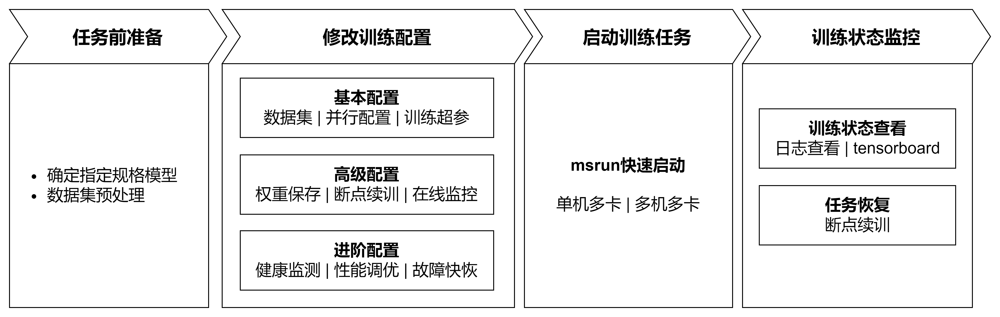

# 训练指南

## 概述

大模型预训练（Pretrain）是构建高性能语言模型的核心阶段，其本质是通过海量无标注数据让模型自主学习通用语言规律与知识。业界开源了许多各项指标优异的预训练模型，例如Llama、Qwen、DeepSeek系列模型，这些模型都在海量文本数据上学习“语言的概率分布”，使模型掌握词汇、语法、语义等通用能力，为下游任务（如问答、写作）提供扎实基础。

大模型微调（Fine-tuning）是在预训练模型基础上，通过少量有标注的领域/任务数据对模型参数进行进一步调整的过程。其核心目标是让模型适配特定应用场景（如医疗问答、法律文书生成等），提升在具体任务上的表现。微调通常采用以下方法：

a）全参数微调：调整模型全部参数（计算成本高，适合小规模模型）；

b）低参微调：如LoRA（仅训练低秩适配器），仅修改部分参数以节省资源。

微调依赖预训练模型已具备的通用语言能力，通过针对性数据（如标注的对话记录、专业文档）优化模型对特定任务的“理解”和“输出”。

如上文所述，预训练和微调差异主要来自数据及参数上，训练流程上大致是相同的。本质上都是通过反向传播算法优化模型参数，使损失函数最小化，从而提升模型对输入数据的预测或生成能力。MindSpore Transformers 提供了统一的预训练和微调训练流程，并针对差异点，结合生态提供了易用的解决方案。在统一训练流程中，启动训练任务可总结出如下关键步骤：

1. **任务前准备**：确定待训练模型配置、训练数据集准备，明确数据和模型两大关键点；
2. **修改训练配置**：基于已有硬件资源、模型以及数据，根据需求配置对应配置项。配置项涵盖基本配置、高级配置以及进阶配置，不同等级的配置项，允许训练任务完成不同的目标；
3. **启动训练任务**：基于已有硬件资源以及训练配置，通过快捷指令完成在不同集群规模下启动训练任务；
4. **训练状态监控**：在任务执行后，MindSpore Transformers提供各种手段观察训练状态，以供后续调试调优。

以下是MindSpore Transformers在LLM预训练/微调任务上关键流程的具体描述。

## 训练流程

### 1. 任务前准备

#### 确定指定规格模型

MindSpore Transformers支持了不同系列的预训练模型，例如Llama系列、DeepSeek系列以及Qwen3系列的一些典型规格，同时开源社区中也存在了一系列不同规格的模型。MindSpore Transformers在众多模型中，提供了不同等级规格用于区分对不同模型规格的支持度，以下为等级规格说明及使用该级别模型的使用说明。

<table>
  <tr>
    <th>级别</th>
    <th>级别说明</th>
    <th>使用说明</th>
  </tr>
  <tr>
    <td><strong>Released（发布级）</strong></td>
    <td>通过测试团队验收，确定性条件下，loss 与 grad norm 精度与标杆拟合度满足标准</td>
    <td>在MindSpore Transformers仓库configs/xxx文件夹下提供对应YAML配置文件，<strong>通常为开源模型的典型规格配置</strong>，可根据configs/xxx/README.md说明直接使用</td>
  </tr>
  <tr>
    <td><strong>Validated（验证级）</strong></td>
    <td>通过开发团队自验证，确定性条件下，loss 与 grad norm 精度与标杆拟合度满足标准</td>
    <td rowspan="3">MindSpore Transformers仓库未提供可直接运行的配置文件，可参考发布级模型规格的YAML配置文件及训练配置模板使用教程进行自定义训练配置文件，训练配置模板使用教程还提供了对应的预训练配置模板</td>
  </tr>
  <tr>
    <td><strong>Preliminary（初步级）</strong></td>
    <td>通过开发者初步自验证，功能完整可试用，训练正常收敛但精度未严格验证</td>
  </tr>
  <tr>
    <td><strong>Untested（未测试级）</strong></td>
    <td>功能可用但未经系统测试，精度和收敛性未验证，支持用户自定义开发使能</td>
  </tr>
  <tr>
    <td><strong>Community（社区级）</strong></td>
    <td>社区贡献的 MindSpore 原生模型，由社区开发维护</td>
    <td>根据社区说明使用</td>
  </tr>
</table>

上述表中，MindSpore Transformers为发布级模型提供了开箱即用的模型配置，针对其他级别模型，MindSpore Transformers不仅提供了基础框架能力支撑模型开发，还为开发者提供了一套训练配置模板，通过该配置模板可以快速完成模型参数（如层数、头数、隐藏层维度等核心配置）的定义与调整，实现发布级规格模型向未支持规格模型的快速迁移以及自定义模型的预训练任务快速启动，详细可参见[训练配置模板使用说明](https://www.mindspore.cn/mindformers/docs/zh-CN/r1.7.0/advanced_development/training_template_instruction.html)。

#### 数据集预处理

在自然语言处理任务中，数据预处理是模型训练的关键前置环节。它不仅解决原始数据中的噪声、格式不一致等问题（如特殊字符、乱码等），更能通过结构化转换（如分词、向量化）将原始文本转化为模型可理解的数值形式。虽然广义的数据预处理可能包含收集、清洗、分词等全流程操作，但本环节默认输入数据已具备基础质量（即"干净"数据），因此重点聚焦于**分词转换**这一核心目标。

**预训练数据处理**

在Megatron-LM训练框架中提供了一种多源混合数据集解决方案用于预训练任务，该方案实现了原始未分词数据到分词数据的转换，并采用轻量化的bin文件格式进行持久化存储。该方案支持两大特性：

- **灵活配置**：允许同时加载多个bin数据文件，并通过采样比例参数控制不同数据源的混合权重；
- **高效训练**：二进制存储格式大幅提升了IO效率，特别适合大规模预训练场景。

MindSpore Transformers在预训练任务中支持直接加载Megatron的多源混合数据集格式。Megatron-LM使用者无需重复数据预处理步骤，只需通过指定bin文件路径即可快速启动训练。如果已有bin文件，可参照后续训练配置修改章节在训练YAML配置文件中进行配置；如果无bin文件，则需要对原始训练数据转换成bin文件。MindSpore MindFormers提供了将json格式的原始数据集处理成bin文件的脚本工具，并以wiki103数据集为例，提供了预处理的全过程。具体详见[数据集使用-Megatron数据集章节](https://www.mindspore.cn/mindformers/docs/zh-CN/r1.7.0/feature/dataset.html#megatron%E6%95%B0%E6%8D%AE%E9%9B%86)。

**微调数据处理**

在自然语言处理模型的微调任务中，[HuggingFace社区](https://huggingface.co/)托管了丰富多样的开源微调数据集，这些数据集覆盖了众多领域和任务类型，如文本分类、命名实体识别、问答系统等，能够满足不同场景下的微调需求。这些开源数据集通常都是使用 [datasets](https://huggingface.co/docs/datasets/en/index) 库实现，该库提供了便捷的数据加载、预处理和管理功能，极大地简化了数据处理的流程。MindSpore Transformers 充分考虑了社区的使用习惯和需求，支持 [HuggingFace社区](https://huggingface.co/) 数据集的在线或者离线加载，具有良好的兼容性。其中：

- **在线加载**：可以通过配置YAML文件直接从 HuggingFace 数据集仓库中获取所需的数据集，无需手动下载和管理数据文件，方便快捷；
- **离线加载**：可以提前将所需的数据集下载到本地或将自有数据集处理成 datasets 数据集，然后在微调过程中从本地加载数据，避免了网络不稳定等因素的影响，确保微调任务的顺利进行。

具体处理方式，详见[数据集使用-HuggingFace数据集章节](https://www.mindspore.cn/mindformers/docs/zh-CN/r1.7.0/feature/dataset.html#hugging-face%E6%95%B0%E6%8D%AE%E9%9B%86)。

### 2. 配置文件准备

在进行一次预训练任务时，大模型参数量庞大（通常数十亿至万亿级），需依赖分布式计算资源高效训练以及对各项超参的修改，用于保证任务的正常执行及模型的最终性能指标。以下列举了预训练任务中大致的可更改的配置类型：

- **模型配置**：根据预定的模型规格，修改配置文件中与模型架构相关的参数，如层数、头数、隐藏层维度等；
- **数据配置**：指定预处理得到的数据集，配置数据集路径、数据加载方式等；
- **训练超参**：根据模型训练策略，指定优化器类型、损失函数、学习率、数据批量大小、训练轮数等；
- **并行策略**：根据集群规模及模型参数，配置运用数据并行、模型并行、流水线并行等技术使超大规模模型能够正常训练或进行性能调优；
- **状态监控**：配置loss打印步数间隔、配置tensorboard将关键状态值记录至tensorboard进行可视化、精度调试任务中配置打印/可视化关键数值用来定位精度问题，例如local norm、local loss、优化器状态等；
- **高可用相关**：配置权重保存步数、断点续训权重、故障检测、临终遗言等高可用特性，保障在训练过程中能够平稳运行。

根据不同的类型配置，以及在不同预训练场景下，在完成预训练准备后，该章节将MindSpore Transformers可配置的参数进行分层，对不同配置的适应场景进行说明，明确了大体能实现的目标，详细信息如下：

<table>
  <tr>
    <th>配置类型</th>
    <th>类型说明</th>
    <th>配置项</th>
    <th>配置指导</th>
  </tr>
  <tr>
    <td rowspan="3">基础配置</td>
    <td rowspan="3">通过配置该部分配置，能够基于当前模型结构下，拉起一个简单的训练任务</td>
    <td>数据集</td>
    <td><a href=https://www.mindspore.cn/mindformers/docs/zh-CN/r1.7.0/feature/dataset.html target="_blank">数据集使用</a></td>
  </tr>
  <tr>
    <td>并行配置</td>
    <td>
    <a href=https://www.mindspore.cn/mindformers/docs/zh-CN/r1.7.0/feature/configuration.html#%E5%B9%B6%E8%A1%8C%E9%85%8D%E7%BD%AE target="_blank">并行配置项说明</a> 
    <a href=https://www.mindspore.cn/mindformers/docs/zh-CN/r1.7.0/feature/parallel_training.html target="_blank">并行配置指南</a>
    </td>
  </tr>
  <tr>
    <td>训练超参</td>
    <td>
    <a href=https://www.mindspore.cn/mindformers/docs/zh-CN/r1.7.0/feature/configuration.html#%E6%A8%A1%E5%9E%8B%E8%AE%AD%E7%BB%83%E9%85%8D%E7%BD%AE target="_blank">模型训练配置</a>
    </td>
  </tr>
  <tr>
    <td rowspan="3">高级配置</td>
    <td rowspan="3">通过配置该部分配置，可支持训练任务执行后，对训练任务的训练状态进行感知，并保障多次训练任务的连贯</td>
    <td>权重保存</td>
    <td>
      <a href=https://www.mindspore.cn/mindformers/docs/zh-CN/r1.7.0/feature/configuration.html#callbacks%E9%85%8D%E7%BD%AE target="_blank">Callbacks配置CheckPointMonitor</a> 
      <a href=https://www.mindspore.cn/mindformers/docs/zh-CN/r1.7.0/feature/safetensors.html target="_blank">Safetensors权重使用指南</a>
    </td>
  </tr>
  <tr>
    <td>断点续训</td>
    <td>
      <a href=https://www.mindspore.cn/mindformers/docs/zh-CN/r1.7.0/feature/resume_training.html target="_blank">断点续训示例</a> 
      <a href=https://www.mindspore.cn/mindformers/docs/zh-CN/r1.7.0/feature/safetensors.html target="_blank">Safetensors权重使用指南</a>
    </td>
  </tr>
  <tr>
    <td>在线监控</td>
    <td>
      <a href=https://www.mindspore.cn/mindformers/docs/zh-CN/r1.7.0/feature/monitor.html target="_blank">训练指标监控</a>
    </td>
  </tr>
  <tr>
    <td rowspan="4">进阶配置</td>
    <td rowspan="4">通过配置该部分配置项，可支持训练过程的健康监测、故障快恢及性能调优，实现在不同集群规模下稳定并高性能训练</td>
    <td>健康监测</td>
    <td>
      <a href=https://www.mindspore.cn/mindformers/docs/zh-CN/r1.7.0/feature/skip_data_and_ckpt_health_monitor.html target="_blank">数据跳过与健康监测</a>
    </td>
  </tr>
  <tr>
    <td>性能调优</td>
    <td>
      <a href=https://www.mindspore.cn/mindformers/docs/zh-CN/r1.7.0/feature/memory_optimization.html target="_blank">训练内存优化</a> 
      <a href=https://www.mindspore.cn/mindformers/docs/zh-CN/r1.7.0/advanced_development/performance_optimization.html target="_blank">性能调优指南</a>
    </td>
  </tr>
  <tr>
    <td>故障快恢</td>
    <td>
      <a href=https://www.mindspore.cn/mindformers/docs/zh-CN/r1.7.0/feature/high_availability.html target="_blank">高可用特性</a> 
    </td>
  </tr>
</table>

除去以上配置项，训练任务的所有配置项由[配置文件](https://www.mindspore.cn/mindformers/docs/zh-CN/r1.7.0/feature/configuration.html)统一控制，可根据配置项说明灵活调整设置。

### 3. 启动训练任务

MindSpore Transformers支持单机多卡、多机多卡分布式训练，集群规模支持从单机8卡至万卡的超大规模分布式训练，具体启动方式可参照文档[训练任务启动](https://www.mindspore.cn/mindformers/docs/zh-CN/r1.7.0/feature/start_tasks.html)启动预训练任务。

### 4. 训练状态监控

预训练周期长，可能数周至数月，需实时监控关键指标并动态调整，以保障最终训练得到的模型能够达到预期的效果。训练过程中，关注的状态项可能包含：

- **性能指标**：每秒训练token数/样本数（吞吐量）、NPU利用率（算力利用率）、每step耗时；
- **精度指标**：损失函数值、梯度范数（防爆炸/消失）；
- **检查点检查**：定期保存模型中间状态（如每N步），防止训练中断导致数据丢失。

针对不同的监控值，MindSpore Transformers在训练过程中会打印详尽的日志用于查看中间过程状态，并提供tensorboard工具进行在线可视化，以更加直观的方式呈现，详细请参照[日志](https://www.mindspore.cn/mindformers/docs/zh-CN/r1.7.0/feature/logging.html)与[可视化工具](https://www.mindspore.cn/mindformers/docs/zh-CN/r1.7.0/feature/monitor.html)文档。权重在中间保存检查点或训练完成后，模型权重将保存至指定路径。当前支持保存为[Ckpt 格式](https://www.mindspore.cn/mindformers/docs/zh-CN/r1.7.0/feature/ckpt.html)或[Safetensors 格式](https://www.mindspore.cn/mindformers/docs/zh-CN/r1.7.0/feature/safetensors.html)，后续可以使用保存的权重进行续训或微调等。

## 训练实践

MindSpore Transformers提供了更为细致的预训练与微调流程及实践，详细参见[预训练实践](https://www.mindspore.cn/mindformers/docs/zh-CN/r1.7.0/guide/pre_training.html)及[微调实践](https://www.mindspore.cn/mindformers/docs/zh-CN/r1.7.0/guide/supervised_fine_tuning.html)。
