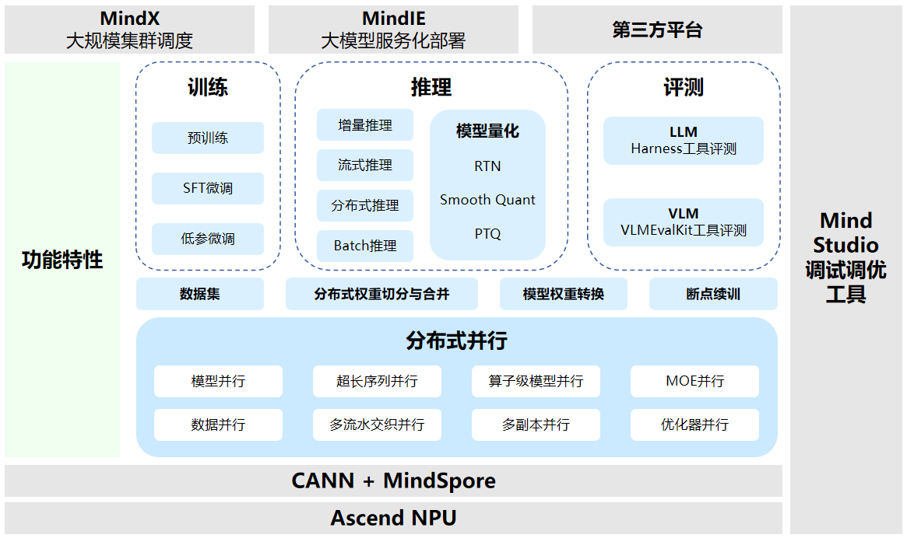

# 整体架构

MindSpore Transformers与昇思MindSpore、昇腾Ascend的端到端AI软硬件生态，形成的整体架构如下：

1. 在硬件层面，MindSpore Transformers支持用户在Ascend服务器上运行大模型；
2. 在软件层面，MindSpore Transformers通过MindSpore提供的Python接口实现大模型相关代码，并由昇腾AI处理器配套软件包提供的算子库进行数据运算；
3. MindSpore Transformers目前支持的基础功能特性如下：
   1. 支持大模型[分布式并行](https://www.mindspore.cn/mindformers/docs/zh-CN/dev/feature/parallel_training.html)运行训练和推理等任务，并行能力包括数据并行、模型并行、超长序列并行等；
   2. 支持[模型权重转换](https://www.mindspore.cn/mindformers/docs/zh-CN/dev/feature/weight_conversion.html)、[分布式权重切分与合并](https://www.mindspore.cn/mindformers/docs/zh-CN/dev/feature/transform_weight.html)、不同格式[数据集加载](https://www.mindspore.cn/mindformers/docs/zh-CN/dev/feature/dataset.html)以及[断点续训](https://www.mindspore.cn/mindformers/docs/zh-CN/dev/feature/resume_training.html)等功能；
   3. 支持25+大模型[预训练](https://www.mindspore.cn/mindformers/docs/zh-CN/dev/guide/pre_training.html)、[微调](https://www.mindspore.cn/mindformers/docs/zh-CN/dev/guide/supervised_fine_tuning.html)、[推理](https://www.mindspore.cn/mindformers/docs/zh-CN/dev/guide/inference.html)和[评测](https://www.mindspore.cn/mindformers/docs/zh-CN/dev/feature/evaluation.html)等功能，同时支持对模型参数进行[量化](https://www.mindspore.cn/mindformers/docs/zh-CN/dev/feature/quantization.html)，具体支持模型列表可参考[模型库](https://www.mindspore.cn/mindformers/docs/zh-CN/dev/introduction/models.html)；
4. MindSpore Transformers支持用户通过[MindIE](https://www.mindspore.cn/mindformers/docs/zh-CN/dev/guide/deployment.html)进行模型服务化部署功能，同时支持使用[MindX](https://www.hiascend.com/software/mindx-dl)实现大规模集群调度；后续将支持更多第三方平台，敬请期待。

