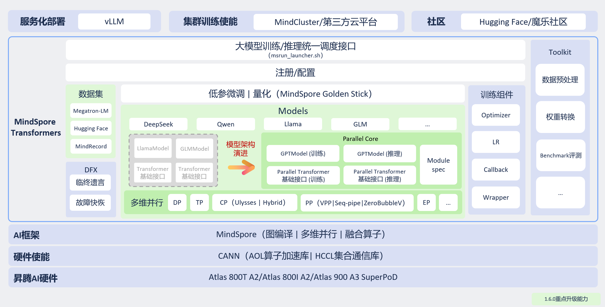

# 整体架构

## 概述

MindSpore Transformers 整体架构如下：

MindSpore Transformers 北向既支持昇腾自有技术栈，也积极拥抱开源社区。用户可将其集成在自有训推平台或者开源组件中，具体如下：

1. 训练平台：[MindCluster](http://hiascend.com/software/mindcluster)、第三方平台
2. 服务化组件：[vLLM](https://www.mindspore.cn/mindformers/docs/zh-CN/master/guide/deployment.html)
3. 社区：[魔乐社区](https://modelers.cn/)、[Hugging Face](https://huggingface.co/)

MindSpore Transformers 南向基于昇思+昇腾的大模型技术栈，利用昇思框架结合 CANN 对昇腾硬件进行亲和优化，提供高性能的模型训推体验。

MindSpore Transformers 主要分为如下模块：

1. 训推统一调度：提供启动脚本 `msrun_launcher.sh`，统一执行与调度套件内所有模型的分布式训推流程。
2. 注册/配置层：按接口类型实现类工厂，使能高阶接口层按配置初始化对应的任务接口、模型接口。
3. 大模型模型库：提供高性能大模型库以及基础 Transformer 接口，既可支持用户配置化构建自有模型，也可自定义开发，可满足不同开发场景。
4. 数据集：封装大模型训练、微调任务的数据加载接口，可支持 Hugging Face 数据集、Megatron 数据集以及 MindSpore 的 MindRecord 数据集。
5. 训练组件：提供训练流程的基础接口，包含学习率策略、优化器、训练回调以及训练包装接口等。
6. 工具层：提供数据预处理、Hugging Face 权重互转、评测工具脚本。
7. DFX（Design for X）：实现故障诊断、故障监测等高可用特性，降低训练故障恢复成本。

## 模型架构

MindSpore Transformers 在 1.6.0 版本之后应用了全新的模型架构，原有架构（标记为 Legacy）各模型单独实现一份模型代码，较难维护与优化。新架构（标记为 Mcore）对通用 Transformer 架构大模型进行分层抽象与模块化实现，涉及下层的基础层，如 Linear、Embedding、Norm 等，以及上层的 MoELayer、TransformerBlock 和模型统一接口 GPTModel（General PreTrained Model）等。所有模块化接口基于 MindSpore 提供的并行能力，进行了深度并行优化，对外提供开箱即用的高性能接口，支持通过 ModuleSpec 机制自由组合进行模型搭建。

## 训练能力

MindSpore Transformer 提供高效、稳定、易用的大模型训练能力，覆盖预训练和微调场景，兼顾性能与生态兼容性。核心能力包括：

**多维混合并行训练**

支持数据并行、模型并行、优化器并行、流水线并行、序列并行、上下文并行及 MoE 专家并行等多种并行策略的灵活组合，满足大规模模型的高效分布式训练。

**主流开源生态支持**

预训练阶段：支持直接加载 Megatron-LM 多源混合数据集，减少跨平台和框架的数据集迁移成本；

微调阶段：深度接入 Hugging Face 生态，支持：

- 使用 Hugging Face SFT 数据集；
- 使用 Hugging Face Tokenizer 进行数据预处理；
- 读取 Hugging Face 模型配置实例化模型；
- 加载原生 Hugging Face Safetensors 权重；

配合零代码、配置化使能低参微调的能力，实现高效便捷微调。

**模型权重易用性**

支持分布式权重自动切分与加载，无需手动转换权重，显著降低在分布式策略切换、集群扩缩容等场景下的调试复杂度，提升训练敏捷性。

**训练高可用保障**

提供训练状态监控、故障快恢、异常跳过、断点续训等特性，提升训练任务的可测试性、可维护性和可靠性，保障长周期训练稳定运行。

**模型低门槛迁移**

- 封装了高性能基础接口，接口设计与 Megatron-LM 对齐；
- 提供模型迁移指南和精度比对教程；
- 支持昇腾工具链 Cell 级 dump 调试能力；
- 实现低门槛、高效率的模型迁移与构建。

## 推理能力

MindSpore Transformers 构建了“北向生态融合、南向深度优化”的推理体系，配合开源组件提供高效易用的部署、量化、评测能力，助力大模型推理的开发与应用：

**北向生态融合**

- **Hugging Face 生态复用**

  支持直接加载使用 Hugging Face 开源模型的配置文件、权重和 Tokenizer，实现配置即用、一键启动推理，降低迁移与部署门槛。

- **对接 vLLM 服务化框架**

  支持对接 vLLM 服务化框架，实现推理服务化部署。支持 Continuous Batch、Prefix Cache、Chunked Prefill 等核心特性，显著提升吞吐与资源利用率。

- **支持量化推理**

  依托 MindSpore Golden-Stick 量化套件提供的量化算法，Legacy 模型已支持 A16W8、A8W8、A8W4 量化推理；Mcore 模型预计在下一版本中支持 A8W8 与 A8W4 量化推理。

- **支持开源榜单评测**

  通过 AISbench 评测套件，可对基于 vLLM 部署的模型进行评测，覆盖 CEval、GSM8K、AIME 等 20+ 主流榜单。

**南向深度优化**

- **算子多级流水下发**

  依靠 MindSpore 框架 Runtime 运行时能力，在 Host 侧将算子调度拆分成 InferShape、Resize 和 Launch 三个任务进行流水线式下发，充分发挥 Host 多线程并行优势，提升算子下发效率，降低推理延迟。

- 动静结合的执行模式

  默认采用 PyNative 编程模式 + JIT 即时编译技术，将模型编译成静态计算图进行推理加速；同时支持一键切换至 PyNative 动态图模式便于开发调试。

- 昇腾高性能算子加速

  支持使用 ACLNN、ATB和 MindSpore 提供的推理加速与融合算子，在昇腾底座上实现更加高效的推理性能。