# Accuracy Problem Locating and Optimization Guide

<a href="https://gitee.com/mindspore/docs/blob/master/docs/mindinsight/docs/source_en/accuracy_optimization.md" target="_blank"></a>

The final result of model training is to obtain a model with qualified accuracy. However, during AI training, the model loss may not decrease, or the model metrics may not reach the expected value. As a result, the model with ideal accuracy cannot be obtained, in this case, you need to analyze the problems that occur during the training and use methods such as adjusting data, adjusting hyperparameters, and reconstructing the model structure to solve the problems that occur during the model accuracy tuning.

This document describes the accuracy tuning methods summarized by the MindSpore team, the analysis process for solving problems during accuracy tuning, and the tools used for accuracy tuning in MindSpore.

## Analysis of Common Accuracy Problems

In the accuracy tuning practice, it is easy to find exceptions. However, if we are not sensitive to the exception and do not explain it, we are still unable to find the root cause of the problem. The following describes common accuracy problems, which can improve your sensitivity to exceptions and help you quickly locate accuracy problems.

### Common Symptoms and Causes of Accuracy Problems

Model accuracy problems are different from common software problems, and the locating period is longer. In a common program, if the program output is not as expected, a bug (coding error) exists. However, for a deep learning model, the model accuracy does not meet the expectation, and there are more complex reasons and more possibilities. The model accuracy needs to be trained for a long time before the final result can be viewed. Therefore, the positioning accuracy problem usually takes a longer time.

#### Common Symptoms

The direct symptoms of accuracy problems are generally reflected in model loss values and model metrics. The loss-related symptoms are as follows:

1. An abnormal loss value is displayed, such as NaN, +/- INF, or an extremely large value.
2. The loss does not converge or the convergence is slow.
3. The loss value is 0.

The metrics-related symptoms are as follows: The metrics (such as accuracy or precision) of a model cannot meet the expectation.

Direct phenomena of accuracy problems are easy to observe. With the help of visualization tools such as MindInsight, more phenomena can be observed on tensors such as gradients, weights, and activation values. Common symptoms are as follows:

1. Gradient disappearance.
2. Gradient explosion.
3. Weight not updated.
4. Weight change below threshold.
5. Weight change above threshold.
6. Activation value saturation.

#### Common Causes

The causes of accuracy problems can be classified into hyperparameter problems, model structure problems, data problems, and algorithm design problems.

- Hyperparameter Problems

    Hyperparameters are lubricants between models and data. The selection of hyperparameters directly affects the fitting effect of models on data. Common hyperparameter problems are as follows:

    1. The learning rate is set improperly (too high or too low).

        The learning rate is the most important hyperparameter in model training. If the learning rate is too high, loss flapping occurs and the expected value cannot be reached. If the learning rate is too low, the loss convergence is slow. The learning rate strategy should be selected rationally according to theory and experience.
    2. The loss_scale is set improperly.
    3. The weight initialization parameter is set improperly.
    4. The number of epochs is too large or too small.

        The number of epochs directly affects whether the model is underfitting or overfitting. If the number of epochs is too small, the model training stops before the optimal solution is obtained, and underfitting is likely to occur. If the number of epochs is too large, the model training time is too long, and overfitting is likely to occur on the training set. As a result, the optimal effect cannot be achieved on the test set. Select a proper number of epochs based on the model effect changes in the validation set during training.
    5. The batch size is too large.

        If the batch size is too large, the model may not be converged to an optimal minimum value, which reduces the generalization capability of the model.

- Data Problems

    - Dataset Problems

        The quality of the dataset determines the upper limit of the algorithm effect. If the data quality is poor, a better algorithm cannot achieve a better effect. Common dataset problems are as follows:

        1. The dataset contains too many missing values.

            If a dataset contains missing or abnormal values, the model learns incorrect data relationships. Generally, data with missing or abnormal values should be deleted from the training set, or a proper default value should be set. Incorrect data labels are a special case of abnormal values. However, this case is destructive to training. You need to identify this type of problem in advance by spot-checking the data of the input model.
        2. The number of samples in each class is unbalanced.

            This means that the number of samples of each class in the dataset varies greatly. For example, in the image classification dataset (training set), most classes have 1000 samples, but the cat class has only 100 samples. In this case, the number of samples is unbalanced. If the number of samples is unbalanced, the prediction effect of the model on the class with a small number of samples is poor. In this case, increase the number of samples in the class with a small sample size as appropriate. Generally, supervised deep learning algorithm can achieve acceptable performance in the case of 5000 labeled samples of each class. When there are more than 10 million labeled samples in the dataset, the model performance will exceed that of humans.
        3. The dataset contains abnormal values.
        4. Training samples are insufficient.

            Insufficient training samples indicate that the number of samples in the training set is too small compared with the model capacity. If training samples are insufficient, the training is unstable and overfitting is likely to occur. If the number of model parameters is not proportional to the number of training samples, you need to increase the number of training samples or reduce the model complexity.

        5. The label of the data is incorrect.

    - Data Processing Problems

        Common data processing problems are as follows:

        1. The data processing parameters are incorrect.
        2. Data is not normalized or standardized.

            If data is not normalized or standardized, the dimensions of the data input to the model are not in the same scale. Generally, the model requires that the data of each dimension ranges from -1 to 1, and the average value is 0. If there is an order of magnitude difference between scales of two dimensions, a model training effect may be affected. In this case, data needs to be normalized or standardized.

        3. The data processing mode is inconsistent with that of the training set.

            If the data processing mode is inconsistent with that of the training set, the processing mode of the model used for inference is inconsistent with that of the training set. For example, if the scaling, clipping, and normalization parameters of an image are different from those of the training set, the data distribution during inference is different from that during training, which may reduce the inference accuracy of the model.

            > Some data augmentation operations (such as random rotation and random clipping) are generally used only for training sets. Data augmentation is not required during inference.

        4. The dataset is not shuffled.

            This means that the dataset is not shuffled during training. If shuffling is not performed, or shuffling is insufficient, a model is always updated in a same data sequence, which severely limits selectability of a gradient optimization direction. As a result, fewer convergence points can be selected and overfitting is easy to occur.

- Algorithm Problems

    - API Usage Problems

         Common API usage problems are as follows:

         1. The API usage does not comply with the MindSpore constraints.

             This means that the API does not match the actual application scenario. For example, in scenarios where the divisor may contain zero, consider using DivNoNan instead of Div to avoid the divide-by-zero problem. For another example, in MindSpore, the first parameter of DropOut is the retention probability, which is opposite to that of other frameworks (theirs are the drop probabilities).

         2. The MindSpore constructor constraint is not complied with during graph construction.

             The graph construction does not comply with the MindSpore construct constraints. That is, the network in graph mode does not comply with the constraints declared in the MindSpore static graph syntax support. For example, MindSpore does not support the backward computation of functions with key-value pair parameters. For details about complete constraints, see [Static Graph Syntax Support](https://www.mindspore.cn/docs/en/master/note/static_graph_syntax_support.html).

    - Computational Graph Structure Problems

         The computational graph structure is the carrier of model computation. If the computational graph structure is incorrect, the code for implementing the algorithm is incorrect. Common problems in the computational graph structure are as follows:

         1. The operator is improperly used (the used operator does not apply to the target scenario).

         2. The weight is improperly shared (weights that should not be shared are shared).

             This means that the weight that should be shared is not shared or the weight that should not be shared is shared. You can check this type of problems through MindInsight computational graph visualization.

         3. The node is improperly connected. (The block that should be connected to the computational graph is not connected.)

             This means that the connection of each block in the computational graph is inconsistent with the design. If the node connection is incorrect, check whether the script is correct.

         4. The node mode is incorrect.

             If the node mode is incorrect, the training or inference mode of the node is inconsistent with the actual situation. For details about how to set the node mode, see [api.02 The mode is not set based on the training or inference scenario when the API is used.](https://www.mindspore.cn/mindinsight/docs/zh-CN/master/accuracy_problem_preliminary_location.html#api-02-api).

         5. The weight is improperly frozen (weights that should not be frozen are frozen).

             This means that the weight that should be frozen is not frozen or the weight that should not be frozen is frozen. In MindSpore, the freezing weight can be implemented by controlling the `params` parameter passed to the optimizer. Parameters that are not transferred to the optimizer will not be updated. You can check the weight freezing status by checking the script or viewing the parameter distribution histogram in MindInsight.

         6. The loss function is incorrect.

             This means that the algorithm of the loss function is incorrect or no proper loss function is selected. For example, `BCELoss` and `BCEWithLogitsLoss` are different. Select a proper value based on whether the `sigmoid` function is required.

         7. The optimizer algorithm is incorrect (if the optimizer is implemented).

    - Weight Initialization Problems

        The initial weight value is the start point of model training. An improper initial weight value affects the speed and effect of model training. Common weight initialization problems are as follows:

        1. The initial values of all weights are 0.

            This means that the weight values are 0 after initialization. This typically results in weight update problems, and the weights should be initialized with random values.

        2. In distributed scenarios, the initial weight values of different nodes are different.

            In a distributed scenario, the initial weight values of different nodes are different. That is, after initialization, the initial weight values of the same name on different nodes are different. In normal cases, MindSpore performs the global AllReduce operation on gradients. Ensure that the weight update amount is the same at the end of each step to ensure that the weight of each node in each step is the same. If the weight of each node is different during initialization, the weight of each node is in different states in subsequent training, which directly affects the model accuracy. In distributed scenarios, the same random seed must be used to ensure that the initial weight values are the same.

- Multiple possible causes exist for the same symptom, making it difficult to locate accuracy problems.

    Take loss non-convergence as an example (as shown in the following figure). Any problem that may cause activation value saturation, gradient disappearance, or incorrect weight update may cause loss non-convergence. For example, some weights are incorrectly frozen, the used activation function does not match the data (the relu activation function is used, and all input values are less than 0), and the learning rate is too low.

    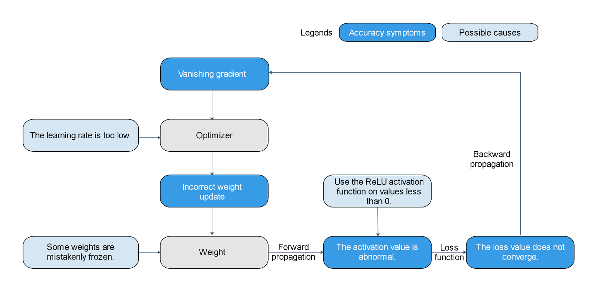

    *Figure 1: Multiple possible causes exist for the same symptom, making it difficult to locate accuracy problems.*

#### Accuracy Checklist

| Common Dataset Problems|  Common Hyperparameter Problems | Common Computational Graph Structure Problems|    Common Data Processing Algorithm Problems   |           FAQs About API Usage          |         Common Weight Initialization Problems        |
| :------------ | :------------ | :---------------- | :------------------------ | :--------------------------------- | :-------------------------------- |
| The dataset contains too many missing values.|   The learning rate is too high.  |    The weight is improperly shared.   | Data is not normalized or standardized.|    The API usage does not comply with the MindSpore constraints.    |         The initial values of all weights are 0.         |
| The number of samples in each class is unbalanced.|   The learning rate is too low.  |    The weight is improperly frozen.   | The data processing mode is inconsistent with that of the training set.| The MindSpore constructor constraint is not complied with during graph construction.| In distributed scenarios, the initial weight values of different nodes are different.|
| The dataset contains abnormal values.|   The number of epochs is too small.   |    The node is improperly connected.   |  The dataset is not shuffled.  |                                     |                                    |
|  Training samples are insufficient. |   The number of epochs is too large.   |   The node mode is incorrect.  |                            |                                     |                                    |
| The label of the data is incorrect.| The batch size is too large.|    The loss function is incorrect.   |                            |                                     |                                    |

### Common Accuracy Debugging and Tuning Methods

When an accuracy problem occurs, the common debugging and tuning process is as follows:

1. Check the code and hyperparameters.

    Code is an important source of accuracy problems. Code check focuses on checking scripts and code to find problems at the source. The model structure reflects MindSpore's understanding of code.
2. Check the model structure.

    Checking the model structure focuses on checking whether the understanding of MindSpore is consistent with the design of algorithm engineers.
3. Check the input data.
4. Check the loss curve.

    Some problems can be found only in the dynamic training process. Checking the input data and loss curve is to check the code and dynamic training phenomenon.
5. Check whether the accuracy meets the expectation.

    To check whether the accuracy meets the expectation, you need to review the overall accuracy tuning process and consider tuning methods such as adjusting hyperparameters, explaining models, and optimizing algorithms.

Check the model structure and hyperparameters to check the static features of the model. Check the input data and loss curve to check the static features and dynamic training phenomena. To check whether the accuracy meets the expectation, you need to review the overall accuracy tuning process and consider tuning methods such as adjusting hyperparameters, explaining models, and optimizing algorithms. In addition, it is important to be familiar with the models and tools. To help users efficiently implement the preceding accuracy tuning process, MindInsight provides the following capabilities.

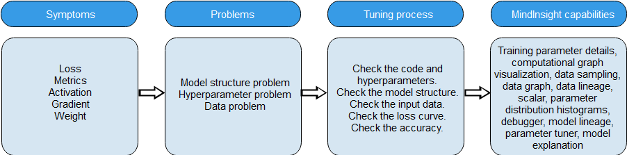

*Figure 2 Accuracy problem locating process and MindInsight capabilities*

The following sections describe the process.

#### Preparing for Accuracy Tuning

1. Review the algorithm design and get familiar with the model.

    Before accuracy tuning, review the algorithm design to ensure that the algorithm design is clear. If the model is implemented by referring to a paper, review all design details and hyperparameter selection in the paper. If the model is implemented by referring to other framework scripts, ensure that there is a unique benchmark script that meets the accuracy requirements. If the algorithm is newly developed, the important design details and hyperparameter selection must be specified. The information is an important basis for checking the script.

    Before accuracy tuning, you need to be familiar with the model. You can accurately understand the information provided by MindInsight, determine whether there are problems, and locate the problem source only after you are familiar with the model. Therefore, it is important to spend time understanding model elements such as the model algorithm and structure, functions of operators and parameters in the model, and features of the optimizer used by the model. Before analyzing the details of accuracy problems, you are advised to deepen the understanding of these model elements with questions.

2. Be familiar with the [MindInsight](https://www.mindspore.cn/mindinsight/docs/en/master/index.html) tool.

    During accuracy problem locating, you are advised to use the MindInsight function by referring to [Collecting Summary Record](https://www.mindspore.cn/mindinsight/docs/en/master/summary_record.html) and add `SummaryCollector` to the script. As shown in the following training code segment, initialize `SummaryCollector` and add it to the `callbacks` parameter of `model.train`.

    ```python
    # Init a SummaryCollector callback instance, and use it in model.train or model.eval
    summary_collector = SummaryCollector(summary_dir='./summary_dir', collect_freq=1)

    # Note: dataset_sink_mode should be set to False, else you should modify collect freq in SummaryCollector
    model.train(epoch=1, train_dataset=ds_train, callbacks=[summary_collector], dataset_sink_mode=False)

    ds_eval = create_dataset('./dataset_path')
    model.eval(ds_eval, callbacks=[summary_collector])
    ```

    > dataset_path indicates the local path of the training dataset.

    View the training process data on the [dashboard](https://www.mindspore.cn/mindinsight/docs/en/master/dashboard.html).

    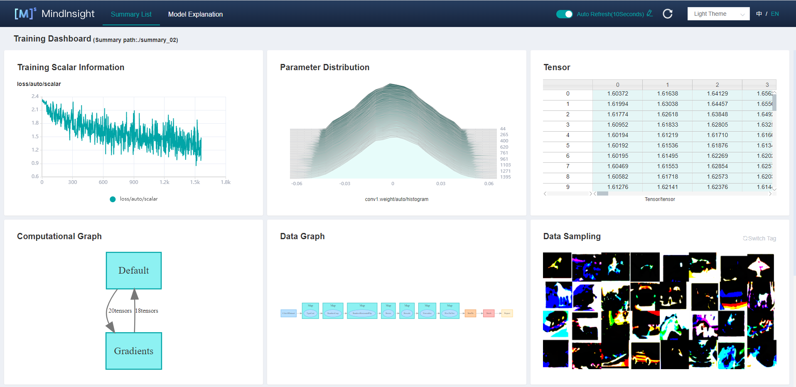

    *Figure 3 Training dashboard*

    To debug a model online, use the [debugger](https://www.mindspore.cn/mindinsight/docs/en/master/debugger.html).

#### Checking the Code and Hyperparameters

Code is an important source of accuracy problems. Hyperparameter problems, model structure problems, data problems, and algorithm design and implementation problems are reflected in scripts. Checking scripts is an efficient method to locate accuracy problems. Code check mainly depends on code walk-through. You are advised to use the rubber duck debugging method. During code walk-through, explain the function of each line of code to a rubber duck to inspire yourself and find code problems. When checking the script, check whether the script implementation (including data processing, model structure, loss function, and optimizer implementation) is consistent with the design. If other scripts are referenced, check whether the script implementation is consistent with other scripts. All inconsistencies must be properly justified; otherwise, modify it.

When checking the script, pay attention to the hyperparameters. Hyperparameter problems are mainly caused by improper hyperparameter values. For example:

1. The learning rate is not properly set.
2. The `loss_scale` is set improperly.
3. The weight initialization parameter is set improperly.

MindInsight helps users check hyperparameters. In most cases, `SummaryCollector` automatically records common hyperparameters. You can use the training parameter details function and lineage analysis function of MindInsight to view hyperparameters. Based on the lineage analysis module of the MindInsight model and the code in the script, you can confirm the hyperparameter values and identify improper hyperparameters. If there is a benchmark script, you are advised to compare the hyperparameter values with those in the benchmark script one by one. If there are default parameter values, the default values should also be compared to avoid accuracy decrease or training errors caused by different default parameter values of different frameworks.

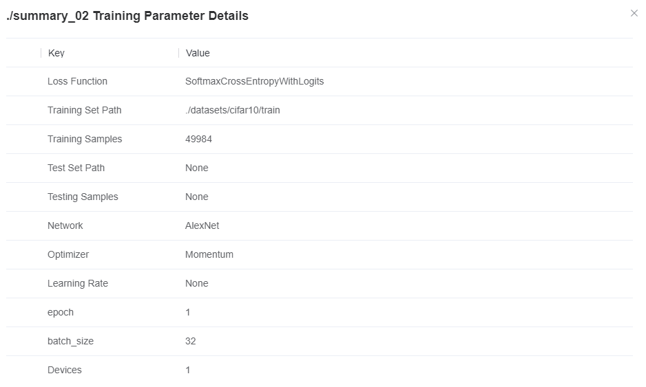

*Figure 4 Viewing model hyperparameters through MindInsight training parameter details*

#### Checking the Model Structure

Common problems in the model structure are as follows:

1. The operator is improperly used. (The used operator does not apply to the target scenario. For example, floating-point division should be used, but integer division is used.)
2. The weight is improperly shared (weights that should not be shared are shared).
3. The weight is improperly frozen (weights that should not be frozen are frozen).
4. The node is improperly connected. (The block that should be connected to the computational graph is not connected.)
5. The loss function is incorrect.
6. The optimizer algorithm is incorrect (if the optimizer is implemented).

You are advised to check the model structure by checking the model code. In addition, MindInsight can help users check the model structure. In most cases, the `SummaryCollector` automatically records the computational graph. You can use MindInsight to view the computational graph.


*Figure 5 Viewing the model structure through the computational graph module on the MindInsight training dashboard*

After the model script is executed, you are advised to use the MindInsight computational graph visualization module to view the model structure, deepen the understanding of the computational graph, and ensure that the model structure meets the expectation. If a benchmark script is available, you can view the computational graph by comparing it with the benchmark script to check whether there are important differences between the computational graph of the current script and that of the benchmark script.

Considering that the model structure is complex, it is unrealistic to find all model structure problems in this step. As long as the visual model structure to deepen the understanding of the computational graph, find obvious structural problems. In the following steps, if a more specific accuracy problem is found, we will go back to this step to check and confirm the problem again.

> MindInsight allows you to view the computational graph recorded by `SummaryCollector` and the PB file computational graph exported by the `save_graphs` parameter of MindSpore context. Please refer to [Viewing Dashboard](https://www.mindspore.cn/mindinsight/docs/en/master/dashboard.html) in our tutorial for more information.
>
> The script migration tool can convert models compiled under the PyTorch and TensorFlow frameworks into MindSpore scripts. For more information, visit [Migrating From Third Party Frameworks With MindConverter](https://www.mindspore.cn/mindinsight/docs/en/master/migrate_3rd_scripts_mindconverter.html).

#### Checking the Input Data

By checking the data of the input model, you can determine whether the data processing pipeline and dataset are faulty based on the script. Common data input problems are as follows:

1. The data contains too many missing values.
2. The number of samples in each class is unbalanced.
3. The data contains abnormal values.
4. The label of the data is incorrect.
5. Training samples are insufficient.
6. Data is not standardized, and the data input to the model is not within the correct range.
7. The data processing methods of fine-tune and pretrain are different.
8. The data processing method in the training phase is different from that in the inference phase.
9. The data processing parameters are incorrect.

MindInsight helps users check input data and data processing pipelines. In most cases, `SummaryCollector` automatically records the input model data (data after processing) and data processing pipeline parameters. The data of the input model is displayed in the "Data Sampling" area, and the pipeline parameters are displayed in the "Data Graph" and "Dataset Lineage" areas.

You can use the data sampling module of MindInsight to check the data (processed by the data processing pipeline) of the input model. If the data is obviously not as expected (for example, the data is cropped too much or the data rotation angle is too large), the input data is incorrect.

You can use the data graph and data lineage module of MindInsight to check the data processing process and parameter values of the data processing pipeline to find improper data processing methods.

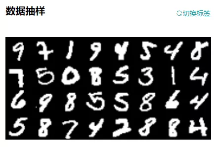

*Figure 6 Viewing the data of the input model through the data sampling module on the MindInsight training dashboard*

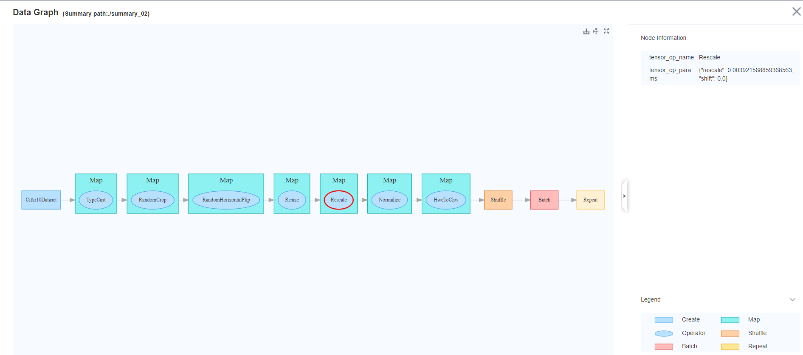

*Figure 7 Viewing the data processing pipeline through the data graph in the MindInsight training dashboard*

If there is a benchmark script, you can compare it with the benchmark script to check whether the data output by the data processing pipeline is the same as the data in the current script. For example, save the data output by the data processing pipeline as the `npy` file, and then use the `numpy.allclose` method to compare the data in the benchmark script with that in the current script. If a difference is found, an accuracy problem may exist in the data processing phase.

If no problem is found in the data processing pipeline, you can manually check whether the dataset has problems such as unbalanced classification, incorrect label matching, too many missing values, and insufficient training samples.

#### Checking the Loss Curve

Many accuracy problems are found during network training. The common problems or symptoms are as follows:

1. The weight initialization parameter is set improperly (for example, the initial value is 0 or the initial value range is improper).
2. The weight is too large or too small.
3. Weight change above threshold.
4. The weight is improperly frozen.
5. The weight is improperly shared.
6. The activation value is saturated or too weak (for example, the output of Sigmoid is close to 1, and the output of ReLU is all 0s).
7. Gradient explosion and disappearance.
8. The number of training epochs is insufficient.
9. The operator computation results include NaN and INF.

Some of the preceding problems or symptoms can be reflected by loss, and some are difficult to observe. MindInsight provides targeted functions to observe the preceding symptoms and automatically check problems, helping you quickly locate root causes. For example:

- The parameter distribution histogram module of MindInsight can display the change trend of model weights during the training process.
- The Tensor Visualization module of MindInsight can display the specific values of tensors and compare different tensors.
- The [MindInsight debugger](https://www.mindspore.cn/mindinsight/docs/en/master/debugger.html) provides various built-in check capabilities to check weight problems (for example, the weight is not updated, the weight is too large, or the weight value is too large or too small) and gradient problems (for example, gradient disappearance and explosion), activation value problems (for example, the activation value is saturated or too weak), all tensors are 0, and NaN/INF problems.


*Figure 8 Viewing the loss curve through the scalar visualization module on the MindInsight training dashboard*

In most cases, the `SummaryCollector` automatically records the loss curve of the model. You can view the loss curve through the scalar visualization module of MindInsight. The loss curve reflects the dynamic trend of network training. By observing the loss curve, you can check whether the model is converged and whether the model is overfitting.

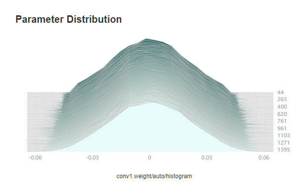

*Figure 9 Viewing the weight changes during training through the MindInsight parameter distribution chart*

In most cases, the `SummaryCollector` automatically records the model parameter changes (five parameters by default). You can view the changes in the parameter distribution histogram of MindInsight. If you want to record the parameter distribution histogram of more parameters, see the `histogram_regular` parameter in [SummaryCollector](https://www.mindspore.cn/docs/en/master/api_python/mindspore.train.html#mindspore.train.callback.SummaryCollector) or the [HistogramSummary](https://www.mindspore.cn/mindinsight/docs/en/master/summary_record.html#summarysummarycollector) operator.

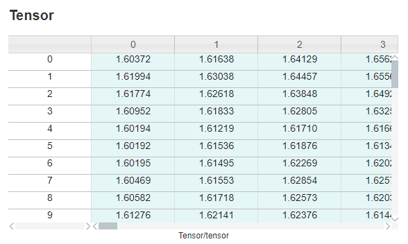

*Figure 10 Viewing the value of a specific tensor through the tensor visualization module on the MindInsight training dashboard*

Tensors are not automatically recorded. To view the tensor values through MindInsight, use the [TensorSummary](https://www.mindspore.cn/mindinsight/docs/en/master/summary_record.html#summarysummarycollector) operator.

The following describes how to use MindInsight to locate accuracy problems based on the common symptoms of the loss curve.

- An abnormal loss value is displayed.

    This means that the NaN, +/-INF, or an extremely large value is displayed in loss. Generally, the abnormal loss value indicates that the algorithm design or implementation is incorrect. The locating process is as follows:

    1. Review the script, model structure, and data.

        (1) Check whether the values of hyperparameters are excessively large or small.

        (2) Check whether the model structure is correctly implemented, especially whether the loss function is correctly implemented.

        (3) Check whether the input data contains missing values or values that are too large or too small.

    2. Observe the parameter distribution histogram on the training dashboard and check whether the parameter update is abnormal. If a parameter update exception occurs, you can use the debugger to locate the cause of the exception.
    3. Use the debugger module to check the training site.

        (1) If the value of loss is NaN or +/-INF, add a global watchpoint by checking tensor overflow. Locate the operator node where NaN or +/-INF is displayed first and check whether the input data of the operator causes a computation exception (for example, division by zero). If the problem is caused by the operator input data, add a small value epsilon to avoid computation exceptions.

        (2) If the value of loss is too large, add a global watchpoint by checking the large tensor. Locate the operator node with a large value and check whether the input data of the operator causes the computation exception. If the input data is abnormal, you can continue to trace the operator that generates the input data until the specific cause is located.

        (3) If you suspect that the parameter update or gradient is abnormal, you can set the watchpoints by using the conditions such as "Weight change above threshold", "Gradient disappearance", and "Gradient above threshold" to locate the abnormal weight or gradient. Then, check the tensor view, check suspicious forward operators, backward operators, and optimizer operators layer by layer.

- The loss convergence is slow.

    This means that loss flapping occurs and the convergence speed is slow. The expected value can be reached after a long time or cannot be converged to the expected value finally. Compared with the abnormal loss value, the slow convergence of loss is not obvious and is more difficult to locate. The locating process is as follows:

    1. Review the script, model structure, and data.

        (1) Check whether the hyperparameter values are too large or too small. Especially, check whether the learning rate is too small or too large. If the learning rate is too small, the convergence speed is slow. If the learning rate is too large, the loss fluctuates and does not decrease.

        (2) Check whether the model structure is correctly implemented, especially whether the loss function and optimizer are correctly implemented.

        (3) Check whether the range of the input data is normal, especially whether the value of the input data is too small.

    2. Observe the parameter distribution histogram on the training dashboard and check whether the parameter update is abnormal. If a parameter update exception occurs, you can use the debugger to locate the cause of the exception.
    3. Use the debugger module to check the training site process.

        (1) You can use the "Weight change below threshold" and "Unchanged weight" conditions to monitor the weights that can be trained (not fixed) and check whether the weight change is too small. If the weight change is too small, check whether the learning rate is too small, whether the optimizer algorithm is correctly implemented, and whether the gradient disappears. If yes, rectify the fault accordingly.

        (2) You can use the "Gradient disappearance" condition to monitor the gradient and check whether the gradient disappears. If the gradient disappears, check the cause of the gradient disappearance. For example, you can check whether the activation value is saturated or the ReLU output is 0 by using the "Activation value range" condition.

    4. Other loss symptoms.

        If the loss of the training set is 0, the model is overfitting. In this case, increase the size of the training set.

#### Checking Whether the Accuracy Meets the Expectation

MindInsight can record the accuracy result of each training for users. When the same `SummaryCollector` instance is used in `model.train` and `model.eval`, the model evaluation information (metrics) is automatically recorded. After the training is complete, you can use the model lineage module of MindInsight to check whether the accuracy of the training result meets the requirements.


*Figure 11 Viewing model evaluation information using the MindInsight lineage analysis function*

- Check the accuracy of the training set.

    If the loss and metric values of the model in the training set do not meet the expectation, locate and optimize the fault as follows:

    1. Review the code, model structure, input data, and loss curve.

        (1) Check the script to check whether the hyperparameter has an improper value.

        (2) Check whether the model structure is correctly implemented.

        (3) Check whether the input data is correct.

        (4) Check whether the convergence result and trend of the loss curve are normal.

    2. Try to use the MindInsight lineage analysis function to optimize hyperparameters. The lineage analysis page analyzes the importance of hyperparameters. You need to preferentially adjust hyperparameters with high importance. You can observe the relationship between hyperparameters and optimization objectives in the scatter chart and adjust the hyperparameter values accordingly.

        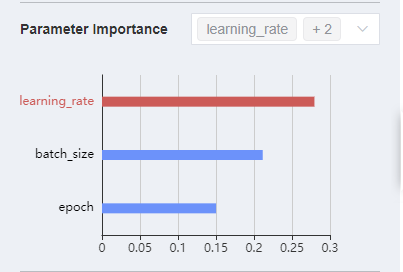

        *Figure 12 Checking parameter importance through MindInsight lineage analysis*

        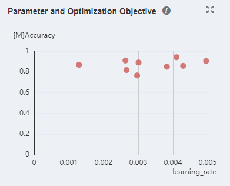

        *Figure 13 Viewing the relationship between parameters and optimization objectives in a scatter chart through MindInsight lineage analysis*

    3. Try to use the [MindInsight parameter tuner](https://www.mindspore.cn/mindinsight/docs/en/master/hyper_parameters_auto_tuning.html) to optimize hyperparameters. It should be noted that the parameter debugger performs hyperparameter search by performing multiple times of complete training, and the time consumed is several times of the time consumed by one time of network training. If one time of network training takes a long time, the hyperparameter search takes a long time.
    4. Try to use the [MindInsight model explanation](https://www.mindspore.cn/mindinsight/docs/en/master/model_explanation.html) function to optimize the model and dataset. The model explanation function can display the area that is most important to the classification result through saliency map visualization. In addition, the scoring system can be used to indicate the type of labels to be optimized.
    5. Try the common tuning suggestions described in the following sections.

- Check the accuracy of the validation set.

    If the accuracy of the training set and that of the validation set do not meet the expectation, check the accuracy of the training set by referring to the previous section. If the accuracy of the training set reaches the expected value but the accuracy of the validation set does not reach the expected value, there is a high probability that the model is overfitting. The handling procedure is as follows:

    1. Check whether the evaluation logic of the validation set evaluation script is correct. Especially, check whether the data processing mode is consistent with that of the training set, whether the inference algorithm is incorrect, and whether the correct model checkpoint is loaded.
    2. Increase the data volume, including increasing the number of samples, enhancing data, and perturbing data.
    3. Perform regularization. Common technologies include parameter norm penalty (for example, adding a regular term to the target function), parameter sharing (forcing two components of a model to share the same parameter value), and early termination of training.
    4. Reduce the scale of the model. For example, reducing a quantity of convolutional layers.

- Check the accuracy of the test set.

    If the accuracy of the validation set and test set does not meet the expectation, check the accuracy of the validation set by referring to the previous section. If the accuracy of the validation set reaches the expected value but the accuracy of the test set does not reach the expected value, the possible cause is that the data distribution of the test set is inconsistent with that of the training set because the data in the test set is new data that has never been seen by the model. The handling process is as follows:

    1. Check whether the evaluation logic of the test set evaluation script is correct. Especially, check whether the data processing mode is consistent with that of the training set, whether the inference algorithm is incorrect, and whether the correct model checkpoint is loaded.
    2. Check the data quality of the test set. For example, check whether the data distribution range is obviously different from that of the training set and whether a large number of noises, missing values, or abnormal values exist in the data.

## Common Tuning Suggestions

This section provides common accuracy tuning suggestions for data, algorithms, and hyperparameters. If the difference between the accuracy and the benchmark script is small (for example, only a few percentage points), you can try different optimization advice based on scenarios.

In scenarios where benchmark scripts are available, for example, model migration or paper reproduction, you need to check whether the MindSpore script is correct by referring to the preceding sections. If no problem is found after the preceding operations are performed, you need to optimize hyperparameters first.

If no benchmark script is available, for example, when a new algorithm is developed, refer to the optimization suggestions one by one.

### Data Optimization

#### Ensuring a Balanced Number of Samples in Each Class

When the number of samples of each classification in the dataset is unbalanced, you need to adjust the number of samples to ensure that each class has similar impact on training. The following methods can be considered:

Data resampling-based methods:

1. Oversample classes with a small number of samples.
2. Undersample classes with a large number of samples.
3. Use the preceding two solutions together.

By means of the foregoing resampling, a quantity of samples that appear in each class in a training process is relatively balanced. It should be noted that oversampling has a risk of overfitting (Cao et al., 2019).

Cost-based methods:

1. The loss function remains unchanged. The loss weight is reset based on the number of samples in each class. The weight is the reciprocal of the square root of the number of samples in each class.
2. The loss function directly reflects the class imbalance, which forces the range between the decision boundaries of the same class with a small number of samples to be expanded.

#### Obtaining More Data

The most direct way to improve the model effect is to obtain more data. The larger the training set, the better the model effect.

#### Normalizing Data

Normalization refers to mapping data to a same scale. Common operation methods include resize, rescale, normalize, and the like. Normalizing data according to the upper and lower bounds of the value range of the activation function can usually achieve a good effect. For example, when the Sigmoid activation function is used, it is recommended that the input be normalized to a value between 0 and 1. When the tanh activation function is used, it is recommended that the input be normalized to a value between –1 and 1.

In addition, different data normalization methods may be systematically tried, including normalizing the data to the range of [0, 1], normalizing the data to the range of [–1, 1], or normalizing the data to a distribution with a mean value of 0 and a variance of 1. The performance of the model is then evaluated for each data normalization approach.

#### Transforming Data to Ensure that Data Is Evenly Distributed

For data of the numeric type, you can convert the data to adjust the data distribution. For example, if data in a column is exponentially distributed, a log transformation may be performed to transform the data in the column to be evenly distributed.

### Algorithm Optimization

#### Referring to Existing Work

If the algorithm to be implemented has a lot of related research work, you can refer to the related paper, record the methods used in the paper, and try various possible combinations based on experience. For example, when training a generative adversarial network (GAN), you may find that the accuracy is several percentage points lower than the standard. In this case, you can refer to some research work and try the techniques used, for example, changing the loss function (such as WGAN and WGAN-GP) or modifying the training method (for example, change the number of training times of the Generator and Discriminator in each step from 1 to 3).

#### Optimizing the Size of Each Layer in the Model

During model design, sizes of all layers (for example, input and output sizes of the convolutional layer) may be designed to be the same at the beginning. It has been proved by research that if the sizes of all layers are set to be the same, the model performance is generally not worse than that of the pyramid (the size of the layer increases layer by layer) or the inverted pyramid (the size of the layer decreases layer by layer).

It is recommended that the size of the first hidden layer be greater than the input size. Compared with a case in which the size of the first hidden layer is less than the input size, the model performs better when the size of the first hidden layer is greater than the input size.

#### Selection and Optimization of Model Layers

Models with more layers have more opportunities to express and reorganize abstract features in data, provide stronger representation capabilities, but are prone to overfitting. Models with fewer layers are prone to underfitting.

#### Selection and Optimization of Initial Weight Values

The initial weight value has a great impact on the training effect. In the MindSpore model delivery practice, the accuracy difference is often caused by the initial weight value. If there is a benchmark script, ensure that the weight initialization mode of the MindSpore script is the same as that of the benchmark script. If the weight initialization mode is not specified, the default initialization mode of each framework is used. However, the default weight initialization modes of frameworks such as MindSpore, PyTorch, and TensorFlow are different.

Common weight initialization modes are as follows:

1. Random initialization
2. Xavier initialization (Glorot & Bengio, 2010)
3. Kaiming initialization (He et al., 2015)

Xavier initialization is applicable to a network that uses tanh as an activation function, but is not applicable to a network that uses ReLU as an activation function. Kaiming initialization is applicable to a network that uses ReLU as an activation function. Constant initialization and all-zero initialization (except bias) are not recommended because when the weights are initialized to a unified constant (for example, 0 or 1), all neurons learn the same features (with the same gradient). As a result, the model performance is poor. You are not advised to set the initial weight to a large or small value. If the initial weight is too small, the model convergence may be slow and may not be converged on a deep network. This is because a too small weight may cause the activation value to be too small and the gradient to disappear. When the initial weight is too large, the model may not converge at all. This is because a large weight easily causes gradient explosion and disturbs the direction of parameter update.

Before batch normalization is proposed, the average value and variance of the initial weight values need to be considered. Simply speaking, the size of the model output is related to the weight product (and the output range of the activation function). When the weight value is too small, the size of the model output becomes small. When the weight value is too large, the size of the model output becomes large, both Xavier and Kaiming initializations are pushed for the purpose of stabilizing the weight variance and the output range of the activation function. When batch normalization is used on the network, the dependency on the initial weight value can be reduced to some extent. However, you are advised to use the recommended weight initialization method.

If you are not sure which weight initialization mode is used, you can fix other factors and compare multiple weight initialization modes.

#### Selection and Optimization of Activation Functions

For most networks such as a convolutional neural network (CNN), the ReLU activation function is usually a good choice. If the ReLU effect is not good, try variants such as Leaky ReLU or Maxout. For a recurrent neural network (RNN), the tanh function is also a good choice. Unless you are an expert in this field and have clear motivation or theoretical analysis support, you are not advised to try activation functions that have not been proved in academia.

In a CNN that is not particularly deep, the effect of the activation function is generally not too great.

#### Selection and Optimization of Optimizers

The optimizer affects the model accuracy and convergence speed (number of parameter updates required for convergence). Generally, the Adam optimizer is a good choice. The optimizer with momentum helps improve the training speed when the batch size is large.

When selecting optimizers, pay attention to the functional inclusion relationship between optimizers (Choi et al., 2019). For example, the [RMSProp](https://mindspore.cn/docs/en/master/api_python/nn/mindspore.nn.RMSProp.html#mindspore.nn.RMSProp) optimizer function includes the [Momentum](https://mindspore.cn/docs/en/master/api_python/nn/mindspore.nn.Momentum.html#mindspore.nn.Momentum) optimizer function. This is because if the decay parameter in RMSProp is set to 1 and the epsilon parameter is set to 0, RMSProp is equivalent to a Momentum optimizer whose momentum is momentum/learning_rate. The [Adam](https://mindspore.cn/docs/en/master/api_python/nn/mindspore.nn.Adam.html#mindspore.nn.Adam) optimizer also includes the functions of the Momentum optimizer. The Momentum optimizer and [SGD](https://mindspore.cn/docs/en/master/api_python/nn/mindspore.nn.SGD.html#mindspore.nn.SGD) optimizer of MindSpore have similar functions. On the other hand, note that an optimizer with more powerful functions usually has more parameters, and it takes a longer time to find proper hyperparameters.

#### Early Stop

Once the performance of the validation set decreases, the training should be stopped to avoid overfitting, that is, the early stop method.

### Hyperparameter Optimization

In a narrow sense, hyperparameters are variables that are manually determined before training. In a broad sense, the model design selection discussed above may also be considered as a hyperparameter, for example, network layer number design and activation function selection. It should be noted that a result obtained through training cannot be considered as a hyperparameter. For example, weight data obtained through training is not a hyperparameter. Unless otherwise specified, the optimization hyperparameters in the following sections refer to hyperparameters in a narrow sense.

When performing hyperparameter optimization, note that there is no universal optimal hyperparameter. Selecting optimal hyperparameters requires both experience and continuous trial and error.

#### Selection and Optimization of Learning Rates

The learning rate is a hyperparameter that controls how to use the gradient of the loss function to adjust the network weight. The value of the learning rate has an important impact on whether the model can be converged and the convergence speed of the model. Compared with a fixed learning rate, a cyclic change of the learning rate in a training process is generally beneficial to model convergence. A maximum value and a minimum value of a cyclic change learning rate may be determined in this way (Smith, 2017): Select a sufficiently large learning rate range (for example, from 0 to 5), set the number of epochs (for example, 10) for training, and linearly (or exponentially) iteratively increase the learning rate during the training. Then, the relationship between the accuracy and learning rate is obtained, as shown in the following figure. Pay attention to learning rates corresponding to parts whose accuracy starts to increase and does not increase in the curve. A learning rate when the accuracy starts to increase may be used as a lower limit of the learning rate, and a learning rate when the accuracy does not increase is used as an upper limit of the learning rate. A learning rate between the upper limit and the lower limit may be considered reasonable. In addition, the book "Neural Networks: Tricks of the Trade" provides a thumb rule: The optimal learning rate is generally half of the maximum learning rate that can converge the network. Another thumb rule is that a learning rate of 0.01 typically applies to most networks. Of course, whether these rules of thumb are correct or not needs to be judged by yourself.

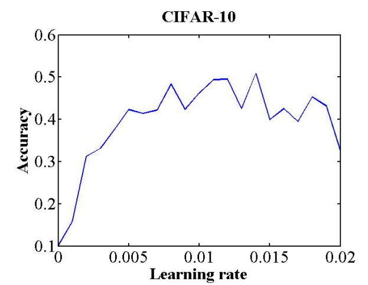

*Figure 14 Relationship between the learning rate and accuracy. This curve is obtained through training of eight epochs and referenced from (Smith, 2017)*

The proper learning rate described above is the start point. The optimal value of each network needs to be tested and adjusted based on the actual situation (network type, batch size, optimizer, and other related hyperparameters).

#### Selection and Optimization of Batch Sizes

The batch size indicates the number of samples used in a training, that is, a forward propagation, backward propagation, or weight update process. The larger the batch size is, the faster the training speed can be achieved. However, the batch size cannot be increased infinitely. On the one hand, the larger the batch size is, the more hardware memory is required. The hardware memory is set to the upper bound of the possible maximum batch size. On the other hand, when the batch size is too large, the generalization capability of the model decreases (Keskar et al., 2016). If the batch size is small, the regularization effect can be achieved, which helps reduce overfitting (Masters & Luschi, 2018). However, the computing capability of the hardware cannot be fully utilized.

Based on the foregoing description, a tradeoff between a relatively fast training speed and a regularization effect is required. Generally, 32 is a good value (Bengio, 2012). 64, 128, and 256 are also worth trying. The batch size and learning rate affect each other, which will be described in the next section.

#### Joint Optimization of the Learning Rate and Batch Size

Once the optimal learning rate is found for a batch size, the learning rate needs to be adjusted accordingly when the batch size is adjusted so that the ratio of the batch size to the learning rate is fixed. This is called a linear scaling rule. Based on Langevin dynamics, the same dynamic evolution time (Xie et al., 2020) can be obtained when the learning rate and batch size meet the linear scaling rule. After some assumptions are made, when the ratio of the learning rate to the batch size is fixed, only the same number of epochs needs to be trained, and the training effect should be the same. In parallel scenarios, increasing the batch size and learning rate can effectively shorten the training time. However, it should be noted that when the batch size and the learning rate are too large, some assumptions are damaged. For example, the central limit theorem requires that the batch size be far less than the size of the training dataset, and the continuous time approximately requires that the learning rate be small enough. When these assumptions are damaged, the linear scaling rule does not take effect. In this case, you need to reduce the batch size or learning rate.

#### Selection and Optimization of Momentum Values

When an optimizer with momentum (such as [Momentum](https://www.mindspore.cn/docs/en/master/api_python/nn/mindspore.nn.Momentum.html#mindspore.nn.Momentum)) is used, the momentum and learning rate should be adjusted in opposite directions. The optimal learning rate varies with the momentum. When the cyclic learning rate is used, it is also recommended that the momentum value be cyclically changed in the opposite direction. That is, when the learning rate changes from large to small, the momentum should change from small to large. When the learning rate is fixed, the momentum value should also be fixed.

#### Selection and Optimization of Weight Decay Parameters

Weight decay indicates that an L2 parameter norm penalty is added to the target cost function during model training. The weight decay parameter controls the coefficient of this penalty item. For details, see the weight_decay parameter in the [SGD](https://www.mindspore.cn/docs/en/master/api_python/nn/mindspore.nn.SGD.html#mindspore.nn.SGD) optimizer. Experiments show that the weight decay parameter is best kept constant in the training process. 0.001, 0.0001, and 0.00001 are common values. If the dataset is small and the model depth is shallow, you are advised to set this parameter to a larger value. If the dataset is large and the model depth is deep, you are advised to set this parameter to a smaller value. This may be because the larger dataset itself provides some degree of regularization, which reduces the need for weight decay to provide regularization.

### Tuning Suggestions for Multi-Device Training

#### Adjusting the Global Batch Size and Learning Rate

The global batch size indicates the global batch size during multi-device training. Take the parallel training of four devices in a single-node system as an example. If the batch size of each channel of data is 32, the global batch size is 128 (4 x 32). During multi-device training, the ratio of the global batch size to the learning rate should be fixed. If the global batch size is increased to four times of the original value, the learning rate should also be increased to four times of the original value. For details, see "Joint Optimization of the Learning Rate and Batch Size."

#### Ensuring that the Initial Weight of Data Parallelism Is the Same for Each Channel

When the data of multiple channels (multiple devices) is parallel, the result correctness depends on the consistency of the initial weight value of each channel (each device). Load the same checkpoint or fix the random seed in advance to ensure that the initial weight values are the same.

### Reference Documents Related to Accuracy Tuning

Bengio, Y. (2012). Practical Recommendations for Gradient-Based Training of Deep Architectures.

Cao, K., Wei, C., Gaidon, A., Arechiga, N., & Ma, T. (2019). Learning Imbalanced Datasets with Label-Distribution-Aware Margin Loss. Advances in Neural Information Processing Systems, 32. <https://arxiv.org/abs/1906.07413v2>

Choi, D., Shallue, C. J., Nado, Z., Lee, J., Maddison, C. J., & Dahl, G. E. (2019). On Empirical Comparisons of Optimizers for Deep Learning. <https://www.tensorflow.org/>

Glorot, X., & Bengio, Y. (2010). Understanding the difficulty of training deep feedforward neural networks. Journal of Machine Learning Research, 9, 249–256.

He, K., Zhang, X., Ren, S., & Sun, J. (2015). Delving deep into rectifiers: Surpassing human-level performance on imagenet classification. Proceedings of the IEEE International Conference on Computer Vision, 2015 Inter, 1026–1034. <https://doi.org/10.1109/ICCV.2015.123>

Keskar, N. S., Mudigere, D., Nocedal, J., Smelyanskiy, M., & Tang, P. T. P. (2016). On Large-Batch Training for Deep Learning: Generalization Gap and Sharp Minima. 5th International Conference on Learning Representations, ICLR 2017 - Conference Track Proceedings, 1–16. <http://arxiv.org/abs/1609.04836>

Masters, D., & Luschi, C. (2018). Revisiting small batch training for deep neural networks. ArXiv, 1–18.

Montavon, G., Orr, G. B., & Müller, K.-R. (Eds.). (2012). Neural Networks: Tricks of the Trade. 7700. <https://doi.org/10.1007/978-3-642-35289-8>

Nwankpa, C., Ijomah, W., Gachagan, A., & Marshall, S. (2018). Activation Functions: Comparison of trends in Practice and Research for Deep Learning. <http://arxiv.org/abs/1811.03378>

Smith, L. N. (2017). Cyclical learning rates for training neural networks. Proceedings - 2017 IEEE Winter Conference on Applications of Computer Vision, WACV 2017, 464–472. <https://doi.org/10.1109/WACV.2017.58>

Xie, Z., Sato, I., & Sugiyama, M. (2020). A Diffusion Theory For Deep Learning Dynamics: Stochastic Gradient Descent Exponentially Favors Flat Minima. <https://arxiv.org/abs/2002.03495v14>

## References

### Visualized Debugging and Tuning Tool

For details about how to collect visualized data during training, see [Collecting Summary Record](https://www.mindspore.cn/mindinsight/docs/en/master/summary_record.html).

For details about visualized data analysis during training, see [Viewing Dashboard](https://www.mindspore.cn/mindinsight/docs/en/master/dashboard.html) and [Viewing Lineage and Scalars Comparison](https://www.mindspore.cn/mindinsight/docs/en/master/lineage_and_scalars_comparison.html).

### Data Problem Handling

Perform operations such as standardization, normalization, and channel conversion on data. For image data processing, add images with random view and rotation. For details about data shuffle, batch, and multiplication, see [Processing Data](https://www.mindspore.cn/tutorials/en/master/advanced/dataset.html), [Data Argumentation](https://www.mindspore.cn/tutorials/en/master/advanced/dataset.html), and [Auto Augmentation](https://www.mindspore.cn/tutorials/experts/en/master/dataset/augment.html).

> For details about how to apply the data augmentation operation to a custom dataset, see the [mindspore.dataset.GeneratorDataset.map](https://www.mindspore.cn/docs/en/master/api_python/dataset/mindspore.dataset.GeneratorDataset.html#mindspore.dataset.GeneratorDataset.map) operator.

### Hyperparameter Problem Handling

Hyperparameters in AI training include the global learning rate, epoch, and batch. To visualize the training process under different hyperparameters, see [Use Mindoptimizer to Tune Hyperparameters](https://www.mindspore.cn/mindinsight/docs/en/master/hyper_parameters_auto_tuning.html). For details about how to set the dynamic learning rate, see [Optimization Algorithm of Learning Rate](https://www.mindspore.cn/tutorials/en/master/advanced/network/optim.html).

### Model Structure Problem Handling

Generally, the following operations are required to solve model structure problems: model structure reconstruction, and selection of a proper optimizer or loss function.

If the model structure needs to be reconstructed, refer to [Cell](https://www.mindspore.cn/docs/en/master/api_python/nn/mindspore.nn.Cell.html).

Select a proper loss function. For details, see [Loss Functions](https://www.mindspore.cn/docs/en/master/api_python/mindspore.nn.html#loss-functions).

For details about how to select a proper optimizer, see [Optimizer Functions](https://www.mindspore.cn/docs/en/master/api_python/mindspore.nn.html#optimizer-functions).
