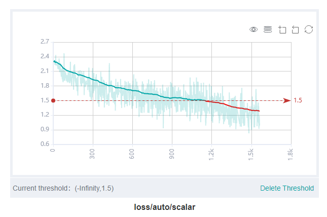
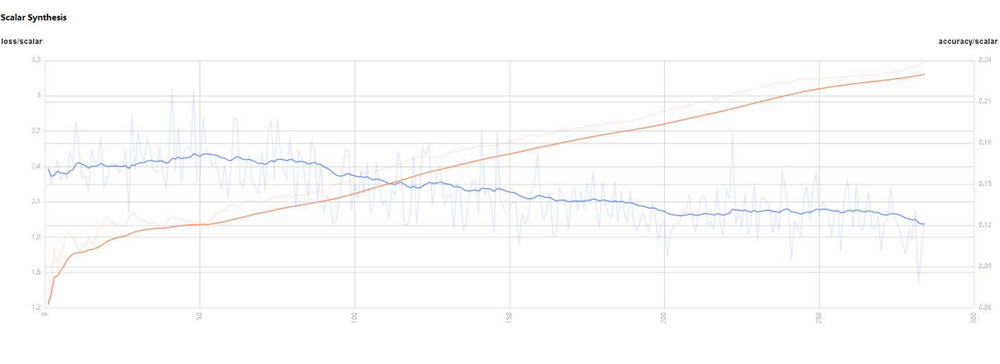
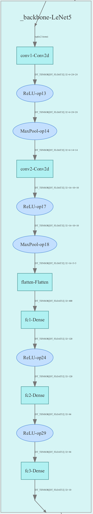
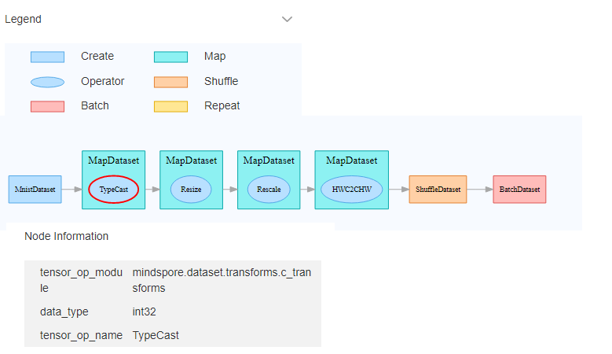
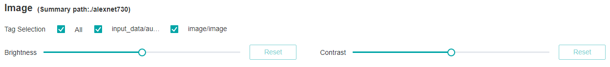
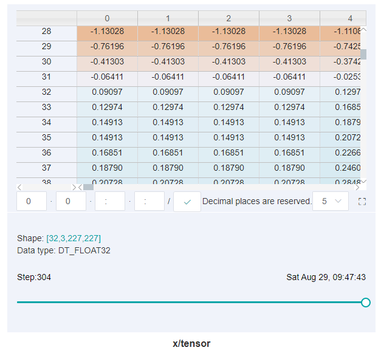
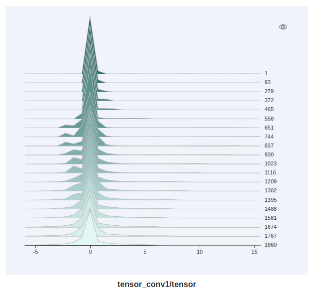

# Viewing Dashboard

## Overview

Training dashboard is an important part of mindinsight's visualization component, and its tags include scalar visualization, parameter distribution visualization, computational graph visualization, data graph visualization, image visualization, tensor visualization and training optimization process visualization.

Access the Training Dashboard by selecting a specific training from the training list.

## Scalar Visualization

Scalar visualization is used to display the change trend of scalars during training.

*Figure 1: Scalar trend chart*

Figure 1 shows a change process of loss values during the neural network training. The horizontal coordinate indicates the training step, and the vertical coordinate indicates the loss value.

Buttons from left to right in the upper right corner of the figure are used to display the chart in full screen, switch the Y-axis scale, enable or disable the rectangle selection, roll back the chart step by step, and restore the chart.

- Full-screen display: Display the scalar curve in full screen. Click the button again to restore it.
- Switch Y-axis scale: Perform logarithmic conversion on the Y-axis coordinate.
- Enable/Disable rectangle selection: Draw a rectangle to select and zoom in a part of the chart. You can perform rectangle selection again on the zoomed-in chart.
- Step-by-step Rollback: Cancel operations step by step after continuously drawing rectangles to select and zooming in the same area.
- Restore chart: Restore a chart to the original state.

The threshold value can be set to highlight the value. You can also delete the threshold value in the lower right corner of the figure. As shown in the figure, the threshold is set less than 1.5. The loss values that are below the threshold are highlighted in red, and it is clear to check the expected data values or some unusual values.

*Figure 2: Scalar visualization function area*

Figure 2 shows the scalar visualization function area, which allows you to view scalar information by selecting different tags, different dimensions of the horizontal axis, and smoothness.

- Tag selection: Select the required tags to view the corresponding scalar information.
- Horizontal axis: Select any of Step, Relative Time, and Absolute Time as the horizontal axis of the scalar curve.
- Smoothness: Adjust the smoothness to smooth the scalar curve.
- Scalar synthesis: Synthesize two scalar curves and display them in a chart to facilitate comparison between the two curves or view the synthesized chart.

*Figure 3: Scalar synthesis of Accuracy and Loss curves*

Figure 3 shows the scalar synthesis of the Accuracy and Loss curves. The function area of scalar synthesis is similar to that of scalar visualization. Differing from the scalar visualization function area, the scalar synthesis function allows you to select the maximum of two tags at a time to synthesize and display their curves.

## Parameter Distribution Visualization

The parameter distribution in a form of a histogram displays tensors specified by a user.

*Figure 4: Function area of the parameter distribution histogram*

Figure 4 shows the function area of the parameter distribution histogram, including:

- Tag selection: Select the required tags to view the corresponding histogram.
- Vertical axis: Select any of `Step`, `Relative time`, and `Absolute time` as the data displayed on the vertical axis of the histogram.
- Angle of view: Select either `Front` or `Top`. `Front` view refers to viewing the histogram from the front view. In this case, data between different steps is overlapped. `Top` view refers to viewing the histogram at an angle of 45 degrees. In this case, data between different steps can be presented.  

*Figure 5: Histogram*

Figure 5 shows the numerical distribution [histogram](https://baike.baidu.com/item/%E7%9B%B4%E6%96%B9%E5%9B%BE/1103834?fr=aladdin) of `conv1.weight` by a `Top` view.

The x-axis is the value range, y-axis is any one of `Step`, `Relative time`, and `Absolute time`, and z-axis is the probability distribution of the corresponding value range.
For example, in step 4, the value of `conv1.weight` are mainly distributed around 0 and 0.015, and in step 7, it's mainly distributed around -0.01.
Click the upper right corner to zoom in the histogram.

## Computational Graph Visualization

Computational graph visualization is used to display the graph structure, data flow direction, and control flow direction of a computational graph. It supports visualization of summary log files and pb files generated by `save_graphs` configuration in `context`.

*Figure 6: Computational graph display area*

Figure 6 shows the network structure of a computational graph. As shown in the figure, select an operator in the area of the display area. The operator has two inputs and one outputs (the solid line indicates the data flow direction of the operator).

*Figure 7: Computational graph function area*

Figure 7 shows the function area of the computational graph, including:

- File selection box: View the computational graphs of different files.
- Search box: Enter a node name and press Enter to view the node.
- Thumbnail: Display the thumbnail of the entire network structure. When viewing an extra large image structure, you can view the currently browsed area.
- Node information: Display the basic information of the selected node, including the node name, properties, input node, and output node.
- Legend: Display the meaning of each icon in the computational graph.

*Figure 8: Computational graph optimization*

Figure 8 shows the readability optimization feature, which optimizes the readability of the graph and reduces the complexity of the graph, and removes most of the gradient and optimizer operators.

Note:

- To get the clearest visualization of computational graph, please avoid to use public methods which cross Cell.
- Set `jit_level` to `o0` when collecting the computational graph, please refer to the API [mindspore.Model.build](https://www.mindspore.cn/docs/api/en/master/api_python/mindspore/mindspore.Model.html#mindspore.Model.build).
- In the computation graph optimization process, some operators in different namespaces may be merged with each other due to the same function, which will cause a cycle between namespaces and affect the readability.
- The complete control flow is not supported at present. If you need, please specify the control branch in the script.

## Dataset Graph Visualization

Dataset graph visualization is used to display data processing and augmentation information of a single model training.

*Figure 9: Dataset graph function area*

Figure 9 shows the dataset graph function area which includes the following content:

- Legend: Display the meaning of each icon in the data lineage graph.
- Data processing pipeline: Display the data processing pipeline used for training. Select a single node in the graph to view details.
- Node information: Display basic information about the selected node, including names and parameters of the data processing and augmentation operators.

## Image Visualization

Image visualization is used to display images specified by users.

*Figure 10: Image visualization*

Figure 10 shows how to view images of different steps by sliding the Step slider.

*Figure 11: Image visualization function area*

Figure 11 shows the function area of image visualization. You can view image information by selecting different tags, brightness, and contrast.

- Tag: Select the required tags to view the corresponding image information.
- Brightness adjustment: Adjust the brightness of all displayed images.
- Contrast adjustment: Adjust the contrast of all displayed images.

## Tensor Visualization

Tensor visualization is used to display tensors in the form of table and histogram.

*Figure 12: Tensor visualization function area*

Figure 12 shows the function area of tensor visualization.

- Tag selection: Select the required tags to view the corresponding table data or histogram.
- View: Select `Table` or `Histogram` to display tensor data. In the `Histogram` view, there are the options of `Vertical axis` and `Angle of view`.
- Vertical axis: Select any of `Step`, `Relative time`, and `Absolute time` as the data displayed on the vertical axis of the histogram.
- Angle of view: Select either `Front` or `Top`. `Front` view refers to viewing the histogram from the front view. In this case, data between different steps is overlapped. `Top` view refers to viewing the histogram at an angle of 45 degrees. In this case, data between different steps can be presented.

*Figure 13: Table display*

Figure 13 shows tensors recorded by a user in a form of a table which includes the following function:

- Click the small square button on the right side of the table to zoom in the table.
- The white box in the table shows the tensor data under which dimension is currently displayed. The colon `:` indicates index range of the current dimension which is basically the same as the meaning of Python index. If no specific index is specified, it indicates all the values of the current dimension and `2:5` indicates the value of index from 2 to 5 (not including 5). you can enter the corresponding index or index range containing `:` in the box and press `Enter` or click the button of tick on the back to query tensor data for specific dimensions. Assuming a certain dimension is 32, the index range is -32 to 31. Note: tensor data from 0 to 2 dimensions can be queried. Tensor data of more than two dimensions is not supported, in other word, the query conditions of more than two colons `:` cannot be set.
- Query the tensor data of a specific step by dragging the hollow circle below the table.

*Figure 14: Histogram display*

Figure 14 shows tensors recorded by a user in a form of a histogram. Click the upper right corner to zoom in the histogram.

## Training Optimization Process Visualization

The training optimization process visualization can show the optimization space around the neural network training path. For more information, please refer to  [Training Optimization Process Visualization](https://www.mindspore.cn/mindinsight/docs/en/master/landscape.html).

## Notices

1. Currently MindSpore supports recording computational graph after operator fusion for Ascend 910 AI processor only.

2. When using the Summary operator to collect data in training, 'HistogramSummary' operator will affect performance, so please use as few as possible.

3. To limit memory usage, MindInsight limits the number of tags and steps:
    - There are 300 tags at most in each training dashboard. The total number of scalar tags, image tags, computation graph tags, parameter distribution(histogram) tags, tensor tags cannot exceed 300. Specially, there are 10 computation graph tags and 6 tensor tags at most. When the number of tags exceeds the limit, MindInsight preserves the most recently processed tags.
    - There are 1000 steps at most for each scalar tag in each training dashboard. When the number of steps exceeds the limit, MindInsight will sample steps randomly to meet this limit.
    - There are 10 steps at most for each image tag in each training dashboard. When the number of steps exceeds the limit, MindInsight will sample steps randomly to meet this limit.
    - There are 50 steps at most for each parameter distribution(histogram) tag in each training dashboard. When the number of steps exceeds the limit, MindInsight will sample steps randomly to meet this limit.
    - There are 20 steps at most for each tensor tag in each training dashboard. When the number of steps exceeds the limit, MindInsight will sample steps randomly to meet this limit.

4. Since `TensorSummary` will record complete tensor data, the amount of data is usually relatively large. In order to limit memory usage and ensure performance, MindInsight make the following restrictions with the size of tensor and the number of value responded and displayed on the front end:
    - MindInsight supports loading tensors that contain up to 10 million values.
    - MindInsight supports the column of tensor displayed on the front end up to 1000 columns for each query.
    - After the tensor is loaded, in the tensor-visible table view, you can view the maximum of 100,000 values. If the value obtained by the selected dimension query exceeds this limit, it cannot be displayed.

5. Since tensor visualization (`TensorSummary`) records raw tensor data, it requires a large amount of storage space. Before using `TensorSummary` and during training, please check that the system storage space is sufficient.
   The storage space occupied by the tensor visualization function can be reduced by the following methods:
    1) Avoid using `TensorSummary` to record larger tensor.

    2) Reduce the number of `TensorSummary` operators in the network.

   After using the function, please clean up the training logs that are no longer needed in time to free up disk space.

   Remarks: The method of estimating the space usage of `TensorSummary` is as follows:

   The size of a `TensorSummary data = the number of values in the tensor \* 4 bytes`. Assuming that the size of the tensor recorded by `TensorSummary` is `32 \* 1 \* 256 \* 256`, then a `TensorSummary` data needs about `32 \* 1 \* 256 \* 256 \* 4 bytes = 8,388,608 bytes = 8MiB`. `TensorSummary` will record data of 20 steps by default. Then the required space when recording these 20 sets of data is about `20 \* 8 MiB = 160MiB`. It should be noted that due to the overhead of data structure and other factors, the actual storage space used will be slightly larger than 160MiB.

6. The training log file is large when using `TensorSummary` because the complete tensor data is recorded. MindInsight needs more time to parse the training log file, please be patient.
