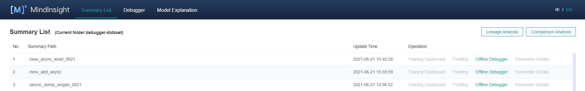
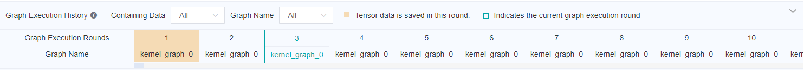
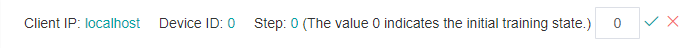
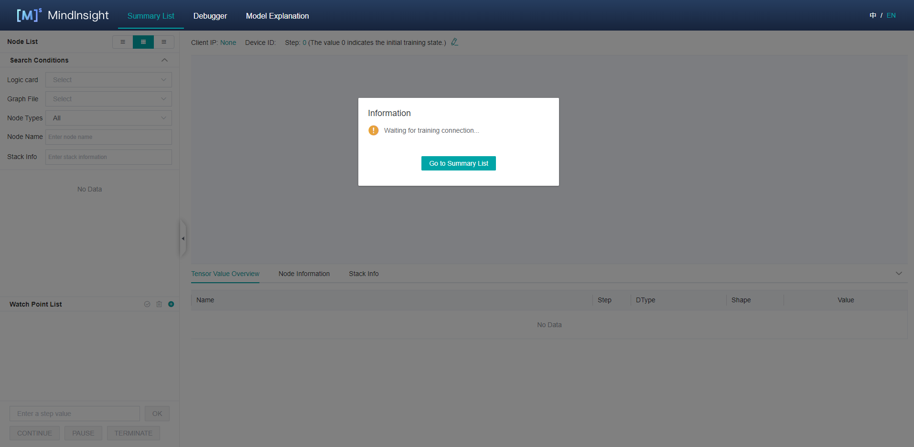

# Using the Offline Debugger

<a href="https://gitee.com/mindspore/docs/blob/master/docs/mindinsight/docs/source_en/debugger_offline.md" target="_blank"></a>

## Overview

This article describes how to use Debugger in offline mode.

## Operation Process

1. Prepare dump data. For details about how to use the dump function, see [Using Dump in the Graph Mode](https://www.mindspore.cn/tutorials/experts/en/master/debug/dump.html).
2. Use the offline debugger for debugging and analysis.

   If an UI page is needed, you can start the debugger through MindInsight offline debugger entry. The operation process is:

    1) Start MindInsight and set summary-base-dir to the summary-dir(summary-dir is the parent directory of the path in the dump configuration) of one training or the parent directory of more training using startup parameters.

    2) Find the offline debugger entry from the Summary list, and click Offline Debugger. The debugger UI is displayed, and debugging analysis starts.

   If UI page is not needed, it can also be analyzed through the API interface of the offline debugger. See [mindinsight.debugger](https://www.mindspore.cn/mindinsight/api/en/master/mindinsight.debugger.html) for the API of offline debugger. The operation process is:

    1) Instantiate the offline debugger through 'mindinsight.debugger.Dumpanalyzer' to dump_dir is specified as the dump path of a training ({path} in dump configuration);

    2) Debug and analysis using the offline debugger API.

Unless otherwise specified, the offline debugger in the following refers to the offline debugger with UI page.

## Environment Preparation

Use the dump function of MindSpore to prepare offline data. For details about how to use the dump function, see [Using Dump in the Graph Mode](https://www.mindspore.cn/tutorials/experts/en/master/debug/dump.html).

It should be noted that only one dump path can be included in a summary-dir. For example, if the path in the Dump configuration file is "/home/workspace/data/dump_dir" in one training, after the dump data of this training is stored,  the other trainnings cannot set the path in the Dump configuration file as the children directory of "/home/workspace/data".

Start MindInsight and set summary-base-dir to the summary-dir of one training or the parent directory of more training. Then, you can query the offline debugger entry on the UI.

MindInsight startup command:

```text
mindinsight start --port {PORT} --summary-base-dir {SUMMARY_BASE_DIR} --offline-debugger-mem-limit {OFFLINE_DEBUGGER_MEMORY_LIMIT} --max-offline-debugger-session-num {MAX_OFFLINE_DEBUGGER_SESSION_NUMBER}
```

Parameters are described as follows:

|Name|Attribute|Description|Type|Default Value|Range|
|---|---|---|---|---|---|
|`--port {PORT}`|Optional|Specifies the port number of the web visualization service.|Integer|8080|1–65535|
|`--summary-base-dir {SUMMARY_BASE_DIR}`|Mandatory|Specifies the upper one or two layers of a path in the Dump configuration. For example, if the path in the dump configuration file is set to `/home/workspace/data/dump_dir`, summary-base-dir can be set to `/home/workspace/data` or `/home/workspace`.|String|./|-|
|`--offline-debugger-mem-limit <OFFLINE_DEBUGGER_MEMORY_LIMIT>`|Optional|Specifies the maximum memory limit of a single offline debugger session. When the offline debugger cannot be executed due to insufficient memory, set it according to the device memory.|Integer|16*1024|6*1024~The upper limit of int32|
|`--max-offline-debugger-session-num <MAX_OFFLINE_DEBUGGER_SESSION_NUMBER>`|Optional|Specifies the maximum session number of the offline debugger. The session number refers to the amount of training jobs that can be debugged at the same time.|Integer|2|1~2|

For details about more startup parameters, see [MindInsight Commands](https://www.mindspore.cn/mindinsight/docs/en/master/mindinsight_commands.html).

Open MindInsight and access the debugger UI from the offline debugger entry.



*Figure 1: Offline debugger entry*

## UI Introduction

The UI of the offline debugger is almost the same as that of the online debugger. For details about the online debugger UI, see [Debugger UI Introduction](https://www.mindspore.cn/mindinsight/docs/en/master/debugger_online.html#debugger-ui-introduction). The difference is that the offline debugger will display the graph execution history above the calculation graph, and can reset the training rounds.

### Graph Execution History

Offline debugger displays the graph execution history above the calculation diagram, and displays the offline data and round information, as shown in Figure 2. In `Containing Data` drop-down box, you can choose to display all the graph execution history or only the execution history with data. In the `Graph Name` drop-down box, you can select to display all the execution history or only the execution history of the corresponding graph name.



*Figure 2: Graph execution history*

### Training Rounds Resetting

As shown in Figure 3, click the edit icon on the right of current round, an edit box will appear, as shown in Figure 4. Enter the step id to be reset and click the tick icon. After reset, you can view the tensor value of the new round, recheck the set watchpoints, etc.


*Figure 3: Resetting the training step*



*Figure 4: Resetting the trainning step in edit status*

## Usage Example

1. After the debugger environment is prepared, open the debugger UI, as shown in the following figure:

    

    *Figure 5: Debugger waiting for training connection*

    At this point, the debugger is in a state of loading offline data.

2. Wait for a moment. A dialog box is displayed on the MindInsight UI, asking you whether to use the recommended watchpoints. The following procedures are the same as that for online debugging. [Debugger Usage Example](https://www.mindspore.cn/mindinsight/docs/en/master/debugger_online.html#debugger-usage-example).

3. If you need to reset the training round, you can refer to [Training Rounds Resetting](https://www.mindspore.cn/mindinsight/docs/en/master/debugger_offline.html#training-rounds-resetting) to reset the training rounds. Refer to [Graph Execution History](https://www.mindspore.cn/mindinsight/docs/en/master/debugger_offline.html#graph-execution-history) for data saving of each round.

## Offline Debugger API example

```python
from mindinsight import debugger
from mindinsight.debugger import DumpAnalyzer
from mindinsight.debugger import Watchpoint


def test_debugger_offline():
    # Init DumpAnalyzer with the dump_dir
    analyzer = DumpAnalyzer("/path/to/dump_dir")
    # Select the tensors generated by the code in 'lenet.py', line 49
    tensors = analyzer.select_tensors(query_string="/path/to/src/of/lenet.py:49", select_by="code_stack")
    # Create a watchpoint for tensors with condition TensorTooLarge, set the parameter abs_mean_gt=0.001
    watchpoint1 = Watchpoint(tensors, debugger.TensorTooLargeCondition(abs_mean_gt=0.001))
    # Create another watchpoint for tensors with condition TensorAllZero, set the parameter zero_percentage_ge=99.9
    watchpoint2 = Watchpoint(tensors, debugger.TensorAllZeroCondition(zero_percentage_ge=99.9))
    # Check the given watchpoints, the check_watchpoints function start a new process needs to be called through the main entry
    hits = analyzer.check_watchpoints([watchpoint1, watchpoint2])
    # Show the result
    for hit in hits:
        print("The hit detail is: {}".format(hit.get_hit_detail()))
        tensor = hit.tensor
        print("The hit tensor info is: iteration: {}, graph_name: {}, node_name: {}, rank: {}, slot: {}"
            .format(tensor.iteration, tensor.node.graph_name, tensor.node.name, tensor.rank, tensor.slot))


if __name__ == "__main__":
    test_debugger_offline()
```

## Precautions

- Scenarios:
    - The offline debugger does not support the CPU scenario currently.
    - The offline debugger supports the single-node multi-device scenario. To analyze the multi-node multi-device scenario, you need to summarize the data of multiple nodes.
    - The offline debugger does not support checking the initial weight.
    - The offline debugger does not support PyNative mode.

- GPU scenario:
    - Different from the online debugger, the offline debugger does not support node-by-node execution.

- If there are more than one dump files of the same tensor in the same directory, offline debugger will only show the latest tensor.
- When using the offline debugger, make sure that the version numbers of MindInsight and MindSpore are the same.
- Only watchpoints that have tensor values are rechecked.
- The graph displayed by the debugger is the finally optimized execution graph. The called operator may have been integrated with other operators, or the name of the called operator is changed after optimization.
- If the dump data objects are bin files generated by Ascend asynchronous dump, npy files will be generated during parsing, which would occupy disk space.
- If the asynchronous dump data in the Ascend scenario is used, you can use the `convert_all_data_to_host` API of MindInsight DumpParser to convert the asynchronous dump data into the `.npy` file to improve the data analysis efficiency. For details about how to use DumpParser, see [DumpParser Introduction](https://gitee.com/mindspore/mindinsight/tree/master/mindinsight/parser).
