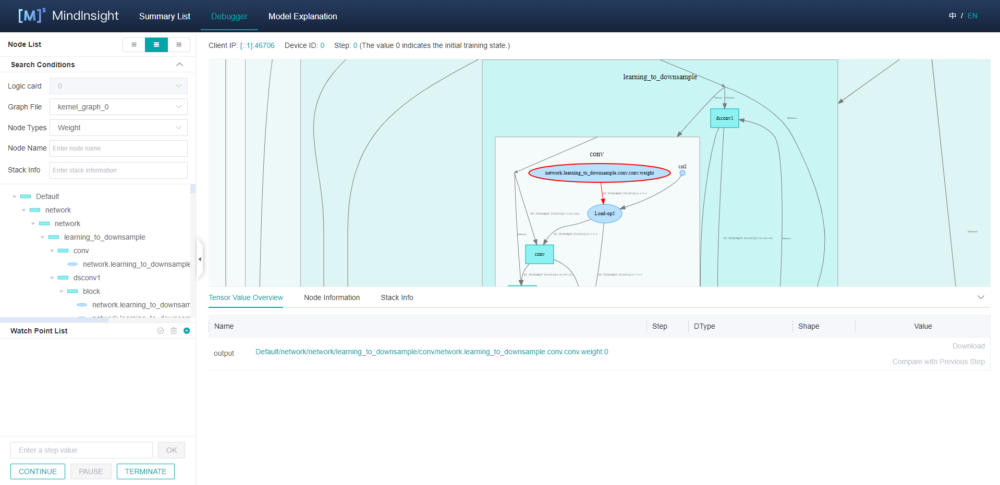
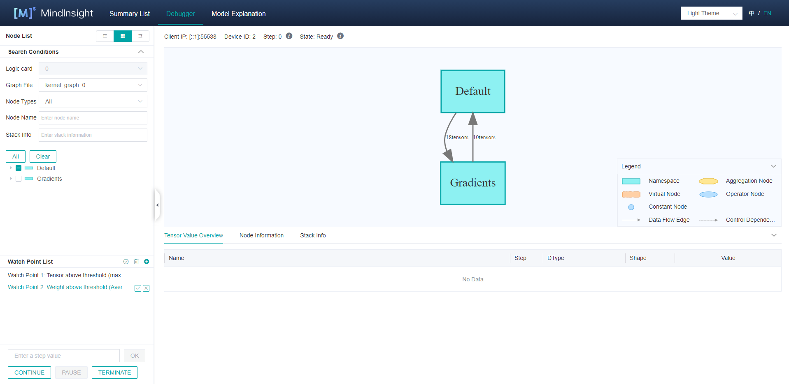
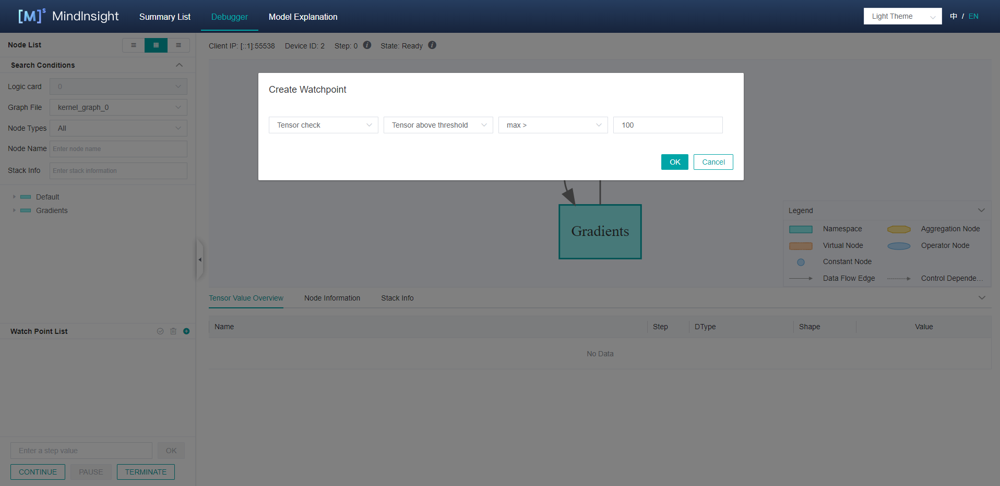
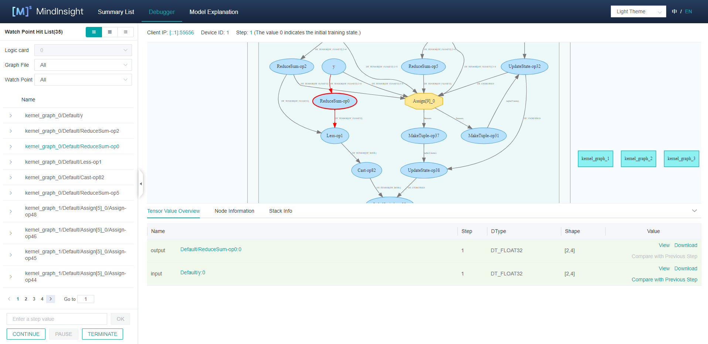
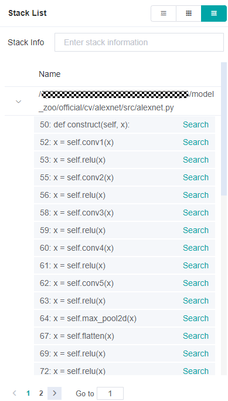
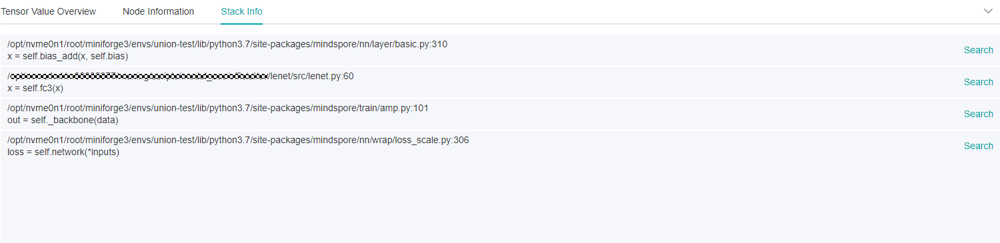
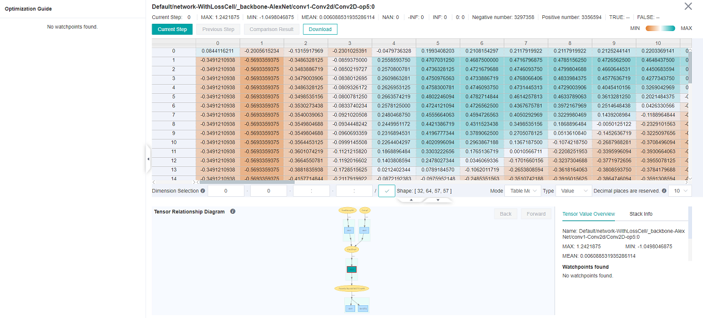
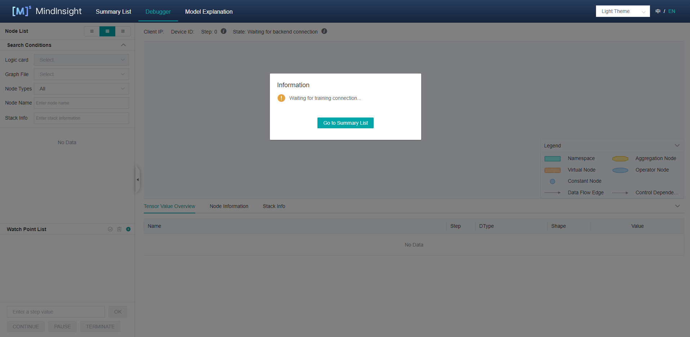
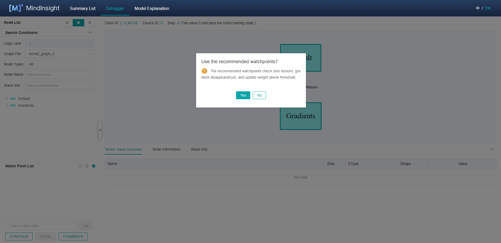

# Using Online Debugger

<!-- TOC -->

- [Using Online Debugger](#using-online-debugger)
    - [Overview](#overview)
    - [Operation Process](#operation-process)
    - [Debugger Environment Preparation](#debugger-environment-preparation)
        - [Launch MindInsight in Debugger Mode](#launch-mindinsight-in-debugger-mode)
        - [Run the Training Script in Debug Mode](#run-the-training-script-in-debug-mode)
    - [Debugger UI Introduction](#debugger-ui-introduction)
        - [Computational Graph](#computational-graph)
        - [Node List](#node-list)
        - [Graph Node Details](#graph-node-details)
        - [Watchpoint List](#watchpoint-list)
        - [Setting Watchpoints](#setting-watchpoints)
        - [Stack List](#stack-list)
        - [Stack Information](#stack-information)
        - [Recheck](#recheck)
        - [Training Control](#training-control)
        - [Tensor Check View](#tensor-check-view)
    - [Debugger Usage Example](#debugger-usage-example)
    - [Notices](#notices)

<!-- /TOC -->

<a href="https://gitee.com/mindspore/docs/blob/master/docs/mindinsight/docs/source_en/debugger_online.md" target="_blank"></a>

## Overview

This article describes how to use Debugger in online mode.

## Operation Process

- Launch MindInsight in debugger mode and wait for the training.
- Set debugger environment variables and run the training script.
- After the training is connected, set watchpoints on the MindInsight Debugger UI.
- Analyze the training progress on MindInsight Debugger UI.

## Debugger Environment Preparation

### Launch MindInsight in Debugger Mode

At first, install MindInsight and launch it in debugger mode. MindSpore will send training information to MindInsight Debugger Server in debugger mode, users can analyze the information on MindInsight UI.

The command to launch MindInsight in debugger mode is as follows:

```text
mindinsight start --port {PORT} --enable-debugger True --debugger-port {DEBUGGER_PORT}
```

The Debugger related parameters:

|Name|Argument|Description|Type|Default|Scope|
|---|---|---|---|---|---|
|`--port {PORT}`|Optional|Specifies the port number of the web visualization service.|Integer|8080|1~65535|
|`--enable-debugger {ENABLE_DEBUGGER}`|Optional|Should be set to `True` or `1`, this will launch the MindInsight debugger server; Default is `False`, not launch.|Boolean|False|True/False/1/0|
|`--debugger-port {DEBUGGER_PORT}`|Optional|Specifies the port number of the debugger server.|Integer|50051|1~65535|

For more launch parameters, please refer to [MindInsight Commands](https://www.mindspore.cn/mindinsight/docs/en/master/mindinsight_commands.html).

### Run the Training Script in Debug Mode

Run the training script in debug mode, you need to set `export ENABLE_MS_DEBUGGER=1` or `export ENABLE_MS_DEBUGGER=True` to specify the training is in the debugger mode, and set the debugger host and port to which the training is connected:
`export MS_DEBUGGER_HOST=127.0.0.1` (the service address must be consistent with MindInsight host address);
`export MS_DEBUGGER_PORT=50051` (the port must be consistent with MindInsight debugger-port).

If the memory space of your equipment is limited, you can use the partial memory reuse mode before starting the training to reduce the running space: `export MS_DEBUGGER_PARTIAL_MEM=1`。

In addition, do not use data offload mode during training (you need to set `dataset_sink_mode` in `model.train` to `False`) to ensure that the debugger can obtain the training information of each step.

After the environment and training script are prepared, run the training script.

## Debugger UI Introduction

After the training is connected, you can view the training meta information such as a computational graph on the MindInsight Debugger UI which consists of the computational graph, node list, node information, watchpoint list, watchpoint hit list, stack list, and stack information.
The Debugger UI components are shown as follows.


Figure 1: The initial UI of debugger

### Computational Graph

Debugger will display the optimized computational graph in the upper middle area of the page.
Users can click the box (stand for one `scope`) to expand the graph, and analyze the nodes contained in that `scope`.

The area on the top shows the training metadata, such as the `Client IP` (address and port of the training script process),
`Device ID` being used and the current training `Step`.

In the GPU environment, the `Current Node` and `Next Node` buttons are used to return to the current execution node and execute the next node, respectively and are displayed in the upper right corner of the computational graph area.

### Node List



Figure 2: The node list filtered by node type

As shown in Figure 1, the computational graph `Node List` will be displayed on the left of the UI.
The `Node List` can be expanded according to the `scope` of the nodes.
When clicking one node in the list, the computational graph on the right will also be expanded and choose the corresponding node automatically.

You can filter nodes by `Graph File` and `Node Type` under `Node List`, as shown in Figure 2, and search for nodes by entering their names in the search box under `Node Type`.

### Graph Node Details

After clicking a graph node, you can view its detailed information in the lower part of the UI, including the output and input, training steps (`Step`), as well as data types (`DType`), shapes (`Shape`), and values (`Value`) of a tensor, as shown in Figure 2. After clicking the `Download` in the `Value` column, tensor values can be download as `.npy` file, the default directory is `Downloads` folder.

In the GPU environment, select and right-click an executable graph node, and choose `Run to This Node` from the shortcut menu to run the training script to the selected node (no more than one step).

### Watchpoint List



Figure 3: The watchpoint list

As shown in Figure 3, the watchpoint list is in the lower left corner of the UI. The three icons from left to right in the upper right corner of the watchpoint list are used to `recheck`, `clear`, and `create` watchpoints.

### Setting Watchpoints



Figure 4: Creating watchpoint

To monitor and analyze the computation result of a node, you can set a watchpoint for the node in a computational graph. Figure 4 shows how to set a watchpoint. You can click the `+` icon in the upper right corner of the watchpoint list to add a watchpoint and select a check condition. For example, if you want to check whether a tensor is above the threshold, select a check condition, enter a threshold, and click OK to create a watchpoint.
After a watchpoint is created, manually select the node to be checked and click `√` next to the watchpoint. If you select `Weight check`, `Gradient check`, or `Activation value check` when creating a watchpoint, the weight, gradient, or activation node is automatically selected. You can manually change the selected node after clicking OK.

The following conditions are supported (abbreviations in parentheses):

- Tensor check
    - Operator overflow (OO): Check whether overflow occurs during operator computation. Only the Ascend AI Processor is supported.
    - Whether tensor values are all 0 (TZ): Set the threshold to `Percentage of 0 values ≥` to check the percentage of 0 tensor values.
    - Tensor overflow (TO): Check whether a tensor value overflow occurs.
    - Tensor value range (TR): Set a threshold to check the tensor value range. The options are `Percentage of the value in the range >`, `Percentage of the value in the range <`, `MAX-MIN>` and `MAX-MIN<`. If setting the threshold to `Percentage of the value in the range >` or `Percentage of the value in the range <`, you need to set the `Upper limit of the range (inclusive)` or `Lower limit of the range (inclusive)` at the same time.
    - Tensor above threshold (TL): Set a threshold to check whether the tensor value is too large. The options are `Average of the absolute value >`, `max >`, `min >`, and `mean >`.
    - Tensor below threshold (TS): Set a threshold to check whether the tensor value is too small. The options are `Average of the absolute value <`, `max <`, `min <`, and `mean <`.

- Weight check
    - Weight change above threshold (WCL): Set a threshold to `Average change ratio >` to check whether the weight value change is too large.
        - `Average change ratio` = `mean(abs(Current weight value - Weight value in previous step))/(mean(abs(Weight value in previous step)) + Offset)`.
    - Weight change below threshold (WCS): Set a threshold to `Average change ratio <` to check whether the weight value change is too small.
    - Initial weight value (WI): Set a threshold to check the initial weight value. The options are `Percentage of 0 values ≥`, `max >`, and `min <`.
    - Unchanged weight (WNC): Set the threshold to `Relative tolerance` to check whether the weight is updated.
    - Weight overflow (WO): Check whether a weight value overflow occurs.
    - Weight above threshold (WL): Set a threshold to check whether the weight value is too large. The options are `Average of the absolute value >`, `max >`, `min >`, and `mean >`.
    - Weight below threshold (WS): Set a threshold to check whether the weight value is too small. The options are `Average of the absolute value <`, `max <`, `min <`, and `mean <`.

- Activation value check
    - Activation value range (AR): Set a threshold to check the activation value range. The options are `Percentage of the value in the range >`, `Percentage of the value in the range <`, `MAX-MIN>` and `MAX-MIN<`. If setting the threshold to `Percentage of the value in the range >` or `Percentage of the value in the range <`, you need to set the `Upper limit of the range (inclusive)` or `Lower limit of the range (inclusive)` at the same time.

- Gradient check
    - Gradient explosion (GE): Check whether a gradient value overflow occurs.
    - Gradient above threshold (GL): Set a threshold to check whether the gradient value is too large. The options are `Average of the absolute value >`, `max >`, `min >`, and `mean >`.
    - Gradient disappearance (GV): Set a threshold to check whether the gradient value is too small. The options are `Average of the absolute value <`, `max <`, `min <`, and `mean <`.

After a watchpoint is generated, you can select or deselect nodes to be monitored in the node list, as shown in Figure 3. In addition, you can click the `clear watchpoint` icon or `X` icon to delete watchpoints.

During training, the debugger analyzes the outputs of these monitored nodes in real time. Once the watchpoint conditions are hit, the training is suspended. You can view the information about the hit nodes on the UI.



Figure 5: Viewing hit nodes

The hit nodes are displayed on the left of the UI. If more than one watchpoints are set, UI can show the result of the specified watchpoint by choosing the watchpoint id in the watchpoint pull list.
If the training network consists of more than one sub graphs, you can choose the sub graph name in the graph file pull list to show the results of the specified sub graph.
For multi-card training, you can choose the logic card id in the logic card pull list to show the hit nodes on the specified card
(Only for offline debugger, online debugger does not support distributed training at present).

In the same sub graph, the hit nodes are sorted based on the node execution sequence. On the left of the node name, click on the expand icon, the hit watchpoints and watchpoint condition will be displayed. Each record displays the configured threshold and the actual value.
In addition, after you click a record, the corresponding node is displayed in the computational graph. You can view the node information to analyze the possible cause. Click `View` to enter the tensor check view. You can view the hit watchpoint information and optimization guide, as shown in Figure 8.

### Stack List

You can click the switch button in the upper left corner on the debugger UI to switch from `Node List` or `Watchpoint Hit List` to `Stack List`.

You can view all stack information in the stack list. After you enter a keyword in the search box, the matched stack information is displayed. The list is displayed on multiple pages. You can click the page number at the bottom to quickly go to the corresponding page.

Click an item in the list to go to the node list where you can view the node related to the code.



Figure 6: Stack list

### Stack Information

When a node is located in the graph, click the `Stack Info` tab page below the graph to view the stack information related to the node.

On the Stack Info tab page, click Search in a row to search for all nodes related to the row. The search result is automatically displayed in the node list.



Figure 7: Stack information

### Recheck

To perform more detailed monitoring and analysis on a node, you can modify the node to be monitored, add or delete watchpoints, and then check the current step again. The `recheck` icon is in the upper right corner of the watchpoint list as shown in figure 3.

### Training Control

At the bottom of the watchpoint setting panel is the training control panel, which shows the training control functions of the debugger,
with four buttons: `CONTINUE`, `PAUSE`, `TERMINATE` and `OK`:

- `OK` stands for executing the training for several steps, the number of the `step` can be specified in the above bar. The training will be paused until the `Watch Point List` is triggered, or the number of `step` is reached.
- `CONTINUE` stands for executing the training until the `Watch Point List` is triggered, or the training is finished.
- `PAUSE` stands for pausing the training.
- `TERMINATE` stands for terminating the training.

### Tensor Check View



Figure 8: Viewing tensors value

Some `tensors` have too many dimensions and cannot be directly displayed on the home page. You can click the corresponding `View` button to view the detailed information about the `tensor` value on the displayed tensor check view.

As shown in Figure 8, the tensor check view displays the `tensor` values in the upper part of the UI. You can set the `Dimension Selection` and click `Current Step`, `Previous step`, and `Comparison Result` to display and compare tensors. (Currently, the parameter node can be compared only with the previous one step.) In addition, you can set shards in `Dimension Selection` to display a `tensor` in the specified dimension.

The `node information`, `current step`, and `statistics` are displayed on the top of the view. The optimization guide is displayed on the left of the view. When a watchpoint is hit, the hit information and optimization suggestions are displayed. The tensor relationship diagram and detailed `node information` are displayed on the lower part of the view.

Based on the tensor relationship diagram, you can analyze which tensors are used to compute the current tensor and which constants are affected by the current tensor. Abbreviations of watchpoint conditions are displayed on the diagram, helping you quickly identify the propagation path of tensor issues. Each condition abbreviation can be found in "Setting Watchpoints".

Tensors can be downloaded in tensor check view. Users can download the desired tensor for in-depth analysis or processing.

## Debugger Usage Example

1. Prepare the debugger environment, and open the MindInsight Debugger UI.

    

    Figure 9: Debugger Start and Waiting for the Training

    The Debugger server is launched and waiting for the training to connect.

2. Run the training script on terminal.

3. Wait for a moment. A dialog box is displayed on the MindInsight UI, asking you whether to use the recommended watchpoints, as shown in the following figure.

    

    Figure 10: Debugger ask whether to use the recommended watchpoints

4. Later, you can see that the computational graph is displayed on the Debugger UI, as shown in Figure 1.

5. Set watchpoints.

    Select the watchpoint conditions, as shown in Figure 4. Select or deselect certain nodes as shown in Figure 3. The debugger monitors whether outputs that meet the watchpoint conditions exist during the node computation process.
    After setting the watchpoints, you can set `step` and click `OK`, or just click `CONTINUE` to continue the training.

6. Trigger watchpoints, as shown in Figure 5.

    After watchpoints are hit, you can view the corresponding node information and stack information, find the exception cause on the tensor check view, or download the tensor to analyse the exception, and modify the script to rectify the fault.

## Notices

- Scenarios:
    - The debugger does not support distributed training scenarios.
    - The debugger does not support inference scenarios.
    - The debugger does not support the single-node multi-device or cluster scenario.
    - The debugger does not support connected to multiple training process.
    - The debugger does not support CPU scenarios.
    - The debugger does not support PyNative mode.
    - The debugger does not support multi networks scenarios.

- Impact on Performance:
    - Debugger will slow down the training performance.
    - When too many `Watch Points` are set, the system may run out of memory.

- GPU Scenario:
    - In the GPU scenario, only the parameter nodes that meet requirements can be compared with the previous step. For example, nodes executed on the `next node`, nodes selected when `Run to This Node` is chosen, and nodes input as `watchpoints` can be compared. In other cases, the `Compare with Previous Step` function cannot be used.

- When using the debugger, make sure that the version numbers of MindInsight and MindSpore are the same.
- Recheck only watchpoints that have tensor values.
- To check overflow during computation, you need to enable the overflow detection function of the asynchronous dump. For details about how to enable the function, see [Asynchronous Dump](https://www.mindspore.cn/docs/programming_guide/en/master/custom_debugging_info.html#asynchronous-dump).
- The graph displayed by the debugger is the finally optimized execution graph. The called operator may have been integrated with other operators, or the name of the called operator is changed after optimization.
- Enabling the debugger will turn off memory reuse mode, which may lead to an 'out of memory' error when the training network is too large.

