# Training Optimization Process Visualization

<a href="https://gitee.com/mindspore/docs/blob/master/docs/mindinsight/docs/source_en/landscape.md" target="_blank"></a>&nbsp;&nbsp;

## Overview

Neural network training is essentially an optimization process of high-dimensional non-convex function. Generally, the minimum point can be found by gradient descent method (as shown in Figure 1). The general neural network parameters are up to tens of thousands or even hundreds of thousands, so it is difficult to display its optimized terrain directly in three-dimensional space. Through this function, the user can display the optimization space around the neural network training path based on direction reduction and rendering calculation.

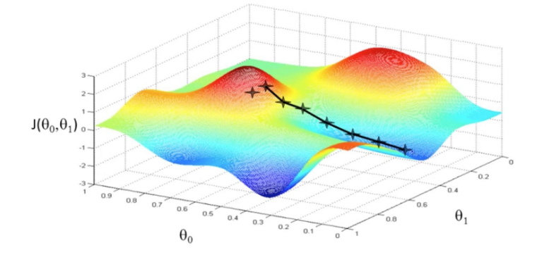

Figure1: Gradient Descent Method（Picture Source<https://www.pianshen.com/article/81321136968/>）

## Practice Guidance

The specific use steps are divided into two steps. Taking the classification task as an example, the network is LeNet and the dataset is MNIST. The sample code is as follows:

1. Training data collection: in the training process, use the SummaryCollector to collect the forward network weights of multiple models, the parameters required for landscape drawing (expected drawing interval, landscape resolution, etc.), and other specific use methods of SummaryCollector can be referred to [Collecting Summary Record](https://www.mindspore.cn/mindinsight/docs/en/master/summary_record.html).

   ```python
   import mindspore.dataset as ds
   import mindspore.dataset.vision.c_transforms as CV
   import mindspore.dataset.transforms.c_transforms as C
   from mindspore.dataset.vision import Inter
   from mindspore import dtype as mstype
   import mindspore.nn as nn

   from mindspore.common.initializer import Normal
   from mindspore import context
   from mindspore.train.callback import ModelCheckpoint, CheckpointConfig, LossMonitor, TimeMonitor, SummaryCollector
   from mindspore import Model
   from mindspore.nn import Accuracy
   from mindspore import set_seed

   set_seed(1)

   def create_dataset(data_path, batch_size=32, repeat_size=1,
                      num_parallel_workers=1):
       """
       create dataset for train or test
       """
       # define dataset
       mnist_ds = ds.MnistDataset(data_path, shuffle=False)

       resize_height, resize_width = 32, 32
       rescale = 1.0 / 255.0
       shift = 0.0
       rescale_nml = 1 / 0.3081
       shift_nml = -1 * 0.1307 / 0.3081

       # define map operations
       resize_op = CV.Resize((resize_height, resize_width), interpolation=Inter.LINEAR)  # Bilinear mode
       rescale_nml_op = CV.Rescale(rescale_nml, shift_nml)
       rescale_op = CV.Rescale(rescale, shift)
       hwc2chw_op = CV.HWC2CHW()
       type_cast_op = C.TypeCast(mstype.int32)

       # apply map operations on images
       mnist_ds = mnist_ds.map(operations=type_cast_op, input_columns="label", num_parallel_workers=num_parallel_workers)
       mnist_ds = mnist_ds.map(operations=resize_op, input_columns="image", num_parallel_workers=num_parallel_workers)
       mnist_ds = mnist_ds.map(operations=rescale_op, input_columns="image", num_parallel_workers=num_parallel_workers)
       mnist_ds = mnist_ds.map(operations=rescale_nml_op, input_columns="image", num_parallel_workers=num_parallel_workers)
       mnist_ds = mnist_ds.map(operations=hwc2chw_op, input_columns="image", num_parallel_workers=num_parallel_workers)

       # apply DatasetOps
       buffer_size = 10000
       mnist_ds = mnist_ds.shuffle(buffer_size=buffer_size)  # 10000 as in LeNet train script
       mnist_ds = mnist_ds.batch(batch_size, drop_remainder=True)
       mnist_ds = mnist_ds.repeat(repeat_size)

       return mnist_ds

   class LeNet5(nn.Cell):
       """
       Lenet network

       Args:
           num_class (int): Number of classes. Default: 10.
           num_channel (int): Number of channels. Default: 1.

       Returns:
           Tensor, output tensor
       Examples:
           >>> LeNet(num_class=10)

       """
       def __init__(self, num_class=10, num_channel=1, include_top=True):
           super(LeNet5, self).__init__()
           self.conv1 = nn.Conv2d(num_channel, 6, 5, pad_mode='valid', weight_init=Normal(0.02))
           self.conv2 = nn.Conv2d(6, 16, 5, pad_mode='valid', weight_init=Normal(0.02))
           self.relu = nn.ReLU()
           self.max_pool2d = nn.MaxPool2d(kernel_size=2, stride=2)
           self.include_top = include_top
           if self.include_top:
               self.flatten = nn.Flatten()
               self.fc1 = nn.Dense(16 * 5 * 5, 120)
               self.fc2 = nn.Dense(120, 84)
               self.fc3 = nn.Dense(84, num_class)

       def construct(self, x):
           x = self.conv1(x)
           x = self.relu(x)
           x = self.max_pool2d(x)
           x = self.conv2(x)
           x = self.relu(x)
           x = self.max_pool2d(x)
           if not self.include_top:
               return x
           x = self.flatten(x)
           x = self.relu(self.fc1(x))
           x = self.relu(self.fc2(x))
           x = self.fc3(x)
           return x

   def train_lenet():
       context.set_context(mode=context.GRAPH_MODE, device_target="GPU")
       data_path = YOUR_DATA_PATH
       ds_train = create_dataset(data_path)

       network = LeNet5(10)
       net_loss = nn.SoftmaxCrossEntropyWithLogits(sparse=True, reduction="mean")
       net_opt = nn.Momentum(network.trainable_params(), 0.01, 0.9)
       time_cb = TimeMonitor(data_size=ds_train.get_dataset_size())
       config_ck = CheckpointConfig(save_checkpoint_steps=1875, keep_checkpoint_max=10)
       ckpoint_cb = ModelCheckpoint(prefix="checkpoint_lenet", config=config_ck)
       model = Model(network, net_loss, net_opt, metrics={"Accuracy": Accuracy()})
       summary_dir = "./summary/lenet_test2"
       interval_1 = [x for x in range(1, 4)]
       interval_2 = [x for x in range(7, 11)]
       ##Collector landscape information
       summary_collector = SummaryCollector(summary_dir, keep_default_action=True,
                                            collect_specified_data={'collect_landscape': {'landscape_size': 40,
                                                                                          'unit': "epoch",
                                                                                          'create_landscape': {'train': True,
                                                                                                               'result': True},
                                                                                          'num_samples': 512,
                                                                                           'intervals': [interval_1,
                                                                                                         interval_2
                                                                                                         ]
                                                                                           }
                                                                   },
                                           collect_freq=1)

       print("============== Starting Training ==============")
       model.train(10, ds_train, callbacks=[time_cb, ckpoint_cb, LossMonitor(), summary_collector])

   if __name__ == "__main__":
       train_lenet()
   ```

   summary_dir sets the path to save the parameters. summary_collector is the initialized SummaryCollector instance, where collect_landscape in collector_specified_data contains all the parameter settings required for drawing landscape in the form of dictionary:

   - `landscape_size`: It represents the resolution of the landscape. 40 indicates that the resolution of the landscape is 40 * 40. The higher the resolution, the finer the texture of the landscape, and the longer the calculation time will be. Default: 40.
   - `unit`: It represents the interval unit of parameters saved during training, which is divided into `epoch`/`step`. When using `step`, you must set `dataset_sink_model=False` in  `model.train`. Default: `step`
   - `create_landscape`: It represents the way of drawing landscape. At present, it supports training process landscape (with training track) and training result landscape (without track). Default: `{’train‘: True, ’result‘: True}`.
   - `num_samples`: It represents the number of samples in the landscape dataset. 512 indicates that the required sample for the landscape is 512. The larger the number of samples, the more accurate the landscape is, and the longer the calculation time will be. Default: 2048.
   - `intervals`: It represents the section where the landscape is drawn. Such as `interval_1` indicates drawing 1-5epoch landscape with training track.

2. Landscape drawing: using the model parameters saved in the training process, the model and dataset are consistent with the training, start a new script, and generate landscape information through forward calculation without re-training. (applicable to drawing landscape by single device or multi devices Parallel Computing)

   ```python
   import mindspore.dataset as ds
   import mindspore.dataset.vision.c_transforms as CV
   import mindspore.dataset.transforms.c_transforms as C
   from mindspore.dataset.vision import Inter
   from mindspore import dtype as mstype
   import mindspore.nn as nn

   from mindspore import Model
   from mindspore.common.initializer import Normal
   from mindspore.nn import Loss
   from mindspore.train.callback import SummaryLandscape

   def create_dataset(data_path, batch_size=32, repeat_size=1,
                      num_parallel_workers=1):
       """
       create dataset for train or test
       """
       # define dataset
       mnist_ds = ds.MnistDataset(data_path, shuffle=False)

       resize_height, resize_width = 32, 32
       rescale = 1.0 / 255.0
       shift = 0.0
       rescale_nml = 1 / 0.3081
       shift_nml = -1 * 0.1307 / 0.3081

       # define map operations
       resize_op = CV.Resize((resize_height, resize_width), interpolation=Inter.LINEAR)  # Bilinear mode
       rescale_nml_op = CV.Rescale(rescale_nml, shift_nml)
       rescale_op = CV.Rescale(rescale, shift)
       hwc2chw_op = CV.HWC2CHW()
       type_cast_op = C.TypeCast(mstype.int32)

       # apply map operations on images
       mnist_ds = mnist_ds.map(operations=type_cast_op, input_columns="label", num_parallel_workers=num_parallel_workers)
       mnist_ds = mnist_ds.map(operations=resize_op, input_columns="image", num_parallel_workers=num_parallel_workers)
       mnist_ds = mnist_ds.map(operations=rescale_op, input_columns="image", num_parallel_workers=num_parallel_workers)
       mnist_ds = mnist_ds.map(operations=rescale_nml_op, input_columns="image", num_parallel_workers=num_parallel_workers)
       mnist_ds = mnist_ds.map(operations=hwc2chw_op, input_columns="image", num_parallel_workers=num_parallel_workers)

       # apply DatasetOps
       buffer_size = 10000
       mnist_ds = mnist_ds.shuffle(buffer_size=buffer_size)  # 10000 as in LeNet train script
       mnist_ds = mnist_ds.batch(batch_size, drop_remainder=True)
       mnist_ds = mnist_ds.repeat(repeat_size)

       return mnist_ds

   class LeNet5(nn.Cell):
       """
       Lenet network

       Args:
           num_class (int): Number of classes. Default: 10.
           num_channel (int): Number of channels. Default: 1.

       Returns:
           Tensor, output tensor
       Examples:
           >>> LeNet(num_class=10)

       """
       def __init__(self, num_class=10, num_channel=1, include_top=True):
           super(LeNet5, self).__init__()
           self.conv1 = nn.Conv2d(num_channel, 6, 5, pad_mode='valid', weight_init=Normal(0.02))
           self.conv2 = nn.Conv2d(6, 16, 5, pad_mode='valid', weight_init=Normal(0.02))
           self.relu = nn.ReLU()
           self.max_pool2d = nn.MaxPool2d(kernel_size=2, stride=2)
           self.include_top = include_top
           if self.include_top:
               self.flatten = nn.Flatten()
               self.fc1 = nn.Dense(16 * 5 * 5, 120)
               self.fc2 = nn.Dense(120, 84)
               self.fc3 = nn.Dense(84, num_class)

       def construct(self, x):
           x = self.conv1(x)
           x = self.relu(x)
           x = self.max_pool2d(x)
           x = self.conv2(x)
           x = self.relu(x)
           x = self.max_pool2d(x)
           if not self.include_top:
               return x
           x = self.flatten(x)
           x = self.relu(self.fc1(x))
           x = self.relu(self.fc2(x))
           x = self.fc3(x)
           return x

   def callback_fn():
       network = LeNet5(10)
       net_loss = nn.SoftmaxCrossEntropyWithLogits(sparse=True, reduction="mean")
       metrics = {"Loss": Loss()}
       model = Model(network, net_loss, metrics=metrics)
       data_path = YOUR_DATA_PATH
       ds_eval = create_dataset(data_path)
       return model, network, ds_eval, metrics

   if __name__ == "__main__":
       interval_1 = [x for x in range(1, 4)]
       interval_2 = [x for x in range(7, 11)]
       summary_landscape = SummaryLandscape('./summary/lenet_test2')
       # generate loss landscape
       summary_landscape.gen_landscapes_with_multi_process(callback_fn,
                                                           collect_landscape={"landscape_size": 40,
                                                                              "create_landscape": {"train": True,
                                                                                                   "result": True},
                                                                              "num_samples": 512,
                                                                              "intervals": [interval_1, interval_2
                                                                                           ]},
                                                           device_ids=[1, 2])
   ```

   - `callback_fn`: User needs to define the function `callback_fn`, the function has no input, and returns `model(mindspore.train.Model)`, `network(mindspore.nn.Cell)`, `dataset(mindspore.dataset)`, `metrics(mindspore.nn.Metrics)`.
   - `collect_landscape`: The parameter definition is consistent with the `SummaryCollector`, where user can freely modify drawing parameters.
   - `device_ids`: Specify `device_ids` for landscape drawing, which supports single machine multi-device computing.

After drawing, start MindInsight. Refer to [MindInsight Commands](https://www.mindspore.cn/mindinsight/docs/en/master/mindinsight_commands.html) for specific commands.

As shown in Figure 2, the Summary List and corresponding information are displayed:

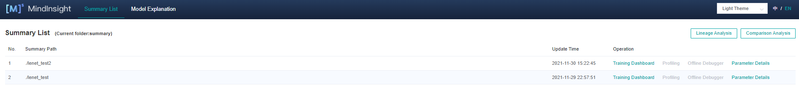

Figure 2: Summary List

## Loss Function Multidimensional Analysis

The Loss Function Multidimensional Analysis describes the motion trajectory of the model in the training process. User can understand the motion trajectory of the model in the training process by viewing the Loss Function Multidimensional Analysis.

Click the Training Dashboard No. 1 in Figure 2 to enter the page shown in Figure 3:

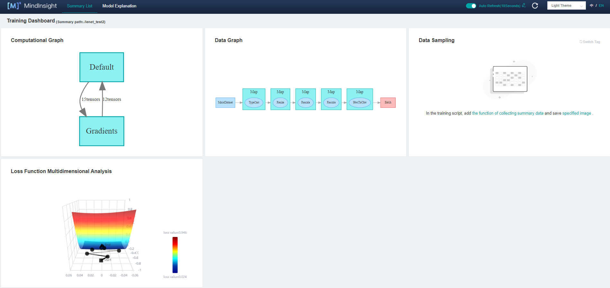

Figure 3: Training Dashboard

Click Figure 3 Loss Function Multidimensional Analysis to enter the following interface:

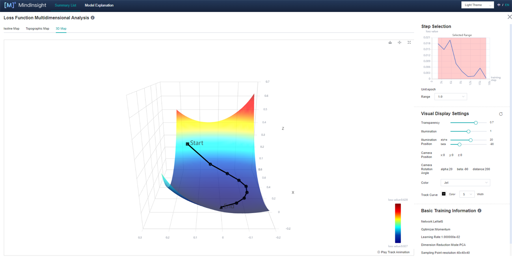

Figure 4: Loss Function Multidimensional Analysis-3D Map

Figure 4 shows the function area of Loss Function Multidimensional Analysis, including the following information:

1. Isoline Map, Topographic Map and 3D Map: They respectively represent different display forms of the same group of data, and user can freely choose to view them.
2. Step Selection: User can choose to display images of different sections through "range".
3. Visual Display Settings: By adjusting the parameters, user can view landscape through different angles, different landscape colors, and different track colors and widths. Among them, the number of contour lines can be adjusted in the Isoline Map (Fig. 5) and Topographic Map to show the density of the landscape.
4. Basic Training Information (Fig. 5): The basic information of the model will be displayed in the Basic Training Information, such as Network, Optimizer, Learning Rate (fixed learning rate is currently displayed), Dimension Reduction Mode, Sampling Point Resolution, Step/Epoch.

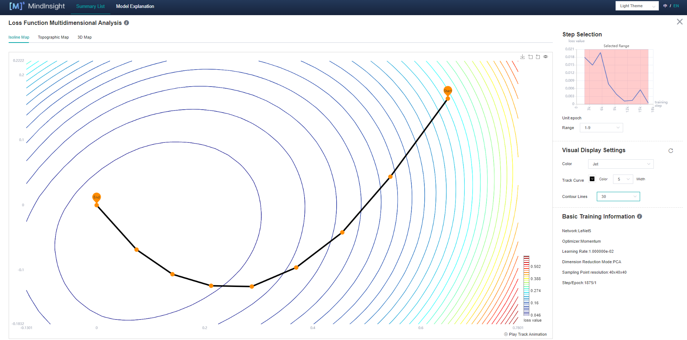

Figure 5: Loss Function Multidimensional Analysis-Isoline Map

## Loss Graph Comparison

Loss Graphic Comparison describes the situation around the convergence point at the end of training. User can observe and compare the terrain around the convergence point at the end of training through Loss Graphic Comparison.

Click Comparative Analysis in Figure 2 and select Loss Graphic Comparison to enter the page shown in Figure 6:

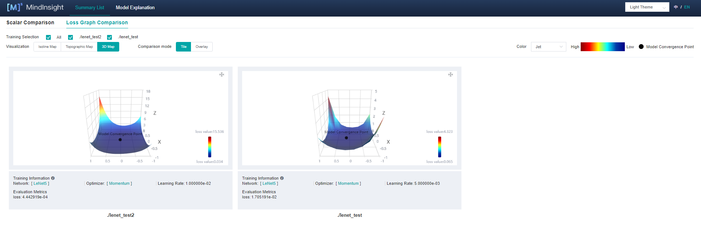

Figure 6: Loss Graphic Comparison-3D Map-Tile

Figure 6 shows the function area of Loss Graphic Comparison, including the following information:

1. Training: User can view different landscapes by selecting different labels.
2. Visualization: Isoline Map, Topographic Map and 3D Map respectively represent different display forms of the same group of data, which user can freely choose to view.
2. Comparison mode: User can select Tile or Overlay (Fig. 7) to compare different 3D maps.

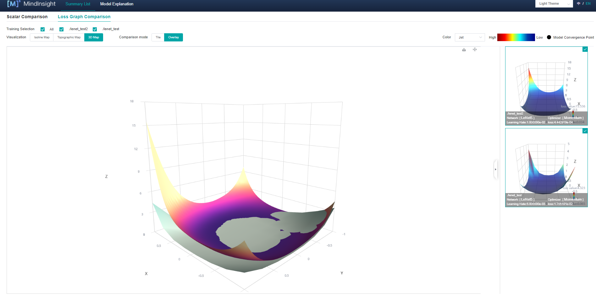

Figure 7: Loss Graphic Comparison-3D Map-Overlay

## Usage Examples Analysis

Here, taking the classification task as an example, the network is ResNet-50 and the dataset is CIFAR-10. Analyse Loss Function Multidimensional Analysis and Loss Graphic Comparison.

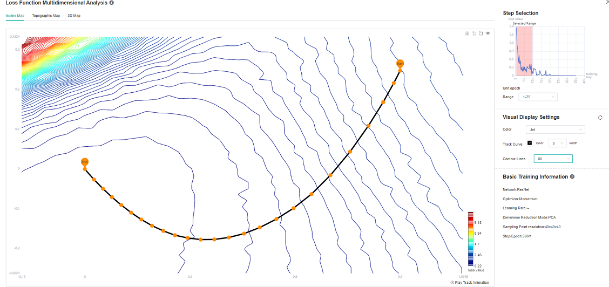

Figure 8: ResNet-50 Network 1-25 epoch Isoline Map

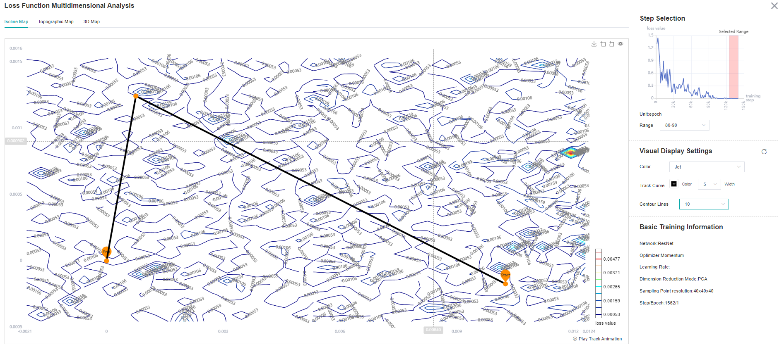

Figure 9: ResNet-50 Network 26-40 epoch Isoline Map

As can be seen from Figure 8, at the beginning of training, when the loss scalar curve drops rapidly, the loss trajectory is almost perpendicular to the isoline; As can be seen from Figure 9, at the middle stage of training, the loss curve tends to decline gently, and there are multiple local best points in the Isoline Map. To achieve the tutorial display effect, select as many intervals as possible to better display the effect.

It is mentioned in the paper ([Visualizing the Loss Landscape of Neural Nets](https://papers.nips.cc/paper/2018/file/a41b3bb3e6b050b6c9067c67f663b915-Paper.pdf)) that the smoother the convergence point of the model, the stronger the generalization ability of the model. For ResNet networks with different widths (the width here refers to the number of input and output channels of each block of the network. The larger the number of channels, the wider the model.)

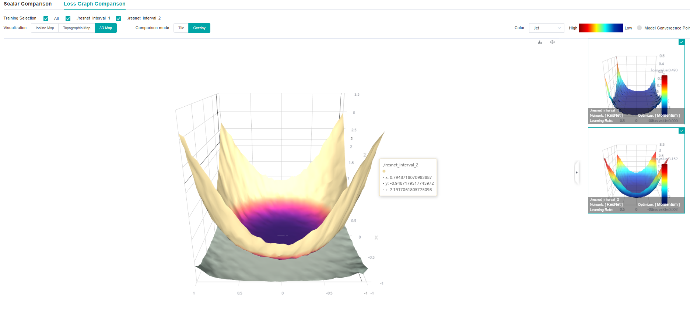

Figure 10: Loss Graphic Comparison-3D Map-Overlay-ResNet network overlapped by different widths (top (resnet_interval_1)-widths 4，bottom (resnet_interval_2)-widths 1)

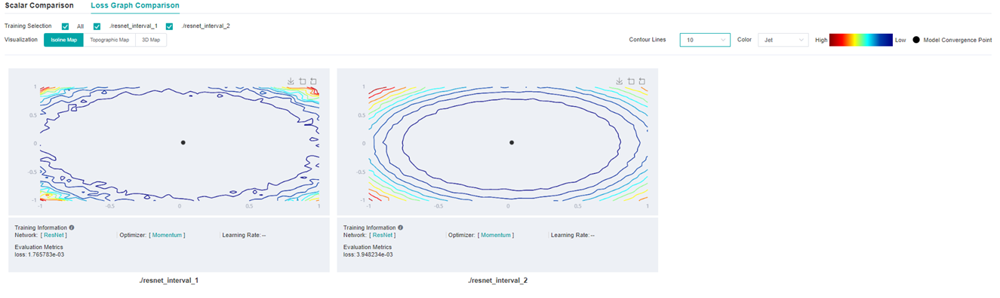

Figure 11:  Loss Graphic Comparison-Isoline Map-Comparison of different widths of ResNet network（left-widths 4，right-widths 1）

By comparing the Loss Graph in Figure 10 with that in Figure 11, it can be seen that when training the same epoch, the convergence point of the network with wider width is more flat and broad, and the experiment shows that the generalization ability is also stronger.

## Notices

1. During landscape drawing, the drawing time is directly related to the size of model parameters, dataset `num_sample` and resolution `landscape_size`. The larger model, `num_sample` and `landscape_size`, the longer it takes. For example, for a LeNet network with a resolution of 40 * 40, a landscape takes 4 minutes. When using two devices, the time of a landscape can be reduced to 2 minutes. ResNet-50 network, under the same resolution, 4 devices are used for drawing and calculation, and one landscape takes 20 minutes.
2. In the MindInsight startup interface, the training log file is large. Mindinsight needs more time to parse the training log file. Please wait patiently.
3. This function currently only supports models defined through mindspore.Model.
4. At present, it only supports: Backend: Ascend / GPU / CPU, Mode: Static Graph Mode, and Platform: Linux.
5. At present, this function only supports single device and multi-device modes.
6. This function does not support data sinking mode when drawing landscape.
