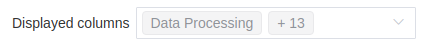
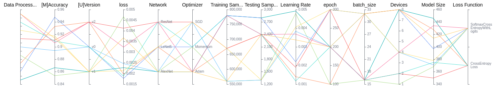
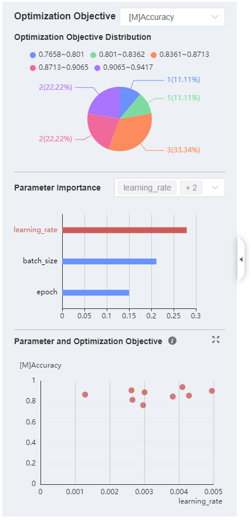
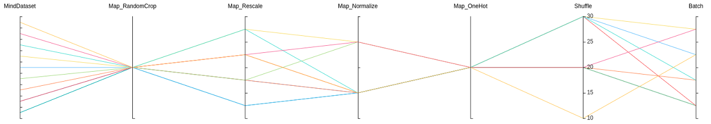
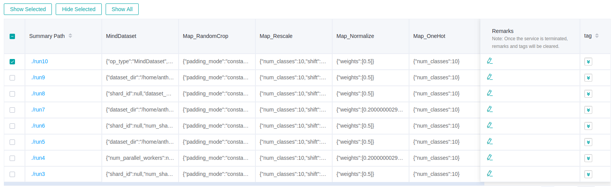
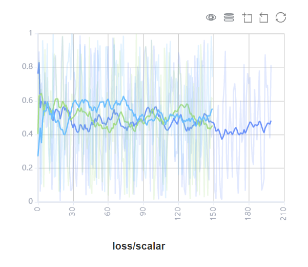

# Viewing Lineage and Scalars Comparison

## Overview

Model lineage, data lineage and comparison Kanban in mindinsight are the same as training dashboard. In the visualization of training data, different scalar trend charts are observed by comparison dashboard to find problems, and then the lineage function is used to locate the problem causes, so as to give users the ability of efficient tuning in data enhancement and deep neural network.

Access the Training Dashboard by selecting Comparison Dashboard.

## Model Lineage

Model lineage visualization is used to display the parameter information of all training models.

*Figure 1: Model parameter selection area*

Figure 1 shows the model parameter selection area, which lists the model parameter tags that can be viewed. You can select required tags to view the corresponding model parameters.

*Figure 2: Model lineage function area*

Figure 2 shows the model lineage function area, which visualizes the model parameter information. You can select a specific area in the column to display the model information within the area.

*Figure 3: Model list*

Figure 3 shows all model information in groups. You can sort the model information in ascending or descending order by the specified column.

The overview page on the left shows information about optimization objective and related parameters.

*Figure 4: Overview page*

Figure 4 shows the optimization objective distribution, parameter importance, and scatter plots. You can select the optimization objective to view the importance of the parameters, and then click the histogram to view the scatter plot of the parameters and optimization objective.

## Dataset Lineage

Dataset lineage visualization is used to display data processing and augmentation information of all model trainings.

*Figure 5: Data processing and augmentation operator selection area*

Figure 5 shows the data processing and augmentation operator selection area, which lists names of data processing and augmentation operators that can be viewed. You can select required tags to view related parameters.

*Figure 6: Dataset lineage function area*

Figure 6 shows the dataset lineage function area, which visualizes the parameter information used for data processing and augmentation. You can select a specific area in the column to display the parameter information within the area.

*Figure 7: Dataset lineage list*

Figure 7 shows the data processing and augmentation information of all model trainings.

> If user filters the model lineage and then switches to the data lineage page, the line chart will show the latest filtered column in model lineage.

## Scalars Comparison

Scalars Comparison can be used to compare scalar curves and loss graph between multiple trainings. For the detailed information of loss graph comparison, please refer to [Training Optimization Process Visualization](https://www.mindspore.cn/mindinsight/docs/en/r1.7/landscape.html).

*Figure 8: Scalars comparison curve area*

Figure 8 shows the scalar curve comparison between multiple trainings. The horizontal coordinate indicates the training step, and the vertical coordinate indicates the scalar value.

Buttons from left to right in the upper right corner of the figure are used to display the chart in full screen, switch the Y-axis scale, enable or disable the rectangle selection, roll back the chart step by step, and restore the chart.

- Full-screen Display: Display the scalar curve in full screen. Click the button again to restore it.
- Switch Y-axis Scale: Perform logarithmic conversion on the Y-axis coordinate.
- Enable/Disable Rectangle Selection: Draw a rectangle to select and zoom in a part of the chart. You can perform rectangle selection again on the zoomed-in chart.
- Step-by-step Rollback: Cancel operations step by step after continuously drawing rectangles to select and zooming in the same area.
- Restore Chart: Restore a chart to the original state.

*Figure 9: Scalars comparison function area*

Figure 9 shows the scalars comparison function area, which allows you to view scalar information by selecting different trainings or tags, different dimensions of the horizontal axis, and smoothness.

- Training Selection: Click the expand button and select or filter the required trainings to view the corresponding scalar information.
- Tag Selection: Select the required tags to view the corresponding scalar information.
- Horizontal Axis: Select any of Step, Relative Time, and Absolute Time as the horizontal axis of the scalar curve.
- Smoothness: Adjust the smoothness to smooth the scalar curve.

## Notices

To ensure performance, MindInsight implements scalars comparison with the cache mechanism and the following restrictions:

- The scalars comparison supports only for trainings in cache.
- The maximum of 15 latest trainings (sorted by modification time) can be retained in the cache.
- The maximum of 5 trainings can be selected for scalars comparison at the same time.
