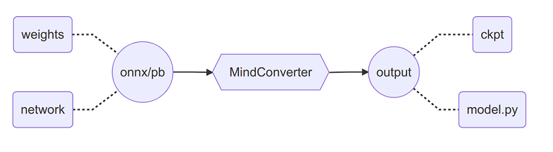

# Migrating From Third Party Frameworks With MindConverter

<a href="https://gitee.com/mindspore/docs/blob/master/docs/mindinsight/docs/source_en/migrate_3rd_scripts_mindconverter.md" target="_blank"></a>

## Overview

MindConverter is a migration tool to transform the model file of PyTorch(ONNX) or TensorFlow(PB) to MindSpore. The model file contains model structure definition(`network`) and weights information(`weights`), which will be transformed into model scripts(`model.py`) and weights file(`ckpt`) in MindSpore.



Moreover, this tool is able to transform the model file of PyTorch to MindSpore by adding API(`pytorch2mindspore`) to original PyTorch scripts.

## Quick Starts

MindConverter installation is described in [Install Tools](#install-tools). After the installation, you will have the MindConverter CLI and MindConverter API with the basic usage as follows.

### Start with MindConverter CLI

```shell
mindconverter --model_file /path/to/model_file --shape SHAPE --input_nodes INPUTS --output_nodes OUTPUTS
```

- `--model_file` specifies the path of model file, the model file supports `onnx` format or `pb` format.
- `--shape` specifies the input shape of model. Multiple inputs are separated by space.
- `--input_nodes` specifies the input names of model. Multiple inputs are separated by space.
- `--output_nodes` specifies the output names of model. Multiple outputs are separated by space.
- Output files are generated and saved under `$PWD/output` by default.

Notes:

1. The model file is in `onnx` format. If the model input shape is a static value, just specify `-- model_ file` to complete the conversion. Otherwise, you need to specify `--shape` and `--input_nodes` to complete the conversion. `--output_nodes` can be omitted. For model input shape judgment, please refer to [Determine the form of model input shape](#determine-the-form-of-model-input-shape).
2. The model file is in `pb` format without special scenarios.

For more CLI arguments, please refer to [MindConverter CLI Usage](#mindconverter-cli-usage).

### Start with MindConverter API

Write the following code in PyTorch network scripts.

```python
from mindconverter import pytorch2mindspore
pytorch2mindspore(model, dummy_inputs)
```

For the usage of API, please refer to [MindConverter API Description](https://www.mindspore.cn/mindinsight/api/en/master/mindconverter.html).

## Install Tools

### Install Dependencies

The following dependencies are required for MindConverter usage and suggested to be installed under the x86 environment. Refer to [installation](#install-dependencies-under-arm) under the ARM environment.

#### Start with MindConverter CLI

```shell
# Corresponding version of MindSpore is required(e.g. r1.2).
pip install mindspore~=1.2.0

# ONNX and relevant libraries are required.
pip install onnx~=1.8.0
pip install onnxoptimizer~=0.1.2
pip install onnxruntime~=1.5.2

# tf2onnx is required if model file is in pb format.
pip install tf2onnx~=1.7.1
```

#### Start with MindConverter API

```shell
# Corresponding version of MindSpore is required(e.g. r1.6).
pip install mindspore~=1.6.0

# torch is required, and official LTS version 1.8.2 is recommended.
pip install torch==1.8.2+cpu -f https://download.pytorch.org/whl/lts/1.8/torch_lts.html
```

### Install MindConverter

You can install MindConverter either by pip or by source code.

#### Installation by pip

Install from PyPI:

```bash
pip install mindconverter
```

Install with customized version:

```bash
pip install https://ms-release.obs.cn-north-4.myhuaweicloud.com/{version}/MindInsight/any/mindconverter-{version}-py3-none-any.whl --trusted-host ms-release.obs.cn-north-4.myhuaweicloud.com -i https://pypi.tuna.tsinghua.edu.cn/simple
```

> - When the network is connected, dependency items are automatically downloaded during .whl package installation. (For details about other dependency items, see [requirements.txt](https://gitee.com/mindspore/mindinsight/blob/master/ecosystem_tools/mindconverter/requirements.txt)). In other cases, you need to manually install dependency items.
> - `{version}` denotes the version of MindConverter. For example, when you are downloading MindConverter 1.6.0, `{version}` should be 1.6.0.
> - MindConverter supports only Linux distro with x86 architecture 64-bit or ARM architecture 64-bit.

#### Installation by Source Code

Downloading Source Code from Gitee.

```bash
git clone https://gitee.com/mindspore/mindinsight.git
```

Compiling MindConverter by any of the following installation methods:

1. Run the following command in the root directory of the source code:

    ```bash
    cd mindinsight/ecosystem_tools/mindconverter
    pip install -r requirements.txt -i https://pypi.tuna.tsinghua.edu.cn/simple
    python setup.py install
    ```

2. Build the `whl` package for installation.

    Enter the root directory of the source code, first execute the MindConverter compilation script in the `build` directory, and then execute the command to install the `whl` package generated in the `output` directory.

    ```bash
    cd mindinsight/ecosystem_tools/mindconverter
    bash build/build.sh mindconverter
    pip install output/mindconverter-{version}-py3-none-any.whl -i https://pypi.tuna.tsinghua.edu.cn/simple
    ```

## Migration Solution

A typical model project contains 4 main components. Tips for migrating each component are as follows:

- Model definition（`model.py`）
  1. Transform the model structure with MindConverter CLI.
  2. Manually enhance the readability of the generated model scripts(Optional).
  3. Mix the generated model with the original project to validate equivalence of the migration. Refer to [FAQ](#mix-the-mindspore-model-into-the-original-training-scripts).
- Data processing（`dataset.py`）
  1. For a built-in dataset, please query [API mapping](https://www.mindspore.cn/docs/en/master/note/api_mapping/pytorch_api_mapping.html) for migration.
  2. For a customized dataset and data augmentation, please refer to [the migration template](#step-2-migrate-the-data-processing).
- Model training（`train.py`）
  1. The loss function(`loss_fn`) can be migrated by querying [API mapping](https://www.mindspore.cn/docs/en/master/note/api_mapping/pytorch_api_mapping.html) or user's implementation.
  2. The optimizer(`optimizer`) can be migrated by querying [API mapping](https://www.mindspore.cn/docs/en/master/note/api_mapping/pytorch_api_mapping.html) or user's implementation.
  3. As the training codes could be flexible and significantly different from MindSpore, implementation by the users is recommended. Please refer to [FAQ](#step-3-migrate-the-model-training).
- Model evaluation（`eval.py`）
  1. The metric(`metric`) can be migrated by querying [API mapping](https://www.mindspore.cn/docs/en/master/note/api_mapping/pytorch_api_mapping.html) or user's implementation.
  2. As the evaluation codes could be flexible and significantly different from MindSpore, implementation by the users is recommended. Please refer to [FAQ](#step-4-migrate-the-model-evaluation).

## Practice Guidance

### Step 0：Export the model file

Exporting ONNX model file from PyTorch model(refer to [FAQ](#export-the-model-file-of-tensorflow) for Tensorflow guidance) requires operators mapping between [PyTorch](https://pytorch.org/docs/stable/onnx.html#supported-operators) and [ONNX](https://github.com/onnx/onnx/blob/master/docs/Operators.md#). Guidance is as follows:

1. Download source codes, weights file and relevant dataset files of the model project.

2. Dive into the model definition. Make sure that all parameters of the `forward` function are Tensor type. Please refer to [FAQ](#rectify-parameters-of-forward-function-definition).

3. Locate the model object and the input shape information from the model evaluation. Export the model object into onnx format.

   ```python
   import torch

   # Replace the following classpath according to the actual situation.
   from customized.path.to.pytorch.model import PyTorchNetwork

   model = PyTorchNetwork()
   param_dict = torch.load('/path/to/weights.pth')
   model.load_state_dict(param_dict)

   input_shape = (1, 3, 224, 224)
   input_tensor = torch.randn(*input_shape, dtype=torch.float32)
   torch.onnx.export(model, input_tensor, '/path/to/model.onnx', opset_version=11)

   ```

4. Validate the equivalence onnx model file against the original scripts.

   ```python
   import onnxruntime
   import numpy as np

   session = onnxruntime.InferenceSession('/path/to/model.onnx')
   input_node = session.get_inputs()[0]
   output = session.run(None, {input_node.name: np.load('/path/to/input.npy')})
   assert np.allclose(output, np.load('/path/to/output.npy'))
   ```

### Step 1:Migrate the model definition

Run the following MindConverter CLI to generate the model scripts(`model.py`), weights information(`ckpt`), [migration reports and weights mapping](#migration-reports-and-weights-mapping).

```shell
mindconverter --model_file /path/to/model.onnx
```

If you need to specify the model input shape, input node names and output node names. [Netron](https://github.com/lutzroeder/netron) is recommended to get the above information.

Model scripts(`model.py`) and weights information(`ckpt`) can be used not only to validate the equivalence of migration, but also to generate the [MindIR](https://www.mindspore.cn/tutorials/experts/en/master/parallel/save_load.html#mindir) file.

```python
import mindspore
import numpy as np

# Replace the following classpath according to the actual situation.
from customized.path.to.mindspore.model import MindSporeNetwork

network = MindSporeNetwork()
param_dict = mindspore.load_checkpoint('network.ckpt')
mindspore.load_param_into_net(network, param_dict)

input_data = np.load('/path/to/input.npy')
output_benchmark = np.load('/path/to/output.npy')

# Validate the equivalence of migration.
output_data = network(mindspore.Tensor(input_data))
assert np.allclose(output_data.asnumpy(), output_benchmark)

# Generate the MindIR file.
mindspore.export(network, mindspore.Tensor(input_data)), file_name='your_network_name', file_format='MINDIR')
```

Notes:

1. The Dropout operator will be lost after conversion because the inference mode is used to load the ONNX or TensorFlow model. Manually re-implementation is necessary.
2. This script conversion tool relies on operators which supported by MindConverter and MindSpore. Unsupported operators may not be successfully mapped to MindSpore operators. You can manually edit, or implement the mapping based on MindConverter, and make [contribution](https://gitee.com/mindspore/mindinsight/blob/master/ecosystem_tools/mindconverter/tutorial/add_onnx2mindspore_operator_mapper_advanced_tutorial.ipynb) to our MindInsight repository. We appreciate your support for the MindSpore community.
3. MindConverter converts dynamic input shape to constant one based on `--shape` while using graph based scheme, as a result, it is required that inputs’ shape used to retrain or inference in MindSpore are the same as that used to convert using MindConverter. If the input shape has changed, please running MindConverter again with new `--shape` or fixing shape related parameters in the old script.
4. MindSpore script and MindSpore checkpoint file are saved in the one file folder path, while report file and weight map file are saved in the other one.
5. The security and consistency of the model file should be guaranteed by the user.

### Step 2：Migrate the data processing

For a built-in dataset, please query [API mapping](https://www.mindspore.cn/docs/en/master/note/api_mapping/pytorch_api_mapping.html) for migration. For a customized dataset and data augmentation, self implementation is recommended. For more data processing migration, please refer to [the programming guidance](https://www.mindspore.cn/docs/programming_guide/en/master/dataset_sample.html).

Source codes with PyTorch framework are as follows:

```python
from torch.utils.data import Dataset, DataLoader
from torchvision import transforms

class CustomDataset(Dataset):
    def __init__(self, *args, **kwargs):
        self.records = [...]
        self.labels = [...]
        # Define data augmentation.
        self.transform = transforms.Compose([
            transforms.ToTensor(),
            transforms.Normalize(mean=(0.5, 0.5, 0.5), std=(0.5, 0.5, 0.5)),
        ])
    def __len__(self):
        return len(self.labels)
    def __getitem__(self, idx):
        # Execute data augmentation.
        data = self.transform(self.records[idx])
        return data, self.labels[idx]

dataset = CustomDataset(*args, **kwargs)
data_loader = DataLoader(dataset, batch_size=BATCH_SIZE)
```

Corresponding generated codes with MindSpore framework are as follows:

```python
from mindspore.dataset import GeneratorDataset
from mindspore.dataset import py_transforms as transforms

class CustomGenerator:
    def __init__(self, *args, **kwargs):
        self.records = [...]
        self.labels = [...]
        # Define data augmentation.
        self.transform = transforms.Compose([
            transforms.ToTensor(),
            transforms.Normalize(mean=(0.5, 0.5, 0.5), std=(0.5, 0.5, 0.5)),
        ])
    def __len__(self):
        return len(self.labels)
    def __getitem__(self, idx):
        # Execute data augmentation.
        data = self.transform(self.records[idx])
        return data, self.labels[idx]

generator = CustomGenerator(*args, **kwargs)
dataset = GeneratorDataset(generator, column_names=['data', 'label']).batch(BATCH_SIZE)
```

### Step 3：Migrate the model training

The loss function(`loss_fn`) can be migrated by querying [API mapping](https://www.mindspore.cn/docs/en/master/note/api_mapping/pytorch_api_mapping.html) or user's implementation. For more loss function migration, please refer to [the programming guidance](https://www.mindspore.cn/docs/programming_guide/en/master/loss.html).

The optimizer(`optimizer`) can be migrated by querying [API mapping](https://www.mindspore.cn/docs/en/master/note/api_mapping/pytorch_api_mapping.html) or user's implementation. For more optimizer migration, please refer to [the programming guidance](https://www.mindspore.cn/docs/programming_guide/en/master/optim.html).

As the training codes could be flexible and significantly different from MindSpore, implementation by the users is recommended.

Source codes with PyTorch framework are as follows:

```python
import torch

# Replace the following classpath according to the actual situation.
from customized.path.to.pytorch.model import PyTorchNetwork

# Create a instance of network model.
network = PyTorchNetwork()

# Define optimizer and learning rate.
optimizer = torch.optim.SGD(network.parameters(), lr=LEARNING_RATE)
scheduler = torch.optim.lr_scheduler.ExponentialLR(optimizer, gamma=DECAY_RATE)

# Launch the model training.
for i in range(EPOCH_SIZE):
    for data, label in data_loader:
        optimizer.zero_grad()
        output = network(data)
        loss = loss_fn(output, label)
        loss.backward()
        optimizer.step()
    scheduler.step()
```

Corresponding generated codes(Low-Level API) with MindSpore framework are as follows:

```python
from mindspore import nn

# Replace the following classpath according to the actual situation.
from customized.path.to.mindspore.model import MindSporeNetwork

# Create a instance of network model.
network = MindSporeNetwork()

# Define learning rate and optimizer.
scheduler = nn.ExponentialDecayLR(LEARNING_RATE, decay_rate=DECAY_RATE, decay_steps=1)
optimizer = nn.SGD(params=network.trainable_params(), learning_rate=scheduler)

# Launch the model training.
net_with_loss = nn.WithLossCell(network, loss_fn)
train_network = nn.TrainOneStepCell(net_with_loss, optimizer)
train_network.set_train()
data_iterator = dataset.create_tuple_iterator(num_epochs=EPOCH_SIZE)
for i in range(EPOCH_SIZE):
    for data, label in data_iterator:
        loss = train_network(data, label)
```

Corresponding generated codes(High-Level API) with MindSpore framework are as follows:

```python
from mindspore import nn
from mindspore import Model

# Replace the following classpath according to the actual situation.
from customized.path.to.mindspore.model import MindSporeNetwork

# Create a instance of network model.
network = MindSporeNetwork()

# Define learning rate and optimizer.
scheduler = nn.ExponentialDecayLR(LEARNING_RATE, decay_rate=DECAY_RATE, decay_steps=1)
optimizer = nn.SGD(params=network.trainable_params(), learning_rate=scheduler)

# Launch the model training.
model = Model(network, loss_fn=loss_fn, optimizer=optimizer)
model.train(EPOCH_SIZE, dataset)
```

### Step 4：Migrate the model evaluation

The metric(`metric`) can be migrated by querying [API mapping](https://www.mindspore.cn/docs/en/master/note/api_mapping/pytorch_api_mapping.html) or user's implementation.

As the evaluation codes could be flexible and significantly different from MindSpore, implementation by the users is recommended. For more model evaluation migration, please refer to [the programming guidance](https://www.mindspore.cn/tutorials/experts/zh-CN/master/infer/ascend_910_mindir.html).

Source codes with PyTorch framework are as follows:

```python
import torch

# Replace the following classpath according to the actual situation.
from customized.path.to.pytorch.model import PyTorchNetwork

network = PyTorchNetwork()
param_dict = torch.load('/path/to/weights.path')
network.load_state_dict(param_dict)


for data, label in data_loader:
    output = network(data)
    loss = loss_fn(output, label)
    accuracy = metric_fn(output, label)
    print(accuracy)
```

Corresponding generated codes(Low-Level API) with MindSpore framework are as follows:

```python
import mindspore

# Replace the following classpath according to the actual situation.
from customized.path.to.mindspore.model import MindSporeNetwork

network = MindSporeNetwork()
param_dict = mindspore.load_checkpoint('/path/to/weights.ckpt')
mindspore.load_param_into_net(network, param_dict)

data_iterator = dataset.create_tuple_iterator()
for data, label in data_iterator:
    output = network(data)
    loss = loss_fn(output, label)
    accuracy = metric_fn(output, label)
    print(accuracy)
```

Corresponding generated codes(High-Level API) with MindSpore framework are as follows:

```python
import mindspore
from mindspore import Model

# Replace the following classpath according to the actual situation.
from customized.path.to.mindspore.model import MindSporeNetwork

network = MindSporeNetwork()
param_dict = mindspore.load_checkpoint('/path/to/weights.ckpt')
mindspore.load_param_into_net(network, param_dict)

model = Model(network, loss_fn=loss_fn, metrics={'accuracy'})
accuracy = model.eval(dataset)
```

## MindConverter CLI Usage

```shell
usage: mindconverter [-h] [--version]
                     [--model_file MODEL_FILE] [--shape SHAPE [SHAPE ...]]
                     [--input_nodes INPUT_NODES [INPUT_NODES ...]]
                     [--output_nodes OUTPUT_NODES [OUTPUT_NODES ...]]
                     [--output OUTPUT] [--report REPORT]
```

Arguments are as follows：

| Argument         | Mandatory | Description                                   |  Type  | Default |       Example        |
| -------------- | :--: | ------------------------------------------- | :----: | :----: | :-------------------: |
| -h, --help     |  N  | Show the help message.                       |   -    |   -    |           -           |
| --version      |  N  | Show the version info.                       |   -    |   -    |           -           |
| --model_file   |  Y  | Specify the path of model file.              | String |   -    |  /path/to/model.onnx  |
| --shape        |  Y  | Specify the input shape of model. Multiple inputs are separated by space. | String |   -    |      1,3,224,224      |
| --input_nodes  |  Y  | Specify the input names of model. Multiple inputs are separated by space. | String |   -    |       input_1:0       |
| --output_nodes |  Y  | Specify the output names of model. Multiple outputs are separated by space.  | String |   -    | output_1:0 output_2:0 |
| --output       |  N  | Specify the directory path for generated files.    | String |  $PWD  |  /path/to/output/dir  |

## Model List Supported by MindConverter

For supported models (tested based on PyTorch 1.5.0 and TensorFlow 1.15.0, x86 Ubuntu released version), please refer to [LINK](https://gitee.com/mindspore/mindinsight/blob/master/ecosystem_tools/mindconverter/docs/supported_model_list.md#).

## MindConverter Error Code Definition

For error code defined in MindConverter, please refer to [LINK](https://gitee.com/mindspore/mindinsight/blob/master/ecosystem_tools/mindconverter/docs/error_code_definition.md#).

## FAQ

### Install dependencies under ARM

MindConverter under the ARM environment requires compiling `protobuf`/`onnx`/`onnxoptimizer` from scratch. Since the compiling is complicated and error prone, we strongly recommend to use MindConverter under the x86 environment.

1. Compile `protobuf`(refer to [ONNX](https://github.com/onnx/onnx)) and install cpp backend.

   ```shell
   # build, compile and install protobuf
   git clone https://github.com/protocolbuffers/protobuf.git
   cd protobuf
   git checkout v3.16.0
   git submodule update --init --recursive
   mkdir build_source
   cd build_source
   cmake ../cmake -Dprotobuf_BUILD_SHARED_LIBS=OFF -DCMAKE_INSTALL_PREFIX=/usr/local/protobuf -DCMAKE_INSTALL_SYSCONFDIR=/etc -DCMAKE_POSITION_INDEPENDENT_CODE=ON -Dprotobuf_BUILD_TESTS=OFF -DCMAKE_BUILD_TYPE=Release
   make -j$(nproc)
   make install

   # Install cpp backend.
   cd ../python
   python setup.py install --cpp_implementation
   ```

2. Configure environment variables for `protobuf`.

   ```shell
   export PROTOBUF_PATH=/usr/local/protobuf
   export PATH=$PROTOBUF_PATH/bin:$PATH
   export PKG_CONFIG_PATH=$PROTOBUF_PATH/lib/pkgconfig
   export LD_LIBRARY_PATH=$PROTOBUF_PATH/lib:$LD_LIBRARY_PATH
   export LIBRARY_PATH=$PROTOBUF_PATH/lib:$LIBRARY_PATH
   export PROTOCOL_BUFFERS_PYTHON_IMPLEMENTATION=cpp
   ```

3. Validate cpp backend of `protobuf`.

   ```python
   from google.protobuf.internal import api_implementation
   print(api_implementation.Type())
   ```

4. `onnx` should be recompiled and installed to guarantee running `onnx` with `protobuf` built by static library. Please refer to [the installation guidance](https://github.com/onnx/onnx).

   ```shell
   git clone https://github.com/onnx/onnx.git
   cd onnx
   git submodule update --init --recursive
   # prefer lite proto
   set CMAKE_ARGS=-DONNX_USE_LITE_PROTO=ON
   pip install -e .
   ```

5. Compile and install `onnxoptimizer`. Please refer to [the installation guidance](https://github.com/onnx/optimizer).

   ```shell
   git clone --recursive https://github.com/onnx/optimizer onnxoptimizer
   cd onnxoptimizer
   pip3 install -e .
   ```

6. Install `onnxruntime`.

   ```shell
   pip install onnxruntime~=1.5.2
   ```

### Determine the form of model input shape

Using [Netron](https://github.com/lutzroeder/netron) load the onnx model file, click the top node, and observe the type of each input in `INPUTS` in the sidebar. If the type is a specific value, such as `int64[1,9]`, the current input is static. Otherwise, it is dynamic, such as `int64[batch,sequence]`.

### Export the model file of Tensorflow

Exporting the PB model file from a Tensorflow model requires operators mapping between [Tensorflow](https://github.com/onnx/tensorflow-onnx/blob/master/support_status.md#) and [ONNX](https://github.com/onnx/onnx/blob/master/docs/Operators.md#). For models defined by Keras, guidance is as follows:

TensorFlow 1.x

```python
import tensorflow as tf
from tensorflow.python.framework import graph_io
from tensorflow.python.keras.applications.inception_v3 import InceptionV3

model = InceptionV3()
INPUT_NODES = [ipt.op.name for ipt in model.inputs]
OUTPUT_NODES = [opt.op.name for opt in model.outputs]

tf.keras.backend.set_learning_phase(0)
session = tf.keras.backend.get_session()
with session.graph.as_default():
    graph_inf = tf.graph_util.remove_training_nodes(session.graph.as_graph_def())
    graph_frozen = tf.graph_util.convert_variables_to_constants(session, graph_inf, OUTPUT_NODES)
    graph_io.write_graph(graph_frozen, logdir="/path/to/output/dir", name="model.pb", as_text=False)

print(f"Input nodes name: {INPUT_NODES}, output nodes name: {OUTPUT_NODES}")
```

TensorFlow 2.x

```python
import tensorflow as tf
from tensorflow.python.framework.convert_to_constants import convert_variables_to_constants_v2
from tensorflow.keras.applications import InceptionV3

model = InceptionV3()
spec = tf.TensorSpec(model.inputs[0].shape, model.inputs[0].dtype)
full_model = tf.function(lambda x: model(x)).get_concrete_function(spec)
frozen_func = convert_variables_to_constants_v2(full_model)
frozen_func.graph.as_graph_def()
tf.io.write_graph(frozen_func.graph, logdir="/path/to/output/dir", name="model.pb", as_text=False)
```

TensorFlow is required for exporting PB model file but it is not explicitly declared as mandatory dependency for MindConverter. If the user wants to use graph based MindConverter, please install TensorFlow(TensorFlow 1.15.x is recommended).

### Rectify parameters of forward function definition

Some models define non-Tensor parameters within forward function are as follows:

```python
class Model(nn.Cell):
    def __init__(self, *args, **kwargs):
        self.op = Operator()
        self.loss_fn = LossFunction()
    def forward(self, data, label):
        output = self.op(data)
        loss = self.loss_fn(output, label)
        return output, loss
```

The above `label` is a non-Tensor parameter which needs to be rectified.

```python
class Model(nn.Cell):
    def __init__(self, *args, **kwargs):
        self.op = Operator()
    def forward(self, data):
        output = self.op(data)
        return output
```

### Mix the MindSpore model with the original training scripts

Validate the equivalence of migration by mixing the MindSpore model and weights with the PyTorch training scripts.

```python
import mindspore
import torch
from torch.utils.data import DataLoader

# Replace the following classpath according to the actual situation.
from customized.path.to.mindspore.model import MindSporeNetwork

network = MindSporeNetwork()
param_dict = mindspore.load_checkpoint('network.ckpt')
mindspore.load_param_into_net(network, param_dict)

data_loader = DataLoader(dataset, batch_size=BATCH_SIZE)
for data, label in data_loader:
    ms_data = mindspore.Tensor(data.numpy())
    ms_output = network(ms_data)
    output = torch.Tensor(ms_output.asnumpy())
    loss = loss_fn(output, label)
    accuracy = metric_fn(output, label)
    print(accuracy)

```

### Migration reports and weights mapping

For operators that are not successfully converted, the conversion report records the unconverted code lines and operator information, and at the same time identifies the input/output shape of the node in the code (represented as `input_shape` and `output_shape`), which is convenient for users to modify manually. An example of the `Reshape` operator is as follows:

```python
class Classifier(nn.Cell):
    def __init__(self):
        super(Classifier, self).__init__()
        self.reshape = onnx.Reshape(input_shape=(1, 1280, 1, 1), output_shape=(1, 1280))

    def construct(self, x):
        # Suppose input of `reshape` is x.
        reshape_output = self.reshape(x)
        # skip codes ...
```

It is convenient to replace the operators according to the `input_shape` and `output_shape` parameters. The replacement is like this:

```python
from mindspore import ops

class Classifier(nn.Cell):
    def __init__(self):
        super(Classifier, self).__init__()
        self.reshape = ops.Reshape(input_shape=(1, 1280, 1, 1), output_shape=(1, 1280))

    def construct(self, x):
        # Suppose input of `reshape` is x.
        reshape_output = self.reshape(x, (1, 1280))
        # skip codes ...
```

Weight information in MindSpore(`converted_weight`) and that in source framework(`source_weight`) are saved in weight mapping. An example is as follows:

```json
{
  "resnet50": [
    {
      "converted_weight": {
        "name": "conv2d_0.weight",
        "shape": [64, 3, 7, 7],
        "data_type": "Float32"
      },
      "source_weight": {
        "name": "conv1.weight",
        "shape": [64, 3, 7, 7],
        "data_type": "float32"
      }
    }
  ]
}
```

### AST-Based Model Migration

MindConverter supports AST-based model migration for PyTorch scripts. It parses and analyzes original scripts, then replaces them with the MindSpore AST to generate codes.

> Since the result may differ due to the coding style of original scripts, AST-based model migration is now DEPRECATED and will be removed in r2.0.

Assume the PyTorch script is located at `/path/to/model.py`, and outputs the transformed MindSpore script to `/path/to/output/dir`. Use the following command:

```bash
mindconverter --in_file /path/to/model.py --output /path/to/output/dir
```

In the conversion report, non-converted code is listed as follows. `x, y` indicates the line number and the column number of the original scripts. For non-converted operators, please refer to [MindSpore API mapping](https://www.mindspore.cn/docs/en/master/note/api_mapping/pytorch_api_mapping.html). For unsupported operators, the corresponding code lines will remain in the original way.

```text
line x:y: [UnConvert] 'operator' didn't convert. ...
```

For non-converted operators, suggestions are provided in the report. For example, MindConverter suggests that replace `torch.nn.AdaptiveAvgPool2d` with `mindspore.ops.ReduceMean` in `line 157:23`.

```text
 [Start Convert]
 [Insert] 'from mindspore import ops' is inserted to the converted file.
 line 1:0: [Convert] 'import torch' is converted to 'import mindspore'.
 ...
 line 157:23: [UnConvert] 'nn.AdaptiveAvgPool2d' didn't convert. Maybe could convert to mindspore.ops.ReduceMean.
 ...
 [Convert Over]
```

The following cases are not supported:

1. Specific classes and functions.

    - `torch.Tensor` members, including `shape`，`ndim` and `dtype`
    - `torch.nn.AdaptiveXXXPoolXd` and `torch.nn.functional.adaptive_XXX_poolXd()`
    - `torch.nn.functional.Dropout`
    - `torch.unsqueeze()` and `torch.Tensor.unsqueeze()`
    - `torch.chunk()` and `torch.Tensor.chunk()`

2. Subclasses of `nn.Module`.

   ```python
   # Code snippets from torchvision.models.mobilenet
   from torch import nn

   class ConvBNReLU(nn.Sequential):
      def __init__(self, in_planes, out_planes, kernel_size=3, stride=1, groups=1):
          padding = (kernel_size - 1) // 2
          super(ConvBNReLU, self).__init__(
              nn.Conv2d(in_planes, out_planes, kernel_size, stride, padding, groups=groups, bias=False),
              nn.BatchNorm2d(out_planes),
              nn.ReLU6(inplace=True)
          )
   ```
