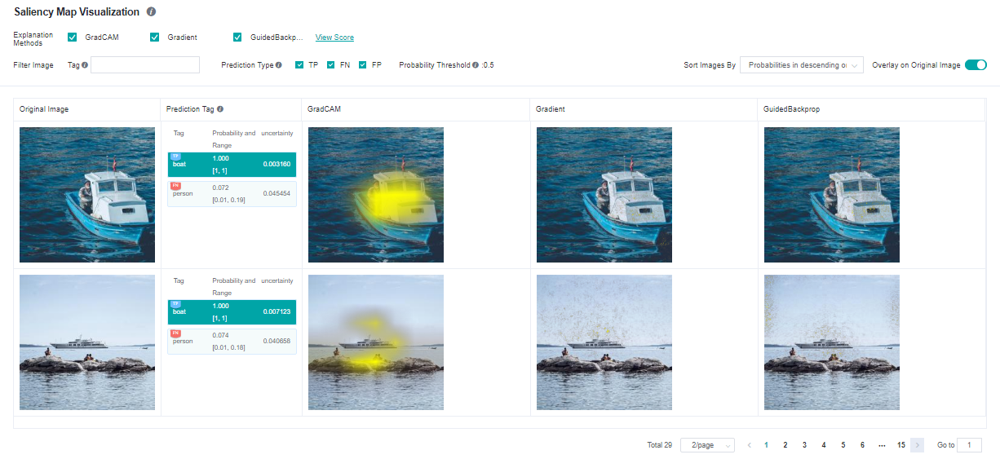
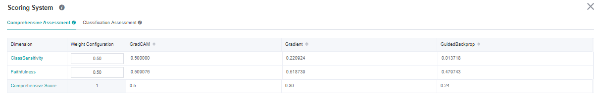
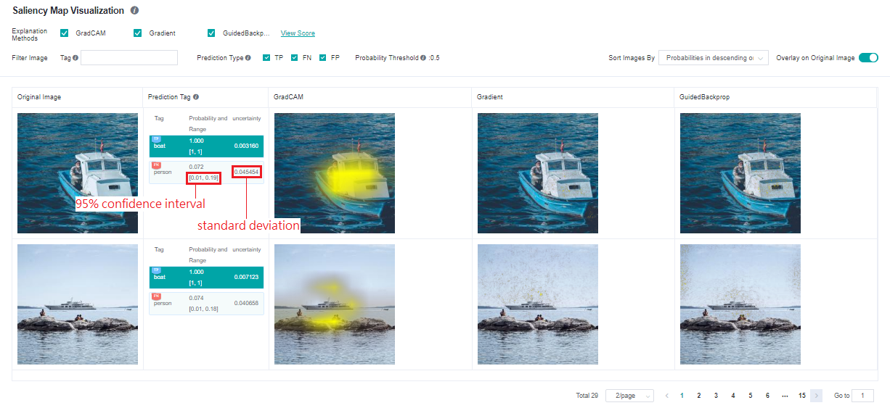
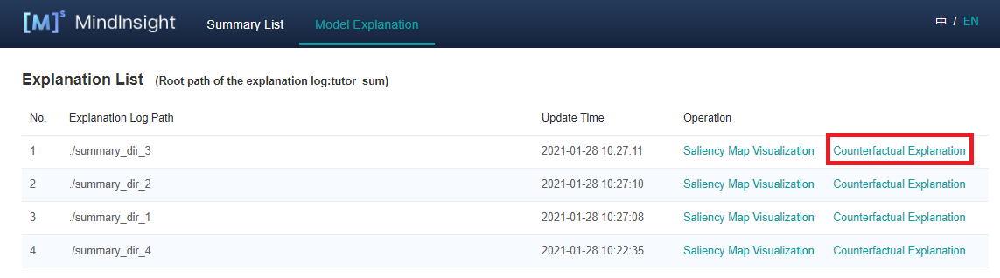

# Explain Models

`Linux` `Ascend` `GPU` `Model Optimization` `Beginner` `Intermediate` `Expert`

<a href="https://gitee.com/mindspore/docs/blob/r1.3/docs/mindinsight/docs/source_en/model_explanation.md" target="_blank"></a>

## Overview

Currently, most deep learning models are black-box models with good performance but poor explainability. The model explanation module aims to provide users with explanation of the model decision basis, help users better understand the model, trust the model, and improve the model when an error occurs in the model.

In some critical application scenarios, such as automatic driving, financial decision-making, etc., AI model cannot be truly applied if it is not interpretable for legal and policy supervision reasons. Therefore, the interpretability of the model is becoming more and more important. As a consequence, model explanation is an important part of improving MindSpore's applicability and user-friendliness.

To be specific, in the task of image classification, a widely-used group of explanation methods will highlight the most critical area that affects the classification decision of the model. We call it "saliency map". If the highlighted parts are indeed the key features of the targeted label, then the features learned by the model are usually correct, thus the users can trust the effect and decision of the model. If the model focuses on irrelevant parts, even if the prediction label is correct, it does not mean that the model is reliable, the model developers still need to optimize and improve the model. This may be due to the correlation of some irrelevant features in the training data. Model developers can consider further data augmentation to correct the bias learned by the model correspondingly.

Besides a variety of explanation methods, we also provide a set of evaluation methods to evaluate the explanation methods from various dimensions. It helps users compare and select the explanation methods that are most suitable for a particular scenario.

## Operation Process

### Preparing the Script

Currently, MindSpore provides the explanation methods and explanation evaluation Python API. You can use the provided explanation methods by  `mindspore.explainer.explanation` and the provided explanation evaluation by `mindspore.explainer.benchmark`. You need to prepare the black-box model and data to be explained, instantiate explanation methods or explanation evaluation according to your need and call the explanation API in your script to collect the explanation result and explanation evaluation result.

MindSpore also provides `mindspore.explainer.ImageClassificationRunner` to run all explanation methods and explanation evaluation methods automatically. You just need to register the instantiated object and then all explanation methods and explanation evaluation methods will be executed. Explanation logs containing explanation results and explanation evaluation results will be automatically generated and stored.

The following uses ResNet-50 and multi-label dataset with 20 classes as an example. Initializing the explanation methods in `explanation` and the evaluation methods in `benchmark`, the users can then use `ImageClassificationRunner` to execute and explanation and evaluation for the black-box model. The sample code is as follows:

```python
import mindspore.nn as nn
from mindspore import context
from mindspore import load_checkpoint, load_param_into_net

from mindspore.explainer.explanation import GradCAM, GuidedBackprop
from mindspore.explainer.benchmark import Faithfulness, Localization
from mindspore.explainer import ImageClassificationRunner

if __name__ == "__main__":
    context.set_context(mode=context.PYNATIVE_MODE)
    num_classes = 20
    # please refer to model_zoo for the model architecture of resnet50
    net = resnet50(num_classes)
    param_dict = load_checkpoint("resnet50.ckpt")
    load_param_into_net(net, param_dict)


    # initialize explainers with the loaded black-box model
    gradcam = GradCAM(net, layer='layer4')
    guidedbackprop = GuidedBackprop(net)

    # initialize benchmarkers to evaluate the chosen explainers
    # for Faithfulness, the initialization needs an activation function that transforms the output of the network to a probability is also needed
    activation_fn = nn.Sigmoid()  # for multi-label classification
    faithfulness = Faithfulness(num_labels=num_classes, metric='InsertionAUC', activation_fn=activation_fn)
    localization = Localization(num_labels=num_classes, metric='PointingGame')

    # returns the dataset to be explained, when localization is chosen, the dataset is required to provide bounding box
    # the columns of the dataset should be in [image], [image, labels], or [image, labels, bbox] (order matters)
    # You may refer to 'mindspore.dataset.project' for columns managements
    dataset_path = "dataset_dir"
    dataset = get_dataset(dataset_path)

    # specify the class names of the dataset
    classes = [
     'aeroplane', 'bicycle', 'bird', 'boat', 'bottle', 'bus', 'car', 'cat',
     'chair', 'cow', 'diningtable', 'dog', 'horse', 'motorbike', 'person',
     'pottedplant', 'sheep', 'sofa', 'train', 'tvmonitor',
    ]

    data = (dataset, classes)
    explainers = [gradcam, guidedbackprop]
    benchmarkers = [faithfulness, localization]

    # initialize runner with specified summary_dir
    runner = ImageClassificationRunner(summary_dir='./summary_dir', network=net, activation_fn=activation_fn, data=data)
    runner.register_saliency(explainers, benchmarkers)

    # execute runner.run to generate explanation and evaluation results to save it to summary_dir
    runner.run()
```

### Restrictions

- Only support image classification models, such as Lenet, Resnet, Alexnet.
- Input images must be in 1, 3, or 4 channels format.
- Only support GPU and Ascend devices with PyNative mode.
- All instances of explanation and evaluation methods cannot be reused across runners. Explanation and evaluation methods have to be instantiated exclusively for each runner. Otherwise, errors may occur. A correct example is shown below.

```python
gradcam = GradCAM(net, layer='layer4')
guidedbackprop = GuidedBackprop(net)

runner = ImageClassificationRunner(summary_dir='./summary_dir_1', network=net, activation_fn=activation_fn, data=data)
runner.register_saliency(explainers=[gradcam, guidedbackprop])
runner.run()

# generate another summary with GradCAM only
runner2 = ImageClassificationRunner(summary_dir='./summary_dir_2', network=net, activation_fn=activation_fn, data=data)

# reusing explainer instance in other runner, errors may occur
# runner2.register_saliency(explainers=[gradcam])

# instantiating a new GradCAM is the correct way
gradcam2 = GradCAM(net, layer='layer4')
runner2.register_saliency(explainers=[gradcam2])

runner2.run()
```

### Enabling MindInsight

Enable MindInsight and click **Model Explanation** on the top of the page. All explanation log paths are displayed. When a log path meets the conditions, the **Saliency Map Visualization** buttons are displayed in the **Operation** column.


## Pages and Functions

### Saliency Map Visualization

Saliency map visualization is used to display the image area that has the most significant impact on the model decision-making result. Generally, the highlighted regions can be considered as key features of the objective classification.



The following information is displayed on the **Saliency Map Visualization** page:

- Objective dataset set by a user through the Python API of the dataset.
- Ground truth tags, prediction tags, and the prediction probabilities of the model for the corresponding tags. The system adds the TP, FN, and FP flags(meanings are provided in the page's information) in the upper left corner of the corresponding tag based on the actual requirements.
- A saliency map given by the selected explanation method.

Operations:

1. Select the required explanation methods. Currently, we support four explanation methods. More explanation methods will be provided in the future.
2. Click **Overlay on Original Image** in the upper right corner of the page to overlay the saliency map on the original image.
3. Click different tags to display the saliency map analysis results of the model for different tags. For different classification results, the focus of the model is usually different.
4. Check prediction type checkboxes to display images with the checked tag types: TP - true positive, FN - false negative, FP - false positive.
5. Use the tag filtering function on the upper part of the page to filter out images with specified tags.
6. Select an image display sequence from **Sort Images By** in the upper right corner of the page, options: "Probabilities in descending order" and "Uncertainties in descending order".
7. Click **View Score** on the right of an explanation method. The page for assessing all explanation methods is displayed.
8. Click image you will see the higher resolution image.


### Explanation Method Assessment

#### Comprehensive Assessment

The provided explanation methods are scored from different dimensions. We provide various dimensions scores to help users compare the performance and select the most suitable one. You can configure weights for metrics in a specific scenario to obtain the comprehensive score.



#### Classification Assessment

The classification assessment page provides two types of comparison. One is to compare scores of different evaluation dimensions of the same explanation method in each tag. The other is to compare scores of different explanation methods of the same evaluation dimension in each tag.


## Uncertainty

The model predictions come with uncertainty, which is called [Epistemic Uncertainty](https://www.mindspore.cn/probability/api/zh-CN/r1.3/nn_probability/mindspore.nn.probability.toolbox.UncertaintyEvaluation.html#mindspore.nn.probability.toolbox.UncertaintyEvaluation). It inserts a dropout layer to the network and inferences multiple times. The results are standard deviation and 95% confidence interval of the model output predictions:



The restrictions, preparation of network and data is the same as the saliency explanation methods, users enable uncertainty calculations by invoking `register_uncertainty()` of `ImageClassificiationRunner`. The sample code is shown below.

```python
runner = ImageClassificationRunner(summary_dir='./summary_dir_1', network=net, activation_fn=activation_fn, data=data)
runner.register_saliency(explainers=[gradcam, guidedbackprop])
runner.register_uncertainty()
runner.run()
```

Please note that `register_uncertainty()` must be used together with `register_saliency()`, their calling order doesn't matter.

## Counterfactual

Counterfactual is a relatively new way of explaining a model's decision, which inverts the decision by modifying the traits of the sample. For example, there is an animal image that is classified as a cat by the model. How can we edit that image in order to make the classification not happening? By answering that question, we can explain the model decision of classifying to "cat". Counterfactuals come in various forms, currently, `ImageClassificationRunner` provides an easy-to-use method called Hierarchical Occlusion Counterfactual (HOC), more counterfactual methods will be provided in the future.

### Hierarchical Occlusion Counterfactual (HOC)

HOC is an occlusion-based method, it searches for the smallest possible display region that is subjected to the constraint of the target label's prediction confidence greater than a threshold (currently fixed at 0.5). The search process is conducted in a hierarchical manner, at the beginning, the original image was covered by its blurred version, then HOC searches large occlusion areas and recursively deeps down into smaller areas for achieving a more accurate result. It ends up with an area tree, each node represents a square display area and the smaller child areas are fall inside the parent. The root node represents the entire area of the original image, its immediate children are the first layer display areas.

At the moment, `ImageClassificationRunner` automatically generates the number of layers (1 to 3), the sizes of occluded areas, the strides, and the blur mask base on the image dimensions. The side length of the first layer occlusion square is defined as the round down of half of the short side of the image, we cut the side length in half in every next layer. Meanwhile, the side length has to be equals to or greater than 28, otherwise, stop adding layers. The stride is the round down of 1/5 of the occluded area's side length.

The preparation of network and data is the same as the saliency explanation methods, users can employ HOC by invoking `register_hierarchical_occlusion()` of `ImageClassificiationRunner`. The sample code is shown below.

```python
runner = ImageClassificationRunner(summary_dir='./summary_dir_1', network=net, activation_fn=activation_fn, data=data)
runner.register_hierarchical_occlusion()
runner.run()
```

Users may combine the use of `register_saliency()` with the same runner.

#### HOC Restrictions

- Apart from all the restrictions from saliency explanation methods, models must take 3 channels input images.
- Input images must be in RGB 3 channels format and the length of the short side must be equals to or greater than 56.
- If `register_hierarchical_occlusion()` is called but `register_saliency()` is not called, then both PyNative and Graph mode are supported.

#### HOC Pages and Functions

You can see that the 'Counterfactual Explanation' operations are enabled for those explanation jobs employed HOC. Clicking it will lead you to the HOC explanation page.



The HOC explanation page displays all HOC results, includes:

- Samples with prediction confidence of any tag that greater than 0.5 and their original images.
- Prediction confidence of the target tags.
- The outcome images and their prediction confidences of each layer.


Operations:

1. In the upper right corner of "Picture list" panel, there is a "Hide" switch. When the switch is turned on, the samples without HOC explanation result will not be displayed. By default, the switch is on and the users can turn it off to display all samples.
2. Change the tag filter and sampler sorting on the left "Picture list" panel. Samples can be sorted by prediction confidence.
3. Browse samples or switch to the next page in the sample list inside the left "Picture list" panel. Select a sample then its HOC results will be shown on the other panels.
4. Change the tag of HOC result showing on the center "Original Image" panel. Only tags with prediction confidence greater than 0.5 have HOC results.
5. Inspect the HOC search process on the bottom "Layer-by-layer Masking Process" panel, select a step image then it will be enlarged and shown on the right "View Explanation" panel. (Notes: The occluded regions were darkened and converted to greyscale for display, but it is not the case in the actual HOC search process, only Gaussian blur is employed while brightness and saturation are not altered.)
