# Cluster Performance Profiling (Ascend)

<a href="https://gitee.com/mindspore/docs/blob/master/docs/mindinsight/docs/source_en/performance_profiling_ascend_of_cluster.md" target="_blank"></a>

## Overview

This article describes how to use MindSpore Profiler for cluster performance debugging on Ascend AI processors.

## Operation Process

- Set up the distributed training environment, prepare a training script, add profiler APIs in the training script and run the training script.
- Collect Cluster Performance Data.
- Start MindInsight and specify the summary-base-dir using startup parameters, note that summary-base-dir is the parent directory of the directory created by Profiler. For example, the directory created by Profiler is `/home/user/code/data/`, the summary-base-dir should be `/home/user/code`. After MindInsight is started, access the visualization page based on the IP address and port number. The default access IP address is `http://127.0.0.1:8080`.
- Find the cluster training in the list, click the cluster performance profiling link and view the data on the web page.

## Distributed Training

For distributed training, please refer to [Distributed Training](https://www.mindspore.cn/docs/programming_guide/en/master/distributed_training_ascend.html).

## Collect Cluster Performance Data

In multi-server and multi-device training, after the cluster training, the performance data is distributed in each host node. To analyze the cluster performance, we need to collect the performance data of all host nodes to one host for analysis. Considering the complexity of the cluster running environment and the related permissions and login problems, a more reasonable way is to let users collect cluster performance data. The following is the process of using a script to collect performance data after a distributed cluster training. Users can refer to this script to collect cluster performance data.

Script program description: the script program first creates the cluster job folder, and then uses the SSHPass technology for non interactive remote copy (to avoid manual authentication, manually enter the password), copies the data of each host node in the cluster to the cluster job folder.

```bash
#!/bin/bash

echo "=============================================================================================================="
echo "Please run the script as: "
echo "bash collect_cluster_profiler_data.sh"
echo "for example: bash collect_cluster_profiler_data.sh cluster_hccl_config_path cluster_account_config_path cluster_train_id host_train_id is_absolute_path"
echo "=============================================================================================================="

SSH="ssh -o StrictHostKeyChecking=no"
SCP="scp -o StrictHostKeyChecking=no"

# Get the node list in the cluster.
get_cluster_list()
{
        local cluster_config=$1
        cat ${cluster_config} | python3 -c 'import sys,json;[print(node) for node in json.load(sys.stdin)["cluster"].keys()]'
}

# Get the account number of node.
get_node_user()
{
        local cluster_config=$1
        local node=$2
        cat ${cluster_config} | python3 -c 'import sys,json;print(json.load(sys.stdin)["cluster"]['\"${node}\"']["user"])'
}

# Get the password of node.
get_node_passwd()
{
        local cluster_config=$1
        local node=$2
        cat ${cluster_config} | python3 -c 'import sys,json;print(json.load(sys.stdin)["cluster"]['\"${node}\"']["passwd"])'
}

# Copy data from remote node to local node.
rscp_pass()
{
        local node="$1"
        local user="$2"
        local passwd="$3"
        local src="$4"
        local target="$5"
        sshpass -p "${passwd}" ${SCP} -r "${user}"@"${node}":"${src}" "${target}"
}

cluster_hccl_config_path=$1
cluster_account_config_path=$2
cluster_train_id=$3
host_train_id=$4
is_absolute_path=$5

node_list=$(get_cluster_list ${cluster_account_config_path})
echo "-----begin----"

target_dir=${cluster_train_id}/profiler/
if [ ! -d "${target_dir}" ]; then
mkdir -p ${target_dir}
fi

for node in ${node_list}
do
 user=$(get_node_user ${cluster_account_config_path} ${node})
 passwd=$(get_node_passwd ${cluster_account_config_path} ${node})
 echo "------------------${user}@${node}---------------------"

 # Eight devices data
 if [ $is_absolute_path = '0' ];then
 device_regex=$(basename $(dirname $host_train_id))
 output=$(basename $host_train_id)
 grandfather_host_train_id=$(dirname $(dirname $host_train_id))
 for((i=0;i<8;i++));
 do
   src_dir=${grandfather_host_train_id}/${device_regex}${i}/${output}*/profiler/*.*
   $(rscp_pass ${node} ${user} ${passwd} "${src_dir}" ${target_dir})
 done
 elif [ $is_absolute_path = '1' ];then
 src_dir=${host_train_id}/profiler/*.*
 for((i=0;i<8;i++));
 do
   $(rscp_pass ${node} ${user} ${passwd} "${src_dir}" ${target_dir})
 done
 else
 echo "The value of is_absolute_path can only be 0 or 1."
 exit 1
 fi
done
```

Script Parameter Description:

- `cluster_hccl_config_path` Network information file path in the multi-device environment. The content format is as follows：

    ```json
    {
        "version": "1.0",
        "server_count": "1",
        "server_list": [
            {
            "server_id": "10.xxx.xxx.1",
            "device": [
                {"device_id": "0","device_ip": "192.1.27.6","rank_id": "0"},
                {"device_id": "1","device_ip": "192.2.27.6","rank_id": "1"},
                {"device_id": "2","device_ip": "192.3.27.6","rank_id": "2"},
                {"device_id": "3","device_ip": "192.4.27.6","rank_id": "3"},
                {"device_id": "4","device_ip": "192.1.27.7","rank_id": "4"},
                {"device_id": "5","device_ip": "192.2.27.7","rank_id": "5"},
                {"device_id": "6","device_ip": "192.3.27.7","rank_id": "6"},
                {"device_id": "7","device_ip": "192.4.27.7","rank_id": "7"}],
             "host_nic_ip": "reserve"
            }
    ],
    "status": "completed"
    }
    ```

- `cluster_account_config_path` Host node account password configuration file path, The content format is as follows：

    ```json
    {
      "rank_size": 16,
      "cluster": {
                    "10.xxx.xxx.1": {
                    "user": "root",
                    "passwd": "xxx"
                    },
                    "10.xxx.xxx.2": {
                    "user": "root",
                    "passwd": "xxx"
                    }
                  }
    }
    ```

- `cluster_train_id` Path to save cluster performance data summary. For example, `/home/summary/run1` and `/home/summary/run2`, where `run1` and `run2` respectively save the jobs of two cluster training.
- `host_train_id` In cluster training, the performance data saving path is set by the user. When the performance data save path is set to an absolute path, `host_train_id` is the value set by the user. For example, when the value is `/data/run`, multi devices performance data are saved in `/data/run/profiler` (`profiler`folder is automatically created by the program), the value of `host_train_id` should be set to `/data/run`. When the performance data saving path is set as a relative path, multi card performance data may be saved in different folders, such as `/data/run/device0/data/profiler`, `/data/run/device1/data/profiler`. Their common path is `/data/run/device/data/profiler`, and the performance data storage path of each device is `/data/run/device{device_id}/data/profiler`. The value of `host_train_id` should be set to `/data/run/device/data`.
- `is_absolute_path` In the cluster performance data to be collected, whether the single machine and multi devices data are saved in the same directory. If yes, set to 1; Not set to 0.

> The collected cluster performance jobs need to conform to the directory structure, otherwise, they cannot be visualized with MindInsight. It must contain the networking information file (the file name is optional) and host_ips_mapping.txt File (file name and suffix are unique).

The directory structure of cluster performance folder collected by script is as follows:

```text
|-- run
    |-- profiler
        |-- step_trace_raw_{rank_id}_detail_time.csv
```

> The format of cluster directory and single device performance directory are unified.

In MindInsight r1.3 and earlier versions, the cluster directory structure is as follows:

```text
|-- run
    |-- hccl.json
    |-- host_ips_mapping.txt
    |-- cluster_profiler
        |-- 1
        |   |-- profiler
        |       |-- step_trace_raw_0_detail_time.csv
```

Through the data conversion script, you can convert the cluster performance directory created by users using MindInsight r1.3 and earlier versions into the currently supported cluster performance directory. You can download [Cluster directory conversion script](https://gitee.com/mindspore/docs/blob/master/docs/sample_code/transform_cluster_profiler_data.py) from the official website.

## Launch MindInsight

The MindInsight launch command can refer to [MindInsight Commands](https://www.mindspore.cn/mindinsight/docs/en/master/mindinsight_commands.html).

## Training Performance

The user can select the specified training from the training list, click performance debugging, and click the "cluster" tab to display the performance data of this training from the cluster perspective. Cluster training performance includes cluster iterative trajectory analysis and cluster communication performance analysis.

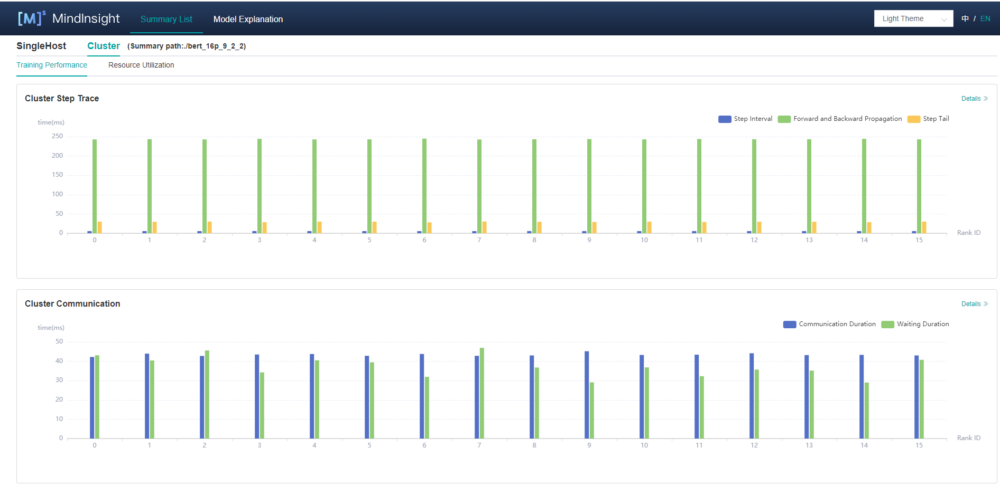

Figure 1: overview of cluster training performance

Figure 1 is the overview of cluster training performance, which is the overall presentation of cluster iterative trajectory component and cluster communication performance component. The display contents of each component are as follows:

- Cluster iteration trajectory: The iterative trajectory information of all devices in the cluster is displayed; The overview page shows the cluster iteration trajectory performance.
- Cluster communication performance: Show the communication performance of all devices in the cluster and the link performance of the whole network; The overview page shows the cluster communication performance.
- Cluster performance helper: The helper on the left provides possible performance bottlenecks during training, and users can optimize performance according to the prompts.

### Cluster Iterative Trajectory Analysis

Using the cluster iterative trajectory analysis component, we can find out the slow host and slow device in cluster training. Cluster iteration trajectory analysis component shows the iteration information of all devices, including step interval, forward and backward, iteration trailing, and supports sorting operation. The step interval reflects the speed of the data processing stage, and the step interval time of the device can reflect the speed of the corresponding host processing data. The forward and backward time of the device reflects the computing power of the device. Iterative tailing reflects all_reduce time and parallelism.

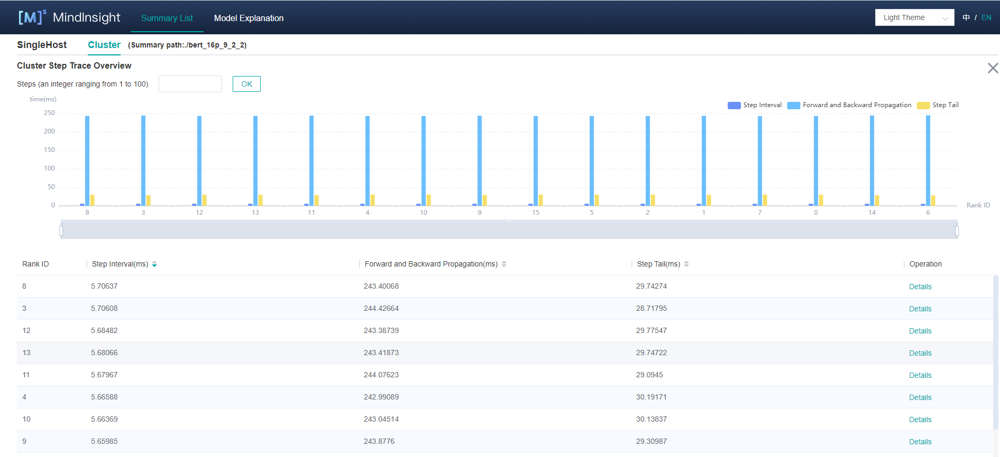

Figure 2: cluster iteration trajectory analysis

Figure 2 shows the cluster iteration trajectory analysis page. By default, it shows the average performance of the device. It supports querying the iteration trajectory information of the device under a specific step. By clicking the details link in the single device, you can also jump to the detailed performance display page of the single device to query the detailed performance data of the single device.

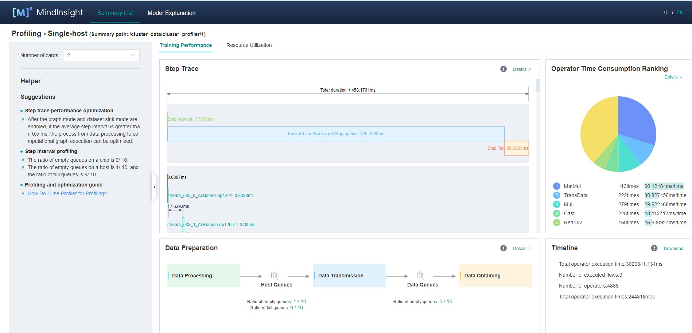

Figure 3: single device details

Figure 3 shows the performance information of a single device in the cluster. Please refer to [single device performance information](https://www.mindspore.cn/mindinsight/docs/en/master/performance_profiling_ascend.html) for the performance information of a single device.

### Cluster Communication and Computation Overlap Time Analysis

Cluster communication and computational overlap time analysis components are used in pipeline parallel and model parallel mode to identify slow hosts and slow devices in cluster training.

The cluster communication and computation overlap time analysis components add five new indicators: Communication Time(including the receive operator only), Stage Time, Communication Time, Computation Time, Communication Time(not including the receive operator).

- Communication Time(including the receive operator only): only the point-to-point(receive) communication operator is executed, and the calculation operator does not execute the time period. This time period reflects the asynchronous situation between the parallel stages of the pipeline.
- Stage Time: the time-consuming duration of each stage. This value is the duration of the step minus the duration of the receive communication operator in the step. Through this indicator, you can see which stage takes the longest time.
- Communication Time: the time period when only the communication operator is executed, and the calculation operator is not executed. If this part takes a long time, it means that the communication time-consuming has a greater impact on performance.
- Computation Time: the total execution time of AI Core operator, used to judge whether there is a slow card. The longer the time, the slower the execution speed of the corresponding card.
- Communication Time(not including the receive operator): only the time period during which other communication operators except the receive communication operators are executed, and the computation operators does not execute. When this time period accounts for a large proportion, you need to consider whether the segmentation strategy of the operators in the stage can be adjusted to reduce the time-consuming duration of this time period.

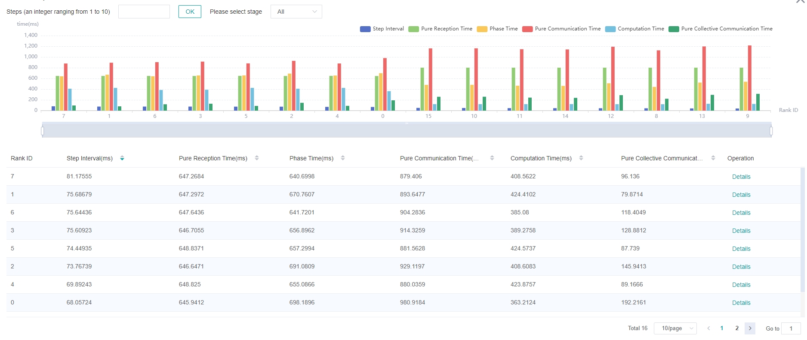

Figure 4: pipeline parallel mode analysis

Figure 4 shows the information in pipeline parallel scene, showing the average value of all step by default. The page shows step interval time, pure receive time, stage time, pure communication time, calculation time, pure collection communication time. Because the computation graph of the whole network is divided into subgraph of multiple stages, the stage time can be used to locate the slow stage, and the device of the same stage can be filtered out by selecting the stage number, and the idea of model parallel mode can be used to locate the bottleneck within the stage.

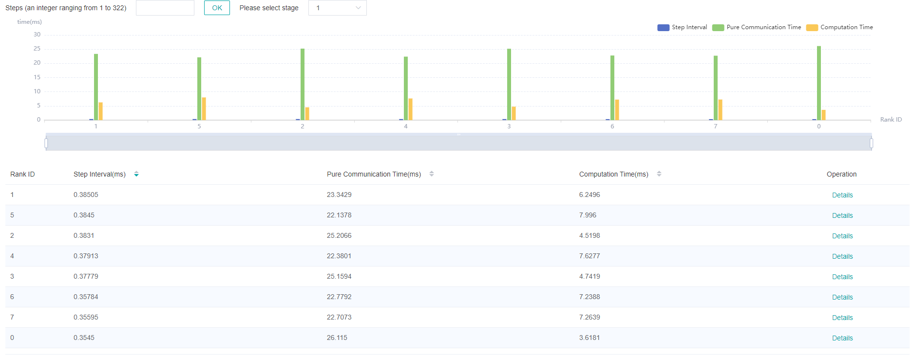

Figure 5: model parallel mode analysis

Figure 5 shows the information in model parallel scene(here refers to the in-layer model parallel), showing the average value of all step by default. The page shows step interval time, pure communication time, and calculation time. Computation time can be used to locate slow devices. If there is no slow device, observe the communication time and computation time ratio, if the communication time is relatively large, consider whether there is a slow link.

### Cluster Communication Performance Analysis

The cluster communication performance component displays the cluster communication performance information from two dimensions: device granularity and whole network link.

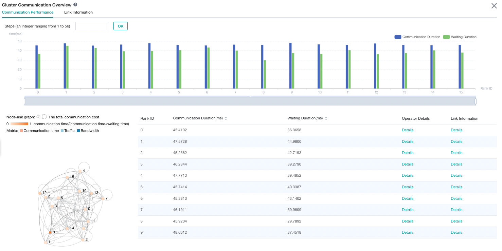

Figure 6: cluster communication performance analysis

Figure 6 shows the analysis page of cluster communication performance, including the communication performance of logic device and the link information of the whole network (all logic device link information).

Logic device communication performance tab page is mainly used to show the communication performance of logic device, including communication time, waiting time, operator details, logic device link information.

- Communication time: Represents the communication time of the communication operator. If the communication time is too long, there may be a problem with a link, and the specific link can be located through the link bandwidth. The calculation method of communication time is to count the total communication operator time of SDMA link (intra server communication) and RDMA link (inter server communication). If it is the SDMA link, the total time of `Reduce inline` and `Memcpy` operators is taken as the communication time; If it is the RDMA link, the total time of three consecutive operators `RDMASendPayload`, `RDMASendNotify`, `Notify Wait` is taken as the communication time.
- Waiting time: Also called synchronization time. Before communication between devices, synchronization will be carried out first to ensure that the two devices are synchronized before communication. The waiting time is calculated by counting the total time consumption of all `Notify wait` operators and subtracting the time consumption of `Notify wait` operator in the communication time of RDMA link.
- Operator details: Display the communication performance with operator granularity, including the communication duration, waiting duration and link information of the communication operator.
- Logic device link information: Display the link information of the source device or the destination device. Link information includes communication time, traffic, bandwidth (traffic divided by communication time) and link type. The link types include SDMA link (intra server communication link) and RDMA link (inter server communication link). Click the details and display them by pop-up window.

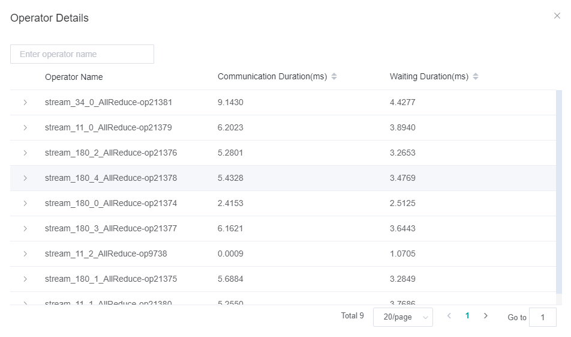

Figure 7: Operator performance information

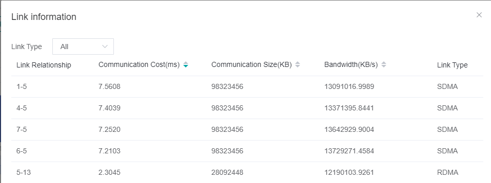

Figure 8: link information of logic device

The whole network link information tab page displays the link information of all logic devices, and provides the selection of source device, destination device and link type.

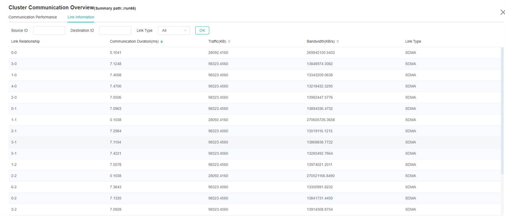

Figure 9: link information of the whole network

By default, communication performance data is not collected. You need to use the `profile_communication` parameter in `mindspore.profiler.Profiler` like `Profiler(profile_communication=True)` to turn on the communication performance data switch. It should be noted that only multi devices training can generate communication operator performance data. Setting this parameter in single device training scenario does not work.

To use MindInsight to visualize communication performance data, you need to install the communication performance data parsing WHL package provided by the supporting software package of Ascend 910 AI processor. The WHL package is released with the supporting software package. Refer to the following command to complete the installation.

```bash
pip install /usr/local/Ascend/tools/hccl_parser-{version}-py3-none-any.whl
```

## Resource Utilization

### Cluster Memory Analysis

This page shows the memory usage of the model on the **device side** in the parallel mode, which is an ideal prediction **based on the theoretical value**. The content of the page includes:

- The distribution of cluster devices, which servers and which devices are used.
- The peak memory of cluster devices, which is the ratio of peak memory to available memory.
- Click a device to jump to the memory details page of the device.

> Memory analysis does not support heterogeneous training currently.

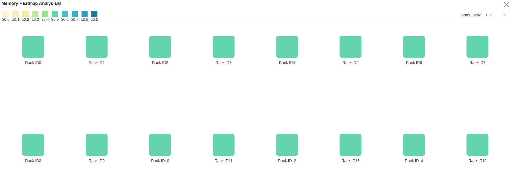

Figure 10: The page of cluster memory analysis

### Cluster FLOPs Analysis

This page shows the FLOPs data for each device in the parallel mode. The content of the page includes:

- The distribution of cluster devices, which servers and which devices are used.
- The relative size of FLOPs among cluster devices. The color of the corresponding rectangular block of each device represents the ratio of FLOPs of the current device to the maximum FLOPs of all devices.
- Click on a device to jump to the operator time-consuming details page of the device, which contains detailed data for FLOPs.

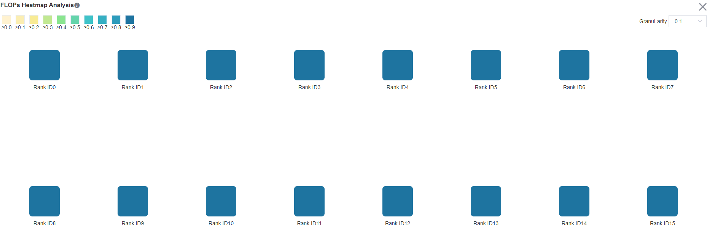

Figure 11: The page of cluster FLOPs analysis

## Strategy Perception

Strategy Perception includes Computational Graph Exploration module, Parallel Strategy Analysis module, etc.

### Graph Exploration Module

#### General Introduction

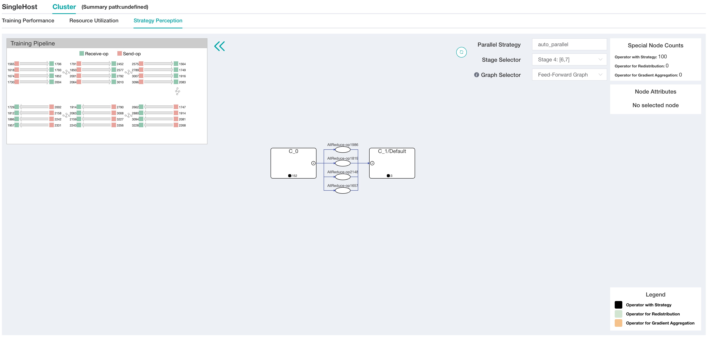

Figure 12: The Page of Strategy Perception

The upper right corner of the page will show the parallel mode of this training. The figure above shows that the parallel mode in the current training is auto parallel.

Users can choose computational graphs of different stages to explore. Users can also use the graph selector to extract communication nodes from specific parts of the computational graph (feed-forward graph, back-propagation graph, and recompute graph).

When the aggregation node is not expanded, it will show statistics of different special operators, like operators with strategy, operators for redistribution, and operators for gradient aggregation. The colors of the three types of operators are shown in the legend.

By clicking a certain node (operator or aggregation node), the node attributes panel will show the inputs and outputs of the node and its shard methods. The input and output nodes can be tracked by clicking.

### Operator Strategy Matrix

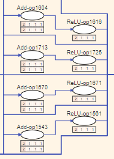

Figure 13: Operator Strategy Matrix

If an input node of the operator has shard methods, a strategy matrix will be presented below the operator. One row represents the shard method of a certain input node. The number in the small grid cell represents the number of slices of the input node in the corresponding dimension.

The corresponding input edges will be highlighted when hovering on the strategy matrix. Along with the input and output locating feature, users can analyze the rationality of the operator's shard method and adjust accordingly if needed.

### Training Pipeline

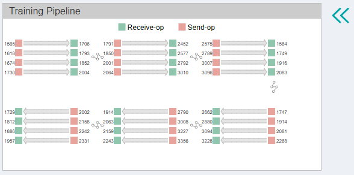

Figure 14: Training Pipeline

When the pipeline parallel strategy is adopted, click the button in the upper left corner to expand the training pipeline panel. This panel shows the send operators (red rectangles) and receive operators (green rectangles) in each stage and their correspondences between different stages. The rectangles (operators) can be clicked and the corresponding operator will be focused in the computational graph.

With the training pipeline panel, users can evaluate the rationality of stage segmentation and analyze the design space of pipeline parallel strategy, the number of micro-batches, etc.

## Specifications

- To limit the data size generated by the Profiler, MindInsight suggests that for large neural networks, the profiled steps should be less than 10.

  > The number of steps can be controlled by controlling the size of training data set. For example, the `num_samples` parameter in `mindspore.dataset.MindDataset` can control the size of the data set. For details, please refer to:
  > <https://www.mindspore.cn/docs/api/en/master/api_python/dataset/mindspore.dataset.MindDataset.html>

- The parse of Timeline data is time consuming, and usually the data of a few steps is enough to analyze the results. In order to speed up the data parse and UI display, Profiler will show at most 20M data (Contain 10+ step information for large networks).

## Notices

- Currently running in PyNative mode is not supported.
- Currently the training and inference process does not support performance debugging, only individual training or inference is supported.
